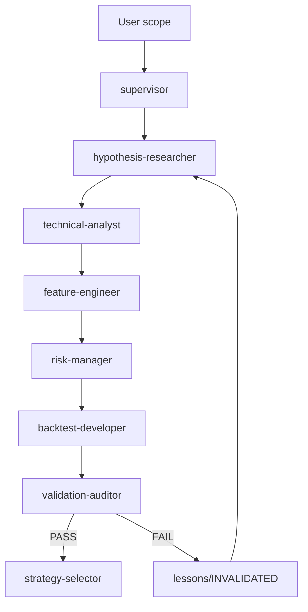
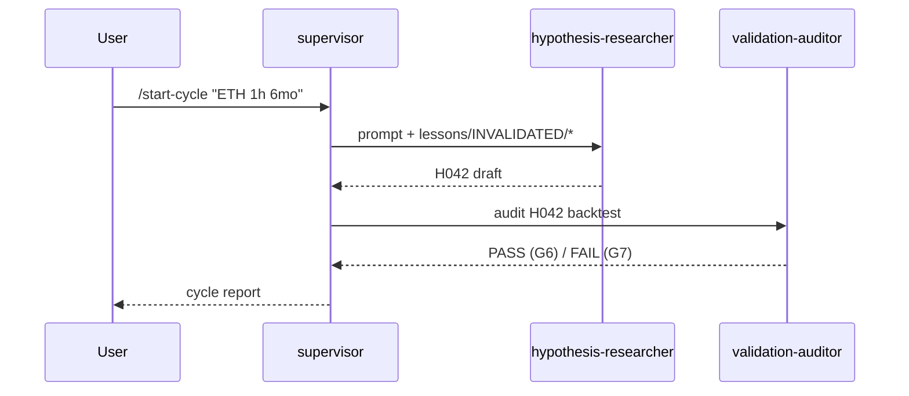
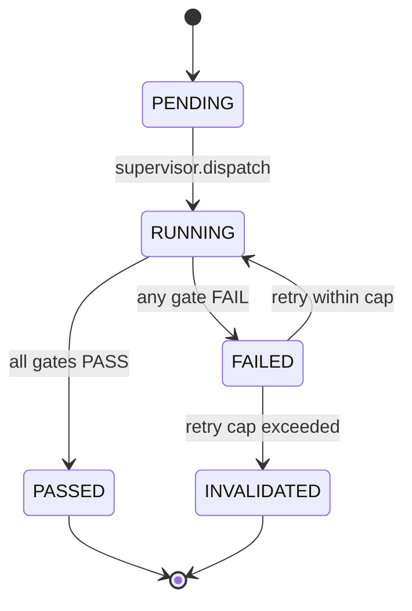
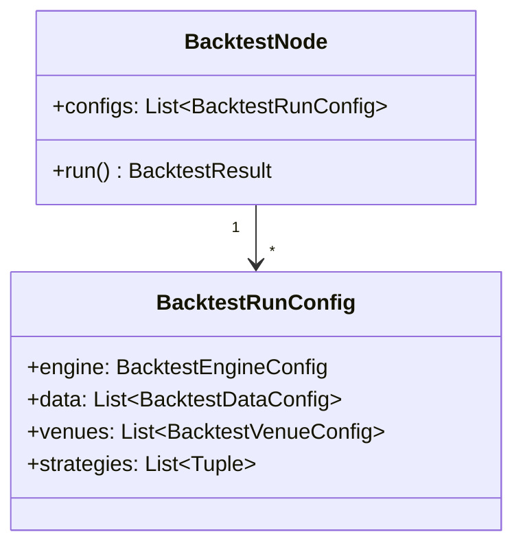
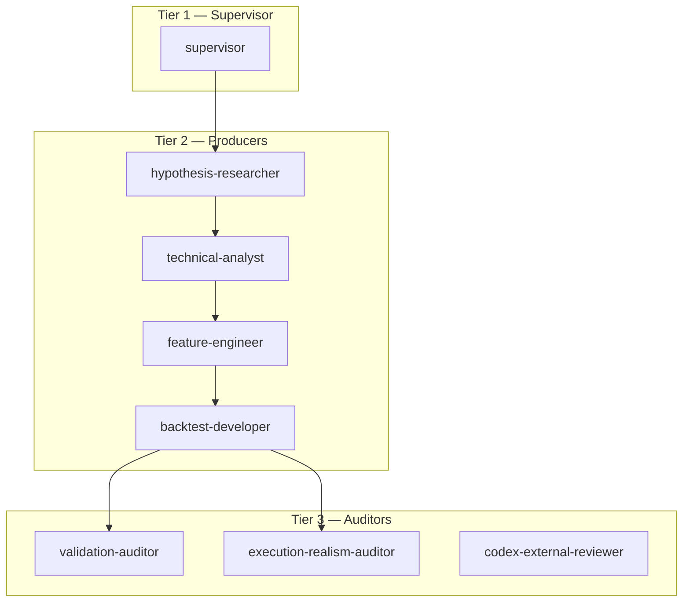
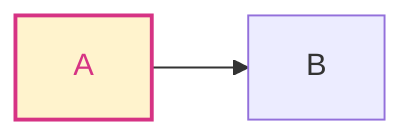

# Mermaid Conventions Skill

CLAUDE.md §10 mandates Mermaid as the default diagram language. SVG and
PNG are fallbacks only when Mermaid cannot express the diagram or when
the Mermaid block becomes unreadable.

## 1. Diagram-type mapping

| Concept | Mermaid block type |
|---|---|
| Agent dispatch, pipeline, ETL | `flowchart` |
| Inter-agent messaging or API request/response | `sequenceDiagram` |
| Cycle status (pending / running / passed / failed / invalidated) | `stateDiagram-v2` |
| Class or component relationships | `classDiagram` |
| Entity-relationship | `erDiagram` |
| Timeline of events | `timeline` |
| Quadrant comparison (e.g. risk vs. reward) | `quadrantChart` |
| Gantt (rare — only for scheduled work) | `gantt` |

## 2. Skeletons

### Flowchart



Direction tokens: `TD` (top-down, default), `LR` (left-right), `BT`
(bottom-top), `RL` (right-left). Use `TD` for pipelines, `LR` for state
machines when the state count is high.

### Sequence



Use `->>` for synchronous, `-->>` for response, `-)` for async dispatch.

### State



### Class



## 3. Style and naming

- **Node IDs** are uppercase alphanumeric with no spaces. Labels carry
  the human-readable text in square brackets: `BT[backtest-developer]`.
- **Edge labels** describe the transition condition or the artifact
  flowing across: `--|PASS|-->`, `-->|H042_run<RUN>.json|-->`.
- **Participant names** in `sequenceDiagram` use a single short alias
  with a meaningful `as` label.
- Limit a flowchart to **20 nodes** per block. Split into multiple
  blocks with explicit cross-references when the count exceeds the
  limit.

## 4. Subgraphs for tier separation

The project has three tiers (supervisor / producers / auditors). Use
`subgraph` to mirror the tier separation visually:



A producer never points into Tier 3 directly except through the
supervisor's dispatch — the diagram makes the rule visible.

## 5. Color and emphasis — sparingly

Mermaid supports `style` for color, but the default theme is preferred
because the project's renderers vary. Reserve color for **risk** edges
only:



The rule: at most one color theme per diagram, and only when the
information cannot be expressed by edge labels alone.

## 6. When Mermaid is not enough — fallback policy

| Symptom | Action |
|---|---|
| Block exceeds 20 nodes | split into multiple blocks |
| Cross-references span ≥ 4 diagrams | extract a glossary node table |
| Layout becomes unreadable in GitHub render | export to SVG, commit under `docs/diagrams/<name>.svg`, reference relatively |
| Mathematical content (Greek letters, equations) | use LaTeX block alongside Mermaid (Mermaid does not render TeX) |
| Truly free-form layout (e.g. a venue topology with absolute positions) | external SVG; reference relatively |

A diagram that requires SVG always carries a Mermaid skeleton at the top
of the section so future edits do not need a vector editor.

## 7. Embedding rules in markdown

- The diagram is preceded by a one-line caption that identifies what it
  shows. Example: "Cycle dispatch and retry flow."
- The diagram is followed by a one-paragraph reading guide if the
  diagram has more than 10 nodes.
- If the diagram is in an agent prompt or workflow spec, the agent reads
  the surrounding caption — the diagram itself is not load-bearing for
  reasoning; the prose is.

## 8. Linting

Mermaid syntax errors are caught by GitHub's renderer at PR time. The
artifact linter (`scripts/lint_artifact.py`) verifies only block
delimiters (the opening ` ```mermaid ` and the closing ` ``` `) and node
count. Semantic correctness is the producer's responsibility.

## 9. Acceptance checklist

- [ ] All diagrams in the artifact are Mermaid (or have an explicit
      Mermaid skeleton plus an SVG fallback)
- [ ] Each Mermaid block opens with `mermaid` fenced and closes properly
- [ ] Direction token (`TD` / `LR` / `BT` / `RL`) explicit on each
      flowchart
- [ ] Node IDs are uppercase alphanumeric; labels in square brackets
- [ ] No block exceeds 20 nodes
- [ ] Color reserved for risk; otherwise the default theme
- [ ] Caption (one line) precedes the diagram; reading guide follows
      large diagrams

## Related skills

- (none — this is the project's only diagram-conventions skill)
