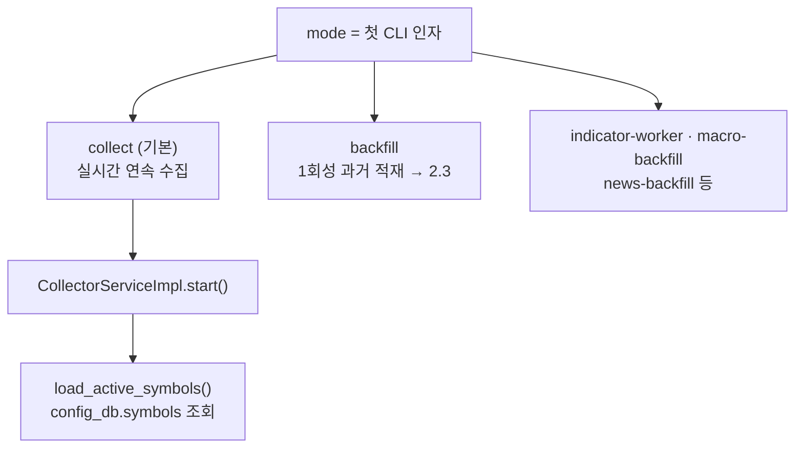
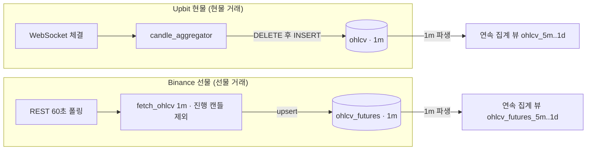
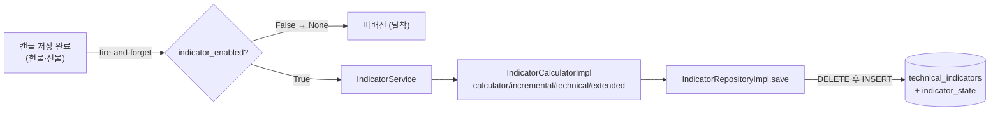
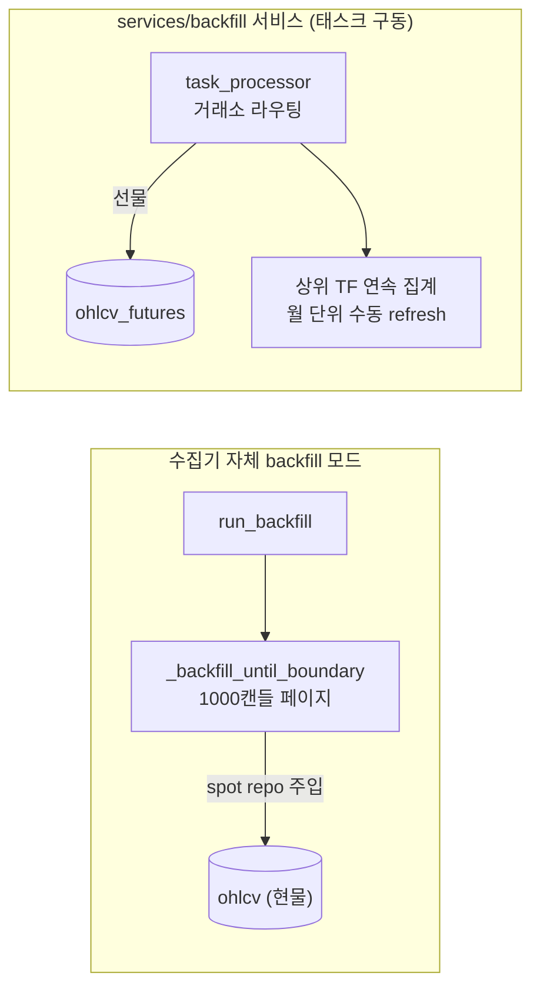
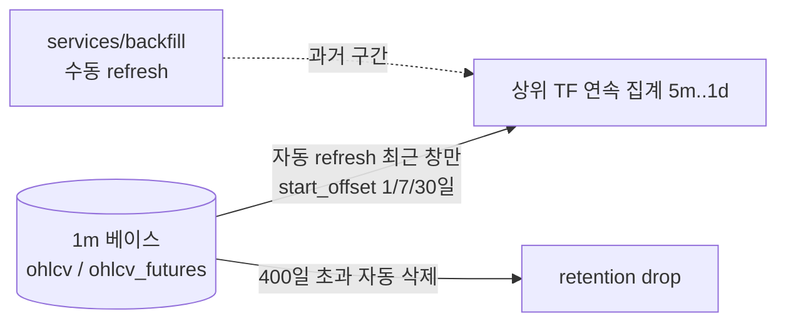
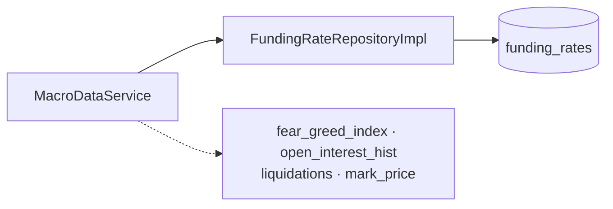

# A5 — collector 내부화 스코프 인벤토리 (crypto-data-hub, 읽기 전용 분석)

> Phase A 분석 산출물. 목적: 리포 밖 crypto-data-hub collector를 **OHLCV 적재만** 맡는 리포 내부 컴포넌트
> (`OHLCV 수집기`)로 이관하기 위해, collector가 하는 일을 분석하고, 적재(take)·지표 사전계산(drop) 경계와
> backtest 데이터 확보 방향을 정한다. 인벤토리다 — 데이터 피드 포트 설계나 `crypto_data` ERD는 여기서 하지
> 않는다. 모든 코드 사실은 `파일:줄`로 인용한다.

> **확정 정정(2026-07-26, 사용자 확정).** `crypto-data-hub`는 v2가 **사용하지 않는 참조·이식 원천**일 뿐이다.
> 이 노트가 crypto-data-hub를 분석하는 것은 v2가 참조할 사실을 모으기 위해서이며, v2가 crypto-data-hub의
> 실행 서비스·데이터베이스를 프로덕션으로 쓴다는 뜻이 아니다. 따라서 3.3의 "기존 backfill 재사용"과
> "crypto-data-hub가 `crypto_data` 생성·소유" 서술은 **"v1/crypto-data-hub 코드를 참조해 v2가 backfill·funding
> 원천과 `crypto_data` 프로비저닝을 신규 구현·소유한다"**로 읽는다. OHLCV 적재 수집기는 `services/collector/`로
> 이미 신규 구현했다(별도 PR).

원천 리포(읽기 전용): `crypto-data-hub` (git HEAD `f6ca9cf`). 수집기는 `services/collector/`(Clean
Architecture: `domain/`·`application/`·`infrastructure/`·`core/`·`main.py`).

---

## 1. 제약사항·방향

**AS-IS/TO-BE 구분 규약.** 이 노트는 【기존 collector 분석(AS-IS)】(2절)과 【새 시스템 방향(TO-BE)】(3절)을
**물리적으로 나눈다.** 2절은 현행 collector가 **무엇을 하는지**의 사실·`파일:줄`만 담고, 3절은 새 시스템의
**결정·방향만** 담는다. 기존 코드는 **가능하면 가져오되(적재 경로·확정 캔들 규약), 재활용은 필수가 아니다** —
3절 각 항목이 `취득`/`폐지`/`신규`/`인계`를 명시한다.

**방향(요약, 상세는 3절).** 현재는 리포 밖 collector가 지표를 사전계산해 `technical_indicators` 테이블에 넣고
signal-service가 그 테이블을 읽는다(감사 불가). 이 사전계산 의존을 폐지하고 signal-service·backtest가 공유 코어의
지표 계산을 직접 호출한다. collector 자체는 리포 내부 `OHLCV 수집기`로 이관해 **OHLCV 적재만** 맡는다. backtest의
과거 데이터 확보·보존은 라이브 적재와 다른 별개 관심사다(3.2).

**대상 스코프.** 단일 심볼 Binance ETH/USDT 무기한 선물. 적재 take의 1차 대상은 **선물 경로**(`ohlcv_futures`)이며,
현물(Upbit) 경로는 코드에 있으나 대상 스코프 밖이다.

**보존 불변식(신 `OHLCV 수집기`가 지킴).**
- **적재 불변식.** 확정 캔들마다 **1행·무조건**(on-change 아님). 진행 중(미마감) 캔들은 적재하지 않는다. 이
  "확정 캔들 전용" 규약이 look-ahead 방지와 지표 계산의 `close_time ≤ 판단 시각` 규약을 데이터 층에서 뒷받침한다.
- **지표 무생성.** `OHLCV 수집기`는 지표를 만들지 않는다 — 지표는 signal-service·backtest가 공유 코어로 직접
  계산한다(코드 + 호출 정책 = 확정 캔들 트리거·매 캔들·OHLCV 순수 함수, 세 실행 모드 동일).

---

## 2. 기존 collector 분석 (AS-IS) — 사실·인용만

> 여기서는 현행 collector가 **무엇을 하는지**만 기록한다. 무엇을 취득/폐지할지는 3절(TO-BE)에서 정한다.
> 5개 주제(OHLCV 적재 · 지표 · 과거 데이터 · 인접 적재 · 의존성)로 나누며, 3절이 같은 순서로 대응한다.

### 2.1 OHLCV 적재 (현물·선물 두 테이블)

**실행 모드.** `services/collector/main.py`가 첫 CLI 인자 `mode`로 실행 모드를 고른다 — `collect`(기본, 실시간
연속 적재; 이 절)·`backfill`(1회성 과거 적재; 2.3)·`indicator-worker`·`macro-backfill`·`news-backfill` 등.



| 노드 | 코드 위치 | 사실 |
|---|---|---|
| mode 분기 | `services/collector/main.py:448` (`services/collector/main.py:450-481`) | 첫 인자로 `collect`(기본)·`backfill`·`indicator-worker`·`macro-backfill`·`news-backfill` 등 선택 |
| 실시간 오케스트레이터 | `CollectorServiceImpl.start()`(`collector_service_impl.py`) | `collect` 모드의 연속 수집 진입점 |
| 심볼 로딩 | `load_active_symbols()`(`collector_service_impl.py:119`) | `config_db`의 `symbols` 테이블(`init-scripts/02-init-config-db.sql:27`)에서 조회(정적 시드 아님) |

**적재 경로 — 두 테이블.** collector는 라이브·페이퍼 트레이딩용으로 확정 1m 캔들을 **두 테이블**에 적재한다: **`ohlcv`**(Upbit 현물 거래용)와
**`ohlcv_futures`**(Binance 선물 거래용). 두 경로 모두 **1m만** 적재하고, 상위 TF(5m~1d)는 1m 베이스에서 파생한
TimescaleDB 연속 집계 뷰다(적재가 아니라 뷰).



**노드 정의 (코드 출처).**

| 노드 | 코드 위치 | 사실 |
|---|---|---|
| Upbit WebSocket 체결 | `_watch_symbol_trades`(`collector_service_impl.py:168`) | ccxt.pro 체결 스트림 |
| candle_aggregator | `candle_aggregator.process_trade`(`collector_service_impl.py:189`) | 체결 → 1m 캔들 집계 |
| `ohlcv` 적재 | `CandleRepositoryImpl.save`(`candle_repository_impl.py:19`) | DELETE 후 INSERT, 테이블 `ohlcv` |
| Binance REST 폴링 | `_poll_symbol_ohlcv`(`collector_service_impl.py:260`) | 분 경계 정렬 +2초, 60초 주기, 최근 3캔들 조회 후 저장분 skip(`collector_service_impl.py:285-333`) |
| fetch_ohlcv | `BinanceFuturesClient.fetch_ohlcv(symbol, '1m', limit=2)`(`binance_futures_client.py:88`) | ccxt.binanceusdm(`binance_futures_client.py:48-55`); **진행 캔들 제외** `completed = ohlcv_list[:-1]`(`binance_futures_client.py:117`) |
| `ohlcv_futures` 적재 | `FuturesCandleRepositoryImpl.save`(`futures_candle_repository_impl.py:19`) | upsert `ON CONFLICT (time,symbol,exchange,timeframe) DO UPDATE`; 배치 `save_batch`(`futures_candle_repository_impl.py:60`) |
| 연속 집계 뷰 | 선물 `init-scripts/07-init-binance-futures.sql:70-200`·현물 `init-scripts/03-init-crypto-data.sql:108-238` | 1m 베이스 파생 뷰(적재하지 않음), `ohlcv(_futures)_5m…1d` |

**적재 타임프레임 = 1m 단일.** 두 경로 모두 1m만 적재한다(선물 폴링 `fetch_ohlcv(symbol, '1m', limit=3)`
`collector_service_impl.py:288`; 현물 기본 `Timeframe.ONE_MINUTE` `collector_service_impl.py:50`,
`core/config.py:29` `default_timeframe="1m"`). `Timeframe` enum(`domain/entities/timeframe.py:7`)은 1m~1d를
정의하지만 **적재하는 것은 1m뿐**이고, 상위 TF는 위 연속 집계 뷰로만 존재한다.

**`ohlcv_futures` 테이블 정의**(`init-scripts/07-init-binance-futures.sql:24`). `ohlcv`(현물)도 컬럼 구성이 같다:

```sql
CREATE TABLE ohlcv_futures (
  time        TIMESTAMPTZ NOT NULL,
  symbol      VARCHAR(30) NOT NULL,
  exchange    VARCHAR(20) NOT NULL DEFAULT 'binance',
  timeframe   VARCHAR(10) NOT NULL,
  open  NUMERIC(20,8), high NUMERIC(20,8), low NUMERIC(20,8), close NUMERIC(20,8),
  volume NUMERIC(30,8), quote_volume NUMERIC(30,8), trade_count INTEGER,
  ingest_time TIMESTAMPTZ DEFAULT NOW(),        -- 데이터 지연 모니터링
  PRIMARY KEY (time, symbol, exchange, timeframe)
);  -- hypertable
```

### 2.2 지표 사전계산

OHLCV 적재와 **깨끗이 분리**된 별개 관심사다: 캔들 저장 **이후** fire-and-forget로 트리거되고 `indicator_enabled`
토글로 붙는다(비활성 시 아예 배선되지 않음).



| 노드 | 코드 위치 | 사실 |
|---|---|---|
| 저장 후 트리거 | 현물 `collector_service_impl.py:206-222`·선물 `collector_service_impl.py:306-322`; 상위 TF는 `TimeframeScheduler` 콜백(`collector_service_impl.py:646`, `timeframe_scheduler.py:26`) | 저장과 격리된 백그라운드 태스크 |
| 게이트 | `core/config.py:53` `indicator_enabled:bool=True`; `core/dependencies.py:243` `get_indicator_service` | 비활성 시 `None` 반환 = 선택적·탈착 가능, 적재 write 경로와 결합 없음 |
| IndicatorService | `indicator_service.py:25` (`calculate_and_save_1m` `indicator_service.py:70`·`calculate_and_save_higher_tf` `indicator_service.py:135`) | 계산 오케스트레이션 |
| 계산 엔진 | `IndicatorCalculatorImpl`(`calculator.py`; `incremental.py`·`technical.py`·`extended.py`) | 지표 수학 |
| 적재 | `IndicatorRepositoryImpl.save`(`indicator_repository_impl.py:75`, 배치 `indicator_repository_impl.py:111`) | DELETE 후 INSERT `technical_indicators`; 증분 상태 `indicator_state`(`indicator_repository_impl.py:245`) |

**`technical_indicators` 컬럼군**(`init-scripts/09-init-technical-indicators.sql:19-136`, 참고 — 폐지 대상 읽기
스키마). 분류별:

| 분류 | 컬럼군 |
|---|---|
| 모멘텀 | RSI(5/7/10/14/21) · Stochastic(k/d) · MACD(line/signal/histogram) |
| 이동평균·추세 | EMA(7/9/18/21/36/55/200/9_hl2) · PSAR(value/bull_trend) · Heikin-Ashi(o/h/l/c/bull/bear) |
| 변동성 | ATR14 · weekly_atr · Bollinger(upper/middle/lower) · low_volatility · atr_trailing_stop |
| 거래량·오더플로우 | OBV(obv/obv_ma_10) · VWAP(vwap/upper/lower) · Volume Profile(poc/vah/val) · delta(delta/delta_ema_5) · volume_ma_20 · absorption/accumulation/aggression |
| 지지·저항·구간 | Fractal(res/sup 5/8/13) · ORB(high/low) |
| 복합 | energy_score |

### 2.3 과거 데이터 확보·보존

세 가지 — backfill로 어떻게 채우나 · 상위 TF 집계 refresh · retention(보존 한계) — 가 backtest 과거 데이터
가용성을 좌우한다.

**backfill 메커니즘 (과거 대량 적재).** 기존 backfill은 둘이며 **선물·현물이 갈린다.**



| 메커니즘 | 코드 위치 | 적재 대상·특징 |
|---|---|---|
| 수집기 backfill 모드 | `run_backfill`(`services/collector/main.py:450-452`) → `_backfill_until_boundary`(`services/collector/application/services/historical_data_service_impl.py:188-263`); 첫 가용일 `_find_first_available_date`(`historical_data_service_impl.py:98`) | **현물 `ohlcv`에만** 씀(`services/collector/core/dependencies.py:358-362` spot `CandleRepositoryImpl` → `candle_repository_impl.py:137` `INSERT INTO ohlcv`). `ohlcv_futures` 미접촉·집계 refresh 안 함 |
| `services/backfill/` 서비스 | 태스크 구동(`services/backfill/main.py:79` `poll_interval=10`); `services/backfill/application/services/task_processor.py:135·141`, `FUTURES_EXCHANGES`(`services/backfill/domain/constants.py:12`) | **선물 `ohlcv_futures` 적재** + 채운 구간 **상위 TF 집계 월 단위 수동 refresh**(`services/backfill/application/services/task_processor.py:150·215-222` `refresh_continuous_aggregate`) |

**연속 집계 refresh·retention (TimescaleDB 특성).** 연속 집계는 최근 창만 자동 갱신되고, 베이스 1m은 400일 뒤
삭제된다.



| 정책 | 값 | 코드 위치 |
|---|---|---|
| 연속 집계 auto-refresh `start_offset` | 5m·15m = 1일, 1h·4h = 7일, 1d = 30일 (좁음) | `add_continuous_aggregate_policy`(`init-scripts/07-init-binance-futures.sql:89-197`) |
| 과거 구간 | 배경 정책 미갱신 → **수동 refresh 필요**(위 backfill 참조 — 수집기 backfill은 안 함, `services/backfill/`만) | 설계 주석 `init-scripts/03-init-crypto-data.sql:127-128` "Historical backfill will trigger manual refresh" |
| retention | `ohlcv`·`ohlcv_futures` 둘 다 **400일**(집계 뷰엔 없음 — 베이스 hypertable만) | `add_retention_policy(… '400 days')` `init-scripts/07-init-binance-futures.sql:202`·`init-scripts/03-init-crypto-data.sql:242`; 사유 "200일선 MA + 200일 조회" |

상위 TF 연속 집계(`ohlcv_futures_5m/15m/1h/4h/1d`)는 `init-scripts/07-init-binance-futures.sql:70-197`에 정의된다.

### 2.4 인접 적재 (펀딩·macro/파생)

OHLCV도 지표도 아닌 **제3의 관심사**로, `MacroDataService`가 별도 테이블에 적재한다.



| 적재 | 코드 위치 | 대상 |
|---|---|---|
| 펀딩 rate | `MacroDataService`(`core/dependencies.py:478`, `collector_service_impl.py:656`) → `FundingRateRepositoryImpl`(`core/dependencies.py:424`) | 테이블 `funding_rates`(`init-scripts/11-init-macro-data.sql:20`: `time·symbol·exchange·funding_rate NUMERIC(20,10)·mark_price·created_at`) |
| 기타 macro/파생 | `init-scripts/15-init-derivatives-data.sql` 등 | `fear_greed_index`·`open_interest_hist`·`liquidations`·`mark_price` |

### 2.5 의존성·설정·크리덴셜

**의존성**(`services/collector/requirements.txt`). 전용 스케줄러 없음(수제 `asyncio` 루프).

| 패키지 | 버전 | 용도 |
|---|---|---|
| `ccxt` | 4.5.11 | 거래소 REST + ccxt.pro WS |
| `psycopg2-binary` | 2.9.9 | Postgres 드라이버 |
| `pydantic` / `pydantic-settings` | 2.5.0 / 2.1.0 | 설정·검증 |
| `numpy` / `pandas` | 1.26.4 / 2.2.3 | 지표 수학(지표 폐지 시 함께 제거 후보) |
| `aiohttp` | ≥3.9.0 | macro/news REST |
| `python-dotenv` | 1.0.0 | `.env` 로딩 |

**설정**(`services/collector/core/config.py`):

| 설정 | 위치 | 값 |
|---|---|---|
| `config_db_url`·`data_db_url` | `core/config.py:20-21` | DB 접속 |
| `default_exchange` | `core/config.py:28` | `"upbit"` |
| `default_timeframe` | `core/config.py:29` | `"1m"` |
| `backfill_start_date`·`backfill_timeframe` | `core/config.py:35-36` | `None` · `"1m"` |
| 지표 토글 / macro·derivatives·news 토글 | `core/config.py:52-56` / `core/config.py:58-85` | on/off |

**DB 접근:**

| 접근 | 대상 | 유저/역할 |
|---|---|---|
| 쓰기 | `crypto_data` | `data_writer` |
| 읽기 | `config_db.symbols` | `config_reader` |

**크리덴셜**(디스크 `.env`; gitignore 추적 제외, `.env.example`은 플레이스홀더만; 마스킹 앞 2자+`***`).
`docker-compose.yml`은 `${VAR}` 보간이라 리터럴 비밀 없음.

| 키 | 위치 | 비고 |
|---|---|---|
| `POSTGRES_PASSWORD` | `.env:3` | DB 슈퍼유저 |
| `CONFIG_ADMIN/READER`·`DATA_WRITER/READER` PW | `.env:6/7/8/9` | 역할별 |
| DSN(config/data) | `.env:16/17` | 접속(비밀 내장) |
| `SECRET_KEY` | `.env:27` | |
| `NEWS_API_KEY` | `.env:40` | **실 64자 CryptoCompare 키** |
| 거래소 키 | `.env:21-22` | 공란(공개 시장 데이터만) |

---

## 3. 새 시스템 방향 (TO-BE) — 결정·방향만

> 2절과 **같은 5개 주제 순서**로 각 기존 요소를 어떻게 할지 결정한다: `취득`(내부화)·`폐지`·`신규`·`인계`(후속
> 설계로). **재활용은 필수가 아니다.** (§2.N ↔ §3.N 대응)

### 3.1 OHLCV 적재 — `OHLCV 수집기` = 적재만

**무엇을 만드나.** 거래소에서 Binance 선물 1분봉을 받아 `ohlcv_futures`에 적재하는 리포 내부 컴포넌트다. 라이브
수집의 **적재 부분만** 떼어 내부화한다(지표는 3.2에서 폐지).

**어떻게 구현하나 (취득 — 기존 적재 코드 재활용).** 이미 라이브에서 동작하는 적재 메커니즘을 그대로 쓴다.

- 확정 1분봉 REST 폴링(분 경계 정렬, 60초 주기)
- 진행 중(미마감) 캔들을 잘라내고 확정 캔들만 남기기
- `ohlcv_futures`에 upsert 저장(`ON CONFLICT … DO UPDATE`)

세 가지의 코드·정책은 Binance 선물 적재 경로에 이미 있으니 그대로 가져온다(Chapter 2.1 참고). 다만 순수 적재
밖의 라이브 인프라가 얽혀 있으면 잘라낸다 — 재활용하되 필수는 아니다.

**제약 (반드시 지킬 것).**

- 확정 캔들마다 한 행씩, 무조건 적재한다(값이 바뀔 때만 넣는 on-change가 아니다).
- 진행 중 캔들은 적재하지 않는다 — 이것이 look-ahead(미래 데이터 참조) 방지의 데이터 층 근거다.
- 지표를 만들지 않는다(지표 계산은 3.2).
- 단일 심볼 Binance 선물만 가져온다. 현물(Upbit) 경로는 코드에 있으나 스코프 밖이라 가져오지 않는다(존재만
  기록, 향후 다중 시장 확장 시 재검토).

### 3.2 지표 사전계산 — 폐지 + 대체 계산

**무엇을 버리나 (폐지).** 지표를 미리 계산해 테이블에 넣던 경로 전부를 뺀다 — `technical_indicators` 읽기·쓰기,
`indicator_state`, 지표 서비스·계산 엔진·리포지토리, 스케줄러의 지표 콜백(Chapter 2.2 참고). 폐지되는 것은
collector가 지표를 만들던 **역할**이지 지표 계산 **능력**이 아니다.

**지표는 어떻게 계산하나 (폐지의 대체 방향).** collector가 미리 계산해 넣던 것을 없애는 대신, signal-service(라이브)와
backtest 엔진이 각자 공유 코어(`core_lib.indicators`)로 **직접 계산**한다. 방향은 넷이다.

- **호출 정책을 라이브·backtest가 통일한다.** 확정 캔들마다(매 캔들 무조건), 그 시점까지의 확정 OHLCV만 입력으로
  받는 순수 함수로 계산한다. 코드가 같은 것(DRY)만으로는 부족하고 이 **트리거·입력 정책**까지 같아야 세 실행
  모드(backtest·paper·live)의 지표 값이 갈리지 않는다. OHLCV가 아직 안 왔으면 계산하지 않고 기다린다(fail-safe).
- **증분 계산(캔들당 O(1)).** run마다 **필요한 지표 집합만** 설정으로 골라 증분 갱신한다 — 82종을 매 캔들 전부
  계산하지 않는다.
- **테이블에 저장하지 않고 인프로세스로.** 공유 테이블에 넣고 읽던 구조가 사라져 값이 낡을(staleness) 여지가
  없다. backtest는 계산한 지표를 run별 Evidence(Feature/Indicator Snapshot)에 남겨 재현 근거로 삼는다.
- **상세는 지표 설계로 인계.** 지표의 실제 목록(82종)·수식·seed 통일 규약은 지표 인벤토리와 core-lib 클래스
  설계가 확정한다. 이 노트는 collector 역할 폐지에 따른 **대체 계산 방향**만 고정한다.

### 3.3 과거 데이터 확보·보존

**방향(사용자 확정).** 신규 보존 장치를 만들지 않는다. **기존 backfill 서비스를 재사용**해 과거 구간을 채우고,
**`ohlcv_futures`의 retention을 늘려** 그 데이터가 삭제되지 않게 보존한다(별도 스냅샷·면제 테이블 없음).

**어떻게 (취득 — 기존 backfill 재사용).**

- **과거 구간 적재.** `services/backfill/` 서비스가 이미 Binance 선물 `ohlcv_futures`를 날짜 범위로 대량 backfill하고,
  채운 구간의 상위 TF 연속 집계까지 수동 refresh한다(Chapter 2.3 참고). backtest가 필요한 기간을 이 서비스로 한 번
  채운다 — **특정 시작일을 가정하지 않고** 필요한 범위를 backfill하고, 실제 확보 하한은 `MIN(time)`으로 확인한다.
  (수집기 자체 backfill 모드는 현물 전용이라 선물엔 못 쓴다.)
- **보존.** `ohlcv_futures`의 retention을 늘린다(예: 400일 → 2000일 ≈ 5.5년). 그러면 backtest가 쓸 과거 구간이
  자동 삭제되지 않는다(현행 400일은 Chapter 2.3 참고).

**성능·용량 (문제 없음).** 단일 심볼(ETH/USDT 선물) 1분봉은 2000일이면 약 288만 행(2000일 × 1440분)이다.
TimescaleDB 압축(7일 후 적용)으로 과거 구간이 크게 줄어 실제 용량은 수백 MB 수준이라 부담이 없다. backfill도
1회성(1000캔들 페이지)이라 상시 비용이 아니다. retention은 **테이블별 정책**이라 `ohlcv_futures`에만 길게 걸고,
폐지 대상 `technical_indicators` 등 다른 테이블은 건드리지 않는다.

**상위 TF 읽기.** backfill 서비스가 집계를 refresh하므로 backtest가 DB 연속 집계 뷰를 그대로 읽어도 되고, 1m만
읽어 엔진에서 리샘플해도 된다(미확정 마지막 버킷을 버리는 look-ahead 리샘플과 정합). 둘 중 무엇을 쓸지는 데이터
피드 포트·엔진 설계가 정한다.

**재현성.** 확정된 과거 캔들은 바뀌지 않으므로 같은 기간을 읽는 backtest는 재현된다. 사용한 원천·범위는 Evidence의
Source Data Snapshot에 기록한다(감사·재현 근거). retention 창(2000일)보다 더 오래된 구간까지 영구 재현이 필요하면
그때만 원천을 복사해 두는 선택지가 있으나, 현재 스코프에선 retention 연장으로 충분하다.

**1m 적재 필수성.** 1m 적재는 모든 TF의 베이스이자 (유보 중인) 1m 집행 피드의 데이터원이라 무조건 필수다 —
실행·비용·사이징 인벤토리의 1m 하위 집행 피드 유보(집행은 캔들 수준 보수 판정)와 독립이다.

**인계.** 정확한 retention 일수와 "집계 뷰 읽기 vs 1m 리샘플" 선택은 `crypto_data` DB 설계·데이터 피드 포트 설계가
확정한다. 이 노트는 방향(기존 backfill 재사용 + retention 연장)을 고정한다.

### 3.4 인접 적재 (펀딩·macro/파생) — 소비 원천 경계

- **펀딩 = 소비 원천(폐지 아님).** backtest는 펀딩 데이터가 **필요**하다(이산 펀딩 정산 — 과거 실측 rate를 데이터
  피드로 주입, 실행·비용·사이징 인벤토리). `funding_rates`(Chapter 2.4 참고)는 backtest가 읽는 **필수 원천**이다.
  그 **적재**를 OHLCV와 함께 내부화할지 별도 공급자로 둘지는 컴포넌트·DB 설계로 **인계**하되, 넘기는 것은 **적재
  위치**뿐이며 **소비 필수성**은 이 노트가 확정해 후속 단계가 다시 열지 않는다.
- **기타 macro/파생(스코프 밖).** `fear_greed_index`·`open_interest_hist`·`liquidations`·`mark_price`(Chapter
  2.4 참고)는 현재 단일 심볼 backtest 스코프 밖 — 지표-폐지 대상이 아니라 단지 `OHLCV 수집기`에 취득하지 않는다.

### 3.5 의존성·설정·크리덴셜

**의존성 정리.** 적재에 필요한 `ccxt`·`psycopg2`·`pydantic-settings`는 유지한다. 지표와 함께 빠지는 `pandas`·
`numpy`(지표 수학용)는 적재 전용 경로에서 제거 후보다(다른 곳에서 필요하면 별도 판단; Chapter 2.5 참고).

**크리덴셜 저장 방식.** collector `.env`(Chapter 2.5 참고)는 이미 gitignore 추적 제외라 **올바른 저장 방식**이고
값도 유지한다(타입·config·DB 인벤토리의 저장 방식 변경 결정과 동일 결). 예외로 실 외부 API 키
`NEWS_API_KEY`(`.env:40`)는 외부 유료 키라 유출 정황 시 값을 바꾼다(news 기능과 함께 폐지되나, 폐지 전까지
rotation 후보).

---

## 4. 블로커·확인

- **수집기 backfill은 현물 전용(Chapter 2.3 참고).** 선물 backtest 과거 확보에 그대로 못 쓴다 → `services/backfill/`
  서비스를 쓴다(Chapter 3.3 참고).
- **상위 TF 집계 신선도(Chapter 2.3 참고).** 과거 구간 집계는 자동으로 안 채워지나, backfill 서비스가 refresh하거나
  backtest가 1m을 리샘플해 해소한다(Chapter 3.3 참고).

---

## 5. Traceability (설계 표준 요구 ↔ 이 노트 절)

| 이 노트의 절 | 충족하는 표준 요구(이름) |
|---|---|
| 1, 3.1, 3.2 | collector는 적재만(지표 사전계산·`technical_indicators` 읽기 폐지, 지표는 공유 코어 직접 계산) |
| 1, 2.1, 3.1 | 확정 캔들마다 1행·무조건(on-change 아님); 진행 캔들 제외 = look-ahead 방지의 데이터 층 뒷받침 |
| 2.1, 3.1 | 대상 = Binance ETH/USDT 무기한 선물(선물 적재 경로, 1m 베이스 + 전략 TF 파생 뷰) |
| 2.2, 3.2 | 지표 계산 능력은 공유 코어가 새로 담당(폐지되는 것은 collector의 지표 역할뿐); 대체 계산 방향(호출 정책 통일·증분·인프로세스) |
| 2.3, 3.3 | 라이브 연속 적재와 backtest 1회성 대량 backfill 구분; 선물 과거 확보는 `services/backfill/` 서비스 |
| 2.3, 3.3 | 상위 TF 연속 집계는 최근 창만 자동 갱신(과거는 backfill 서비스 refresh 또는 엔진 리샘플); 400일 retention → backtest는 기존 backfill 재사용 + retention 연장으로 확보·보존 |
| 2.3, 3.3 | 1m 적재 필수(집행 피드 유보와 독립); 과거 데이터는 backfill로 확보·retention 연장으로 보존, 실제 하한 `MIN(time)` |
| 2.4, 3.4 | 펀딩 실측 rate는 backtest가 읽는 필수 원천(이산 펀딩 정산), 적재 위치는 후속 결정 |
| 2.5, 3.5 | 평문/디스크 비밀은 이미 `.env` 방식(값 유지), 실 외부 키 `NEWS_API_KEY`만 유출 정황 시 변경 |

**정합성 확인 대상:** 기존 collector 분석(2절, AS-IS)과 새 시스템 방향(3절, TO-BE)이 물리적으로 갈렸는지, 적재
(OHLCV 선물 1m)와 폐지(지표 사전계산·`technical_indicators` 읽기)의 경계가 `파일:줄`로 자기완결한지, "collector는
적재만"·"확정 캔들 1행 무조건" 규약이 보존됐는지, 라이브 적재와 backtest 데이터 확보 모드가 구분되고 상위 TF 집계
refresh·400일 retention이 backtest 데이터 가용성 제약으로 설계에 인계됐는지, 펀딩이 폐지가 아니라 소비 원천임을
고정했는지. 이 노트는 이후 데이터 피드 포트·
`crypto_data` DB 설계가 재인벤토리 없이 적재 경계·읽기 원천·파생 뷰·과거 데이터 확보(backfill)·보존(retention
면제/스냅샷)을 설계하도록 입력을 제공한다.
