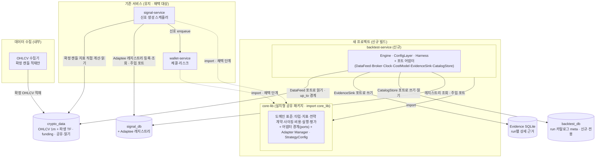
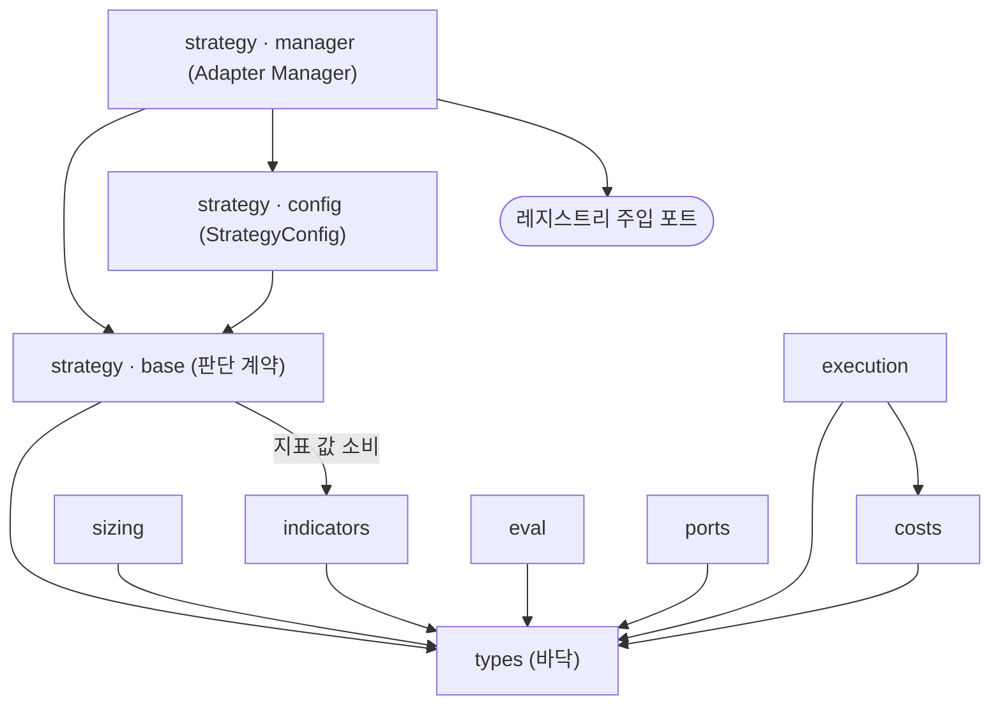

# 백테스트 v2 상세 설계서

암호화폐 무기한 선물·현물 전략의 백테스트·평가·개선 플랫폼을, 세 실행 모드(백테스트·페이퍼·라이브)가
물리적으로 같은 코드를 쓰도록 공유 라이브러리 위에 다시 짓는다. 이 문서는 그 시스템을 **위에서 아래로** —
서비스, 코드 트리, 컴포넌트, 클래스, 데이터베이스 순으로 — 하나의 설계서에 담는다. 각 절은 다이어그램과 정의를
함께 실어, 이 문서 하나만으로 구현할 수 있게 자기완결로 쓴다. 다른 문서를 열지 않아도 되도록, 필드·수식·임계값·
시그니처·불변식은 이 문서 안에 전부 적는다.

이 판은 최상위 두 절 — 서비스 뷰(§1)와 프로젝트 코드 트리(§2) — 과 문서 전체의 읽기 지도를 확정한다.

---

## 제약사항·방향

### 목적과 범위

이 시스템의 존재 이유는 "더 빠른 엔진"이 아니라 백테스트가 내린 판단을 믿을 수 있게 만들고 그 판단을 전략 개선으로
잇는 것이다. 두 기능으로 나뉜다. 하나는 **전략 검증**(통과선을 넘는지 판정)이고, 다른 하나는 **전략 개선**(거래
단위로 약점을 지표로 규명하고 구조적으로 보완한 뒤 재평가)이며, 개선이 주 목적이다.

이 절이 세우는 것은 시스템의 뼈대다. **무엇이 있고(서비스), 그것이 어떤 코드 구조로 놓이는지(트리)** 를 확정하고,
그 아래 컴포넌트·클래스·데이터베이스 상세는 뒤 절이 이 뼈대에 매단다. 전략이 무엇으로 진입·청산하는지(시그널
엣지)는 각 전략이 소유하는 입력이며 이 설계의 범위 밖이다 — 플랫폼은 전략을 끼우는 계약만 설계한다.

### 설계를 구속하는 불변식 (위반 불가)

아래는 협상 대상이 아니다. 뼈대(§1·§2)가 직접 구현하는 구조 불변식과, 뒤 절(§3~§5)이 계약으로 강제할 수치
불변식으로 나뉜다. 둘 다 여기 명시해 문서 전체의 구속으로 둔다.

**구조 불변식 — 이 뼈대가 직접 실현한다.**

1. **단일 표준 구현(한 번만 구현).** 전략·지표·사이징·비용계산은 복제 없이 하나의 공유 라이브러리(`core_lib`)에
   두고 백테스트·페이퍼·라이브가 함께 import한다. 백테스트가 검증한 구현과 라이브가 실행하는 구현이 어긋나면
   백테스트 결과 자체가 무의미해지기 때문이다.
2. **의존은 한 방향뿐.** 서비스가 `core_lib`를 import하고, `core_lib`는 어떤 서비스 코드도 import하지 않는다.
   `core_lib` 내부에서도 `types`가 바닥이고 나머지는 `types` 위에서만 서로를 참조한다(구체 방향은 뒤 절에서 확정).
3. **환경 차이는 포트로만 주입한다.** 데이터 출처·체결·시계·비용·기록 같은 실행 환경별 관심사는 `core_lib.ports`의
   경계 뒤로 빼고, 환경별 구현(어댑터)을 주입한다. 순수 결정 로직은 포트 밖(코어)에, wall-clock·네트워크·파일
   입출력은 포트 구현 안에만 둔다. 어떤 관심사가 포트가 되는지는 목록을 미리 고정하지 않고 뒤 절에서 정한다.
4. **look-ahead(미래 데이터 참조) 구조적 배제.** 신호는 캔들 마감이 확정된 뒤에만 평가한다. 데이터 피드 포트는
   경계 시점(`up_to`) 이후 캔들을 절대 반환하지 않고, 재귀형 지표는 마감 확정 캔들로만 갱신한다
   (`close_time ≤ 판단 시각`). 데이터 적재 층도 확정 캔들만 저장해 이를 뒷받침한다.
5. **`sys.path` 조작 없음.** 공유 라이브러리를 충돌 없는 단일 패키지명(`core_lib`)의 설치형 패키지로 두어,
   여러 서비스가 같은 최상위 패키지명을 써서 생기던 네임스페이스 충돌과 동적 경로 조작을 원천 제거한다.
6. **연구 데이터와 운영 DB 분리.** 백테스트 상세 근거(Evidence)는 run별 독립 SQLite에 담고, run 요약·카탈로그
   메타는 운영 DB(wallet·signal)와 분리된 전용 `backtest_db`에 둔다. 대시보드 조회용 읽기 전용 역할을 writer와
   별도로 둔다.

**수치·시점 불변식 — 뒤 절이 계약으로 강제한다(여기 명시).**

7. **시점 순서 강제.** `feature_ts ≤ decision_ts < execution_ts`. 체결은 결정보다 반드시 나중이며, 결정 캔들
   마감 시점에는 체결하지 않는다(기본은 다음 캔들 시가 체결).
8. **Decimal 단일 변환 관문.** 지표→전략→신호 경로는 float64로 흐르고, 체결 진입점(`Broker.submit()`)에서
   `Decimal(str(x))` + quantize를 딱 한 번 수행한 뒤 이후는 Decimal 전용이다. `Decimal(float)` 직접 변환은
   금지(이진 잡음이 스탑 끝자리를 뒤집어 캔들 내 트리거·해시가 흔들린다).
9. **모든 손익은 net.** `x_net = x_gross − fee_entry − fee_exit − slippage − funding − liquidation_penalty`.
   각 비용은 한 번만 차감하고 `cash + position = equity` 항등식을 유지한다. "비용 0 가정"은 금지.
10. **생존 사이징.** 거래당 위험은 계좌의 1% 이하(`1R ≤ 1%`)이며, 엣지는 진입 신호에서 온다(손절·익절 배치로
    기대값을 창조하지 못한다). pct 방식 사이징은 호환 경로로 두되 `1R ≤ 1%`를 보장하지 못하면 메타에 비준수로
    표시한다.
11. **결정성.** 같은 입력·같은 seed는 언제나 같은 Evidence를 낸다. 결정성 검증 해시는 SQLite 파일 바이트가
    아니라 정렬된 행의 정규화 직렬화(wall-clock 제외)로 산출한다.

### 설계 방향

빈 새 프로젝트에서 짓는다. 공유 라이브러리 `core-lib`(설치형 패키지 `core_lib`)와 새 `backtest-service`를 깨끗이
만들고, 기존 리포(signal·wallet)는 빌드 동안 읽기 전용 참조이자 프로덕션 유지다. `core_lib`가 백테스트로 검증된
뒤 **채택 단계**에서 기존 서비스가 이를 의존성으로 받아들여 내부 구현(지표·전략·실행·사이징)을 `core_lib` import로
치환한다 — 동작은 불변. 세 실행 모드가 같은 코드를 쓴다는 목표는 이 채택으로 완성되며, 빈 프로젝트로 시작하는
것은 그 단계를 없애는 게 아니라 뒤로 미뤄 위험을 줄이는 것이다.

기존 백테스트·replay 서비스는 전면 폐기 대상이라 서비스가 아니며 이 뷰에 등장하지 않는다. 그 필요 기능은 새
`backtest-service`가 새로 구현한다. 외부 collector는 리포 내부 `OHLCV 수집기`로 이관해 OHLCV 적재만 맡기고, 지표
사전계산 역할은 폐지한다.

### 확정된 범위 조정

첫 검증 스코프에서 두 항목을 유보한다(사용자 확정). 하나는 **트레일링 기계장치**(현재 이를 소비하는 전략이
없다)로, 표준 위치(`core_lib.strategy.trailing`)는 코드 트리에 남기되 첫 검증 전략은 트레일링 없이 구현하고,
재도입 시 단일 표준 계산기로 통합하며 파리티 기준을 확정한다. 다른 하나는 **1분 하위 집행 피드**로, 집행 판정을
전략 타임프레임 캔들 수준의 보수 판정으로 두고(손절·익절 동시 도달 시 손절 우선, OHLC-locked), 1분 피드로 내려간
집행과 그 파리티 허용 편차는 Engine 설계(§4.4)에서 확정한다. 두 유보는 뼈대의 구조를 바꾸지 않는다.

### 문서 구성 (읽기 지도)

이 설계서는 하나의 문서를 위에서 아래로 쌓는다. 문서의 절 순서가 곧 상세화 순서다. 구조(서비스·트리·컴포넌트·
클래스)를 행위(시퀀스·플로우)보다 먼저 두고, 시퀀스·플로우는 별도 장이 아니라 해당 클래스 정의서 안에 둔다.
데이터베이스는 클래스와 분리해 ERD를 기준으로 기술한다. 하위 식별자(클래스·필드·파일)는 그것을 담는 상위
단위(서비스→컴포넌트→클래스)가 먼저 정의된 뒤에만 등장한다.

| 절 | 제목 | 담는 내용 | 상태 |
|---|---|---|---|
| §1 | 서비스 다이어그램 + 정의서 | 어떤 서비스·저장소가 있고 어떻게 의존하는지 (최상위 뷰) | 이 판에서 확정 |
| §2 | 프로젝트 코드 트리 | 서비스 아래 디렉터리·패키지 구조 + 경로별 역할 | 이 판에서 확정 |
| §3 | 컴포넌트 다이어그램 + 정의서 (서비스별) | §3.1 `core-lib`(공유) · §3.2 `backtest-service` · §3.3 채택분(signal·wallet) | 후속 판에서 작성 |
| §4 | 클래스 다이어그램 + 정의서 (컴포넌트별) | §4.1 타입·지표 · §4.2 전략(+config 시퀀스) · §4.3 실행·평가(+판정 플로우) · §4.4 Engine(+캔들 루프·집행 시퀀스) · §4.5 출력(+run 저장 시퀀스) | 후속 판에서 작성 |
| §5 | 데이터베이스 ERD + 정의서 (DB별) | §5.1 DB 전체 구성 + `crypto_data`·`signal_db` · §5.2 `backtest_db` · §5.3 Evidence SQLite | 후속 판에서 작성 |
| 부록 | 채택·대사·회귀 절차 | 채택 지점·shim·회귀 범위·자체 검증 기준선·비밀 저장 방식 변경 | 후속 판에서 작성 |

---

## §1 서비스 다이어그램 + 정의서

### §1.1 서비스 다이어그램

최상위 뷰다. 신규로 짓는 것(공유 라이브러리 `core-lib`·`backtest-service`), 유지하며 채택하는 것(`signal-service`·
`wallet-service`), 데이터를 적재하는 것(`OHLCV 수집기`), 그리고 저장소 넷(`crypto_data`·`backtest_db`·`signal_db`·
Evidence SQLite)이 어떻게 의존하는지를 보인다. 화살표는 의존·데이터 흐름 방향이며, 서비스→`core_lib` 한 방향과
서비스→저장소 접근만 존재한다.



점선 화살표(`signal-service`·`wallet-service` → `core-lib`)는 채택 단계에서 성립하는 의존이다. 그 전까지 두
서비스는 자기 내부 구현으로 프로덕션을 계속 운영하고, 채택으로 내부 구현이 `core_lib` import로 치환되어도 동작은
불변이다. `wallet-service`는 자기 운영 DB(`wallet_db`)에 체결·포지션·회계를 쓰며, 이 DB는 백테스트 데이터 흐름과
무관해 위 뷰의 중심 저장소에 넣지 않는다. `OHLCV 수집기`는 활성 심볼을 별도 설정 DB(`config_db`)에서 읽는다(외부
collector가 소유하던 관심사로, 저장소 중심 뷰에는 표시하지 않는다).

### §1.2 서비스 정의서

서비스·저장소의 정의를 두 표로 확정한다. 소비(의존)의 방향은 §1.1 다이어그램이 담고, 표는 각 요소의 유형·책임·
경계(하지 않는 것)·패키징을 담는다. 표로 담기 어려운 규칙(변경 거버넌스)만 표 아래 문장으로 둔다.

**서비스 정의**

| 요소 | 유형 | 책임 | 경계 (하지 않음) | 소비 (→ §1.1) | 패키징 |
|---|---|---|---|---|---|
| `core-lib` | 설치형 공유 패키지 | 도메인 표준(값 타입·금액 정밀도·82종 지표·전략 판단 계약·사이징·비용·실행 수식·성과 평가·판정·포트 경계·Adaptee 생성/파라미터 해석)의 유일한 구현처 | 실행 드라이버 아님(캔들 루프·읽기·저장·wall-clock·IO 없음); 특정 DB 직접 의존 없음(레지스트리도 주입 포트 경유); 서비스 코드 import 안 함 | 없음 — 의존 그래프의 바닥(내부 계층 방향은 §2.1 의존 다이어그램) | `services/core-lib/`, editable 설치 단일 패키지 `core_lib`(하이픈 없음 → 네임스페이스 충돌·`sys.path` 조작 제거) |
| `backtest-service` | 신규 서비스 | `core_lib`만 import하는 결정적 실행 드라이버·입출력 오케스트레이터(사전등록·채번·워밍업 프리로드·캔들 루프·데이터 피드 push·체결·2계층 저장·상위 검증) | 전략 판단·지표·사이징·비용·실행 규칙 자체 미보유(전부 `core_lib` 호출); 라이브 인프라(큐·폴링·HTTP·상태 복구) 없음; 전략 파라미터 스키마·검증 미소유(run 설정만 소유) | `core-lib`(import); `crypto_data`·Evidence SQLite·`backtest_db`·`signal_db`(전부 포트 경유) | `services/backtest-service/`; `core-lib` 의존; 포트의 backtest 구현(어댑터) 소유 |
| `signal-service` | 기존 서비스 (유지·채택) | 확정 캔들마다 지표 증분(O(1)) 직접 계산 + Adapter Manager로 Adaptee 생성·판단 호출 → `wallet-service` 큐로 신호 전달 | 이 설계 단계 미변경(채택 단계에서만 내부 구현→`core_lib` 치환, 동작 불변); 판정 루프 안 돎(라이브 Evidence는 연구 피드백만) | 채택 후 `core-lib`(import); `crypto_data`(읽기·지표 계산); `signal_db` | 기존 리포 서비스; 채택은 무중단 re-export shim |
| `wallet-service` | 기존 서비스 (유지·채택) | 신호 큐 소비 → 사이징·실행·비용 호출로 체결·리스크·킬스위치; 체결·포지션·회계를 자기 운영 DB에 기록 | 이 설계 단계 미변경(채택 단계에서 체결 시점 즉시→다음 캔들 시가 전환, 회귀 ~1175건 필요); 라이브 인프라 백테스트로 미이관 | 채택 후 `core-lib`(import); `wallet_db` | 기존 리포 서비스; 채택은 re-export shim |
| `OHLCV 수집기` | 내부 컴포넌트 | 거래소 확정 캔들 OHLCV를 `crypto_data`에 적재(확정 캔들마다 1행·무조건) | 지표 미생성(계산은 signal·backtest가 `core_lib`로); 진행 중 캔들 미적재(look-ahead 방지의 데이터 층 근거); 단일 심볼 Binance 선물만(Upbit 현물 범위 밖) | 거래소 REST·WebSocket(입력); `crypto_data`(쓰기); `config_db`(활성 심볼 읽기) | 외부 collector의 리포 내부 이관분; 과거 구간은 기존 backfill 재사용 + `crypto_data` 보존 연장(예: 2000일) |

**저장소 정의**

| 저장소 | 유형 | 책임 | 접근 (쓰기/읽기) | 경계 |
|---|---|---|---|---|
| `crypto_data` | 공유·읽기 | 확정 캔들 OHLCV(1분 적재, 상위 TF는 연속 집계 뷰) + funding rate 시계열 | `OHLCV 수집기` 쓰기; `backtest-service`(DataFeed 포트)·`signal-service` 읽기; 백테스트 미기록 | crypto-data-hub가 생성·소유하는 공유 DB; 백테스트 결과 미저장; 전략 TF와 별도로 1분 트리거 캔들 보유(1분 집행 피드 사용은 §4.4 확정) |
| `backtest_db` | 신규·전용 메타 | run 요약·카탈로그·사전등록·태그 등 run 메타(검색·비교·집계 근거) | `backtest-service`(CatalogStore 포트) 쓰기, Harness 읽기; 조회용 읽기 전용 역할을 writer와 분리 | 운영 DB와 분리(연구 데이터 오염 방지); 상세 Evidence 미보유; 이름·writer 계승·스키마 신규·읽기 전용 역할 신설(필드는 §5.2) |
| `signal_db` | 기존 + 레지스트리 | `signal-service` 운영 DB + 신규 구현 Adaptee 목록 레지스트리 | `signal-service` 쓰기; Adapter Manager가 주입 포트로 등록·조회(`backtest-service`도 주입 포트로 조회) | `core_lib` 직접 의존 없음(주입 포트 경유); 레지스트리 스키마는 §5.1 |
| Evidence SQLite | run별 상세 | run별 캔들 신호·주문·체결·포지션·손익·지표 스냅샷(forensics·재현 원천) | `backtest-service`(EvidenceSink 포트) 쓰기; 대시보드·연구 읽기; 라이브는 연구 피드백용만 | run 자기완결(원천 스냅샷 로컬 사본); 운영 DB 미저장; 결정성 해시=정렬 행 정규화 직렬화(파일 바이트 아님)(필드는 §5.3) |

**표로 담기 어려운 규칙 (문장).** `core-lib`는 세 소비자(백테스트·signal·wallet)가 공유하므로, 통제 없는 변경이
"모두가 건드리고 아무도 소유하지 않는" 결합 허브로 퇴화하지 않게 **변경 거버넌스 3규칙**을 강제한다. 첫째,
`core-lib` 변경이 포함된 커밋은 리뷰 게이트 대상에 항상 포함한다. 둘째, `core_lib` 밖에 표준 모듈(지표·실행 계산기
등)의 사본이 생기면 실패하는 저비용 재복제 가드 테스트(glob 검사 또는 import 계약)를 두어 복제 드리프트 재발을
원천 차단한다(CI 없이도 작동). 셋째, editable 설치(HEAD 추적)는 페이퍼까지만 허용하고, 실거래 전환 시 고정 버전
릴리스로 바꿔 전략 한 줄 수정이 즉시 실거래 경로에 반영되는 것을 막는다.

---

## §2 프로젝트 코드 트리

서비스 아래 실제 디렉터리·패키지 구조다. 클래스보다 먼저 구조를 확정한다. 새 프로젝트 루트에는 두 패키지를 담는
`services/`와, 배포 시 DB·역할을 초기화하는 `init-scripts/` 루트가 `services/`와 형제로 놓인다. 각 경로에 한 줄
역할을 붙였고, 트리 노드는 뒤에서 그릴 컴포넌트(§3)와 대응한다.

대응은 대부분 1:1이되 두 곳은 한 디렉터리가 여러 컴포넌트를 담는다. `core_lib/` 디렉터리 대부분은 §3.1의 한
컴포넌트에 1:1로 대응하지만, `strategy/`는 세 컴포넌트를 담고(부속 `profile.py`·`trailing/`을 낀 `base.py`가
전략 판단 계약, `manager.py`가 Adapter Manager, `config.py`가 StrategyConfig), `adaptees/`는 플러그인 전략
위치라 플랫폼 컴포넌트가 아니다. `backtest-service`에서는 `config/`·`engine/`·`harness/`가 각각 한 컴포넌트이고
`adapters/`는 §3.2가 그릴 여섯 포트 어댑터를 담는다. 그래서 §3.1은 core-lib 컴포넌트 열 종을, §3.2는
Engine·ConfigLayer·Harness에 여섯 어댑터를 더해 그린다.

### §2.1 `core-lib` 트리 (설치형 공유 패키지)

```text
services/core-lib/
  pyproject.toml                     # 패키지 정의(name="core-lib", packages=["core_lib"]); editable 설치로 sys.path 조작 폐지
  core_lib/
    __init__.py                      # 패키지 진입점
    types/                           # [컴포넌트] 도메인 값 타입·금액 정밀도의 단일 정의처
      candle.py                      #   통합 캔들 타입(신규): symbol·exchange·timeframe·open_time·close_time·o·h·l·c·v·quote_volume?·trade_count?; 캔들 검증 불변식 강제
      signal.py                      #   TradingSignal(판단 전용, 방향·수량 필드 없음)·SignalType — 신호 표준 승격
      order.py                       #   Order(주문·상태기계)
      position.py                    #   Position(포지션·가중평균·청산가)
      trade.py                       #   Trade(체결 완료 거래; r0=최초 위험 추가)
      fill.py                        #   Fill(체결 사실 명시 타입, 신규)
      enums.py                       #   OrderStatus/Side/Type·PositionSide·MarginType·MarketType·ExitReason(신규)
      money.py                       #   ZERO·Q_PRICE/AMOUNT/PERCENT/RATIO/FEE_RATE·quantize_*(ROUND_HALF_EVEN) — 금액 정밀도 상수
    indicators/                      # [컴포넌트] 공용 계산 프리미티브 + 82종 지표 표준(벡터화·증분 두 경로)
      primitives.py                  #   공용 계산 단위: sma·ema·wma·rma·tr·tp·stdev·hh·ll·cumulative·roc·linreg
      trend.py                       #   추세·이동평균 지표군
      momentum.py                    #   모멘텀 지표군
      volatility.py                  #   변동성 지표군
      volume.py                      #   거래량 지표군
      strength.py                    #   추세강도 지표군
      bill_williams.py               #   Bill Williams 지표군
      breadth.py                     #   시장폭 지표군(입력 없으면 비활성)
      cycle.py                       #   사이클(Ehlers) 지표군
      systems.py                     #   기타·복합 지표군
      donchian.py                    #   Donchian(82종의 하나·옵션, 특정 전략용)
      registry.py                    #   지표 등록·버전·구현 고정 근거·min_history
      contracts.py                   #   확정 캔들 전용 계약 강제(close_time ≤ 판단 시각)
    strategy/                        # [컴포넌트×3] 전략 판단 계약(base.py) + Adapter Manager(manager.py) + StrategyConfig(config.py)
      base.py                        #   StrategyAdapter(typing.Protocol) — 전략 판단 계약(analyze·metadata·파라미터 스키마 선언)
      registry.py                    #   Adaptee 등록 규약(구현 목록) — Adapter Manager(manager.py) 소관
      factory.py                     #   Adaptee 생성 규약 — Adapter Manager(manager.py) 소관
      manager.py                     #   Adapter Manager — Adaptee 생성(Factory)·lifecycle·레지스트리(주입 포트로 signal_db)
      config.py                      #   StrategyConfig — 전략 파라미터 해석·검증·직렬화·UI JSON Schema 노출
      profile.py                     #   전략 프로파일 스키마(family·기대 승률/손익비 범위·tail_shape·성숙도 등) — 판단 계약 부속
      trailing/                      #   ATR 트레일링 표준 위치 — 판단 계약 부속(첫 검증 스코프 유보; 재도입 시 단일 표준으로 통합·파리티 확정)
        trailing_stop.py             #     트레일링 스탑 순수 함수 계산기(Adaptee가 상속 아닌 호출)
      adaptees/                      #   구현 전략(Adaptee) 위치 — 플러그인, 플랫폼 컴포넌트 아님; 진입·청산 엣지는 각 Adaptee 소유(범위 밖), 레지스트리로 등록
        vessel_*.py                  #     첫 파이프라인 검증용 Vessel 계열 Adaptee(신규 구현, 트레일링 없이); 터틀 진입 전략은 만들지 않음
    sizing/                          # [컴포넌트] 거래당 위험 규율과 사이징 인스턴스
      risk_money.py                  #   보편 사이징: 수량=(risk_per_trade×Equity)/손절거리, 1R≤1%, 노출 한도, RoR 연동
      turtle_unit.py                 #   터틀 인스턴스(N 사이징·0.5N 피라미딩·유닛 한도) — 전략이 선택 조합
      wallet_pct.py                  #   pct 방식(호환) — framework 비준수 플래그 의무
      kelly.py                       #   Half/Quarter-Kelly 상한
    costs/                           # [컴포넌트] net 손익 4개 비용 수식 표준(값은 CostModel 주입)
      fee.py                         #   수수료(maker/taker, notional×rate)
      slippage.py                    #   슬리피지(고정 bps + 스프레드/충격)
      funding.py                     #   펀딩(이산 정산, 경계 캔들 시가 기준)
      liquidation.py                 #   청산가·청산 판정(Isolated 우선, 보수 방향)
    execution/                       # [컴포넌트] 주문 라이프사이클·결정적 체결·포지션 장부·회계
      order_lifecycle.py             #   NEW→FILLED 상태전이(VALID_TRANSITIONS)
      matcher.py                     #   결정적 체결 규칙(fill_timing·다음 캔들 시가·트리거·동시 터치 우선·갭·수량 절삭)
      position_book.py               #   포지션 갱신·가중평균·reduce_only·청산 판정·최초 체결 캔들 자기검사 회피
      accounting.py                  #   cash+position=equity 항등식·비용 1회 차감
    ports/                           # [컴포넌트] 환경별 관심사의 어댑터 경계(전부 ABC; 구현은 서비스가 주입) — 대표 여섯 종, 최종 포트 목록은 §3.2에서 확정
      data_feed.py                   #   DataFeed ABC: candles(up_to 경계)·funding·mark_price
      broker.py                      #   Broker ABC: submit(order)→Fill·open_orders·cancel (Decimal 단일 변환 관문 위치)
      clock.py                       #   Clock ABC: now·advance(wall-clock 금지)
      cost_model.py                  #   CostModel ABC: fee·slippage·funding_rate·liq_params(값 주입)
      evidence_sink.py               #   EvidenceSink ABC: record(entity)·finalize(run)
      catalog_store.py               #   CatalogStore ABC: save_prereg·register·upsert_summary
    eval/                            # [컴포넌트] 성과 수식 표준 1곳 + 판정 3단계
      metrics.py                     #   성과 지표 수식(일간 리샘플 후 √365, Sortino 분모 전체 N, SQN √min(N,100), MDD 등)
      integrity.py                   #   무결성 검사(회계·시점·비용 1회·결정성·Evidence 완성도)
      hard_gate.py                   #   Hard Gate(전 전략 공통 평가 기준값)
      decision.py                    #   Decision(사전등록 Primary Metric 기준 처리)
      thresholds.py                  #   평가 기준값(통과선)의 단일 코드 구현
      profile.py                     #   프로파일 기대 범위 소비 규칙(경고/established 회귀만 reject)
  tests/                             # 패키지 테스트 스캐폴드
    test_no_reduplication.py         #   재복제 가드 — core_lib 밖에 표준 모듈(지표·실행 계산기 등) 사본이 생기면 실패(변경 거버넌스 규칙 2, CI 없이 작동)
```

`core_lib` 내부 모듈의 의존 방향(한 방향, 역참조 없음)을 아래 다이어그램이 확정한다. 화살표는 "참조한다(의존)"를
뜻하고 `types`가 바닥이다. 클래스 계약과 컴포넌트 인터페이스는 §3.1·§4에서 확정한다.



### §2.2 `backtest-service` 트리 (신규 서비스)

`core_lib.ports`의 각 ABC를 이 서비스가 backtest 구현(어댑터)으로 실체화한다. 파일명이 `core_lib/ports/`와
겹치는 것은 같은 관심사의 추상(ABC)과 구현(어댑터)이라 의도된 대응이다.

```text
services/backtest-service/
  pyproject.toml                     # 패키지 정의; core-lib를 의존성으로(editable 설치)
  backtest_service/
    __init__.py                      # 패키지 진입점
    config/                          # [컴포넌트] ConfigLayer — 백테스트 run 설정
      run_config.py                  #   run 설정 pydantic 스키마·검증(OHLCV·funding 소스/구간, CostModel 값, 거래소 규칙, 실행/리스크, 파라미터 sweep, 지표 계산 모드, 프로파일 선택); 전략 스키마·검증은 제외(core_lib.StrategyConfig 소관)
    engine/                          # [컴포넌트] Engine — 결정적 실행 드라이버·입출력 오케스트레이터
      engine.py                      #   캔들 루프·look-ahead 순서·데이터 피드 push·체결·저장·eval 호출; Adapter Manager로 Adaptee 생성 (캔들 루프·집행 시퀀스는 §4.4)
    adapters/                        # [컴포넌트×6] core_lib.ports 여섯 ABC의 backtest 구현(어댑터) — 대표 여섯 종, 최종 목록은 §3.2에서 확정
      data_feed.py                   #   DataFeed 구현: crypto_data 과거 OHLCV·funding 공급, up_to 이후 캔들 미노출
      broker.py                      #   Broker 구현: 결정적 시뮬 체결 + CostModel; Decimal 단일 변환 관문
      clock.py                       #   Clock 구현: 시뮬 캔들 시각(결정적, wall-clock 금지)
      cost_model.py                  #   CostModel 구현: 보수적 주입값·과거 실측 펀딩 rate
      evidence_sink.py               #   EvidenceSink 구현: run별 SQLite 상세 기록
      catalog_store.py               #   CatalogStore 구현: backtest_db 카탈로그 메타 기록·조회
    harness/                         # [컴포넌트] Harness — 단일 run 밖 상위 검증 오케스트레이션
      harness.py                     #   표본 내/외 분리·워크포워드·몬테카를로·확률적 샤프·파라미터 스윕(카탈로그 비교)
  tests/                             # 패키지 테스트 스캐폴드(포트 어댑터·Engine 루프·결정성)
```

`Engine`은 `core_lib`만 import하고 데이터 읽기·체결·저장·시계를 전부 `adapters/`의 포트 구현으로 수행한다.
전략 판단·지표·사이징·비용·실행 규칙은 이 서비스 안에 없다(전부 `core_lib` 호출).

### §2.3 배포 루트 (DB 초기화)

`backtest_db` 프로비저닝은 서비스 패키지 안이 아니라 새 프로젝트 배포 루트에 둔다 — `services/`와 형제인
`init-scripts/` 루트이며, 기존 서비스별 마이그레이션 미러 구조를 따른다. 실제 테이블·Entity 스키마는 데이터베이스
설계(§5)가 ERD로 확정하고, 여기서는 디렉터리·역할 배치와 파일 번호 규약만 고정한다.

```text
(새 프로젝트 루트)
  services/
    core-lib/                        # §2.1
    backtest-service/                # §2.2
  init-scripts/                      # 배포 루트 — DB·역할 초기화(services/ 와 형제)
    NN-init-backtest-db.sql          #   backtest_db·backtest_writer 유지 계승 + 읽기 전용 backtest_reader 역할 신설; 파일 번호는 구현 시점 라이브 루트 실제 최고 번호 다음(현재 기준 04-…)
    backtest-service/                #   backtest_db meta 스키마 마이그레이션(기존 per-service 미러 구조; 테이블·필드는 §5.2)
```

---

## Traceability (설계 표준 요구 ↔ 이 판의 절)

이 판(§1·§2)이 어떤 표준 요구를 충족하는지를 이름으로 적는다.

| 이 문서의 절 | 충족하는 표준 요구(이름) |
|---|---|
| 제약사항·방향 1, §1.1, §1.2 `core-lib` | 단일 표준 구현(전략·지표·사이징·비용을 한 번만 구현, 세 실행 모드 공유) |
| 제약사항·방향 2, §1.1 화살표, §2.1 후문 | 의존은 한 방향(서비스→core_lib, 역방향 없음; core_lib 내부 types 바닥) |
| 제약사항·방향 3, §1.2 `backtest-service`, §2 `ports`·`adapters` | 환경 차이는 포트로만 주입(추상 ABC는 core_lib, 구현은 서비스) |
| 제약사항·방향 4, §1.2 `crypto_data`·Evidence SQLite·`OHLCV 수집기` | look-ahead 구조적 배제(DataFeed up_to 경계, 확정 캔들만 적재·갱신) |
| 제약사항·방향 5, §1.2 `core-lib` 패키징, §2.1 `pyproject.toml` | sys.path 조작 없음(충돌 없는 단일 설치형 패키지명) |
| §1.2 `core-lib` 변경 거버넌스, §2.1 `tests/test_no_reduplication.py` | 재드리프트 방지 3규칙(변경 리뷰 게이트·재복제 가드 테스트·실거래 고정 버전 릴리스) |
| 제약사항·방향 6, §1.2 `backtest_db`·Evidence SQLite | 연구 데이터·운영 DB 분리(전용 meta DB + run별 SQLite + 읽기 전용 역할) |
| 제약사항·방향 7~11, §2 `execution`·`ports/broker`·`eval` | 시점 순서·Decimal 단일 변환 관문·net 손익·1R≤1%·결정성(뒤 절이 계약으로 강제할 위치를 뼈대에 배치) |
| 제약사항·방향(확정된 범위 조정), §2.1 `strategy/trailing/` | 트레일링·1분 집행 피드 유보를 구조에 반영하되 표준 위치는 보존(재도입·파리티는 §4에서 확정) |
| §1.2 `signal-service`·`wallet-service` | 유지 서비스는 채택으로 core_lib 소비(동작 불변, 프로덕션은 이 설계 단계에서 불변) |
| §1.2 `OHLCV 수집기` | 외부 collector 내부화(적재만, 지표 역할 폐지) |
| 문서 구성(읽기 지도) | top-down 단일 문서(구조→행위, DB는 ERD로 분리, 정의 우선) |

> 이 판은 이후 컴포넌트 설계(§3)가 각 서비스 내부 컴포넌트를, 클래스 설계(§4)가 각 컴포넌트의 클래스·시퀀스를,
> 데이터베이스 설계(§5)가 각 DB의 ERD·필드를 이 뼈대에 매달도록 최상위 구조와 읽기 지도를 제공한다.
