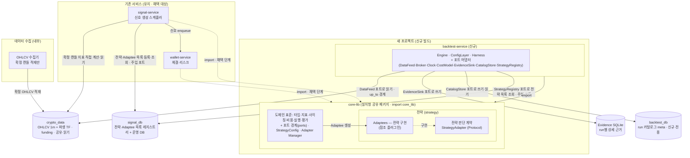
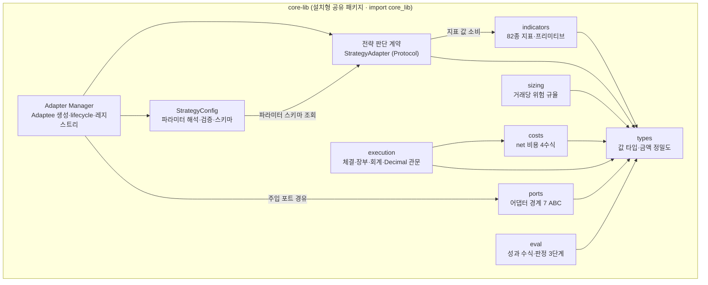
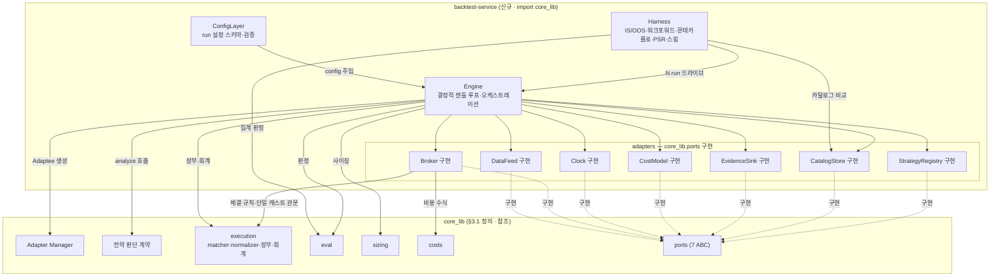
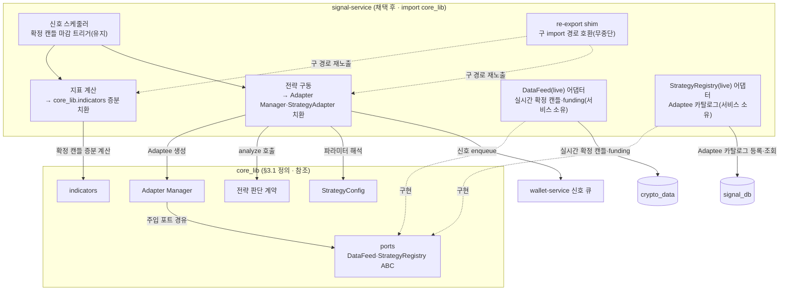
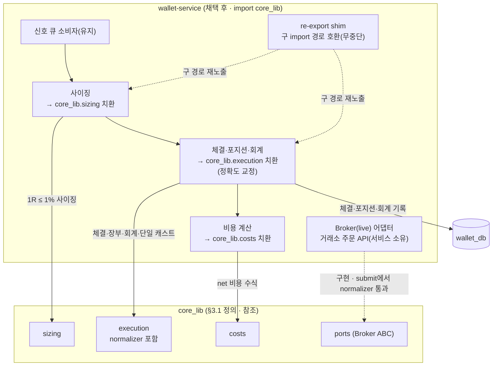

# 백테스트 v2 상세 설계서

암호화폐 무기한 선물·현물 전략의 백테스트·평가·개선 플랫폼을, 세 실행 모드(백테스트·페이퍼·라이브)가
물리적으로 같은 코드를 쓰도록 공유 라이브러리 위에 다시 짓는다. 이 문서는 그 시스템을 **위에서 아래로** —
서비스, 코드 트리, 컴포넌트, 클래스, 데이터베이스 순으로 — 하나의 설계서에 담는다. 각 절은 다이어그램과 정의를
함께 실어, 이 문서 하나만으로 구현할 수 있게 자기완결로 쓴다. 다른 문서를 열지 않아도 되도록, 필드·수식·임계값·
시그니처·불변식은 이 문서 안에 전부 적는다.

이 판은 최상위 구조 — 서비스 뷰(§1)·프로젝트 코드 트리(§2) — 와 문서 전체의 읽기 지도에 더해, 그 아래 컴포넌트
뷰(§3, 서비스별 컴포넌트 다이어그램·정의서)를 확정한다.

---

# 제약사항·방향

## 목적과 범위

이 시스템의 존재 이유는 "더 빠른 엔진"이 아니라 백테스트가 내린 판단을 믿을 수 있게 만들고 그 판단을 전략 개선으로
잇는 것이다. 두 기능으로 나뉜다. 하나는 **전략 검증**(통과선을 넘는지 판정)이고, 다른 하나는 **전략 개선**(거래
단위로 약점을 지표로 규명하고 구조적으로 보완한 뒤 재평가)이며, 개선이 주 목적이다.

이 절이 세우는 것은 시스템의 뼈대다. **무엇이 있고(서비스), 그것이 어떤 코드 구조로 놓이는지(트리)** 를 확정하고,
그 아래 컴포넌트·클래스·데이터베이스 상세는 뒤 절이 이 뼈대에 매단다. 전략이 무엇으로 진입·청산하는지(시그널
엣지)는 각 전략이 소유하는 입력이며 이 설계의 범위 밖이다 — 플랫폼은 전략을 끼우는 계약만 설계한다.

## 설계를 구속하는 불변식 (위반 불가)

아래는 협상 대상이 아니다. 뼈대(§1·§2)가 직접 구현하는 구조 불변식과, 뒤 절(§3~§5)에서 강제될 수치
불변식으로 나뉜다. 둘 다 여기 명시해 문서 전체의 구속으로 둔다.

**구조 불변식 — 이 뼈대가 직접 실현한다.**

1. **단일 표준 구현(한 번만 구현).** 전략·지표·사이징·비용계산은 복제 없이 하나의 공유 라이브러리(`core_lib`)에
   두고 백테스트·페이퍼·라이브가 함께 import한다. 백테스트가 검증한 구현과 라이브가 실행하는 구현이 어긋나면
   백테스트 결과 자체가 무의미해지기 때문이다.
2. **의존은 한 방향뿐.** 서비스가 `core_lib`를 import하고, `core_lib`는 어떤 서비스 코드도 import하지 않는다.
   `core_lib` 내부에서도 `types`가 바닥이고 나머지는 `types` 위에서만 서로를 참조한다(구체 방향은 뒤 절에서 확정).
3. **환경 차이는 포트로만 주입한다.** 데이터 출처·체결·시계·비용·기록 같은 실행 환경별 관심사는 `core_lib.ports`의
   경계 뒤로 빼고, 환경별 구현(어댑터)을 주입한다. 순수 결정 로직은 포트 밖(코어)에, wall-clock·네트워크·파일
   입출력은 포트 구현 안에만 둔다. 어떤 관심사가 포트가 되는지는 목록을 미리 고정하지 않고 뒤 절에서 정한다.
4. **look-ahead(미래 데이터 참조) 구조적 배제.** 신호는 캔들 마감이 확정된 뒤에만 평가한다. 데이터 피드 포트는
   경계 시점(`up_to`) 이후 캔들을 절대 반환하지 않고, 재귀형 지표는 마감 확정 캔들로만 갱신한다
   (`close_time ≤ 판단 시각`). 데이터 적재 층도 확정 캔들만 저장해 이를 뒷받침한다.
5. **`sys.path` 조작 없음.** 공유 라이브러리를 충돌 없는 단일 패키지명(`core_lib`)의 설치형 패키지로 두어,
   여러 서비스가 같은 최상위 패키지명을 써서 생기던 네임스페이스 충돌과 동적 경로 조작을 원천 제거한다.
6. **연구 데이터와 운영 DB 분리.** 백테스트 상세 근거(Evidence)는 run별 독립 SQLite에 담고, run 요약·카탈로그
   메타는 운영 DB(wallet·signal)와 분리된 전용 `backtest_db`에 둔다. 대시보드 조회용 읽기 전용 역할을 writer와
   별도로 둔다.

**수치·시점 불변식 — 구현이 반드시 지킨다(뒤 절에서 강제, 여기 미리 명시).**

7. **시점 순서 강제.** `feature_ts ≤ decision_ts < execution_ts`. 체결은 결정보다 반드시 나중이며, 결정 캔들
   마감 시점에는 체결하지 않는다(기본은 다음 캔들 시가 체결).
8. **Decimal 단일 변환 관문.** 판단 경로(지표 → 전략 → 신호)는 빠른 `float64`로, 체결·금액 경로는 오차 없는
   `Decimal`로 계산한다. `float`을 `Decimal`로 바꾸는 일은 시스템 전체에서 딱 한 지점 — 체결 진입점
   `Broker.submit()` — 에서만, `Decimal(str(x))` + `quantize`로 한 번 수행하고 그 뒤로는 Decimal만 쓴다. `float`을
   곧바로 `Decimal(x)`에 넣는 것은 금지한다 — `float`이 이미 품고 있던 이진 오차까지 그대로 복사되어, 그 오차가
   스탑 가격의 끝자리를 뒤집으면 같은 캔들 안에서 스탑이 걸리는지(체결 여부)와 결정성 해시가 달라지기 때문이다.
   `Decimal(str(x))`는 문자열을 거쳐 의도한 값 그대로 만든다.
9. **모든 손익은 net.** `x_net = x_gross − fee_entry − fee_exit − slippage − funding − liquidation_penalty`.
   각 비용은 한 번만 차감하고 `cash + position = equity` 항등식을 유지한다. "비용 0 가정"은 금지.
10. **생존 사이징.** 거래당 위험은 계좌의 1% 이하(`1R ≤ 1%`)이며, 엣지는 진입 신호에서 온다(손절·익절 배치로
    기대값을 창조하지 못한다). pct 방식 사이징은 호환 경로로 두되 `1R ≤ 1%`를 보장하지 못하면 메타에 비준수로
    표시한다.
11. **결정성.** 같은 입력·같은 seed는 언제나 같은 Evidence를 낸다. 결정성 검증 해시는 SQLite 파일 바이트가
    아니라 정렬된 행의 정규화 직렬화(wall-clock 제외)로 산출한다.

## 설계 방향

빈 새 프로젝트에서 짓는다. 공유 라이브러리 `core-lib`(설치형 패키지 `core_lib`)와 새 `backtest-service`를 깨끗이
만들고, 기존 리포(signal·wallet)는 빌드 동안 읽기 전용 참조이자 프로덕션 유지다. `core_lib`가 백테스트로 검증된
뒤 **채택 단계**에서 기존 서비스가 이를 의존성으로 받아들여 내부 구현(지표·전략·실행·사이징)을 `core_lib` import로
치환한다 — 동작은 불변. 세 실행 모드가 같은 코드를 쓴다는 목표는 이 채택으로 완성되며, 빈 프로젝트로 시작하는
것은 그 단계를 없애는 게 아니라 뒤로 미뤄 위험을 줄이는 것이다.

기존 백테스트·replay 서비스는 전면 폐기 대상이라 서비스가 아니며 이 뷰에 등장하지 않는다. 그 필요 기능은 새
`backtest-service`가 새로 구현한다. 외부 collector는 리포 내부 `OHLCV 수집기`로 이관해 OHLCV 적재만 맡기고, 지표
사전계산 역할은 폐지한다.

## 확정된 범위 조정

첫 검증 스코프에서 두 항목을 유보한다(사용자 확정). 하나는 **트레일링 기계장치**(현재 이를 소비하는 전략이
없다)로, 표준 위치(`core_lib.strategy.trailing`)는 코드 트리에 남기되 첫 검증 전략은 트레일링 없이 구현하고,
재도입 시 단일 표준 계산기로 통합하며 파리티 기준을 확정한다. 다른 하나는 **1분 하위 집행 피드**로, 집행 판정을
전략 타임프레임 캔들 수준의 보수 판정으로 두고(손절·익절 동시 도달 시 손절 우선, OHLC-locked), 1분 피드로 내려간
집행과 그 파리티 허용 편차는 Engine 설계(§4.4)에서 확정한다. 두 유보는 뼈대의 구조를 바꾸지 않는다.

## 문서 구성 (읽기 지도)

이 설계서는 하나의 문서를 위에서 아래로 쌓는다. 문서의 절 순서가 곧 상세화 순서다. 구조(서비스·트리·컴포넌트·
클래스)를 행위(시퀀스·플로우)보다 먼저 두고, 시퀀스·플로우는 별도 장이 아니라 해당 클래스 정의서 안에 둔다.
데이터베이스는 클래스와 분리해 ERD를 기준으로 기술한다. 하위 식별자(클래스·필드·파일)는 그것을 담는 상위
단위(서비스→컴포넌트→클래스)가 먼저 정의된 뒤에만 등장한다.

| 절 | 제목 | 담는 내용 | 상태 |
|---|---|---|---|
| §1 | 서비스 다이어그램 + 정의서 | 어떤 서비스·저장소가 있고 어떻게 의존하는지 (최상위 뷰) | 이 판에서 확정 |
| §2 | 프로젝트 코드 트리 | 서비스 아래 디렉터리·패키지 구조 + 경로별 역할 | 이 판에서 확정 |
| §3 | 컴포넌트 다이어그램 + 정의서 (서비스별) | §3.1 `core-lib`(공유) · §3.2 `backtest-service` · §3.3 채택분(signal·wallet) | 이 판에서 확정 |
| §4 | 클래스 다이어그램 + 정의서 (컴포넌트별) | §4.1 타입·지표 · §4.2 전략(+config 시퀀스) · §4.3 실행·평가(+판정 플로우) · §4.4 Engine(+캔들 루프·집행 시퀀스) · §4.5 출력(+run 저장 시퀀스) | 후속 판에서 작성 |
| §5 | 데이터베이스 ERD + 정의서 (DB별) | §5.1 DB 전체 구성 + `crypto_data`·`signal_db` · §5.2 `backtest_db` · §5.3 Evidence SQLite | 후속 판에서 작성 |
| 부록 | 채택·대사·회귀 절차 | 채택 지점·shim·회귀 범위·자체 검증 기준선·비밀 저장 방식 변경 | 후속 판에서 작성 |

---

# §1 서비스 다이어그램 + 정의서

## §1.1 서비스 다이어그램

이 그림은 시스템을 가장 위에서 본 것이다. 크게 네 묶음이 있다. 새로 짓는 것은 공유 라이브러리 `core-lib`와
백테스트 전용 서비스 `backtest-service`다. 지금은 그대로 두고 나중에 `core-lib`를 받아들이는 것은 기존
`signal-service`와 `wallet-service`다. 데이터를 채워 넣는 것은 `OHLCV 수집기`이고, 저장소는 `crypto_data`·
`backtest_db`·`signal_db`·Evidence SQLite 넷이다.

화살표는 세 가지다. 실선에 `import`가 붙은 것은 서비스가 `core_lib`를 가져다 쓰는 의존이며, 방향은 언제나
서비스에서 `core_lib` 한쪽뿐이다. 라벨에 포트 이름이 붙은 실선은 서비스가 그 포트를 거쳐 저장소를 읽고 쓴다는
뜻이다. 점선은 지금이 아니라 채택 단계에 가서야 성립하는 의존이다. `core-lib` 내부 모듈끼리의 import 의존만 따로
본 그래프는 §2.1에 있다.



점선 두 개는 `signal-service`와 `wallet-service`가 채택 단계에 가서야 생기는 의존이다. 여기서 채택 단계란 core-lib를
'쓰기 시작한다'는 뜻이 아니라, 이미 자기 코드로 돌아가고 있는 기존 서비스가 그 내부 구현(지표·전략·실행 등)을
`core_lib` import로 갈아 끼우는 이행 단계를 말한다. 두 서비스는 지금 자기 구현으로 프로덕션을 돌리고 있어 아직
`core-lib` 의존이 없고, 그 의존은 채택에 가서야 생기므로 점선으로 그렸다. 갈아 끼운 뒤에도 계산 결과는 그대로다
(같은 계산을 `core_lib`이 대신할 뿐).

`backtest-service`도 `core-lib`를 쓰지만 실선인 이유가 여기서 갈린다. 이 서비스는 처음부터 `core_lib`로 새로 짓기
때문에 갈아 끼울 기존 구현이 없다 — 태어날 때부터 core-lib에 의존하므로 '채택'이라는 단계가 없고, 그 의존이 지금
곧바로 성립한다. 그래서 실선이다. 요컨대 실선과 점선을 가르는 것은 'core-lib를 쓰느냐'가 아니라 '그 의존이 지금
있느냐(신규 서비스), 채택 단계에 가서 생기느냐(기존 서비스)'이다.

저장소 둘은 이 그림에서 일부러 뺐다. `wallet-service`가 체결·포지션·회계를 적는 자기 운영 DB `wallet_db`는
백테스트 데이터 흐름과 상관이 없어 넣지 않았다. `OHLCV 수집기`가 활성 심볼을 읽어 오는 설정 DB `config_db`도
원래 외부 collector가 갖고 있던 관심사라 저장소 중심 뷰에는 넣지 않았다.

`core-lib` 안의 전략 블록에는 두 가지가 들어 있다. `전략 판단 계약`은 플랫폼이 소유하는 '전략을 끼우는 자리'로,
`StrategyAdapter`라는 Protocol이다. `Adaptees`는 그 자리에 꽂히는 실제 전략 구현들이다. 각 전략이 언제 진입하고
언제 청산하는지는 전략 작성자의 몫이라 이 설계의 범위 밖이며, 플랫폼은 끼우는 계약만 정한다.

어떤 전략(Adaptee)이 실제로 있는지, 곧 '실행할 전략 목록'은 코드에 적어 두지 않고 `signal_db`에 레지스트리로
둔다. 이 목록을 다루는 것은 `Adapter Manager`인데, `signal_db`를 직접 건드리지 않고 주입된 `StrategyRegistry`
포트를 거친다. 그래서 `core-lib`은 특정 DB에 묶이지 않는다.

이렇게 목록을 DB에 두는 방식은 새로 지어낸 것이 아니라 현행 signal-service에서 가져왔다. 지금은 쓸 수 있는 전략
목록이 코드에 박혀 있어서, 서비스가 부팅할 때 하드코딩으로 등록한다. 신규 설계는 그 목록을 `signal_db`로 올려
목록의 단일 출처로 삼는다. 레지스트리의 컬럼 구조도 현행 배포 인스턴스 테이블 `trading_strategies`(전략 클래스명·
파라미터 JSONB·심볼·타임프레임·활성 여부·버전)를 그대로 차용하며, 실제 표와 필드는 §5.1에서 확정한다.

## §1.2 서비스 정의서

서비스·저장소의 정의를 두 표로 확정한다. 소비(의존)의 방향은 §1.1 다이어그램이 담고, 표는 각 요소의 유형·책임·
경계(하지 않는 것)·패키징을 담는다. 표로 담기 어려운 규칙(변경 거버넌스)만 표 아래 문장으로 둔다.

**서비스 정의**

| 요소 | 유형 | 책임 | 경계 (하지 않음) | 소비 (→ §1.1) | 패키징 |
|---|---|---|---|---|---|
| `core-lib` | 설치형 공유 패키지 | 도메인 표준(값 타입·금액 정밀도·82종 지표·전략 판단 계약·사이징·비용·실행 수식·성과 평가·판정·포트 경계·Adaptee 생성/파라미터 해석)의 유일한 구현처 | 실행 드라이버 아님(캔들 루프·읽기·저장·wall-clock·IO 없음); 특정 DB 직접 의존 없음(레지스트리도 주입 포트 경유); 서비스 코드 import 안 함 | 없음 — 의존 그래프의 바닥(내부 계층 방향은 §2.1 의존 다이어그램) | `services/core-lib/`, editable 설치 단일 패키지 `core_lib`(하이픈 없음 → 네임스페이스 충돌·`sys.path` 조작 제거) |
| `backtest-service` | 신규 서비스 | `core_lib`만 import하는 결정적 실행 드라이버·입출력 오케스트레이터(사전등록·채번·워밍업 프리로드·캔들 루프·데이터 피드 push·체결·2계층 저장·상위 검증) | 전략 판단·지표·사이징·비용·실행 규칙 자체 미보유(전부 `core_lib` 호출); 라이브 인프라(큐·폴링·HTTP·상태 복구) 없음; 전략 파라미터 스키마·검증 미소유(run 설정만 소유) | `core-lib`(import); `crypto_data`·Evidence SQLite·`backtest_db`·`signal_db`(전부 포트 경유) | `services/backtest-service/`; `core-lib` 의존; 포트의 backtest 구현(어댑터) 소유 |
| `signal-service` | 기존 서비스 (유지·채택) | 확정 캔들마다 지표 증분(O(1)) 직접 계산 + Adapter Manager로 Adaptee 생성·판단 호출 → `wallet-service` 큐로 신호 전달 | 이 설계 단계 미변경(채택 단계에서만 내부 구현→`core_lib` 치환, 동작 불변); 판정 루프 안 돎(라이브 Evidence는 연구 피드백만) | 채택 후 `core-lib`(import); `crypto_data`(읽기·지표 계산); `signal_db` | 기존 리포 서비스; 채택은 무중단 re-export shim |
| `wallet-service` | 기존 서비스 (유지·채택) | 신호 큐 소비 → 사이징·실행·비용 호출로 체결·리스크·킬스위치; 체결·포지션·회계를 자기 운영 DB에 기록 | 이 설계 단계 미변경(채택 단계에서 체결 시점 즉시→다음 캔들 시가 전환, 회귀 ~1279건 필요); 라이브 인프라 백테스트로 미이관 | 채택 후 `core-lib`(import); `wallet_db` | 기존 리포 서비스; 채택은 re-export shim |
| `OHLCV 수집기` | 내부 컴포넌트 | 거래소 확정 캔들 OHLCV를 `crypto_data`에 적재(확정 캔들마다 1행·무조건) | 지표 미생성(계산은 signal·backtest가 `core_lib`로); 진행 중 캔들 미적재(look-ahead 방지의 데이터 층 근거); 단일 심볼 Binance 선물만(Upbit 현물 범위 밖) | 거래소 REST·WebSocket(입력); `crypto_data`(쓰기); `config_db`(활성 심볼 읽기) | 외부 collector의 리포 내부 이관분; 과거 구간은 기존 backfill 재사용 + `crypto_data` 보존 연장(예: 2000일) |

**저장소 정의**

| 저장소 | 유형 | 책임 | 접근 (쓰기/읽기) | 경계 |
|---|---|---|---|---|
| `crypto_data` | 공유·읽기 | 확정 캔들 OHLCV(1분 적재, 상위 TF는 연속 집계 뷰) + funding rate 시계열 | `OHLCV 수집기` 쓰기; `backtest-service`(DataFeed 포트)·`signal-service` 읽기; 백테스트 미기록 | crypto-data-hub가 생성·소유하는 공유 DB; 백테스트 결과 미저장; 전략 TF와 별도로 1분 트리거 캔들 보유(1분 집행 피드 사용은 §4.4 확정) |
| `backtest_db` | 신규·전용 메타 | run 요약·카탈로그·사전등록·태그 등 run 메타(검색·비교·집계 근거) | `backtest-service`(CatalogStore 포트) 쓰기, Harness 읽기; 조회용 읽기 전용 역할을 writer와 분리 | 운영 DB와 분리(연구 데이터 오염 방지); 상세 Evidence 미보유; 이름·writer 계승·스키마 신규·읽기 전용 역할 신설(필드는 §5.2) |
| `signal_db` | 기존 + 레지스트리 | `signal-service` 운영 DB + 실행할 전략(Adaptee) 목록 레지스트리 — 현행 코드 상주(부팅 하드코딩) 목록을 DB로 승격해 전략 목록의 단일 출처로 삼음 | `signal-service` 쓰기; Adapter Manager가 주입 포트로 등록·조회(`backtest-service`도 주입 포트로 조회) | `core_lib` 직접 의존 없음(주입 포트 경유); 레지스트리는 현행 `trading_strategies`(클래스명·파라미터 JSONB·심볼·타임프레임·활성·버전) 구조 차용, ERD·필드는 §5.1 |
| Evidence SQLite | run별 상세 | run별 캔들 신호·주문·체결·포지션·손익·지표 스냅샷(forensics·재현 원천) | `backtest-service`(EvidenceSink 포트) 쓰기; 대시보드·연구 읽기; 라이브는 연구 피드백용만 | run 자기완결(원천 스냅샷 로컬 사본); 운영 DB 미저장; 결정성 해시=정렬 행 정규화 직렬화(파일 바이트 아님)(필드는 §5.3) |

**표로 담기 어려운 규칙 (문장).** `core-lib`는 세 소비자(백테스트·signal·wallet)가 공유하므로, 통제 없는 변경이
"모두가 건드리고 아무도 소유하지 않는" 결합 허브로 퇴화하지 않게 **변경 거버넌스 3규칙**을 강제한다. 첫째,
`core-lib` 변경이 포함된 커밋은 리뷰 게이트 대상에 항상 포함한다. 둘째, `core_lib` 밖에 표준 모듈(지표·실행 계산기
등)의 사본이 생기면 실패하는 저비용 재복제 가드 테스트(glob 검사 또는 import 계약)를 두어 복제 드리프트 재발을
원천 차단한다(CI 없이도 작동). 셋째, editable 설치(HEAD 추적)는 페이퍼까지만 허용하고, 실거래 전환 시 고정 버전
릴리스로 바꿔 전략 한 줄 수정이 즉시 실거래 경로에 반영되는 것을 막는다.

**채택 후 포트 경계 (문장).** 위 정의 표는 `signal-service`가 `crypto_data`를 읽고 `wallet-service`가 `wallet_db`에
쓰는 것으로 적었지만, 이는 요약이다. 두 서비스는 채택 단계에서 백테스트와 **같은 포트 계약의 반대편**을 채운다 —
각자의 live/paper 포트 구현(DataFeed 실시간 스트림·Broker 거래소 API·Clock 실시계·CostModel 실측·EvidenceSink
라이브)을 자기 서비스 안에 둔다. 그래야 "환경 차이는 포트로만 주입한다"가 backtest뿐 아니라 paper·live에도
성립한다. 이 구현 자체는 이 판이 아니라 채택 설계(§3.3·부록)에서 그린다.

---

# §2 프로젝트 코드 트리

서비스 아래의 실제 디렉터리·패키지 구조다. 클래스를 그리기 전에 구조부터 확정한다. 새 프로젝트의 루트에는 두 축이
형제로 놓인다. 하나는 두 패키지(`core-lib`·`backtest-service`)를 담는 `services/`이고, 다른 하나는 배포할 때 DB와
역할을 초기화하는 `init-scripts/`다. 트리의 각 경로에는 한 줄로 역할을 달았고, 각 노드는 뒤(§3)에서 그릴 컴포넌트와
짝이 된다.

짝은 대부분 1:1이지만 예외가 있다. `strategy/` 한 디렉터리가 컴포넌트 셋(전략 판단 계약·Adapter Manager·
StrategyConfig)을 담고, `adapters/` 한 디렉터리가 어댑터 일곱을 담는다. 반대로 `adaptees/`는 참조 플러그인이 놓이는
자리라 플랫폼 컴포넌트로 세지 않는다. 아래 표가 디렉터리와 §3 컴포넌트의 짝, 그리고 개수를 확정한다.

| 경로 | §3 컴포넌트 | 개수 |
|---|---|---|
| `core_lib/{types, indicators, sizing, costs, execution, ports, eval}` | 각 동명 컴포넌트 | 각 1 (합 7) |
| `core_lib/strategy/` (`base`+`profile`+`trailing` / `manager`(+`registry`+`factory`) / `config`) | 전략 판단 계약 · Adapter Manager · StrategyConfig | 3 |
| `core_lib/strategy/adaptees/` | 참조 플러그인 전략 | 0 (플랫폼 컴포넌트 아님) |
| **§3.1 core-lib 소계** | | **10** |
| `backtest_service/{engine, config, harness}` | Engine · ConfigLayer · Harness | 각 1 (합 3) |
| `backtest_service/adapters/` | 포트 어댑터(6 대표 + `strategy_registry`) | 7 |
| **§3.2 backtest-service 소계** | | **3 + 어댑터 7** |

그래서 §3.1은 core-lib 컴포넌트 열 종을, §3.2는 Engine·ConfigLayer·Harness에 일곱 포트 어댑터를 더해 그린다.

## §2.1 `core-lib` 트리 (설치형 공유 패키지)

```text
services/core-lib/
  pyproject.toml                     # 패키지 정의(name="core-lib", packages=["core_lib"]); editable 설치로 sys.path 조작 폐지
  core_lib/
    __init__.py                      # 패키지 진입점
    types/                           # [컴포넌트] 도메인 값 타입·금액 정밀도의 단일 정의처
      candle.py                      #   통합 캔들 타입(신규): symbol·exchange·timeframe·open_time·close_time·o·h·l·c·v·quote_volume?·trade_count?; 캔들 검증 불변식 강제
      signal.py                      #   TradingSignal(판단 전용, 방향·수량 필드 없음)·SignalType — 신호 표준 승격
      order.py                       #   Order(주문·상태기계)
      position.py                    #   Position(포지션·가중평균·청산가)
      trade.py                       #   Trade(체결 완료 거래; r0=최초 위험 추가)
      fill.py                        #   Fill(체결 사실 명시 타입, 신규)
      enums.py                       #   OrderStatus/Side/Type·PositionSide·MarginType·MarketType·ExitReason(신규)
      money.py                       #   ZERO·Q_PRICE/AMOUNT/PERCENT/RATIO/FEE_RATE·quantize_*(ROUND_HALF_EVEN) — 금액 정밀도 상수
    indicators/                      # [컴포넌트] 공용 계산 프리미티브 + 82종 지표 표준(벡터화·증분 두 경로)
      primitives.py                  #   공용 계산 단위: sma·ema·wma·rma·tr·tp·stdev·hh·ll·cumulative·roc·linreg
      trend.py                       #   추세·이동평균 지표군
      momentum.py                    #   모멘텀 지표군
      volatility.py                  #   변동성 지표군
      volume.py                      #   거래량 지표군
      strength.py                    #   추세강도 지표군
      bill_williams.py               #   Bill Williams 지표군
      breadth.py                     #   시장폭 지표군(입력 없으면 비활성)
      cycle.py                       #   사이클(Ehlers) 지표군
      systems.py                     #   기타·복합 지표군
      donchian.py                    #   Donchian(82종의 하나·옵션, 특정 전략용)
      registry.py                    #   지표 등록·버전·구현 고정 근거·min_history
      contracts.py                   #   확정 캔들 전용 계약 강제(close_time ≤ 판단 시각)
    strategy/                        # [컴포넌트×3] 전략 판단 계약(base.py) + Adapter Manager(manager.py) + StrategyConfig(config.py)
      base.py                        #   StrategyAdapter(typing.Protocol) — 전략 판단 계약(analyze·metadata·파라미터 스키마 선언)
      registry.py                    #   in-process 플러그인(Adaptee) 등록·조회 규약 — Adapter Manager 소관; 외부 signal_db 구현 카탈로그와 별개(그건 ports/strategy_registry.py)
      factory.py                     #   Adaptee 생성 규약 — Adapter Manager(manager.py) 소관
      manager.py                     #   Adapter Manager — Adaptee 생성(Factory)·lifecycle; 외부 구현 카탈로그는 ports/strategy_registry.py(주입 포트)로 signal_db 등록·조회
      config.py                      #   StrategyConfig — 전략 파라미터 해석·검증·직렬화·UI JSON Schema 노출
      profile.py                     #   전략 프로파일 스키마(family·기대 승률/손익비 범위·tail_shape·성숙도 등) — 판단 계약 부속
      trailing/                      #   ATR 트레일링 표준 위치 — 판단 계약 부속(첫 검증 스코프 유보; 재도입 시 단일 표준으로 통합·파리티 확정)
        trailing_stop.py             #     트레일링 스탑 순수 함수 계산기(Adaptee가 상속 아닌 호출)
      adaptees/                      #   구현 전략(Adaptee) 위치 — 코어 계약 거버넌스와 별도 관리되는 첫 검증 참조 플러그인(플랫폼 컴포넌트 아님); 진입·청산 엣지는 각 Adaptee 소유(범위 밖); in-process strategy/registry.py에 등록되고, 외부 signal_db 카탈로그 동기화는 Adapter Manager가 ports/strategy_registry.py로 수행
        vessel_*.py                  #     첫 파이프라인 검증용 Vessel 계열 Adaptee(신규 구현, 트레일링 없이); 터틀 진입 전략은 만들지 않음
    sizing/                          # [컴포넌트] 거래당 위험 규율과 사이징 인스턴스
      risk_money.py                  #   보편 사이징: 수량=(risk_per_trade×Equity)/손절거리, 1R≤1%, 노출 한도, RoR 연동
      turtle_unit.py                 #   터틀 인스턴스(N 사이징·0.5N 피라미딩·유닛 한도) — 전략이 선택 조합
      wallet_pct.py                  #   pct 방식(호환) — framework 비준수 플래그 의무
      kelly.py                       #   Half/Quarter-Kelly 상한
    costs/                           # [컴포넌트] net 손익 4개 비용 수식 표준(값은 CostModel 주입)
      fee.py                         #   수수료(maker/taker, notional×rate)
      slippage.py                    #   슬리피지(고정 bps + 스프레드/충격)
      funding.py                     #   펀딩(이산 정산, 경계 캔들 시가 기준)
      liquidation.py                 #   청산가·청산 판정(Isolated 우선, 보수 방향)
    execution/                       # [컴포넌트] 주문 라이프사이클·결정적 체결·포지션 장부·회계
      order_lifecycle.py             #   NEW→FILLED 상태전이(VALID_TRANSITIONS)
      matcher.py                     #   결정적 체결 규칙(fill_timing·다음 캔들 시가·트리거·동시 터치 우선·갭·수량 절삭)
      position_book.py               #   포지션 갱신·가중평균·reduce_only·청산 판정·최초 체결 캔들 자기검사 회피
      accounting.py                  #   cash+position=equity 항등식·비용 1회 차감
      normalizer.py                  #   float→Decimal 단일 변환·quantize 관문(공유 코드) — 모든 Broker 어댑터의 submit()이 이 함수를 통과(어댑터별 독자 캐스팅 금지); 우회는 적합성 테스트로 차단(불변식: 단일·동일 캐스트)
    ports/                           # [컴포넌트] 환경별 관심사의 어댑터 경계(전부 ABC; 구현은 서비스가 주입) — 표준 포트 6종 + Adaptee 레지스트리 접근 포트 = 7종을 둔다; 목록 완결성·시그니처·구현 계약은 §3.2에서 확정
      data_feed.py                   #   DataFeed ABC: candles(up_to 경계)·funding·mark_price
      broker.py                      #   Broker ABC: submit(order)→Fill·open_orders·cancel — 추상 계약만 선언(ports는 types만 참조, execution 미참조). Decimal 단일 변환은 구현 어댑터가 submit()에서 core_lib.execution.normalizer(공유)를 통과해 달성
      clock.py                       #   Clock ABC: now·advance(wall-clock 금지)
      cost_model.py                  #   CostModel ABC: fee·slippage·funding_rate·liq_params(값 주입)
      evidence_sink.py               #   EvidenceSink ABC: record(entity)·finalize(run)
      catalog_store.py               #   CatalogStore ABC: save_prereg·register·upsert_summary
      strategy_registry.py           #   Adaptee 구현 카탈로그 접근 ABC — 외부 signal_db 등록·조회(주입 포트); core_lib은 특정 DB에 직접 의존 안 함
    eval/                            # [컴포넌트] 성과 수식 표준 1곳 + 판정 3단계
      metrics.py                     #   성과 지표 수식(일간 리샘플 후 √365, Sortino 분모 전체 N, SQN √min(N,100), MDD 등)
      integrity.py                   #   무결성 검사(회계·시점·비용 1회·결정성·Evidence 완성도)
      hard_gate.py                   #   Hard Gate(전 전략 공통 평가 기준값)
      decision.py                    #   Decision(사전등록 Primary Metric 기준 처리)
      thresholds.py                  #   평가 기준값(통과선)의 단일 코드 구현
      profile.py                     #   프로파일 기대 범위 소비 규칙(경고/established 회귀만 reject)
  tests/                             # 패키지 테스트 스캐폴드
    test_no_reduplication.py         #   재복제 가드 — core_lib 밖에 표준 모듈(지표·실행 계산기 등) 사본이 생기면 실패(변경 거버넌스 규칙 2, CI 없이 작동)
```

이 트리가 표준 패키지 구조에 더한 파일은 두 갈래다. 한 갈래는 표준이 이름만 잡아 두었던 것을 실제 파일로 앉힌
경우로, `strategy/manager.py`(Adapter Manager)와 `strategy/config.py`(StrategyConfig)가 여기 든다. 다른 갈래는 이
상세 설계가 계약을 구체화하며 새로 더한 파일로, Decimal 단일 관문 `execution/normalizer.py`, 레지스트리 접근 포트
`ports/strategy_registry.py`, 참조 플러그인 자리 `strategy/adaptees/`, 재복제 가드 `tests/`가 그렇다. 둘 중 어느
것도 표준을 덜어내지 않는다 — 표준의 정본 파일은 하나도 빠지지 않았다.

아래 다이어그램은 `core_lib` 내부 모듈끼리의 의존만 본 것이다. 화살표는 "참조한다"는 뜻이고, 모두 한 방향이라
역참조가 없다. 맨 아래는 `types`이며, 나머지 모듈이 값 타입을 여기서 가져다 쓴다. 그 위의 구조는 세 가지만 따로
읽으면 정확히 보인다.

첫째, `ports`와 `eval`은 `types`만 참조하는 잎(leaf)이다. 이 둘을 실제로 쓰는 쪽은 `backtest-service`의 Engine 같은
서비스 계층이라, core_lib 안쪽만 그린 이 그림에는 그 소비자가 나타나지 않는다(서비스가 core_lib에 의존하는 관계는
§1.1에 그려져 있다).

둘째, `MGR`(Adapter Manager)이 가리키는 `REG`는 `ports/strategy_registry.py`의 접근 포트(ABC)일 뿐이다. `signal_db`에
실제로 붙는 구체 어댑터는 backtest·signal 서비스가 주입하므로, `core_lib` 자체는 어떤 DB에도 직접 묶이지 않는다.
게다가 `REG`는 Adaptee 카탈로그 식별자와 직렬화 metadata만 다루고 core 값 타입은 쓰지 않아, `types`로 가는 엣지도
없다.

셋째, `strategy/adaptees/`의 구현 전략은 이 그림에서 뺐다. 이들은 `strategy`(base·profile·trailing)·`indicators`·
`types`를, 필요하면 `sizing`·`costs`까지만 참조하고, `ports`·`execution`이나 서비스 코드·DB 어댑터는 참조하지
않는다 — 플러그인이 코어의 경계를 넘지 않게 하기 위해서다.

각 클래스의 계약과 컴포넌트 인터페이스는 §3.1과 §4에서 확정한다.


## §2.2 `backtest-service` 트리 (신규 서비스)

이 서비스는 `core_lib.ports`의 ABC 하나하나에 대해 그 backtest용 구현(어댑터)을 채운다. `adapters/` 아래 파일명이
`core_lib/ports/` 쪽과 겹치는 것은, 같은 관심사를 추상(ABC)과 구현(어댑터) 두 자리에서 부르기 때문이라 일부러 맞춰
둔 것이다.

```text
services/backtest-service/
  pyproject.toml                     # 패키지 정의; core-lib를 의존성으로(editable 설치)
  backtest_service/
    __init__.py                      # 패키지 진입점
    config/                          # [컴포넌트] ConfigLayer — 백테스트 run 설정
      run_config.py                  #   run 설정 pydantic 스키마·검증(OHLCV·funding 소스/구간, CostModel 값, 거래소 규칙, 실행/리스크, 파라미터 sweep, 지표 계산 모드, 프로파일 선택); 전략 스키마·검증은 제외(core_lib.StrategyConfig 소관)
    engine/                          # [컴포넌트] Engine — 결정적 실행 드라이버·입출력 오케스트레이터
      engine.py                      #   캔들 루프·look-ahead 순서·데이터 피드 push·체결·저장·eval 호출; Adapter Manager로 Adaptee 생성 (캔들 루프·집행 시퀀스는 §4.4)
    adapters/                        # [컴포넌트×7] core_lib.ports ABC의 backtest 구현(어댑터) — 표준 6종 + strategy_registry = 7 구현; 목록 완결성·시그니처·구현 계약은 §3.2에서 확정
      data_feed.py                   #   DataFeed 구현: crypto_data 과거 OHLCV·funding 공급, up_to 이후 캔들 미노출
      broker.py                      #   Broker 구현: 결정적 시뮬 체결 + CostModel; core_lib.execution.normalizer(공유)를 통과 — 어댑터 자체 캐스팅 없음
      clock.py                       #   Clock 구현: 시뮬 캔들 시각(결정적, wall-clock 금지)
      cost_model.py                  #   CostModel 구현: 보수적 주입값·과거 실측 펀딩 rate
      evidence_sink.py               #   EvidenceSink 구현: run별 SQLite 상세 기록
      catalog_store.py               #   CatalogStore 구현: backtest_db 카탈로그 메타 기록·조회
      strategy_registry.py           #   strategy_registry 구현: signal_db Adaptee 카탈로그 등록·조회(backtest 측 주입 어댑터)
    harness/                         # [컴포넌트] Harness — 단일 run 밖 상위 검증 오케스트레이션
      harness.py                     #   표본 내/외 분리·워크포워드·몬테카를로·확률적 샤프·파라미터 스윕(카탈로그 비교)
  tests/                             # 패키지 테스트 스캐폴드
    test_broker_normalizer_conformance.py  #   모든 Broker 어댑터가 core_lib.execution.normalizer를 통과하는지 검사(Decimal 단일 캐스트 우회 방지)
    # + 포트 어댑터·Engine 루프·결정성 테스트
```

`Engine`은 오직 `core_lib`만 import하고, 데이터 읽기·체결·저장·시계는 전부 `adapters/`의 포트 구현에 맡긴다.
전략 판단·지표·사이징·비용·실행 규칙은 이 서비스에 두지 않는다 — 모두 `core_lib`을 호출해서 쓴다.

## §2.3 배포 루트 (DB 초기화)

`backtest_db`를 만들고 역할을 세우는 일은 서비스 패키지 안이 아니라 새 프로젝트의 배포 루트에서 한다. 그 자리는
`services/`와 형제인 `init-scripts/`이며, 기존 서비스별 마이그레이션 미러 구조를 그대로 따른다. 실제 테이블·Entity
스키마는 데이터베이스 설계(§5)가 ERD로 확정하고, 여기서는 디렉터리·역할 배치와 파일 번호 규약만 고정한다.

```text
(새 프로젝트 루트)
  services/
    core-lib/                        # §2.1
    backtest-service/                # §2.2
  init-scripts/                      # 배포 루트 — DB·역할 초기화(services/ 와 형제)
    NN-init-backtest-db.sql          #   backtest_db·backtest_writer 유지 계승 + 읽기 전용 backtest_reader 역할 신설; 파일 번호는 구현 시점 라이브 루트 실제 최고 번호 다음(현재 기준 04-…)
    backtest-service/                #   backtest_db meta 스키마 마이그레이션(기존 per-service 미러 구조; 테이블·필드는 §5.2)
```

---

# §3 컴포넌트 다이어그램 + 정의서 (서비스별)

이 절은 §1의 서비스와 §2의 코드 트리를 컴포넌트 층위로 내린다. 서비스마다 다이어그램을 하나씩 두고, 여러
서비스를 한 다이어그램에 섞지 않는다. 공유 계층 `core-lib`의 컴포넌트는 §3.1에서 한 번만 정의하고,
`backtest-service`(§3.2)와 채택 후 서비스(§3.3)는 이를 **다시 그리지 않고 참조**한다(참조 노드에 `§3.1 정의`를
붙인다). 다이어그램이 컴포넌트·인터페이스 경계·의존 방향(화살표)을 담고, 문장은 다이어그램이 담지 못하는 것 —
각 컴포넌트의 책임과, 소비 서비스가 `core_lib`의 무엇을 어디서 쓰는지 — 만 보탠다. 클래스·시그니처·필드는 이
절의 범위가 아니라 §4·§5가 각 컴포넌트 아래에 매단다.

## §3.1 core-lib 컴포넌트 (공유)

`core-lib`는 세 실행 모드가 공유하는 도메인 표준의 유일한 구현처다. 열 개 컴포넌트로 이뤄지며, 여기서 한 번
정의해 모든 소비자가 참조한다. 아래 다이어그램이 열 컴포넌트와 그 내부 의존 방향을 담는다 — `types`가 바닥이고,
화살표는 "참조한다(의존)"를 뜻하며 역방향은 없다. `strategy/adaptees/`의 구현 전략(Adaptee)은 플랫폼 컴포넌트가
아니라 참조 플러그인이므로 이 뷰에 컴포넌트로 등장하지 않는다 — 플랫폼은 전략을 끼우는 계약(`전략 판단 계약`)만
그린다. `ports`·`eval`은 `types`만 참조하는 잎이다. `eval`과 여섯 환경 포트(`DataFeed`·`Broker`·`Clock`·
`CostModel`·`EvidenceSink`·`CatalogStore`)의 소비자는 서비스 계층(Engine 등)이라 이 내부 뷰가 아니라 §3.2·§3.3의
소비 화살표에 나타나지만, 일곱 번째 포트인 `StrategyRegistry`(Adaptee 카탈로그 주입 포트)만은 `Adapter Manager`가
core_lib 안에서 소비하므로 아래 다이어그램에 내부 엣지(`Adapter Manager` → `ports`)로 나타난다.

core-lib 내부 컴포넌트와 의존 방향.



의존 방향은 다이어그램이 담으므로, 정의서는 각 컴포넌트의 **책임**과 **인터페이스 경계**(공개 표면과 하지 않는
것), 그리고 그것을 이루는 §2 트리 파일만 적는다. 인터페이스의 정확한 시그니처·필드·수식·임계값 수치는 §4가
확정한다.

| 컴포넌트 | 책임 | 인터페이스 경계 (공개 표면 · 하지 않음) | 구성 (§2 트리) |
|---|---|---|---|
| `types` | 세 실행 모드가 공유하는 값 타입·금액 정밀도의 유일한 정의처 | 공개: `Candle`·`TradingSignal`(판단 전용, 수량·방향 필드 없음)·`Order`·`Position`·`Trade`(`r0` 포함)·`Fill`·enums·`money`(ZERO·Q_*·quantize_*). 하지 않음: 계산·IO 없음; 캔들 검증 불변식(시각 단조·`high ≥ max(open,close)`·`low ≤ min(open,close)`)을 타입 계층에서 강제 | `types/`의 candle·signal·order·position·trade·fill·enums·money |
| `indicators` | §0 프리미티브 + 82종 지표 표준(벡터화·증분 두 경로) | 공개: `registry.get(name, params)`·`compute_batch(candles, enabled_set)`·`IndicatorState.update(candle)`·`contracts.assert_finalized`. 하지 않음: 확정 캔들만 입력(`close_time ≤ 판단 시각`); 계산은 float64(Decimal 변환은 `execution` 관문 소관); 계산 대상은 run 설정이 결정 | `indicators/`의 primitives·지표군 9파일·donchian·registry·contracts |
| `전략 판단 계약` | 전략을 끼우는 판단 계약(Strategy 패턴)의 선언 | 공개: `StrategyAdapter`(`typing.Protocol`) — `get_metadata()`·`get_parameter_schema()`·`analyze(market_data, position?) → TradingSignal`; metadata에 `required_indicators`·`min_history`·`timeframe`·프로파일 선언. 하지 않음: 판단만(읽기·저장·루프 없음); Adaptee는 stateless; 미래 데이터 자가 인출 없음(look-ahead는 Engine 피드 경계가 통제); 파라미터 스키마는 선언만(해석은 `StrategyConfig`); 진입·청산 엣지는 각 Adaptee 소유(범위 밖); 트레일링은 순수 함수 호출(상속 아님·유보) | `strategy/base.py`·`profile.py`·`trailing/`(유보) |
| `sizing` | 거래당 위험 규율과 사이징 인스턴스 | 공개: `risk_money.size(equity, stop_distance, risk_per_trade ≤ 1%)`·`turtle_unit`·`wallet_pct.size`(호환)·`kelly.cap`. 하지 않음: 엣지 창조 없음(엣지는 진입 신호); `1R = |체결가 − 최초 보호 스탑| × 수량`이고 `1R ≤ 1%`; pct 경로는 보장 실패 시 비준수 플래그 의무 | `sizing/`의 risk_money·turtle_unit·wallet_pct·kelly |
| `costs` | net 손익 4개 비용 수식 표준(값은 주입) | 공개: `fee.calc`·`slippage.apply`·`funding.settle`·`liquidation.price/is_triggered`. 하지 않음: 비용 값 미보유(전량 `CostModel` 주입); 펀딩은 이산 정산(UTC 경계, 정산가 = 경계 포함 최소 가용 TF 캔들 시가); 청산은 Isolated 우선·보수 방향 | `costs/`의 fee·slippage·funding·liquidation |
| `execution` | 주문 라이프사이클·결정적 체결·포지션 장부·회계 + Decimal 단일 변환 관문 | 공개: `order_lifecycle`(VALID_TRANSITIONS)·`matcher`(체결 규칙)·`position_book`·`accounting.recompute`·`normalizer`. 하지 않음: `cash + position = equity` 유지·비용 1회 차감; float→Decimal 단일 변환은 `normalizer` 한 곳에서만(모든 Broker 어댑터가 `submit()`에서 통과, 어댑터별 캐스팅 금지); `decision_ts < execution_ts` 강제 | `execution/`의 order_lifecycle·matcher·position_book·accounting·normalizer |
| `ports` | 환경별 관심사의 어댑터 경계(전부 ABC, 구현은 서비스 주입) | 공개: 7 ABC — `DataFeed`·`Broker`·`Clock`·`CostModel`·`EvidenceSink`·`CatalogStore`·`StrategyRegistry`. 하지 않음: 추상 계약만 선언(`types`만 참조, `execution` 미참조); wall-clock·네트워크·파일 IO는 구현 어댑터 안에만; 특정 DB 직접 의존 없음(레지스트리도 주입 포트) | `ports/`의 7파일 |
| `eval` | 성과 수식 표준 1곳 + 판정 3단계 | 공개: `metrics`·`integrity.check`·`hard_gate.judge`·`profile.check_envelope`·`decision.decide`·`thresholds`. 하지 않음: 판정 순서는 무결성 → Hard Gate → Decision 고정; 통과선은 한 곳 구현(수식·임계값 수치는 §4가 확정); 프로파일은 established 회귀만 reject | `eval/`의 metrics·integrity·hard_gate·decision·thresholds·profile |
| `Adapter Manager` | Adaptee 생성(Factory)·lifecycle + 구현 목록 레지스트리 | 공개: `create(strategy_id, raw_config) → StrategyAdapter`(내부에서 `StrategyConfig` 해석 호출)·lifecycle·`registry.list()/register()`. 하지 않음: 전략 결정 로직·파라미터 검증 로직 미보유(각각 Adaptee·`StrategyConfig`); 레지스트리 DB 접근은 주입 포트로만(core-lib은 특정 DB 직접 의존 없음) | `strategy/manager.py`·`registry.py`·`factory.py` |
| `StrategyConfig` | 전략 파라미터 config의 해석·검증·직렬화·스키마 노출 | 공개: `resolve(strategy_id, raw_config) → ResolvedConfig`·`json_schema(strategy_id)`·`serialize/version`. 하지 않음: 스키마 선언은 Adaptee 소유(여기서 재정의 금지); 값은 호출자 소유(소스 미보유); 파라미터 스윕·실행 설정은 범위 밖(`ConfigLayer`) | `strategy/config.py` |

`전략 판단 계약`이 참조하는 `strategy/adaptees/`의 구현 전략과 `strategy/trailing/`은 유보다 — 첫 검증 전략은
트레일링 없이 ATR 기반 고정 손절·익절로 구현하고, 트레일링을 쓰는 전략이 도입될 때 `trailing`을 단일 표준으로
되살려 파리티를 확정한다. 표준 위치는 트리에 남지만 이 판의 컴포넌트 계약을 바꾸지 않는다. `execution`의
`normalizer`와 `ports`의 `StrategyRegistry`는 표준 골격을 구체화한 추가분으로, 각각 Decimal 단일 변환을 한 곳에
모으고 Adaptee 카탈로그 접근을 주입 포트로 격리한다.

## §3.2 backtest-service 컴포넌트

`backtest-service`는 이 판이 새로 짓는 유일한 실행 드라이버 서비스로, `core_lib`만 import한다. 세 자체 컴포넌트
(`ConfigLayer`·`Engine`·`Harness`)와, `core_lib.ports`의 각 ABC를 실체화한 backtest 어댑터로 이뤄진다. 아래
다이어그램은 이 서비스의 컴포넌트와, 그것이 `core_lib`(§3.1 정의)의 무엇을 소비하는지, 그리고 어댑터가 어느 포트
ABC를 구현하는지를 담는다. `core_lib` 컴포넌트는 §3.1에서 정의했으므로 여기서는 소비 대상 참조 노드로만 둔다.
저장소 접근(어느 어댑터가 어느 저장소를 읽고 쓰는지)은 §1.1 서비스 다이어그램이 담으므로 다이어그램에서 반복하지
않고 아래 어댑터 표의 `저장소 접근` 열에 적는다.

backtest-service 컴포넌트와 core_lib 소비·포트 구현.



세 자체 컴포넌트의 책임과 `core_lib` 소비 지점은 다음과 같다. 의존은 다이어그램이 담으므로 문장은 반복하지 않는다.

| 컴포넌트 | 책임 | core_lib 소비 지점 | 구성 (§2 트리) |
|---|---|---|---|
| `ConfigLayer` | 백테스트 run 설정(OHLCV·funding 소스/구간·`CostModel` 값·거래소 규칙·실행/리스크·파라미터 스윕·지표 계산 모드·프로파일 선택)의 pydantic 스키마·검증 후 Engine 주입 | 전략 파라미터 스키마·검증은 소유하지 않고 선택값(전략 id·파라미터 값·symbol·timeframe)만 담아 `Adapter Manager`로 넘긴다 — 해석·검증은 `StrategyConfig` 소관(같은 config가 backtest·라이브에서 동일 검증) | `config/run_config.py` |
| `Engine` | `core_lib`만 import하는 결정적 캔들 루프·입출력 오케스트레이터: 사전등록·채번·워밍업 프리로드·피드 push·체결·2계층 저장·finalize·eval 호출; 워밍업 구간 신호 discard, 동일 입력·seed → 동일 Evidence | `Adapter Manager`로 Adaptee 생성, `전략 판단 계약`의 `analyze` 호출, `sizing`으로 수량 산정, `execution`으로 포지션 장부·회계, `eval`로 판정; 데이터·체결·시계·비용·기록은 전부 포트 어댑터 경유(체결 규칙 자체는 Broker 어댑터가 `execution.matcher` 소비) | `engine/engine.py` |
| `Harness` | 단일 run 밖 상위 검증(표본 내/외 분리·워크포워드·몬테카를로·확률적 샤프·파라미터 스윕) 오케스트레이션, 카탈로그로 run 집합 비교 | `eval`로 집계 판정, `CatalogStore` 어댑터로 `backtest_db` 읽기; 개별 run 구동은 `Engine` 재사용(스윕 run_id는 Engine이 카탈로그 시퀀스로 단독 발급) | `harness/harness.py` |

**포트 목록 확정 (7종).** 표준 골격은 "어떤 관심사가 포트가 되는지 미리 고정하지 않는다"고 두었고, 이 판이 그
목록을 확정한다. 환경(백테스트·페이퍼·라이브)에 따라 값이 갈리는 관심사가 정확히 아래 일곱이며, 순수 결정
로직(전략 판단·지표·사이징·비용 수식·체결 규칙·평가)은 포트 밖 `core_lib`에 남는다. 따라서 포트 목록을 이 일곱으로
고정한다(표준 여섯 종 + Adaptee 레지스트리 접근 = 7). 아래 표가 각 backtest 어댑터의 구현 대상 ABC·구체 동작·
`core_lib` 소비·저장소 접근을 확정한다. 라이브·페이퍼는 같은 ABC의 반대편 구현을 각 서비스가 소유하며(§3.3),
`CatalogStore`만은 백테스트 전용이라 라이브 구현이 없다.

| 어댑터 (backtest 구현) | 구현하는 포트 ABC | 구체 동작 | core_lib 소비 | 저장소 접근 |
|---|---|---|---|---|
| DataFeed 구현 | `DataFeed` | 과거 확정 OHLCV·funding·mark_price를 **전략 TF 캔들**로 공급, `up_to` 경계 이후 캔들 미노출(look-ahead 구조 배제). 1분 하위 집행 피드는 유보되어 이 어댑터 표면은 전략 TF 캔들 기준이며, 1분 트리거 walk·트레일링 파리티 편차는 Engine 설계(§4.4)에서 확정하되 소비 전략이 없어 재유보 | `ports.DataFeed`·`types.Candle` | `crypto_data` 읽기(백테스트 미기록) |
| Broker 구현 | `Broker` | 결정적 시뮬 체결(다음 캔들 시가 기본·intrabar 트리거·캔들 내 손절·익절 동시 도달 시 손절 우선 OHLC-locked·갭·수량 절삭) + `CostModel` 적용. `submit()`은 `core_lib.execution.normalizer`(공유)를 통과해 float→Decimal 단일 변환 — 어댑터 자체 캐스팅 없음 | `ports.Broker`·`execution`(matcher·normalizer)·`costs` | — |
| Clock 구현 | `Clock` | 시뮬 캔들 시각 공급(결정적, wall-clock 금지) | `ports.Clock` | — |
| CostModel 구현 | `CostModel` | 보수적 주입값 공급 — 수수료 maker 0.0002(0.02%)/taker 0.0005(0.05%)·유지증거금률 0.004(0.4%)·펀딩 정산 간격 UTC 0/8/16시·펀딩 fallback rate 0.0001(0.01%)·pct 사이징 기본 0.20(20%)를 시작 기본값으로, 슬리피지는 호환 bps 기본(선물 진입 0.0005 등)이되 표준 경로는 스프레드/2 + 충격 스트레스. 부과 규칙·fallback rate만 소유(실측 rate는 미소유) | `ports.CostModel` | 없음(펀딩 실측 rate는 DataFeed 소유) |
| EvidenceSink 구현 | `EvidenceSink` | run별 SQLite에 캔들 신호·주문·체결·포지션·손익·지표 스냅샷 상세 기록·finalize; 결정성 해시는 정렬 행의 정규화 직렬화(파일 바이트 아님·wall-clock 제외) | `ports.EvidenceSink` | Evidence SQLite 쓰기 |
| CatalogStore 구현 | `CatalogStore` | `backtest_db`에 run 요약·카탈로그·사전등록·태그 meta 기록·조회; run_id를 카탈로그 시퀀스로 단독 발급 | `ports.CatalogStore` | `backtest_db` 쓰기·읽기 |
| StrategyRegistry 구현 | `StrategyRegistry` | `signal_db`의 Adaptee 구현 카탈로그 등록·조회(backtest 측 주입 어댑터) — `Adapter Manager`가 이 포트로 목록을 다룬다 | `ports.StrategyRegistry` | `signal_db` 조회·(등록 시) 쓰기 |

`CostModel`의 수치값은 legacy에서 코드가 아니라 **값만** 가져온 시작 기본값이며, run 설정으로 덮어쓴다. 슬리피지
호환 기본값은 곱셈 고정 bps이고, 표준 목표는 스프레드 절반에 주문량/유동성 충격을 더한 스트레스 모델(왕복
0.1~0.3%)로, 이 전환은 §4가 수식으로 확정한다.

펀딩 rate의 소유는 둘로 갈린다 — 과거 실측 펀딩 시계열은 `DataFeed` 어댑터가 `crypto_data`에서 소유·공급하고,
`CostModel` 어댑터는 부과 규칙과 fallback rate(0.0001)만 소유한다. 경계 캔들에서 Engine이 `DataFeed`의 실측 rate를
`costs`의 펀딩 정산에 중개하며, 어댑터끼리 직접 호출하지 않는다(포트 간 결합 없음). 실측 rate가 없을 때만 `CostModel`
fallback을 쓴다.

## §3.3 채택 컴포넌트 (signal·wallet)

유지 서비스인 `signal-service`·`wallet-service`가 `core_lib`를 채택한 뒤의 컴포넌트 뷰다. 미래 계약을 앞세운다 —
두 서비스의 내부 지표·전략·실행·비용·사이징 구현이 `core_lib` import로 치환된 모습을 그리고, 현행 구조는 치환
지점을 식별하는 근거로만 인용한다. 이 판은 **설계**이며 실제 치환은 채택 단계(부록)가 수행한다. 한 서비스에 한
다이어그램을 두어 두 서비스를 섞지 않는다.

채택의 효과는 **표면마다 다르다.** `signal-service`의 지표 계산·`analyze` 인소싱은 **동작 보존**(같은 계산값,
동등성 게이트로 확인)이지만, `wallet-service`의 회계·손익·체결 표면은 `core_lib`가 신규 구현이라 **정확도 교정
(동작 변경)** 이다 — 거래소 실측 대비 골든 기준선을 재수립한다. 따라서 "회귀가 그대로 통과 = 동작 불변"은 signal
지표 표면에서 성립하고 wallet 회계 표면에서는 성립하지 않는다. 두 서비스 모두 자기 live/paper 포트 어댑터(같은
포트 계약의 반대편 구현)를 서비스 안에 소유하고, 구 import 경로에는 re-export shim(구 경로에서 새 위치를 다시
내보내는 얇은 호환 계층)을 남겨 무중단으로 진행한다.

### §3.3.1 signal-service (채택 후)

signal-service 채택 후 컴포넌트와 core_lib 소비.



치환 지점과 동작 성질은 다음과 같다.

- **지표 계산 (동작 보존).** 현행 지표 공급은 외부 collector 사전계산과 `technical_indicators` 테이블 읽기를 거쳐
  `IndicatorLoader.load_latest`(`strategy_executor.py`)가 `indicator_mapper.build_market_data_from_db`로 컬럼을
  매핑하는 경로다. 이를 `core_lib.indicators` 증분 계산(확정 캔들 마감마다 O(1))으로 치환한다. 동등성 게이트는
  옛 테이블 값 대 `core_lib` 증분 값(허용오차 명시, 첫 대상 지표 하나)과 벡터화↔증분 일치다. 외부 collector는
  리포 내부 OHLCV 수집기로 이관돼 지표 역할을 폐지하고 적재만 맡는다.
- **전략 구동 (동작 보존).** 현행 `StrategyFactory.create_from_db`(`factory.py`)·`registry.py` 수동 등록·
  `AbstractStrategy` 상속 골격을 `Adapter Manager`(생성·lifecycle·레지스트리)·`StrategyAdapter`(analyze 호출)·
  `StrategyConfig`(파라미터 해석)로 치환한다. 현행 드라이버의 분당 폴링 게이트(`check_interval_minutes`)는
  제거하고 전략 TF 캔들 마감 판단으로 되돌린다. 생성된 신호는 wallet 큐로 enqueue한다(유지).
- **유지 컴포넌트.** 신호 스케줄러(확정 캔들 마감 트리거), 서비스 소유 live DataFeed 어댑터(실시간 확정 캔들·
  funding — 같은 `DataFeed` 계약의 라이브 구현), 서비스 소유 live StrategyRegistry 어댑터(Adaptee 카탈로그 등록·
  조회 — 같은 `StrategyRegistry` 계약의 라이브 구현). `Adapter Manager`는 core_lib 안에서 이 주입 포트로만
  카탈로그에 접근하므로 core_lib이 `signal_db`에 직접 의존하지 않는다.
- **shim·유보.** 구 import 경로에 re-export shim을 남겨 무중단. 트레일링은 소비 전략이 없어 유보(재도입 시 단일
  표준으로 통합).

### §3.3.2 wallet-service (채택 후)

wallet-service 채택 후 컴포넌트와 core_lib 소비.



치환 지점과 동작 성질은 다음과 같다.

- **체결·포지션·회계·비용·사이징 (동작 변경 = 정확도 교정).** 현행 `futures_paper_trading_service.py`(선물 진입
  체결·펀딩·청산 시뮬)·`futures_calculator.py`·`slippage_calculator.py`·페이퍼 체결·사이징을
  `core_lib.execution`(matcher·position_book·accounting·normalizer)·`costs`·`sizing` import로 치환한다.
  `core_lib`는 표준 기준 신규 구현이므로 회계·손익·체결 표면의 계산값이 바뀐다(정확도 교정). 수용 기준은 거래소
  실측 대비 정확성(정의된 허용오차 내 골든)이며, 회귀(약 1279건 — 실행·비용·사이징·트레일링 커버 약 262건 중
  트레일링·15분 폴링 45건은 유보 스코프)를 재검증한다. 무결성 검사(회계 항등식 `cash + position = equity`·비용 1회 차감·
  net-of-cost)로 라이브 손익 불일치 재발을 구조적으로 막는다. `fill_timing` 기본값을 즉시(immediate)에서 다음 캔들
  시가(next_bar)로 전환해 `decision_ts < execution_ts`를 통일한다.
- **유지 컴포넌트.** 신호 큐 소비자, 서비스 소유 live Broker 어댑터(거래소 주문 API — 같은 `Broker` 계약의 라이브
  구현이며, `submit()`은 동일하게 `core_lib.execution.normalizer`를 통과), `wallet_db`(체결·포지션·회계 기록).
- **라이브 인프라·shim·유보.** 큐·폴링·HTTP·상태 복구·WebSocket 등 라이브 인프라는 백테스트로 이관하지 않고
  wallet에 남되, wall-clock 즉시 체결(`filled_at = now()`)은 `Clock` 포트·`fill_timing`으로 대체한다. 구 import
  경로에 re-export shim. 트레일링은 유보이며, 현행 wallet 3곳 중복은 재도입 시 단일 표준으로 통합한다.

---

# Traceability (설계 표준 요구 ↔ 이 판의 절)

이 판(§1~§3)이 어떤 표준 요구를 충족하는지를 이름으로 적는다.

| 이 문서의 절 | 충족하는 표준 요구(이름) |
|---|---|
| 제약사항·방향 1, §1.1, §1.2 `core-lib` | 단일 표준 구현(전략·지표·사이징·비용을 한 번만 구현, 세 실행 모드 공유) |
| 제약사항·방향 2, §1.1 화살표, §2.1 후문 | 의존은 한 방향(서비스→core_lib, 역방향 없음; core_lib 내부 types 바닥) |
| 제약사항·방향 3, §1.2 `backtest-service`, §2 `ports`·`adapters` | 환경 차이는 포트로만 주입(추상 ABC는 core_lib, 구현은 서비스) |
| 제약사항·방향 4, §1.2 `crypto_data`·Evidence SQLite·`OHLCV 수집기` | look-ahead 구조적 배제(DataFeed up_to 경계, 확정 캔들만 적재·갱신) |
| 제약사항·방향 5, §1.2 `core-lib` 패키징, §2.1 `pyproject.toml` | sys.path 조작 없음(충돌 없는 단일 설치형 패키지명) |
| §1.2 `core-lib` 변경 거버넌스, §2.1 `tests/test_no_reduplication.py` | 재드리프트 방지 3규칙(변경 리뷰 게이트·재복제 가드 테스트·실거래 고정 버전 릴리스) |
| 제약사항·방향 6, §1.2 `backtest_db`·Evidence SQLite | 연구 데이터·운영 DB 분리(전용 meta DB + run별 SQLite + 읽기 전용 역할) |
| 제약사항·방향 7~11, §2 `execution`·`ports/broker`·`eval` | 시점 순서·Decimal 단일 변환 관문·net 손익·1R≤1%·결정성(뒤 절에서 강제될 위치를 뼈대에 배치) |
| 제약사항·방향(확정된 범위 조정), §2.1 `strategy/trailing/` | 트레일링·1분 집행 피드 유보를 구조에 반영하되 표준 위치는 보존(재도입·파리티는 §4에서 확정) |
| §1.2 `signal-service`·`wallet-service` | 유지 서비스는 채택으로 core_lib 소비(동작 불변, 프로덕션은 이 설계 단계에서 불변) |
| §1.1 전략 sub-block, §1.2 `signal_db` 레지스트리 | 전략(Adaptee)은 core-lib에 상주하고 실행할 전략 목록은 signal_db 레지스트리로 DB 관리(현행 코드 상주 목록 승격, 주입 포트 경유, 현행 `trading_strategies` 구조 차용) |
| §1.2 `OHLCV 수집기` | 외부 collector 내부화(적재만, 지표 역할 폐지) |
| §3.1 컴포넌트·다이어그램 화살표 | 단일 표준 구현(열 컴포넌트를 한 곳에 정의, 세 모드 공유) · 의존은 한 방향(내부 types 바닥, 역참조 없음) |
| §3.1 `execution` 컴포넌트 | Decimal 단일 변환 관문(모든 Broker가 `normalizer` 통과) · net 손익·회계 항등식·비용 1회 차감 |
| §3.2 포트 목록·어댑터 표 | 환경 차이는 포트로만 주입(7 ABC의 backtest 구현 확정, 순수 결정 로직은 포트 밖) |
| §3.2 DataFeed 어댑터 | look-ahead 구조적 배제(`up_to` 경계, 확정 캔들만) |
| §3.2 EvidenceSink·CatalogStore 어댑터 | 연구 데이터·운영 DB 분리(run별 SQLite + 전용 meta) · 결정성 해시=정렬 행 정규화 직렬화 |
| §3.3 signal-service 채택 | 유지 서비스의 지표·전략 인소싱(동작 보존, core_lib 소비) · 외부 collector 내부화 |
| §3.3 wallet-service 채택 | 유지 서비스의 실행·비용·사이징 치환(회계 정확도 교정·골든 재수립) · 체결 시점 통일(`decision_ts < execution_ts`) |
| §3.3 두 서비스 shim·포트 | 채택은 무중단 re-export shim · live/paper는 같은 포트 계약의 반대편 구현 |
| §3.1·§3.2·§3.3 트레일링·1분 피드 표기 | 트레일링·1분 집행 피드 유보를 구조에 반영(표준 위치 보존, 재도입·파리티는 §4에서) |
| 문서 구성(읽기 지도) | top-down 단일 문서(구조→행위, DB는 ERD로 분리, 정의 우선) |

> 이 판은 컴포넌트 뷰(§3)까지 확정했다. 이후 클래스 설계(§4)가 각 컴포넌트의 클래스·시그니처·시퀀스를,
> 데이터베이스 설계(§5)가 각 DB의 ERD·필드를, 부록이 채택·대사·회귀 절차를 이 컴포넌트 뼈대에 매단다.
