# 백테스트 v2 상세 설계서

암호화폐 무기한 선물·현물 전략의 백테스트·평가·개선 플랫폼을, 세 실행 모드(백테스트·페이퍼·라이브)가
물리적으로 같은 코드를 쓰도록 공유 라이브러리 위에 다시 짓는다. 이 문서는 그 시스템을 **위에서 아래로** —
서비스, 코드 트리, 컴포넌트, 클래스, 데이터베이스 순으로 — 하나의 설계서에 담는다. 각 절은 다이어그램과 정의를
함께 실어, 이 문서 하나만으로 구현할 수 있게 자기완결로 쓴다. 다른 문서를 열지 않아도 되도록, 필드·수식·임계값·
시그니처·불변식은 이 문서 안에 전부 적는다.

이 판은 최상위 구조 — 서비스 뷰(§1)·프로젝트 코드 트리(§2) — 와 문서 전체의 읽기 지도, 그 아래 컴포넌트
뷰(§3, 서비스별 컴포넌트 다이어그램·정의서)에 더해, 공유 라이브러리 `core-lib`의 클래스 뷰(§4.1~§4.3: 기반
타입·지표, 전략 판단 계약·config, 실행·비용·사이징·포트·평가 — 컴포넌트별 클래스 다이어그램·정의서와 그 안의
시퀀스·플로우)를 확정한다.

---

# 제약사항·방향

## 목적과 범위

이 시스템의 존재 이유는 "더 빠른 엔진"이 아니라 백테스트가 내린 판단을 믿을 수 있게 만들고 그 판단을 전략 개선으로
잇는 것이다. 두 기능으로 나뉜다. 하나는 **전략 검증**(통과선을 넘는지 판정)이고, 다른 하나는 **전략 개선**(거래
단위로 약점을 지표로 규명하고 구조적으로 보완한 뒤 재평가)이며, 개선이 주 목적이다.

이 절이 세우는 것은 시스템의 뼈대다. **무엇이 있고(서비스), 그것이 어떤 코드 구조로 놓이는지(트리)** 를 확정하고,
그 아래 컴포넌트·클래스·데이터베이스 상세는 뒤 절이 이 뼈대에 매단다. 전략이 무엇으로 진입·청산하는지(시그널
엣지)는 각 전략이 소유하는 입력이며 이 설계의 범위 밖이다 — 플랫폼은 전략을 끼우는 계약만 설계한다.

## 설계를 구속하는 불변식 (위반 불가)

아래는 협상 대상이 아니다. 뼈대(§1·§2)가 직접 구현하는 구조 불변식과, 뒤 절(§3~§5)에서 강제될 수치
불변식으로 나뉜다. 둘 다 여기 명시해 문서 전체의 구속으로 둔다.

**구조 불변식 — 이 뼈대가 직접 실현한다.**

1. **단일 표준 구현(한 번만 구현).** 전략·지표·사이징·비용계산은 복제 없이 하나의 공유 라이브러리(`core_lib`)에
   두고 백테스트·페이퍼·라이브가 함께 import한다. 백테스트가 검증한 구현과 라이브가 실행하는 구현이 어긋나면
   백테스트 결과 자체가 무의미해지기 때문이다.
2. **의존은 한 방향뿐.** 서비스가 `core_lib`를 import하고, `core_lib`는 어떤 서비스 코드도 import하지 않는다.
   `core_lib` 내부에서도 `types`가 바닥이고 나머지는 `types` 위에서만 서로를 참조한다(구체 방향은 뒤 절에서 확정).
3. **환경 차이는 포트로만 주입한다.** 데이터 출처·체결·시계·비용·기록 같은 실행 환경별 관심사는 `core_lib.ports`의
   경계 뒤로 빼고, 환경별 구현(어댑터)을 주입한다. 순수 결정 로직은 포트 밖(코어)에, wall-clock·네트워크·파일
   입출력은 포트 구현 안에만 둔다. 어떤 관심사가 포트가 되는지는 목록을 미리 고정하지 않고 뒤 절에서 정한다.
4. **look-ahead(미래 데이터 참조) 구조적 배제.** 신호는 캔들 마감이 확정된 뒤에만 평가한다. 데이터 피드 포트는
   경계 시점(`up_to`) 이후 캔들을 절대 반환하지 않고, 재귀형 지표는 마감 확정 캔들로만 갱신한다
   (`close_time ≤ 판단 시각`). 데이터 적재 층도 확정 캔들만 저장해 이를 뒷받침한다.
5. **`sys.path` 조작 없음.** 공유 라이브러리를 충돌 없는 단일 패키지명(`core_lib`)의 설치형 패키지로 두어,
   여러 서비스가 같은 최상위 패키지명을 써서 생기던 네임스페이스 충돌과 동적 경로 조작을 원천 제거한다.
6. **연구 데이터와 운영 DB 분리.** 백테스트 상세 근거(Evidence)는 run별 독립 SQLite에 담고, run 요약·카탈로그
   메타는 운영 DB(wallet·signal)와 분리된 전용 `backtest_db`에 둔다. 대시보드 조회용 읽기 전용 역할을 writer와
   별도로 둔다.

**수치·시점 불변식 — 구현이 반드시 지킨다(뒤 절에서 강제, 여기 미리 명시).**

7. **시점 순서 강제.** `feature_ts ≤ decision_ts < execution_ts`. 체결은 결정보다 반드시 나중이며, 결정 캔들
   마감 시점에는 체결하지 않는다(기본은 다음 캔들 시가 체결).
8. **Decimal 단일 변환 관문.** 판단 경로(지표 → 전략 → 신호)는 빠른 `float64`로, 체결·금액 경로는 오차 없는
   `Decimal`로 계산한다. `float`을 `Decimal`로 바꾸는 일은 시스템 전체에서 딱 한 지점 — 체결 진입점
   `Broker.submit()` — 에서만, `Decimal(str(x))` + `quantize`로 한 번 수행하고 그 뒤로는 Decimal만 쓴다. `float`을
   곧바로 `Decimal(x)`에 넣는 것은 금지한다 — `float`이 이미 품고 있던 이진 오차까지 그대로 복사되어, 그 오차가
   스탑 가격의 끝자리를 뒤집으면 같은 캔들 안에서 스탑이 걸리는지(체결 여부)와 결정성 해시가 달라지기 때문이다.
   `Decimal(str(x))`는 문자열을 거쳐 의도한 값 그대로 만든다.
9. **모든 손익은 net.** `x_net = x_gross − fee_entry − fee_exit − slippage − funding − liquidation_penalty`.
   각 비용은 한 번만 차감하고 `cash + position = equity` 항등식을 유지한다. "비용 0 가정"은 금지.
10. **생존 사이징.** 거래당 위험은 계좌의 1% 이하(`1R ≤ 1%`)이며, 엣지는 진입 신호에서 온다(손절·익절 배치로
    기대값을 창조하지 못한다). pct 방식 사이징은 호환 경로로 두되 `1R ≤ 1%`를 보장하지 못하면 메타에 비준수로
    표시한다.
11. **결정성.** 같은 입력·같은 seed는 언제나 같은 Evidence를 낸다. 결정성 검증 해시는 SQLite 파일 바이트가
    아니라 정렬된 행의 정규화 직렬화(wall-clock 제외)로 산출한다.

## 설계 방향

빈 새 프로젝트에서 짓는다. 공유 라이브러리 `core-lib`(설치형 패키지 `core_lib`)와 새 `backtest-service`를 깨끗이
만들고, 기존 리포(signal·wallet)는 빌드 동안 읽기 전용 참조이자 프로덕션 유지다. `core_lib`가 백테스트로 검증된
뒤 **채택 단계**에서 기존 서비스가 이를 의존성으로 받아들여 내부 구현(지표·전략·실행·사이징)을 `core_lib` import로
치환한다 — 동작은 불변. 세 실행 모드가 같은 코드를 쓴다는 목표는 이 채택으로 완성되며, 빈 프로젝트로 시작하는
것은 그 단계를 없애는 게 아니라 뒤로 미뤄 위험을 줄이는 것이다.

기존 백테스트·replay 서비스는 전면 폐기 대상이라 서비스가 아니며 이 뷰에 등장하지 않는다. 그 필요 기능은 새
`backtest-service`가 새로 구현한다. 외부 collector는 리포 내부 `OHLCV 수집기`로 이관해 OHLCV 적재만 맡기고, 지표
사전계산 역할은 폐지한다.

## 확정된 범위 조정

첫 검증 스코프에서 두 항목을 유보한다(사용자 확정). 하나는 **트레일링 기계장치**(현재 이를 소비하는 전략이
없다)로, 표준 위치(`core_lib.strategy.trailing`)는 코드 트리에 남기되 첫 검증 전략은 트레일링 없이 구현하고,
재도입 시 단일 표준 계산기로 통합하며 파리티 기준을 확정한다. 다른 하나는 **1분 하위 집행 피드**로, 집행 판정을
전략 타임프레임 캔들 수준의 보수 판정으로 두고(손절·익절 동시 도달 시 손절 우선, OHLC-locked), 1분 피드로 내려간
집행과 그 파리티 허용 편차는 Engine 설계(§4.4)에서 확정한다. 두 유보는 뼈대의 구조를 바꾸지 않는다.

## 문서 구성 (읽기 지도)

이 설계서는 하나의 문서를 위에서 아래로 쌓는다. 문서의 절 순서가 곧 상세화 순서다. 구조(서비스·트리·컴포넌트·
클래스)를 행위(시퀀스·플로우)보다 먼저 두고, 시퀀스·플로우는 별도 장이 아니라 해당 클래스 정의서 안에 둔다.
데이터베이스는 클래스와 분리해 ERD를 기준으로 기술한다. 하위 식별자(클래스·필드·파일)는 그것을 담는 상위
단위(서비스→컴포넌트→클래스)가 먼저 정의된 뒤에만 등장한다.

| 절 | 제목 | 담는 내용 | 상태 |
|---|---|---|---|
| §1 | 서비스 다이어그램 + 정의서 | 어떤 서비스·저장소가 있고 어떻게 의존하는지 (최상위 뷰) | 이 판에서 확정 |
| §2 | 프로젝트 코드 트리 | 서비스 아래 디렉터리·패키지 구조 + 경로별 역할 | 이 판에서 확정 |
| §3 | 컴포넌트 다이어그램 + 정의서 (서비스별) | §3.1 `core-lib`(공유) · §3.2 `backtest-service` · §3.3 채택분(signal·wallet) | 이 판에서 확정 |
| §4 | 클래스 다이어그램 + 정의서 (컴포넌트별) | §4.1 타입·지표 · §4.2 전략(+config 시퀀스) · §4.3 실행·평가(+판정 플로우) · §4.4 Engine(+캔들 루프·집행 시퀀스) · §4.5 출력(+run 저장 시퀀스) | §4.1~§4.3 이 판에서 확정 · §4.4~§4.5 후속 판 |
| §5 | 데이터베이스 ERD + 정의서 (DB별) | §5.1 DB 전체 구성 + `crypto_data`·`signal_db` · §5.2 `backtest_db` · §5.3 Evidence SQLite | 후속 판에서 작성 |
| 부록 | 채택·대사·회귀 절차 | 채택 지점·shim·회귀 범위·자체 검증 기준선·비밀 저장 방식 변경 | 후속 판에서 작성 |

---

# §1 서비스 다이어그램 + 정의서

## §1.1 서비스 다이어그램

이 그림은 시스템을 가장 위에서 본 것이다. 크게 네 묶음이 있다. 새로 짓는 것은 공유 라이브러리 `core-lib`와
백테스트 전용 서비스 `backtest-service`다. 지금은 그대로 두고 나중에 `core-lib`를 받아들이는 것은 기존
`signal-service`와 `wallet-service`다. 데이터를 채워 넣는 것은 `OHLCV 수집기`이고, 저장소는 `crypto_data`·
`backtest_db`·`signal_db`·Evidence SQLite 넷이다.

화살표는 세 가지다. 실선에 `import`가 붙은 것은 서비스가 `core_lib`를 가져다 쓰는 의존이며, 방향은 언제나
서비스에서 `core_lib` 한쪽뿐이다. 라벨에 포트 이름이 붙은 실선은 서비스가 그 포트를 거쳐 저장소를 읽고 쓴다는
뜻이다. 점선은 지금이 아니라 채택 단계에 가서야 성립하는 의존이다. `core-lib` 내부 모듈끼리의 import 의존만 따로
본 그래프는 §2.1에 있다.

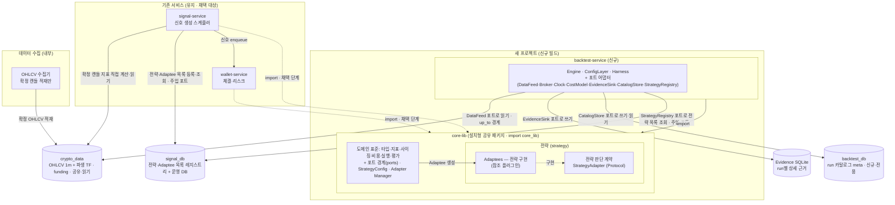

점선 두 개는 `signal-service`와 `wallet-service`가 채택 단계에 가서야 생기는 의존이다. 여기서 채택 단계란 core-lib를
'쓰기 시작한다'는 뜻이 아니라, 이미 자기 코드로 돌아가고 있는 기존 서비스가 그 내부 구현(지표·전략·실행 등)을
`core_lib` import로 갈아 끼우는 이행 단계를 말한다. 두 서비스는 지금 자기 구현으로 프로덕션을 돌리고 있어 아직
`core-lib` 의존이 없고, 그 의존은 채택에 가서야 생기므로 점선으로 그렸다. 갈아 끼운 뒤에도 계산 결과는 그대로다
(같은 계산을 `core_lib`이 대신할 뿐).

`backtest-service`도 `core-lib`를 쓰지만 실선인 이유가 여기서 갈린다. 이 서비스는 처음부터 `core_lib`로 새로 짓기
때문에 갈아 끼울 기존 구현이 없다 — 태어날 때부터 core-lib에 의존하므로 '채택'이라는 단계가 없고, 그 의존이 지금
곧바로 성립한다. 그래서 실선이다. 요컨대 실선과 점선을 가르는 것은 'core-lib를 쓰느냐'가 아니라 '그 의존이 지금
있느냐(신규 서비스), 채택 단계에 가서 생기느냐(기존 서비스)'이다.

저장소 둘은 이 그림에서 일부러 뺐다. `wallet-service`가 체결·포지션·회계를 적는 자기 운영 DB `wallet_db`는
백테스트 데이터 흐름과 상관이 없어 넣지 않았다. `OHLCV 수집기`가 활성 심볼을 읽어 오는 설정 DB `config_db`도
원래 외부 collector가 갖고 있던 관심사라 저장소 중심 뷰에는 넣지 않았다.

`core-lib` 안의 전략 블록에는 두 가지가 들어 있다. `전략 판단 계약`은 플랫폼이 소유하는 '전략을 끼우는 자리'로,
`StrategyAdapter`라는 Protocol이다. `Adaptees`는 그 자리에 꽂히는 실제 전략 구현들이다. 각 전략이 언제 진입하고
언제 청산하는지는 전략 작성자의 몫이라 이 설계의 범위 밖이며, 플랫폼은 끼우는 계약만 정한다.

어떤 전략(Adaptee)이 실제로 있는지, 곧 '실행할 전략 목록'은 코드에 적어 두지 않고 `signal_db`에 레지스트리로
둔다. 이 목록을 다루는 것은 `Adapter Manager`인데, `signal_db`를 직접 건드리지 않고 주입된 `StrategyRegistry`
포트를 거친다. 그래서 `core-lib`은 특정 DB에 묶이지 않는다.

이렇게 목록을 DB에 두는 방식은 새로 지어낸 것이 아니라 현행 signal-service에서 가져왔다. 지금은 쓸 수 있는 전략
목록이 코드에 박혀 있어서, 서비스가 부팅할 때 하드코딩으로 등록한다. 신규 설계는 그 목록을 `signal_db`로 올려
목록의 단일 출처로 삼는다. 레지스트리의 컬럼 구조도 현행 배포 인스턴스 테이블 `trading_strategies`(전략 클래스명·
파라미터 JSONB·심볼·타임프레임·활성 여부·버전)를 그대로 차용하며, 실제 표와 필드는 §5.1에서 확정한다.

## §1.2 서비스 정의서

서비스·저장소의 정의를 두 표로 확정한다. 소비(의존)의 방향은 §1.1 다이어그램이 담고, 표는 각 요소의 유형·책임·
경계(하지 않는 것)·패키징을 담는다. 표로 담기 어려운 규칙(변경 거버넌스)만 표 아래 문장으로 둔다.

**서비스 정의**

| 요소 | 유형 | 책임 | 경계 (하지 않음) | 소비 (→ §1.1) | 패키징 |
|---|---|---|---|---|---|
| `core-lib` | 설치형 공유 패키지 | 도메인 표준(값 타입·금액 정밀도·82종 지표·전략 판단 계약·사이징·비용·실행 수식·성과 평가·판정·포트 경계·Adaptee 생성/파라미터 해석)의 유일한 구현처 | 실행 드라이버 아님(캔들 루프·읽기·저장·wall-clock·IO 없음); 특정 DB 직접 의존 없음(레지스트리도 주입 포트 경유); 서비스 코드 import 안 함 | 없음 — 의존 그래프의 바닥(내부 계층 방향은 §2.1 의존 다이어그램) | `services/core-lib/`, editable 설치 단일 패키지 `core_lib`(하이픈 없음 → 네임스페이스 충돌·`sys.path` 조작 제거) |
| `backtest-service` | 신규 서비스 | `core_lib`만 import하는 결정적 실행 드라이버·입출력 오케스트레이터(사전등록·채번·워밍업 프리로드·캔들 루프·데이터 피드 push·체결·2계층 저장·상위 검증) | 전략 판단·지표·사이징·비용·실행 규칙 자체 미보유(전부 `core_lib` 호출); 라이브 인프라(큐·폴링·HTTP·상태 복구) 없음; 전략 파라미터 스키마·검증 미소유(run 설정만 소유) | `core-lib`(import); `crypto_data`·Evidence SQLite·`backtest_db`·`signal_db`(전부 포트 경유) | `services/backtest-service/`; `core-lib` 의존; 포트의 backtest 구현(어댑터) 소유 |
| `signal-service` | 기존 서비스 (유지·채택) | 확정 캔들마다 지표 증분(O(1)) 직접 계산 + Adapter Manager로 Adaptee 생성·판단 호출 → `wallet-service` 큐로 신호 전달 | 이 설계 단계 미변경(채택 단계에서만 내부 구현→`core_lib` 치환, 동작 불변); 판정 루프 안 돎(라이브 Evidence는 연구 피드백만) | 채택 후 `core-lib`(import); `crypto_data`(읽기·지표 계산); `signal_db` | 기존 리포 서비스; 채택은 무중단 re-export shim |
| `wallet-service` | 기존 서비스 (유지·채택) | 신호 큐 소비 → 사이징·실행·비용 호출로 체결·리스크·킬스위치; 체결·포지션·회계를 자기 운영 DB에 기록 | 이 설계 단계 미변경(채택 단계에서 체결 시점 즉시→다음 캔들 시가 전환, 회귀 ~1279건 필요); 라이브 인프라 백테스트로 미이관 | 채택 후 `core-lib`(import); `wallet_db` | 기존 리포 서비스; 채택은 re-export shim |
| `OHLCV 수집기` | 내부 컴포넌트 | 거래소 확정 캔들 OHLCV를 `crypto_data`에 적재(확정 캔들마다 1행·무조건) | 지표 미생성(계산은 signal·backtest가 `core_lib`로); 진행 중 캔들 미적재(look-ahead 방지의 데이터 층 근거); 단일 심볼 Binance 선물만(Upbit 현물 범위 밖) | 거래소 REST·WebSocket(입력); `crypto_data`(쓰기); `config_db`(활성 심볼 읽기) | 외부 collector의 리포 내부 이관분; 과거 구간은 기존 backfill 재사용 + `crypto_data` 보존 연장(예: 2000일) |

**저장소 정의**

| 저장소 | 유형 | 책임 | 접근 (쓰기/읽기) | 경계 |
|---|---|---|---|---|
| `crypto_data` | 공유·읽기 | 확정 캔들 OHLCV(1분 적재, 상위 TF는 연속 집계 뷰) + funding rate 시계열 | `OHLCV 수집기` 쓰기; `backtest-service`(DataFeed 포트)·`signal-service` 읽기; 백테스트 미기록 | crypto-data-hub가 생성·소유하는 공유 DB; 백테스트 결과 미저장; 전략 TF와 별도로 1분 트리거 캔들 보유(1분 집행 피드 사용은 §4.4 확정) |
| `backtest_db` | 신규·전용 메타 | run 요약·카탈로그·사전등록·태그 등 run 메타(검색·비교·집계 근거) | `backtest-service`(CatalogStore 포트) 쓰기, Harness 읽기; 조회용 읽기 전용 역할을 writer와 분리 | 운영 DB와 분리(연구 데이터 오염 방지); 상세 Evidence 미보유; 이름·writer 계승·스키마 신규·읽기 전용 역할 신설(필드는 §5.2) |
| `signal_db` | 기존 + 레지스트리 | `signal-service` 운영 DB + 실행할 전략(Adaptee) 목록 레지스트리 — 현행 코드 상주(부팅 하드코딩) 목록을 DB로 승격해 전략 목록의 단일 출처로 삼음 | `signal-service` 쓰기; Adapter Manager가 주입 포트로 등록·조회(`backtest-service`도 주입 포트로 조회) | `core_lib` 직접 의존 없음(주입 포트 경유); 레지스트리는 현행 `trading_strategies`(클래스명·파라미터 JSONB·심볼·타임프레임·활성·버전) 구조 차용, ERD·필드는 §5.1 |
| Evidence SQLite | run별 상세 | run별 캔들 신호·주문·체결·포지션·손익·지표 스냅샷(forensics·재현 원천) | `backtest-service`(EvidenceSink 포트) 쓰기; 대시보드·연구 읽기; 라이브는 연구 피드백용만 | run 자기완결(원천 스냅샷 로컬 사본); 운영 DB 미저장; 결정성 해시=정렬 행 정규화 직렬화(파일 바이트 아님)(필드는 §5.3) |

**표로 담기 어려운 규칙 (문장).** `core-lib`는 세 소비자(백테스트·signal·wallet)가 공유하므로, 통제 없는 변경이
"모두가 건드리고 아무도 소유하지 않는" 결합 허브로 퇴화하지 않게 **변경 거버넌스 3규칙**을 강제한다. 첫째,
`core-lib` 변경이 포함된 커밋은 리뷰 게이트 대상에 항상 포함한다. 둘째, `core_lib` 밖에 표준 모듈(지표·실행 계산기
등)의 사본이 생기면 실패하는 저비용 재복제 가드 테스트(glob 검사 또는 import 계약)를 두어 복제 드리프트 재발을
원천 차단한다(CI 없이도 작동). 셋째, editable 설치(HEAD 추적)는 페이퍼까지만 허용하고, 실거래 전환 시 고정 버전
릴리스로 바꿔 전략 한 줄 수정이 즉시 실거래 경로에 반영되는 것을 막는다.

**채택 후 포트 경계 (문장).** 위 정의 표는 `signal-service`가 `crypto_data`를 읽고 `wallet-service`가 `wallet_db`에
쓰는 것으로 적었지만, 이는 요약이다. 두 서비스는 채택 단계에서 백테스트와 **같은 포트 계약의 반대편**을 채운다 —
각자의 live/paper 포트 구현(DataFeed 실시간 스트림·Broker 거래소 API·Clock 실시계·CostModel 실측·EvidenceSink
라이브)을 자기 서비스 안에 둔다. 그래야 "환경 차이는 포트로만 주입한다"가 backtest뿐 아니라 paper·live에도
성립한다. 이 구현 자체는 이 판이 아니라 채택 설계(§3.3·부록)에서 그린다.

---

# §2 프로젝트 코드 트리

서비스 아래의 실제 디렉터리·패키지 구조다. 클래스를 그리기 전에 구조부터 확정한다. 새 프로젝트의 루트에는 두 축이
형제로 놓인다. 하나는 두 패키지(`core-lib`·`backtest-service`)를 담는 `services/`이고, 다른 하나는 배포할 때 DB와
역할을 초기화하는 `init-scripts/`다. 트리의 각 경로에는 한 줄로 역할을 달았고, 각 노드는 뒤(§3)에서 그릴 컴포넌트와
짝이 된다.

짝은 대부분 1:1이지만 예외가 있다. `strategy/` 한 디렉터리가 컴포넌트 셋(전략 판단 계약·Adapter Manager·
StrategyConfig)을 담고, `adapters/` 한 디렉터리가 어댑터 일곱을 담는다. 반대로 `adaptees/`는 참조 플러그인이 놓이는
자리라 플랫폼 컴포넌트로 세지 않는다. 아래 표가 디렉터리와 §3 컴포넌트의 짝, 그리고 개수를 확정한다.

| 경로 | §3 컴포넌트 | 개수 |
|---|---|---|
| `core_lib/{types, indicators, sizing, costs, execution, ports, eval}` | 각 동명 컴포넌트 | 각 1 (합 7) |
| `core_lib/strategy/` (`base`+`profile`+`trailing` / `manager`(+`registry`+`factory`) / `config`) | 전략 판단 계약 · Adapter Manager · StrategyConfig | 3 |
| `core_lib/strategy/adaptees/` | 참조 플러그인 전략 | 0 (플랫폼 컴포넌트 아님) |
| **§3.1 core-lib 소계** | | **10** |
| `backtest_service/{engine, config, harness}` | Engine · ConfigLayer · Harness | 각 1 (합 3) |
| `backtest_service/adapters/` | 포트 어댑터(6 대표 + `strategy_registry`) | 7 |
| **§3.2 backtest-service 소계** | | **3 + 어댑터 7** |

그래서 §3.1은 core-lib 컴포넌트 열 종을, §3.2는 Engine·ConfigLayer·Harness에 일곱 포트 어댑터를 더해 그린다.

## §2.1 `core-lib` 트리 (설치형 공유 패키지)

```text
services/core-lib/
  pyproject.toml                     # 패키지 정의(name="core-lib", packages=["core_lib"]); editable 설치로 sys.path 조작 폐지
  core_lib/
    __init__.py                      # 패키지 진입점
    types/                           # [컴포넌트] 도메인 값 타입·금액 정밀도의 단일 정의처
      candle.py                      #   통합 캔들 타입(신규): symbol·exchange·timeframe·open_time·close_time·o·h·l·c·v·quote_volume?·trade_count?; 캔들 검증 불변식 강제
      signal.py                      #   TradingSignal(판단 전용, 방향·수량 필드 없음)·SignalType — 신호 표준 승격
      order.py                       #   Order(주문·상태기계)
      position.py                    #   Position(포지션·가중평균·청산가)
      trade.py                       #   Trade(체결 완료 거래; r0=최초 위험 추가)
      fill.py                        #   Fill(체결 사실 명시 타입, 신규)
      enums.py                       #   OrderStatus/Side/Type·PositionSide·MarginType·MarketType·ExitReason(신규)
      money.py                       #   ZERO·Q_PRICE/AMOUNT/PERCENT/RATIO/FEE_RATE·quantize_*(ROUND_HALF_EVEN) — 금액 정밀도 상수
    indicators/                      # [컴포넌트] 공용 계산 프리미티브 + 82종 지표 표준(벡터화·증분 두 경로)
      primitives.py                  #   공용 계산 단위: sma·ema·wma·rma·tr·tp·stdev·hh·ll·cumulative·roc·linreg
      trend.py                       #   추세·이동평균 지표군
      momentum.py                    #   모멘텀 지표군
      volatility.py                  #   변동성 지표군
      volume.py                      #   거래량 지표군
      strength.py                    #   추세강도 지표군
      bill_williams.py               #   Bill Williams 지표군
      breadth.py                     #   시장폭 지표군(입력 없으면 비활성)
      cycle.py                       #   사이클(Ehlers) 지표군
      systems.py                     #   기타·복합 지표군
      donchian.py                    #   Donchian(82종의 하나·옵션, 특정 전략용)
      registry.py                    #   지표 등록·버전·구현 고정 근거·min_history
      contracts.py                   #   확정 캔들 전용 계약 강제(close_time ≤ 판단 시각)
    strategy/                        # [컴포넌트×3] 전략 판단 계약(base.py) + Adapter Manager(manager.py) + StrategyConfig(config.py)
      base.py                        #   StrategyAdapter(typing.Protocol) — 전략 판단 계약(analyze·metadata·파라미터 스키마 선언)
      registry.py                    #   in-process 플러그인(Adaptee) 등록·조회 규약 — Adapter Manager 소관; 외부 signal_db 구현 카탈로그와 별개(그건 ports/strategy_registry.py)
      factory.py                     #   Adaptee 생성 규약 — Adapter Manager(manager.py) 소관
      manager.py                     #   Adapter Manager — Adaptee 생성(Factory)·lifecycle; 외부 구현 카탈로그는 ports/strategy_registry.py(주입 포트)로 signal_db 등록·조회
      config.py                      #   StrategyConfig — 전략 파라미터 해석·검증·직렬화·UI JSON Schema 노출
      profile.py                     #   전략 프로파일 스키마(family·기대 승률/손익비 범위·tail_shape·성숙도 등) — 판단 계약 부속
      trailing/                      #   ATR 트레일링 표준 위치 — 판단 계약 부속(첫 검증 스코프 유보; 재도입 시 단일 표준으로 통합·파리티 확정)
        trailing_stop.py             #     트레일링 스탑 순수 함수 계산기(Adaptee가 상속 아닌 호출)
      adaptees/                      #   구현 전략(Adaptee) 위치 — 코어 계약 거버넌스와 별도 관리되는 첫 검증 참조 플러그인(플랫폼 컴포넌트 아님); 진입·청산 엣지는 각 Adaptee 소유(범위 밖); in-process strategy/registry.py에 등록되고, 외부 signal_db 카탈로그 동기화는 Adapter Manager가 ports/strategy_registry.py로 수행
        vessel_*.py                  #     첫 파이프라인 검증용 Vessel 계열 Adaptee(신규 구현, 트레일링 없이); 터틀 진입 전략은 만들지 않음
    sizing/                          # [컴포넌트] 거래당 위험 규율과 사이징 인스턴스
      risk_money.py                  #   보편 사이징: 수량=(risk_per_trade×Equity)/손절거리, 1R≤1%, 노출 한도, RoR 연동
      turtle_unit.py                 #   터틀 인스턴스(N 사이징·0.5N 피라미딩·유닛 한도) — 전략이 선택 조합
      wallet_pct.py                  #   pct 방식(호환) — framework 비준수 플래그 의무
      kelly.py                       #   Half/Quarter-Kelly 상한
    costs/                           # [컴포넌트] net 손익 4개 비용 수식 표준(값은 CostModel 주입)
      fee.py                         #   수수료(maker/taker, notional×rate)
      slippage.py                    #   슬리피지(고정 bps + 스프레드/충격)
      funding.py                     #   펀딩(이산 정산, 경계 캔들 시가 기준)
      liquidation.py                 #   청산가·청산 판정(Isolated 우선, 보수 방향)
    execution/                       # [컴포넌트] 주문 라이프사이클·결정적 체결·포지션 장부·회계
      order_lifecycle.py             #   NEW→FILLED 상태전이(VALID_TRANSITIONS)
      matcher.py                     #   결정적 체결 규칙(fill_timing·다음 캔들 시가·트리거·동시 터치 우선·갭·수량 절삭)
      position_book.py               #   포지션 갱신·가중평균·reduce_only·청산 판정·최초 체결 캔들 자기검사 회피
      accounting.py                  #   cash+position=equity 항등식·비용 1회 차감
      normalizer.py                  #   float→Decimal 단일 변환·quantize 관문(공유 코드) — 모든 Broker 어댑터의 submit()이 이 함수를 통과(어댑터별 독자 캐스팅 금지); 우회는 적합성 테스트로 차단(불변식: 단일·동일 캐스트)
    ports/                           # [컴포넌트] 환경별 관심사의 어댑터 경계(전부 ABC; 구현은 서비스가 주입) — 표준 포트 6종 + Adaptee 레지스트리 접근 포트 = 7종을 둔다; 목록 완결성·시그니처·구현 계약은 §3.2에서 확정
      data_feed.py                   #   DataFeed ABC: candles(up_to 경계)·funding·mark_price
      broker.py                      #   Broker ABC: submit(order)→Fill·open_orders·cancel — 추상 계약만 선언(ports는 types만 참조, execution 미참조). Decimal 단일 변환은 구현 어댑터가 submit()에서 core_lib.execution.normalizer(공유)를 통과해 달성
      clock.py                       #   Clock ABC: now·advance(wall-clock 금지)
      cost_model.py                  #   CostModel ABC: fee·slippage·funding_rate·liq_params(값 주입)
      evidence_sink.py               #   EvidenceSink ABC: record(entity)·finalize(run)
      catalog_store.py               #   CatalogStore ABC: save_prereg·register·upsert_summary
      strategy_registry.py           #   Adaptee 구현 카탈로그 접근 ABC — 외부 signal_db 등록·조회(주입 포트); core_lib은 특정 DB에 직접 의존 안 함
    eval/                            # [컴포넌트] 성과 수식 표준 1곳 + 판정 3단계
      metrics.py                     #   성과 지표 수식(일간 리샘플 후 √365, Sortino 분모 전체 N, SQN √min(N,100), MDD 등)
      integrity.py                   #   무결성 검사(회계·시점·비용 1회·결정성·Evidence 완성도)
      hard_gate.py                   #   Hard Gate(전 전략 공통 평가 기준값)
      decision.py                    #   Decision(사전등록 Primary Metric 기준 처리)
      thresholds.py                  #   평가 기준값(통과선)의 단일 코드 구현
      profile.py                     #   프로파일 기대 범위 소비 규칙(경고/established 회귀만 reject)
  tests/                             # 패키지 테스트 스캐폴드
    test_no_reduplication.py         #   재복제 가드 — core_lib 밖에 표준 모듈(지표·실행 계산기 등) 사본이 생기면 실패(변경 거버넌스 규칙 2, CI 없이 작동)
```

이 트리가 표준 패키지 구조에 더한 파일은 두 갈래다. 한 갈래는 표준이 이름만 잡아 두었던 것을 실제 파일로 앉힌
경우로, `strategy/manager.py`(Adapter Manager)와 `strategy/config.py`(StrategyConfig)가 여기 든다. 다른 갈래는 이
상세 설계가 계약을 구체화하며 새로 더한 파일로, Decimal 단일 관문 `execution/normalizer.py`, 레지스트리 접근 포트
`ports/strategy_registry.py`, 참조 플러그인 자리 `strategy/adaptees/`, 재복제 가드 `tests/`가 그렇다. 둘 중 어느
것도 표준을 덜어내지 않는다 — 표준의 정본 파일은 하나도 빠지지 않았다.

아래 다이어그램은 `core_lib` 내부 모듈끼리의 의존만 본 것이다. 화살표는 "참조한다"는 뜻이고, 모두 한 방향이라
역참조가 없다. 맨 아래는 `types`이며, 나머지 모듈이 값 타입을 여기서 가져다 쓴다. 그 위의 구조는 세 가지만 따로
읽으면 정확히 보인다.

첫째, `ports`와 `eval`은 `types`만 참조하는 잎(leaf)이다. 이 둘을 실제로 쓰는 쪽은 `backtest-service`의 Engine 같은
서비스 계층이라, core_lib 안쪽만 그린 이 그림에는 그 소비자가 나타나지 않는다(서비스가 core_lib에 의존하는 관계는
§1.1에 그려져 있다).

둘째, `MGR`(Adapter Manager)이 가리키는 `REG`는 `ports/strategy_registry.py`의 접근 포트(ABC)일 뿐이다. `signal_db`에
실제로 붙는 구체 어댑터는 backtest·signal 서비스가 주입하므로, `core_lib` 자체는 어떤 DB에도 직접 묶이지 않는다.
게다가 `REG`는 Adaptee 카탈로그 식별자와 직렬화 metadata만 다루고 core 값 타입은 쓰지 않아, `types`로 가는 엣지도
없다.

셋째, `strategy/adaptees/`의 구현 전략은 이 그림에서 뺐다. 이들은 `strategy`(base·profile·trailing)·`indicators`·
`types`를, 필요하면 `sizing`·`costs`까지만 참조하고, `ports`·`execution`이나 서비스 코드·DB 어댑터는 참조하지
않는다 — 플러그인이 코어의 경계를 넘지 않게 하기 위해서다.

각 클래스의 계약과 컴포넌트 인터페이스는 §3.1과 §4에서 확정한다.

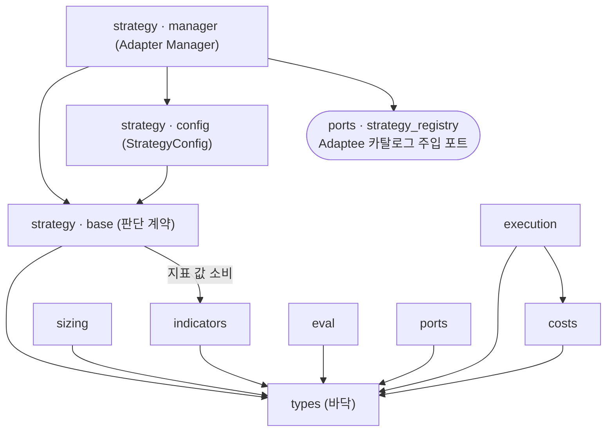

## §2.2 `backtest-service` 트리 (신규 서비스)

이 서비스는 `core_lib.ports`의 ABC 하나하나에 대해 그 backtest용 구현(어댑터)을 채운다. `adapters/` 아래 파일명이
`core_lib/ports/` 쪽과 겹치는 것은, 같은 관심사를 추상(ABC)과 구현(어댑터) 두 자리에서 부르기 때문이라 일부러 맞춰
둔 것이다.

```text
services/backtest-service/
  pyproject.toml                     # 패키지 정의; core-lib를 의존성으로(editable 설치)
  backtest_service/
    __init__.py                      # 패키지 진입점
    config/                          # [컴포넌트] ConfigLayer — 백테스트 run 설정
      run_config.py                  #   run 설정 pydantic 스키마·검증(OHLCV·funding 소스/구간, CostModel 값, 거래소 규칙, 실행/리스크, 파라미터 sweep, 지표 계산 모드, 프로파일 선택); 전략 스키마·검증은 제외(core_lib.StrategyConfig 소관)
    engine/                          # [컴포넌트] Engine — 결정적 실행 드라이버·입출력 오케스트레이터
      engine.py                      #   캔들 루프·look-ahead 순서·데이터 피드 push·체결·저장·eval 호출; Adapter Manager로 Adaptee 생성 (캔들 루프·집행 시퀀스는 §4.4)
    adapters/                        # [컴포넌트×7] core_lib.ports ABC의 backtest 구현(어댑터) — 표준 6종 + strategy_registry = 7 구현; 목록 완결성·시그니처·구현 계약은 §3.2에서 확정
      data_feed.py                   #   DataFeed 구현: crypto_data 과거 OHLCV·funding 공급, up_to 이후 캔들 미노출
      broker.py                      #   Broker 구현: 결정적 시뮬 체결 + CostModel; core_lib.execution.normalizer(공유)를 통과 — 어댑터 자체 캐스팅 없음
      clock.py                       #   Clock 구현: 시뮬 캔들 시각(결정적, wall-clock 금지)
      cost_model.py                  #   CostModel 구현: 보수적 주입값·과거 실측 펀딩 rate
      evidence_sink.py               #   EvidenceSink 구현: run별 SQLite 상세 기록
      catalog_store.py               #   CatalogStore 구현: backtest_db 카탈로그 메타 기록·조회
      strategy_registry.py           #   strategy_registry 구현: signal_db Adaptee 카탈로그 등록·조회(backtest 측 주입 어댑터)
    harness/                         # [컴포넌트] Harness — 단일 run 밖 상위 검증 오케스트레이션
      harness.py                     #   표본 내/외 분리·워크포워드·몬테카를로·확률적 샤프·파라미터 스윕(카탈로그 비교)
  tests/                             # 패키지 테스트 스캐폴드
    test_broker_normalizer_conformance.py  #   모든 Broker 어댑터가 core_lib.execution.normalizer를 통과하는지 검사(Decimal 단일 캐스트 우회 방지)
    # + 포트 어댑터·Engine 루프·결정성 테스트
```

`Engine`은 오직 `core_lib`만 import하고, 데이터 읽기·체결·저장·시계는 전부 `adapters/`의 포트 구현에 맡긴다.
전략 판단·지표·사이징·비용·실행 규칙은 이 서비스에 두지 않는다 — 모두 `core_lib`을 호출해서 쓴다.

## §2.3 배포 루트 (DB 초기화)

`backtest_db`를 만들고 역할을 세우는 일은 서비스 패키지 안이 아니라 새 프로젝트의 배포 루트에서 한다. 그 자리는
`services/`와 형제인 `init-scripts/`이며, 기존 서비스별 마이그레이션 미러 구조를 그대로 따른다. 실제 테이블·Entity
스키마는 데이터베이스 설계(§5)가 ERD로 확정하고, 여기서는 디렉터리·역할 배치와 파일 번호 규약만 고정한다.

```text
(새 프로젝트 루트)
  services/
    core-lib/                        # §2.1
    backtest-service/                # §2.2
  init-scripts/                      # 배포 루트 — DB·역할 초기화(services/ 와 형제)
    NN-init-backtest-db.sql          #   backtest_db·backtest_writer 유지 계승 + 읽기 전용 backtest_reader 역할 신설; 파일 번호는 구현 시점 라이브 루트 실제 최고 번호 다음(현재 기준 04-…)
    backtest-service/                #   backtest_db meta 스키마 마이그레이션(기존 per-service 미러 구조; 테이블·필드는 §5.2)
```

---

# §3 컴포넌트 다이어그램 + 정의서 (서비스별)

이 절은 §1의 서비스와 §2의 코드 트리를 컴포넌트 층위로 내린다. 서비스마다 다이어그램을 하나씩 두고, 여러
서비스를 한 다이어그램에 섞지 않는다. 공유 계층 `core-lib`의 컴포넌트는 §3.1에서 한 번만 정의하고,
`backtest-service`(§3.2)와 채택 후 서비스(§3.3)는 이를 **다시 그리지 않고 참조**한다(참조 노드에 `§3.1 정의`를
붙인다). 다이어그램이 컴포넌트·인터페이스 경계·의존 방향(화살표)을 담고, 문장은 다이어그램이 담지 못하는 것 —
각 컴포넌트의 책임과, 소비 서비스가 `core_lib`의 무엇을 어디서 쓰는지 — 만 보탠다. 클래스·시그니처·필드는 이
절의 범위가 아니라 §4·§5가 각 컴포넌트 아래에 매단다.

## §3.1 core-lib 컴포넌트 (공유)

`core-lib`는 세 실행 모드가 공유하는 도메인 표준의 유일한 구현처다. 열 개 컴포넌트로 이뤄지며, 여기서 한 번
정의해 모든 소비자가 참조한다. 아래 다이어그램이 열 컴포넌트와 그 내부 의존 방향을 담는다 — `types`가 바닥이고,
화살표는 "참조한다(의존)"를 뜻하며 역방향은 없다. `strategy/adaptees/`의 구현 전략(Adaptee)은 플랫폼 컴포넌트가
아니라 참조 플러그인이므로 이 뷰에 컴포넌트로 등장하지 않는다 — 플랫폼은 전략을 끼우는 계약(`전략 판단 계약`)만
그린다. `ports`·`eval`은 `types`만 참조하는 잎이다. `eval`과 여섯 환경 포트(`DataFeed`·`Broker`·`Clock`·
`CostModel`·`EvidenceSink`·`CatalogStore`)의 소비자는 서비스 계층(Engine 등)이라 이 내부 뷰가 아니라 §3.2·§3.3의
소비 화살표에 나타나지만, 일곱 번째 포트인 `StrategyRegistry`(Adaptee 카탈로그 주입 포트)만은 `Adapter Manager`가
core_lib 안에서 소비하므로 아래 다이어그램에 내부 엣지(`Adapter Manager` → `ports`)로 나타난다.

core-lib 내부 컴포넌트와 의존 방향.

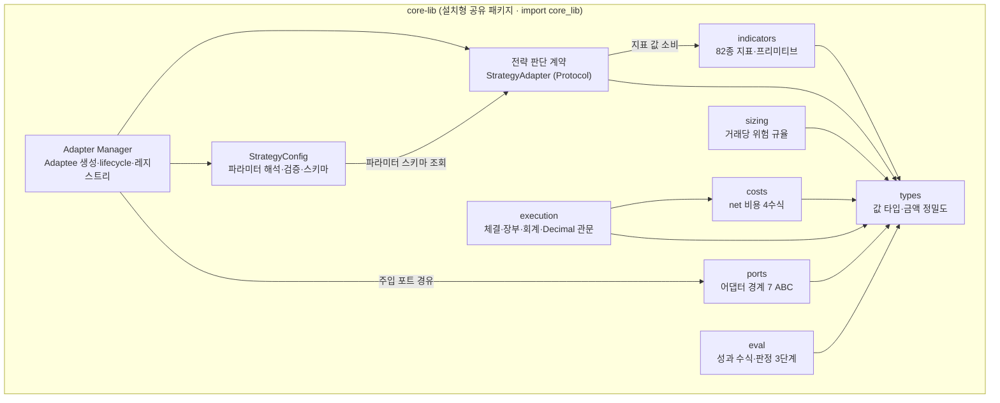

의존 방향은 다이어그램이 담으므로, 정의서는 각 컴포넌트의 **책임**과 **인터페이스 경계**(공개 표면과 하지 않는
것), 그리고 그것을 이루는 §2 트리 파일만 적는다. 인터페이스의 정확한 시그니처·필드·수식·임계값 수치는 §4가
확정한다.

| 컴포넌트 | 책임 | 인터페이스 경계 (공개 표면 · 하지 않음) | 구성 (§2 트리) |
|---|---|---|---|
| `types` | 세 실행 모드가 공유하는 값 타입·금액 정밀도의 유일한 정의처 | 공개: `Candle`·`TradingSignal`(판단 전용, 수량·방향 필드 없음)·`Order`·`Position`·`Trade`(`r0` 포함)·`Fill`·enums·`money`(ZERO·Q_*·quantize_*). 하지 않음: 계산·IO 없음; 캔들 검증 불변식(시각 단조·`high ≥ max(open,close)`·`low ≤ min(open,close)`)을 타입 계층에서 강제 | `types/`의 candle·signal·order·position·trade·fill·enums·money |
| `indicators` | §0 프리미티브 + 82종 지표 표준(벡터화·증분 두 경로) | 공개: `registry.get(name, params)`·`compute_batch(candles, enabled_set)`·`IndicatorState.update(candle)`·`contracts.assert_finalized`. 하지 않음: 확정 캔들만 입력(`close_time ≤ 판단 시각`); 계산은 float64(Decimal 변환은 `execution` 관문 소관); 계산 대상은 run 설정이 결정 | `indicators/`의 primitives·지표군 9파일·donchian·registry·contracts |
| `전략 판단 계약` | 전략을 끼우는 판단 계약(Strategy 패턴)의 선언 | 공개: `StrategyAdapter`(`typing.Protocol`) — `get_metadata()`·`get_parameter_schema()`·`analyze(market_data, position?) → TradingSignal`; metadata에 `required_indicators`·`min_history`·`timeframe`·프로파일 선언. 하지 않음: 판단만(읽기·저장·루프 없음); Adaptee는 stateless; 미래 데이터 자가 인출 없음(look-ahead는 Engine 피드 경계가 통제); 파라미터 스키마는 선언만(해석은 `StrategyConfig`); 진입·청산 엣지는 각 Adaptee 소유(범위 밖); 트레일링은 순수 함수 호출(상속 아님·유보) | `strategy/base.py`·`profile.py`·`trailing/`(유보) |
| `sizing` | 거래당 위험 규율과 사이징 인스턴스 | 공개: `risk_money.size(equity, stop_distance, risk_per_trade ≤ 1%)`·`turtle_unit`·`wallet_pct.size`(호환)·`kelly.cap`. 하지 않음: 엣지 창조 없음(엣지는 진입 신호); `1R = |체결가 − 최초 보호 스탑| × 수량`이고 `1R ≤ 1%`; pct 경로는 보장 실패 시 비준수 플래그 의무 | `sizing/`의 risk_money·turtle_unit·wallet_pct·kelly |
| `costs` | net 손익 4개 비용 수식 표준(값은 주입) | 공개: `fee.calc`·`slippage.apply`·`funding.settle`·`liquidation.price/is_triggered`. 하지 않음: 비용 값 미보유(전량 `CostModel` 주입); 펀딩은 이산 정산(UTC 경계, 정산가 = 경계 포함 최소 가용 TF 캔들 시가); 청산은 Isolated 우선·보수 방향 | `costs/`의 fee·slippage·funding·liquidation |
| `execution` | 주문 라이프사이클·결정적 체결·포지션 장부·회계 + Decimal 단일 변환 관문 | 공개: `order_lifecycle`(VALID_TRANSITIONS)·`matcher`(체결 규칙)·`position_book`·`accounting.recompute`·`normalizer`. 하지 않음: `cash + position = equity` 유지·비용 1회 차감; float→Decimal 단일 변환은 `normalizer` 한 곳에서만(모든 Broker 어댑터가 `submit()`에서 통과, 어댑터별 캐스팅 금지); `decision_ts < execution_ts` 강제 | `execution/`의 order_lifecycle·matcher·position_book·accounting·normalizer |
| `ports` | 환경별 관심사의 어댑터 경계(전부 ABC, 구현은 서비스 주입) | 공개: 7 ABC — `DataFeed`·`Broker`·`Clock`·`CostModel`·`EvidenceSink`·`CatalogStore`·`StrategyRegistry`. 하지 않음: 추상 계약만 선언(`types`만 참조, `execution` 미참조); wall-clock·네트워크·파일 IO는 구현 어댑터 안에만; 특정 DB 직접 의존 없음(레지스트리도 주입 포트) | `ports/`의 7파일 |
| `eval` | 성과 수식 표준 1곳 + 판정 3단계 | 공개: `metrics`·`integrity.check`·`hard_gate.judge`·`profile.check_envelope`·`decision.decide`·`thresholds`. 하지 않음: 판정 순서는 무결성 → Hard Gate → Decision 고정; 통과선은 한 곳 구현(수식·임계값 수치는 §4가 확정); 프로파일은 established 회귀만 reject | `eval/`의 metrics·integrity·hard_gate·decision·thresholds·profile |
| `Adapter Manager` | Adaptee 생성(Factory)·lifecycle + 구현 목록 레지스트리 | 공개: `create(strategy_id, raw_config) → StrategyAdapter`(내부에서 `StrategyConfig` 해석 호출)·lifecycle·`registry.list()/register()`. 하지 않음: 전략 결정 로직·파라미터 검증 로직 미보유(각각 Adaptee·`StrategyConfig`); 레지스트리 DB 접근은 주입 포트로만(core-lib은 특정 DB 직접 의존 없음) | `strategy/manager.py`·`registry.py`·`factory.py` |
| `StrategyConfig` | 전략 파라미터 config의 해석·검증·직렬화·스키마 노출 | 공개: `resolve(schema, raw_config) → ResolvedConfig`·`json_schema(schema)`·`serialize/version`(스키마를 값으로 받아 무순환; 정확한 시그니처는 §4.2). 하지 않음: 스키마 선언은 Adaptee 소유(여기서 재정의 금지); 값은 호출자 소유(소스 미보유); 파라미터 스윕·실행 설정은 범위 밖(`ConfigLayer`) | `strategy/config.py` |

`전략 판단 계약`이 참조하는 `strategy/adaptees/`의 구현 전략과 `strategy/trailing/`은 유보다 — 첫 검증 전략은
트레일링 없이 ATR 기반 고정 손절·익절로 구현하고, 트레일링을 쓰는 전략이 도입될 때 `trailing`을 단일 표준으로
되살려 파리티를 확정한다. 표준 위치는 트리에 남지만 이 판의 컴포넌트 계약을 바꾸지 않는다. `execution`의
`normalizer`와 `ports`의 `StrategyRegistry`는 표준 골격을 구체화한 추가분으로, 각각 Decimal 단일 변환을 한 곳에
모으고 Adaptee 카탈로그 접근을 주입 포트로 격리한다.

## §3.2 backtest-service 컴포넌트

`backtest-service`는 이 판이 새로 짓는 유일한 실행 드라이버 서비스로, `core_lib`만 import한다. 세 자체 컴포넌트
(`ConfigLayer`·`Engine`·`Harness`)와, `core_lib.ports`의 각 ABC를 실체화한 backtest 어댑터로 이뤄진다. 아래
다이어그램은 이 서비스의 컴포넌트와, 그것이 `core_lib`(§3.1 정의)의 무엇을 소비하는지, 그리고 어댑터가 어느 포트
ABC를 구현하는지를 담는다. `core_lib` 컴포넌트는 §3.1에서 정의했으므로 여기서는 소비 대상 참조 노드로만 둔다.
저장소 접근(어느 어댑터가 어느 저장소를 읽고 쓰는지)은 §1.1 서비스 다이어그램이 담으므로 다이어그램에서 반복하지
않고 아래 어댑터 표의 `저장소 접근` 열에 적는다.

backtest-service 컴포넌트와 core_lib 소비·포트 구현.

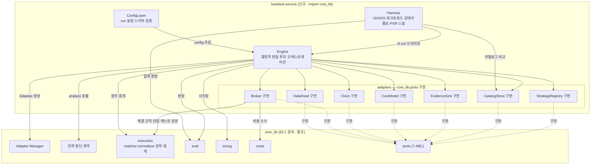

세 자체 컴포넌트의 책임과 `core_lib` 소비 지점은 다음과 같다. 의존은 다이어그램이 담으므로 문장은 반복하지 않는다.

| 컴포넌트 | 책임 | core_lib 소비 지점 | 구성 (§2 트리) |
|---|---|---|---|
| `ConfigLayer` | 백테스트 run 설정(OHLCV·funding 소스/구간·`CostModel` 값·거래소 규칙·실행/리스크·파라미터 스윕·지표 계산 모드·프로파일 선택)의 pydantic 스키마·검증 후 Engine 주입 | 전략 파라미터 스키마·검증은 소유하지 않고 선택값(전략 id·파라미터 값·symbol·timeframe)만 담아 `Adapter Manager`로 넘긴다 — 해석·검증은 `StrategyConfig` 소관(같은 config가 backtest·라이브에서 동일 검증) | `config/run_config.py` |
| `Engine` | `core_lib`만 import하는 결정적 캔들 루프·입출력 오케스트레이터: 사전등록·채번·워밍업 프리로드·피드 push·체결·2계층 저장·finalize·eval 호출; 워밍업 구간 신호 discard, 동일 입력·seed → 동일 Evidence | `Adapter Manager`로 Adaptee 생성, `전략 판단 계약`의 `analyze` 호출, `sizing`으로 수량 산정, `execution`으로 포지션 장부·회계, `eval`로 판정; 데이터·체결·시계·비용·기록은 전부 포트 어댑터 경유(체결 규칙 자체는 Broker 어댑터가 `execution.matcher` 소비) | `engine/engine.py` |
| `Harness` | 단일 run 밖 상위 검증(표본 내/외 분리·워크포워드·몬테카를로·확률적 샤프·파라미터 스윕) 오케스트레이션, 카탈로그로 run 집합 비교 | `eval`로 집계 판정, `CatalogStore` 어댑터로 `backtest_db` 읽기; 개별 run 구동은 `Engine` 재사용(스윕 run_id는 Engine이 카탈로그 시퀀스로 단독 발급) | `harness/harness.py` |

**포트 목록 확정 (7종).** 표준 골격은 "어떤 관심사가 포트가 되는지 미리 고정하지 않는다"고 두었고, 이 판이 그
목록을 확정한다. 환경(백테스트·페이퍼·라이브)에 따라 값이 갈리는 관심사가 정확히 아래 일곱이며, 순수 결정
로직(전략 판단·지표·사이징·비용 수식·체결 규칙·평가)은 포트 밖 `core_lib`에 남는다. 따라서 포트 목록을 이 일곱으로
고정한다(표준 여섯 종 + Adaptee 레지스트리 접근 = 7). 아래 표가 각 backtest 어댑터의 구현 대상 ABC·구체 동작·
`core_lib` 소비·저장소 접근을 확정한다. 라이브·페이퍼는 같은 ABC의 반대편 구현을 각 서비스가 소유하며(§3.3),
`CatalogStore`만은 백테스트 전용이라 라이브 구현이 없다.

| 어댑터 (backtest 구현) | 구현하는 포트 ABC | 구체 동작 | core_lib 소비 | 저장소 접근 |
|---|---|---|---|---|
| DataFeed 구현 | `DataFeed` | 과거 확정 OHLCV·funding·mark_price를 **전략 TF 캔들**로 공급, `up_to` 경계 이후 캔들 미노출(look-ahead 구조 배제). 1분 하위 집행 피드는 유보되어 이 어댑터 표면은 전략 TF 캔들 기준이며, 1분 트리거 walk·트레일링 파리티 편차는 Engine 설계(§4.4)에서 확정하되 소비 전략이 없어 재유보 | `ports.DataFeed`·`types.Candle` | `crypto_data` 읽기(백테스트 미기록) |
| Broker 구현 | `Broker` | 결정적 시뮬 체결(다음 캔들 시가 기본·intrabar 트리거·캔들 내 손절·익절 동시 도달 시 손절 우선 OHLC-locked·갭·수량 절삭) + `CostModel` 적용. `submit()`은 `core_lib.execution.normalizer`(공유)를 통과해 float→Decimal 단일 변환 — 어댑터 자체 캐스팅 없음 | `ports.Broker`·`execution`(matcher·normalizer)·`costs` | — |
| Clock 구현 | `Clock` | 시뮬 캔들 시각 공급(결정적, wall-clock 금지) | `ports.Clock` | — |
| CostModel 구현 | `CostModel` | 보수적 주입값 공급 — 수수료 maker 0.0002(0.02%)/taker 0.0005(0.05%)·유지증거금률 0.004(0.4%)·펀딩 정산 간격 UTC 0/8/16시·펀딩 fallback rate 0.0001(0.01%)·pct 사이징 기본 0.20(20%)를 시작 기본값으로, 슬리피지는 호환 bps 기본(선물 진입 0.0005 등)이되 표준 경로는 스프레드/2 + 충격 스트레스. 부과 규칙·fallback rate만 소유(실측 rate는 미소유) | `ports.CostModel` | 없음(펀딩 실측 rate는 DataFeed 소유) |
| EvidenceSink 구현 | `EvidenceSink` | run별 SQLite에 캔들 신호·주문·체결·포지션·손익·지표 스냅샷 상세 기록·finalize; 결정성 해시는 정렬 행의 정규화 직렬화(파일 바이트 아님·wall-clock 제외) | `ports.EvidenceSink` | Evidence SQLite 쓰기 |
| CatalogStore 구현 | `CatalogStore` | `backtest_db`에 run 요약·카탈로그·사전등록·태그 meta 기록·조회; run_id를 카탈로그 시퀀스로 단독 발급 | `ports.CatalogStore` | `backtest_db` 쓰기·읽기 |
| StrategyRegistry 구현 | `StrategyRegistry` | `signal_db`의 Adaptee 구현 카탈로그 등록·조회(backtest 측 주입 어댑터) — `Adapter Manager`가 이 포트로 목록을 다룬다 | `ports.StrategyRegistry` | `signal_db` 조회·(등록 시) 쓰기 |

`CostModel`의 수치값은 legacy에서 코드가 아니라 **값만** 가져온 시작 기본값이며, run 설정으로 덮어쓴다. 슬리피지
호환 기본값은 곱셈 고정 bps이고, 표준 목표는 스프레드 절반에 주문량/유동성 충격을 더한 스트레스 모델(왕복
0.1~0.3%)로, 이 전환은 §4가 수식으로 확정한다.

펀딩 rate의 소유는 둘로 갈린다 — 과거 실측 펀딩 시계열은 `DataFeed` 어댑터가 `crypto_data`에서 소유·공급하고,
`CostModel` 어댑터는 부과 규칙과 fallback rate(0.0001)만 소유한다. 경계 캔들에서 Engine이 `DataFeed`의 실측 rate를
`costs`의 펀딩 정산에 중개하며, 어댑터끼리 직접 호출하지 않는다(포트 간 결합 없음). 실측 rate가 없을 때만 `CostModel`
fallback을 쓴다.

## §3.3 채택 컴포넌트 (signal·wallet)

유지 서비스인 `signal-service`·`wallet-service`가 `core_lib`를 채택한 뒤의 컴포넌트 뷰다. 미래 계약을 앞세운다 —
두 서비스의 내부 지표·전략·실행·비용·사이징 구현이 `core_lib` import로 치환된 모습을 그리고, 현행 구조는 치환
지점을 식별하는 근거로만 인용한다. 이 판은 **설계**이며 실제 치환은 채택 단계(부록)가 수행한다. 한 서비스에 한
다이어그램을 두어 두 서비스를 섞지 않는다.

채택의 효과는 **표면마다 다르다.** `signal-service`의 지표 계산·`analyze` 인소싱은 **동작 보존**(같은 계산값,
동등성 게이트로 확인)이지만, `wallet-service`의 회계·손익·체결 표면은 `core_lib`가 신규 구현이라 **정확도 교정
(동작 변경)** 이다 — 거래소 실측 대비 골든 기준선을 재수립한다. 따라서 "회귀가 그대로 통과 = 동작 불변"은 signal
지표 표면에서 성립하고 wallet 회계 표면에서는 성립하지 않는다. 두 서비스 모두 자기 live/paper 포트 어댑터(같은
포트 계약의 반대편 구현)를 서비스 안에 소유하고, 구 import 경로에는 re-export shim(구 경로에서 새 위치를 다시
내보내는 얇은 호환 계층)을 남겨 무중단으로 진행한다.

### §3.3.1 signal-service (채택 후)

signal-service 채택 후 컴포넌트와 core_lib 소비.

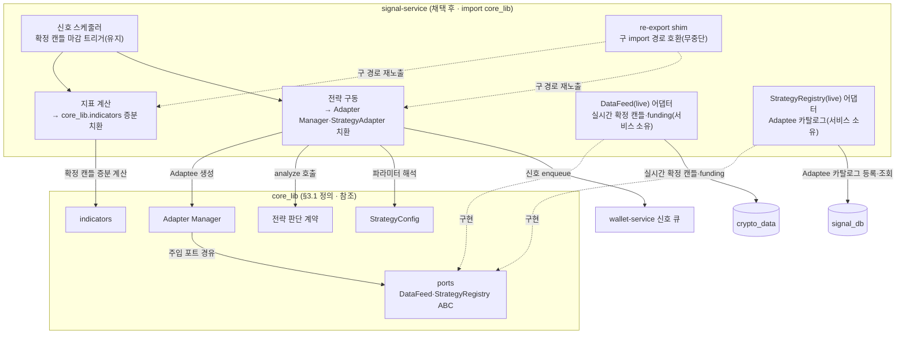

치환 지점과 동작 성질은 다음과 같다.

- **지표 계산 (동작 보존).** 현행 지표 공급은 외부 collector 사전계산과 `technical_indicators` 테이블 읽기를 거쳐
  `IndicatorLoader.load_latest`(`strategy_executor.py`)가 `indicator_mapper.build_market_data_from_db`로 컬럼을
  매핑하는 경로다. 이를 `core_lib.indicators` 증분 계산(확정 캔들 마감마다 O(1))으로 치환한다. 동등성 게이트는
  옛 테이블 값 대 `core_lib` 증분 값(허용오차 명시, 첫 대상 지표 하나)과 벡터화↔증분 일치다. 외부 collector는
  리포 내부 OHLCV 수집기로 이관돼 지표 역할을 폐지하고 적재만 맡는다.
- **전략 구동 (동작 보존).** 현행 `StrategyFactory.create_from_db`(`factory.py`)·`registry.py` 수동 등록·
  `AbstractStrategy` 상속 골격을 `Adapter Manager`(생성·lifecycle·레지스트리)·`StrategyAdapter`(analyze 호출)·
  `StrategyConfig`(파라미터 해석)로 치환한다. 현행 드라이버의 분당 폴링 게이트(`check_interval_minutes`)는
  제거하고 전략 TF 캔들 마감 판단으로 되돌린다. 생성된 신호는 wallet 큐로 enqueue한다(유지).
- **유지 컴포넌트.** 신호 스케줄러(확정 캔들 마감 트리거), 서비스 소유 live DataFeed 어댑터(실시간 확정 캔들·
  funding — 같은 `DataFeed` 계약의 라이브 구현), 서비스 소유 live StrategyRegistry 어댑터(Adaptee 카탈로그 등록·
  조회 — 같은 `StrategyRegistry` 계약의 라이브 구현). `Adapter Manager`는 core_lib 안에서 이 주입 포트로만
  카탈로그에 접근하므로 core_lib이 `signal_db`에 직접 의존하지 않는다.
- **shim·유보.** 구 import 경로에 re-export shim을 남겨 무중단. 트레일링은 소비 전략이 없어 유보(재도입 시 단일
  표준으로 통합).

### §3.3.2 wallet-service (채택 후)

wallet-service 채택 후 컴포넌트와 core_lib 소비.

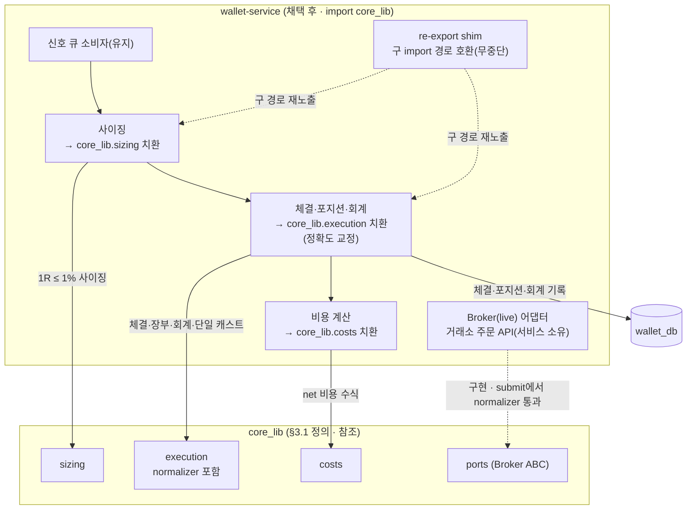

치환 지점과 동작 성질은 다음과 같다.

- **체결·포지션·회계·비용·사이징 (동작 변경 = 정확도 교정).** 현행 `futures_paper_trading_service.py`(선물 진입
  체결·펀딩·청산 시뮬)·`futures_calculator.py`·`slippage_calculator.py`·페이퍼 체결·사이징을
  `core_lib.execution`(matcher·position_book·accounting·normalizer)·`costs`·`sizing` import로 치환한다.
  `core_lib`는 표준 기준 신규 구현이므로 회계·손익·체결 표면의 계산값이 바뀐다(정확도 교정). 수용 기준은 거래소
  실측 대비 정확성(정의된 허용오차 내 골든)이며, 회귀(약 1279건 — 실행·비용·사이징·트레일링 커버 약 262건 중
  트레일링·15분 폴링 45건은 유보 스코프)를 재검증한다. 무결성 검사(회계 항등식 `cash + position = equity`·비용 1회 차감·
  net-of-cost)로 라이브 손익 불일치 재발을 구조적으로 막는다. `fill_timing` 기본값을 즉시(immediate)에서 다음 캔들
  시가(next_bar)로 전환해 `decision_ts < execution_ts`를 통일한다.
- **유지 컴포넌트.** 신호 큐 소비자, 서비스 소유 live Broker 어댑터(거래소 주문 API — 같은 `Broker` 계약의 라이브
  구현이며, `submit()`은 동일하게 `core_lib.execution.normalizer`를 통과), `wallet_db`(체결·포지션·회계 기록).
- **라이브 인프라·shim·유보.** 큐·폴링·HTTP·상태 복구·WebSocket 등 라이브 인프라는 백테스트로 이관하지 않고
  wallet에 남되, wall-clock 즉시 체결(`filled_at = now()`)은 `Clock` 포트·`fill_timing`으로 대체한다. 구 import
  경로에 re-export shim. 트레일링은 유보이며, 현행 wallet 3곳 중복은 재도입 시 단일 표준으로 통합한다.

---

# §4 클래스 다이어그램 + 정의서 (컴포넌트별)

이 절은 §3의 컴포넌트를 클래스 층위로 내린다. 컴포넌트마다 클래스 다이어그램을 하나씩 두고, 각 다이어그램이
그 컴포넌트의 클래스·속성·타입·메서드 시그니처·관계(상속·합성·의존)·스테레오타입을 담는다. 정의서는
다이어그램이 담지 못하는 것 — 속성별 제약·기본값·널 허용·검증, 메서드 의미(semantics), 클래스 책임, 클래스가
강제하는 불변식 — 만 문장으로 보탠다. 시퀀스·플로우는 별도 장이 아니라 그 행위를 소유한 클래스 정의서 안에 둔다.

이 판은 공유 라이브러리 `core-lib`의 클래스를 위에서 아래로 확정한다. §4.1은 기반 두 컴포넌트(값 타입·지표),
§4.2는 전략 계층(판단 계약·매니저·config, 그리고 config 해석 시퀀스), §4.3은 실행·비용·사이징·포트·평가 계층(그리고
판정 파이프라인 플로우)이다. 실행 드라이버 `backtest-service`의 Engine 클래스(§4.4)와 출력 클래스(§4.5)는 후속
판에서 이 기반 위에 매단다.

**float와 Decimal의 경계가 타입에 각인된다.** 판단·사이징 경로(캔들·지표·신호·수량 산정)의 값은 빠른 `float`로,
체결·금액 경로(주문·체결·포지션·거래·회계)의 값 타입은 오차 없는 `Decimal`로 선언한다. 두 경로를 잇는 단 하나의
변환 지점은 체결 진입점 `Broker.submit()` 안의 `execution.normalizer`이며(§4.3), 그 관문 앞의 값은 사이징 산출
수량까지 모두 `float`, 그 뒤의 타입은 모두 `Decimal`이다. 타입 선언 자체가 "Decimal 단일 변환 관문" 불변식을 눈에
보이게 만든다 — `float` 값을 금액 경로에 넣으려면 반드시 그 관문을 지나야 한다.

## §4.1 기반 클래스 — 타입·지표

이 두 컴포넌트는 의존 그래프의 바닥이다. `types`는 아무것도 참조하지 않고 세 실행 모드가 공유하는 값 타입과 금액
정밀도를 정의하며, `indicators`는 `types`의 `Candle`만 참조해 82종 지표를 계산한다. 두 컴포넌트가 강제하는
불변식은 캔들 검증(타입 계층), Decimal 단일 변환 관문의 타입 경계, look-ahead 배제(확정 캔들 전용 계약)다.

**구현 표준 참조(구현까지 유지).** 이 설계서는 82종 지표의 목록·분류·파라미터·워밍업 규약·활성 조건과 모든 성과
수식·통과선·리스크 규율을 아래 본문에 전부 적어 자기완결로 둔다. 다만 82종 각 지표의 **닫힌 형태 계산식**(예:
Ehlers 필터 계수, Wilder 평활 상수, T3 볼륨 팩터)만은 그 양이 방대하고 이견 고정이 계산 명세의 소관이므로,
지표별 최종 계산식은 **지표 계산 명세 표준**을 계산 권위로 삼아 구현 단계까지 그대로 참조한다. 이 한 표준을 제외한
모든 설계 결정(목록·필드·계약·플로우·수식·임계값)은 이 문서 안에 있다.

### §4.1.1 `types` 컴포넌트

값 타입의 단일 정의처다. 다이어그램은 여덟 값 타입, 금액 정밀도 유틸리티 `money`, 일곱 열거형과 그 관계를 담는다.
`Candle`·`TradingSignal`은 판단 경로라 `float`, `Order`·`Fill`·`Position`·`Trade`는 체결·금액 경로라 `Decimal`로
속성 타입이 갈린다(다이어그램의 타입 표기가 이 경계를 직접 보여 준다).

```mermaid
classDiagram
    direction LR
    class Candle {
        +str symbol
        +str exchange
        +str timeframe
        +datetime open_time
        +datetime close_time
        +float open
        +float high
        +float low
        +float close
        +float volume
        +Optional~float~ quote_volume
        +Optional~int~ trade_count
        +validate() None
    }
    class TradingSignal {
        +str symbol
        +datetime timestamp
        +float confidence
        +float price
        +Optional~float~ stop_loss
        +Optional~float~ take_profit
        +MarketType market_type
        +Optional~int~ leverage
        +str reason
        +dict metadata
    }
    class money {
        <<module>>
        +Decimal ZERO
        +Decimal ONE_HUNDRED
        +Decimal Q_PRICE
        +Decimal Q_AMOUNT
        +Decimal Q_PERCENT
        +Decimal Q_RATIO
        +Decimal Q_FEE_RATE
        +quantize_price(Decimal) Decimal
        +quantize_amount(Decimal) Decimal
        +quantize_percent(Decimal) Decimal
        +quantize_ratio(Decimal) Decimal
        +quantize_fee_rate(Decimal) Decimal
    }
    class Order {
        +str id
        +Optional~str~ wallet_id
        +Optional~str~ signal_id
        +OrderType order_type
        +OrderSide side
        +str symbol
        +Decimal quantity
        +Optional~Decimal~ price
        +Decimal filled_quantity
        +Optional~Decimal~ average_filled_price
        +OrderStatus status
        +Decimal fee
        +UUID client_order_id
        +MarketType market_type
        +PositionSide position_side
        +bool reduce_only
        +bool close_position
        +Optional~Decimal~ stop_price
        +str time_in_force
        +dict VALID_TRANSITIONS$
        +mark_as_filled(Decimal, Decimal) None
        +mark_as_partially_filled(Decimal, Decimal) None
        +mark_as_cancelled() None
        +remaining_quantity() Decimal
    }
    class Fill {
        +str order_id
        +str symbol
        +OrderSide side
        +PositionSide position_side
        +Decimal price
        +Decimal quantity
        +Decimal fee
        +Decimal slippage
        +str liquidity
        +datetime timestamp
        +bool reduce_only
        +Optional~ExitReason~ exit_reason
    }
    class Position {
        +Optional~str~ wallet_id
        +str symbol
        +Decimal quantity
        +Decimal average_price
        +Decimal total_cost
        +Decimal current_price
        +Decimal unrealized_pnl
        +PositionSide side
        +MarketType market_type
        +int leverage
        +MarginType margin_type
        +Decimal margin
        +Decimal entry_price
        +Decimal mark_price
        +Decimal liquidation_price
        +Decimal funding_fee_total
        +update_price(Decimal) None
        +add_quantity(Decimal, Decimal) None
        +reduce_quantity(Decimal) Decimal
    }
    class Trade {
        +str source_type
        +str symbol
        +OrderSide side
        +MarketType market_type
        +Decimal entry_price
        +Decimal entry_quantity
        +datetime entry_time
        +Decimal exit_price
        +Decimal exit_quantity
        +datetime exit_time
        +ExitReason exit_reason
        +Decimal gross_pnl
        +Decimal total_fee
        +Decimal slippage
        +Decimal funding_cost
        +Decimal net_pnl
        +Decimal return_pct
        +Decimal r0
        +int leverage
        +bool liquidated
        +Optional~str~ wallet_id
        +Optional~str~ backtest_run_id
        +str strategy_id
        +str strategy_name
        +int hold_duration_seconds
        +float signal_confidence
        +str reason
    }
    class OrderType {
        <<enumeration>>
        MARKET
        LIMIT
        STOP_MARKET
        TAKE_PROFIT_MARKET
        TRAILING_STOP_MARKET
    }
    class OrderSide {
        <<enumeration>>
        BUY
        SELL
    }
    class OrderStatus {
        <<enumeration>>
        NEW
        PARTIALLY_FILLED
        PENDING_CANCEL
        FILLED
        CANCELLED
        EXPIRED
        REJECTED
        FAILED
        +is_terminal() bool
        +is_active() bool
    }
    class PositionSide {
        <<enumeration>>
        LONG
        SHORT
        BOTH
    }
    class MarginType {
        <<enumeration>>
        CROSS
        ISOLATED
    }
    class MarketType {
        <<enumeration>>
        SPOT
        FUTURES
    }
    class ExitReason {
        <<enumeration>>
        STOP_LOSS
        TAKE_PROFIT
        TRAILING_STOP
        LIQUIDATION
        SIGNAL_EXIT
        REVERSAL
        END_OF_DATA
    }
    class SignalType {
        <<enumeration>>
        BUY
        SELL
        HOLD
    }
    Order ..> OrderType
    Order ..> OrderSide
    Order ..> OrderStatus
    Order ..> MarketType
    Order ..> PositionSide
    Order ..> money
    Fill ..> OrderSide
    Fill ..> PositionSide
    Fill ..> ExitReason
    Fill ..> money
    Position ..> PositionSide
    Position ..> MarginType
    Position ..> MarketType
    Position ..> money
    Trade ..> OrderSide
    Trade ..> MarketType
    Trade ..> ExitReason
    Trade ..> money
    TradingSignal ..> MarketType
```

**`Candle`** — 세 실행 모드가 공유하는 통합 캔들(현행 원천 없음, 신규). `crypto_data`의 확정 OHLCV 한 행과 1:1
대응한다. 판단 경로라 가격·거래량은 `float`다. `symbol`·`exchange`·`timeframe`은 문자열(예: `exchange="BINANCE"`,
`timeframe="1h"`), `quote_volume`·`trade_count`는 널 허용(선택 입력). `validate()`가 다음 **캔들 검증 불변식**을
타입 계층에서 강제한다: 한 시계열 안에서 `open_time`은 엄격히 증가(중복·역행 금지), `close_time = open_time +
timeframe`, `high ≥ max(open, close)`, `low ≤ min(open, close)`, 모든 가격 `> 0`, `volume ≥ 0`. 결측 캔들(gap)은
채우지 않고 표시만 한다(무기한 선물은 24시간 거래라 실제 gap은 데이터 결함 신호). 이 검증이 look-ahead 배제의
데이터 층 근거다 — 진행 중(미확정) 캔들은 애초에 이 타입으로 만들어지지 않는다.

**`money`** — 금액 정밀도 상수와 양자화 함수의 단일 정의처(모듈 수준 유틸리티). 양자화 스케일은 가격·수량 8자리
(`Q_PRICE`·`Q_AMOUNT`), 퍼센트 2자리(`Q_PERCENT`), 비율·수수료율 4자리(`Q_RATIO`·`Q_FEE_RATE`)이며, 모든
`quantize_*`는 은행가 반올림(`ROUND_HALF_EVEN`)을 쓴다. 이 함수들은 Decimal 단일 변환 관문(§4.3의
`execution.normalizer`)이 `Decimal(str(x))` 직후에 호출하는 유일한 양자화 지점이다.

**`TradingSignal`** — 전략 `analyze()`의 반환형이자 **판단 전용** 타입(판단 경로라 `float`). 필드는 판단의 근거와
전략이 제안하는 보호 수준뿐이며, **주문 방향(`OrderSide`)·수량 필드를 갖지 않는다.** `price`는 실행가가 아니라
판단 기준가(신호 캔들 종가)이고, `stop_loss`·`take_profit`은 전략이 제안하는 최초 보호 스탑·목표가(널 허용),
`confidence`는 0~1이다.

- **방향·행동 도출 규칙(발산 확정).** 현행 signal-service의 `TradingSignal`은 방향 필드 `signal_type`(BUY=롱/
  SELL=숏/HOLD)을 갖고 주문 구성에 직접 소비됐다. 신규 타입은 이 방향·수량 결합을 떼고, 신호를 소비하는 실행
  드라이버(§4.4의 Engine)가 신호의 **보호 수준 유무·기하**와 **`analyze`에 넘긴 `current_position` 문맥**만으로
  행동과 방향을 도출한다. 규칙은 다음과 같이 완결된다 — 세 갈래가 서로 겹치지 않는다.
    - **관망(HOLD).** `analyze()`가 `None`을 반환하면 아무 행동도 하지 않는다.
    - **청산(EXIT).** `stop_loss`와 `take_profit`이 **둘 다 null**인 신호는 청산 의도다 — 보호할 새 포지션이
      없기 때문이다. 보유 포지션을 전량 청산하고 `ExitReason.SIGNAL_EXIT`로 기록하며, 무포지션이면 무동작이다.
      이것이 전략이 방향 없이도 "관망이 아니라 지금 평평하게 나가라"를 표현하는 유일한 경로다(리버설과 구분된다).
    - **진입·리버설(ENTER/REVERSE).** `stop_loss` 또는 `take_profit` 중 **하나 이상이 non-null**인 신호는 진입
      의도다. 진입 신호는 최소 하나의 보호 수준을 가져야 하며(사이징이 손절거리를 요구한다), 둘 다 null이면 위
      청산 규칙으로 해석된다. 방향은 보호 수준의 기하로 도출한다 — `stop_loss`가 있으면 `price`보다 낮을 때 롱·
      높을 때 숏이고, `stop_loss`가 null이면 `take_profit`이 `price`보다 높을 때 롱·낮을 때 숏이다(고정 손절이
      없는 전략은 §4.3.3의 트레일링 R0를 최초 보호 스탑으로 채택하므로 결국 스탑 기하가 존재한다). 최종 행동은
      `current_position`으로 갈린다 — 무포지션이면 신규 진입, 반대 방향 보유면 리버설(청산 후 반대 진입, §4.3.1의
      리버설 순서), 같은 방향 보유면 추가 진입 후보로 노출 한도 검사를 거친다(기본은 재확인=무동작, 피라미딩
      활성 시에만 증량).
  이 도출은 신호가 아니라 실행 드라이버(§4.4)가 소유하므로 신호는 순수 판단으로 남는다. 방향 열거형
  `SignalType`(BUY/SELL/HOLD)은 이 타입의 필드가 아니라, 라이브 경로가 signal_db에 신호를 적재·enqueue할 때
  드라이버가 위 규칙으로 도출해 쓰는 지속 계층 전용 값으로만 남긴다(아래 다이어그램에 지속 계층 전용 열거형으로
  표시).
- **statelessness.** 이 타입은 순수 값이며 계산·IO를 갖지 않는다. Adaptee가 상태를 갖지 않는다는 불변식과 맞물려,
  같은 입력은 항상 같은 신호를 만든다.

**`Order`** — 주문과 그 상태 기계(체결 경로라 `Decimal`). `VALID_TRANSITIONS`는 허용된 상태 전이만 담은 클래스 상수
(정적)로, 활성 상태 `NEW`·`PARTIALLY_FILLED`·`PENDING_CANCEL`에서 종료 상태 `FILLED`·`CANCELLED`·`EXPIRED`·
`REJECTED`·`FAILED`로만 전이하고 종료 상태에서는 나가는 전이가 없다. `mark_as_filled`·`mark_as_partially_filled`·
`mark_as_cancelled`는 이 표를 위반하는 전이를 거부한다. `remaining_quantity() = quantity − filled_quantity`.
생성 시 검증: 문자열을 열거형으로 강제, `quantity > 0`, `reduce_only`와 `close_position`은 상호 배타(둘 다 참일 수
없음).

**`Fill`** — 체결 사실을 명시하는 신규 타입(현행 없음, `Decimal`). `Broker.submit(order)`의 반환형으로, 한 번의
체결에서 확정된 체결가·수량·수수료·슬리피지·유동성 구분(`liquidity ∈ {maker, taker}`)·시각을 담는다. 청산·손절
등으로 발생한 체결이면 `exit_reason`을 채운다(진입 체결이면 널). `reduce_only`는 이 체결이 포지션을 줄이는지
표시한다. `Order` 상태 전이만으로 체결을 표현하던 현행과 달리, 체결을 독립 타입으로 분리해 `position_book`·
`accounting`이 명시적으로 소비한다.

**`Position`** — 포지션과 회계 근거(`Decimal`). 생성·갱신 시 `total_cost ≈ quantity × average_price`를 허용오차
`0.01` 안에서 강제한다. `liquidation_price`는 **저장 필드**이며, 청산가 수식은 타입 계층이 아니라
`costs.Liquidation`(§4.3.2)이 단일 소유하고 `position_book`이 계산 결과를 이 필드에 세팅한다 — 타입은 청산가를
스스로 계산하지 않아 의존 방향이 한 방향으로 유지되고 수식 복제가 생기지 않는다. `update_price`(마크 가격 갱신·
미실현 재계산)·`add_quantity`(가중평균 진입)·`reduce_quantity`(reduce_only 실현·마진 반환)가 장부를 갱신하고,
`cash + position = equity` 항등식의 `position` 값을 제공한다.

**`Trade`** — 체결 완료된 거래 한 건(`Decimal`). 현행 `ClosedTrade`를 계승하되 **최초 위험 `r0`를 새 필드로
추가**한다(성형). `r0 = |entry_price − 최초 보호 스탑| × entry_quantity`이며(§4.3 사이징의 1R과 같은 정의),
R-multiple 기반 상위 분석(SQN·기대값·파산확률)의 분모가 된다. 최초 스탑을 정의할 수 없는 거래는 `r0`를 널로 두고
R 기반 지표에서 제외한다(§4.3). `net_pnl`은 `gross_pnl`에서 `total_fee`·`slippage`·`funding_cost`와 청산 페널티를
차감한 net이며, `source_type ∈ {live, paper, backtest}`, `backtest_run_id`가 그 거래의 run을 가리킨다.
`signal_confidence`는 금액이 아니라 판단 메타데이터(포렌식용)라 이 Decimal 타입 안에서 유일하게 `float`로 남긴다
— 금액 경로가 아니므로 Decimal 관문과 무관하다.

**열거형.** `OrderType`(시장가·지정가·스탑·익절·트레일링스탑), `OrderSide`(BUY/SELL), `OrderStatus`(활성 3종·종료
5종 + `is_terminal()`·`is_active()` 판별), `PositionSide`(LONG/SHORT/BOTH), `MarginType`(CROSS/ISOLATED),
`MarketType`(SPOT/FUTURES)는 현행 값을 계승한다. `ExitReason`은 신규로, 청산 사유를 `STOP_LOSS`·`TAKE_PROFIT`·
`TRAILING_STOP`(트레일링 재도입 대비)·`LIQUIDATION`·`SIGNAL_EXIT`(전략 청산 신호 — 위 도출 규칙의 EXIT 갈래)·
`REVERSAL`(반대 진입)·`END_OF_DATA`(구간 종료 강제 청산)로 구분한다. `SignalType`(BUY/SELL/HOLD)은 지속 계층
전용 열거형이다 — `TradingSignal`의 필드가 아니라 위 방향·행동 도출 규칙으로 라이브 드라이버가 signal_db 적재·
enqueue 시에만 쓴다(백테스트 판단 경로는 이 열거형을 쓰지 않는다).

### §4.1.2 `indicators` 컴포넌트

82종 지표의 유일 구현처다. 다이어그램은 지표 명세 `IndicatorSpec`, 등록·조회 `IndicatorRegistry`, 증분 상태
`IndicatorState`, look-ahead 계약 `contracts`, 공용 프리미티브 `primitives`와 그 관계를 담는다. 한 지표는 벡터화
경로(`compute_vectorized`)와 증분 경로(`IndicatorState.update`) 두 가지를 가지며, 둘의 값은 일치해야 한다.

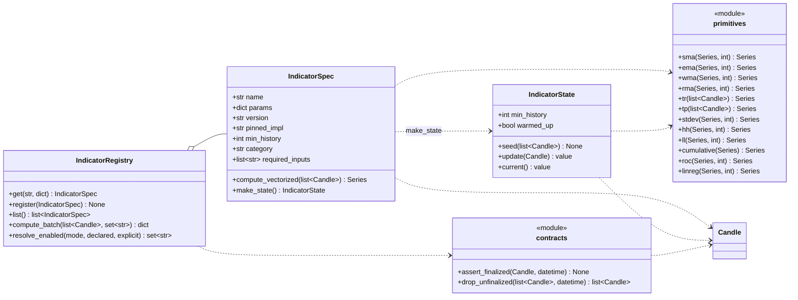

**`IndicatorSpec`** — 지표 하나의 명세. `name`·`params`(예: `{"period": 14}`)로 식별되고, `version`과
`pinned_impl`은 이견 있는 계산의 채택 구현을 고정하며(재현·정합의 근거), `min_history`는 그 지표가 유효값을 내기
전에 필요한 최소 캔들 수, `category`는 아래 분류(추세·모멘텀 등), `required_inputs`는 OHLCV 외에 필요한 입력
채널(시장폭 지표만 해당)이다. `compute_vectorized`는 전 구간을 한 번에 계산하고, `make_state`는 그 지표의 증분
상태 객체를 만든다.

**`IndicatorRegistry`** — 지표 등록·조회와 배치 계산. `get(name, params)`가 명세를 돌려주고, `compute_batch`가 한
run에서 실제로 계산할 지표 집합만 벡터화로 계산한다. 계산 대상은 `resolve_enabled(mode, ...)`가 run 설정으로
정한다 — `auto`(활성 전략이 선언한 필요 지표만, 기본)·`explicit`(명시 리스트: 전략 필요분 + 손실원인 탐색용 추가
지표)·`all`(82종 전량, 전면 스캔용). 요청 지표·파라미터가 등록돼 있고 워밍업(`min_history`)이 확보됐는지, 시장폭
지표는 별도 입력 채널이 있는지 검증한 뒤 계산한다.

**`IndicatorState`** — 라이브와 같은 증분 계산 경로(캔들 하나당 O(1) 갱신). `seed(candles)`가 워밍업 이력으로 상태를
채우고, `update(candle)`가 확정 캔들 하나로 한 칸 전진하며, `warmed_up`은 `min_history` 충족 여부다. 이 경로가
라이브가 실제로 도는 방식이라 벡터화 경로와 값이 같은지 판정하는 기준점이다.

**`contracts`** — look-ahead 배제 계약(모듈 수준). `assert_finalized(candle, T)`는 `candle.close_time ≤ T`를
런타임 검증해 미래·미확정 캔들이 지표 계산에 들어오는 것을 막고, `drop_unfinalized`는 주간 ATR 같은 리샘플에서
미확정 마지막 버킷을 떨군다.

**`primitives`** — 공용 계산 단위(모듈 수준). 이동평균 4종(단순·지수·선형가중·Wilder 평활), True Range, 대표
가격(typical price), 표준편차, 구간 최고·최저, 누적, 변화율, 선형회귀다. 82종 지표는 이 프리미티브 위에서
조립되며, 중복 계산을 한 곳에 모은다.

**82종 지표 목록(확정).** 표준 골격은 이식 원천 목록만 두었고 "미리 고정하지 않는다"고 했던 지표 집합을 이 판이
82종으로 확정한다. 세는 규칙은 "시스템·지표 단위"이며(합계 82), 아래가 그 전량이다. 각 지표의 닫힌 형태 계산식은
지표 계산 명세 표준이 계산 권위로 고정한다(구현까지 유지 참조).

| 계열 | 지표 (개수) |
|---|---|
| 추세·이동평균 (10) | DEMA, TEMA, T3, HMA, ZLEMA, ALMA, KAMA, VIDYA, McGinley Dynamic, Guppy GMMA |
| 모멘텀·오실레이터 (27) | RSI, Stochastic(%K/%D), Stochastic RSI, MACD(+Histogram), PPO, TRIX, TSI, SMI, CMO, Williams %R, CCI, Ultimate Oscillator, Awesome Oscillator, Accelerator Oscillator, Fisher Transform, Connors RSI, QStick, Chande Forecast Oscillator, DeMarker, DPO, Schaff Trend Cycle, Relative Vigor Index(Ehlers), Laguerre RSI, Pretty Good Oscillator, KST, Coppock Curve, Special K |
| 변동성 (12) | ATR, Bollinger Bands, %B, BandWidth, Keltner Channel, Donchian Channel, SuperTrend, Chandelier Exit, Ulcer Index, Relative Volatility Index(Dorsey), Chaikin Volatility, Mass Index |
| 거래량 (10) | OBV, A/D Line, Chaikin Oscillator, CMF, MFI, Force Index, EMV, Klinger Volume Oscillator, NVI, PVI |
| 추세강도·방향성 (6) | DMI/ADX 시스템, Vortex, Aroon, Choppiness Index, QQE, Random Walk Index |
| Bill Williams (4) | Alligator, Fractals, Gator Oscillator, Market Facilitation Index |
| 시장폭 (3) | McClellan Oscillator, McClellan Summation Index, TRIN/Arms |
| 사이클·Ehlers (4) | MAMA/FAMA, Center of Gravity Oscillator, Roofing Filter, Sinewave/Instantaneous Trendline |
| 기타 시스템 (6) | Parabolic SAR, Ichimoku Kinko Hyo, Elder Ray, Elder Impulse System, TD Sequential, Woodies CCI |

목록에 대한 확정 규칙은 다음과 같다.

- **세는 규칙.** 위 표는 시스템·지표 단위로 82종(10+27+12+10+6+4+3+4+6)이다. DMI/ADX를 구성요소(+DI·−DI·ADX·
  ADXR) 넷으로 펼치거나 MACD와 히스토그램을 나누면 수가 늘고, Bollinger를 밴드 하나로 묶고 %B·BandWidth를
  파생으로 빼면 준다 — 등록 단위는 위 표대로 고정한다.
- **의도적 제외.** Wilder의 Swing Index·ASI·CSI·Volatility Stop은 무기한 시장 적용성이 낮아 넣지 않는다(Swing
  Index·ASI의 "limit move" 파라미터가 무기한 시장에 정의되지 않고, Volatility Stop은 Chandelier Exit로 사실상
  대체된다). 필요 시 별도 추가한다.
- **시장폭 3종은 조건부 활성.** McClellan Oscillator·Summation·TRIN은 등락종목수·거래량 같은 별도 입력 채널이
  있어야 계산되며, 단일 심볼 OHLCV만으로는 입력이 없어 비활성 처리한다(`required_inputs`에 그 채널을 선언하고,
  없으면 `compute_batch`가 건너뛴다).
- **첫 검증 전략 커버리지.** 첫 파이프라인 검증 전략이 요구하는 최소 집합은 EMA 9/21/55/200, RSI 14, Bollinger
  Bands(기간 20·표준편차 2.0), Stochastic(%K 14·%D 3), ATR 14, 거래량 이동평균 20이다. 82종 구현이 이를 빠짐없이
  덮는다.

**워밍업·seed 규약.** 재귀형 지표(EMA·Wilder 평활·Parabolic SAR·누적합 등 상태를 보유하는 것)는 워밍업 이력으로
seed한 뒤 확정 캔들로만 갱신한다. 벡터화 경로와 증분 경로의 seed 규칙(초기값 산정·`adjust` 여부·표준편차 분모·
0 나눗셈 처리)은 지표 계산 명세 표준이 통일하며, 두 경로가 초반 캔들에서도 어긋나지 않게 같은 규칙을 쓴다. 각
지표의 `min_history`만큼 캔들이 쌓이기 전 값은 유효하지 않다. 실행 드라이버는 평가 구간 시작 전에 `max(전략
min_history, 지표 최장 워밍업)` 캔들을 별도 프리로드하고 그 구간의 신호는 버린다(§4.4에서 확정).

**지표 계산 플로우(정의서 내부).** 한 run에서 지표 값을 만드는 길은 두 가지이고, 어느 쪽이든 같은 82종 구현·같은
프리미티브를 거쳐 값이 서로 같아야 한다(일치 테스트로 못박는다). 아래가 두 경로와 그 공통 look-ahead 관문이다.

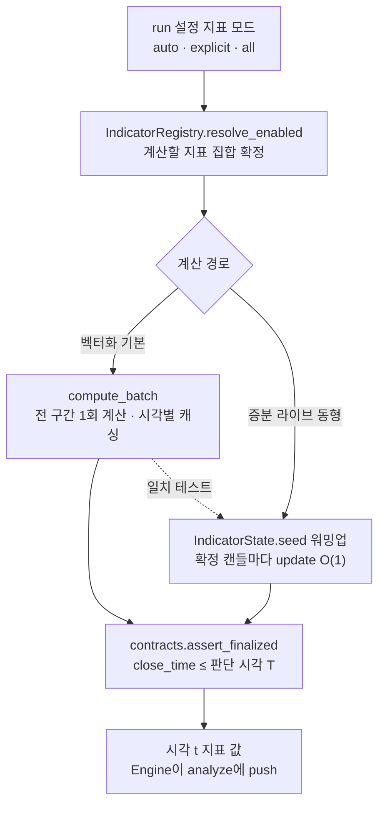

읽는 법: 계산 집합은 run 설정이 정하고(전량이 아니라 필요분), 두 경로 중 벡터화가 기본이며 증분이 라이브와 동형인
검증 기준점이다. 두 경로 모두 `contracts`의 확정 캔들 계약(`close_time ≤ T`)을 통과해야 하며, 이 관문이 미래
데이터 참조를 구조적으로 막는다. 계산은 전부 `float`이고 Decimal 변환은 이 컴포넌트 밖 체결 관문에서만 일어난다.

## §4.2 전략 클래스 — 판단 계약·매니저·config

전략 계층은 "전략을 끼우는 자리"를 정의한다. 플랫폼은 판단 계약(`StrategyAdapter`)·생성(`Adapter Manager`)·
파라미터 해석(`StrategyConfig`)만 소유하고, 각 전략(Adaptee)의 진입·청산 판단 자체는 전략 작성자 소유(범위 밖)다.
이 계층의 핵심 경계는 **파라미터 스키마를 Adaptee가 선언하고, StrategyConfig가 해석·검증하며, Adapter Manager가
생성한다** — 이 세 책임이 겹치지 않게 갈린다. 다이어그램은 그 계약·관계를, 정의서 안의 시퀀스는 생성·해석 순서를
담는다.

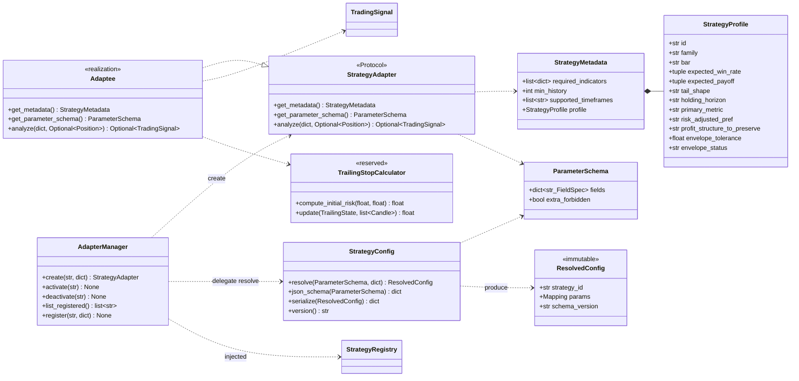

> `StrategyRegistry`는 §4.3 `ports`가 정의하는 Adaptee 카탈로그 주입 포트(ABC)다. `Adapter Manager`가 이
> 포트로만 목록에 접근하므로 `core_lib`은 특정 DB에 직접 의존하지 않는다.

**`StrategyAdapter`** — 전략 판단 계약. 상속시킬 공유 구현이 없으므로 추상 클래스가 아니라 `typing.Protocol`이다
(구조적 준수만 요구). 세 메서드의 의미는 다음과 같다. `get_metadata()`는 필요 지표(`{name, params}` 목록)·최소
이력·지원 타임프레임·프로파일을 선언하고, `get_parameter_schema()`는 이 전략의 파라미터 스키마(각 필드의 타입·
기본값·범위, 잉여 키 금지)를 **선언만** 한다(해석하지 않는다). `analyze(market_data, current_position)`는 Engine이
push한 사전 계산 지표의 평평한 dict와 현재 포지션을 받아 판단을 반환한다 — 진입·청산 판단이면 `TradingSignal`,
관망이면 `None`. 반환은 판단뿐이며 수량·주문 방향을 정하지 않는다.

- **불변식(계약이 강제).** Adaptee는 **stateless**(호출 간 상태를 보유하지 않음) — 같은 입력은 항상 같은 신호를
  낸다. 데이터 읽기·결과 저장·캔들 루프를 갖지 않는다(각각 Engine·포트 소관). **미래 데이터를 스스로 당겨오지
  않는다** — 입력 dict는 Engine이 확정 캔들 경계까지만 채워 주므로 look-ahead는 피드 경계가 통제한다. 입력 dict의
  형태와 호출 계약은 라이브·백테스트가 동일하다(같은 코드가 두 환경에서 같은 값을 본다).

**`Adaptee`** — `StrategyAdapter` Protocol을 구현하는 실제 전략. 진입·청산 엣지와 파라미터 값은 전략 작성자
소유라 이 설계의 범위 밖이며, 플랫폼은 계약 형태만 정한다. 첫 검증 Adaptee는 트레일링을 제외한 개념의 신규
구현으로 ATR 기반 고정 손절·익절을 쓴다. 트레일링을 쓰는 전략은 상속이 아니라 `TrailingStopCalculator`의 순수
함수를 **호출**한다(첫 검증 스코프에서는 유보).

**`StrategyConfig`** — 전략 파라미터 config의 해석·검증·직렬화·스키마 노출의 단일 소유. `resolve(schema,
raw_config)`가 원자재 config(전략 id + 파라미터 값)를 **Adaptee가 선언한 스키마에 대조**해 기본값 병합·잉여 키
금지(`extra=forbid`)·타입/범위·교차필드 검증을 거쳐 **불변** `ResolvedConfig`로 해석한다. `json_schema(schema)`는
설정 UI·툴링용 JSON Schema를 노출하고, `serialize`·`version`은 Evidence·카탈로그 기록용 정규화 직렬화와 스키마
버전을 낸다.

- **무순환 설계(스키마를 값으로 받음).** `resolve`·`json_schema`는 Adaptee 인스턴스가 아니라 **스키마 값**을
  인자로 받는다. Adaptee가 선언한 스키마를 Adapter Manager가 먼저 꺼내 넘겨 주므로, `StrategyConfig`는 스키마
  타입에만 의존하고 전략 구현을 되짚지 않는다 — 생성(Manager)→해석(Config)→선언(Adaptee) 사이에 순환이 생기지
  않는다.
- **경계 불변식.** 스키마 **선언은 Adaptee 소유**이며 `StrategyConfig`가 재정의하지 않는다. 값은 호출자 소유(소스
  미보유). 파라미터 스윕·실행 설정은 범위 밖(그건 실행 드라이버의 run 설정 소관). 같은 전략 config가 backtest·
  live·UI에서 **동일하게 검증**되도록 이 한 곳이 해석을 소유한다.

**`ResolvedConfig`** — 해석·검증을 마친 불변 config. 생성 후 변경 불가(frozen)이며, 이 객체로 Adaptee를
인스턴스화한다. `schema_version`을 담아 Evidence 재현 시 어떤 스키마로 해석했는지 확정한다.

**`Adapter Manager`** — Adaptee의 생성(Factory)·lifecycle과 구현 목록 레지스트리. `create(strategy_id,
raw_config)`가 생성을 오케스트레이션하고(아래 시퀀스), `activate`·`deactivate`가 lifecycle을, `list_registered`·
`register`가 signal_db 레지스트리를 다룬다. **레지스트리 DB 접근은 주입된 `StrategyRegistryPort`로만** 하므로
core-lib은 특정 DB에 직접 의존하지 않는다. 매니저는 전략 결정 로직도 파라미터 검증 로직도 직접 갖지 않는다
(각각 Adaptee·`StrategyConfig` 소관). backtest Engine과 signal-service 엔진이 동일하게 이 매니저로 Adaptee를
요청한다.

**Adaptee 생성·config 해석 시퀀스(정의서 내부).** 이 세 책임(선언·해석·생성)이 어떻게 순서대로 맞물리는지를
`create` 한 호출로 보인다. 순환 없이 스키마가 값으로 흐르는 것이 핵심이다.

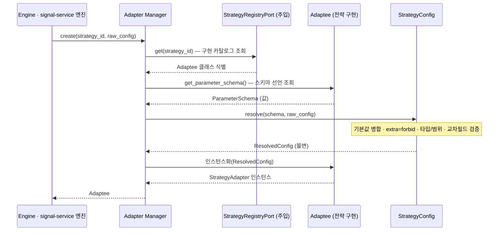

읽는 법: 스키마는 Adaptee가 선언하고(3~4행), Config는 그 스키마 값을 받아 해석하며(5~7행), Manager가 생성을
소유한다(2·8행). Config가 Adaptee를 되짚지 않으므로 의존은 한 방향(Manager→Config, Manager→Adaptee,
Config→스키마 타입)으로만 흐른다. 레지스트리 조회는 주입 포트를 거쳐 core-lib이 DB에 묶이지 않는다.

**`StrategyProfile`** — 각 전략이 선언하는 자기 "형태(shape)". 스키마·소비 규칙은 패키지가 소유하고 값은 각
전략이 소유한다(형태 지표를 보편 통과선으로 못박지 않기 위한 인터페이스). 필드는 전략군(`family ∈
{trend_following, mean_reversion, breakout, carry, market_making, …}`), 기대 승률 범위·기대 손익비 범위(각
`[min, max]`), 꼬리 형태(`tail_shape ∈ {right_fat, symmetric, left_fat}`), 보유 지평, 주 지표(`primary_metric`),
선호 위험조정 지표(`risk_adjusted_pref ∈ {sortino, sharpe, calmar}`), 보존할 수익 구조
(`profit_structure_to_preserve`), 기대 범위 허용오차(`envelope_tolerance`), 성숙도(`envelope_status ∈
{provisional, updating, established}`)다. 이 프로파일의 소비(기대 범위 대조·회귀 판정)는 평가 계층(§4.3의
`eval.profile`)이 하며, 여기서는 스키마만 정의한다. 성숙도가 순환 논리를 막는다 — 아직 확립되지 않은
(`provisional`) 기대 범위로 신규 전략을 탈락시키지 않고, 확립된(`established`) 전략이 그 형태를 잃은 회귀만
reject한다.

**`TrailingStopCalculator`(유보)** — ATR 트레일링의 표준 위치(순수 함수). 첫 검증 스코프의 어떤 전략도 쓰지 않아
유보하며, 재도입 시 이 단일 표준으로 통합하고 파리티 기준을 확정한다. 표준 위치는 트리에 남지만 이 판의 계약을
바꾸지 않는다. 고정 손절이 없는 전략이 도입되면 `compute_initial_risk`가 최초 위험(`r0`)을 제공한다.

## §4.3 실행·평가 클래스 — 실행·비용·사이징·포트·평가

이 계층은 판단을 결과로 바꾼다. 결정적 체결(`execution`)·net 비용(`costs`)·생존 사이징(`sizing`)·환경 포트
(`ports`)·판정 3단계(`eval`)로 이뤄지며, 수치를 내는 모든 경로는 순수 함수라 같은 입력에 같은 값을 낸다. 이 계층이
강제하는 불변식은 다섯이다 — 체결은 결정보다 나중(`decision_ts < execution_ts`), float→Decimal 단일 변환 관문,
모든 손익 net, 거래당 위험 1R ≤ 계좌 1%, 캔들 내 동시 도달 시 보수적 최악 경로다. 컴포넌트마다 클래스
다이어그램을 하나씩 두고, 판정 파이프라인 플로우는 `eval` 정의서 안에 둔다.

### §4.3.1 `execution` 컴포넌트

주문 라이프사이클·결정적 체결·포지션 장부·회계와 Decimal 단일 변환 관문. 백테스트 시뮬과 페이퍼가 같은 결정
로직을 호출한다.

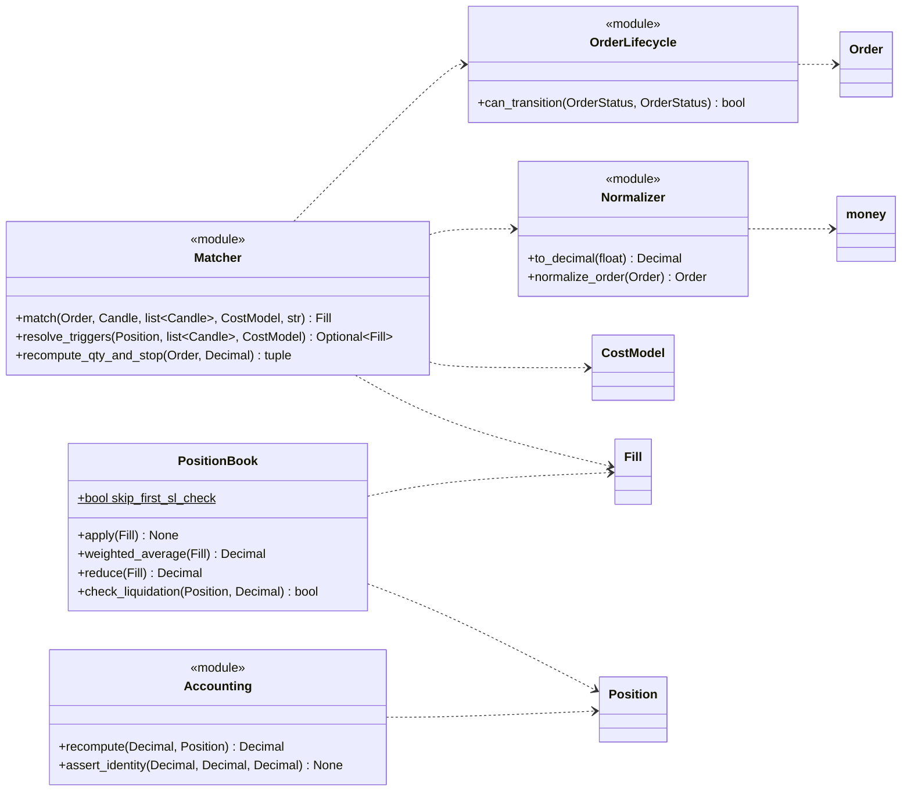

**`Normalizer` — Decimal 단일 변환 관문.** `to_decimal(x)`는 `Decimal(str(x))` + `money`의 `quantize_*`를 **한 번**
수행한다(`Decimal(float)` 직접 변환 금지 — `float`이 품은 이진 오차가 스탑 가격 끝자리를 뒤집어 캔들 내 트리거
여부와 결정성 해시를 흔든다). `float`을 곧바로 `Decimal(x)`에 넣지 않고 문자열을 거쳐 의도한 값을 만든다. 모든
Broker 어댑터의 `submit()`이 이 함수를 통과해야 하며(어댑터별 독자 캐스팅 금지), 우회는 적합성 테스트로 막는다.
이 지점이 시스템 전체에서 `float`→`Decimal`이 일어나는 **유일한** 곳이다.

**`Matcher` — 결정적 체결 규칙(유일 구현).** `fill_timing ∈ {immediate, next_bar}`을 주입형으로 두고 백테스트
기본은 `next_bar`다. 규칙은 다음과 같다.

- **다음 캔들 시가 체결.** 신호는 캔들 `t` 마감에 생성되고 체결은 `t+1` 시가에 슬리피지를 얹어 일어난다(매수 +,
  매도 −). 이것이 `decision_ts < execution_ts`를 만족한다 — 결정 캔들 종가로 체결하지 않는다.
- **수량·초기 스탑 재산정.** 수량과 최초 보호 스탑은 신호 캔들 종가가 아니라 **실제 체결가 기준으로 재산정**한다
  (`recompute_qty_and_stop`). 갭으로 마진이 부족하면 주문 거부가 아니라 **수량 절삭** 후 Evidence에 기록한다.
- **캔들 내 트리거(`resolve_triggers`).** 손절·트레일링·익절·청산 채널·강제청산의 캔들 내 발동을 판정한다. 첫
  검증 스코프에서는 전략 TF 캔들 수준의 보수 판정이고(1분 하위 집행 피드는 유보), 1분 트리거 walk와 그 파리티
  허용 편차는 Engine 설계(§4.4)에서 확정한다. 어떤 포지션도 자기 체결 캔들 이전으로 소급 검사하지 않는다
  (`skip_first_sl_check` 계승).
- **동시 도달 우선순위(보수적 최악 경로, OHLC-locked).** 같은 캔들에서 손절과 익절이 모두 범위 안이면 **손절
  우선**(익절 우선으로 구현하면 승률·PF가 계통적으로 부풀려진다). 손절과 강제청산이 겹치면, 정상 설정에서는
  손절가가 청산가보다 안쪽이라 **손절 우선**(청산 미발생)이고, 손절가가 청산가 바깥인 설정 오류만 청산 처리하며
  설정 오류로 마킹한다. 즉 기본은 손절이고 청산은 갭·오류 예외다.
- **리버설 순서.** 같은 캔들 종가에서 청산 신호와 반대 진입 신호가 나오면 `t+1` 시가에서 "기존 포지션 청산 체결 →
  마진·손익 정산 → 신규 진입 마진 검사·체결" 순서로 처리한다(마진 가용성은 청산 정산 후 기준).
- **갭 처리.** `t+1` 시가가 손절·청산 너머면 시가에 체결하고 슬리피지를 가중한다.

**`OrderLifecycle`** — `can_transition`이 허용 전이만 통과시키고 위반을 거부한다. 전이표는 새로 만들지 않고
`types.Order`의 `VALID_TRANSITIONS`(단일 소유)를 읽어 쓴다 — `execution`은 `types`를 참조하므로 표를 복제하지
않는다(복제 드리프트 방지). **`PositionBook`** — 체결을 반영해 가중평균 진입가를 갱신하고
(`weighted_average`), `reduce_only` 실현·마진 반환(`reduce`), Isolated 우선 청산 판정(`check_liquidation`)을 한다.
**`Accounting`** — `recompute`가 `cash + position = equity` 항등식을 유지하고 `assert_identity`가 이를 검산하며,
각 비용은 한 번만 차감한다.

### §4.3.2 `costs` 컴포넌트

net 손익을 이루는 네 비용의 수식 표준. 값은 `CostModel`이 주입하고 수식만 여기 있다. net 손익 항등식은 `x_net =
x_gross − fee_entry − fee_exit − slippage − funding − liquidation_penalty`이며 각 비용은 한 번만 차감한다.

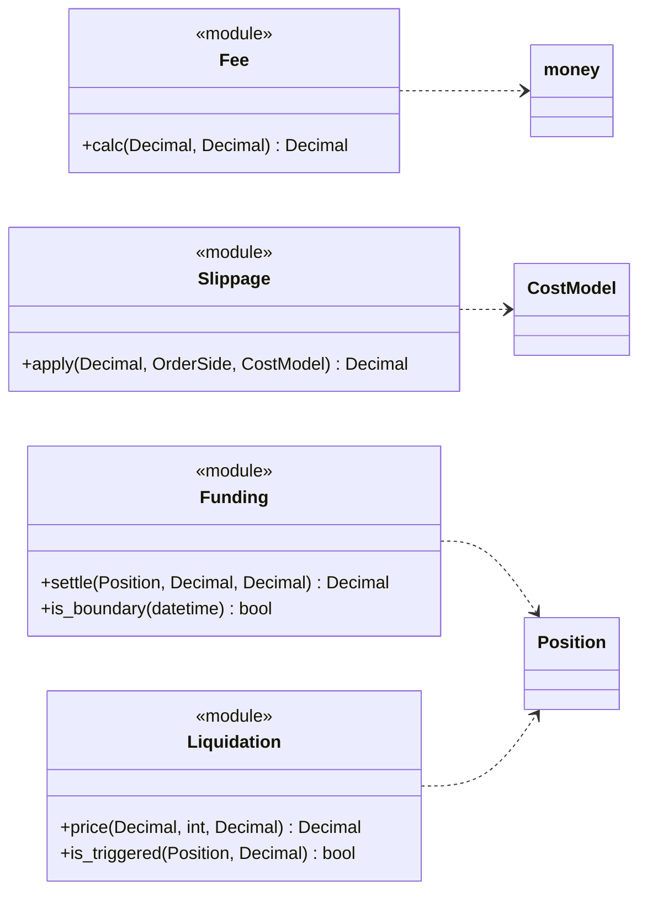

각 수식과 규칙(값은 주입 기본값이며 run 설정으로 덮어쓴다).

- **수수료.** `fee = notional × rate`. maker/taker를 구분하고 기본은 taker(회전율 방어). 주입 기본값은 선물 maker
  `0.0002`(0.02%)·taker `0.0005`(0.05%), 현물 `0.0005`(0.05%)다.
- **슬리피지.** 표준 목표는 `spread/2 + k·(주문량 / 호가유동성)` 스트레스 모델(왕복 0.1~0.3%)이며, 현행 곱셈 고정
  bps는 호환 기본값으로만 둔다(선물 진입 `0.0005`·현물 진입 `0.001`·청산 `0.0001`). 매수는 불리하게 더하고
  매도는 뺀다.
- **펀딩(이산 정산 표준).** UTC `0/8/16`시 경계를 **보유 상태로 지나는** 포지션에 `notional × rate` 전액을
  부과한다(경계를 지나지 않으면 실제 펀딩은 0). pro-rata(`×보유시간/8h`)식은 사전 추정용 참고로만 강등한다.
  정산가는 **정산 경계를 포함하는 최소 가용 TF 캔들의 시가**(없으면 직전 확정 캔들 종가)로 고정하고, 동시각 신규
  체결은 그 정산을 물지 않는다(경계 직전 보유분만). **과거 실측 rate는 `DataFeed`로 주입**하며, 실측이 없을 때만
  `CostModel` fallback rate `0.0001`(0.01%)을 쓴다.
- **청산.** `liq_price = Entry × (1 − 1/leverage + mmr)`(Isolated 우선). 유지증거금률 기본 `0.004`(0.4%, 최저
  티어). 트리거는 last-price 캔들 극값 판정으로, Binance 강제청산이 mark price(더 평활) 기준인 것에 비해 청산이
  과대 발생하는 보수 방향 근사다.

### §4.3.3 `sizing` 컴포넌트

거래당 위험을 계좌의 정해진 비율로 묶는 생존 사이징. 엣지는 진입 신호에서 오며, 손절·익절 배치로 기대값을
창조하지 않는다. **사이징은 판단 경로라 전부 `float`로 계산한다** — Equity 스냅샷·손절거리(예: `k×ATR`)·산출
수량이 모두 `float`이다. 이 `float` 수량은 주문 요청으로 `Broker.submit()`에 전달되고, 거기서 `execution`의
`normalizer`가 `float→Decimal` 단일 변환을 수행한 뒤의 `Order`·`Fill`이 `Decimal`이다. 사이징 자체는
`normalizer`를 호출하지 않는다(변환은 오직 체결 관문). 사이징의 Equity 스냅샷(신호 캔들 종가 마크, `float`)과
회계 계층의 Decimal Equity(체결 후 장부 항등식)는 같은 개념을 두 정밀도로 본 것이다.


각 수식과 규율.

- **보편 사이징(`RiskMoney`).** `수량 = (risk_per_trade × Equity) / 손절거리`이며, 여기서 `1R = 손절거리 × 수량`이
  성립하고 **`1R ≤ 0.01 × Equity`(거래당 위험 ≤ 계좌 1%)** 를 구속 상한으로 둔다. 손절거리는 변동성 척도(예:
  `k×ATR`)로 잡는 것이 기본이라 변동성이 큰 시장일수록 수량이 작아져 위험기여도가 균등화된다. 레버리지는 입력이
  아니라 결과값(`명목가치 = 수량 × 가격`에서 역산, 거래소 한도 안인지 확인). **Equity = cash + 사용 마진 + 미실현
  손익**(신호 캔들 종가 마크)이며 회계 항등식의 equity와 같은 개념이다. 파산확률이 0.1%를 넘으면 `risk_per_trade`를
  더 낮춘다.
- **1R 정의.** `1R = |체결가 − 최초 보호 스탑| × 수량`. 고정 손절이 없는 전략은 트레일링 계산기의 초기 위험
  `R0 = clamp(1.5×ATR/entry, 0.45%~0.65%) × entry`를 최초 보호 스탑으로 채택하고 `Trade.r0`에 기록한다. 최초
  스탑을 정의할 수 없는 거래는 R 기반 지표(SQN·기대값·파산확률)에서 제외하고 제외 건수를 Evidence에 기록한다.
- **터틀 인스턴스(`TurtleUnit`).** 변동성 단위 `N`으로 한 유닛 크기를 잡고(`RiskMoney`의 한 인스턴스), 0.5N마다
  피라미딩하며 단일 시장 유닛 상한(원조 4유닛)을 둔다 — 전략이 선택 조합한다.
- **pct 경로(`WalletPct`, 호환).** `position_size_pct`(기본 20%)를 available_balance(마진 잠김·미실현 제외) 기준으로
  적용한다. 이 경로는 `1R ≤ 1%` 상한을 보장하지 못하므로 run 메타에 **"framework 비준수(호환 모드)" 플래그를
  의무 기록**한다(원칙과의 관계를 숨기지 않음).
- **Kelly 상한(`Kelly`).** `f* = p − (1−p)/B`(B=손익비). Full Kelly는 금지하고 **Half/Quarter를 상한**으로
  한다(`cap(f*, λ)`, `λ ≤ 0.5`) — 추정오차·fat-tail·regime change로 Full Kelly의 실전 낙폭이 파괴적이다.
- **노출·상관·방향 한도(`ExposureLimit`, 계좌 % 기준).** 단일 시장·상관군·단일 방향의 합산 위험 상한을 둔다(원조
  터틀 단일 4유닛·상관군 6유닛·방향 12유닛이 한 인스턴스). 단일 심볼 구현에서는 단일 시장 한도만 유효하고 나머지
  둘은 다중 심볼 확장 시 활성화되지만, 프레임은 세 한도 개념을 항상 소유한다. 상관→1(동반 청산) 스트레스는 파산
  확률·최대낙폭 몬테카를로에 반드시 포함한다.

### §4.3.4 `ports` 컴포넌트

환경별 관심사의 어댑터 경계. 일곱 개 추상 계약(ABC)만 선언하고 구현은 서비스가 주입한다. `ports`는 `types`만
참조하고 `execution`을 참조하지 않는다 — Decimal 단일 변환은 `Broker` 구현 어댑터가 `submit()`에서
`execution.normalizer`를 통과해 달성하며, 추상 계약 자체는 그 결합을 갖지 않는다.

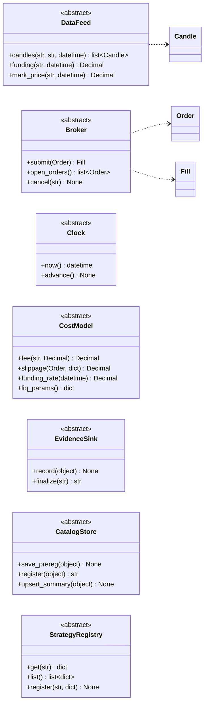

일곱 포트의 계약과 불변식.

- **`DataFeed`** — `candles(symbol, tf, up_to)`는 **`up_to` 이후 캔들을 절대 반환하지 않는다**(look-ahead 구조적
  배제). `funding`은 과거 실측 펀딩 rate를, `mark_price`는 마크 가격을 그 시점 기준으로 공급한다.
- **`Broker`** — `submit(order) → Fill`이 체결을 수행한다. 구현 어댑터의 `submit()`은 반드시
  `execution.normalizer`를 통과해 `float→Decimal` 단일 변환을 달성한다(어댑터별 독자 캐스팅 금지). `open_orders`·
  `cancel`은 미체결 주문을 다룬다.
- **`Clock`** — `now`·`advance`가 시뮬 시각을 공급하며 **wall-clock을 쓰지 않는다**(결정성). 난수도 무제어로
  쓰지 않는다.
- **`CostModel`** — 비용 값을 주입한다. `fee`·`slippage`·`funding_rate`·`liq_params`(값만 소유, 수식은
  `costs`가 소유). 부과 규칙·fallback rate만 갖고 과거 실측 펀딩 rate는 `DataFeed`가 소유한다.
- **`EvidenceSink`** — `record`가 시점별 Entity를 run별 저장소에 적고, `finalize`가 무결성 검사·요약 생성·정규화
  Evidence 해시(정렬 행의 정규화 직렬화, 파일 바이트 아님·wall-clock 제외)를 산출한다.
- **`CatalogStore`** — run 메타 카탈로그. `save_prereg`(사전등록)·`register`(run_id 단독 발급)·`upsert_summary`
  (성과·판정 요약). 라이브·페이퍼는 이 포트를 쓰지 않는다(백테스트 전용).
- **`StrategyRegistry`** — Adaptee 구현 카탈로그 접근(주입 포트). Adapter Manager가 이 포트로만 목록을 다뤄
  core-lib이 특정 DB에 직접 의존하지 않는다.

### §4.3.5 `eval` 컴포넌트

성과 수식 표준 한 곳과 판정 3단계. 수식은 순수 함수로 재현 가능하고, 판정 순서는 무결성 검사 → Hard Gate →
Decision으로 고정된다.

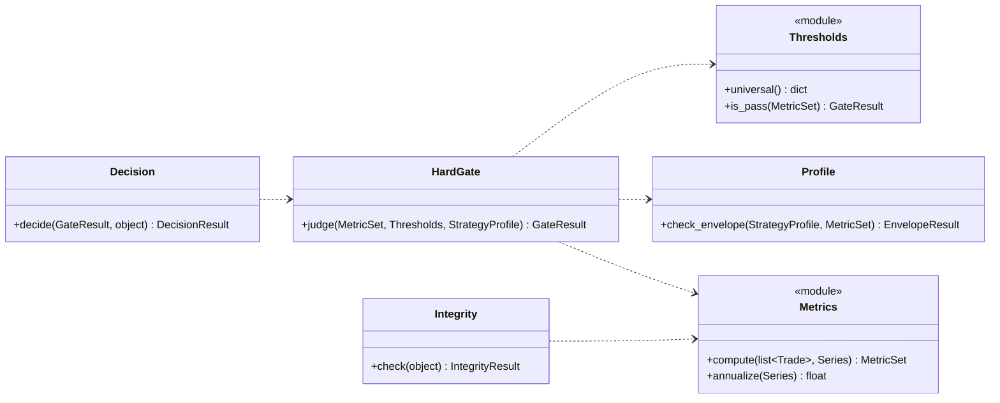

**`Metrics` — 성과 수식 표준(유일 정본).** 아래 수식을 정확히 구현한다(현행 이중 구현 흡수). 모든 손익은 net이고,
상위 분석은 금액이 아니라 R-multiple(`R = 거래손익 / 1R`)로 계산한다.

- **승률·손익비.** 승률 `p = N_W / N`, 패율 `q = 1 − p`. 평균 수익 `W̄ = (1/N_W)·Σ_{i∈W} x_i`, 평균 손실
  `L̄ = (1/N_L)·Σ_{i∈L} |x_i|`. 손익비 `B = W̄ / L̄`.
- **기대값.** `E = p·W̄ − q·L̄`, R 기준 `E_R = p·R̄₊ − q·|R̄₋|`(양수여야 채택 1차 관문 통과).
- **Profit Factor.** `PF = 총수익 / 총손실 = Σ_{i∈W} x_i / Σ_{i∈L} |x_i|`. 같은 데이터에서 `PF > 1 ⇔ E > 0`.
- **Sharpe(연율).** `√K · ē / s_e`, `e_t = r_t − r_f`, `s_e`는 표본표준편차(ddof=1). 단독 탈락 기준으로 쓰지
  않는다.
- **Sortino(연율).** `√K · (r̄ − T) / σ_d`, `σ_d = √( (1/N)·Σ min(0, r_t − T)² )`. **분모는 반드시 전체 관측
  수 N**(음수 수익률만의 표준편차는 틀린 계산, Sortino를 부풀린다).
- **MDD.** `M_t = max_{s≤t} V_s`, `DD_t = V_t/M_t − 1`, `MDD = min_t DD_t`. running-max 이후 저점 기준이며 보유
  중 캔들의 불리 극값(intrabar)을 마크에 포함한다(종가만 보면 낙폭 과소 → Calmar 과대 → 통과선 오통과).
- **Ulcer Index.** `UI = √( (1/T)·Σ D_t² )`, `D_t = 100·(V_t/M_t − 1)`.
- **Calmar / MAR.** 둘 다 `CAGR / |MDD|`이며 측정 기간만 다르다 — Calmar는 최근 36개월, MAR은 전체 기간. 36개월
  미만이면 MAR로 산정하고 산정 기간을 메타에 명시한다(두 이름 혼용 금지).
- **SQN.** `SQN = √N · R̄ / s_R`, `s_R`는 표본표준편차(ddof=1). **`√N`의 N은 `min(N, 100)`으로 캡**하고 표본
  `N < 30`이면 무효(t-통계량이라 거래 수 인플레를 막는다).
- **Kelly.** `f* = p − (1−p)/B`(사이징 상한과 같은 정의, Full 금지·Quarter~Half 상한).
- **Risk of Ruin.** R-multiple 분포 **몬테카를로**(고정 seed)로 추정한다. 단순 `(q/p)^B`는 저승률·고손익비에서
  무조건 파산 100%를 줘 금지한다.
- **연율화 규약.** equity를 **일간으로 리샘플한 뒤 √365**를 적용한다(`K = 365`). 1시간 등 하위 TF 수익률에 √365를
  직접 적용하지 않는다(계수 선택으로 Sortino가 수 배 달라져 판정이 뒤집힌다). √252(전통 선물)와 혼용 금지.

**`Thresholds`·`Profile` — 통과선과 기대 범위.** 통과선은 형태 무관 구속(모든 전략에 그대로 적용)과 형태 의존
(전략 프로파일 기대 범위 대조)으로 갈린다. 아래가 확정된 수치다(net·가능하면 OOS·거래 수 `N ≥ 30`, 이상적
`≥ 100` 전제).

| 지표 | 유형 | 통과선(이하 탈락) | 목표선 | 과최적화 경보 |
|---|---|---|---|---|
| Profit Factor | 형태 무관 구속 | `< 1.3` | `≥ 1.5` | `≥ 3.0` 자동채택 금지 |
| Sortino | 형태 무관 구속 | `< 1.0` | `≥ 1.5` | — |
| Calmar / MAR | 형태 무관 구속 | `< 0.8` | `≥ 1.0` (우수 `≥ 2.0`) | 얕은 MDD + 고CAGR |
| SQN | 형태 무관 구속(유의성) | `< 1.6` | `≥ 2.0` | `≥ 3.0` 재확인 |
| MDD | 형태 무관 구속 | `> 30%` | `≤ 20%` | `< 5%` + 고CAGR |
| Risk of Ruin | 형태 무관 구속(생존) | `≥ 0.1%` | `< 0.1%` | — |
| Sharpe | 참고(단독 탈락 금지) | — | `≥ 1.0` | `> 2.5` 검증 |
| 승률(Win Rate) | 형태 의존(프로파일 대조) | — | 프로파일 기대 범위 | — |
| Payoff Ratio | 형태 의존(프로파일 대조) | — | 프로파일 기대 범위 | `> 5` + 극저승률 |
| 과최적화 방어(OOS·PSR) | 형태 무관 구속 | OOS Degradation `≥ 50%` · PSR `< 0.95` | OOS Degradation `< 50%` · PSR `≥ 0.95` | — |

- **수익성 판정은 언제나 `E_R > 0`(= `PF ≥ 1.3`)가 한다.** 승률·Payoff는 형태 확인용이며 단독 탈락 기준이 아니다
  (저승률·고손익비와 고승률·저손익비를 같은 절대선으로 재면 한쪽이 부당 탈락한다).
- **사이징 연동.** MDD가 통과선(30%)을 벗어나면 신호가 아니라 `risk_per_trade`·유닛 한도를 낮춘다. 파산확률이
  `0.1%` 이상이면 같은 레버를 당긴다. 실전 감내 한도는 45%(파산선 60%와 분리), 백테스트 MDD는 하한이라 실전 가정
  `= 백테스트 × 1.5`.
- **프로파일 성숙도.** 기대 범위 이탈은 기본 warning이며, reject는 `established` 전략이 그 형태를 잃은 회귀에만
  적용한다(`provisional`·`updating`은 reject하지 않음 — 순환 논리 방지).
- **과최적화 방어 증거의 출처.** OOS Degradation·확률적 샤프(PSR)/DSR·Walk-Forward·몬테카를로·부트스트랩
  신뢰구간은 단일 run 밖 상위 검증(Harness, §4.4)이 산출하고 Hard Gate A가 소비한다. 표본 외 성과 저하가 표본
  내의 50% 미만이어야 하고(OOS Degradation `< 50%`), 다중검정 보정 후 PSR이 95% 신뢰(`≥ 0.95`)를 넘어야 한다.
  DSR의 정확한 다중검정 보정 셈은 Harness 설계(§4.4)가 소유한다.

**`Integrity` — 무결성 검사.** 판정 전 다음을 검산한다: 회계 항등식 `cash + position = equity`, 시점 순서
`feature_ts ≤ decision_ts < execution_ts`, 비용 1회 차감, net-of-cost, 결정성(정규화 해시), Evidence 완성도.
실패하면 `diagnostic_only`로 **멈춰서** 데이터·기록을 고쳐 재실행한다(파이프라인의 유일한 정지).

**판정 파이프라인 플로우(정의서 내부).** 사전등록부터 최종 라우팅까지의 공식 판정 흐름이다. 통과선 미달과 프로파일
회귀는 종료가 아니라 개선 루프(forensics)로 보내는 것이 핵심이다 — 통과선만으로 전략을 포기하지 않는다.

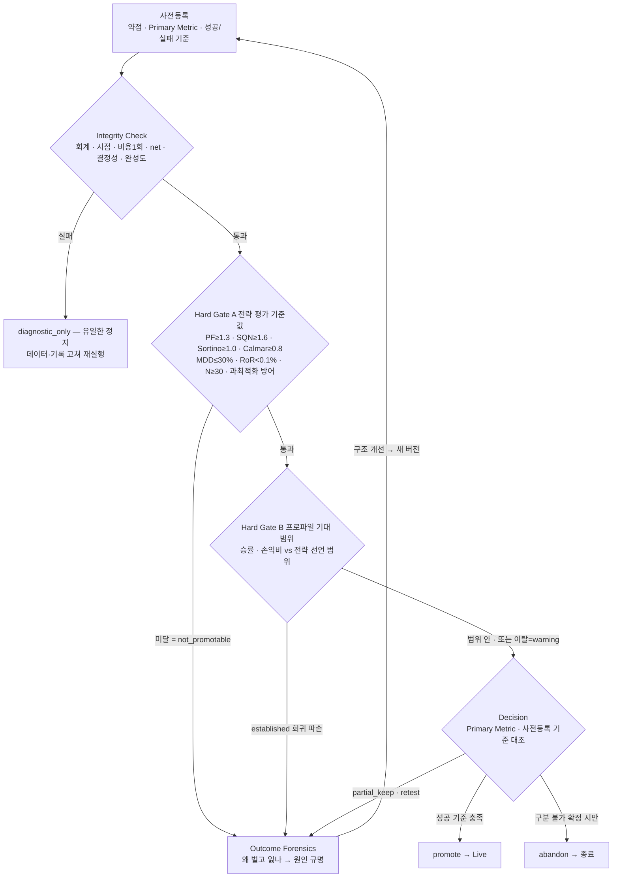

읽는 법: 정지는 무결성 실패(`diagnostic_only`) 하나뿐이다. Hard Gate A 미달과 B의 established 회귀 파손은 모두
forensics로 가 개선 루프를 돌고, 둘 다 통과한 run만 Decision이 사전등록 기준으로 `promote`·`partial_keep`·
`retest`·`abandon`으로 라우팅한다. `abandon`(종료)은 엣지를 구분할 수 없다고 판정될 때만 나온다. Hard Gate A의
숫자는 위 통과선 표가 정본이고, 성과 집중도·비용 민감도 등 일부는 설정으로 조정된다.

---

# Traceability (설계 표준 요구 ↔ 이 판의 절)

이 판(§1~§4.3)이 어떤 표준 요구를 충족하는지를 이름으로 적는다.

| 이 문서의 절 | 충족하는 표준 요구(이름) |
|---|---|
| 제약사항·방향 1, §1.1, §1.2 `core-lib` | 단일 표준 구현(전략·지표·사이징·비용을 한 번만 구현, 세 실행 모드 공유) |
| 제약사항·방향 2, §1.1 화살표, §2.1 후문 | 의존은 한 방향(서비스→core_lib, 역방향 없음; core_lib 내부 types 바닥) |
| 제약사항·방향 3, §1.2 `backtest-service`, §2 `ports`·`adapters` | 환경 차이는 포트로만 주입(추상 ABC는 core_lib, 구현은 서비스) |
| 제약사항·방향 4, §1.2 `crypto_data`·Evidence SQLite·`OHLCV 수집기` | look-ahead 구조적 배제(DataFeed up_to 경계, 확정 캔들만 적재·갱신) |
| 제약사항·방향 5, §1.2 `core-lib` 패키징, §2.1 `pyproject.toml` | sys.path 조작 없음(충돌 없는 단일 설치형 패키지명) |
| §1.2 `core-lib` 변경 거버넌스, §2.1 `tests/test_no_reduplication.py` | 재드리프트 방지 3규칙(변경 리뷰 게이트·재복제 가드 테스트·실거래 고정 버전 릴리스) |
| 제약사항·방향 6, §1.2 `backtest_db`·Evidence SQLite | 연구 데이터·운영 DB 분리(전용 meta DB + run별 SQLite + 읽기 전용 역할) |
| 제약사항·방향 7~11, §2 `execution`·`ports/broker`·`eval` | 시점 순서·Decimal 단일 변환 관문·net 손익·1R≤1%·결정성(뒤 절에서 강제될 위치를 뼈대에 배치) |
| 제약사항·방향(확정된 범위 조정), §2.1 `strategy/trailing/` | 트레일링·1분 집행 피드 유보를 구조에 반영하되 표준 위치는 보존(재도입·파리티는 §4에서 확정) |
| §1.2 `signal-service`·`wallet-service` | 유지 서비스는 채택으로 core_lib 소비(동작 불변, 프로덕션은 이 설계 단계에서 불변) |
| §1.1 전략 sub-block, §1.2 `signal_db` 레지스트리 | 전략(Adaptee)은 core-lib에 상주하고 실행할 전략 목록은 signal_db 레지스트리로 DB 관리(현행 코드 상주 목록 승격, 주입 포트 경유, 현행 `trading_strategies` 구조 차용) |
| §1.2 `OHLCV 수집기` | 외부 collector 내부화(적재만, 지표 역할 폐지) |
| §3.1 컴포넌트·다이어그램 화살표 | 단일 표준 구현(열 컴포넌트를 한 곳에 정의, 세 모드 공유) · 의존은 한 방향(내부 types 바닥, 역참조 없음) |
| §3.1 `execution` 컴포넌트 | Decimal 단일 변환 관문(모든 Broker가 `normalizer` 통과) · net 손익·회계 항등식·비용 1회 차감 |
| §3.2 포트 목록·어댑터 표 | 환경 차이는 포트로만 주입(7 ABC의 backtest 구현 확정, 순수 결정 로직은 포트 밖) |
| §3.2 DataFeed 어댑터 | look-ahead 구조적 배제(`up_to` 경계, 확정 캔들만) |
| §3.2 EvidenceSink·CatalogStore 어댑터 | 연구 데이터·운영 DB 분리(run별 SQLite + 전용 meta) · 결정성 해시=정렬 행 정규화 직렬화 |
| §3.3 signal-service 채택 | 유지 서비스의 지표·전략 인소싱(동작 보존, core_lib 소비) · 외부 collector 내부화 |
| §3.3 wallet-service 채택 | 유지 서비스의 실행·비용·사이징 치환(회계 정확도 교정·골든 재수립) · 체결 시점 통일(`decision_ts < execution_ts`) |
| §3.3 두 서비스 shim·포트 | 채택은 무중단 re-export shim · live/paper는 같은 포트 계약의 반대편 구현 |
| §3.1·§3.2·§3.3 트레일링·1분 피드 표기 | 트레일링·1분 집행 피드 유보를 구조에 반영(표준 위치 보존, 재도입·파리티는 §4에서) |
| 문서 구성(읽기 지도) | top-down 단일 문서(구조→행위, DB는 ERD로 분리, 정의 우선) |
| §4 서문, §4.1 float·Decimal 경계 | Decimal 단일 변환 관문(판단 경로 float·체결 경로 Decimal의 경계를 타입에 각인) |
| §4.1 `types` | 단일 표준 값 타입·금액 정밀도(단일 정의처) · 캔들 검증 불변식(시각 단조·`high≥max(o,c)`·`low≤min(o,c)`·`price>0`·`volume≥0`을 타입 계층에서 강제) · 신호 판단 전용(방향·수량 필드 없음) |
| §4.1 `indicators` | 82종 단일 구현·DRY(목록 확정) · look-ahead 구조적 배제(확정 캔들 전용 계약 `close_time ≤ T`) · 벡터화·증분 일치 · 시장폭 조건부 활성 · 워밍업 seed 규약 |
| §4.2 판단 계약·매니저·config | 전략 판단 계약(Adaptee 판단 전용·stateless·look-ahead는 Engine 통제) · 스키마 선언=Adaptee·해석=StrategyConfig·생성=Adapter Manager · config 불변·무순환 · 전략 프로파일 스키마 |
| §4.3 `execution` | Decimal 단일 변환 관문(`normalizer` 한 곳, 모든 Broker `submit` 통과) · 시점 순서(next-bar, `decision_ts < execution_ts`) · 동시 도달 손절 우선(OHLC-locked) · 회계 항등식 `cash+position=equity`·비용 1회 차감 |
| §4.3 `costs` | 모든 손익 net(4비용 수식) · 이산 펀딩·과거 실측 rate 주입 · 청산 Isolated 보수 방향 |
| §4.3 `sizing` | 생존 사이징 1R≤1% · Kelly 상한(Quarter~Half) · 노출·상관·방향 한도 · pct 경로 framework 비준수 플래그 |
| §4.3 `ports` | 환경 차이는 포트로만 주입(7 ABC, 구현은 서비스) · look-ahead(`up_to` 경계) · wall-clock 금지 |
| §4.3 `eval` | 성과 수식 표준 1곳·연율화 규약(일간 리샘플 후 √365) · 판정 3단계(무결성→Hard Gate→Decision) · 통과선 정본(형태 무관 구속/형태 의존)·프로파일 성숙도 |

> 이 판은 core-lib 클래스 뷰(§4.1~§4.3)까지 확정했다. 이후 실행 드라이버 클래스 설계(§4.4~§4.5)가 Engine·출력
> 클래스와 그 캔들 루프·run 저장 시퀀스를, 데이터베이스 설계(§5)가 각 DB의 ERD·필드를, 부록이 채택·대사·회귀
> 절차를 이 뼈대에 매단다.
