# 백테스트 v2 상세 설계서

암호화폐 무기한 선물·현물 전략의 백테스트·평가·개선 플랫폼을, 세 실행 모드(백테스트·페이퍼·라이브)가
물리적으로 같은 코드를 쓰도록 공유 라이브러리 위에 다시 만든다. 이 문서는 그 시스템을 **위에서 아래로** —
서비스, 코드 트리, 컴포넌트, 클래스 순으로 — 담는다. 데이터베이스 스키마는 성격이 다르고 분량도 커서 짝이 되는
별도 문서 `백테스트 v2 데이터베이스 설계서`(`backtest_v2_detailed_design_database.md`)로 뺐다. 각 절은 다이어그램과
정의를 함께 실어 자기완결로 쓴다. 다른 문서를 열지 않아도 되도록, 필드·수식·임계값·시그니처·불변식은 각 문서 안에
전부 적는다.

이 문서는 최상위 구조 — 서비스 뷰(§1)·프로젝트 코드 트리(§2) — 와 문서 전체의 읽기 지도, 그 아래 컴포넌트
뷰(§3, 서비스별 컴포넌트 다이어그램·정의서)에 더해, 클래스 뷰를 확정한다 — 공유 라이브러리 `core-lib` 쪽은 값
타입과 지표(§4.1), 전략을 끼우는 계약과 파라미터 해석 시퀀스(§4.2), 체결·비용·사이징·포트와 판정 플로우(§4.3)이고,
`backtest-service` 쪽은 Engine과 포트 어댑터·설정·Harness를 캔들 루프·1분 트리거 walk 시퀀스와 함께(§4.4), 그리고
출력 저장 어댑터를 run 저장 시퀀스와 함께(§4.5) 다룬다. 컴포넌트마다 클래스 다이어그램과 정의서를 두고,
시퀀스·플로우는 그 정의서 안에 둔다.

---

# 제약사항·방향

## 목적과 범위

이 시스템의 존재 이유는 "더 빠른 엔진"이 아니라 백테스트가 내린 판단을 믿을 수 있게 만들고 그 판단을 전략 개선으로
잇는 것이다. 두 기능으로 나뉜다. 하나는 **전략 검증**(통과선을 넘는지 판정)이고, 다른 하나는 **전략 개선**(거래
단위로 약점을 지표로 규명하고 구조적으로 보완한 뒤 재평가)이며, 개선이 주 목적이다.

이 절이 세우는 것은 시스템의 뼈대다. **무엇이 있고(서비스), 그것이 어떤 코드 구조로 놓이는지(트리)** 를 확정하고,
그 아래 컴포넌트·클래스·데이터베이스 상세는 뒤 절이 이 뼈대에 매단다. 전략이 무엇으로 진입·청산하는지(시그널
엣지)는 각 전략이 소유하는 입력이며 이 설계의 범위 밖이다 — 플랫폼은 전략을 끼우는 계약만 설계한다.

## 설계를 구속하는 불변식 (위반 불가)

아래는 협상 대상이 아니다. 뼈대(§1·§2)가 직접 구현하는 구조 불변식과, 뒤 절(§3~§5)에서 강제될 수치
불변식으로 나뉜다. 둘 다 여기 명시해 문서 전체의 구속으로 둔다.

**구조 불변식 — 이 뼈대가 직접 실현한다.**

1. **단일 표준 구현(한 번만 구현).** 전략·지표·사이징·비용계산은 복제 없이 하나의 공유 라이브러리(`core_lib`)에
   두고 백테스트·페이퍼·라이브가 함께 import한다. 백테스트가 검증한 구현과 라이브가 실행하는 구현이 어긋나면
   백테스트 결과 자체가 무의미해지기 때문이다.
2. **의존은 한 방향뿐.** 서비스가 `core_lib`를 import하고, `core_lib`는 어떤 서비스 코드도 import하지 않는다.
   `core_lib` 내부에서도 `types`가 바닥이고 나머지는 `types` 위에서만 서로를 참조한다(구체 방향은 뒤 절에서 확정).
3. **환경 차이는 포트로만 주입한다.** 데이터 출처·체결·시계·비용·기록 같은 실행 환경별 관심사는 `core_lib.ports`의
   경계 뒤로 빼고, 환경별 구현(어댑터)을 주입한다. 순수 결정 로직은 포트 밖(코어)에, wall-clock·네트워크·파일
   입출력은 포트 구현 안에만 둔다. 어떤 관심사가 포트가 되는지는 목록을 미리 고정하지 않고 뒤 절에서 정한다.
4. **look-ahead(미래 데이터 참조) 구조적 배제.** 신호는 캔들 마감이 확정된 뒤에만 평가한다. 데이터 피드 포트는
   경계 시점(`up_to`) 이후 캔들을 절대 반환하지 않고, 재귀형 지표는 마감 확정 캔들로만 갱신한다
   (`close_time ≤ 판단 시각`). 데이터 적재 층도 확정 캔들만 저장해 이를 뒷받침한다.
5. **`sys.path` 조작 없음.** 공유 라이브러리를 충돌 없는 단일 패키지명(`core_lib`)의 설치형 패키지로 두어,
   여러 서비스가 같은 최상위 패키지명을 써서 생기던 네임스페이스 충돌과 동적 경로 조작을 원천 제거한다.
6. **연구 데이터와 운영 DB 분리.** 백테스트 상세 근거(Evidence)는 run별 독립 SQLite에 담고, run 요약·카탈로그
   메타는 운영 DB(wallet·signal)와 분리된 전용 `backtest_db`에 둔다. 대시보드 조회용 읽기 전용 역할을 writer와
   별도로 둔다.

**수치·시점 불변식 — 구현이 반드시 지킨다(뒤 절에서 강제, 여기 미리 명시).**

7. **시점 순서 강제.** `feature_ts ≤ decision_ts < execution_ts`. 체결은 결정보다 반드시 나중이며, 결정 캔들
   마감 시점에는 체결하지 않는다(기본은 다음 캔들 시가 체결).
8. **Decimal 단일 변환 관문.** 판단 경로(지표 → 전략 → 신호)는 빠른 `float64`로, 체결·금액 경로는 오차 없는
   `Decimal`로 계산한다. `float`을 `Decimal`로 바꾸는 일은 시스템 전체에서 딱 한 지점 — 체결 진입점
   `Broker.submit()` — 에서만, `Decimal(str(x))` + `quantize`로 한 번 수행하고 그 뒤로는 Decimal만 쓴다. `float`을
   곧바로 `Decimal(x)`에 넣는 것은 금지한다 — `float`이 이미 품고 있던 이진 오차까지 그대로 복사되어, 그 오차가
   스탑 가격의 끝자리를 뒤집으면 같은 캔들 안에서 스탑이 걸리는지(체결 여부)와 결정성 해시가 달라지기 때문이다.
   `Decimal(str(x))`는 문자열을 거쳐 의도한 값 그대로 만든다.
9. **모든 손익은 net.** `x_net = x_gross − fee_entry − fee_exit − slippage − funding − liquidation_penalty`.
   각 비용은 한 번만 차감하고 `cash + position = equity` 항등식을 유지한다. "비용 0 가정"은 금지.
10. **생존 사이징.** 거래당 위험은 계좌의 1% 이하(`1R ≤ 1%`)이며, 엣지는 진입 신호에서 온다(손절·익절 배치로
    기대값을 창조하지 못한다). pct 방식 사이징은 호환 경로로 두되 `1R ≤ 1%`를 보장하지 못하면 메타에 비준수로
    표시한다.
11. **결정성.** 같은 입력·같은 seed는 언제나 같은 Evidence를 낸다. 결정성 검증 해시는 SQLite 파일 바이트가
    아니라 정렬된 행의 정규화 직렬화(wall-clock 제외)로 산출한다.

## 설계 방향

네 서비스를 **하나의 monorepo**에 만든다. 공유 라이브러리 `core-lib`(설치형 패키지 `core_lib`)와 새
`backtest-service`, 그리고 유지·채택 대상인 `signal-service`·`wallet-service`가 한 저장소 안 형제 패키지로 놓인다.
단, **배포는 서비스별로 독립**이다(§2·§1.2에서 확정). 특히 실거래를 도는 signal/wallet은 `core-lib`을 작업 트리에
링크하지 않고 **버전 고정한 빌드 산출물**로 받아, core-lib 한 줄 수정이 즉시 실거래로 새지 않게 한다. backtest는
검증이 목적이므로 core-lib을 editable로 최신 소스에 맞춰 쓴다.

빌드 순서는 위험을 뒤로 미루는 쪽으로 잡는다. 먼저 `core-lib`와 `backtest-service`를 깨끗이 만들어 `core-lib`을
백테스트로 검증하고, 그 뒤 **채택 단계**에서 기존 signal/wallet 구현을 이 monorepo로 들여와 내부 구현(지표·전략·
실행·사이징)을 `core_lib` import로 치환한다 — 동작은 불변. 채택 전까지 기존 리포의 signal/wallet이 프로덕션을
유지하고 이식 원천으로만 참조되며, 채택이 끝나면 monorepo가 그 서비스들의 단일 홈이 된다. 세 실행 모드가 같은
코드를 쓴다는 목표는 이 채택으로 완성된다.

> **토폴로지 divergence(사용자 확정 2026-07-13).** 표준 개발 계획은 signal/wallet을 별도의 기존 리포에 두는 '두
> 세계' 토폴로지였으나, 네 서비스를 **단일 monorepo**에 두되 서비스별 독립 배포로 관리하도록 사용자가 확정했다.
> core-lib을 backtest로 먼저 검증해 위험을 미루는 논리는 그대로 유지되고, 실거래 격리는 "monorepo 안이라도 실거래
> 배포는 버전 고정 산출물을 설치한다"로 지킨다.

기존 백테스트·replay 서비스는 전면 폐기 대상이라 서비스가 아니며 이 뷰에 등장하지 않는다. 그 필요 기능은 새
`backtest-service`가 새로 구현한다. 외부 collector는 리포 내부 `OHLCV 수집기`로 이관해 OHLCV 적재만 맡기고, 지표
사전계산 역할은 폐지한다.

## 확정된 범위 조정

첫 검증 스코프에서 두 항목을 유보한다(사용자 확정). 하나는 **트레일링 기계장치**(현재 이를 소비하는 전략이
없다)로, 표준 위치(`core_lib.strategy.trailing`)는 코드 트리에 남기되 첫 검증 전략은 트레일링 없이 구현하고,
재도입 시 단일 표준 계산기로 통합하며 파리티 기준을 확정한다. 다른 하나는 **1분 하위 집행 피드**로, 집행 판정을
전략 타임프레임 캔들 수준의 보수 판정으로 두고(손절·익절 동시 도달 시 손절 우선, OHLC-locked), 1분 피드로 내려간
집행과 그 파리티 허용 편차는 Engine 설계(§4.4)에서 확정한다. 두 유보는 뼈대의 구조를 바꾸지 않는다.

## 문서 구성 (읽기 지도)

이 설계는 위에서 아래로 쌓인다. 절 순서가 곧 상세화 순서다. 구조(서비스·트리·컴포넌트·클래스)를 행위(시퀀스·
플로우)보다 먼저 두고, 시퀀스·플로우는 별도 장이 아니라 해당 클래스 정의서 안에 둔다. 데이터베이스는 클래스와
분리해 ERD를 기준으로 기술하며, 그 분리가 문서 수준까지 이어져 §5는 이 문서가 아니라 짝이 되는 별도 문서에 있다.
하위 식별자(클래스·필드·파일)는 그것을 담는 상위 단위(서비스→컴포넌트→클래스)가 먼저 정의된 뒤에만 등장한다.

| 절 | 제목 | 담는 내용 | 있는 곳 · 상태 |
|---|---|---|---|
| §1 | 서비스 다이어그램 + 정의서 | 어떤 서비스·저장소가 있고 어떻게 의존하는지 (최상위 뷰) | 이 문서 · 확정 |
| §2 | 프로젝트 코드 트리 | 서비스 아래 디렉터리·패키지 구조 + 경로별 역할 | 이 문서 · 확정 |
| §3 | 컴포넌트 다이어그램 + 정의서 (서비스별) | §3.1 `core-lib`(공유) · §3.2 `backtest-service` · §3.3 채택분(signal·wallet) | 이 문서 · 확정 |
| §4 | 클래스 다이어그램 + 정의서 (컴포넌트별) | §4.1 타입·지표 · §4.2 전략(+config 시퀀스) · §4.3 실행·평가(+판정 플로우) · §4.4 Engine(+캔들 루프·집행 시퀀스) · §4.5 출력(+run 저장 시퀀스) | 이 문서 · 확정 |
| §5 | 데이터베이스 ERD + 정의서 (DB별) | §5.1 DB 전체 구성 + `crypto_data`·`signal_db` · §5.2 `backtest_db` · §5.3 Evidence SQLite | **별도 문서** `backtest_v2_detailed_design_database.md` · 확정 |
| 부록 | 채택·대사·회귀 절차 | 채택 지점·shim·회귀 범위·자체 검증 기준선·비밀 저장 방식 변경 | 이 문서 · 예정 |

> **데이터베이스를 별도 문서로 뺀 이유.** 이 문서가 클래스 뷰까지만으로도 이미 길어, 스키마까지 한 파일에 담으면
> 필요한 대목을 찾기 어려워진다. 데이터베이스는 다루는 대상(테이블·컬럼·키)과 표현(ER 다이어그램)이 클래스와
> 달라 따로 읽는 편이 자연스럽기도 하다. 절 번호는 §5.1~§5.3을 그대로 유지해 두 문서가 하나의 설계로 이어지게
> 했고, 그 문서 역시 서두에 자체 제약사항·방향을 갖춰 그것만으로 스키마를 만들 수 있다.

---

# §1 서비스 다이어그램 + 정의서

## §1.1 서비스 다이어그램

이 그림은 시스템을 가장 위에서 본 것이다. 네 서비스가 **한 monorepo 안**에 형제 패키지로 들어 있다 — 공유
라이브러리 `core-lib`, 백테스트 전용 `backtest-service`, 그리고 유지·채택 대상인 `signal-service`·`wallet-service`다.
한 저장소에 있어도 **배포는 서비스별로 독립**이다(아래에서 설명). 데이터를 채워 넣는 것은 `OHLCV 수집기`이고,
저장소는 `crypto_data`·`backtest_db`·`signal_db`·Evidence SQLite 넷이다.

화살표는 세 가지다.

- **실선 `import`** — 서비스가 `core_lib`를 가져다 쓰는 의존. 방향은 언제나 서비스에서 `core_lib` 한쪽뿐이다.
- **포트 이름이 붙은 실선** — 서비스가 그 포트를 거쳐 저장소를 읽고 쓴다.
- **점선** — 지금이 아니라 채택 단계에 가서야 성립하는 의존.

`core-lib` 내부 모듈끼리의 import 의존만 따로 본 그래프는 §2.1에 있다.

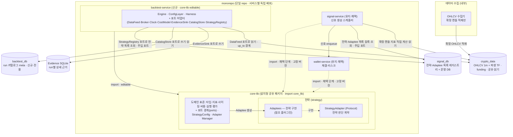
```mermaid
flowchart TD
    subgraph REPO["monorepo (단일 repo · 서비스별 독립 배포)"]
        subgraph CORELIB["core-lib (설치형 공유 패키지 · import core_lib)"]
            CORE["도메인 표준: 타입·지표·사이징·비용·실행·평가<br/>+ 포트 경계(ports) · StrategyConfig · Adapter Manager"]
            subgraph STRATBLK["전략 (strategy)"]
                SADP["StrategyAdapter (Protocol)<br/>전략 판단 계약"]
                ADP["Adaptees — 전략 구현<br/>(참조 플러그인)"]
            end
        end
        subgraph BTS["backtest-service (신규 · core-lib editable)"]
            ENG["Engine · ConfigLayer · Harness<br/>+ 포트 어댑터(DataFeed·Broker·Clock·CostModel·EvidenceSink·CatalogStore·StrategyRegistry)"]
        end
        SS["signal-service (유지·채택)<br/>신호 생성 스케줄러"]
        WS["wallet-service (유지·채택)<br/>체결·리스크"]
    end
    subgraph COLLECT["데이터 수집 (내부)"]
        COLL["OHLCV 수집기<br/>확정 캔들 적재만"]
    end
    CD[("crypto_data<br/>OHLCV 1m + 파생 TF · funding · 공유·읽기")]
    PG[("backtest_db<br/>run 카탈로그 meta · 신규·전용")]
    SDB[("signal_db<br/>전략·Adaptee 목록 레지스트리 + 운영 DB")]
    SQ[("Evidence SQLite<br/>run별 상세 근거")]

    ADP -.->|구현| SADP
    CORE -->|Adaptee 생성| ADP

    BTS -->|import · editable| CORELIB
    SS -.->|import · 채택 단계 · 고정 버전| CORELIB
    WS -.->|import · 채택 단계 · 고정 버전| CORELIB

    ENG -->|DataFeed 포트로 읽기 · up_to 경계| CD
    ENG -->|EvidenceSink 포트로 쓰기| SQ
    ENG -->|CatalogStore 포트로 쓰기·읽기| PG
    ENG -->|StrategyRegistry 포트로 전략 목록 조회 · 주입 포트| SDB

    COLL -->|확정 OHLCV 적재| CD
    SS -->|확정 캔들 지표 직접 계산·읽기| CD
    SS -->|전략·Adaptee 목록 등록·조회 · 주입 포트| SDB
    SS -->|신호 enqueue| WS
```

**점선(채택 단계)의 뜻.** 점선 두 개는 `signal-service`·`wallet-service`가 채택 단계에 가서야 생기는 의존이다. 채택
단계란 core-lib을 '쓰기 시작한다'가 아니라, 이미 자기 코드로 도는 기존 서비스가 그 내부 구현(지표·전략·실행)을
`core_lib` import로 갈아 끼우는 이행 단계다. 지금은 두 서비스가 자기 구현으로 프로덕션을 돌려 core-lib 의존이 없고,
그 의존은 채택에 가서 생기므로 점선이다. 갈아 끼운 뒤에도 계산 결과는 그대로다.

**backtest가 실선인 이유.** `backtest-service`는 처음부터 core_lib로 새로 개발해 갈아 끼울 기존 구현이 없다. 태어날
때부터 의존하므로 지금 성립하는 실선이다. 실선·점선을 가르는 것은 'core-lib를 쓰느냐'가 아니라 '그 의존이 지금
있느냐(신규 서비스)냐, 채택에 가서 생기느냐(기존 서비스)냐'다.

**editable vs 고정 버전.** 화살표 라벨의 두 값은 같은 monorepo 안에서도 배포가 서비스별로 독립임을 뜻한다. backtest는
core-lib을 editable로 붙여 최신 소스를 검증하고, 실거래를 도는 signal/wallet은 버전 고정한 빌드 산출물로 받는다.
그래서 core-lib 한 줄 수정이 실거래로 곧장 새지 않는다(규율은 §1.2에서 확정).

**그림에서 뺀 저장소.** 두 저장소는 일부러 뺐다. `wallet_db`(wallet의 체결·포지션·회계)는 백테스트 데이터 흐름과
무관하고, `config_db`(수집기가 읽는 활성 심볼)는 원래 외부 collector의 관심사라서다.

**전략 블록의 두 요소.** `core-lib` 안 전략 블록에는 둘이 있다.

- **`StrategyAdapter`** — 플랫폼이 소유하는 '전략을 끼우는 자리'(Protocol). 끼우는 계약만 정한다.
- **`Adaptees`** — 그 자리에 꽂히는 실제 전략 구현들. 언제 진입·청산할지는 전략 작성자 몫이라 이 설계 범위 밖이다.

**전략 목록은 DB에 둔다.** 어떤 Adaptee가 있는지(실행할 전략 목록)는 코드가 아니라 `signal_db` 레지스트리에 둔다.
`Adapter Manager`가 이 목록을 다루되 `signal_db`를 직접 건드리지 않고 주입된 `StrategyRegistry` 포트를 거치므로,
core-lib은 특정 DB에 묶이지 않는다. 이 방식은 현행 signal-service에서 가져왔다 — 지금은 목록이 코드(부팅 하드코딩)에
박혀 있는데, 신규 설계는 이를 `signal_db`로 올려 단일 출처로 삼는다. 레지스트리 컬럼 구조는 현행 `trading_strategies`
(클래스명·파라미터 JSONB·심볼·타임프레임·활성·버전)를 차용하고, 실제 표·필드는 §5.1에서 확정한다.

## §1.2 서비스 정의서

서비스·저장소의 정의를 두 표로 확정한다. 소비(의존)의 방향은 §1.1 다이어그램이 담고, 표는 각 요소의 유형·책임·
경계(하지 않는 것)·패키징을 담는다. 표로 담기 어려운 규칙(변경 거버넌스)만 표 아래 문장으로 둔다.

**서비스 정의**

| 요소                 | 유형             | 책임                                                                                                                           | 경계 (하지 않음)                                                                                                       | 소비 (→ §1.1)                                                                           | 패키징                                                                                                                                         |
| ------------------ | -------------- | ---------------------------------------------------------------------------------------------------------------------------- | ---------------------------------------------------------------------------------------------------------------- | ------------------------------------------------------------------------------------- | ------------------------------------------------------------------------------------------------------------------------------------------- |
| `core-lib`         | 설치형 공유 패키지     | 도메인 표준(값 타입·금액 정밀도·지표·전략 판단 계약·사이징·비용·실행 수식·성과 평가·판정·포트 경계·Adaptee 생성/파라미터 해석)의 유일한 구현처                                      | 실행 드라이버 아님(캔들 루프·읽기·저장·wall-clock·IO 없음); 특정 DB 직접 의존 없음(레지스트리도 주입 포트 경유); 서비스 코드 import 안 함                     | 없음 — 의존 그래프의 바닥(내부 계층 방향은 §2.1 의존 다이어그램)                                              | monorepo `services/core-lib/`; 단일 설치형 패키지 `core_lib`(하이픈 없음 → 네임스페이스 충돌·`sys.path` 조작 제거); backtest는 editable·실거래 signal/wallet은 버전 고정으로 설치 |
| `backtest-service` | 신규 서비스         | 도메인 로직을 `core_lib`에서만 가져오는(다른 서비스 import 안 함) 결정적 실행 드라이버·입출력 오케스트레이터(사전등록·run_id 발급·워밍업 preload·캔들 루프·데이터 피드 push·체결·2계층 저장·상위 검증) | 전략 판단·지표·사이징·비용·실행 규칙 자체 미보유(전부 `core_lib` 호출); 라이브 인프라(큐·폴링·HTTP·상태 복구) 없음; 전략 파라미터 스키마·검증 미소유(run 설정만 소유)      | `core-lib`(import); `crypto_data`·Evidence SQLite·`backtest_db`·`signal_db`(전부 포트 경유) | monorepo `services/backtest-service/`; core-lib editable 의존; 독립 배포; 포트의 backtest 구현(어댑터) 소유                                                 |
| `signal-service`   | 기존 서비스 (유지·채택) | 확정 캔들마다 지표 증분(O(1)) 직접 계산 + Adapter Manager로 Adaptee 생성·판단 호출 → `wallet-service` 큐로 신호 전달                                    | 이 설계 단계 미변경(채택 단계에서만 내부 구현→`core_lib` 치환, 동작 불변); 판정 루프 안 돎(라이브 Evidence는 연구 피드백만)                               | 채택 후 `core-lib`(import); `crypto_data`(읽기·지표 계산); `signal_db`                         | monorepo `services/signal-service/`(채택 시 이관); 독립 배포; 실거래는 core-lib 버전 고정; 채택 전 기존 리포가 프로덕션·이식 원천; 채택은 무중단 re-export shim                    |
| `wallet-service`   | 기존 서비스 (유지·채택) | 신호 큐 소비 → 사이징·실행·비용 호출로 체결·리스크·킬스위치; 체결·포지션·회계를 자기 운영 DB에 기록                                                                 | 이 설계 단계 미변경(채택 단계에서 체결 시점 즉시→다음 캔들 시가 전환, 회귀 ~1279건 필요); 라이브 인프라 백테스트로 미이관                                       | 채택 후 `core-lib`(import); `wallet_db`                                                  | monorepo `services/wallet-service/`(채택 시 이관); 독립 배포; 실거래는 core-lib 버전 고정; 채택 전 기존 리포가 프로덕션·이식 원천; 채택은 re-export shim                        |
| `OHLCV 수집기`        | 내부 컴포넌트        | 거래소 확정 캔들 OHLCV를 `crypto_data`에 적재(확정 캔들마다 1행·무조건)                                                                           | 지표 미생성(계산은 signal·backtest가 `core_lib`로); 진행 중 캔들 미적재(look-ahead 방지의 데이터 층 근거); 단일 심볼 Binance 선물만(Upbit 현물 범위 밖) | 거래소 REST·WebSocket(입력); `crypto_data`(쓰기); `config_db`(활성 심볼 읽기)                      | 외부 collector의 리포 내부 이관분; 과거 구간은 기존 backfill 재사용 + `crypto_data` 보존 연장(예: 2000일)                                                             |

**저장소 정의**

| 저장소 | 유형 | 책임 | 접근 (쓰기/읽기) | 경계 |
|---|---|---|---|---|
| `crypto_data` | 공유·읽기 | 확정 캔들 OHLCV(1분 적재, 상위 TF는 연속 집계 뷰) + funding rate 시계열 | `OHLCV 수집기` 쓰기; `backtest-service`(DataFeed 포트)·`signal-service` 읽기; 백테스트 미기록 | crypto-data-hub가 생성·소유하는 공유 DB; 백테스트 결과 미저장; 전략 TF와 별도로 1분 트리거 캔들 보유(1분 집행 피드 사용은 §4.4 확정) |
| `backtest_db` | 신규·전용 메타 | run 요약·카탈로그·사전등록·태그 등 run 메타(검색·비교·집계 근거) | `backtest-service`(CatalogStore 포트) 쓰기, Harness 읽기; 조회용 읽기 전용 역할을 writer와 분리 | 운영 DB와 분리(연구 데이터 오염 방지); 상세 Evidence 미보유; 이름·writer 계승·스키마 신규·읽기 전용 역할 신설(필드는 §5.2) |
| `signal_db` | 기존 + 레지스트리 | `signal-service` 운영 DB + 실행할 전략(Adaptee) 목록 레지스트리 — 현행 코드 상주(부팅 하드코딩) 목록을 DB로 승격해 전략 목록의 단일 출처로 삼음 | `signal-service` 쓰기; Adapter Manager가 주입 포트로 등록·조회(`backtest-service`도 주입 포트로 조회) | `core_lib` 직접 의존 없음(주입 포트 경유); 레지스트리는 현행 `trading_strategies`(클래스명·파라미터 JSONB·심볼·타임프레임·활성·버전) 구조 차용, ERD·필드는 §5.1 |
| Evidence SQLite | run별 상세 | run별 캔들 신호·주문·체결·포지션·손익·지표 스냅샷(forensics·재현 원천) | `backtest-service`(EvidenceSink 포트) 쓰기; 대시보드·연구 읽기; 라이브는 연구 피드백용만 | run 자기완결(원천 스냅샷 로컬 사본); 운영 DB 미저장; 결정성 해시=정렬 행 정규화 직렬화(파일 바이트 아님)(필드는 §5.3) |

> `wallet_db`(wallet 운영 DB)와 `config_db`(수집기가 읽는 활성 심볼)는 백테스트 데이터 흐름 밖이라 이 저장소 표에서
> 뺐다(§1.1 참고).

**표로 담기 어려운 규칙 (문장).** `core-lib`는 세 서비스(백테스트·signal·wallet)가 공유하므로, 통제 없이 바뀌면
"모두가 건드리고 아무도 책임지지 않는" 결합 허브로 퇴화하기 쉽다. 그런데 복제 드리프트를 실제로 막는 힘은 자동
검사가 아니라 **구조와 리뷰**에 있고, 자동 테스트는 그 아래 좁은 보조 알람이다. 세기 순서로 적는다.

- **가장 강한 방어는 구조 자체다.** 표준 코드를 설치형 단일 패키지 `core_lib` 하나에만 두고 세 서비스가 모두
  import하게 하면, 표준 로직이 물리적으로 한 곳에만 존재한다. 예전에 사본이 생긴 근본 원인은 공유 패키지가 없어 각
  서비스가 `sys.path` 조작으로 자기 트리를 끌어다 쓴 데 있었다. 공유 패키지가 있으면 import가 기본 경로가 되고
  복사는 오히려 품이 드는 일이라, 굳이 다시 구현할 이유 자체가 사라진다.
- **그다음은 리뷰다.** `core-lib`를 건드린 커밋은 예외 없이 리뷰 게이트에 넣는다. 구조가 막지 못하는 경우 — 누군가
  표준 로직을 이름만 바꿔 서비스 안에 다시 짜 넣는 것 — 은 자동으로 검출할 수 없으므로(두 코드가 같은 계산인지
  판정하는 것은 원리상 불가능하다), 사람이 "이 서비스가 왜 이걸 자기가 계산하지?"라고 알아채는 리뷰가 마지막
  방어선이다.
- **자동 테스트는 좁은 보조 알람이다.** `core_lib` 밖에 표준 모듈의 사본이 생기면 실패하는 저비용 가드 테스트
  (파일·심볼 이름 스캔 또는 import 규칙 검사)를 둔다. 단, 이 테스트가 잡는 것은 파일·이름을 그대로 둔 통째 복사
  하나뿐이다. 이름을 조금만 바꾸거나 다시 구현하면 빠져나가므로, 이건 예전에 실제로 났던 사고(지표 디렉터리 통째
  복제)를 값싸게 걸러 주는 덫일 뿐 중복 금지의 보장이 아니다. CI 없이 로컬에서도 돈다.

복제와는 별개로, 배포 독립성과 실거래 안전을 위한 규칙을 하나 더 둔다.

- **서비스별로 독립 배포하고, 실거래 직전에 core-lib 설치 방식을 바꾼다.** 네 서비스가 한 monorepo에 있어도 배포
  단위는 서비스마다 따로다 — 각자 자기 `pyproject.toml`로 빌드·배포한다. 페이퍼 단계까지는 "core-lib을 고치면 곧바로
  반영되는" editable 방식으로 설치해 서비스가 늘 최신 코드를 따라가게 둔다. 개발엔 편하지만, 이 상태로 실거래에
  들어가면 core-lib을 한 줄만 고쳐도 그 변경이 즉시 실거래 경로로 흘러든다. 그래서 실거래로 전환할 때는 — monorepo
  안이라도 작업 트리를 링크하지 않고 — 태그에서 빌드한 버전 고정 산출물(wheel)로 core-lib을 받는다. 새 버전을 일부러
  내보내기 전까지는 어떤 코드 수정도 실거래에 닿지 않고, `core_lib_version` 메타가 "백테스트가 검증한 버전 = 실거래가
  도는 버전"을 대조해 준다.

**채택 후 포트 경계 (문장).** 위 정의 표는 `signal-service`가 `crypto_data`를 읽고 `wallet-service`가 `wallet_db`에
쓰는 것으로 적었지만, 이는 요약이다. 두 서비스는 채택 단계에서 백테스트와 **같은 포트 계약의 반대편**을 채운다 —
각자의 live/paper 포트 구현(DataFeed 실시간 스트림·Broker 거래소 API·Clock 실시계·CostModel 실측·EvidenceSink
라이브)을 자기 서비스 안에 둔다. 그래야 "환경 차이는 포트로만 주입한다"가 backtest뿐 아니라 paper·live에도
성립한다. 이 구현 자체는 여기가 아니라 채택 설계(§3.3·부록)에서 그린다.

---

# §2 프로젝트 코드 트리

서비스 아래의 실제 디렉터리·패키지 구조다. 클래스를 그리기 전에 구조부터 확정한다. monorepo 루트에는 두 축이
형제로 놓인다. 하나는 네 서비스 패키지(`core-lib`·`backtest-service`·`signal-service`·`wallet-service`)를 담는
`services/`이고, 다른 하나는 배포할 때 DB와 역할을 초기화하는 `init-scripts/`다. 각 서비스는 자기 `pyproject.toml`을
가진 독립 배포 단위다. 트리의 각 경로에는 한 줄로 역할을 달았고, 각 노드는 뒤(§3)에서 그릴 컴포넌트와 짝이 된다.

아래 §2.1·§2.2는 여기서 새로 만드는 `core-lib`·`backtest-service`의 트리를 확정한다. 채택 대상인 `signal-service`·
`wallet-service`도 같은 `services/` 아래 형제 패키지로 들어오되(각자 독립 배포, 실거래는 core-lib 버전 고정), 그 내부
트리는 현행 구조를 이어받으므로 채택 설계(§3.3·부록)에서 확정한다.

짝은 대부분 1:1이지만 예외가 있다. `strategy/` 한 디렉터리가 컴포넌트 셋(StrategyAdapter·Adapter Manager·
StrategyConfig)을 담고, `adapters/` 한 디렉터리가 어댑터 일곱을 담는다. 반대로 `adaptees/`는 참조 플러그인이 놓이는
자리라 플랫폼 컴포넌트로 세지 않는다. 아래 표가 디렉터리와 §3 컴포넌트의 짝, 그리고 개수를 확정한다.

| 경로                                                                                               | §3 컴포넌트                                     | 개수              |
| ------------------------------------------------------------------------------------------------ | ------------------------------------------- | --------------- |
| `core_lib/{types, indicators, sizing, costs, execution, ports, eval}`                            | 각 동명 컴포넌트                                   | 각 1 (합 7)       |
| `core_lib/strategy/` (`base`+`profile`+`trailing` / `manager`(+`registry`+`factory`) / `config`) | StrategyAdapter · Adapter Manager · StrategyConfig | 3               |
| `core_lib/strategy/adaptees/`                                                                    | 참조 플러그인 전략                                  | 0 (플랫폼 컴포넌트 아님) |
| **§3.1 core-lib 소계**                                                                             |                                             | **10**          |
| `backtest_service/{engine, config, harness}`                                                     | Engine · ConfigLayer · Harness              | 각 1 (합 3)       |
| `backtest_service/adapters/`                                                                     | 포트 어댑터(6 대표 + `strategy_registry`)          | 7               |
| **§3.2 backtest-service 소계**                                                                     |                                             | **3 + 어댑터 7**   |

그래서 §3.1은 core-lib 컴포넌트 열 종을, §3.2는 Engine·ConfigLayer·Harness에 일곱 포트 어댑터를 더해 그린다.

## §2.1 `core-lib` 트리 (설치형 공유 패키지)

```text
services/core-lib/
  pyproject.toml                     # 패키지 정의(name="core-lib", packages=["core_lib"]); editable 설치로 sys.path 조작 폐지
  core_lib/
    __init__.py                      # 패키지 진입점
    types/                           # [컴포넌트] 도메인 값 타입·금액 정밀도의 단일 정의처
      candle.py                      #   통합 캔들 타입(신규): symbol·exchange·timeframe·open_time·close_time·o·h·l·c·v·quote_volume?·trade_count?; 캔들 검증 불변식 강제
      signal.py                      #   TradingSignal(판단 전용, 방향·수량 필드 없음)·SignalType — 신호 표준 승격
      order.py                       #   Order(주문·State Machine)
      position.py                    #   Position(포지션·가중평균·청산가)
      trade.py                       #   Trade(체결 완료 거래; r0=최초 위험 추가)
      fill.py                        #   Fill(체결 사실 명시 타입, 신규)
      enums.py                       #   OrderStatus/Side/Type·PositionSide·MarginType·MarketType·ExitReason(신규)
      money.py                       #   ZERO·Q_PRICE/AMOUNT/PERCENT/RATIO/FEE_RATE·quantize_*(ROUND_HALF_EVEN) — 금액 정밀도 상수
    indicators/                      # [컴포넌트] 공용 계산 프리미티브 + 지표 표준(벡터화·증분 두 계산 방식)
      primitives.py                  #   공용 계산 단위: sma·ema·wma·rma·tr·tp·stdev·hh·ll·cumulative·roc·linreg
      trend.py                       #   추세·이동평균 지표군
      momentum.py                    #   모멘텀 지표군
      volatility.py                  #   변동성 지표군
      volume.py                      #   거래량 지표군
      strength.py                    #   추세강도 지표군
      bill_williams.py               #   Bill Williams 지표군
      breadth.py                     #   시장폭 지표군(입력 없으면 비활성)
      cycle.py                       #   사이클(Ehlers) 지표군
      systems.py                     #   기타·복합 지표군
      donchian.py                    #   Donchian(등록 지표의 하나·옵션, 특정 전략용)
      registry.py                    #   지표 등록·버전·구현 고정 근거·min_history
      contracts.py                   #   확정 캔들 전용 계약 강제(close_time ≤ 판단 시각)
    strategy/                        # [컴포넌트×3] StrategyAdapter(base.py) + Adapter Manager(manager.py) + StrategyConfig(config.py)
      base.py                        #   StrategyAdapter(typing.Protocol) — 전략 판단 계약(analyze·metadata·파라미터 스키마 선언)
      registry.py                    #   in-process 플러그인(Adaptee) 등록·조회 규약 — Adapter Manager 소관; 외부 signal_db 구현 카탈로그와 별개(그건 ports/strategy_registry.py)
      factory.py                     #   Adaptee 생성 규약 — Adapter Manager(manager.py) 소관
      manager.py                     #   Adapter Manager — Adaptee 생성(Factory)·lifecycle; 외부 구현 카탈로그는 ports/strategy_registry.py(주입 포트)로 signal_db 등록·조회
      config.py                      #   StrategyConfig — 전략 파라미터 해석·검증·직렬화·UI JSON Schema 노출
      profile.py                     #   전략 프로파일 스키마(family·기대 승률/손익비 범위·tail_shape·성숙도 등) — 판단 계약 부속
      trailing/                      #   ATR 트레일링 표준 위치 — 판단 계약 부속(첫 검증 스코프 유보; 재도입 시 단일 표준으로 통합·파리티 확정)
        trailing_stop.py             #     트레일링 스탑 순수 함수 계산기(Adaptee가 상속 아닌 호출)
      adaptees/                      #   구현 전략(Adaptee) 위치 — 코어 계약 거버넌스와 별도 관리되는 첫 검증 참조 플러그인(플랫폼 컴포넌트 아님); 진입·청산 엣지는 각 Adaptee 소유(범위 밖); in-process strategy/registry.py에 등록되고, 외부 signal_db 카탈로그 동기화는 Adapter Manager가 ports/strategy_registry.py로 수행
        vessel_*.py                  #     첫 파이프라인 검증용 Vessel 계열 Adaptee(신규 구현, 트레일링 없이); 터틀 진입 전략은 만들지 않음
    sizing/                          # [컴포넌트] 거래당 위험 규율과 사이징 인스턴스
      risk_money.py                  #   보편 사이징: 수량=(risk_per_trade×Equity)/손절거리, 1R≤1%, 노출 한도, RoR 연동
      turtle_unit.py                 #   터틀 인스턴스(N 사이징·0.5N 피라미딩·유닛 한도) — 전략이 선택 조합
      wallet_pct.py                  #   pct 방식(호환) — framework 비준수 플래그 의무
      kelly.py                       #   Half/Quarter-Kelly 상한
    costs/                           # [컴포넌트] net 손익 4개 비용 수식 표준(값은 CostModel 주입)
      fee.py                         #   수수료(maker/taker, notional×rate)
      slippage.py                    #   슬리피지(고정 bps + 스프레드/충격)
      funding.py                     #   펀딩(이산 정산, 경계 캔들 시가 기준)
      liquidation.py                 #   청산가·청산 판정(Isolated 우선, 보수 방향)
    execution/                       # [컴포넌트] 주문 라이프사이클·결정적 체결·포지션 장부·회계
      order_lifecycle.py             #   NEW→FILLED 상태전이(VALID_TRANSITIONS)
      matcher.py                     #   결정적 체결 규칙(fill_timing·다음 캔들 시가·트리거·동시 터치 우선·갭·수량 절삭)
      position_book.py               #   포지션 갱신·가중평균·reduce_only·청산 판정·최초 체결 캔들 자기검사 회피
      accounting.py                  #   cash+position=equity 항등식·비용 1회 차감
      normalizer.py                  #   float→Decimal 단일 변환·quantize 관문(공유 코드) — 모든 Broker 어댑터의 submit()이 이 함수를 통과(어댑터별 독자 캐스팅 금지); 우회는 적합성 테스트로 차단(불변식: 단일·동일 캐스트)
    ports/                           # [컴포넌트] 환경별 관심사의 어댑터 경계(전부 ABC; 구현은 서비스가 주입) — 표준 포트 6종 + Adaptee 레지스트리 접근 포트 = 7종을 둔다; 목록 완결성·시그니처·구현 계약은 §3.2에서 확정
      data_feed.py                   #   DataFeed ABC: candles(up_to 경계)·funding·mark_price
      broker.py                      #   Broker ABC: submit(request:OrderRequest)→Fill·open_orders·cancel — 추상 계약만 선언(ports는 types만 참조, execution 미참조). Decimal 단일 변환은 구현 어댑터가 submit()에서 core_lib.execution.normalizer(공유)를 통과해 달성
      clock.py                       #   Clock ABC: now·advance(wall-clock 금지)
      cost_model.py                  #   CostModel ABC: fee·slippage·funding_rate·liq_params(값 주입)
      evidence_sink.py               #   EvidenceSink ABC: record(entity)·finalize(run)
      catalog_store.py               #   CatalogStore ABC: save_prereg·register·upsert_summary
      strategy_registry.py           #   Adaptee 구현 카탈로그 접근 ABC — 외부 signal_db 등록·조회(주입 포트); core_lib은 특정 DB에 직접 의존 안 함
    eval/                            # [컴포넌트] 성과 수식 표준 1곳 + 판정 3단계
      metrics.py                     #   성과 지표 수식(일간 리샘플 후 √365, Sortino 분모 전체 N, SQN √min(N,100), MDD 등)
      integrity.py                   #   무결성 검사(회계·시점·비용 1회·결정성·Evidence 완성도)
      hard_gate.py                   #   Hard Gate(전 전략 공통 평가 기준값)
      decision.py                    #   Decision(사전등록 Primary Metric 기준 처리)
      thresholds.py                  #   평가 기준값(통과선)의 단일 코드 구현
      profile.py                     #   프로파일 기대 범위 소비 규칙(경고/established 회귀만 reject)
  tests/                             # 패키지 테스트 스캐폴드
    test_no_reduplication.py         #   재복제 가드 — core_lib 밖에 표준 모듈(지표·실행 계산기 등) 사본이 생기면 실패(변경 거버넌스 규칙 2, CI 없이 작동)
```

이 트리가 표준 패키지 구조에 더한 파일은 두 갈래다. 한 갈래는 표준이 이름만 잡아 두었던 것을 실제 파일로 앉힌
경우로, `strategy/manager.py`(Adapter Manager)와 `strategy/config.py`(StrategyConfig)가 여기 든다. 다른 갈래는 이
상세 설계가 계약을 구체화하며 새로 더한 파일로, Decimal 단일 관문 `execution/normalizer.py`, 레지스트리 접근 포트
`ports/strategy_registry.py`, 참조 플러그인 자리 `strategy/adaptees/`, 재복제 가드 `tests/`가 그렇다. 둘 중 어느
것도 표준을 덜어내지 않는다 — 표준의 정본 파일은 하나도 빠지지 않았다.

아래 다이어그램은 `core_lib` 내부 모듈끼리의 의존만 본 것이다. 화살표는 "참조한다"는 뜻이고, 모두 한 방향이라
역참조가 없다. 맨 아래는 `types`이며, 나머지 모듈이 값 타입을 여기서 가져다 쓴다. 그 위의 구조는 세 가지만 따로
읽으면 정확히 보인다.

첫째, `ports`와 `eval`은 `types`만 참조하는 잎(leaf)이다. 이 둘을 실제로 쓰는 쪽은 `backtest-service`의 Engine 같은
서비스 계층이라, core_lib 안쪽만 그린 이 그림에는 그 소비자가 나타나지 않는다(서비스가 core_lib에 의존하는 관계는
§1.1에 그려져 있다).

둘째, `Adapter Manager`가 가리키는 것은 `ports/strategy_registry.py`의 접근 포트(ABC)일 뿐이다. `signal_db`에
실제로 붙는 구체 어댑터는 backtest·signal 서비스가 주입하므로, `core_lib` 자체는 어떤 DB에도 직접 묶이지 않는다.
게다가 이 접근 포트는 Adaptee 카탈로그 식별자와 직렬화 metadata만 다루고 core 값 타입은 쓰지 않아, `types`로 가는
엣지도 없다.

셋째, `strategy/adaptees/`의 구현 전략은 이 그림에서 뺐다. 이들은 `strategy`(base·profile·trailing)·`indicators`·
`types`를, 필요하면 `sizing`·`costs`까지만 참조하고, `ports`·`execution`이나 서비스 코드·DB 어댑터는 참조하지
않는다 — 플러그인이 코어의 경계를 넘지 않게 하기 위해서다.

각 클래스의 계약과 컴포넌트 인터페이스는 §3.1과 §4에서 확정한다.

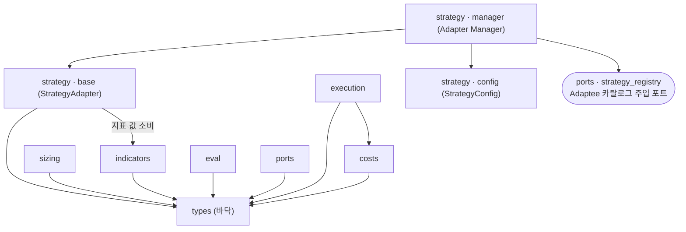
```mermaid
flowchart TD
    TYPES["types (바닥)"]
    IND["indicators"]
    SIZ["sizing"]
    CST["costs"]
    EVAL["eval"]
    PORT["ports"]
    STRAT["strategy · base (StrategyAdapter)"]
    EXE["execution"]
    MGR["strategy · manager (Adapter Manager)"]
    CFG["strategy · config (StrategyConfig)"]
    REG(["ports · strategy_registry<br/>Adaptee 카탈로그 주입 포트"])

    IND --> TYPES
    SIZ --> TYPES
    CST --> TYPES
    EVAL --> TYPES
    PORT --> TYPES
    STRAT --> TYPES
    STRAT -->|지표 값 소비| IND
    EXE --> TYPES
    EXE --> CST
    MGR --> STRAT
    MGR --> CFG
    MGR --> REG
```

## §2.2 `backtest-service` 트리 (신규 서비스)

이 서비스는 `core_lib.ports`의 ABC 하나하나에 대해 그 backtest용 구현(어댑터)을 채운다. `adapters/` 아래 파일명이
`core_lib/ports/` 쪽과 겹치는 것은, 같은 관심사를 추상(ABC)과 구현(어댑터) 두 자리에서 부르기 때문이라 일부러 맞춰
둔 것이다.

```text
services/backtest-service/
  pyproject.toml                     # 패키지 정의; core-lib를 의존성으로(editable 설치)
  backtest_service/
    __init__.py                      # 패키지 진입점
    config/                          # [컴포넌트] ConfigLayer — 백테스트 run 설정
      run_config.py                  #   run 설정 pydantic 스키마·검증(OHLCV·funding 소스/구간, CostModel 값, 거래소 규칙, 실행/리스크, 파라미터 sweep, 지표 계산 모드, 프로파일 선택); 전략 스키마·검증은 제외(core_lib.StrategyConfig 소관)
    engine/                          # [컴포넌트] Engine — 결정적 실행 드라이버·입출력 오케스트레이터
      engine.py                      #   캔들 루프·look-ahead 순서·데이터 피드 push·체결·저장·eval 호출; Adapter Manager로 Adaptee 생성 (캔들 루프·집행 시퀀스는 §4.4)
    adapters/                        # [컴포넌트×7] core_lib.ports ABC의 backtest 구현(어댑터) — 표준 6종 + strategy_registry = 7 구현; 목록 완결성·시그니처·구현 계약은 §3.2에서 확정
      data_feed.py                   #   DataFeed 구현: crypto_data 과거 OHLCV·funding 공급, up_to 이후 캔들 미노출
      broker.py                      #   Broker 구현: 결정적 시뮬 체결 + CostModel; core_lib.execution.normalizer(공유)를 통과 — 어댑터 자체 캐스팅 없음
      clock.py                       #   Clock 구현: 시뮬 캔들 시각(결정적, wall-clock 금지)
      cost_model.py                  #   CostModel 구현: 보수적 주입값·과거 실측 펀딩 rate
      evidence_sink.py               #   EvidenceSink 구현: run별 SQLite 상세 기록
      catalog_store.py               #   CatalogStore 구현: backtest_db 카탈로그 메타 기록·조회
      strategy_registry.py           #   strategy_registry 구현: signal_db Adaptee 카탈로그 등록·조회(backtest 측 주입 어댑터)
    harness/                         # [컴포넌트] Harness — 단일 run 밖 상위 검증 오케스트레이션
      harness.py                     #   표본 내/외 분리·워크포워드·몬테카를로·확률적 샤프·파라미터 스윕(카탈로그 비교)
  tests/                             # 패키지 테스트 스캐폴드
    test_broker_normalizer_conformance.py  #   모든 Broker 어댑터가 core_lib.execution.normalizer를 통과하는지 검사(Decimal 단일 캐스트 우회 방지)
    # + 포트 어댑터·Engine 루프·결정성 테스트
```

`Engine`은 도메인 로직을 `core_lib`에서만 가져오고(다른 서비스는 import하지 않음), 데이터 읽기·체결·저장·시계는
전부 `adapters/`의 포트 구현에 맡긴다. 전략 판단·지표·사이징·비용·실행 규칙은 이 서비스에 두지 않는다 — 모두
`core_lib`을 호출해서 쓴다.

## §2.3 배포 루트 (DB 초기화)

`backtest_db`를 만들고 역할을 세우는 일은 서비스 패키지 안이 아니라 monorepo의 배포 루트에서 한다. 그 자리는
`services/`와 형제인 `init-scripts/`이며, 기존 서비스별 마이그레이션 미러 구조를 그대로 따른다. 실제 테이블·Entity
스키마는 데이터베이스 설계(§5)가 ERD로 확정하고, 여기서는 디렉터리·역할 배치와 파일 번호 규약만 고정한다.

```text
(새 프로젝트 루트)
  services/
    core-lib/                        # §2.1
    backtest-service/                # §2.2
  init-scripts/                      # 배포 루트 — DB·역할 초기화(services/ 와 형제)
    NN-init-backtest-db.sql          #   backtest_db·backtest_writer 유지 계승 + 읽기 전용 backtest_reader 역할 신설; 파일 번호는 구현 시점 라이브 루트 실제 최고 번호 다음(현재 기준 04-…)
    backtest-service/                #   backtest_db meta 스키마 마이그레이션(기존 per-service 미러 구조; 테이블·필드는 §5.2)
```

---

# §3 컴포넌트 다이어그램 + 정의서 (서비스별)

이 절은 §1의 서비스와 §2의 코드 트리를 컴포넌트 층위로 내린다. 서비스마다 다이어그램을 하나씩 두고, 여러
서비스를 한 다이어그램에 섞지 않는다. 공유 계층 `core-lib`의 컴포넌트는 §3.1에서 한 번만 정의하고,
`backtest-service`(§3.2)와 채택 후 서비스(§3.3)는 이를 **다시 그리지 않고 참조**한다(참조 노드에 `§3.1 정의`를
붙인다). 다이어그램이 컴포넌트·인터페이스 경계·의존 방향(화살표)을 담고, 문장은 다이어그램이 담지 못하는 것 —
각 컴포넌트의 책임과, 소비 서비스가 `core_lib`의 무엇을 어디서 쓰는지 — 만 보탠다. 클래스·시그니처·필드는 이
절의 범위가 아니라 §4·§5가 각 컴포넌트 아래에 매단다.

## §3.1 core-lib 컴포넌트 (공유)

`core-lib`는 세 실행 모드가 공유하는 도메인 표준의 유일한 구현처다. 열 개 컴포넌트로 이뤄지며, 여기서 한 번
정의해 모든 소비자가 참조한다. 아래 다이어그램이 열 컴포넌트와 그 내부 의존 방향을 담는다 — `types`가 바닥이고,
화살표는 "참조한다(의존)"를 뜻하며 역방향은 없다. `strategy/adaptees/`의 구현 전략(Adaptee)은 플랫폼 컴포넌트가
아니라 참조 플러그인이므로 이 뷰에 컴포넌트로 등장하지 않는다 — 플랫폼은 전략을 끼우는 계약(`StrategyAdapter`)만
그린다. `ports`·`eval`은 `types`만 참조하는 잎이다. `eval`과 여섯 환경 포트(`DataFeed`·`Broker`·`Clock`·
`CostModel`·`EvidenceSink`·`CatalogStore`)의 소비자는 서비스 계층(Engine 등)이라 이 내부 뷰가 아니라 §3.2·§3.3의
소비 화살표에 나타나지만, 일곱 번째 포트인 `StrategyRegistry`(Adaptee 카탈로그 주입 포트)만은 `Adapter Manager`가
core_lib 안에서 소비하므로 아래 다이어그램에 내부 엣지(`Adapter Manager` → `ports`)로 나타난다.

core-lib 내부 컴포넌트와 의존 방향.

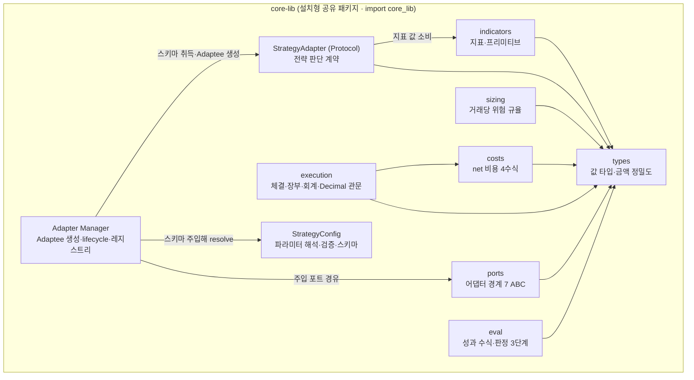
```mermaid
flowchart TD
    subgraph CORELIB["core-lib (설치형 공유 패키지 · import core_lib)"]
        TYPES["types<br/>값 타입·금액 정밀도"]
        IND["indicators<br/>지표·프리미티브"]
        STRAT["StrategyAdapter (Protocol)<br/>전략 판단 계약"]
        SIZ["sizing<br/>거래당 위험 규율"]
        CST["costs<br/>net 비용 4수식"]
        EXE["execution<br/>체결·장부·회계·Decimal 관문"]
        PORT["ports<br/>어댑터 경계 7 ABC"]
        EVAL["eval<br/>성과 수식·판정 3단계"]
        MGR["Adapter Manager<br/>Adaptee 생성·lifecycle·레지스트리"]
        CFG["StrategyConfig<br/>파라미터 해석·검증·스키마"]
    end
    IND --> TYPES
    STRAT --> TYPES
    STRAT -->|지표 값 소비| IND
    SIZ --> TYPES
    CST --> TYPES
    EXE --> TYPES
    EXE --> CST
    PORT --> TYPES
    EVAL --> TYPES
    MGR -->|스키마 취득·Adaptee 생성| STRAT
    MGR -->|스키마 주입해 resolve| CFG
    MGR -->|주입 포트 경유| PORT
```

의존 방향은 다이어그램이 담으므로, 정의서는 각 컴포넌트의 **책임**과 **인터페이스 경계**(공개 표면과 하지 않는
것), 그리고 그것을 이루는 §2 트리 파일만 적는다. 인터페이스의 정확한 시그니처·필드·수식·임계값 수치는 §4가
확정한다.

| 컴포넌트 | 책임 | 인터페이스 경계 (공개 표면 · 하지 않음) | 구성 (§2 트리) |
|---|---|---|---|
| `types` | 세 실행 모드가 공유하는 값 타입·금액 정밀도의 유일한 정의처 | 공개: `Candle`·`TradingSignal`(판단 전용, 수량·방향 필드 없음)·`Order`·`Position`·`Trade`(`r0` 포함)·`Fill`·enums·`money`(ZERO·Q_*·quantize_*). 하지 않음: 계산·IO 없음; 캔들 검증(한 캔들 내부 `high ≥ max(open,close)`·`low ≤ min(open,close)`는 타입 계층, 시계열 단조는 적재 층이 강제) | `types/`의 candle·signal·order·position·trade·fill·enums·money |
| `indicators` | 공용 프리미티브 + 지표 표준(벡터화·증분 두 계산 방식). 계약은 등록된 지표를 **공통 방식으로 관리**하는 것이며 지표 개수가 아니다(목록·단위는 §4.1) | 공개: `registry.get(name, params)`·`compute_batch(candles, enabled_set)`·`IndicatorState.update(candle)`·`contracts.assert_finalized`. 하지 않음: 확정 캔들만 입력(`close_time ≤ 판단 시각`); 계산은 float64(Decimal 변환은 `execution` 관문 소관); 계산 대상은 run 설정이 결정 | `indicators/`의 primitives·지표군 9파일·donchian·registry·contracts |
| `StrategyAdapter` | 전략을 끼우는 판단 계약(Strategy 패턴)의 선언 | 공개: `StrategyAdapter`(`typing.Protocol`) — `get_metadata()`·`get_parameter_schema()`·`analyze(market_data, position?) → TradingSignal`; metadata에 `required_indicators`·`min_history`·`timeframe`·프로파일 선언. 하지 않음: 판단만(읽기·저장·루프 없음); Adaptee는 stateless; 미래 데이터 자가 인출 없음(look-ahead는 Engine 피드 경계가 통제); 파라미터 스키마는 선언만(해석은 `StrategyConfig`); 진입·청산 엣지는 각 Adaptee 소유(범위 밖); 트레일링은 순수 함수 호출(상속 아님·유보) | `strategy/base.py`·`profile.py`·`trailing/`(유보) |
| `sizing` | 거래당 위험 규율과 사이징 인스턴스 | 공개: `risk_money.size(equity, stop_distance, risk_per_trade ≤ 1%)`·`turtle_unit`·`wallet_pct.size`(호환)·`kelly.cap`. 하지 않음: 엣지 창조 없음(엣지는 진입 신호); `1R = |체결가 − 최초 보호 스탑| × 수량`이고 `1R ≤ 1%`; pct 경로는 보장 실패 시 비준수 플래그 의무 | `sizing/`의 risk_money·turtle_unit·wallet_pct·kelly |
| `costs` | net 손익 4개 비용 수식 표준(값은 주입) | 공개: `fee.calc`·`slippage.apply`·`funding.settle`·`liquidation.price/is_triggered`. 하지 않음: 비용 값 미보유(전량 `CostModel` 주입); 펀딩은 이산 정산(UTC 경계, 정산가 = 경계 포함 최소 가용 TF 캔들 시가); 청산은 Isolated 우선·보수 방향 | `costs/`의 fee·slippage·funding·liquidation |
| `execution` | 주문 라이프사이클·결정적 체결·포지션 장부·회계 + Decimal 단일 변환 관문 | 공개: `order_lifecycle`(VALID_TRANSITIONS)·`matcher`(체결 규칙)·`position_book`·`accounting.recompute`·`normalizer`. 하지 않음: `cash + position = equity` 유지·비용 1회 차감; float→Decimal 단일 변환은 `normalizer` 한 곳에서만(모든 Broker 어댑터가 `submit()`에서 통과, 어댑터별 캐스팅 금지); `decision_ts < execution_ts` 강제 | `execution/`의 order_lifecycle·matcher·position_book·accounting·normalizer |
| `ports` | 환경별 관심사의 어댑터 경계(전부 ABC, 구현은 서비스 주입) | 공개: 7 ABC — `DataFeed`·`Broker`·`Clock`·`CostModel`·`EvidenceSink`·`CatalogStore`·`StrategyRegistry`. 하지 않음: 추상 계약만 선언(`types`만 참조, `execution` 미참조); wall-clock·네트워크·파일 IO는 구현 어댑터 안에만; 특정 DB 직접 의존 없음(레지스트리도 주입 포트) | `ports/`의 7파일 |
| `eval` | 성과 수식 표준 1곳 + 판정 3단계 | 공개: `metrics`·`integrity.check`·`hard_gate.judge`·`profile.check_envelope`·`decision.decide`·`thresholds`. 하지 않음: 판정 순서는 무결성 → Hard Gate → Decision 고정; 통과선은 한 곳 구현(수식·임계값 수치는 §4가 확정); 프로파일은 established 회귀만 reject | `eval/`의 metrics·integrity·hard_gate·decision·thresholds·profile |
| `Adapter Manager` | Adaptee 생성(Factory)·lifecycle + 구현 목록 레지스트리 | 공개: `create(strategy_id, raw_config) → StrategyAdapter`(내부에서 `StrategyConfig` 해석 호출)·lifecycle·`registry.list()/register()`. 하지 않음: 전략 결정 로직·파라미터 검증 로직 미보유(각각 Adaptee·`StrategyConfig`); 레지스트리 DB 접근은 주입 포트로만(core-lib은 특정 DB 직접 의존 없음) | `strategy/manager.py`·`registry.py`·`factory.py` |
| `StrategyConfig` | 전략 파라미터 config의 해석·검증·직렬화·스키마 노출 | 공개: `resolve(schema, raw_config) → ResolvedConfig`·`json_schema(schema)`·`serialize/version`(스키마를 값으로 받아 무순환; 정확한 시그니처는 §4.2). 하지 않음: 스키마 선언은 Adaptee 소유(여기서 재정의 금지); 값은 호출자 소유(소스 미보유); 파라미터 스윕·실행 설정은 범위 밖(`ConfigLayer`) | `strategy/config.py` |

유보한 것과 표준에 더한 파일만 따로 정리한다.

- **구현 전략·트레일링은 유보(지금 만들지 않음).** `strategy/adaptees/`의 구현 전략과 `strategy/trailing/`은 지금은
  두지 않는다. 첫 검증 전략은 트레일링 없이 ATR 기반 고정 손절·익절로 만든다.
- **트레일링 재도입 시.** 트레일링을 쓰는 전략이 들어올 때 `trailing`을 하나의 표준 계산기로 되살리고, 두 구현의
  결과가 같은지(파리티) 확인한다. 표준 자리는 트리에 남아 있고, 컴포넌트 계약은 바뀌지 않는다.
- **`execution/normalizer` — 표준에 더한 파일.** float→Decimal 변환을 한 곳에 모은다.
- **`ports/StrategyRegistry` — 표준에 더한 파일.** 전략(Adaptee) 목록 접근을 주입 포트로 분리해, `core_lib`이 특정
  DB에 직접 묶이지 않게 한다.

## §3.2 backtest-service 컴포넌트

`backtest-service`는 새로 개발하는 유일한 실행 드라이버 서비스다. 전략 판단·지표·사이징·비용·실행 같은 도메인
로직은 전부 `core_lib`에서만 가져오고, 다른 서비스(`signal-service`·`wallet-service`)는 import하지 않는다 — pandas
같은 범용 라이브러리는 자유롭게 쓴다(제약은 도메인 로직의 출처가 `core_lib` 하나라는 뜻이다). 세 자체 컴포넌트
(`ConfigLayer`·`Engine`·`Harness`)와, `core_lib.ports`의 각 ABC를 실체화한 backtest 어댑터로 이뤄진다.

읽는 방법:
- 다이어그램 — 이 서비스의 컴포넌트, `core_lib` 소비 지점, 어댑터의 포트 ABC 구현 관계.
- `core_lib` 컴포넌트 정의 — §3.1(다이어그램에서는 소비 대상 참조 노드로만 등장).
- 저장소 접근(어느 어댑터가 어느 저장소를 읽고 쓰는지) — §1.1 서비스 다이어그램과 아래 어댑터 표의 `저장소 접근` 열(컴포넌트 다이어그램에서는 생략).

backtest-service 컴포넌트와 core_lib 소비·포트 구현.

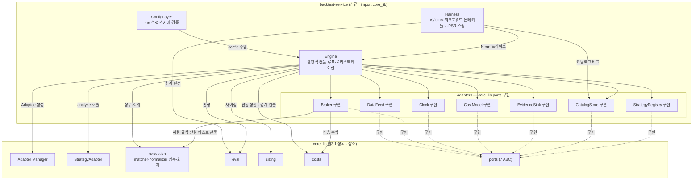
```mermaid
flowchart TD
    subgraph BTS["backtest-service (신규 · import core_lib)"]
        CFGL["ConfigLayer<br/>run 설정 스키마·검증"]
        ENG["Engine<br/>결정적 캔들 루프·오케스트레이션"]
        HAR["Harness<br/>IS/OOS·워크포워드·몬테카를로·PSR·스윕"]
        subgraph ADP["adapters — core_lib.ports 구현"]
            DF["DataFeed 구현"]
            BR["Broker 구현"]
            CL["Clock 구현"]
            CM["CostModel 구현"]
            ES["EvidenceSink 구현"]
            CS["CatalogStore 구현"]
            SR["StrategyRegistry 구현"]
        end
    end
    subgraph CLREF["core_lib (§3.1 정의 · 참조)"]
        RMGR["Adapter Manager"]
        RSTR["StrategyAdapter"]
        REXE["execution<br/>matcher·normalizer·장부·회계"]
        REVAL["eval"]
        RSIZ["sizing"]
        RCST["costs"]
        RPORT["ports (7 ABC)"]
    end

    CFGL -->|config 주입| ENG
    HAR -->|N run 드라이브| ENG
    HAR -->|카탈로그 비교| CS
    HAR -->|집계 판정| REVAL
    ENG --> DF
    ENG --> BR
    ENG --> CL
    ENG --> CM
    ENG --> ES
    ENG --> CS
    ENG --> SR
    ENG -->|Adaptee 생성| RMGR
    ENG -->|analyze 호출| RSTR
    ENG -->|사이징| RSIZ
    ENG -->|판정| REVAL
    ENG -->|장부·회계| REXE
    ENG -->|펀딩 정산 · 경계 캔들| RCST
    BR -->|체결 규칙·단일 캐스트 관문| REXE
    BR -->|비용 수식| RCST
    DF -.->|구현| RPORT
    BR -.->|구현| RPORT
    CL -.->|구현| RPORT
    CM -.->|구현| RPORT
    ES -.->|구현| RPORT
    CS -.->|구현| RPORT
    SR -.->|구현| RPORT
```

세 자체 컴포넌트의 책임과 `core_lib` 소비 지점은 다음과 같다. 의존은 다이어그램이 담으므로 문장은 반복하지 않는다.

| 컴포넌트 | 책임 | core_lib 소비 지점 | 구성 (§2 트리) |
|---|---|---|---|
| `ConfigLayer` | 백테스트 run 설정(OHLCV·funding 소스/구간·`CostModel` 값·거래소 규칙·실행/리스크·파라미터 스윕·지표 계산 모드·프로파일 선택)의 pydantic 스키마·검증 후 Engine 주입 | 전략 파라미터 스키마·검증은 소유하지 않고 선택값(전략 id·파라미터 값·symbol·timeframe)만 담아 `Adapter Manager`로 넘긴다 — 해석·검증은 `StrategyConfig` 소관(같은 config가 backtest·라이브에서 동일 검증) | `config/run_config.py` |
| `Engine` | 도메인 로직을 `core_lib`에서만 가져오는(다른 서비스 import 안 함) 결정적 캔들 루프·입출력 오케스트레이터: 사전등록·run_id 발급·워밍업 preload·피드 push·체결·2계층 저장·finalize·eval 호출; 워밍업 구간 신호 discard, 동일 입력·seed → 동일 Evidence | `Adapter Manager`로 Adaptee 생성, `StrategyAdapter`의 `analyze` 호출, `sizing`으로 수량 산정, `execution`으로 포지션 장부·회계, `costs.funding.settle`로 경계 펀딩 정산, `eval`로 판정; 데이터·체결·시계·기록은 전부 포트 어댑터 경유하고, 비용도 값(rate·fallback)은 CostModel·DataFeed 포트에서 받되 정산 수식 `costs`는 Engine이 직접 호출한다(체결 규칙 자체는 Broker 어댑터가 `execution.matcher` 소비) | `engine/engine.py` |
| `Harness` | 단일 run 밖 상위 검증(표본 내/외 분리·워크포워드·몬테카를로·확률적 샤프·파라미터 스윕) 오케스트레이션, 카탈로그로 run 집합 비교 | `eval`로 집계 판정, `CatalogStore` 어댑터로 `backtest_db` 읽기; 개별 run 구동은 `Engine` 재사용(스윕 run_id는 Engine이 카탈로그 시퀀스로 단독 발급) | `harness/harness.py` |

**포트 목록 확정 (7종).** 무엇을 포트로 뺄지 표준은 미리 정하지 않았다. 그 목록을 여기서 확정한다.

- **포트 선정 기준** — 환경(백테스트·페이퍼·라이브)에 따라 값이나 방식이 달라지는 것만 포트로 선정한다(데이터 출처·체결·시계·비용값·기록 위치 등).
- **포트 밖(`core_lib`)에 남는 것** — 환경과 무관한 순수 판단·계산 로직: 전략 판단·지표·사이징·비용 수식·체결 규칙·평가.
- **목록은 일곱으로 고정** — 표준 포트 여섯(`DataFeed`·`Broker`·`Clock`·`CostModel`·`EvidenceSink`·`CatalogStore`)개와  전략(Adaptee) 목록 접근 포트 `StrategyRegistry`를 더해 일곱. 더 늘리지 않는다.
- **아래 표가 정하는 것** — 각 backtest 어댑터가 구현할 포트(ABC)·구체 동작·`core_lib` 소비·저장소 접근.
- **라이브·페이퍼 쪽** — 같은 포트(ABC)의 반대편 구현은 각 서비스가 가진다(§3.3). 단 `CatalogStore`는 백테스트
  전용이라 라이브 구현이 없다.

| 어댑터 (backtest 구현)   | 구현하는 포트 ABC        | 구체 동작                                                                                                                                                                                                                                                            | core_lib 소비                                            | 저장소 접근                      |
| ------------------- | ------------------ | ---------------------------------------------------------------------------------------------------------------------------------------------------------------------------------------------------------------------------------------------------------------- | ------------------------------------------------------ | --------------------------- |
| DataFeed 구현         | `DataFeed`         | 과거 확정 OHLCV·funding·mark_price를 **전략 TF 캔들**로 공급, `up_to` 경계 이후 캔들 미노출(look-ahead 구조 배제). 1분 하위 집행 피드는 유보되어 이 어댑터 표면은 전략 TF 캔들 기준이며, 1분 트리거 walk·트레일링 파리티 편차는 Engine 설계(§4.4)에서 확정하되 소비 전략이 없어 재유보                                                               | `ports.DataFeed`·`types.Candle`                        | `crypto_data` 읽기(백테스트 미기록)  |
| Broker 구현           | `Broker`           | 결정적 시뮬 체결(다음 캔들 시가 기본·intrabar 트리거·캔들 내 손절·익절 동시 도달 시 손절 우선 OHLC-locked·갭·수량 절삭) + `CostModel` 적용. `submit()`은 `core_lib.execution.normalizer`(공유)를 통과해 float→Decimal 단일 변환 — 어댑터 자체 캐스팅 없음                                                                      | `ports.Broker`·`execution`(matcher·normalizer)·`costs` | —                           |
| Clock 구현            | `Clock`            | 시뮬 캔들 시각 공급(결정적, wall-clock 금지)                                                                                                                                                                                                                                  | `ports.Clock`                                          | —                           |
| CostModel 구현        | `CostModel`        | 보수적 주입 시작 기본값 공급(수수료·유지증거금률·펀딩 정산 간격·펀딩 fallback·pct 사이징 등 — 구체 수치는 CostModel 클래스가 정본, §4.3); 슬리피지는 호환 bps 기본이되 표준 경로는 스프레드 절반 + 충격 스트레스. 부과 규칙·fallback rate만 소유(실측 rate는 미소유) | `ports.CostModel`                                      | 없음(펀딩 실측 rate는 DataFeed 소유) |
| EvidenceSink 구현     | `EvidenceSink`     | run별 SQLite에 캔들 신호·주문·체결·포지션·손익·지표 스냅샷 상세 기록·finalize; 결정성 해시는 정렬 행의 정규화 직렬화(파일 바이트 아님·wall-clock 제외)                                                                                                                                                            | `ports.EvidenceSink`                                   | Evidence SQLite 쓰기          |
| CatalogStore 구현     | `CatalogStore`     | `backtest_db`에 run 요약·카탈로그·사전등록·태그 meta 기록·조회; run_id를 카탈로그 시퀀스로 단독 발급                                                                                                                                                                                           | `ports.CatalogStore`                                   | `backtest_db` 쓰기·읽기         |
| StrategyRegistry 구현 | `StrategyRegistry` | `signal_db`의 Adaptee 구현 카탈로그 조회(backtest는 목록 읽기만; 등록·쓰기는 signal-service 몫) — `Adapter Manager`가 이 포트로 목록을 다룬다                                                                                                                                                                         | `ports.StrategyRegistry`                               | `signal_db` 조회(읽기)    |

**`CostModel` 값에 관하여.**

- **시작 기본값의 출처** — legacy에서 코드가 아니라 숫자값만 가져온 시작 기본값이다. run 설정으로 덮어쓸 수 있다.
- **슬리피지 기본값(호환)** — 가격에 고정 비율(bps)을 곱해 매기는 방식이다.
- **슬리피지 표준 목표** — 호가 스프레드의 절반에, 주문량·유동성에 따른 충격을 더한 모델(왕복 기준 0.1~0.3%). 정확한
  수식은 §4에서 확정한다.

**펀딩 rate는 두 어댑터가 나눠 맡는다.**

- **`DataFeed` 어댑터** — 과거 실측 펀딩 시계열을 `crypto_data`에서 가져와 공급한다(실측값 소유).
- **`CostModel` 어댑터** — 부과 규칙과 대체값(fallback rate `0.0001`)만 가진다.
- **연결 방식** — 펀딩 정산 시점(경계 캔들)에 Engine이 `DataFeed`의 실측 rate를 `costs`의 정산에 넘긴다. 어댑터끼리
  직접 부르지 않는다(포트 간 결합 없음). 실측값이 없을 때만 `CostModel`의 대체값을 쓴다.

## §3.3 채택 컴포넌트 (signal·wallet)

유지 서비스인 `signal-service`·`wallet-service`가 `core_lib`를 채택한 뒤의 모습을 그린다. 두 서비스의 내부 지표·
전략·실행·비용·사이징 구현을 `core_lib` import로 바꾼 상태이고, 현행 코드는 "무엇을 무엇으로 바꾸는지" 짚기
위해서만 인용한다. 여기는 설계이고, 실제 교체는 채택 단계(부록)에서 한다. 서비스마다 다이어그램을 하나씩 둔다.

채택의 효과는 서비스의 **어느 부분이냐에 따라 다르다.**

- **signal 쪽(지표·`analyze`)** — 계산 결과가 그대로다(동작 보존). 옛 값과 `core_lib` 값이 같은지 동등성 검사로 확인한다.
- **wallet 쪽(회계·손익·체결)** — `core_lib`가 새 구현이라 계산값이 바뀐다(정확도 교정). 거래소 실측과 맞춰 골든
  기준선을 다시 잡는다.

그래서 "기존 회귀 테스트가 그대로 통과 = 동작 그대로"는 signal 지표 쪽에서만 맞고, wallet 회계 쪽에서는 아니다.

**두 서비스 공통** — 각자 live/paper 포트 어댑터(같은 포트 계약의 반대편 구현)를 서비스 안에 두고, 구 import
경로에는 re-export shim(옛 경로를 새 위치로 다시 내보내는 얇은 호환 층)을 남겨 무중단으로 채택한다.

### §3.3.1 signal-service (채택 후)

signal-service 채택 후 컴포넌트와 core_lib 소비.

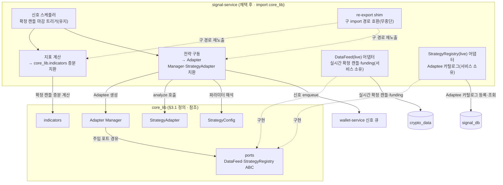
```mermaid
flowchart TD
    subgraph SS["signal-service (채택 후 · import core_lib)"]
        SCHED["신호 스케줄러<br/>확정 캔들 마감 트리거(유지)"]
        SIND["지표 계산<br/>→ core_lib.indicators 증분 치환"]
        SSTR["전략 구동<br/>→ Adapter Manager·StrategyAdapter 치환"]
        SFEED["DataFeed(live) 어댑터<br/>실시간 확정 캔들·funding(서비스 소유)"]
        SREG["StrategyRegistry(live) 어댑터<br/>Adaptee 카탈로그(서비스 소유)"]
        SHIM["re-export shim<br/>구 import 경로 호환(무중단)"]
    end
    subgraph CLREF["core_lib (§3.1 정의 · 참조)"]
        RIND["indicators"]
        RMGR["Adapter Manager"]
        RSTR["StrategyAdapter"]
        RCFG["StrategyConfig"]
        RPORT["ports<br/>DataFeed·StrategyRegistry ABC"]
    end
    CD[("crypto_data")]
    SDB[("signal_db")]
    WQ["wallet-service 신호 큐"]

    SCHED --> SIND
    SCHED --> SSTR
    SIND -->|확정 캔들 증분 계산| RIND
    SSTR -->|Adaptee 생성| RMGR
    SSTR -->|analyze 호출| RSTR
    SSTR -->|파라미터 해석| RCFG
    RMGR -->|주입 포트 경유| RPORT
    SFEED -.->|구현| RPORT
    SREG -.->|구현| RPORT
    SFEED -->|실시간 확정 캔들·funding| CD
    SREG -->|Adaptee 카탈로그 등록·조회| SDB
    SSTR -->|신호 enqueue| WQ
    SHIM -.->|구 경로 재노출| SIND
    SHIM -.->|구 경로 재노출| SSTR
```

바꾸는 것은 둘이고, 둘 다 계산 결과는 그대로다(동작 보존).

| 대상 | 현행 | `core_lib`로 바꾼 뒤 | 확인 |
|---|---|---|---|
| 지표 계산 | collector가 미리 계산한 값을 `technical_indicators` 테이블에서 읽음 | `core_lib.indicators`가 캔들 마감마다 직접 증분 계산(O(1)) | 옛 값 = 새 값(허용오차 내) |
| 전략 구동 | `StrategyFactory`·`registry.py` 수동 등록·`AbstractStrategy` 상속 | `Adapter Manager`(생성)·`StrategyAdapter`(`analyze`)·`StrategyConfig`(파라미터 해석) | 분당 폴링 제거, 전략 타임프레임 캔들 마감마다 판단 |

- **그대로 두는 것** — 신호 스케줄러, 서비스 소유 live DataFeed·StrategyRegistry 어댑터. `Adapter Manager`는 주입
  포트로만 카탈로그에 접근하므로 `core_lib`이 `signal_db`에 직접 묶이지 않는다.
- **유보·기타** — 트레일링은 쓰는 전략이 없어 유보. 구 import 경로엔 re-export shim(무중단). 외부 collector는 리포
  내부 OHLCV 수집기로 옮겨 적재만 맡는다(지표 계산 역할 폐지).

### §3.3.2 wallet-service (채택 후)

wallet-service 채택 후 컴포넌트와 core_lib 소비.

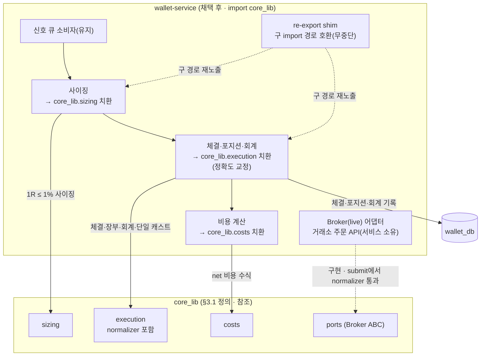
```mermaid
flowchart TD
    subgraph WS["wallet-service (채택 후 · import core_lib)"]
        QCON["신호 큐 소비자(유지)"]
        WSIZE["사이징<br/>→ core_lib.sizing 치환"]
        WEXE["체결·포지션·회계<br/>→ core_lib.execution 치환(정확도 교정)"]
        WCOST["비용 계산<br/>→ core_lib.costs 치환"]
        WBRK["Broker(live) 어댑터<br/>거래소 주문 API(서비스 소유)"]
        WSHIM["re-export shim<br/>구 import 경로 호환(무중단)"]
    end
    subgraph CLREF["core_lib (§3.1 정의 · 참조)"]
        RSIZ["sizing"]
        REXE["execution<br/>normalizer 포함"]
        RCST["costs"]
        RPORT["ports (Broker ABC)"]
    end
    WDB[("wallet_db")]

    QCON --> WSIZE
    WSIZE --> WEXE
    WEXE --> WCOST
    WSIZE -->|1R ≤ 1% 사이징| RSIZ
    WEXE -->|체결·장부·회계·단일 캐스트| REXE
    WCOST -->|net 비용 수식| RCST
    WBRK -.->|구현 · submit에서 normalizer 통과| RPORT
    WEXE -->|체결·포지션·회계 기록| WDB
    WSHIM -.->|구 경로 재노출| WEXE
    WSHIM -.->|구 경로 재노출| WSIZE
```

바꾸는 것은 한 묶음이다 — 체결·포지션·회계·비용·사이징. `core_lib`이 새 구현이라 계산값이 바뀐다(정확도 교정).

| 대상 | 현행 | `core_lib`로 바꾼 뒤 |
|---|---|---|
| 체결·포지션·회계·비용·사이징 | wallet 자체 구현(`futures_paper_trading_service.py`·`futures_calculator.py`·`slippage_calculator.py`) | `core_lib`의 `execution`·`costs`·`sizing` import |

계산값이 바뀌므로 **해야 할 것**:

- **골든 재수립** — 거래소 실측과 맞춘 정확성이 통과 기준. 회귀 약 1279건 재검증(트레일링·폴링 45건은 유보).
- **무결성 검사** — 회계 항등식 `cash + position = equity`·비용 1회 차감·net-of-cost로 라이브 손익 불일치 재발 차단.
- **체결 시점 전환** — `fill_timing` 기본값을 즉시(immediate)에서 다음 캔들 시가(next_bar)로 바꿔 `decision_ts < execution_ts` 준수.

그 밖에:

- **그대로 두는 것** — 신호 큐 소비자, 서비스 소유 live Broker 어댑터(`submit()`은 `core_lib.execution.normalizer`
  통과), `wallet_db`. 큐·폴링·HTTP·WebSocket 등 라이브 인프라도 wallet에 그대로 둔다.
- **유보·기타** — wall-clock 즉시 체결(`filled_at = now()`)은 `Clock` 포트·`fill_timing`으로 대체. 구 import 경로엔
  re-export shim. 트레일링은 유보(현행 wallet 3곳 중복은 재도입 시 하나로 합침).

---

# §4 클래스 다이어그램 + 정의서 (컴포넌트별)

이 절은 §3의 컴포넌트를 클래스 층위로 내린다. 컴포넌트마다 클래스 다이어그램을 하나씩 둔다. **한 클래스의 구조는
전부 그 클래스 다이어그램이 담는다** — 클래스와 그 속성·타입, 메서드 시그니처(인자·반환), 관계(상속·합성·의존),
스테레오타입까지 다이어그램에 있다. 그래서 **어떤 클래스의 전체 필드(속성) 목록은 그 다이어그램이 정본**이다.
정의서는 다이어그램이 담지 못하는 잔여만 보탠다 — 속성의 제약·기본값·NULL 허용·검증, 메서드의 의미, 클래스의
책임, 그 클래스가 강제하는 불변식이 그 잔여다. 따라서 정의서의 '필드' 항목은 속성 목록이 아니라 그중 부연이 필요한
것만 적은 것이니, 한 클래스에 무슨 속성이 있는지는 그 클래스 다이어그램을 봐야 한다(예: `Candle`의 시가·종가·시각
필드는 정의서가 아니라 §4.1.1 `Candle` 다이어그램에 있다).

**의존 화살표를 그리는 기준.** 화살표는 시그니처만으로는 드러나지 않는 관계 — 내부 호출·주입·위임, 상속·합성,
공통 유틸 의존(예: `money`의 자릿수 반올림) — 만 그린다. 어떤 타입이 메서드의 **파라미터나 반환**으로 이미 시그니처에
적혀 있으면 그 의존은 화살표로 겹쳐 긋지 않는다(다이어그램이 같은 말을 두 번 하지 않게 한다). 그래서 어떤
다이어그램은 화살표가 적거나 없을 수 있는데, 이는 관계가 없어서가 아니라 시그니처가 이미 담고 있어서다.

**클래스 정의서의 항목 표준.** 모든 클래스 정의서는 아래 여섯 항목을 이 순서로 **모두** 둔다. 해당 내용이 없으면
그 항목을 빼지 않고 **"없음"**으로 적는다 — 항목이 보이지 않을 때 그것이 부재인지 누락인지 독자가 구분할 수
있게 하기 위해서다(예: 순수 모듈은 필드 "없음", 독립 값 타입은 상속관계 "없음").

- **개요** — 한 줄로 "무엇인가".
- **책임** — 무엇을 소유·수행하고 무엇을 하지 않는가(경계), 그리고 왜 이 설계인가.
- **상속관계** — 구현·실현·추상 관계(Protocol 구현, ABC 등). 없으면 "없음".
- **필드** — 속성 목록이 아니라 잔여다. 전체 속성·타입은 다이어그램이 담고, 여기서는 그 속성들의 제약·기본값·NULL
  허용·검증만 보탠다. 다이어그램에 속성이 있어도 덧붙일 잔여가 없으면 그 속성은 여기 적지 않는다. 속성이 없으면 "없음".
- **메서드** — 각 메서드를 한 줄에 하나씩 하위 항목으로 `` `이름` : 설명 `` 형태로 적는다(여러 이름을 한 줄에
  몰아넣지 않는다). 메서드가 없으면 "없음".
- **불변식** — 이 클래스가 강제·보존하는 불변식. 지킬 것이 없으면 "없음".

ENUM은 값이 아니라 멤버 목록이 본질이라 이 표준을 따르지 않고, 한 줄 요약 + 멤버(뜻 포함) + (있으면) 판별
메서드로 쓴다. 시퀀스·플로우는 별도 장이 아니라 그 행위를 소유한 클래스 정의서 안에 둔다.

이 절이 확정하는 것은 공유 라이브러리 `core-lib`의 클래스이고, 세 묶음으로 나뉜다.

- **§4.1 기반** — 세 실행 모드가 공유하는 값 타입(`types`)과 지표 계산 표준(`indicators`). 의존 그래프의
  바닥이라 나머지 묶음이 모두 이 위에 얹힌다.
- **§4.2 전략** — 전략을 끼우는 계약(`StrategyAdapter`), 그 자리에 꽂힌 전략을 만드는 생성기(`Adapter Manager`),
  파라미터를 해석·검증하는 곳(`StrategyConfig`). 생성·해석 시퀀스를 정의서 안에 둔다.
- **§4.3 실행·평가** — 결정적 체결 규칙(`execution`), net 손익을 이루는 비용 수식(`costs`), 거래당 위험을 묶는
  사이징(`sizing`), 환경 차이를 격리하는 경계(`ports`), 성과 수식과 판정(`eval`). 판정 파이프라인 플로우를
  정의서 안에 둔다.

실행 드라이버 `backtest-service`의 Engine 클래스(§4.4)와 출력 클래스(§4.5)는 이 기반 위에 뒤이어 매단다(예정).

**float와 Decimal의 경계가 타입에 각인된다.** 판단·사이징 경로(캔들·지표·신호·수량 산정)의 값은 빠른 `float`로,
체결·금액 경로(주문·체결·포지션·거래·회계)의 값 타입은 오차 없는 `Decimal`로 선언한다. 두 경로를 잇는 단 하나의
변환 지점은 체결 진입점 `Broker.submit()` 안의 `execution.normalizer`이며(§4.3), 그 관문 앞의 값은 사이징 산출
수량까지 모두 `float`, 그 뒤의 타입은 모두 `Decimal`이다. 타입 선언 자체가 "Decimal 단일 변환 관문" 불변식을 눈에
보이게 만든다 — `float` 값을 금액 경로에 넣으려면 반드시 그 관문을 지나야 한다.

## §4.1 기반 클래스 — 타입·지표

**두 컴포넌트의 자리.** 둘 다 의존 그래프의 바닥이다. `types`는 아무것도 참조하지 않고 세 실행 모드가 공유하는
값 타입과 금액 정밀도를 정의하며, `indicators`는 `types`의 `Candle`만 참조해 등록된 지표를 계산한다.

**여기서 강제하는 불변식.**

- **캔들 검증** — 시각 순서와 가격 대소를 `Candle` 타입 계층이 막아, 깨진 캔들이 애초에 만들어지지 않는다.
- **Decimal 단일 변환 관문의 타입 경계** — 판단 경로는 `float`, 체결 경로는 `Decimal`로 타입이 갈려, 관문을
  건너뛴 값이 눈에 띈다.
- **look-ahead 배제** — 지표는 확정 캔들 전용 계약(`close_time ≤ 판단 시각`)을 통과해야만 계산된다.

**구현 표준 참조(구현까지 유지).** 이 설계서는 지표의 목록·분류·파라미터·워밍업 규약·활성 조건과 모든 성과
수식·통과선·리스크 규율을 아래 본문에 전부 적어 자기완결로 둔다. 다만 개별 지표의 **닫힌 형태 계산식**(예:
Ehlers 필터 계수, Wilder 평활 상수, T3 볼륨 팩터)만은 그 양이 방대하고 이견 고정이 계산 명세의 소관이므로,
지표별 최종 계산식은 **지표 계산 명세 표준**을 계산 권위로 삼아 구현 단계까지 그대로 참조한다. 이 한 표준을 제외한
모든 설계 결정(목록·필드·계약·플로우·수식·임계값)은 이 문서 안에 있다.

### §4.1.1 `types` 컴포넌트

값 타입의 단일 정의처다. 다이어그램은 값 타입 일곱(`Candle`·`TradingSignal`·`Order`·`OrderRequest`·`Fill`·
`Position`·`Trade`), 금액 정밀도 유틸리티 `money`, ENUM 여덟과 그 관계를 담는다.

**타입마다 수치 정밀도가 갈리는 이유.** 값이 어느 경로에 놓이느냐가 그 타입의 정밀도를 정한다.

- **판단 경로는 `float`** — 지표를 계산하고 전략이 판단하는 길이다. 값이 많고 자주 계산되며 끝자리 오차가 판단을
  뒤집지 않으므로 빠른 `float`를 쓴다. `Candle`·`TradingSignal`과, 체결 관문 이전의 float 주문 요청
  `OrderRequest`가 여기 있다.
- **체결·금액 경로는 `Decimal`** — 실제로 돈이 오가고 장부에 남는 길이다. 끝자리 오차가 체결 여부와 잔고를 바꾸므로
  오차 없는 `Decimal`을 쓴다. `Order`·`Fill`·`Position`·`Trade`가 여기 있다.
- **경계는 한 지점뿐** — 두 경로를 잇는 유일한 변환 지점이 `Broker.submit()` 안의 `normalizer`다(§4.3.1). 그래서
  그 관문 **앞에서** 만들어지는 타입은 `float`, **뒤에서** 만들어지는 타입은 `Decimal`이다.

어느 속성이 어느 쪽인지는 다이어그램의 타입 표기가 그대로 보여 주므로 아래 클래스 정의서는 이를 되풀이하지 않고,
경계를 벗어나는 예외만 그 클래스에서 밝힌다. 값 타입이 ENUM을 필드로 쓰는 의존도 속성 타입(예:
`+OrderType order_type`)이 이미 보여 주므로 화살표를 겹치지 않고, 그래서 이 다이어그램의 화살표는 네 금액 타입이
`money`의 자릿수 반올림을 거친다는 의존(`..> money : quantize`) 넷뿐이다.


```mermaid
classDiagram
    direction LR
    class Candle {
        +str symbol
        +str exchange
        +str timeframe
        +datetime open_time
        +datetime close_time
        +float open
        +float high
        +float low
        +float close
        +float volume
        +Optional~float~ quote_volume
        +Optional~int~ trade_count
        +validate() None
    }
    class TradingSignal {
        +str symbol
        +datetime timestamp
        +float confidence
        +float price
        +Optional~float~ stop_loss
        +Optional~float~ take_profit
        +MarketType market_type
        +Optional~int~ leverage
        +str reason
        +dict metadata
    }
    class money {
        <<module>>
        +Decimal ZERO
        +Decimal ONE_HUNDRED
        +Decimal Q_PRICE
        +Decimal Q_AMOUNT
        +Decimal Q_PERCENT
        +Decimal Q_RATIO
        +Decimal Q_FEE_RATE
        +quantize_price(Decimal) Decimal
        +quantize_amount(Decimal) Decimal
        +quantize_percent(Decimal) Decimal
        +quantize_ratio(Decimal) Decimal
        +quantize_fee_rate(Decimal) Decimal
    }
    class Order {
        +str id
        +Optional~str~ wallet_id
        +Optional~str~ signal_id
        +OrderType order_type
        +OrderSide side
        +str symbol
        +Decimal quantity
        +Optional~Decimal~ price
        +Decimal filled_quantity
        +Optional~Decimal~ average_filled_price
        +OrderStatus status
        +Decimal fee
        +UUID client_order_id
        +MarketType market_type
        +PositionSide position_side
        +bool reduce_only
        +bool close_position
        +Optional~Decimal~ stop_price
        +str time_in_force
        +dict VALID_TRANSITIONS$
        +mark_as_filled(Decimal, Decimal) None
        +mark_as_partially_filled(Decimal, Decimal) None
        +mark_as_cancelled() None
        +remaining_quantity() Decimal
    }
    class OrderRequest {
        +str symbol
        +OrderSide side
        +OrderType order_type
        +float quantity
        +Optional~float~ price
        +Optional~float~ stop_price
        +MarketType market_type
        +PositionSide position_side
        +bool reduce_only
        +bool close_position
        +str time_in_force
    }
    class Fill {
        +str order_id
        +str symbol
        +OrderSide side
        +PositionSide position_side
        +Decimal reference_price
        +Decimal price
        +Decimal quantity
        +Decimal fee
        +Decimal slippage
        +str liquidity
        +datetime timestamp
        +bool reduce_only
        +Optional~ExitReason~ exit_reason
        +bool gap_filled
        +bool qty_truncated
    }
    class Position {
        +Optional~str~ wallet_id
        +str symbol
        +Decimal quantity
        +Decimal average_price
        +Decimal total_cost
        +Decimal current_price
        +Decimal unrealized_pnl
        +PositionSide side
        +MarketType market_type
        +int leverage
        +MarginType margin_type
        +Decimal margin
        +Decimal entry_price
        +Decimal mark_price
        +Decimal liquidation_price
        +Decimal funding_fee_total
        +update_price(Decimal) None
        +add_quantity(Decimal, Decimal) None
        +reduce_quantity(Decimal) Decimal
    }
    class Trade {
        +str source_type
        +str symbol
        +OrderSide side
        +MarketType market_type
        +Decimal entry_price
        +Decimal entry_quantity
        +datetime entry_time
        +Decimal exit_price
        +Decimal exit_quantity
        +datetime exit_time
        +ExitReason exit_reason
        +Decimal gross_pnl
        +Decimal total_fee
        +Decimal slippage
        +Decimal funding_cost
        +Decimal liquidation_penalty
        +Decimal net_pnl
        +Decimal return_pct
        +Decimal r0
        +int leverage
        +bool liquidated
        +Optional~str~ wallet_id
        +Optional~str~ backtest_run_id
        +str strategy_id
        +str strategy_name
        +int hold_duration_seconds
        +float signal_confidence
        +str reason
    }
    class OrderType {
        <<enumeration>>
        MARKET
        LIMIT
        STOP_MARKET
        TAKE_PROFIT_MARKET
        TRAILING_STOP_MARKET
    }
    class OrderSide {
        <<enumeration>>
        BUY
        SELL
    }
    class OrderStatus {
        <<enumeration>>
        NEW
        PARTIALLY_FILLED
        PENDING_CANCEL
        FILLED
        CANCELLED
        EXPIRED
        REJECTED
        FAILED
        +is_terminal() bool
        +is_active() bool
    }
    class PositionSide {
        <<enumeration>>
        LONG
        SHORT
        BOTH
    }
    class MarginType {
        <<enumeration>>
        CROSS
        ISOLATED
    }
    class MarketType {
        <<enumeration>>
        SPOT
        FUTURES
    }
    class ExitReason {
        <<enumeration>>
        STOP_LOSS
        TAKE_PROFIT
        TRAILING_STOP
        LIQUIDATION
        SIGNAL_EXIT
        REVERSAL
        END_OF_DATA
    }
    class SignalType {
        <<enumeration>>
        BUY
        SELL
        HOLD
    }
    Order ..> money : quantize
    Fill ..> money : quantize
    Position ..> money : quantize
    Trade ..> money : quantize
```

#### `Candle`

- **개요** — 세 실행 모드가 공유하는 통합 캔들. 현행에 대응 값 타입이 없어 신규로 만든다.
- **책임** — `crypto_data`의 확정 OHLCV 한 행과 1:1 대응하는 순수 값. 계산·입출력을 갖지 않는다.
- **상속관계** — 없음(독립 값 타입).
- **필드** — `symbol`·`exchange`·`timeframe`은 문자열이고(예: `exchange="BINANCE"`, `timeframe="1h"`),
  `quote_volume`·`trade_count`만 NULL을 허용한다(선택 입력, 나머지 필수).
- **메서드**
    - `validate()` : 한 캔들 안에서 성립해야 하는 것만 타입 계층에서 강제해 깨진 캔들이 애초에 만들어지지 않게
      한다(인스턴스 단위 검사).
        - `close_time = open_time + timeframe`.
        - `high ≥ max(open, close)`, `low ≤ min(open, close)`.
        - 모든 가격 `> 0`, `volume ≥ 0`.
- **불변식**
    - look-ahead 배제의 데이터 층 근거다. 진행 중(미확정) 캔들은 이 타입으로 만들어지지 않는다.
    - **시계열 단조성은 적재 층이 강제한다** — 한 시계열 안에서 `open_time`이 엄격히 증가한다(중복·역행 금지)는
      캔들 하나만으로 검사할 수 없는 시퀀스 조건이라, `OHLCV 수집기`·`DataFeed` 어댑터가 확정 캔들을 순서대로
      적재하며 보장한다. 결측 캔들(gap)은 채우지 않고 표시만 한다(무기한 선물은 24시간 거래라 실제 gap은 데이터
      결함 신호).

#### `money`

- **개요** — 금액 정밀도 상수와 자릿수 반올림 함수의 단일 정의처(모듈 수준 유틸리티).
- **책임** — Decimal 금액의 자릿수와 반올림 방식을 한 곳에서 정의한다. 다른 어떤 모듈도 자릿수를 자체 정의하지
  않는다.
- **상속관계** — 없음(모듈).
- **필드** — 정해진 소수 자릿수로 반올림하기 위한 스케일 상수. 가격·수량 8자리(`Q_PRICE`·`Q_AMOUNT`), 퍼센트
  2자리(`Q_PERCENT`), 비율·수수료율 4자리(`Q_RATIO`·`Q_FEE_RATE`). **실측 펀딩 rate는 예외다** — 정해진 소수
  자릿수(비율·수수료율 4자리)로 반올림하면 그보다 잔 자리를 갖는 실측값(예: `0.00008750`)이 뭉개져 비용 차감 후
  손익이 틀어지므로, 어느 자릿수로도 깎지 않고 원천 정밀도 그대로 쓴다(저장·직렬화 표기는 데이터베이스 설계 §5
  소유).
- **메서드**
    - `quantize_*` : 정해진 소수 자릿수로 은행가 반올림(`ROUND_HALF_EVEN`)한다. Decimal 단일 변환 관문(§4.3의
      `execution.normalizer`)이 `Decimal(str(x))` 직후에 호출하는 유일한 자릿수 확정 지점이다.
- **불변식** — 없음(자릿수 규약을 정의만 하고, 강제는 `normalizer`가 관문에서 한다).

#### `TradingSignal`

- **개요** — 전략 `analyze()`의 반환형이자 판단 전용 타입.
- **책임** — 판단의 근거와 전략이 제안하는 보호 수준만 담는다. 주문 방향(`OrderSide`)·수량 필드를 갖지 않는다 —
  수량은 사이징(§4.3.3)이, 주문 방향·라우팅은 실행 계층(§4.3.1)이 소유한다. 방향 필드가 없으므로 방향과 행동은
  신호가 아니라 신호를 소비하는 실행 드라이버(§4.4의 Engine)가 아래 규칙으로 도출한다.
    - **도출 입력** — 현행 signal-service의 `TradingSignal`은 방향 필드 `signal_type`(BUY=롱/SELL=숏/HOLD)을
      갖고 주문 구성에 직접 소비됐지만, 신규 타입은 이 방향·수량 결합을 **의도적으로 뗐다**. 도출에 쓰는 것은
      **보호 수준의 유무·기하**와 **`analyze`에 넘긴 `current_position` 문맥** 둘뿐이며, 아래 세 갈래가 서로
      겹치지 않는다.
        - **관망(HOLD)** — `analyze()`가 `None`을 반환하면 아무 행동도 하지 않는다.
        - **전략 청산(EXIT)** — `stop_loss`와 `take_profit`이 둘 다 NULL인 신호는 청산 의도다(보호할 새 포지션이
          없기 때문). 보유 포지션을 전량 청산하고 `ExitReason.SIGNAL_EXIT`로 기록하며, 무포지션이면 무동작이다.
          전략이 방향 없이도 "관망이 아니라 지금 평평하게 나가라"를 표현하는 유일한 경로이며, 리버설과 구분된다.
          **거래소의 강제청산(`LIQUIDATION`)과는 다른 사건이다** — 그쪽은 전략이 신호하지 않고 거래소(라이브)
          또는 매처(백테스트·페이퍼)가 일으키며, 이 신호 경로를 타지 않는다(§4.3.2).
        - **진입·리버설(ENTER/REVERSE)** — `stop_loss` 또는 `take_profit` 중 하나 이상이 NULL이 아닌 신호는
          진입 의도다. 진입 신호는 최소 하나의 보호 수준을 가져야 하고(사이징이 손절거리를 요구한다), 둘 다
          NULL이면 위 청산 규칙으로 해석된다. 방향은 `stop_loss`가 있으면 `price`보다 낮을 때 롱·높을 때 숏,
          `stop_loss`가 NULL이면 `take_profit`이 `price`보다 높을 때 롱·낮을 때 숏이다(고정 손절이 없는 전략은
          §4.3.3의 트레일링 R0를 최초 보호 스탑으로 채택하므로 결국 스탑 기하가 존재한다). 최종 행동은
          `current_position`으로 갈린다 — 무포지션이면 신규 진입, 반대 방향 보유면 리버설(청산 후 반대 진입,
          §4.3.1의 리버설 순서), 같은 방향 보유면 추가 진입 후보로 노출 한도 검사를 거친다(기본은 재확인이라
          무동작, 피라미딩 활성 시에만 증량). 이 절이 고정하는 것은 방향 없는 신호를 방향·행동으로 읽는 **계약**
          이며, `current_position` 문맥에 따른 최종 행동 선택과 노출 한도 검사의 상세 실행 흐름은 §4.4 Engine이
          소유·확정한다.
    - **`SignalType`의 자리** — 방향 열거형 `SignalType`(BUY/SELL/HOLD)은 이 타입의 필드가 아니다. 라이브 경로가
      signal_db에 신호를 적재·enqueue할 때 드라이버가 위 규칙으로 도출해 쓰는 지속 계층 전용 값으로만 남긴다.
- **상속관계** — 없음(독립 값 타입).
- **필드** — `price`는 실행가가 아니라 판단 기준가(신호 캔들 종가)이며 실제 체결가는 다음 캔들 시가에서
  정해진다. `stop_loss`·`take_profit`은 전략이 제안하는 최초 보호 스탑·목표가로 NULL을 허용하고, `confidence`는
  0~1이다.
- **메서드** — 없음(순수 값. 판단은 이 타입이 아니라 전략의 `analyze()`가 한다).
- **불변식** — statelessness. 순수 값이며 계산·입출력을 갖지 않는다. Adaptee가 상태를 갖지 않는다는 불변식과
  맞물려, 같은 입력은 항상 같은 신호를 만든다.

#### `Order`

- **개요** — 주문 하나와 그 상태를 담는 값 타입.
- **책임** — 주문의 신원(무엇을·얼마나·어느 방향으로)과 지금 어느 단계에 있는지를 소유하고, 상태를 바꾸는 유일한
  통로가 되어 허용되지 않는 전이를 거부한다(상태 값 자체의 뜻은 아래 `OrderStatus`가 정의한다).
    - **왜 State Machine으로 구현하는가** — 주문의 생애는 되돌릴 수 없는데 그것을 강제할 장치가 없으면 장부가
      조용히 오염되기 때문이다. 체결 사건은 중복되거나 순서가 뒤바뀐 채 도착할 수 있다 — 라이브에서는 거래소
      이벤트가 재전송·재접속 재생으로 같은 체결을 두 번 보낼 수 있다. 상태를 아무렇게나 바꿀 수 있게 두면 이미
      끝난 주문에 체결이 한 번 더 반영되고, 그 순간 회계 항등식(`cash + position = equity`)이 깨지고 비용이 두 번
      차감되며 손익이 틀어진다. 게다가 이런 오류는 예외를 던지지 않아 **눈에 띄지 않는다.** 허용 전이를 표로 못박아
      두면 불가능한 전이가 조용한 오염이 아니라 **명시적 거부**가 되고, 같은 사건 열은 언제나 같은 종료 상태를
      낸다(결정성). 백테스트의 매처가 만든 체결이든 라이브의 거래소 이벤트든 같은 표를 지나므로, 두 환경에서
      주문의 생애가 똑같이 흐른다.
- **상속관계** — 없음(독립 값 타입).
- **필드** — `VALID_TRANSITIONS`는 허용 전이만 담은 클래스 상수이며 `types.Order`가 **단독 소유**한다
  (`execution.OrderLifecycle`은 복제하지 않고 이를 읽어 쓴다, §4.3.1 — 두 곳에 두면 한쪽만 고쳐져 규칙이 갈린다).
  생성 시 검증: 문자열을 열거형으로 강제, `quantity > 0`, `reduce_only`와 `close_position`은 상호 배타(둘 다 참일
  수 없음).
- **메서드**
    - `mark_as_filled`·`mark_as_partially_filled`·`mark_as_cancelled` : 위 표를 위반하는 전이를 거부
    - `remaining_quantity()` : `quantity − filled_quantity`
- **불변식** — 종료 상태(`FILLED`·`CANCELLED`·`EXPIRED`·`REJECTED`·`FAILED`)에서 나가는 전이는 없다.

#### `OrderRequest`

- **개요** — 체결 관문 이전의 **float 주문 요청**. 사이징이 낸 float 수량으로 구성해 `Broker.submit()`에 넘기는
  입력이며, 아직 Decimal이 아니다.
- **책임** — 무엇을·얼마나·어느 방향으로 체결할지의 의도를 float 수치로 담는다. `Broker.submit()`이 이를 받아 내부
  에서 `execution.normalizer`로 `Order`(Decimal)로 변환하므로, float→Decimal 단일 변환 관문이 이 타입과 `Order`
  사이의 경계에 놓인다. 주문 생애 상태(체결량·수수료·상태·전이표)는 갖지 않는다 — 그것은 변환 뒤 `Order`가
  소유한다.
- **상속관계** — 없음(독립 값 타입, float 경로).
- **필드** — `quantity`·`price`·`stop_price`는 float다(관문 이전이라 Decimal이 아니다). `price`·`stop_price`는
  지정가·스탑 주문에만 있어 NULL을 허용한다. 나머지(`symbol`·`side`·`order_type`·`market_type`·`position_side`·
  `reduce_only`·`close_position`·`time_in_force`)는 Decimal 여부와 무관한 식별·구분 값이다.
- **메서드** — 없음(순수 값).
- **불변식** — 이 타입의 수치는 모두 float이며, `Broker.submit()` 안의 `normalizer`를 지나기 전에는 어떤 금액
  경로에도 들어가지 않는다(Decimal 단일 변환 관문).

#### `Fill`

- **개요** — 체결 사실을 명시하는 타입. 현행에 대응 타입이 없어 새로 만든다.
- **책임** — 한 번의 체결에서 확정된 사실을 담는다. `Order` 상태 전이만으로 체결을 표현하던 현행과 달리 체결을
  독립 타입으로 분리해 `position_book`·`accounting`이 명시적으로 소비한다. 우리가 낸 주문의 체결과, 우리가 내지
  않은 강제청산이 **모두** 이 타입으로 들어온다 — 회계 경로를 하나로 유지하기 위해서다(주문 체결은
  `Broker.submit()`의 반환형, 강제청산은 백테스트·페이퍼는 `Matcher`가·라이브는 거래소 통지를 받은 wallet
  라이브 인프라가 만든다; 출처·수렴 규약은 §4.3.2).
- **상속관계** — 없음(독립 값 타입).
- **필드**
    - `order_id` — 주문 체결이면 그 주문의 id, 강제청산이면 우리가 낸 주문이 없으므로 백테스트·페이퍼는
      `Matcher`가 만든 합성 청산 주문의 id를, 라이브는 거래소가 발행한 청산 주문의 id를 넣는다(어느 경우에도
      비어 있지 않다).
    - `reference_price` — 슬리피지를 얹기 **전**의 기준가. `price`가 슬리피지가 반영된 실제 체결가인 반면 이 값은
      "슬리피지가 없었다면 이 체결이 났을 가격"이며, 체결 종류에 따라 신호 체결이면 다음 캔들 시가, 트리거 체결이면
      보호 수준 가격과 발동 하위 캔들 시가 중 불리한 쪽, 강제청산이면 청산가다(§4.3.1 `Matcher`가 세팅). 두 값을
      함께 남겨야 슬리피지 비용(`slippage = |price − reference_price| × quantity`)이 체결가에서 구성적으로
      성립하고, 그래야 손익에서 슬리피지가 두 번 차감되지 않았음을 기록만으로 검산할 수 있다.
    - `liquidity ∈ {maker, taker}` — 수수료율을 가르는 구분. 강제청산은 시장가로 집행되므로 taker.
    - `exit_reason` — 청산·손절 등으로 발생한 체결에만 채우고, 진입 체결이면 NULL.
    - `reduce_only` — 이 체결이 포지션을 줄이는지 표시한다. 강제청산은 항상 TRUE.
    - `gap_filled` — 다음 캔들 시가가 보호 수준 너머로 열려(갭) 시가에 체결됐으면 TRUE. 갭만큼 불리한 것은
      슬리피지가 아니라 시장이 그렇게 열린 것이라 기준가에 이미 반영되며, 갭이었다는 사실은 이 플래그로만 남는다.
    - `qty_truncated` — 갭으로 마진이 부족해 수량을 깎아 체결했으면 TRUE(주문 거부가 아니라 절삭이라는 사실의
      기록). 두 플래그 모두 `Matcher`만 아는 사실이라 체결에 실어 Evidence까지 전달한다.
- **메서드** — 없음(순수 값).
- **불변식** — 없음.

#### `Position`

- **개요** — 포지션과 회계 근거.
- **책임** — 포지션 장부를 소유하고, `cash + position = equity` 항등식의 `position` 값을 제공한다.
- **상속관계** — 없음(독립 값 타입).
- **필드** — `liquidation_price`는 **저장 필드**다. 청산가 수식은 타입 계층이 아니라 `costs.Liquidation`(§4.3.2)이
  단독 소유하고 `position_book`이 계산 결과를 세팅한다 — 타입이 청산가를 스스로 계산하지 않아 의존 방향이 한
  방향으로 유지되고 수식 복제가 없다. 검증: 생성·갱신 시 `total_cost ≈ quantity × average_price`를 허용오차
  `0.01` 안에서 강제한다.
- **메서드**
    - `update_price` : 마크 가격 갱신. 미실현 손익 재계산
    - `add_quantity` : 가중평균 진입가 갱신
    - `reduce_quantity` : `reduce_only` 실현. 마진 반환
- **불변식** — 없음(회계 항등식 자체는 `accounting`이 강제한다).

#### `Trade`

- **개요** — 체결 완료된 거래 한 건. 현행 `ClosedTrade`가 갖고 있던 필드를 그대로 가져오고 최초 위험 `r0`를 새
  필드로 더한다(상속이 아니라 필드를 옮겨 온 것이다).
- **책임** — 한 거래의 진입부터 청산까지를 확정된 사실로 남겨, R 기반 상위 분석과 포렌식의 원천이 된다.
- **상속관계** — 없음(독립 값 타입. 현행 `ClosedTrade`를 상속하지 않고 필드만 옮겨 왔다).
- **필드**
    - `r0`(최초 위험, 신규) — `r0 = |entry_price − 최초 보호 스탑| × entry_quantity`(§4.3.3 사이징의 1R과 같은
      정의). R-multiple 기반 상위 분석(SQN·기대값·파산확률)의 분모이며, 최초 스탑을 정의할 수 없는 거래는 NULL로
      두고 R 기반 지표에서 제외한다(§4.3.5).
    - `net_pnl` — `gross_pnl`에서 네 비용을 차감한 net. `net_pnl = gross_pnl − total_fee − slippage −
      funding_cost − liquidation_penalty`이며, `gross_pnl`은 슬리피지가 얹히기 전 기준가로 계산한다(체결가로
      계산하면 슬리피지가 여기 이미 반영돼 아래 등식에서 두 번 빠진다).
    - `liquidation_penalty` — 강제청산으로 발생한 손실 항. 위 net 등식의 한 항이며, 강제청산이 아니면 0이다.
      `funding_cost`는 방향·rate 부호에 따라 음수(수취)가 될 수 있으나 이 항은 언제나 0 이상이다.
    - `liquidated` — 강제청산으로 끝났는지 표시하는 TRUE/FALSE. 거래소(라이브)가 집행했든 매처(백테스트·페이퍼)가
      검출했든 동일하게 TRUE이며(§4.3.2) `exit_reason = LIQUIDATION`과 짝을 이룬다; 전략이 정하는 값이 아니라
      실행 계층이 남기는 사실이다.
    - `source_type ∈ {live, paper, backtest}`이고 `backtest_run_id`가 그 거래의 run을 가리킨다.
    - `signal_confidence` — 금액이 아니라 판단 메타데이터(포렌식용)라 이 Decimal 타입 안에서 유일하게 `float`다
      (금액 경로가 아니므로 Decimal 관문과 무관).
- **메서드** — 없음(순수 기록).
- **불변식** — 없음.

> 아래 여덟 ENUM의 **출처**는 둘로 갈린다. 여섯(`OrderType`·`OrderSide`·`OrderStatus`·`PositionSide`·
> `MarginType`·`MarketType`)은 현행 wallet-service의 값 타입 정의에 있는 멤버를 **값 그대로** 쓴다(새로 정의하지
> 않는다). `SignalType`은 현행 signal-service의 값을 그대로 쓰되 쓰임을 지속 계층으로 좁힌다. `ExitReason`만
> 현행에 없어 **새로 만든다.**

#### `OrderType` (ENUM)

주문의 종류. 현행 값 그대로다.

- `MARKET` — 시장가 주문.
- `LIMIT` — 지정가 주문.
- `STOP_MARKET` — 스탑 가격에 닿으면 시장가로 나가는 손절 주문.
- `TAKE_PROFIT_MARKET` — 목표가에 닿으면 시장가로 나가는 익절 주문.
- `TRAILING_STOP_MARKET` — 트레일링 스탑 주문. 트레일링 재도입에 대비해 값만 남긴다(§4.2에서 유보).

#### `OrderSide` (ENUM)

주문의 방향. 현행 값 그대로다.

- `BUY` — 매수.
- `SELL` — 매도.

이것은 **실행 계층의 주문 방향**이며 전략의 판단 방향과 다르다. `TradingSignal`은 방향 필드를 갖지 않고, 이 값은
실행 드라이버가 보호 수준의 기하로 도출한다.

#### `OrderStatus` (ENUM)

주문의 상태. 현행 값 그대로이며, 상태 사이의 허용 전이는 `Order.VALID_TRANSITIONS`가 단독으로 소유한다.

- **활성 상태 셋** — `NEW`(접수됨)·`PARTIALLY_FILLED`(일부 체결)·`PENDING_CANCEL`(취소 요청 대기).
- **종료 상태 다섯** — `FILLED`(전량 체결)·`CANCELLED`(취소됨)·`EXPIRED`(만료)·`REJECTED`(거래소 거부)·
  `FAILED`(실패). 종료 상태에서 나가는 전이는 없다.
- **판별 메서드** — `is_terminal()`은 종료 상태인지를, `is_active()`는 활성 상태인지를 돌려준다.

#### `PositionSide` (ENUM)

포지션의 방향. 현행 값 그대로이며, 거래소의 포지션 모드와 짝을 이룬다.

- `LONG`·`SHORT` — 헤지 모드에서 롱·숏 포지션을 따로 들 때의 방향.
- `BOTH` — 단방향 모드의 포지션. 이 모드는 심볼당 포지션이 하나라 방향을 따로 구분하지 않는다.

#### `MarginType` (ENUM)

증거금 방식. 현행 값 그대로다.

- `CROSS` — 교차 증거금. 계좌 잔고 전체가 증거금이 된다.
- `ISOLATED` — 격리 증거금. 해당 포지션에 배정한 증거금만 위험에 놓인다. 청산가 산정은 이쪽을 우선 구현한다
  (§4.3.2).

#### `MarketType` (ENUM)

시장 구분. 현행 값 그대로다.

- `SPOT` — 현물.
- `FUTURES` — 무기한 선물. 첫 검증 대상이다.

#### `ExitReason` (ENUM)

포지션이 어떤 사유로 청산됐는지. 현행에 대응 ENUM이 없어 **새로 만든다.**

- `STOP_LOSS` — 손절가 도달.
- `TAKE_PROFIT` — 목표가 도달.
- `TRAILING_STOP` — 트레일링 스탑 도달. 트레일링 재도입에 대비해 값만 남긴다.
- `LIQUIDATION` — 강제청산. 거래소(라이브)가 집행했거나 매처(백테스트·페이퍼)가 검출한 것이며, 전략이 신호한
  것이 아니다(§4.3.2).
- `SIGNAL_EXIT` — 전략이 낸 청산 신호(위 방향·행동 도출 규칙의 EXIT 갈래).
- `REVERSAL` — 반대 진입 때문에 먼저 청산된 경우.
- `END_OF_DATA` — 백테스트 구간이 끝나 강제로 정리한 경우.

#### `SignalType` (ENUM)

신호의 방향. 현행 signal-service의 값 그대로이나, 쓰임을 **지속 계층 전용**으로 좁힌다.

- `BUY` — 롱 의도.
- `SELL` — 숏 의도.
- `HOLD` — 관망.

`TradingSignal`의 필드가 **아니다.** 라이브 드라이버가 위 방향·행동 도출 규칙으로 값을 정해 signal_db 적재·
enqueue에만 쓰며, 백테스트 판단 경로는 이 ENUM을 쓰지 않는다.

### §4.1.2 `indicators` 컴포넌트

지표의 유일 구현처다. 다이어그램은 지표 명세 `IndicatorSpec`, 등록·조회 `IndicatorRegistry`, 증분 상태
`IndicatorState`, look-ahead 계약 `contracts`, 공용 프리미티브 `primitives`와 그 관계를 담는다. 한 지표는 같은 값을 내는 두 가지 계산
방식을 가진다. **벡터화 방식**(`compute_vectorized`)은 전 구간을 한 번에 계산하며, 백테스트 실행이 성능을 위해
쓰는 기본 방식이다. **증분 방식**(`IndicatorState.update`)은 확정 캔들 하나마다 O(1)로 갱신하며, 라이브·페이퍼
(signal-service)가 실제로 도는 방식이다. 두 방식의 값은 일치해야 한다 — 백테스트가 쓰는 벡터화 값이 라이브가
쓰는 증분 값과 어긋나면 안 되며, 이를 일치 테스트로 못박는다.

**이 컴포넌트가 고정하는 것은 지표 목록이 아니라 관리 방식이다.** 어떤 지표든 예외 없이 같은 길을 지난다 —
`IndicatorSpec`으로 `registry`에 등록되고, 벡터화·증분 두 계산 방식을 갖고, 확정 캔들 계약(`close_time ≤ 판단 시각`)을
통과하고, 같은 프리미티브 위에서 조립되며, 같은 seed·워밍업 규약을 따른다. 그래서 **지표를 더하거나 빼는 일은
registry 항목이 늘고 주는 것일 뿐 이 설계를 바꾸지 않는다.** 아래 목록은 지금까지 수집한 것이고 그 개수는 현재
상태일 뿐이니, 개수를 계약으로 읽으면 안 된다.

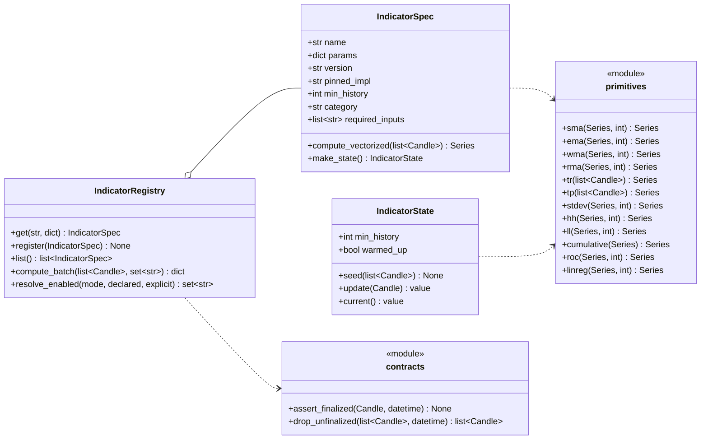
```mermaid
classDiagram
    direction LR
    class IndicatorSpec {
        +str name
        +dict params
        +str version
        +str pinned_impl
        +int min_history
        +str category
        +list~str~ required_inputs
        +compute_vectorized(list~Candle~) Series
        +make_state() IndicatorState
    }
    class IndicatorRegistry {
        +get(str, dict) IndicatorSpec
        +register(IndicatorSpec) None
        +list() list~IndicatorSpec~
        +compute_batch(list~Candle~, set~str~) dict
        +resolve_enabled(mode, declared, explicit) set~str~
    }
    class IndicatorState {
        +int min_history
        +bool warmed_up
        +seed(list~Candle~) None
        +update(Candle) value
        +current() value
    }
    class contracts {
        <<module>>
        +assert_finalized(Candle, datetime) None
        +drop_unfinalized(list~Candle~, datetime) list~Candle~
    }
    class primitives {
        <<module>>
        +sma(Series, int) Series
        +ema(Series, int) Series
        +wma(Series, int) Series
        +rma(Series, int) Series
        +tr(list~Candle~) Series
        +tp(list~Candle~) Series
        +stdev(Series, int) Series
        +hh(Series, int) Series
        +ll(Series, int) Series
        +cumulative(Series) Series
        +roc(Series, int) Series
        +linreg(Series, int) Series
    }
    IndicatorRegistry o-- IndicatorSpec
    IndicatorSpec ..> primitives
    IndicatorState ..> primitives
    IndicatorRegistry ..> contracts
```

#### `IndicatorSpec`

- **개요** — 한 지표(또는 DMI/ADX처럼 여러 값을 한 묶음으로 내는 지표 시스템 하나)를 어떻게 계산하고 언제부터
  유효한지 선언하는 명세.
- **책임** — `name`·`params`로 지표를 식별하고, 벡터화·증분 두 계산 방식의 진입점을 제공하며, 유효 시작 시점
  (`min_history`)과 채택 구현(`version`·`pinned_impl`)을 고정한다. `registry`에 등록되는 단위가 바로 이 명세이며
  등록된 지표 하나에 하나가 대응한다. **실행 중 상태는 갖지 않는다** — 캔들이 흐르며 변하는 값(직전 EMA, 워밍업
  완료 여부 등)은 `IndicatorState`가 따로 보유하고, 명세는 "무엇으로·어떻게 계산하는가"를 적은 불변 서술이다.
- **상속관계** — 없음(독립 명세 타입).
- **필드**
    - `name`·`params` — 등록·조회 키다. `params`는 그 지표의 파라미터이며(예: `{"period": 14}`), 같은 지표라도
      파라미터가 다르면 서로 다른 명세로 등록·조회된다.
    - `version`·`pinned_impl` — 계산식에 이견이 있을 때(예: RSI를 단순평균으로 낼지 Wilder 평활로 낼지) 채택할
      구현을 못박는다. 재현성과 벡터화·증분 값 일치의 근거다.
    - `min_history` — 유효값을 내기 전에 필요한 최소 캔들 수. 이만큼 쌓이기 전의 값은 유효하지 않다(워밍업 구간).
    - `category` — 지표 계열(추세·모멘텀·변동성 등)이며, 아래 등록 지표 목록의 분류와 같다.
    - `required_inputs` — OHLCV 외에 추가로 필요한 입력 채널. 시장폭 지표만 값을 갖고, 대부분 지표는 비어 있다.
- **메서드**
    - `compute_vectorized` : 전 구간을 한 번에 계산해 시계열을 돌려준다(백테스트 실행이 쓰는 벡터화 방식).
    - `make_state` : 이 지표의 증분 상태 객체(`IndicatorState`)를 만들어 준다. 라이브·페이퍼가 캔들마다 O(1)로
      갱신하는 증분 방식의 진입점이다.
- **불변식** — 명세는 불변이며 실행 중 상태를 갖지 않는다. 그래서 같은 명세는 언제나 같은 방식으로 계산되고, 변하는
  상태는 `make_state`가 만든 `IndicatorState`에만 있다.

#### `IndicatorRegistry`

- **개요** — 지표 등록·조회와 배치 계산을 맡는 곳.
- **책임** — 등록된 명세를 조회해 주고, 한 run에서 실제로 계산할 지표 집합만 벡터화로 계산한다.
- **상속관계** — 없음.
- **필드** — 없음(등록된 명세들을 보유하지만 스칼라 필드·상수는 없다).
- **메서드**
    - `get(name, params)` : 명세를 돌려준다.
    - `register(spec)` : 명세를 등록한다.
    - `list()` : 등록된 명세 목록을 돌려준다.
    - `compute_batch(candles, enabled_set)` : 확정된 계산 집합만 벡터화로 계산한다.
    - `resolve_enabled(mode, …)` : 계산 대상을 run 설정으로 정한다. `mode`는 세 가지다.
        - `auto`(기본) — 활성 전략이 선언한 필요 지표만 계산한다(성능 기본값).
        - `explicit` — 명시 리스트를 계산한다(전략 필요분 + 손실원인 탐색용 추가 지표).
        - `all` — 등록된 지표 전량을 계산한다(전면 스캔용).
- **불변식** — 계산 전에 세 가지를 검증한다: 요청 지표·파라미터가 등록돼 있는가, 워밍업(`min_history`)이 확보됐는가,
  시장폭 지표라면 별도 입력 채널이 있는가.

#### `IndicatorState`

- **개요** — 라이브·페이퍼(signal-service)가 실제로 도는 증분 계산 방식(캔들 하나당 O(1) 갱신).
- **책임** — 라이브가 실제로 도는 계산 방식이라, 벡터화 방식과 값이 같은지 판정하는 기준점이 된다. 백테스트는 이
  방식을 기준점 삼아 벡터화 값을 대조한다.
- **상속관계** — 없음.
- **필드** — `warmed_up`은 `min_history` 충족 여부다(`min_history`는 유효값에 필요한 최소 캔들 수).
- **메서드**
    - `seed(candles)` : 워밍업 이력으로 상태를 채운다.
    - `update(candle)` : 확정 캔들 하나로 한 칸 전진한다.
    - `current()` : 현재 지표 값을 돌려준다.
- **불변식** — 재귀형 지표의 상태를 보유하며 확정 캔들로만 전진한다(미확정·미래 캔들로 갱신하지 않는다). 같은
  seed와 같은 확정 캔들 열은 벡터화 방식과 같은 값을 낸다.

#### `contracts`

- **개요** — look-ahead 배제 계약(모듈 수준).
- **책임** — 미래·미확정 캔들이 지표 계산에 들어오는 것을 런타임에 막는다.
- **상속관계** — 없음(모듈).
- **필드** — 없음(모듈).
- **메서드**
    - `assert_finalized(candle, T)` : `candle.close_time ≤ T`를 검증한다.
    - `drop_unfinalized` : 주간 ATR 같은 리샘플에서 미확정 마지막 버킷을 떨군다.
- **불변식** — 확정 캔들(`close_time ≤ 판단 시각`)만 계산에 들어가도록 강제해 look-ahead를 구조적으로 막는다.

#### `primitives`

- **개요** — 공용 계산 단위(모듈 수준).
- **책임** — 모든 지표가 이 위에서 조립되도록 중복 계산을 한 곳에 모은다.
- **상속관계** — 없음(모듈).
- **필드** — 없음(모듈).
- **메서드**
    - `sma` : 단순이동평균.
    - `ema` : 지수이동평균.
    - `wma` : 선형가중이동평균.
    - `rma` : Wilder 평활(RMA).
    - `tr` : True Range.
    - `tp` : 대표 가격(typical price).
    - `stdev` : 표준편차.
    - `hh` : 구간 최고.
    - `ll` : 구간 최저.
    - `cumulative` : 누적합.
    - `roc` : 변화율(rate of change).
    - `linreg` : 선형회귀.
- **불변식** — 없음.

#### 등록 지표 목록 (현재 수집분)

**개수는 계약이 아니다.** 아래 표는 지금까지 수집한 지표를 정리한 것이다. 규칙이 불명확해 빠질 것도 있고 새
지표가 들어올 수도 있으므로, 총수는 현재 상태를 적은 것이지 고정값이 아니다. 고정하는 것은 위에 적은 **공통 관리
방식**이며, 목록의 증감은 `registry` 항목의 증감일 뿐 설계를 바꾸지 않는다. 그래서 구현자가 맞춰야 할 것은 "몇
개를 만들었나"가 아니라 "**모든 지표가 같은 방식으로 등록·계산되는가**"다. 각 지표의 닫힌 형태 계산식은 지표
계산 명세 표준이 계산 권위로 고정한다(구현까지 유지 참조).

| 계열 | 지표 (현재 개수) |
|---|---|
| 추세·이동평균 (10) | DEMA, TEMA, T3, HMA, ZLEMA, ALMA, KAMA, VIDYA, McGinley Dynamic, Guppy GMMA |
| 모멘텀·오실레이터 (27) | RSI, Stochastic(%K/%D), Stochastic RSI, MACD(+Histogram), PPO, TRIX, TSI, SMI, CMO, Williams %R, CCI, Ultimate Oscillator, Awesome Oscillator, Accelerator Oscillator, Fisher Transform, Connors RSI, QStick, Chande Forecast Oscillator, DeMarker, DPO, Schaff Trend Cycle, Relative Vigor Index(Ehlers), Laguerre RSI, Pretty Good Oscillator, KST, Coppock Curve, Special K |
| 변동성 (12) | ATR, Bollinger Bands, %B, BandWidth, Keltner Channel, Donchian Channel, SuperTrend, Chandelier Exit, Ulcer Index, Relative Volatility Index(Dorsey), Chaikin Volatility, Mass Index |
| 거래량 (10) | OBV, A/D Line, Chaikin Oscillator, CMF, MFI, Force Index, EMV, Klinger Volume Oscillator, NVI, PVI |
| 추세강도·방향성 (6) | DMI/ADX 시스템, Vortex, Aroon, Choppiness Index, QQE, Random Walk Index |
| Bill Williams (4) | Alligator, Fractals, Gator Oscillator, Market Facilitation Index |
| 시장폭 (3) | McClellan Oscillator, McClellan Summation Index, TRIN/Arms |
| 사이클·Ehlers (4) | MAMA/FAMA, Center of Gravity Oscillator, Roofing Filter, Sinewave/Instantaneous Trendline |
| 기타 시스템 (6) | Parabolic SAR, Ichimoku Kinko Hyo, Elder Ray, Elder Impulse System, TD Sequential, Woodies CCI |

이 목록에 적용되는 규칙은 네 가지다. 각 항목은 **굵은 제목**과 그 뒤의 설명으로 되어 있다.

- **등록 단위** — `registry`에 등록되는 한 항목이 무엇인지를 정하는 규칙이다. 계약은 지표 개수가 아니라 이
  단위다. 한 항목은 지표 하나이거나, DMI/ADX·Ichimoku처럼 여러 값을 한 묶음으로 내는 지표 시스템 하나다. 표에
  적힌 이름이 그대로 등록 이름이 된다. 단위를 어떻게 끊느냐에 따라 항목 수는 달라진다. 예를 들어 DMI/ADX를 네 값
  (`+DI`·`−DI`·`ADX`·`ADXR`)으로 펼치면 항목이 늘고, Bollinger Bands를 밴드 하나로 묶고 `%B`·`BandWidth`를 파생
  으로 빼면 항목이 준다. 지표가 늘거나 줄어도 이 단위 규칙은 그대로 적용한다.
- **의도적 제외** — 목록에 넣지 않기로 한 지표다. Wilder의 Swing Index·ASI·CSI와 Volatility Stop은 무기한 선물
  시장에 잘 맞지 않아 제외한다. Swing Index와 ASI는 "limit move"(하루 가격 변동 상한) 파라미터에 기대는데 무기한
  선물에는 그런 상한이 없고, Volatility Stop은 이미 넣은 Chandelier Exit로 사실상 대체된다. 나중에 필요해지면 그때
  따로 추가한다.
- **시장폭 지표의 조건부 활성** — 켜는 데 별도 조건이 붙는 지표다. McClellan Oscillator·Summation·TRIN 세 지표는
  등락 종목 수나 시장 전체 거래량 같은 별도 입력 채널이 있어야 계산된다. 단일 심볼의 OHLCV만으로는 그 입력이 없어
  비활성으로 둔다. 구현은 `required_inputs`에 필요한 채널을 선언하고, 그 채널이 없으면 `compute_batch`가 해당
  지표를 건너뛴다.
- **첫 검증 전략 커버리지** — 첫 파이프라인 검증에 쓰는 전략이 반드시 필요로 하는 최소 지표 집합이다. EMA
  9/21/55/200, RSI 14, Bollinger Bands(기간 20·표준편차 2.0), Stochastic(%K 14·%D 3), ATR 14, 거래량 이동평균
  20이 여기 든다. 현재 목록이 이들을 빠짐없이 덮는다. 목록이 바뀌더라도 이 집합만은 계속 유지해야 한다.

#### 워밍업·seed 규약

먼저 두 용어의 뜻이다. **워밍업(warmup)**은 지표가 믿을 만한 값을 내기 전에 앞서 쌓여 있어야 하는 초기 캔들
구간이다. EMA(200)은 앞선 약 200개, RSI(14)는 14개 캔들이 있어야 값이 안정되며, 그 필요 개수가 `min_history`다.
이 구간이 채워지기 전의 값은 입력 캔들이 모자라 신뢰할 수 없다. **seed(시드)**는 재귀형 지표의 증분 계산을 시작할
수 있도록 그 내부 상태를 워밍업 이력으로 미리 채워 넣는 일이다. EMA·Wilder 평활·Parabolic SAR·누적합처럼 오늘
값이 어제 값에 의존하는 지표는 "어제 값"에 해당하는 상태가 없으면 첫 계산을 시작할 수 없어서,
`IndicatorState.seed(candles)`로 그 상태를 세팅한 뒤부터 확정 캔들로 한 칸씩 전진한다.

이 둘이 필요한 이유는 두 가지다. 첫째, 워밍업을 건너뛰고 초반 몇 캔들만으로 계산한 EMA(200) 같은 값은 사실상
쓰레기값이라 진입·청산 판단의 근거로 쓸 수 없다. 그래서 평가를 시작하기 전에 충분한 캔들을 미리 채워 워밍업을
끝낸 뒤에야 신호를 받아들인다. 둘째, 백테스트의 벡터화 방식과 라이브의 증분 방식이 같은 지표에서 같은 값을 내야
하는데(일치 테스트), 재귀형 지표는 시작 상태가 다르면 초반 값이 갈린다. 두 방식이 같은 규칙으로 seed해야 첫
캔들부터 값이 어긋나지 않고, 이 일치가 look-ahead 방지와 재현성의 바탕이 된다.

이를 지키는 규약은 다음과 같다.

- **재귀형 지표의 갱신** — 이런 상태 보유 지표는 워밍업 이력으로 seed한 뒤 확정 캔들로만 갱신한다(과거를 다시
  계산하지 않고 앞으로만 전진한다).
- **두 방식의 seed 통일** — 초기값 산정, `adjust` 여부, 표준편차 분모, 0 나눗셈 처리를 지표 계산 명세 표준이
  통일한다. 벡터화 방식과 증분 방식이 같은 규칙을 써야 초반 캔들에서도 값이 어긋나지 않는다.
- **유효 시점** — 각 지표의 `min_history`만큼 캔들이 쌓이기 전 값은 유효하지 않다.
- **preload** — 실행 드라이버는 평가 구간 시작 전에 `max(전략 min_history, 지표 최장 워밍업)` 캔들을 별도
  preload하고, 그 구간의 신호는 버린다(§4.4에서 확정).

#### 지표 계산 플로우

한 run에서 지표 값을 만드는 방식은 두 가지이고, 어느 쪽이든 같은 지표 구현·같은 프리미티브를 거쳐 값이 서로 같아야
한다(일치 테스트로 못박는다). 아래가 두 방식과 그 공통 look-ahead 관문이다.

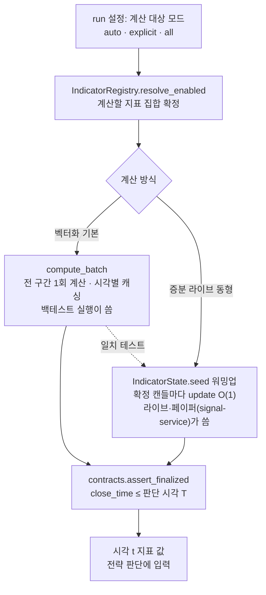
```mermaid
flowchart TD
    CFG["run 설정: 계산 대상 모드<br/>auto · explicit · all"] --> RESOLVE["IndicatorRegistry.resolve_enabled<br/>계산할 지표 집합 확정"]
    RESOLVE --> MODE{"계산 방식"}
    MODE -->|"벡터화 기본"| VEC["compute_batch<br/>전 구간 1회 계산 · 시각별 캐싱<br/>백테스트 실행이 씀"]
    MODE -->|"증분 라이브 동형"| INC["IndicatorState.seed 워밍업<br/>확정 캔들마다 update O(1)<br/>라이브·페이퍼(signal-service)가 씀"]
    VEC --> GATE["contracts.assert_finalized<br/>close_time ≤ 판단 시각 T"]
    INC --> GATE
    GATE --> OUT["시각 t 지표 값<br/>전략 판단에 입력"]
    VEC -. 일치 테스트 .-> INC
```

읽는 법: 계산 집합은 run 설정이 정하고(전량이 아니라 필요분), 두 방식 중 **벡터화가 백테스트 실행의 기본 방식**
(전 구간 1회 계산·캐싱으로 성능 확보)이고, **증분이 라이브·페이퍼(signal-service)가 실제로 도는 방식**이자 벡터화
값을 대조하는 검증 기준점이다. 두 방식 모두 `contracts`의 확정 캔들 계약(`close_time ≤ T`)을 통과해야 하며, 이 관문이 미래
데이터 참조를 구조적으로 막는다. 계산은 전부 `float`이고 Decimal 변환은 이 컴포넌트 밖 체결 관문에서만 일어난다.

## §4.2 전략 클래스 (+ config 해석 시퀀스)

전략 계층은 "전략을 끼우는 자리"를 정의한다. 플랫폼은 판단 계약(`StrategyAdapter`)·생성(`Adapter Manager`)·
파라미터 해석(`StrategyConfig`)만 소유하고, 각 전략(Adaptee)의 진입·청산 판단 자체는 전략 작성자 소유(범위 밖)다.
이 계층의 핵심 경계는 **파라미터 스키마를 Adaptee가 선언하고, StrategyConfig가 해석·검증하며, Adapter Manager가
생성한다** — 이 세 책임이 겹치지 않게 갈린다. 다이어그램은 그 계약·관계를, 정의서 안의 시퀀스는 생성·해석 순서를
담는다.

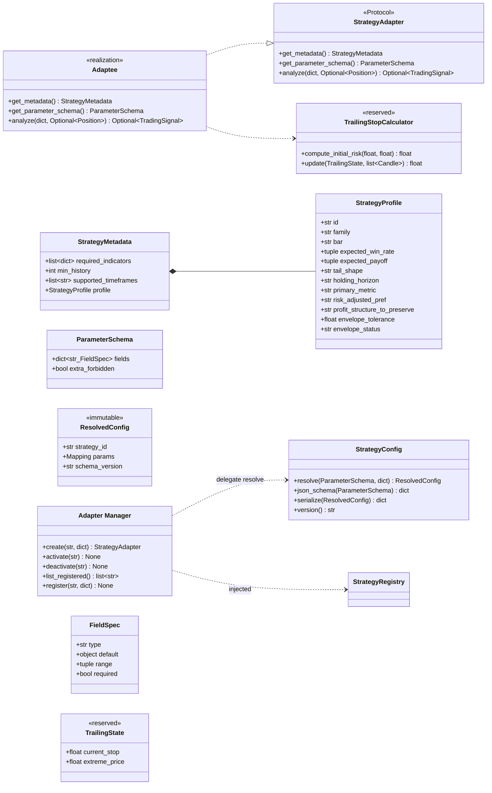
```mermaid
classDiagram
    direction LR
    class StrategyAdapter {
        <<Protocol>>
        +get_metadata() StrategyMetadata
        +get_parameter_schema() ParameterSchema
        +analyze(dict, Optional~Position~) Optional~TradingSignal~
    }
    class Adaptee {
        <<realization>>
        +get_metadata() StrategyMetadata
        +get_parameter_schema() ParameterSchema
        +analyze(dict, Optional~Position~) Optional~TradingSignal~
    }
    class StrategyMetadata {
        +list~dict~ required_indicators
        +int min_history
        +list~str~ supported_timeframes
        +StrategyProfile profile
    }
    class ParameterSchema {
        +dict~str_FieldSpec~ fields
        +bool extra_forbidden
    }
    class StrategyConfig {
        +resolve(ParameterSchema, dict) ResolvedConfig
        +json_schema(ParameterSchema) dict
        +serialize(ResolvedConfig) dict
        +version() str
    }
    class ResolvedConfig {
        <<immutable>>
        +str strategy_id
        +Mapping params
        +str schema_version
    }
    class AdapterManager["Adapter Manager"] {
        +create(str, dict) StrategyAdapter
        +activate(str) None
        +deactivate(str) None
        +list_registered() list~str~
        +register(str, dict) None
    }
    class StrategyProfile {
        +str id
        +str family
        +str bar
        +tuple expected_win_rate
        +tuple expected_payoff
        +str tail_shape
        +str holding_horizon
        +str primary_metric
        +str risk_adjusted_pref
        +str profit_structure_to_preserve
        +float envelope_tolerance
        +str envelope_status
    }
    class TrailingStopCalculator {
        <<reserved>>
        +compute_initial_risk(float, float) float
        +update(TrailingState, list~Candle~) float
    }
    class FieldSpec {
        +str type
        +object default
        +tuple range
        +bool required
    }
    class TrailingState {
        <<reserved>>
        +float current_stop
        +float extreme_price
    }
    Adaptee ..|> StrategyAdapter
    Adaptee ..> TrailingStopCalculator
    StrategyMetadata *-- StrategyProfile
    AdapterManager ..> StrategyConfig : delegate resolve
    AdapterManager ..> StrategyRegistry : injected
```

> `StrategyRegistry`는 §4.3 `ports`가 정의하는 Adaptee 카탈로그 주입 포트(ABC)다. `Adapter Manager`가 이
> 포트로만 목록에 접근하므로 `core_lib`은 특정 DB에 직접 의존하지 않는다.

#### `StrategyAdapter`

- **개요** — 플랫폼이 소유하는 "전략을 끼우는 자리", 즉 전략 판단 계약(`typing.Protocol`).
- **책임** — 전략을 끼우는 자리를 선언한다. 판단만 하고 데이터 읽기·결과 저장·캔들 루프를 갖지 않는다(각각
  Engine·포트 소관).
- **상속관계** — `typing.Protocol`이다. 상속시킬 공유 구현이 없어 추상 클래스(ABC)로 두지 않고 구조적 준수만
  요구하며, `Adaptee`가 이 계약을 실현한다.
- **필드** — 없음(계약만 정하는 Protocol이라 보유 속성이 없다).
- **메서드**
    - `get_metadata()` : 이 전략이 선언해 둔 메타데이터 — 필요 지표(`{name, params}` 목록)·최소 이력·지원
      타임프레임·프로파일 — 를 반환한다. 값을 새로 만드는 게 아니라 Adaptee가 선언한 것을 그대로 넘겨준다.
    - `get_parameter_schema()` : 이 전략의 파라미터 스키마(각 필드의 타입·기본값·범위, 잉여 키 금지)를 반환한다.
      스키마는 "허용되는 파라미터가 무엇인가"에 대한 선언일 뿐이며, 실제 `raw_config` 해석·검증은 이 자리가 아니라
      `StrategyConfig`가 한다.
    - `analyze(market_data, current_position)` : Engine이 push한 사전 계산 지표의 평평한 dict와 현재 포지션을
      받아 판단을 반환한다. 진입·청산 판단이면 `TradingSignal`, 관망이면 `None`이며, 반환은 판단뿐이라 수량·주문
      방향을 정하지 않는다.
- **불변식**
    - **stateless** — 호출 간 상태를 보유하지 않는다. 같은 입력은 항상 같은 신호를 낸다.
    - **판단 전용** — 데이터 읽기·결과 저장·캔들 루프를 갖지 않는다(각각 Engine·포트 소관).
    - **미래 데이터 자가 인출 금지** — 입력 dict는 Engine이 확정 캔들 경계까지만 채워 주므로, look-ahead는 피드
      경계가 통제한다.
    - **라이브·백테스트 동형** — 입력 dict의 형태와 호출 계약이 두 환경에서 같다. 같은 코드가 두 환경에서 같은
      값을 본다.

#### `Adaptee`

- **개요** — `StrategyAdapter` Protocol을 실현하는 실제 전략.
- **책임** — 진입·청산 엣지와 파라미터 값을 소유한다. 이 둘은 전략 작성자 소유라 이 설계의 범위 밖이고, 플랫폼은
  계약 형태만 정한다. 첫 검증 Adaptee는 트레일링을 제외한 개념의 신규 구현으로 ATR 기반 고정 손절·익절을 쓴다.
- **상속관계** — `StrategyAdapter` Protocol을 실현(realize)한다. 트레일링은 상속이 아니라
  `TrailingStopCalculator`의 순수 함수를 호출한다(첫 검증 스코프에서는 유보).
- **필드** — 없음(전략별 파라미터 값은 각 구현이 불변 `ResolvedConfig`로 주입받으며, 이 설계가 필드로 고정하지
  않는다).
- **메서드**
    - `get_metadata` : 이 전략이 선언한 `StrategyMetadata`를 반환한다(계약은 `StrategyAdapter` 참조).
    - `get_parameter_schema` : 이 전략의 `ParameterSchema`를 반환한다.
    - `analyze` : 이 전략의 진입·청산 판단을 수행한다. 이 판단 로직 자체가 전략 작성자 소유(범위 밖)의 핵심이다.
- **불변식** — `StrategyAdapter`의 불변식(stateless·판단 전용·미래 데이터 자가 인출 금지·두 환경 동형)을 그대로
  진다. 특히 stateless라 같은 입력은 같은 신호를 내고, 주입된 `ResolvedConfig`는 실행 중 바뀌지 않는다.

#### `StrategyMetadata`

- **개요** — `get_metadata()`가 반환하는, 전략이 자기 구동에 필요하다고 선언한 요건 묶음.
- **책임** — 전략이 요구하는 지표·최소 이력·타임프레임·형태를 담아 Engine과 평가 계층에 전달한다. 값을 만들지 않고
  선언을 실어 나른다.
- **상속관계** — 없음(독립 값 타입).
- **필드**
    - `required_indicators` — 이 전략이 요구하는 지표 목록이다. 각 항목은 지표 이름과 파라미터의 쌍 `{name, params}`
      이며(예: EMA 200이면 `name`은 `ema`, `params`는 `{"period": 200}`), Engine이 이 선언만큼 지표를 계산해
      `analyze`에 넘긴다.
    - `min_history` — 판단을 시작하기 전에 필요한 최소 캔들 수다. Engine이 워밍업 preload 길이를 정할 때 지표의
      최장 워밍업과 함께 큰 쪽을 취한다.
    - `supported_timeframes` — 이 전략이 도는 캔들 주기 목록이다(예: `["1h", "4h"]`).
    - `profile` — 이 전략의 형태 선언 `StrategyProfile`이다(아래 정의). 기대 범위 대조·회귀 판정의 근거가 된다.
- **메서드** — 없음(순수 값).
- **불변식** — 없음.

#### `ParameterSchema`

- **개요** — `get_parameter_schema()`가 반환하는, 이 전략이 받는 파라미터의 허용 형태 선언.
- **책임** — 허용 파라미터의 형태(이름·타입·기본값·범위·잉여 키 금지 여부)를 담는다. `StrategyConfig.resolve`가 이
  선언에 raw_config를 대조해 검증하며, 이 타입 스스로는 검증하지 않는다.
- **상속관계** — 없음(독립 값 타입).
- **필드**
    - `fields` — 파라미터 이름별 명세(`FieldSpec`) 맵이다. 각 `FieldSpec`은 그 파라미터의 타입·기본값·허용 범위를
      담는다.
    - `extra_forbidden` — 선언되지 않은 잉여 키를 금지할지 여부다. `resolve`의 `extra=forbid` 검증이 이 값을 따르며
      기본은 금지다.
- **메서드** — 없음(순수 값).
- **불변식** — 없음.

#### `FieldSpec`

- **개요** — `ParameterSchema.fields`의 값 타입. 파라미터 한 개의 허용 형태 명세.
- **책임** — 한 파라미터의 타입·기본값·허용 범위·필수 여부를 담아 `StrategyConfig.resolve`의 검증 기준이 된다.
- **상속관계** — 없음(값 타입).
- **필드** — `type`(파라미터 타입), `default`(기본값), `range`(허용 범위 `[min, max]` 등), `required`(필수 여부).
- **메서드** — 없음(순수 값).
- **불변식** — 없음(검증은 `StrategyConfig.resolve`가 수행한다).

#### `StrategyConfig`

- **개요** — 전략 파라미터 config의 해석·검증·직렬화·스키마 노출을 단독 소유하는 곳.
- **책임** — raw_config(전략 id + 파라미터 값)를 Adaptee가 선언한 스키마에 대조해 불변 `ResolvedConfig`로
  해석·검증하고, 설정 UI·툴링용 JSON Schema와 Evidence·카탈로그용 정규화 직렬화·스키마 버전을 낸다. 스키마
  선언(Adaptee 소유)도 전략 결정 로직도 갖지 않는다. 같은 전략 config가 backtest·live·UI에서 동일하게 검증되도록
  해석을 이 한 곳에 모은다.
    - **무순환 설계(스키마를 값으로 받음)** — `resolve`·`json_schema`는 Adaptee 인스턴스가 아니라 스키마 값을
      인자로 받는다. Adaptee가 선언한 스키마를 `Adapter Manager`가 먼저 꺼내 넘겨 주므로 `StrategyConfig`는 스키마
      타입에만 의존하고 전략 구현을 되짚지 않는다. 생성(Manager)·해석(Config)·선언(Adaptee) 사이에 순환이 생기지
      않는다.
- **상속관계** — 없음(독립 클래스).
- **필드** — 없음(해석 함수의 모음이라 보유 속성이 없다).
- **메서드**
    - `resolve(schema, raw_config)` : raw_config를 Adaptee가 선언한 스키마에 대조해 불변 `ResolvedConfig`로
      해석한다. 검증은 기본값 병합, 잉여 키 금지(`extra=forbid`), 타입·범위, 교차필드를 거친다.
    - `json_schema(schema)` : 설정 UI·툴링용 JSON Schema를 노출한다.
    - `serialize` : Evidence·카탈로그 기록용 정규화 직렬화를 낸다.
    - `version` : 스키마 버전을 낸다.
- **불변식**
    - 스키마 선언은 Adaptee 소유이며 `StrategyConfig`가 재정의하지 않는다.
    - 값은 호출자 소유다(소스를 갖지 않는다).
    - 파라미터 스윕·실행 설정은 범위 밖이다(실행 드라이버의 run 설정 소관).

#### `ResolvedConfig`

- **개요** — 해석·검증을 마친 불변 config.
- **책임** — 검증을 통과한 전략 파라미터를 불변으로 담아 Adaptee 인스턴스화의 입력이 된다.
- **상속관계** — 없음(독립 값 타입).
- **필드** — `schema_version`은 Evidence 재현 시 어떤 스키마로 해석했는지 확정한다(`strategy_id`는 전략 식별자,
  `params`는 해석된 파라미터 매핑으로 자명).
- **메서드** — 없음(순수 값).
- **불변식** — 생성 후 변경 불가(frozen)다. 이 불변성 덕에 이 객체로 인스턴스화한 Adaptee가 같은 config를 계속
  본다.

#### `Adapter Manager`

- **개요** — Adaptee의 생성(Factory)·lifecycle과 구현 목록 레지스트리를 다루는 곳.
- **책임** — `create`로 생성을 오케스트레이션하고(스키마를 조회해 해석한 뒤 인스턴스화하는 아래 시퀀스) lifecycle과
  레지스트리를 다룬다. 전략 결정 로직도 파라미터 검증 로직도 직접 갖지 않는다(각각 Adaptee·`StrategyConfig` 소관).
  backtest Engine과 signal-service 엔진이 동일하게 이 매니저로 Adaptee를 요청한다.
- **상속관계** — 없음.
- **필드** — 없음.
- **메서드**
    - `create(strategy_id, raw_config)` : 생성을 오케스트레이션한다(아래 시퀀스).
    - `activate` : Adaptee를 활성화한다.
    - `deactivate` : Adaptee를 비활성화한다.
    - `list_registered` : signal_db 레지스트리의 등록 목록을 조회한다.
    - `register` : signal_db 레지스트리에 등록한다.
- **불변식** — 레지스트리 DB 접근은 주입된 `StrategyRegistry` 포트로만 한다. 그래서 core-lib은 특정 DB에 직접
  의존하지 않는다.

#### Adaptee 생성·config 해석 시퀀스

선언·해석·생성 세 책임이 어떻게 순서대로 맞물리는지를 `create` 한 호출로 보인다. 순환 없이 스키마가 값으로 흐르는
것이 핵심이다.

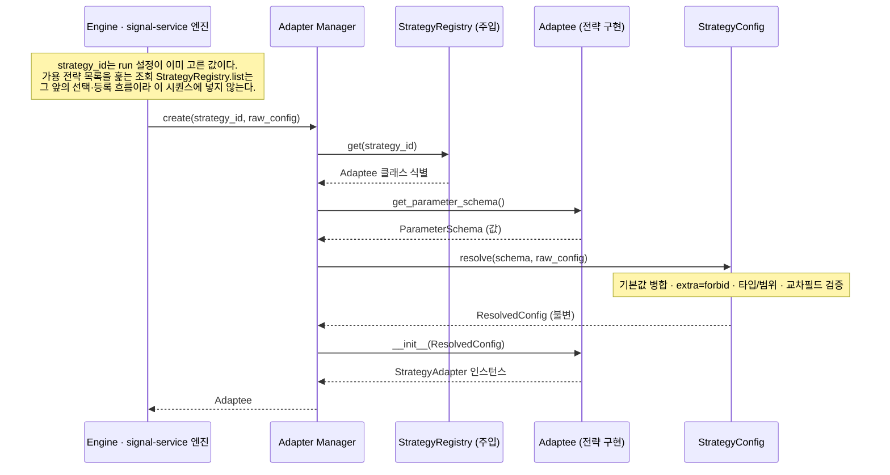
```mermaid
sequenceDiagram
    participant E as Engine · signal-service 엔진
    participant AM as Adapter Manager
    participant REG as StrategyRegistry (주입)
    participant AD as Adaptee (전략 구현)
    participant SC as StrategyConfig
    Note over E: strategy_id는 run 설정이 이미 고른 값이다.<br/>가용 전략 목록을 훑는 조회 StrategyRegistry.list는<br/>그 앞의 선택·등록 흐름이라 이 시퀀스에 넣지 않는다.
    E->>AM: create(strategy_id, raw_config)
    AM->>REG: get(strategy_id)
    REG-->>AM: Adaptee 클래스 식별
    AM->>AD: get_parameter_schema()
    AD-->>AM: ParameterSchema (값)
    AM->>SC: resolve(schema, raw_config)
    Note over SC: 기본값 병합 · extra=forbid · 타입/범위 · 교차필드 검증
    SC-->>AM: ResolvedConfig (불변)
    AM->>AD: __init__(ResolvedConfig)
    AD-->>AM: StrategyAdapter 인스턴스
    AM-->>E: Adaptee
```

읽는 법: `strategy_id`는 이 시퀀스가 시작되기 전에 정해진다 — 사용자·run 설정이 등록된 전략 목록을 먼저 조회해
(`Adapter Manager.list_registered()`, 내부적으로 `StrategyRegistry.list()`) 하나를 고른 값이다. 그래서 `create`는
이미 아는 id로 `get(strategy_id)`를 불러 카탈로그에서 그 하나만 가져온다. 무엇이 있는지 훑는 목록 조회는 선택·등록
흐름이라 이 생성 시퀀스에서는 의도적으로 뺐다. 그다음 스키마는 Adaptee가 선언하고, Config는 그 스키마 값을 받아
해석하며, Manager가 생성을 소유한다. Config가 Adaptee를 되짚지 않으므로 의존은 한 방향으로만 흐른다 — Manager가
Config와 Adaptee를 부르고, Config는 스키마 타입에만 의존한다. 레지스트리 조회는 주입 포트를 거쳐 core-lib이 DB에
묶이지 않는다.

#### `StrategyProfile`

- **개요** — 각 전략이 선언하는 자기 "형태(shape)".
- **책임** — 전략의 형태 지표(전략군·기대 승률/손익비 범위·꼬리 형태·보유 지평·선호 지표·보존할 수익 구조·성숙도)를
  선언한다. 스키마·소비 규칙은 패키지가 소유하고 값은 각 전략이 소유한다 — 형태 지표를 보편 통과선으로 못박지 않기
  위한 인터페이스다. 기대 범위 대조·회귀 판정은 여기서 하지 않고 평가 계층(§4.3.5의 `eval.profile`)이 하며, 이
  타입은 스키마만 정의한다.
- **상속관계** — 없음(독립 값 타입).
- **필드**
    - `family` — 전략군. `{trend_following, mean_reversion, breakout, carry, market_making, …}`.
    - `expected_win_rate`·`expected_payoff` — 기대 승률 범위·기대 손익비 범위. 각각 `[min, max]`.
    - `tail_shape` — 꼬리 형태. `{right_fat, symmetric, left_fat}`.
    - `holding_horizon`·`primary_metric` — 보유 지평과 주 지표.
    - `risk_adjusted_pref` — 선호 위험조정 지표. `{sortino, sharpe, calmar}`.
    - `profit_structure_to_preserve` — 보존할 수익 구조.
    - `envelope_tolerance` — 기대 범위 허용오차.
    - `envelope_status` — 성숙도. `{provisional, updating, established}`.
    - `id`·`bar` — 프로파일 식별자와 봉 주기.
- **메서드** — 없음(순수 값/스키마).
- **불변식** — `envelope_status`(성숙도)가 순환 논리를 막는다. 아직 확립되지 않은(`provisional`) 기대 범위로 신규
  전략을 탈락시키지 않고, 확립된(`established`) 전략이 그 형태를 잃은 회귀만 reject한다.

#### `TrailingStopCalculator` (유보)

- **개요** — ATR 트레일링의 표준 위치(순수 함수). 첫 검증 스코프에서는 유보.
- **책임** — 고정 손절이 없는 전략에 트레일링 스탑과 최초 위험(`r0`)을 순수 함수로 제공한다. 첫 검증 스코프의 어떤
  전략도 쓰지 않아 유보하며, 재도입 시 이 단일 표준으로 통합하고 파리티 기준을 확정한다.
- **상속관계** — 없음(순수 함수 모음. 전략은 상속이 아니라 이 함수를 호출한다).
- **필드** — 없음(순수 함수).
- **메서드**
    - `compute_initial_risk` : 최초 위험 `r0`를 계산해 제공한다(고정 손절이 없는 전략의 최초 보호 스탑).
    - `update` : 트레일링 상태와 확정 캔들로 갱신된 스탑 수준을 낸다.
- **불변식** — 없음(유보 상태라 이 절의 계약을 바꾸지 않는다).

#### `TrailingState` (유보)

- **개요** — `TrailingStopCalculator`가 캔들 사이에 들고 가는 트레일링 상태(유보).
- **책임** — 갱신에 필요한 직전 스탑 수준과 유리 방향 극값을 보유한다. `TrailingStopCalculator`와 함께 유보 상태다.
- **상속관계** — 없음(값 타입).
- **필드** — `current_stop`(현재 트레일링 스탑 수준), `extreme_price`(진입 후 유리 방향 극값).
- **메서드** — 없음(순수 값).
- **불변식** — 없음(유보 상태라 계약을 확정하지 않는다).

## §4.3 실행·평가 클래스 (+ 판정 플로우)

**이 계층이 하는 일.** 판단을 결과로 바꾼다. 결정적 체결(`execution`), net 손익을 이루는 비용 수식(`costs`),
거래당 위험을 묶는 사이징(`sizing`), 환경 차이를 격리하는 경계(`ports`), 성과 수식과 판정 3단계(`eval`)로 이뤄지며,
수치를 내는 모든 경로는 순수 함수라 같은 입력에 같은 값을 낸다. 컴포넌트마다 클래스 다이어그램을 하나씩 두고,
판정 파이프라인 플로우는 `eval` 정의서 안에 둔다.

**여기서 강제하는 불변식 다섯.**

- **체결은 결정보다 나중** — `decision_ts < execution_ts`. 결정 캔들 종가로 체결하지 않는다.
- **float→Decimal 단일 변환 관문** — 변환은 `Broker.submit()` 안의 `normalizer` 한 곳에서만 일어난다.
- **모든 손익 net** — 수수료·슬리피지·펀딩·청산 비용을 차감한 뒤의 값만 쓴다. "비용 0 가정"은 금지.
- **거래당 위험 1R ≤ 계좌 1%** — 생존이 수익보다 앞선다.
- **캔들 내 동시 도달은 보수적 최악 경로** — 손절·익절이 겹치면 손절을 먼저 맞은 것으로 본다.

### §4.3.1 `execution` 컴포넌트

주문 라이프사이클·결정적 체결·포지션 장부·회계와 Decimal 단일 변환 관문. 백테스트 시뮬과 페이퍼가 같은 결정
로직을 호출한다.

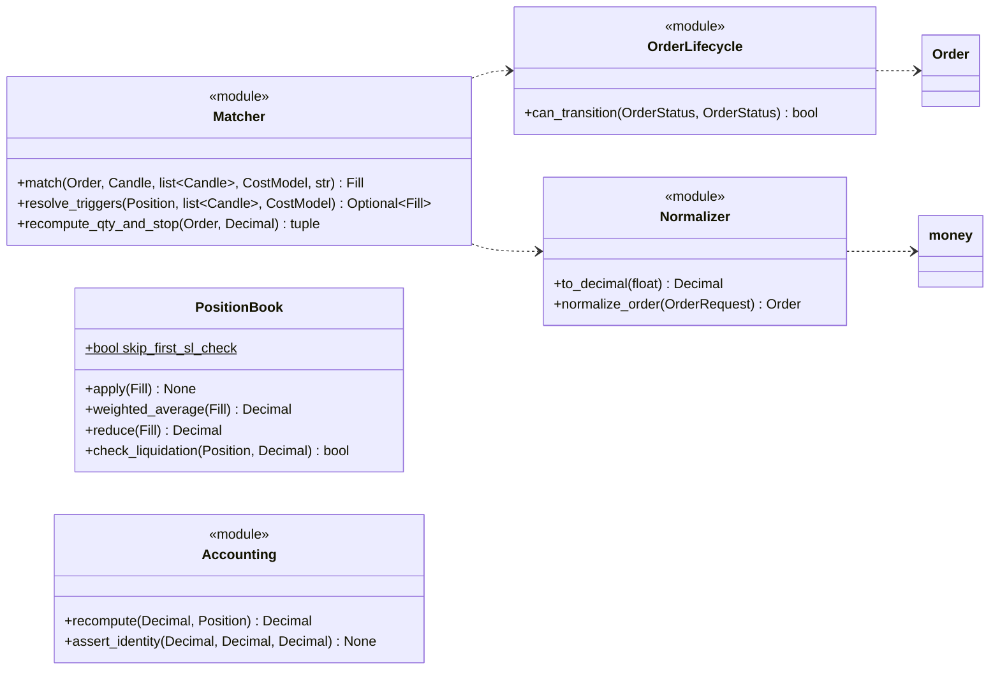
```mermaid
classDiagram
    direction LR
    class OrderLifecycle {
        <<module>>
        +can_transition(OrderStatus, OrderStatus) bool
    }
    class Matcher {
        <<module>>
        +match(Order, Candle, list~Candle~, CostModel, str) Fill
        +resolve_triggers(Position, list~Candle~, CostModel) Optional~Fill~
        +recompute_qty_and_stop(Order, Decimal) tuple
    }
    class PositionBook {
        +apply(Fill) None
        +weighted_average(Fill) Decimal
        +reduce(Fill) Decimal
        +check_liquidation(Position, Decimal) bool
        +bool skip_first_sl_check$
    }
    class Accounting {
        <<module>>
        +recompute(Decimal, Position) Decimal
        +assert_identity(Decimal, Decimal, Decimal) None
    }
    class Normalizer {
        <<module>>
        +to_decimal(float) Decimal
        +normalize_order(OrderRequest) Order
    }
    Matcher ..> OrderLifecycle
    Matcher ..> Normalizer
    OrderLifecycle ..> Order
    Normalizer ..> money
```

#### `Normalizer`

- **개요** — Decimal 단일 변환 관문(모듈). 시스템 전체에서 `float`→`Decimal` 변환이 일어나는 유일한 곳.
- **책임** — 판단·사이징 경로의 `float` 값을 체결·금액 경로의 `Decimal`로 바꾼다. 변환이 이 한 곳에서만 일어나
  "Decimal 단일 변환 관문" 불변식을 성립시킨다.
- **상속관계** — 없음(모듈).
- **필드** — 없음(모듈).
- **메서드**
    - `to_decimal(x)` : `Decimal(str(x))`와 `money`의 `quantize_*`를 한 번 수행한다.
    - `normalize_order(request)` : float 주문 요청(`OrderRequest`)의 수치를 이 관문으로 태워 Decimal `Order`로
      정규화한다. 이 변환이 float 경로와 Decimal 경로를 잇는 유일한 지점이다.
- **불변식**
    - **`Decimal(float)` 직접 변환 금지** — `float`이 이미 품은 이진 오차가 스탑 가격 끝자리를 뒤집어 캔들 내 트리거
      여부와 결정성 해시를 흔들기 때문이다. 문자열을 거쳐 의도한 값을 그대로 만든다.
    - **관문 우회 금지** — 모든 Broker 어댑터의 `submit()`이 이 함수를 통과해야 하며 어댑터별 독자 캐스팅은 금지다.
      우회는 적합성 테스트로 막는다.

#### `Matcher`

- **개요** — 결정적 체결 규칙의 유일 구현(모듈).
- **책임** — 주문·포지션을 캔들에 대조해 체결(`Fill`)을 만든다. `fill_timing ∈ {immediate, next_bar}`을 주입형으로
  두고 백테스트 기본은 `next_bar`이며, 백테스트 시뮬과 페이퍼가 이 한 구현을 공유한다.
- **상속관계** — 없음(모듈).
- **필드** — 없음(모듈. 소급 검사 금지 정책 상수는 `PositionBook.skip_first_sl_check`가 소유).
- **메서드**
    - `match(order, candle, history, cost_model, fill_timing)` : 주문을 `t+1` 시가에 슬리피지를 얹어 체결한다
      (매수 +, 매도 −). 마지막 인자 `fill_timing`은 `immediate`·`next_bar` 중 하나이며 백테스트 기본은 `next_bar`
      다. `t+1` 시가가 손절·청산 너머인 갭이면 시가에 체결하고 슬리피지를 가중한다. 같은 캔들 종가에서 청산 신호와
      반대 진입이 함께 나오면 `t+1` 시가에서 기존 포지션 청산 체결·정산을 먼저 하고 그 뒤 신규 진입 마진 검사·체결을
      처리한다(리버설 순서. 마진 가용성은 청산 정산 후 기준).
    - `resolve_triggers` : 손절·트레일링·익절·청산 채널·강제청산의 캔들 내 발동을 판정한다. 첫 검증 스코프에서는
      전략 TF 캔들 수준의 보수 판정이고(1분 하위 집행 피드는 유보), 1분 트리거 walk와 그 파리티 허용 편차는 Engine
      설계(§4.4)에서 확정한다. 어떤 포지션도 자기 체결 캔들 이전으로 소급 검사하지 않는다(`PositionBook`의
      `skip_first_sl_check`와 같은 규칙).
    - `recompute_qty_and_stop` : 수량과 최초 보호 스탑을 신호 캔들 종가가 아니라 실제 체결가 기준으로 재산정한다.
      갭으로 마진이 부족하면 주문 거부가 아니라 수량 절삭 후 Evidence에 기록한다. 반환은 `(재산정 수량, 재산정 최초
      보호 스탑)` tuple이다.
- **불변식**
    - **체결은 결정보다 나중(next-bar)** — 신호는 캔들 `t` 마감에 나고 체결은 `t+1` 시가라 `decision_ts <
      execution_ts`를 만족한다. 결정 캔들 종가로 체결하지 않는다.
    - **동시 도달 손절 우선(보수적 최악 경로, OHLC-locked)** — 같은 캔들에서 손절과 익절이 모두 범위 안이면 손절
      우선이다(익절 우선으로 구현하면 승률·PF가 계통적으로 부풀려진다). 손절과 강제청산이 겹치면 정상 설정에서는
      손절가가 청산가보다 안쪽이라 손절 우선(청산 미발생)이고, 손절가가 청산가 바깥인 설정 오류만 청산 처리하며
      설정 오류로 마킹한다. 즉 기본은 손절이고 청산은 갭·오류 예외다.

#### `OrderLifecycle`

- **개요** — 주문 상태 전이의 문지기(모듈).
- **책임** — 허용된 전이만 통과시키고 위반을 거부한다. 전이표를 새로 만들지 않고 `types.Order`의
  `VALID_TRANSITIONS`(단일 소유)를 읽어 쓴다 — `execution`이 `types`를 참조하는 방향이라 표를 복제하지 않아
  복제 드리프트가 생기지 않는다.
- **상속관계** — 없음(모듈).
- **필드** — 없음(전이표는 `types.Order.VALID_TRANSITIONS`를 읽어 쓰고 복제하지 않는다).
- **메서드**
    - `can_transition` : 허용된 전이만 통과시키고 위반을 거부한다.
- **불변식** — 없음(전이 규칙 자체는 `types.Order`가 단독 소유·강제한다).

#### `PositionBook`

- **개요** — 체결을 반영해 포지션 장부를 갱신하는 곳.
- **책임** — 체결(`Fill`)을 받아 포지션 수량·평균 진입가·마진을 갱신하고 청산을 판정한다.
- **상속관계** — 없음.
- **필드** — `skip_first_sl_check`는 "어떤 포지션도 자기 체결 캔들 이전으로 소급해 손절을 검사하지 않는다"는 규칙을
  담은 클래스 상수(TRUE)다. 규칙의 실제 판정은 `Matcher.resolve_triggers`가 수행하며, 현행 엔진이 같은 이름으로
  부르던 규칙과 같다.
- **메서드**
    - `apply` : 체결 하나를 장부에 반영한다(진입·증량·감량·청산 반영의 진입점).
    - `weighted_average` : 체결을 반영해 가중평균 진입가를 갱신한다. 평균가 계산 자체는 값 타입
      `Position.add_quantity`가 소유하고, 이 메서드는 어느 포지션에 적용할지의 장부 조율만 한다.
    - `reduce` : `reduce_only` 실현과 마진 반환을 처리한다.
    - `check_liquidation` : Isolated를 우선해 청산을 판정한다 — 발동 비교 자체는 `costs.Liquidation.is_triggered`에
      위임하고(수식·비교 복제 방지) 이 메서드는 장부 차원의 적용만 한다.
- **불변식** — 없음(회계 항등식 `cash + position = equity`는 `Accounting`이 강제한다).

#### `Accounting`

- **개요** — 회계 항등식의 소유처(모듈).
- **책임** — `cash + position = equity` 항등식을 유지하고 그 성립을 검산한다.
- **상속관계** — 없음(모듈).
- **필드** — 없음(모듈).
- **메서드**
    - `recompute` : `cash + position = equity` 항등식을 유지한다.
    - `assert_identity` : 그 항등식이 실제로 성립하는지 검산한다.
- **불변식** — `cash + position = equity`가 항상 성립하며, 각 비용은 한 번만 차감한다.

### §4.3.2 `costs` 컴포넌트

net 손익을 이루는 네 비용의 수식 표준. 값은 `CostModel`이 주입하고 수식만 여기 있다. net 손익 항등식은 `x_net =
x_gross − fee_entry − fee_exit − slippage − funding − liquidation_penalty`이며 각 비용은 한 번만 차감한다.

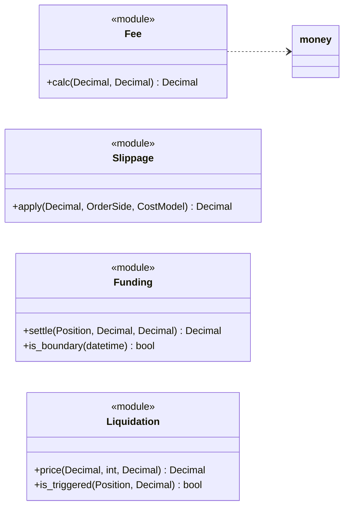
```mermaid
classDiagram
    direction LR
    class Fee {
        <<module>>
        +calc(Decimal, Decimal) Decimal
    }
    class Slippage {
        <<module>>
        +apply(Decimal, OrderSide, CostModel) Decimal
    }
    class Funding {
        <<module>>
        +settle(Position, Decimal, Decimal) Decimal
        +is_boundary(datetime) bool
    }
    class Liquidation {
        <<module>>
        +price(Decimal, int, Decimal) Decimal
        +is_triggered(Position, Decimal) bool
    }
    Fee ..> money
```

아래 수치는 모두 주입 기본값이며 run 설정으로 덮어쓴다.

#### `Fee`

- **개요** — 수수료 비용의 수식 표준(모듈).
- **책임** — notional과 rate로 수수료를 계산한다. 이 모듈은 수식만 소유하고 값(rate)은 `CostModel`이 주입한다.
  주입 기본값은 선물 maker `0.0002`(0.02%)·taker `0.0005`(0.05%), 현물 `0.0005`(0.05%)다.
- **상속관계** — 없음(모듈).
- **필드** — 없음(모듈. rate 값은 주입).
- **메서드**
    - `calc(notional, rate)` : `fee = notional × rate`로 수수료를 낸다. rate는 maker와 taker를 구분하며 기본은
      taker다(회전율 방어).
- **불변식** — 없음(비용 1회 차감은 net 손익 항등식·`Accounting`이 강제한다).

#### `Slippage`

- **개요** — 슬리피지 비용의 수식 표준(모듈).
- **책임** — 주문 방향과 호가 유동성으로 슬리피지를 계산한다. 값은 `CostModel`이 주입한다.
- **상속관계** — 없음(모듈).
- **필드** — 없음(모듈).
- **메서드**
    - `apply(notional, side, cost_model)` : 표준은 `spread/2 + k·(주문량 / 호가유동성)` 스트레스 모델로 왕복
      0.1~0.3%를 목표한다. 부호는 매수는 불리하게 더하고 매도는 뺀다. 현행 곱셈 고정 bps는 호환용으로만 두며 선물
      진입 `0.0005`·현물 진입 `0.001`·청산 `0.0001`이다.
- **불변식** — 없음.

#### `Funding`

- **개요** — 펀딩 비용의 수식 표준(모듈). 이산 정산이 표준이다.
- **책임** — UTC 정산 경계를 지나는 포지션에 펀딩을 부과한다. 이 모듈은 수식만 소유하고, rate는 과거 실측을
  `DataFeed`로 주입받으며 실측이 없을 때만 `CostModel`의 fallback rate `0.0001`(0.01%)을 쓴다.
- **상속관계** — 없음(모듈).
- **필드** — 없음(모듈. rate 값은 주입).
- **메서드**
    - `settle(position, rate, price)` : UTC `0/8/16`시 경계를 보유 상태로 지나는 포지션에 `notional × rate`
      전액을 부과한다. 경계를 지나지 않으면 실제 펀딩은 0이다. 정산가는 정산 경계를 포함하는 최소 가용 TF 캔들의
      시가로 고정하고, 그 캔들이 없으면 직전 확정 캔들 종가를 쓴다. 경계 직전 보유분에만 부과하고, 동시각 신규
      체결은 그 정산을 물지 않는다.
    - `is_boundary(t)` : 주어진 시각이 UTC `0/8/16`시 정산 경계인지 판정한다.
- **불변식** — 이산 정산이 표준이다. `×보유시간/8h` pro-rata 식은 사전 추정용 참고로만 쓰고 실제 부과에는 쓰지
  않는다.

#### `Liquidation`

- **개요** — 강제청산가의 수식 표준(모듈). Isolated를 우선한다.
- **책임** — 청산가를 계산하고 캔들 극값과 대조해 발동을 판정한다. 이 모듈은 수식만 소유하고 값(`mmr` 등)은
  주입받으며, 이 수식이 실제로 쓰이는 자리는 환경에 따라 갈린다(아래 불변식의 출처·수렴 규약).
- **상속관계** — 없음(모듈).
- **필드** — 없음(모듈. 유지증거금률 `mmr` 기본 `0.004`(0.4%, 최저 티어)는 주입 기본값).
- **메서드**
    - `price(entry, leverage, mmr)` : Isolated 우선. 롱은 `liq_price = Entry × (1 − 1/leverage + mmr)`,
      숏은 부호를 뒤집어 `liq_price = Entry × (1 + 1/leverage − mmr)`다(가격이 진입 반대 방향으로 갈 때 청산되므로
      롱은 아래로, 숏은 위로 청산가가 놓인다).
    - `is_triggered(position, price)` : 청산 발동을 판정하는 **단일 소유처**다. last-price 캔들 극값을 청산가와
      대조하는 순수 비교이며, `PositionBook.check_liquidation`과 `Matcher.resolve_triggers`는 판정을 자체 구현하지
      않고 이 함수를 호출한다(비교 로직 복제 방지). Binance 강제청산은 mark price 기준이고 mark가 더 평활하므로,
      이 판정은 청산이 과대 발생하는 보수 방향 근사다.
- **불변식**
    - **강제청산 출처는 환경마다 다르고 종착점은 하나다.** 이 수식이 쓰이는 자리가 환경에 따라 갈리므로, 구현자는
      아래를 혼동하면 안 된다.
        - **백테스트·페이퍼** — 거래소가 없으므로 **우리가 검출해 일으킨다.** `Matcher.resolve_triggers`가 이
          수식의 청산가를 캔들 극값과 대조해 발동을 판정하고 `Fill(exit_reason=LIQUIDATION)`을 만든다.
        - **라이브** — **거래소가 청산 조건을 판정하고 자동으로 집행한다.** 우리는 청산을 일으키지 않고 그 사건을
          받아 정리할 뿐이다. wallet의 라이브 인프라(거래소 이벤트 수신)가 그 통지를 같은 모양의
          `Fill(exit_reason=LIQUIDATION)`으로 만들어 넘긴다. 여기서 이 수식은 청산을 *일으키는* 데 쓰이지 않고,
          진입 전 가드레일(손절가가 청산가보다 안쪽인지 검사)과 사후 대사(거래소 실측 청산가와 대조)에만 쓴다.
          거래소 이벤트 수신 경로·누락 이벤트 복구·실측 청산가 사후 대사 **절차**는 이 절이 소유하지 않고 채택
          설계(부록)에서 확정한다 — 이 절은 계약(아래 수렴점과 위 수식)만 고정하고 라이브 수신 메커니즘은 의도적으로
          비워 둔다.
        - **수렴점** — 두 출처 모두 `Fill(exit_reason=LIQUIDATION)`으로 모여 `position_book`·`accounting`이
          동일하게 소비하고, 거래에는 `Trade.liquidated = TRUE`로 남는다. 그래서 청산을 누가 일으켰든 회계·손익
          경로는 환경과 무관하게 하나다. 이 수렴이 성립하므로 거래소 사건을 받기 위한 별도 포트 메서드는 두지
          않는다 — 라이브에서는 wallet이 드라이버라, 백테스트에서 Engine이 그러하듯 `execution`을 직접 호출한다.
    - **전략은 청산을 신호하지 않는다** — 강제청산은 거래소(라이브) 또는 매처(백테스트·페이퍼)가 일으키는 실행
      계층 사건이라 `TradingSignal`에 실리지 않는다. 전략의 판단 계약(§4.2)은 이 사건을 알지 못하고, 청산 사실은
      `Fill.exit_reason`과 `Trade.liquidated`로만 표현된다. 신호는 캔들 마감 판단 시점에만 만들어지는 반면
      강제청산은 캔들 도중 아무 때나 일어나므로, 신호에 실으면 회계가 실제보다 늦어진다.

### §4.3.3 `sizing` 컴포넌트

거래당 위험을 계좌의 정해진 비율로 묶는 생존 사이징. 엣지는 진입 신호에서 오며, 손절·익절 배치로 기대값을
창조하지 않는다. **사이징은 판단 경로라 전부 `float`로 계산한다** — Equity 스냅샷·손절거리(예: `k×ATR`)·산출
수량이 모두 `float`이다. 이 `float` 수량은 **주문 요청 `OrderRequest`**(§4.1.1, float 타입)로 담겨
`Broker.submit()`에 전달되고, 거기서 `execution`의 `normalizer`가 `OrderRequest`를 받아 `float→Decimal` 단일
변환을 수행해 낸 `Order`·`Fill`이 `Decimal`이다. 사이징 자체는
`normalizer`를 호출하지 않는다(변환은 오직 체결 관문). 사이징의 Equity 스냅샷(신호 캔들 종가 마크, `float`)과
회계 계층의 Decimal Equity(체결 후 장부 항등식)는 같은 개념을 두 정밀도로 본 것이다.

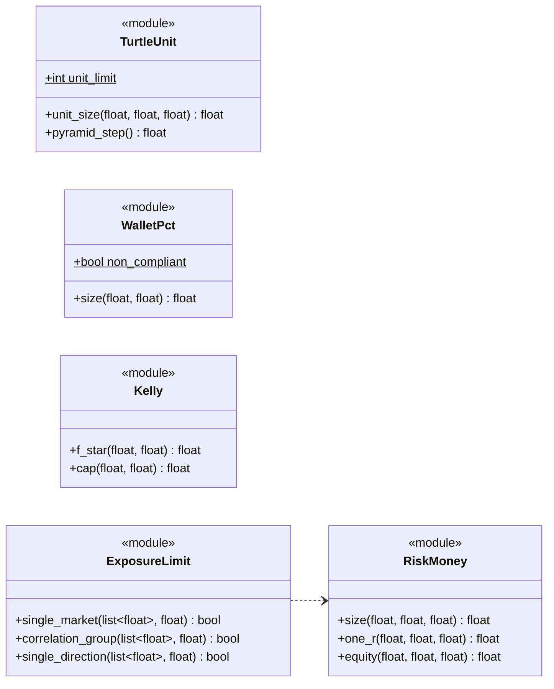
```mermaid
classDiagram
    direction LR
    class RiskMoney {
        <<module>>
        +size(float, float, float) float
        +one_r(float, float, float) float
        +equity(float, float, float) float
    }
    class TurtleUnit {
        <<module>>
        +unit_size(float, float, float) float
        +pyramid_step() float
        +int unit_limit$
    }
    class WalletPct {
        <<module>>
        +size(float, float) float
        +bool non_compliant$
    }
    class Kelly {
        <<module>>
        +f_star(float, float) float
        +cap(float, float) float
    }
    ExposureLimit ..> RiskMoney
    class ExposureLimit {
        <<module>>
        +single_market(list~float~, float) bool
        +correlation_group(list~float~, float) bool
        +single_direction(list~float~, float) bool
    }
```

#### `RiskMoney`

- **개요** — 보편 사이징(모듈). 거래당 위험을 계좌 비율로 묶는다.
- **책임** — 거래당 위험을 계좌 비율(`risk_per_trade`)로 고정해 수량을 산정한다. 손절거리와 Equity로 수량을
  정하고, 레버리지는 입력이 아니라 결과로 역산한다.
- **상속관계** — 없음(모듈).
- **필드** — 없음(모듈. 산출값은 사이징 시점의 `float` 스냅샷).
- **메서드**
    - `size(risk_per_trade, equity, stop_distance)` : `수량 = (risk_per_trade × Equity) / 손절거리`. 여기서
      `1R = 손절거리 × 수량`이 성립한다. 손절거리는 변동성 척도(예: `k×ATR`)로 잡는 것이 기본이라, 변동성이 큰
      시장일수록 수량이 작아져 모든 포지션의 위험기여도가 균등화된다. 레버리지는 `명목가치 = 수량 × 가격`에서
      역산하며 거래소 한도 안에 드는지 확인한다.
    - `one_r(entry, stop, quantity)` : `1R = |체결가 − 최초 보호 스탑| × 수량`으로 최초 위험을 계산한다(수량을
      인자로 받아야 곱이 성립하며, 이 값이 곧 `Trade.r0`다). 두 예외가 있다 —
      고정 손절이 없는 전략은 트레일링 계산기의 초기 위험 `R0 = clamp(1.5×ATR/entry, 0.45%~0.65%) × entry`를
      최초 보호 스탑으로 채택해 `Trade.r0`에 기록하고, 최초 스탑을 아예 정의할 수 없는 거래는 R 기반 지표
      (SQN·기대값·파산확률)에서 제외하고 그 건수를 카탈로그 요약의 제외 건수(`r_excluded_count`)에 남긴다
      (Evidence에서는 최초 위험 `r0`가 NULL인 거래 수로 파생된다).
    - `equity(cash, used_margin, unrealized)` : `cash + 사용 마진 + 미실현 손익`(신호 캔들 종가 마크). 회계
      항등식의 equity와 같은 개념이며, 사이징 시점의 값은 `float` 스냅샷이다.
- **불변식** — 거래당 위험 `1R ≤ 0.01 × Equity`(계좌 1%)를 넘지 않는다. 파산확률이 0.1%를 넘으면
  `risk_per_trade`를 더 낮춘다.

#### `TurtleUnit`

- **개요** — 터틀 사이징 방식(모듈). `RiskMoney`의 한 방식이며 전략이 선택해 조합한다.
- **책임** — 변동성 단위 `N`으로 유닛 크기를 잡고 피라미딩과 유닛 상한을 적용한다.
- **상속관계** — 없음(모듈. `RiskMoney` 수식을 조합해 쓴다).
- **필드** — `unit_limit`는 단일 시장의 유닛 상한을 담은 상수다(원조 4유닛).
- **메서드**
    - `unit_size(...)` : 변동성 단위 `N`으로 한 유닛의 크기를 잡는다.
    - `pyramid_step()` : 0.5N마다 증량한다.
- **불변식** — 없음.

#### `WalletPct`

- **개요** — pct 방식 사이징(모듈, 호환 경로).
- **책임** — `position_size_pct`를 available_balance 기준으로 적용해 수량을 낸다. `1R ≤ 1%` 상한을 보장하지 못하는
  호환 경로다.
- **상속관계** — 없음(모듈).
- **필드** — `non_compliant`는 이 경로가 `1R ≤ 1%`를 보장하지 못함을 표시하는 상수다(호환 모드 플래그).
- **메서드**
    - `size(...)` : `position_size_pct`(기본 20%)를 available_balance(마진 잠김·미실현 제외) 기준으로 적용한다.
- **불변식** — 이 경로는 `1R ≤ 1%` 상한을 보장하지 못하므로, run 메타에 "framework 비준수(호환 모드)" 플래그를
  의무로 기록해 원칙과의 관계를 숨기지 않는다.

#### `Kelly`

- **개요** — 베팅 비중의 상한(모듈).
- **책임** — Kelly 비중을 계산하고 실전 상한(Half~Quarter)으로 잘라 준다.
- **상속관계** — 없음(모듈).
- **필드** — 없음(모듈).
- **메서드**
    - `f_star(p, B)` : `f* = p − (1−p)/B`(`B`는 손익비).
    - `cap(f_star, λ)` : Half 또는 Quarter를 상한으로 잘라 준다(`λ ≤ 0.5`).
- **불변식** — Full Kelly는 금지다. 추정오차·fat-tail·regime change 때문에 실전 낙폭이 파괴적이라 항상 Half~Quarter
  상한을 건다.

#### `ExposureLimit`

- **개요** — 합산 위험의 상한(모듈). 계좌 % 기준으로 표현한다.
- **책임** — 단일 시장·상관군·단일 방향 세 단계의 합산 위험 상한을 둔다. 원조 터틀의 단일 4유닛·상관군 6유닛·방향
  12유닛이 이 한도의 한 방식이다.
- **상속관계** — 없음(모듈).
- **필드** — 없음(모듈).
- **메서드**
    - `single_market(...)` : 단일 시장의 합산 위험이 상한 안인지 판정한다.
    - `correlation_group(...)` : 상관군의 합산 위험이 상한 안인지 판정한다.
    - `single_direction(...)` : 단일 방향의 합산 위험이 상한 안인지 판정한다.
- **불변식** — 단일 심볼 구현에서는 단일 시장 한도만 유효하고 나머지 둘은 다중 심볼 확장 시 활성화되지만, 프레임은
  세 한도 개념을 항상 소유한다. 상관이 1로 수렴하는 동반 청산 시나리오를 파산확률·최대낙폭 몬테카를로에 반드시
  포함한다.

### §4.3.4 `ports` 컴포넌트

환경별 관심사의 어댑터 경계. 일곱 개 추상 계약(ABC)만 선언하고 구현은 서비스가 주입한다. `ports`는 `types`만
참조하고 `execution`을 참조하지 않는다 — Decimal 단일 변환은 `Broker` 구현 어댑터가 `submit()`에서
`execution.normalizer`를 통과해 달성하며, 추상 계약 자체는 그 결합을 갖지 않는다.

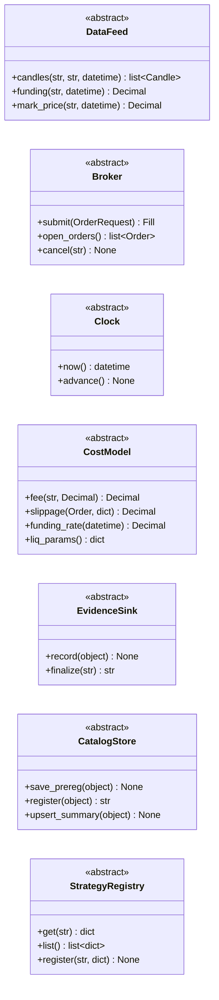
```mermaid
classDiagram
    direction LR
    class DataFeed {
        <<abstract>>
        +candles(str, str, datetime) list~Candle~
        +funding(str, datetime) Decimal
        +mark_price(str, datetime) Decimal
    }
    class Broker {
        <<abstract>>
        +submit(OrderRequest) Fill
        +open_orders() list~Order~
        +cancel(str) None
    }
    class Clock {
        <<abstract>>
        +now() datetime
        +advance() None
    }
    class CostModel {
        <<abstract>>
        +fee(str, Decimal) Decimal
        +slippage(Order, dict) Decimal
        +funding_rate(datetime) Decimal
        +liq_params() dict
    }
    class EvidenceSink {
        <<abstract>>
        +record(object) None
        +finalize(str) str
    }
    class CatalogStore {
        <<abstract>>
        +save_prereg(object) None
        +register(object) str
        +upsert_summary(object) None
    }
    class StrategyRegistry {
        <<abstract>>
        +get(str) dict
        +list() list~dict~
        +register(str, dict) None
    }
```

일곱 포트의 계약과 불변식은 다음과 같다.

#### `DataFeed`

- **개요** — 시장 데이터 공급 경계(ABC).
- **책임** — 확정 캔들·펀딩 rate·마크 가격을 그 시점 기준으로 공급한다. 구현 어댑터는 서비스가 주입한다.
- **상속관계** — 추상 기반 클래스(ABC). 서비스별 구현 어댑터가 이를 상속·구현한다.
- **필드** — 없음(추상 계약).
- **메서드**
    - `candles(symbol, tf, up_to)` : `up_to` 이후 캔들을 절대 반환하지 않는다. look-ahead를 구조적으로 배제하는
      지점이다.
    - `funding(...)` : 과거 실측 펀딩 rate를 그 시점 기준으로 공급한다.
    - `mark_price(...)` : 마크 가격을 그 시점 기준으로 공급한다.
- **불변식** — `candles`는 `up_to` 이후 캔들을 반환하지 않아 look-ahead를 구조적으로 막는다.

#### `Broker`

- **개요** — 주문 체결 경계(ABC).
- **책임** — 주문을 체결하고 미체결 주문을 다룬다. 구현 어댑터는 서비스가 주입한다.
- **상속관계** — 추상 기반 클래스(ABC). 서비스별 구현 어댑터가 이를 상속·구현한다.
- **필드** — 없음(추상 계약).
- **메서드**
    - `submit(request)` : float 주문 요청(`OrderRequest`)을 받아 내부에서 `execution.normalizer`로 Decimal `Order`
      로 변환한 뒤 체결해 `Fill`을 돌려준다. float→Decimal 단일 변환 관문이 바로 이 안이다.
    - `open_orders()` : 미체결 주문 목록을 돌려준다.
    - `cancel(id)` : 미체결 주문을 취소한다.
- **불변식** — 구현 어댑터의 `submit()`은 반드시 `execution.normalizer`를 통과해 `OrderRequest`(float)를 `Order`
  (Decimal)로 만드는 `float→Decimal` 단일 변환을 달성한다. 어댑터별 독자 캐스팅은 금지다.

#### `Clock`

- **개요** — 시뮬 시각 경계(ABC).
- **책임** — 현재 시뮬 시각을 주고 시계를 전진시킨다. 구현 어댑터는 서비스가 주입한다.
- **상속관계** — 추상 기반 클래스(ABC). 서비스별 구현 어댑터가 이를 상속·구현한다.
- **필드** — 없음(추상 계약).
- **메서드**
    - `now()` : 현재 시뮬 시각을 돌려준다.
    - `advance()` : 시계를 다음 시점으로 옮긴다.
- **불변식** — wall-clock을 쓰지 않는다(결정성). 난수도 무제어로 쓰지 않는다.

#### `CostModel`

- **개요** — 비용 값 주입 경계(ABC).
- **책임** — 비용 값을 주입한다. `fee`·`slippage`·`funding_rate`·`liq_params`로 값만 소유하고 수식은 `costs`가
  소유하며, 부과 규칙과 fallback rate만 갖는다.
- **상속관계** — 추상 기반 클래스(ABC). 서비스별 구현 어댑터가 이를 상속·구현한다.
- **필드** — 없음(추상 계약. 부과 규칙·fallback rate만 값으로 공급).
- **메서드**
    - `fee(...)` : 수수료 rate를 공급한다.
    - `slippage(...)` : 슬리피지 파라미터를 공급한다.
    - `funding_rate(...)` : 펀딩 fallback rate를 공급한다.
    - `liq_params()` : 청산 파라미터(유지증거금률 등)를 공급한다.
- **불변식** — 값만 소유하고 수식은 `costs`가 소유한다. 과거 실측 펀딩 rate는 `DataFeed` 소유라 여기서 공급하지
  않는다.

#### `EvidenceSink`

- **개요** — Evidence 기록 경계(ABC).
- **책임** — 시점별 Entity를 run별 저장소에 적고, 무결성 검사·요약과 정규화 Evidence 해시를 낸다. 구현 어댑터는
  서비스가 주입한다.
- **상속관계** — 추상 기반 클래스(ABC). 서비스별 구현 어댑터가 이를 상속·구현한다.
- **필드** — 없음(추상 계약).
- **메서드**
    - `record(entity)` : 시점별 Entity를 run별 저장소에 적는다.
    - `finalize(run_id)` : 무결성 검사와 요약을 생성하고 정규화 Evidence 해시를 산출한다.
- **불변식** — 해시는 정렬된 행의 정규화 직렬화로 낸다. 파일 바이트가 아니며 wall-clock을 제외해 결정적이다.

#### `CatalogStore`

- **개요** — run 메타 카탈로그 경계(ABC).
- **책임** — 사전등록·`run_id` 발급·성과 요약을 기록한다. 구현 어댑터는 서비스가 주입한다.
- **상속관계** — 추상 기반 클래스(ABC). 서비스별 구현 어댑터가 이를 상속·구현한다.
- **필드** — 없음(추상 계약).
- **메서드**
    - `save_prereg(...)` : 사전등록을 기록한다.
    - `register(...)` : `run_id`를 단독 발급한다.
    - `upsert_summary(...)` : 성과·판정 요약을 기록한다.
- **불변식** — 백테스트 전용이라 라이브·페이퍼는 이 포트를 쓰지 않는다.

#### `StrategyRegistry`

- **개요** — Adaptee 구현 카탈로그 접근 경계(주입 포트, ABC).
- **책임** — `Adapter Manager`가 이 포트로만 전략 목록을 다루게 해, core-lib이 특정 DB에 직접 의존하지 않게 한다.
- **상속관계** — 추상 기반 클래스(ABC). 서비스별 구현 어댑터가 이를 상속·구현한다(백테스트는 읽기만, 등록·쓰기는
  signal-service).
- **필드** — 없음(추상 계약).
- **메서드**
    - `get(strategy_id)` : id로 Adaptee 카탈로그 항목 하나를 조회한다.
    - `list()` : 등록된 전략 카탈로그 전체를 조회한다.
    - `register(strategy_id, meta)` : 카탈로그에 전략을 등록한다.
- **불변식** — core-lib은 이 주입 포트로만 레지스트리에 접근하고 특정 DB에 직접 의존하지 않는다.

### §4.3.5 `eval` 컴포넌트

성과 수식 표준 한 곳과 판정 3단계. 수식은 순수 함수로 재현 가능하고, 판정 순서는 무결성 검사 → Hard Gate →
Decision으로 고정된다.

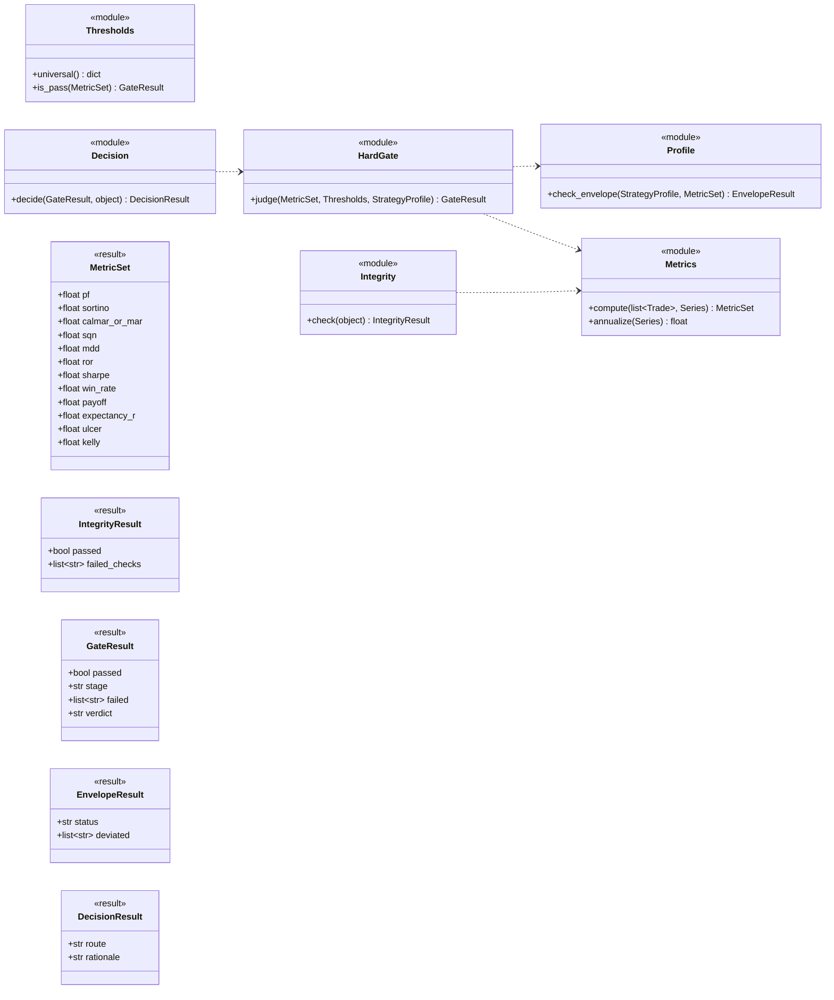
```mermaid
classDiagram
    direction LR
    class Metrics {
        <<module>>
        +compute(list~Trade~, Series) MetricSet
        +annualize(Series) float
    }
    class Integrity {
        <<module>>
        +check(object) IntegrityResult
    }
    class Thresholds {
        <<module>>
        +universal() dict
        +is_pass(MetricSet) GateResult
    }
    class Profile {
        <<module>>
        +check_envelope(StrategyProfile, MetricSet) EnvelopeResult
    }
    class HardGate {
        <<module>>
        +judge(MetricSet, Thresholds, StrategyProfile) GateResult
    }
    class Decision {
        <<module>>
        +decide(GateResult, object) DecisionResult
    }
    class MetricSet {
        <<result>>
        +float pf
        +float sortino
        +float calmar_or_mar
        +float sqn
        +float mdd
        +float ror
        +float sharpe
        +float win_rate
        +float payoff
        +float expectancy_r
        +float ulcer
        +float kelly
    }
    class IntegrityResult {
        <<result>>
        +bool passed
        +list~str~ failed_checks
    }
    class GateResult {
        <<result>>
        +bool passed
        +str stage
        +list~str~ failed
        +str verdict
    }
    class EnvelopeResult {
        <<result>>
        +str status
        +list~str~ deviated
    }
    class DecisionResult {
        <<result>>
        +str route
        +str rationale
    }
    HardGate ..> Profile
    HardGate ..> Metrics
    Decision ..> HardGate
    Integrity ..> Metrics
```

#### `Metrics`

- **개요** — 성과 수식의 유일한 표준(모듈).
- **책임** — net 손익 거래열과 equity 시계열로 성과 지표 집합(`MetricSet`)을 계산한다. 상위 분석은 금액이 아니라
  R-multiple(`R = 거래손익 / 1R`)로 하며, 현행 이중 구현을 이 한 곳으로 흡수한다.
- **상속관계** — 없음(모듈).
- **필드** — 없음(모듈).
- **메서드**
    - `compute(trades, equity)` : 아래 수식을 정확히 구현해 지표 집합을 낸다.
        - **승률·손익비** — 승률 `p = N_W / N`, 패율 `q = 1 − p`. 평균 수익 `W̄ = (1/N_W)·Σ_{i∈W} x_i`, 평균
          손실 `L̄ = (1/N_L)·Σ_{i∈L} |x_i|`. 손익비 `B = W̄ / L̄`.
        - **기대값** — `E = p·W̄ − q·L̄`, R 기준 `E_R = p·R̄₊ − q·|R̄₋|`(양수여야 채택 1차 관문 통과).
        - **Profit Factor** — `PF = 총수익 / 총손실 = Σ_{i∈W} x_i / Σ_{i∈L} |x_i|`. 같은 데이터에서
          `PF > 1 ⇔ E > 0`.
        - **Sharpe(연율)** — `√K · ē / s_e`, `e_t = r_t − r_f`, `s_e`는 표본표준편차(ddof=1). 단독 탈락 기준으로
          쓰지 않는다.
        - **Sortino(연율)** — `√K · (r̄ − T) / σ_d`, `σ_d = √( (1/N)·Σ min(0, r_t − T)² )`. **분모는 반드시
          전체 관측 수 N**(음수 수익률만의 표준편차는 틀린 계산이라 Sortino를 부풀린다).
        - **MDD** — `M_t = max_{s≤t} V_s`, `DD_t = V_t/M_t − 1`, `MDD = min_t DD_t`. running-max 이후 저점
          기준이며 보유 중 캔들의 불리 극값(intrabar)을 마크에 포함한다(종가만 보면 낙폭이 과소해져 Calmar가
          과대해지고 통과선을 오통과한다).
        - **Ulcer Index** — `UI = √( (1/T)·Σ D_t² )`, `D_t = 100·(V_t/M_t − 1)`.
        - **Calmar / MAR** — 둘 다 `CAGR / |MDD|`이며 측정 기간만 다르다. Calmar는 최근 36개월, MAR은 전체
          기간이며, 36개월 미만이면 MAR로 산정하고 산정 기간을 메타에 명시한다(두 이름 혼용 금지).
        - **SQN** — `SQN = √N · R̄ / s_R`, `s_R`는 표본표준편차(ddof=1). **`√N`의 N은 `min(N, 100)`으로 캡**하고
          표본 `N < 30`이면 무효다(t-통계량이라 거래 수 인플레를 막는다).
        - **Kelly** — `f* = p − (1−p)/B`(사이징 상한과 같은 정의, Full 금지·Quarter~Half 상한).
        - **Risk of Ruin** — R-multiple 분포 **몬테카를로**(고정 seed)로 추정한다. 단순 `(q/p)^B`는 저승률·고손익비
          에서 무조건 파산 100%를 줘 금지한다.
    - `annualize(series)` : 연율화. equity를 **일간으로 리샘플한 뒤 √365**를 적용한다(`K = 365`). 1시간 등 하위 TF
      수익률에 √365를 직접 적용하지 않고(계수 선택으로 Sortino가 수 배 달라져 판정이 뒤집힌다), √252(전통 선물)와도
      혼용하지 않는다.
- **불변식** — 성과 수식은 이 한 곳이 유일 표준이라 이중 구현을 흡수한다. 모든 손익은 net이고 상위 분석은
  R-multiple로 한다.

#### `Thresholds`

- **개요** — 통과선의 단일 코드 구현(모듈).
- **책임** — 형태 무관 구속(모든 전략에 그대로 적용)과 형태 의존(전략 프로파일 기대 범위 대조)으로 갈리는 통과선을
  소유하고 `MetricSet`이 통과인지 판정한다. 수익성 판정은 언제나 `E_R > 0`(= `PF ≥ 1.3`)가 하며, 승률·Payoff는
  형태 확인용이라 단독 탈락 기준이 아니다(저승률·고손익비와 고승률·저손익비를 같은 절대선으로 재면 한쪽이 부당
  탈락한다).
- **상속관계** — 없음(모듈).
- **필드** — 통과선·목표선·과최적화 경보 수치. 아래가 확정값이다(net·가능하면 OOS·거래 수 `N ≥ 30`, 이상적
  `≥ 100` 전제).

| 지표 | 유형 | 통과선(이하 탈락) | 목표선 | 과최적화 경보 |
|---|---|---|---|---|
| Profit Factor | 형태 무관 구속 | `< 1.3` | `≥ 1.5` | `≥ 3.0` 자동채택 금지 |
| Sortino | 형태 무관 구속 | `< 1.0` | `≥ 1.5` | — |
| Calmar / MAR | 형태 무관 구속 | `< 0.8` | `≥ 1.0` (우수 `≥ 2.0`) | 얕은 MDD + 고CAGR |
| SQN | 형태 무관 구속(유의성) | `< 1.6` | `≥ 2.0` | `≥ 3.0` 재확인 |
| MDD | 형태 무관 구속 | `> 30%` | `≤ 20%` | `< 5%` + 고CAGR |
| Risk of Ruin | 형태 무관 구속(생존) | `≥ 0.1%` | `< 0.1%` | — |
| Sharpe | 참고(단독 탈락 금지) | — | `≥ 1.0` | `> 2.5` 검증 |
| 승률(Win Rate) | 형태 의존(프로파일 대조) | — | 프로파일 기대 범위 | — |
| Payoff Ratio | 형태 의존(프로파일 대조) | — | 프로파일 기대 범위 | `> 5` + 극저승률 |
| 과최적화 방어(OOS·PSR) | 형태 무관 구속(§4.4 Harness가 적용) | OOS Degradation `≥ 50%` · PSR `< 0.95` | OOS Degradation `< 50%` · PSR `≥ 0.95` | — |

- **메서드**
    - `universal()` : 형태 무관 통과선 수치(위 표의 확정값)를 돌려준다.
    - `is_pass(metric_set)` : 지표 집합이 통과선을 넘는지 판정해 `GateResult`를 낸다.
- **불변식**
    - **사이징 연동** — MDD가 통과선(30%)을 벗어나면 신호가 아니라 `risk_per_trade`·유닛 한도를 낮춘다. 파산확률이
      `0.1%` 이상이면 같은 레버를 당긴다. 실전 감내 한도는 45%(파산선 60%와 분리)이고, 백테스트 MDD는 하한이라
      실전 가정 `= 백테스트 × 1.5`다.
    - **과최적화 방어는 Harness(§4.4)가 적용한다(단일 run 밖).** OOS Degradation·확률적 샤프(PSR)/DSR·Walk-Forward·
      몬테카를로·부트스트랩 신뢰구간은 여러 run·분할에 걸친 교차검증이라, 단일 run 지표만 담는 `MetricSet`으로는
      계산할 수 없다. 그래서 이 게이트는 `eval.HardGate`·`is_pass`가 아니라 Harness(§4.4)가 산출·적용하며 위 표의
      '과최적화 방어' 행도 그 자리에서 강제된다. 통과 기준은 표본 외 성과 저하가 표본 내의 50% 미만
      (OOS Degradation `< 50%`)이고 다중검정 보정 후 PSR이 95% 신뢰(`≥ 0.95`)를 넘는 것이며, DSR의 정확한 다중검정
      보정 셈도 Harness 설계(§4.4)가 소유한다. `eval` 계층은 단일 run의 형태 무관 통과선(PF·Sortino·Calmar·SQN·MDD·
      RoR)과 프로파일 대조만 판정한다.

#### `Profile`

- **개요** — 프로파일 기대 범위 대조를 소유하는 곳.
- **책임** — 프로파일 기대 범위를 실현값과 대조한다. 기대 범위의 스키마 자체는 §4.2의 `StrategyProfile`이 정의하고,
  여기서는 그 값을 실현값과 대조하는 소비 규칙만 갖는다.
- **상속관계** — 없음(모듈).
- **필드** — 없음(모듈).
- **메서드**
    - `check_envelope(profile, metric_set)` : 프로파일 기대 범위와 실현 지표를 대조해 `EnvelopeResult`를 낸다.
- **불변식**
    - 기대 범위 이탈은 기본이 warning이며 단독 탈락 기준이 아니다.
    - `established` 전략이 그 형태를 잃은 회귀에만 reject한다. `provisional`·`updating`은 reject하지 않는다 — 아직
      확립되지 않은 기대 범위로 신규 전략을 탈락시키는 순환 논리를 막기 위해서다.

#### `Integrity`

- **개요** — 판정 전 무결성 검사(판정 3단계의 첫 단계).
- **책임** — 판정 전에 여섯 가지를 검산하며, 하나라도 실패하면 `diagnostic_only`로 **멈춰서** 데이터·기록을 고쳐
  재실행한다 — 파이프라인의 유일한 정지다. 지표의 벡터화↔증분 일치는 run-time 검사가 아니라 §4.1.2의 빌드-타임
  일치 테스트가 담당하므로 이 여섯 검사에는 넣지 않는다.
- **상속관계** — 없음(모듈).
- **필드** — 없음(모듈).
- **메서드**
    - `check(evidence)` : 아래 여섯 가지를 검산해 `IntegrityResult`를 낸다.
        - **회계 항등식** — `cash + position = equity`가 모든 시점에 성립하는가.
        - **시점 순서** — `feature_ts ≤ decision_ts < execution_ts`를 어긴 거래가 없는가(look-ahead 사후 검증).
        - **비용 1회 차감** — 각 비용이 중복 차감되지 않았는가.
        - **net-of-cost** — 기록된 손익이 net인가("비용 0 가정"의 잔재가 없는가).
        - **결정성** — 같은 입력·같은 seed가 같은 정규화 해시를 내는가.
        - **Evidence 완성도** — 판정에 필요한 시점별 기록이 빠짐없이 남았는가.
- **불변식** — 여섯 검사 중 하나라도 실패하면 파이프라인이 `diagnostic_only`로 멈춘다(유일한 정지). 통과 전에는
  `HardGate`·`Decision`으로 넘어가지 않는다.

#### `HardGate`

- **개요** — 판정 3단계의 두 번째. 형태 무관 통과선(A)과 프로파일 기대 범위(B)로 전략을 거른다.
- **책임** — 무결성을 통과한 run을 두 관문으로 판정한다. Hard Gate A는 형태 무관 통과선(`Thresholds`)으로, Hard
  Gate B는 프로파일 기대 범위(`Profile`)로 판정한다. Hard Gate A 미달(`not_promotable`)과 B의 `established` 회귀
  파손은 모두 개선 루프(forensics)로 보낸다 — 통과선만으로 전략을 포기하지 않는다. 과최적화 방어(OOS·PSR·WFA·MC)는
  단일 run 밖 교차검증이라 이 클래스가 아니라 Harness(§4.4)가 적용하며, 이 클래스는 단일 run 지표(`MetricSet`)의
  형태 무관 통과선과 프로파일 대조만 판정한다.
- **상속관계** — 없음(모듈).
- **필드** — 없음(모듈).
- **메서드**
    - `judge(metric_set, thresholds, profile)` : Hard Gate A(형태 무관 통과선)와 B(프로파일 기대 범위)를 차례로
      적용해 `GateResult`를 낸다. A의 통과선 수치는 `Thresholds`의 표가 정본이다.
- **불변식** — 미달·회귀는 종료가 아니라 forensics로 보낸다. A와 B를 모두 통과한 run만 `Decision`으로 넘어간다.

#### `Decision`

- **개요** — 판정 3단계의 마지막. 사전등록 기준으로 최종 라우팅한다.
- **책임** — Hard Gate를 모두 통과한 run을 사전등록의 Primary Metric·성공/실패 기준과 대조해
  `promote`·`partial_keep`·`retest`·`abandon`으로 라우팅한다.
- **상속관계** — 없음(모듈).
- **필드** — 없음(모듈).
- **메서드**
    - `decide(gate_result, prereg)` : 사전등록 기준과 대조해 최종 라우팅(`DecisionResult`)을 낸다.
- **불변식** — `promote`만 Live로 가고 `partial_keep`·`retest`는 개선 루프로 보낸다. `abandon`(종료)은 엣지를
  구분할 수 없다고 확정될 때만 낸다.

#### `MetricSet`

- **개요** — `Metrics.compute`가 내는, 한 run의 성과 지표 묶음.
- **책임** — 통과선 판정·프로파일 대조·최종 판정이 소비하는 성과 지표 값을 담는다. 각 값의 계산식 자체는 `Metrics`가
  정의한다.
- **상속관계** — 없음(결과 값 타입).
- **필드** — 통과선 표에 나오는 지표 값들(Profit Factor·Sortino·Calmar/MAR·SQN·MDD·Risk of Ruin·Sharpe·승률·
  Payoff), R 기준 기대값(`expectancy_r`), 그리고 통과선에는 없지만 `Metrics.compute`가 함께 내는 정보값 `ulcer`·
  `kelly`(포렌식·참고용). 각 값의 정의·단위·경계는 `Metrics`를 따른다.
- **메서드** — 없음(순수 값).
- **불변식** — 모든 손익 지표는 net 기준이다(`Metrics`가 강제).

#### `IntegrityResult`

- **개요** — `Integrity.check`가 내는 무결성 검사 결과.
- **책임** — 여섯 검사의 통과 여부와 실패 항목을 담아, 하나라도 실패면 파이프라인을 `diagnostic_only`로 멈추는 근거가
  된다.
- **상속관계** — 없음(결과 값 타입).
- **필드** — `passed`(전체 통과 여부), `failed_checks`(실패한 검사 이름 목록 — 회계 항등식·시점 순서·비용 1회·net·
  결정성·완성도 중).
- **메서드** — 없음(순수 값).
- **불변식** — `passed`가 거짓이면 Hard Gate·Decision으로 넘어가지 않는다.

#### `GateResult`

- **개요** — `Thresholds.is_pass`·`HardGate.judge`가 내는 게이트 판정 결과.
- **책임** — 통과 여부와, 어느 단계(A/B)에서 무엇이 미달·회귀했는지를 담는다.
- **상속관계** — 없음(결과 값 타입).
- **필드** — `passed`(통과 여부), `stage`(Hard Gate A/B), `failed`(미달 통과선 목록), `verdict`(`pass`·
  `not_promotable`·`established_regression` 중 — 저장 문자열은 카탈로그 요약의 `gate_verdict`와 동일하다).
- **메서드** — 없음(순수 값).
- **불변식** — 미달·회귀 판정은 종료가 아니라 개선 루프(forensics)로 가는 경로를 뜻한다(`HardGate` 참조).

#### `EnvelopeResult`

- **개요** — `Profile.check_envelope`가 내는 프로파일 기대 범위 대조 결과.
- **책임** — 실현 지표가 프로파일 기대 범위 안인지, 이탈했는지를 담는다.
- **상속관계** — 없음(결과 값 타입).
- **필드** — `status`(`in_range`·`warning`·`reject` 중), `deviated`(이탈한 형태 지표 목록).
- **메서드** — 없음(순수 값).
- **불변식** — 이탈은 기본이 `warning`이고, `reject`는 `established` 전략의 회귀에만 붙는다(`Profile` 참조).

#### `DecisionResult`

- **개요** — `Decision.decide`가 내는 최종 라우팅 결과.
- **책임** — 사전등록 기준 대조 결과를 담아 다음 행선지를 정한다.
- **상속관계** — 없음(결과 값 타입).
- **필드** — `route`(`promote`·`partial_keep`·`retest`·`abandon` 중), `rationale`(판정 근거).
- **메서드** — 없음(순수 값).
- **불변식** — `promote`만 Live로 가고 `abandon`은 엣지 구분 불가가 확정될 때만 나온다(`Decision` 참조).

#### 판정 파이프라인 플로우

사전등록부터 최종 라우팅까지의 공식 판정 흐름이다. 통과선 미달과 프로파일 회귀는 종료가 아니라 개선
루프(forensics)로 보내는 것이 핵심이다 — 통과선만으로 전략을 포기하지 않는다.

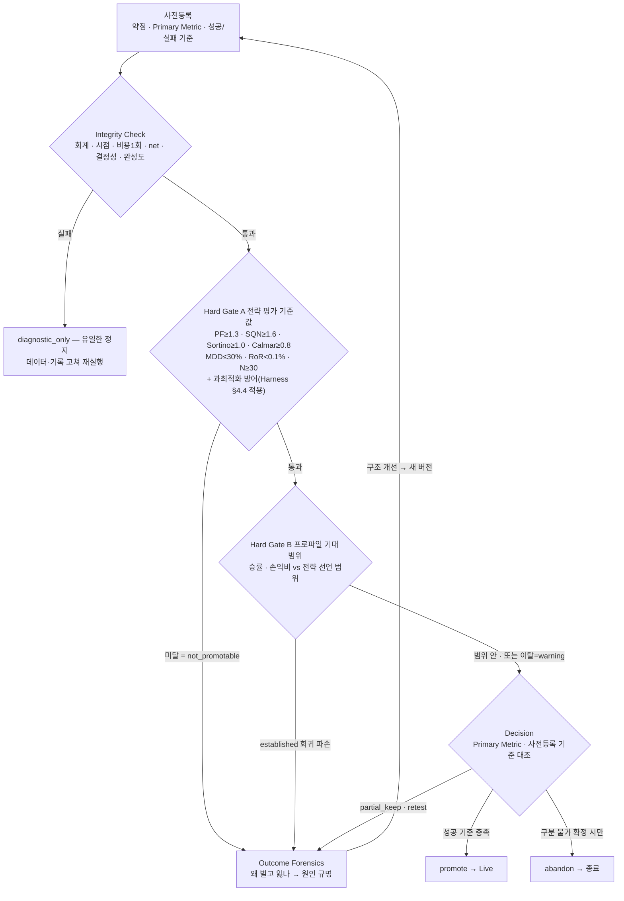
```mermaid
flowchart TD
    PRE["사전등록<br/>약점 · Primary Metric · 성공/실패 기준"] --> INT{"Integrity Check<br/>회계 · 시점 · 비용1회 · net · 결정성 · 완성도"}
    INT -->|"실패"| DIAG["diagnostic_only — 유일한 정지<br/>데이터·기록 고쳐 재실행"]
    INT -->|"통과"| HGA{"Hard Gate A 전략 평가 기준값<br/>PF≥1.3 · SQN≥1.6 · Sortino≥1.0 · Calmar≥0.8<br/>MDD≤30% · RoR&lt;0.1% · N≥30<br/>+ 과최적화 방어(Harness §4.4 적용)"}
    HGA -->|"미달 = not_promotable"| FOR["Outcome Forensics<br/>왜 벌고 잃나 → 원인 규명"]
    HGA -->|"통과"| HGB{"Hard Gate B 프로파일 기대 범위<br/>승률 · 손익비 vs 전략 선언 범위"}
    HGB -->|"established 회귀 파손"| FOR
    HGB -->|"범위 안 · 또는 이탈=warning"| DEC{"Decision<br/>Primary Metric · 사전등록 기준 대조"}
    DEC -->|"성공 기준 충족"| PRO["promote → Live"]
    DEC -->|"partial_keep · retest"| FOR
    DEC -->|"구분 불가 확정 시만"| ABD["abandon → 종료"]
    FOR -->|"구조 개선 → 새 버전"| PRE
```

읽는 법: 정지는 무결성 실패(`diagnostic_only`) 하나뿐이다. Hard Gate A 미달과 B의 established 회귀 파손은 모두
forensics로 가 개선 루프를 돌고, 둘 다 통과한 run만 Decision이 사전등록 기준으로 `promote`·`partial_keep`·
`retest`·`abandon`으로 라우팅한다. `abandon`(종료)은 엣지를 구분할 수 없다고 판정될 때만 나온다. Hard Gate A의
숫자는 위 통과선 표가 정본이고, 성과 집중도·비용 민감도 등 일부는 설정으로 조정된다. 단, 과최적화 방어(OOS·PSR·
WFA·MC)는 여러 run·분할에 걸친 교차검증이라 `eval`이 아니라 Harness(§4.4)가 산출·적용하며, `eval.HardGate`는 단일
run의 형태 무관 통과선과 프로파일 대조만 판정한다.

## §4.4 backtest-service 클래스 — Engine·포트 어댑터·설정·Harness (+ 캔들 루프·1분 집행 시퀀스)

**이 절의 자리.** §4.1~§4.3은 세 실행 모드가 공유하는 `core-lib`의 도메인 클래스를 확정했다. `core-lib`는 계산
방법만 담을 뿐 스스로 돌지 않는다. §4.4는 그 표준을 **실제로 돌리는 유일한 신규 서비스 `backtest-service`**의
클래스를 확정한다 — 한 번의 백테스트 run을 시작에서 끝까지 구동하는 부품들이다. run의 결과를 저장하는 출력 두
어댑터(`EvidenceSink`·`CatalogStore` 구현)는 다음 절(§4.5)이 맡는다.

**무엇으로 이뤄지나(큰 것부터).** `backtest-service`는 네 부품으로 이뤄지고, 모두 `Engine`을 가운데 두고 한 번의
run을 굴리는 데 협력한다.

- **`Engine` — 중심 구동부.** 확정 캔들을 시간 순서로 돌리며 지표 갱신·전략 판단·사이징·체결·저장·판정을 정해진
  순서로 호출한다. 도메인 로직은 하나도 갖지 않고 전부 `core-lib`을 불러 쓰며(다른 서비스는 import하지 않는다),
  `Engine`이 소유하는 것은 "무엇을 어떤 순서로 언제 부르는가"라는 실행 순서뿐이다.
- **포트 어댑터 다섯 — 인프라 경계.** 환경(백테스트·페이퍼·라이브)에 따라 구현이 갈리는 다섯 외부 의존성 —
  데이터 공급·체결·시각·비용값·전략 목록 — 을 도메인 바깥으로 격리한다. 각각 `ports`의 추상 계약(§4.3.4)을
  backtest용으로 구현한 어댑터이고, `Engine`은 그 구현이 아니라 포트 추상에 의존하며(의존성 역전) 어댑터를
  의존성 주입으로 받아 쓴다.
- **설정(`ConfigLayer`의 `RunConfig`) — run 준비.** run 설정(구간·심볼·비용값·계산 모드·트리거 세밀도 등)을
  검증해 `Engine`에 주입한다. 전략 파라미터 검증은 여기 두지 않고 `core-lib`에 맡겨, 같은 설정이 backtest와
  라이브에서 같은 검증을 받게 한다.
- **`Harness` — 상위 반복 검증.** 단일 run 밖의 과최적화 방어(표본 내/외 분리·워크포워드·몬테카를로·확률적 샤프·
  파라미터 스윕)를 오케스트레이션한다. 개별 run은 `Engine`을 재사용해 돌린다.

**이 절이 새로 정하는 불변식.** 여기서 새로 정하는 규칙은 성격에 따라 세 가지로 나뉜다. 세 규칙 모두 코드 전반에
거는 막연한 원칙이 아니라, 각각 정해진 한 자리에만 적용된다. 첫째, **캔들 루프 순서 규칙**은 `Engine`이 캔들을
처리하는 순서에 관한 것으로, 정해진 순서를 지켜 미래 데이터를 미리 보는 look-ahead를 막는다. 둘째, **유효성 규칙**은
평가를 시작하는 워밍업 구간에 관한 것으로, 지표가 충분히 쌓여 믿을 수 있는 값이 된 뒤에만 판단하게 한다. 셋째,
**결정성 규칙**은 실행할 때마다 달라질 수 있는 시각과 난수에 관한 것으로, 그 둘을 고정해 같은 입력이면 언제나 같은
결과가 나오게 한다.

- **캔들 루프 순서 규칙** — `Engine`의 캔들 루프(`step_open`·`step_close`·`walk_triggers`, §4.4.1)가 지키는 캔들
  처리 순서다. 이 순서 자체가 look-ahead를 막고, 각 체결·트리거의 atomic 규칙은 `core-lib`의 `execution.matcher`
  (§4.3.1)가 소유한다.
    - **캔들 두 순간의 고정 순서** — 한 확정 캔들 `t`를 여는 순간(open_time)과 닫는 순간(close_time)으로 나눠, 지난
      캔들이 남긴 체결·트리거를 여는 순간에, 이번 캔들의 판단을 닫는 순간에 한다. 이 순서를 바꾸면 look-ahead가
      생긴다.
    - **결정 < 체결(next-bar)** — 신호는 캔들 `t` 종가에 만들지만 체결은 `t+1` 시가에만 일어난다(`decision_ts <
      execution_ts`, 결정에 쓴 캔들로 체결하지 않는다). `core-lib`의 `execution.matcher`(§4.3.1)가 이 규칙을
      소유하고, `Engine`은 종가에 만든 주문 요청을 다음 시가까지 들고 있다가 그때 `Broker.submit()`을 호출해
      순서를 강제한다.
    - **캔들 내 트리거는 1분 집행 피드를 시간 순서로** — 손절·트레일링·익절·청산 채널·강제청산의 캔들 내 발동은
      전략 TF 캔들의 고저가 아니라 `t` 구간의 1분 하위 캔들을 시간 순서로 훑어 판정하고, 어떤 포지션도 자기 체결
      하위 캔들 이전으로 소급 검사하지 않는다. 이 1분 트리거 walk와 트레일링 파리티 허용 편차를 이 절이 확정하되,
      첫 검증 스코프는 이를 소비하는 전략(트레일링 단독 출구 전략)이 없어 재유보하고 보수적 TF 캔들 판정을 기본으로
      둔다(아래 `Engine`의 트리거 walk 규약).
    - **동시 도달 손절 우선(보수적 최악 경로)** — 같은 하위 캔들에서 손절과 익절이 모두 범위 안이면 손절 우선이다.
      이 우선순위는 `execution.matcher.resolve_triggers`(§4.3.1)가 소유하고 `Engine`은 그 판정을 구동만 한다.
- **유효성 규칙** — `Engine.preload`(§4.4.1)가 평가 구간 시작 전 워밍업에서만 적용한다. 지표가 덜 쌓인 워밍업
  값으로는 진입·청산을 판단하지 않는다.
    - **preload는 캔들을 데우고, discard는 그 구간의 신호만 버린다** — preload와 discard는 서로 다른 것을 다룬다.
      지표(예: EMA 200)는 앞선 캔들이 충분히 쌓여야 믿을 값이 되므로, 평가 구간 시작 **이전**의 실제 과거 캔들
      `max(전략 min_history, 지표 최장 워밍업)`개를 미리 흘려보내 지표를 데운다(캔들 preload). 반면 버리는 것은 그
      preload 구간에서 나온 **신호**다 — 그 구간은 평가 대상 기간이 아니라 지표를 데우려고 둔 것이기 때문이다.
      그래서 평가 구간은 첫 캔들부터 이미 데워진 지표로 판단한다. preload 없이 평가 구간 안에서 데우면 앞쪽 워밍업
      길이만큼의 캔들이 유효하지 않은 값이 되어 그만큼 평가 구간을 잃는다.
- **결정성 규칙** — 코드 전체가 아니라 세 지점에만 적용한다. 시각은 `BacktestClock`(§4.4.2)이, 난수 고정 seed는
  몬테카를로·부트스트랩을 도는 `Harness`(§4.4.4)가, 재현 확인용 정규화 Evidence 해시는 `BacktestEvidenceSink.finalize`
  (§4.5)가 맡는다.
    - **시각과 난수만 고정하면 된다** — 캔들 루프·지표·체결은 난수 없는 순수 계산이라 같은 입력이면 저절로 같은
      값이 나온다. 그래서 실행마다 달라질 수 있는 곳은 시각과 난수 둘뿐이다. 시각은 실제 시각(wall-clock) 대신 시뮬
      캔들 시각만 쓴다. 난수는 몬테카를로·부트스트랩에서만 쓰는데, 난수 생성기에 고정 seed를 주면 매번 똑같은 난수
      순서가 재현되므로(seed가 같으면 뽑히는 값도 같다) 그 seed를 고정해 둔다. 고정 seed는 한 run이 만드는 수천
      표본 묶음을 run마다 똑같이 재현할 뿐 표본 수를 줄이지 않으므로, 여러 표본의 분포로 위험을 보는 몬테카를로의
      목적은 그대로다(표본 추출에서 오는 불확실성은 부트스트랩 신뢰구간이 따로 정량화한다). 이 둘만 고정하면 같은
      입력·같은 seed는 언제나 같은 정규화 Evidence 해시를 낸다.

### §4.4.1 `Engine` 컴포넌트 (+ 캔들 루프·1분 트리거 walk 시퀀스)

결정적 실행 드라이버이자 입출력 오케스트레이터. 다이어그램은 `Engine`과 그 실행 결과 값 타입 `RunResult`, 그리고
`Engine`이 주입받는 포트(§4.3.4 ABC)와 소비하는 `core-lib` 컴포넌트의 관계를 담는다. 포트 ABC와 `execution`·
`costs`·`sizing`·`eval`·`Adapter Manager`는 이미 정의된 자리를 참조하는 노드이며 여기서 다시 정의하지 않는다.

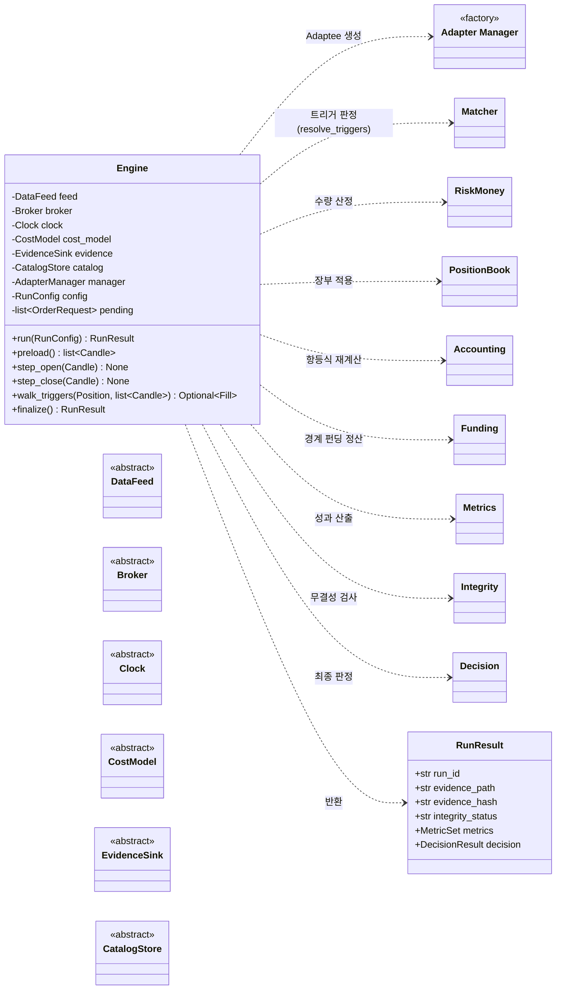
```mermaid
classDiagram
    direction LR
    class Engine {
        -DataFeed feed
        -Broker broker
        -Clock clock
        -CostModel cost_model
        -EvidenceSink evidence
        -CatalogStore catalog
        -AdapterManager manager
        -RunConfig config
        -list~OrderRequest~ pending
        +run(RunConfig) RunResult
        +preload() list~Candle~
        +step_open(Candle) None
        +step_close(Candle) None
        +walk_triggers(Position, list~Candle~) Optional~Fill~
        +finalize() RunResult
    }
    class RunResult {
        +str run_id
        +str evidence_path
        +str evidence_hash
        +str integrity_status
        +MetricSet metrics
        +DecisionResult decision
    }
    class DataFeed { <<abstract>> }
    class Broker { <<abstract>> }
    class Clock { <<abstract>> }
    class CostModel { <<abstract>> }
    class EvidenceSink { <<abstract>> }
    class CatalogStore { <<abstract>> }
    class AdapterManager["Adapter Manager"] { <<factory>> }
    Engine ..> AdapterManager : Adaptee 생성
    Engine ..> Matcher : 트리거 판정(resolve_triggers)
    Engine ..> RiskMoney : 수량 산정
    Engine ..> PositionBook : 장부 적용
    Engine ..> Accounting : 항등식 재계산
    Engine ..> Funding : 경계 펀딩 정산
    Engine ..> Metrics : 성과 산출
    Engine ..> Integrity : 무결성 검사
    Engine ..> Decision : 최종 판정
    Engine ..> RunResult : 반환
```

> `DataFeed`·`Broker`·`Clock`·`CostModel`·`EvidenceSink`·`CatalogStore`는 §4.3.4가 정의한 추상 계약(ABC)이고,
> `RiskMoney`는 §4.3.3, `Matcher`·`PositionBook`·`Accounting`은 §4.3.1, `Funding`은 §4.3.2, `Metrics`·`Integrity`·
> `Decision`·`MetricSet`·`DecisionResult`는 §4.3.5, `Adapter Manager`는 §4.2가 정의한다. 위 다이어그램은
> 이들을 소비 대상 참조 노드로만 두고 재정의하지 않는다. `Engine`이 포트를 필드로 들고 있으므로(주입) 그 의존은
> 속성 타입이 이미 보여 주어 화살표를 겹쳐 긋지 않고, 화살표는 시그니처에 드러나지 않는 소비 관계만 그린다.

#### `Engine`

- **개요** — 확정 캔들을 시간 순서로 돌리는 결정적 실행 드라이버이자 입출력 오케스트레이터.
- **책임** — 사전등록·run_id 발급·워밍업 preload·피드 push·전략 판단·사이징·체결·2계층 저장·finalize·판정 호출을
  한 흐름으로 엮는다. 도메인 로직(전략·지표·사이징·비용 수식·체결 규칙·평가)은 소유하지 않고 전부 `core-lib`을
  호출해 쓰며, 데이터·체결·시각·기록·전략 목록은 전부 주입된 포트 어댑터로만 접근한다. 캔들 루프의 두 순간 순서와
  1분 트리거 walk의 순서를 소유한다(순서 자체가 look-ahead 방지 장치라 `Engine`이 소유해야 한다).
- **상속관계** — 없음(구체 드라이버. 포트 ABC를 상속하지 않고 주입받아 소비한다).
- **필드**
    - `feed`·`broker`·`clock`·`cost_model`·`evidence`·`catalog` — 주입된 여섯 포트 어댑터. 타입은 §4.3.4의 ABC이고
      실체는 backtest 구현 어댑터(§4.4.2·§4.5)다.
    - `manager` — `Adapter Manager`(§4.2). `strategy_id`·파라미터로 Adaptee를 생성한다. 내부적으로 주입된
      `StrategyRegistry` 어댑터(§4.4.2)를 통해 전략 목록에 접근한다.
    - `config` — 검증을 마친 `RunConfig`(§4.4.3).
    - `pending` — 직전 캔들 종가에 산출해 다음 캔들 시가에 체결할 주문 요청 목록. 보통 0개(신호 없음)나 1개이고,
      리버설이면 청산 주문과 반대 진입 주문을 그 순서로 담는다. 이 한 칸 지연이 `decision_ts < execution_ts`를
      구조로 강제하며, `step_open`이 이 목록을 담긴 순서대로 체결한 뒤 비운다(이중 체결 방지).
- **메서드**
    - `run(config)` : run 하나를 처음부터 끝까지 구동해 `RunResult`를 낸다. 사전등록 기록과 `run_id` 발급으로 열고
      (§4.5의 저장 시퀀스), preload→캔들 루프→finalize 순으로 진행한다.
    - `preload()` : 평가 구간 시작 전에 `max(전략 min_history, 지표 최장 워밍업)` 캔들을 `DataFeed`로 별도 preload
      해 지표 상태를 워밍업한다. 이 구간에서 만들어진 신호는 버린다(discard). 반환은 워밍업에 쓴 캔들 목록이다.
    - `step_open(t)` : 캔들 `t`가 열리는 순간의 일. `Clock`이 `t` 시가에 있을 때 호출된다. `pending`의 주문을 담긴
      순서대로 `Broker.submit`해 `t` 시가에 체결하고 각 체결마다 `position_book.apply`·`accounting.recompute`로 장부·
      항등식을 갱신하며 Execution을 기록한 뒤 `pending`을 비운다(포지션·자산곡선 행은 체결마다가 아니라 캔들마다
      종가 마킹 시점에 한 번 적는다 — 기록 격자 규약은 데이터베이스 설계 §5 소유). 체결로 거래가 열리거나 닫히면 그
      시점의 지표·국면을 Trade Feature Snapshot(진입·청산과 보유 중 최대 불리/유리 편차 시점)으로 함께 남긴다. 리버설이면 청산 주문을 먼저
      체결·정산한 다음 진입 주문을 체결하므로 진입의 마진 가용성은 청산 정산 후 계좌 상태 기준이 된다(리버설의 두
      체결 순서는 `Engine`이 이 순서로 소유하고, 각 체결의 atomic 규칙·마진 부족 시 수량 절삭은 `matcher`가 소유한다).
      그다음 `t` 구간의 1분 하위 캔들에 대해 `walk_triggers`로 기존 포지션의 손절·트레일링·익절·청산·강제청산을
      판정하고(발동하면 신호 없는 판단으로 Decision(`signal_id` 비움)과 Execution·Trade를 기록한다), UTC 정산 경계를
      지나면 `costs.funding.settle`로 펀딩을 부과한다.
    - `step_close(t)` : 캔들 `t`가 닫히는 순간의 일. `Clock`이 `t` 종가로 전진한 뒤 호출된다. `DataFeed`로 `up_to =
      t.close`까지만 받아 지표를 갱신하고 Feature/Indicator Snapshot을 기록한 뒤, `Adaptee.analyze(market_data[t],
      current_position)`로 `TradingSignal`을 받아 Signal·Decision을 기록한다. 진입·청산 신호면 `sizing`으로 수량을
      산출하고 `ExposureLimit`으로 한도를 검사한 뒤 float 주문 요청 `OrderRequest`를 만들어 `pending`에 넣는다(체결은
      다음 `step_open`). preload 구간이면 여기서 만든 신호·주문은 버린다. 진입 후보는 노출 한도 등에 막힌 경우까지
      Candidate Event로, 사전 선언 규칙이 잡은 놓친 기회는 Missed Opportunity로 함께 기록하고, 캔들 종가로 마킹한
      Position·Portfolio/PnL 행을 캔들당 한 번 적는다.
    - `walk_triggers(position, subcandles)` : `t` 구간의 1분 하위 캔들을 시간 순서로 훑어 첫 발동을 찾는다. 대상은
      포지션의 체결 시점 이후 하위 캔들이다 — 체결 하위 캔들 이전은 소급 검사하지 않고, 방금 체결된 포지션은 자기
      체결 하위 캔들 다음 하위 캔들부터 검사 대상이다(legacy `skip_first_sl_check`와 같은 취지). 각 하위 캔들에서
      `Engine`이 `execution.matcher.resolve_triggers`(§4.3.1)를 `cost_model`과 함께 직접 호출해 손절·익절·청산을
      판정하며(트리거 판정은 환경 무관 순수 로직이라 포트를 거치지 않는다), 같은 하위 캔들 안 동시 도달은 손절
      우선이다. 첫 발동 하위 캔들의 `Fill`을 돌려주고 없으면 `None`이다. 아래 트리거 walk 규약이 활성/유보 조건을
      정한다.
    - `finalize()` : 캔들 루프 종료 후 열린 포지션을 마지막 확정 캔들 종가로 강제 정리해
      `Fill(exit_reason=END_OF_DATA)`로 남긴다(그래서 정상 종료 run에 미청산 거래 행이 남지 않는다). 그다음
      `EvidenceSink.finalize`로 결정적 파생(차트 요약·손실/급등 구간·결과 유형 분류·조건 서명·조건별 기대값)과
      무결성 검사·정규화 Evidence 해시를 만들고, `eval`의 성과 산출·판정 3단계를 호출한 뒤 `CatalogStore`에
      요약·판정·해시를 기록한다(§4.5의 저장 시퀀스. Evidence 경로는 `bind` 직후 이미 기록돼 있다). 반환은
      `RunResult`다.
- **불변식**
    - **캔들 두 순간의 고정 순서가 look-ahead를 막는다** — `step_open`(지난 캔들 정산·트리거)과 `step_close`(이번
      캔들 판단)의 순서는 바꿀 수 없다. 판단은 종가에, 체결은 다음 시가에 일어나므로 결정에 쓴 캔들로 체결·검사하는
      일이 구조적으로 불가능하다.
    - **`decision_ts < execution_ts`** — 신호는 `step_close`에서, 체결은 다음 `step_open`에서 일어난다. `pending`의
      한 칸 지연이 이 순서를 강제한다.
    - **워밍업 preload 구간 신호 discard** — preload 구간의 신호·주문은 성과에 반영하지 않는다.
    - **결정성** — 시각은 `Clock`만 공급하고 wall-clock·무제어 난수를 쓰지 않는다. 같은 입력·같은 seed는 같은
      정규화 Evidence 해시를 낸다.

캔들 루프의 두 순간이 어떤 순서로 무엇을 하는지를 한 캔들 `t`에 대해 보인다.

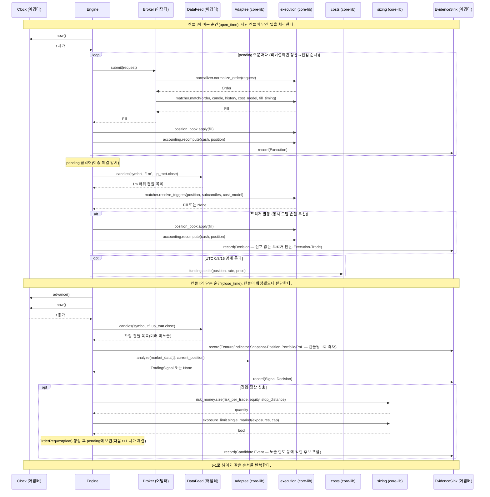
```mermaid
sequenceDiagram
    participant CLK as Clock (어댑터)
    participant ENG as Engine
    participant BR as Broker (어댑터)
    participant DF as DataFeed (어댑터)
    participant AD as Adaptee (core-lib)
    participant EX as execution (core-lib)
    participant CST as costs (core-lib)
    participant SIZ as sizing (core-lib)
    participant EV as EvidenceSink (어댑터)
    Note over CLK,EV: 캔들 t의 여는 순간(open_time). 지난 캔들이 남긴 일을 처리한다.
    ENG->>CLK: now()
    CLK-->>ENG: t 시가
    loop pending 주문마다 (리버설이면 청산→진입 순서)
        ENG->>BR: submit(request)
        BR->>EX: normalizer.normalize_order(request)
        EX-->>BR: Order
        BR->>EX: matcher.match(order, candle, history, cost_model, fill_timing)
        EX-->>BR: Fill
        BR-->>ENG: Fill
        ENG->>EX: position_book.apply(fill)
        ENG->>EX: accounting.recompute(cash, position)
        ENG->>EV: record(Execution)
    end
    Note over ENG: pending 클리어(이중 체결 방지)
    ENG->>DF: candles(symbol, "1m", up_to=t.close)
    DF-->>ENG: 1m 하위 캔들 목록
    ENG->>EX: matcher.resolve_triggers(position, subcandles, cost_model)
    EX-->>ENG: Fill 또는 None
    alt 트리거 발동 (동시 도달 손절 우선)
        ENG->>EX: position_book.apply(fill)
        ENG->>EX: accounting.recompute(cash, position)
        ENG->>EV: record(Decision — 신호 없는 트리거 판단·Execution·Trade)
    end
    opt UTC 0/8/16 경계 통과
        ENG->>CST: funding.settle(position, rate, price)
    end
    Note over CLK,EV: 캔들 t의 닫는 순간(close_time). 캔들이 확정됐으니 판단한다.
    ENG->>CLK: advance()
    ENG->>CLK: now()
    CLK-->>ENG: t 종가
    ENG->>DF: candles(symbol, tf, up_to=t.close)
    DF-->>ENG: 확정 캔들 목록(미래 미노출)
    ENG->>EV: record(Feature/Indicator Snapshot·Position·Portfolio/PnL — 캔들당 1회 격자)
    ENG->>AD: analyze(market_data[t], current_position)
    AD-->>ENG: TradingSignal 또는 None
    ENG->>EV: record(Signal·Decision)
    opt 진입·청산 신호
        ENG->>SIZ: risk_money.size(risk_per_trade, equity, stop_distance)
        SIZ-->>ENG: quantity
        ENG->>SIZ: exposure_limit.single_market(exposures, cap)
        SIZ-->>ENG: bool
        Note over ENG: OrderRequest(float) 생성 후 pending에 보관(다음 t+1 시가 체결)
        ENG->>EV: record(Candidate Event — 노출 한도 등에 막힌 후보 포함)
    end
    Note over CLK,EV: t+1로 넘어가 같은 순서를 반복한다.
```

읽는 법: 여기서 '두 순간'은 한 캔들 `t`가 가진 두 시각을 말한다. 하나는 캔들이 열리는 시각
`Candle.open_time`이고, 다른 하나는 캔들이 닫히는 시각 `Candle.close_time`이다. 둘 다 시각(`datetime`)이며, 가격인
시가·종가는 별도 필드 `Candle.open`·`Candle.close`다. `Engine`은 이 두 시각을 차례로 지나며 그때마다 `Clock`을
전진시킨다.

여는 순간(`Candle.open_time`)에는 지난 캔들이 남긴 일만 처리한다. 직전 종가에 산출해 둔 주문을 이 시가에 체결하고,
기존 포지션의 손절·익절·청산 트리거가 발동했는지 검사하며, 펀딩 정산 경계를 지났으면 펀딩을 부과한다.

닫는 순간(`Candle.close_time`)에는 캔들이 확정됐으니 이제 판단한다. 지표를 `t`까지만 갱신하고, 전략이 그 시점
데이터로 신호를 내며, 진입·청산 신호면 주문을 만든다. 다만 그 주문은 바로 체결하지 않고 `pending`에 넣어 체결을
다음 캔들 시가로 미룬다.

그래서 신호는 종가에, 체결은 다음 시가에 일어나 둘이 절대 같은 캔들에 겹치지 않는다(look-ahead 방지). 데이터·체결·
기록은 전부 포트 어댑터를 거치고, `Engine`은 순서만 소유한다. `analyze`가 `None`을 내면 주문을 만들지 않고, preload
구간이면 이 종가에서 만든 신호·주문은 버린다.

`walk_triggers`가 1분 하위 캔들을 훑는 순서와 발동 우선순위를 보인다.

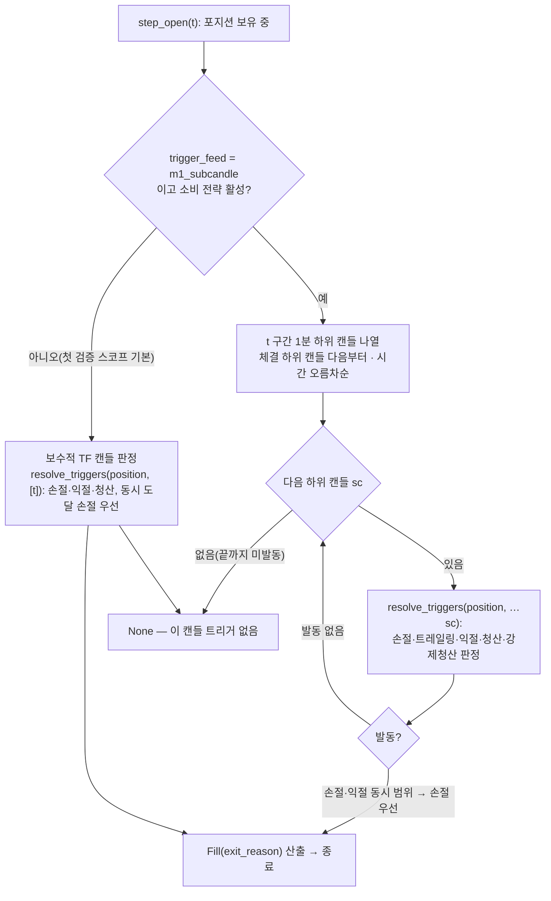
```mermaid
flowchart TD
    START["step_open(t): 포지션 보유 중"] --> HASSUB{"trigger_feed = m1_subcandle<br/>이고 소비 전략 활성?"}
    HASSUB -->|"아니오(첫 검증 스코프 기본)"| TF["보수적 TF 캔들 판정<br/>resolve_triggers(position, [t]): 손절·익절·청산, 동시 도달 손절 우선"]
    HASSUB -->|"예"| SUB["t 구간 1분 하위 캔들 나열<br/>체결 하위 캔들 다음부터 · 시간 오름차순"]
    SUB --> ITER{"다음 하위 캔들 sc"}
    ITER -->|"있음"| CHK["resolve_triggers(position, …sc):<br/>손절·트레일링·익절·청산·강제청산 판정"]
    CHK --> FIRE{"발동?"}
    FIRE -->|"손절·익절 동시 범위 → 손절 우선"| OUT["Fill(exit_reason) 산출 → 종료"]
    FIRE -->|"발동 없음"| ITER
    ITER -->|"없음(끝까지 미발동)"| NONE["None — 이 캔들 트리거 없음"]
    TF --> OUT
    TF --> NONE
```

읽는 법: 트리거 검사에는 두 세밀도가 있다. 기본은 전략 TF 캔들 하나로 손절·익절·청산을 보수적으로 판정하는 길이고,
`trigger_feed = m1_subcandle`이며 그것을 소비하는 전략이 활성일 때만 `t` 구간의 1분 하위 캔들을 시간 오름차순으로
훑는 길이다. 두 세밀도의 차이는 오직 발동을 어느 캔들 고저로 보느냐(TF 캔들 하나냐 1분 하위 캔들 열이냐)일 뿐,
어느 길이든 손절·익절·청산을 함께 판정하고 발동 판정 자체는 `execution.matcher.resolve_triggers`(§4.3.1)가 소유하며
같은 캔들 안 손절·익절 동시 도달은 손절 우선이다. `Engine`은 캔들(또는 하위 캔들 열)을 순서대로 넣어 첫 발동을
찾는 walk만 구동한다. 포지션의 체결 하위 캔들 및 그 이전은 대상에서 빠져 소급 검사가 없다. 1분 길은 첫 발동 하위
캔들의 `Fill`에서 멈춘다.

**트레일링·1분 집행 파리티 허용 편차 (확정).** 라이브는 매분 하위 캔들 폴링으로 트레일링 워터마크·stage와 손절·
청산 출구를 갱신하는데, 캔들 단위 백테스트가 이를 TF 캔들 고저로만 근사하면 출구 가격이 계통적으로 달라진다 —
트레일링이 유일 출구인 전략에서는 이 격차가 노이즈가 아니라 1차 항이다. 그래서 백테스트의 1분 트리거 walk는
라이브의 매분 폴링과 같은 경로(같은 1분 하위 캔들, 같은 손절·트레일링·청산 판정, 같은 손절-우선 우선순위)를
지나며, 두 경로의 출구 가격이 동일 구간에서 아래 허용 편차 안에 들어야 한다.

- **판정 기준** — 같은 1분 데이터·같은 전략 파라미터로 라이브 경로와 백테스트 1분 walk를 돌렸을 때, 거래별 출구
  가격의 상대 편차가 `max(1 price tick, 0.05% = 5bp)` 이하다. 두 경로가 같은 하위 캔들과 같은 판정을 쓰므로 남는
  차이는 부동소수점 반올림 오차와 1분 데이터 정렬 오차뿐이라 이 한계 안이어야 한다.
- **계통 편향 금지** — 거래 집합에 걸친 부호 있는 평균 편차의 절댓값이 `1bp` 이하다(한쪽으로 치우친 편향이 없어야
  한다 — 양쪽 다 1분 경로라 계통 격차가 0에 수렴해야 하기 때문이다).
- **초과 시 처리** — 이 편차를 넘으면 파리티 실패로 보고 run을 공식 평가에서 제외하며(무결성 문제로 취급), 편차의
  분포를 Evidence에 남겨 원인(데이터 정렬·판정 경로 불일치)을 규명한다.
- **활성 조건과 재유보** — 이 규약은 트레일링·1분 경로를 소비하는 전략이 들어올 때 활성화된다. 첫 검증 스코프는
  트레일링 단독 출구 전략을 두지 않아 `trigger_feed` 기본이 보수적 TF 판정이고, 이 파리티 규약은 확정된 채 유보
  상태로 대기한다(구조·허용 편차는 지금 고정하고, 소비 전략이 생기면 그대로 켠다). 활성 시 두 가지를 함께 켠다 —
  트레일링 워터마크·stage 상태는 하위 캔들 사이를 `TrailingState`(§4.2, 유보)로 들고 가고, 펀딩 정산은 walk 밖
  캔들 말미가 아니라 정산 경계를 포함하는 하위 캔들에서 트리거 판정과 같은 시간 순서로 처리해 경계 직전 청산이
  펀딩을 건너뛰지 않게 한다.

### §4.4.2 입력·실행 포트 어댑터 (`DataFeed`·`Broker`·`Clock`·`CostModel`·`StrategyRegistry` 구현)

`core-lib.ports`의 다섯 입력·실행 포트(§4.3.4 ABC)를 backtest용으로 구현한 어댑터. 저장(출력) 두 포트 어댑터
(`EvidenceSink`·`CatalogStore` 구현)는 §4.5가 확정한다. 다이어그램은 다섯 구체 어댑터와 그들이 실현하는 ABC,
그리고 소비하는 `core-lib` 계산 모듈을 담는다. ABC와 `execution`·`costs`는 이미 정의된 참조 노드다.

```mermaid
classDiagram
    direction LR
    class DataFeed { <<abstract>> }
    class Broker { <<abstract>> }
    class Clock { <<abstract>> }
    class CostModel { <<abstract>> }
    class StrategyRegistry { <<abstract>> }
    class BacktestDataFeed {
        -Connection crypto_data
        +candles(str, str, datetime) list~Candle~
        +funding(str, datetime) Decimal
        +mark_price(str, datetime) Decimal
    }
    class BacktestBroker {
        -CostModel cost_model
        -list~Order~ open
        +submit(OrderRequest) Fill
        +open_orders() list~Order~
        +cancel(str) None
    }
    class BacktestClock {
        -datetime cursor
        -Iterator~datetime~ schedule
        +now() datetime
        +advance() None
    }
    class BacktestCostModel {
        -dict params
        +fee(str, Decimal) Decimal
        +slippage(Order, dict) Decimal
        +funding_rate(datetime) Decimal
        +liq_params() dict
    }
    class BacktestStrategyRegistry {
        -Connection signal_db
        +get(str) dict
        +list() list~dict~
        +register(str, dict) None
    }
    BacktestDataFeed ..|> DataFeed
    BacktestBroker ..|> Broker
    BacktestClock ..|> Clock
    BacktestCostModel ..|> CostModel
    BacktestStrategyRegistry ..|> StrategyRegistry
    BacktestBroker ..> Matcher : 체결 규칙(match)
    BacktestBroker ..> Normalizer : float→Decimal 단일 변환
    BacktestBroker ..> Slippage : 슬리피지
```

> `Matcher`·`Normalizer`는 §4.3.1, `Slippage`는 §4.3.2가 정의한다. `DataFeed`·`Broker`·`Clock`·`CostModel`·
> `StrategyRegistry` ABC의 계약과 불변식은 §4.3.4에 있고, 아래 정의서는 backtest 구현이 그 계약을 어떻게 채우는지의
> 잔여만 적는다.

#### `BacktestDataFeed`

- **개요** — `DataFeed`(§4.3.4)의 backtest 구현. 과거 확정 시장 데이터를 그 시점 기준으로 공급한다.
- **책임** — `crypto_data`에서 과거 확정 OHLCV·펀딩 실측·마크 가격을 읽어 전략 TF 캔들로 공급하고, `up_to` 이후
  캔들은 절대 내주지 않는다(look-ahead 구조 배제). 같은 메서드에 `tf = "1m"`을 주면 1분 하위 캔들도 공급하므로,
  1분 집행 피드는 포트 표면을 바꾸지 않고 이 어댑터가 그대로 낸다 — 다만 첫 검증 스코프는 소비 전략이 없어 표면을
  전략 TF 캔들 기준으로 쓴다(재유보). backtest는 읽기만 하고 `crypto_data`에 쓰지 않는다.
- **상속관계** — `DataFeed`(§4.3.4 ABC)를 실현한다.
- **필드** — `crypto_data`는 과거 OHLCV·펀딩을 읽는 읽기 전용 연결이다(쓰기 없음).
- **메서드**
    - `candles(symbol, tf, up_to)` : `up_to` 이후 캔들을 반환하지 않는다. `tf`가 전략 TF면 판단용 캔들, `"1m"`이면
      트리거 walk용 하위 캔들을 낸다.
    - `funding(symbol, up_to)` : 그 시점 기준 과거 실측 펀딩 rate를 공급한다(실측값 소유).
    - `mark_price(symbol, up_to)` : 그 시점 기준 마크 가격을 공급한다.
- **불변식** — `candles`는 `up_to` 이후 캔들을 반환하지 않아 look-ahead를 구조적으로 막는다(ABC 계약을 그대로
  지킨다).

#### `BacktestBroker`

- **개요** — `Broker`(§4.3.4)의 backtest 구현. 결정적 시뮬 체결을 수행한다.
- **책임** — 주문 하나를 결정적으로 체결한다(신규 진입·청산 주문의 시가 체결). 체결 규칙 자체는 소유하지 않고
  `execution.matcher.match`(§4.3.1)를 소비하며, `submit()`은 반드시 `execution.normalizer`를 통과해 float→Decimal
  단일 변환을 달성한다(어댑터 자체 캐스팅 금지). 기존 포지션의 캔들 내 트리거 판정(`resolve_triggers`)은 이 어댑터가
  아니라 `Engine`이 순수 `matcher`를 직접 호출해 수행하므로(환경 무관 로직은 포트를 거치지 않는다) 여기 두지 않고,
  리버설의 두 체결 순서도 `Engine`이 소유한다(이 어댑터는 주문 하나의 atomic 체결만 맡는다).
- **상속관계** — `Broker`(§4.3.4 ABC)를 실현한다.
- **필드**
    - `cost_model` — 주입된 `CostModel` 어댑터. 체결에 수수료·슬리피지를 얹을 때 값의 출처다.
    - `open` — 미체결 주문 목록.
- **메서드**
    - `submit(request)` : float 주문 요청 `OrderRequest`를 받아 `execution.normalizer`로 Decimal `Order`로 변환한 뒤
      `matcher.match`로 다음 캔들 시가에 체결해 `Fill`을 낸다(매수 슬리피지 +, 매도 −). 갭이면 시가 체결에 슬리피지를
      가중하고, 갭으로 마진이 부족하면 `matcher.recompute_qty_and_stop`으로 수량을 절삭한다(주문 거부가 아니라 절삭).
      리버설(청산+반대 진입)의 두 체결 순서와 청산 정산 후 마진 기준은 `Engine`이 청산 주문을 먼저 `submit`한 뒤 진입
      주문을 `submit`하는 순서로 소유하며, 이 `submit`은 그중 주문 하나의 atomic 체결만 맡는다.
    - `open_orders()` : 미체결 주문 목록을 돌려준다.
    - `cancel(id)` : 미체결 주문을 취소한다.
- **불변식** — `submit()`은 반드시 `execution.normalizer`를 통과한다(어댑터 독자 캐스팅 금지, 적합성 테스트로 강제).
  체결은 다음 캔들 시가라 `decision_ts < execution_ts`를 지킨다.

#### `BacktestClock`

- **개요** — `Clock`(§4.3.4)의 backtest 구현. 시뮬 캔들 시각을 결정적으로 공급한다.
- **책임** — 시뮬레이션의 현재 시각을 캔들 두 순간(시가·종가)으로 차례로 옮기며 공급한다. wall-clock을 쓰지 않아
  결정성을 보장한다.
- **상속관계** — `Clock`(§4.3.4 ABC)를 실현한다.
- **필드**
    - `cursor` — 현재 시뮬 시각(캔들 시가 또는 종가 지점).
    - `schedule` — 캔들 두 순간을 시간 순서로 내는 결정적 시퀀스.
- **메서드**
    - `now()` : 현재 시뮬 시각을 돌려준다.
    - `advance()` : 다음 순간(시가→종가→다음 시가)으로 시각을 옮긴다.
- **불변식** — wall-clock·무제어 난수를 쓰지 않는다(결정성). ABC 계약 그대로다.

#### `BacktestCostModel`

- **개요** — `CostModel`(§4.3.4)의 backtest 구현. 보수적 비용 값을 주입한다.
- **책임** — 수수료 rate·유지증거금률·펀딩 fallback rate·펀딩 정산 간격·pct 사이징 같은 부과 규칙과 값만 소유하고,
  수식은 `costs`(§4.3.2)가 소유한다. 과거 실측 펀딩 rate는 `DataFeed`가 소유하므로 여기서 공급하지 않고, 실측이
  없을 때 쓸 fallback rate만 가진다. 값은 run 설정으로 덮어쓸 수 있다.
- **상속관계** — `CostModel`(§4.3.4 ABC)를 실현한다.
- **필드** — `params`는 주입 시작 기본값 묶음이다: 선물 수수료 maker `0.0002`·taker `0.0005`, 유지증거금률 `mmr`
  `0.004`, 펀딩 fallback rate `0.0001`, 슬리피지 호환 bps(선물 진입 `0.0005`·현물 진입 `0.001`·청산 `0.0001`),
  pct 사이징 기본 `0.20`. 모두 run 설정으로 덮어쓸 수 있다.
- **메서드**
    - `fee(symbol, notional)` : 수수료 rate를 공급한다(기본 taker).
    - `slippage(order, ctx)` : 슬리피지 파라미터를 공급한다(호환 bps 기본, 표준 경로는 스프레드 절반 + 충격).
    - `funding_rate(at)` : 실측이 없을 때 쓸 펀딩 fallback rate를 공급한다.
    - `liq_params()` : 청산 파라미터(유지증거금률 등)를 공급한다.
- **불변식** — 값만 소유하고 수식은 `costs`가 소유한다. 실측 펀딩 rate는 `DataFeed` 소유라 여기서 공급하지 않는다.

#### `BacktestStrategyRegistry`

- **개요** — `StrategyRegistry`(§4.3.4)의 backtest 구현. Adaptee 구현 카탈로그를 읽는다.
- **책임** — `signal_db`의 전략(Adaptee) 구현 카탈로그를 조회해 `Adapter Manager`(§4.2)에 목록을 준다. backtest는
  읽기만 하고 등록·쓰기는 signal-service 몫이라, 쓰기 메서드는 이 구현에서 거부한다. 이 포트를 거쳐 `core-lib`이
  특정 DB에 직접 묶이지 않는다.
- **상속관계** — `StrategyRegistry`(§4.3.4 ABC)를 실현한다.
- **필드** — `signal_db`는 Adaptee 카탈로그를 읽는 읽기 전용 연결이다.
- **메서드**
    - `get(strategy_id)` : id로 Adaptee 카탈로그 항목 하나를 조회한다.
    - `list()` : 등록된 Adaptee 카탈로그 목록을 조회한다.
    - `register(strategy_id, entry)` : backtest에서는 쓰기를 허용하지 않아 거부한다(등록은 signal-service 몫).
- **불변식** — backtest 측은 읽기 전용이다. 카탈로그 쓰기는 signal-service의 반대편 구현만 수행한다.

### §4.4.3 `ConfigLayer` 컴포넌트 (`RunConfig`)

백테스트 run 설정의 스키마·검증. 전략 파라미터 스키마·검증은 소유하지 않고(그건 `core-lib`의 `StrategyConfig`
§4.2 소관) 선택값만 담아 넘긴다 — 같은 config가 backtest·라이브에서 같은 검증을 받게 하기 위해서다.

```mermaid
classDiagram
    direction LR
    class RunConfig {
        <<pydantic>>
        +str run_name
        +str strategy_id
        +dict params
        +str symbol
        +str exchange
        +str timeframe
        +str market_type
        +str data_source
        +datetime start
        +datetime end
        +Decimal initial_capital
        +int seed
        +str sizing_method
        +Optional~float~ risk_per_trade
        +Optional~float~ position_size_pct
        +dict cost_values
        +str indicator_mode
        +str trigger_feed
        +str fill_timing
        +str profile_ref
        +Optional~dict~ sweep
        +validate() None
        +selection() dict
    }
```

#### `RunConfig`

- **개요** — 백테스트 run 하나의 설정을 담는 검증 스키마(pydantic).
- **책임** — OHLCV·펀딩 소스와 구간, `CostModel` 값, 거래소 규칙, 실행·리스크 설정, 파라미터 스윕, 지표 계산 모드,
  트리거 세밀도, 체결 시점, 프로파일 선택을 검증한 뒤 `Engine`에 주입한다. 전략 파라미터의 스키마 선언·해석·검증은
  소유하지 않고 `strategy_id`·`params`로 담아 `Adapter Manager`에 넘긴다 — 해석·검증은 `StrategyConfig`가 하며 그래야
  같은 config가 backtest와 라이브에서 동일하게 검증된다.
- **상속관계** — 없음(pydantic 설정 스키마).
- **필드**
    - `strategy_id`·`params` — 실행할 전략과 그 파라미터 값. 해석·검증은 `StrategyConfig`(§4.2)가 하고 여기서는
      담기만 한다.
    - `symbol`·`timeframe` — 대상 심볼과 전략 TF. 첫 검증 스코프 기본은 `BTC` 성격의 단일 심볼·전략별 TF다.
    - `data_source`·`start`·`end` — OHLCV·펀딩 원천과 평가 구간.
    - `run_name`·`exchange`·`market_type` — run 이름(파일명 안전 문자)과 대상 거래소·시장 종류. run 인덱스가 재현에
      요구하는 신원 값들이다.
    - `initial_capital`·`seed` — 시작 자본과 난수 seed. 같은 입력·같은 seed가 같은 결과를 낸다는 결정성의 입력이다.
    - `sizing_method`·`risk_per_trade`·`position_size_pct` — 수량 산출 방식(`risk_based` 기본, `pct`는 호환)과 그
      방식의 비율 값. 위험 기반이면 `risk_per_trade`(0.01 이하)만 채우고, 비율 방식이면 `position_size_pct`만 채운다.
    - `cost_values` — `CostModel` 시작 기본값을 덮어쓰는 run별 비용 값(수수료·mmr·펀딩 fallback·슬리피지 등).
    - `indicator_mode` — 지표 계산 대상. `{auto, explicit, all}` 중이며 기본은 `auto`(활성 전략 필요 지표만).
    - `trigger_feed` — 캔들 내 트리거 세밀도. `{tf_candle, m1_subcandle}` 중이며 기본은 `tf_candle`(첫 검증 스코프의
      보수적 판정). `m1_subcandle`은 트레일링·1분 경로를 소비하는 전략이 활성일 때 켠다.
    - `fill_timing` — 체결 시점. `{immediate, next_bar}` 중이며 백테스트 기본은 `next_bar`(`decision_ts <
      execution_ts`).
    - `profile_ref` — 전략 프로파일(§4.2 `StrategyProfile`) 선택.
    - `sweep` — 파라미터 스윕 설정. 없으면 단일 run이다.
- **메서드**
    - `validate()` : 필드 타입·범위·상호 정합(예: `start < end`, `trigger_feed = m1_subcandle`이면 1분 데이터 구간
      가용)을 검증하고, 백테스트는 `fill_timing = next_bar`만 허용해 `immediate`를 거부한다(캔들 두 순간 구조는
      next-bar 전용이며 `immediate`는 페이퍼의 라이브 정합 전 호환 값이다). 전략 파라미터 값 검증은 여기서 하지 않고
      `StrategyConfig`에 위임한다.
    - `selection()` : 전략 선택값(`strategy_id`·`params`·`symbol`·`timeframe`)만 추려 `Adapter Manager`에 넘길
      묶음을 만든다.
- **불변식** — 전략 파라미터 스키마·검증을 재정의하지 않는다(단일 소유는 `StrategyConfig`). `fill_timing` 기본은
  `next_bar`이고 `immediate`는 라이브 정합 전 호환 값이다.

### §4.4.4 `Harness` 컴포넌트

단일 run 밖의 상위 검증 오케스트레이션. 여러 run을 만들어 과최적화 방어 증거(표본 내/외 분리·워크포워드·몬테카를로·
확률적 샤프·파라미터 스윕)를 산출하고, 카탈로그로 run 집합을 비교한다. 개별 run 구동은 `Engine`을 재사용한다.

```mermaid
classDiagram
    direction LR
    class Harness {
        -CatalogStore catalog
        +is_oos(RunConfig, float) dict
        +walk_forward(RunConfig, int) dict
        +monte_carlo(list~float~, int) dict
        +psr(list~float~) float
        +sweep(list~RunConfig~) list~RunResult~
    }
    class Engine { }
    Harness ..> Engine : N run 드라이브
    Harness ..> HardGate : 과최적화 게이트 적용
```

> `HardGate`는 §4.3.5가 정의한다. 과최적화 방어(표본 내/외·PSR·워크포워드·몬테카를로)는 여러 run·분할에 걸친
> 교차검증이라 단일 run `eval`이 아니라 `Harness`가 산출하고 **적용도 `Harness`가 한다** — §4.3.5의
> `eval.HardGate`는 단일 run의 형태 무관 통과선·프로파일 대조만 판정하며 이 집계 증거를 받을 입력이 없다.

#### `Harness`

- **개요** — 단일 run 밖 상위 검증 오케스트레이터.
- **책임** — 표본 내/외 분리·워크포워드·몬테카를로·확률적 샤프·파라미터 스윕을 여러 run으로 산출하고 카탈로그로
  비교한다. 개별 run은 `Engine`을 재사용하며, 스윕 run들의 `run_id`는 각 `Engine`이 카탈로그 시퀀스로 단독 발급한다
  (run_id 발급 경합·파일명 충돌 차단). 산출한 과최적화 방어 증거는 `Harness`가 스스로 게이트로 적용한다(단일 run의 `eval.HardGate`는 이 증거를 받지
  않는다).
- **상속관계** — 없음.
- **필드** — `catalog`는 주입된 `CatalogStore` 어댑터로, run 집합을 `backtest_db`에서 비교·집계할 때 읽는다.
- **메서드**
    - `is_oos(config, split)` : 표본 내/외로 구간을 나눠 각각 run을 돌리고 성능 열화(Degradation)를 낸다.
    - `walk_forward(config, folds)` : 워크포워드 분할로 구간을 밀며 반복 검증한다.
    - `monte_carlo(r_multiples, iters)` : R-multiple 몬테카를로를 고정 seed로 돌려 5/95 분위와 파산확률을 낸다.
    - `psr(returns)` : 확률적 샤프(다중검정 보정)를 낸다.
    - `sweep(configs)` : 파라미터 스윕 run 집합을 돌려 `RunResult` 목록을 낸다.
- **불변식** — 몬테카를로·부트스트랩은 고정 seed다(결정성). 스윕 `run_id`는 `Engine`이 카탈로그 시퀀스로 단독
  발급한다.

## §4.5 출력 클래스 — Evidence·카탈로그 저장 (+ run 저장 시퀀스)

**이 계층이 하는 일.** `Engine`이 run 도중 만들어 내는 두 종류의 산출 — 무거운 시점별 상세와 가벼운 run 메타 —
를 서로 다른 저장소에 나눠 적는 두 어댑터를 확정한다. 상세는 run별 SQLite 파일 하나(Evidence Package)에,
메타는 전용 PostgreSQL `backtest_db`에 담는다. 이 2계층 분리는 무거운 연구 데이터를 운영 서비스 DB에 넣지 않으면서도
여러 run을 열지 않고 SQL로 비교·검색할 수 있게 한다. 두 어댑터는 `core-lib.ports`의 `EvidenceSink`·`CatalogStore`
ABC(§4.3.4)를 backtest용으로 실체화한다.

**여기서 확정하는 것과 미루는 것.** 이 절은 각 어댑터의 책임·인터페이스와 run 저장 순서(무엇을 언제 어느 저장소에
쓰는가)를 확정한다. 각 저장소의 실제 테이블·Entity 필드·타입·제약은 여기서 정하지 않고 데이터베이스 설계(§5)가
ER 다이어그램으로 확정한다 — 이 절은 각 클래스가 그 스키마에 대해 갖는 **쓰기 계약**(무엇을 쓰는지)만 이름으로
서술하고 필드를 나열하지 않는다.

**여기서 강제하는 불변식.**

- **결정성 Evidence 해시** — Evidence 해시는 SQLite 파일 바이트가 아니라 정렬된 행의 정규화 직렬화(wall-clock 제외)로
  낸다. 같은 입력·같은 seed의 두 run이 같은 해시를 내야 한다.
- **`run_id` 단독 발급** — `run_id`는 `CatalogStore`가 `backtest_db` 시퀀스로 단독 발급해 SQLite 파일명에 넣는다
  (병렬 스윕의 run_id 발급 경합·파일명 충돌 차단).
- **카탈로그는 백테스트 전용** — `CatalogStore`는 backtest만 쓰고 라이브·페이퍼는 쓰지 않는다.
- **연구 데이터·운영 DB 분리** — 무거운 상세는 run별 SQLite에, 가벼운 메타만 전용 `backtest_db`에 둔다(운영
  `wallet_db`·`signal_db`에 넣지 않는다).

`core-lib.ports`의 저장 두 ABC를 backtest용으로 실체화한 어댑터. 다이어그램은 두 구체 어댑터와 그들이 실현하는
ABC를 담는다. ABC의 계약·불변식은 §4.3.4에 있고 아래 정의서는 backtest 구현의 잔여만 적는다.

```mermaid
classDiagram
    direction LR
    class EvidenceSink { <<abstract>> }
    class CatalogStore { <<abstract>> }
    class BacktestEvidenceSink {
        -str path
        -Connection sqlite
        +bind(str) str
        +record(object) None
        +finalize(str) str
    }
    class BacktestCatalogStore {
        -Connection backtest_db
        +save_prereg(object) None
        +register(object) str
        +upsert_summary(object) None
        +reconcile_orphaned() None
    }
    BacktestEvidenceSink ..|> EvidenceSink
    BacktestCatalogStore ..|> CatalogStore
```

#### `BacktestEvidenceSink`

- **개요** — `EvidenceSink`(§4.3.4)의 backtest 구현. run별 SQLite에 시점별 상세를 적고 무결성·요약·해시를 낸다.
- **책임** — run 하나의 무거운 시점별 상세를 run별 SQLite 파일 하나에 적어 파일만으로 자기완결이게 하고,
  `finalize`에서 결정적 파생과 무결성 검사를 만들어 정규화 Evidence 해시를 산출한다. 적는 Entity는 두 묶음으로
  갈린다(기록 주체·시점 규약은 데이터베이스 설계 §5 소유).
    - **실행 중(사실)** — Backtest Run 로컬 사본·Source Data Snapshot·Feature/Indicator Definition·
      Feature/Indicator Snapshot·Signal·Decision·Execution·Funding Settlement·Trade·Position·Portfolio/PnL과,
      실행 중에만 알 수 있는 확장 사실 셋 — Candidate Event(막힌 진입 후보 포함)·Trade Feature Snapshot(진입·청산·
      최대 편차 시점의 지표·국면)·Missed Opportunity(사전 선언 규칙이 있는 run에서만). Funding Settlement은 펀딩
      정산 경계를 지날 때마다 보유 포지션당 한 건을 적어, 펀딩이 경계마다 한 번만 부과됐음을 기록으로 검산할 수
      있게 한다(비용 1회 차감 불변식).
    - **finalize(결정적 파생)** — Chart Summary·Drawdown/Runup Episode·Outcome Bucket·(run 설정에 표준 조건 어휘
      판이 주어진 경우) Condition Signature·Conditional Expectancy·Integrity Check. 고정 규칙으로 원본 기록에서
      다시 만들 수 있는 값만 적고 해석은 넣지 않는다.
    - **Finding/Claim은 적지 않는다** — 어느 구간에서 왜 성공·실패했는가의 규명과 해결책 도출은 별도 분석·개선
      시스템의 책임이고, 이 시스템의 책임은 그 분석이 이 기록만으로 가능하도록 남기는 데까지다. 그 해석의 산출을
      담는 Finding/Claim은 finalize 이후 외부 시스템이 적는 사후 주석층이라 이 어댑터는 스키마 자리만 만든다
      (기록 주체·해시 제외 규약은 §5).
  이 Entity들의 필드·타입은 여기서 나열하지 않고 데이터베이스 설계(§5)가 ERD로 확정한다 — 이 클래스는 그 스키마에
  무엇을 쓰는가의 계약만 갖는다.
- **상속관계** — `EvidenceSink`(§4.3.4 ABC)를 실현한다.
- **필드**
    - `path` — 이 run의 SQLite 파일 경로(`run_id`로 이름 붙인 `BT_<date>_<seq>_<name>.sqlite`).
    - `sqlite` — 그 파일에 대한 쓰기 연결.
- **메서드**
    - `bind(run_id)` : `run_id`로 SQLite 파일 이름을 짓고 열어 경로를 돌려준다. 이후 `record`가 이 파일에 적으며,
      Evidence 경로는 이 시점에 run 인덱스에 기록된다(finalize를 기다리지 않는다 — 크래시 잔여도 파일 위치가 남는다).
    - `record(entity)` : 시점별 Entity 하나를 run SQLite에 적는다. run 진행 중 여러 번 호출된다.
    - `finalize(run_id)` : 결정적 파생(차트 요약·손실/급등 구간·결과 유형 분류·조건 서명·조건별 기대값)과 무결성
      검사를 만들고 정규화 Evidence 해시를 산출해 돌려준다.
- **불변식**
    - **결정성 해시** — 해시는 정렬된 행의 정규화 직렬화로 내며 파일 바이트가 아니고 wall-clock을 제외해 결정적이다.
      이 절이 소유하는 것은 이 성질(정렬된 행·정규화 직렬화·wall-clock 제외 = 결정성 불변식)까지이고, 정렬 기준·
      제외 집합·수치 표기 같은 컬럼 단위 직렬화 형식 규칙은 스키마와 함께 바뀌므로 데이터베이스 설계(§5)가 단독으로
      소유한다 — 두 곳에 나눠 적으면 반드시 어긋난다. 금액은 저장 시점에 이미 소수 자릿수가 확정된 값이라 직렬화가
      표현을 바꾸지 않고, 실측 펀딩 rate처럼 정해진 소수 자릿수로 반올림하지 않는 값의 표기도 §5 규약을 따른다.
    - **자기완결 파일** — run 신원을 SQLite 안에도 복제해(Backtest Run 로컬 사본) 파일 하나로 검산할 수 있게 한다.
    - **크래시 미확정 처리** — 해시가 확정되지 못한 SQLite는 다음 기동에서 크래시 잔여로 마킹되어 공식 평가에서
      제외된다(그 상태 전이는 `CatalogStore`가 메타에 남긴다).

#### `BacktestCatalogStore`

- **개요** — `CatalogStore`(§4.3.4)의 backtest 구현. `backtest_db`에 사전등록·`run_id`·요약을 적는다.
- **책임** — run 시작 전 사전등록을 기록하고 `run_id`를 `backtest_db` 시퀀스로 단독 발급하며, `finalize` 시 run
  인덱스·요약·태그를 upsert한다(+ Evidence 해시·무결성 상태. 경로는 `bind` 직후 이미 기록돼 있다). 적는 대상은 `backtest_db`의 카탈로그 Entity —
  `backtest_run`·`backtest_summary`·`backtest_prereg`·`backtest_tag` — 이고, 이 Entity들의 필드·타입·제약은 여기서
  정하지 않고 데이터베이스 설계(§5)가 ERD로 확정한다. 이 클래스는 그 스키마에 대한 쓰기 계약만 갖는다. 크래시로
  해시가 미확정인 run은 다음 기동에서 크래시 잔여 상태로 마킹해 공식 평가에서 제외한다.
- **상속관계** — `CatalogStore`(§4.3.4 ABC)를 실현한다.
- **필드** — `backtest_db`는 카탈로그 메타를 읽고 쓰는 연결이다(운영 `wallet_db`·`signal_db`가 아닌 전용 DB).
- **메서드**
    - `save_prereg(prereg)` : run 실행 전에 선언한 가설·주요 지표·성공/실패 기준을 기록한다(사후 합리화를 막는
      감사 기준).
    - `register(run_meta)` : `run_id`를 `backtest_db` 시퀀스로 단독 발급하고 run 인덱스 헤더를 연다. 반환은
      발급된 `run_id`다.
    - `upsert_summary(summary)` : 성과·판정 요약을 run 인덱스·요약·태그에 upsert한다(+ Evidence 해시·무결성 상태.
      경로는 `bind` 직후 이미 기록돼 있다). run을 열지 않고 순위·필터·집계에 쓰도록 SQLite 상세에서 산출한 값을
      복제한다.
    - `reconcile_orphaned()` : 서비스 기동 시(스윕이면 `Harness`가 시작 전) 호출해, `register`는 됐으나 finalize
      해시가 확정되지 못한 채 남은 run(크래시 잔여)을 훑어 상태를 크래시 잔여로 전이하고 진단을 남긴다. 이 run들은
      공식 평가에서 근거 부족으로 제외된다. 상태 값·컬럼은 데이터베이스 설계(§5)가 확정하고, 이 스캔·전이 행위는
      이 메서드가 소유한다.
- **불변식**
    - **`run_id` 단독 발급** — `run_id`는 이 클래스가 `backtest_db` 시퀀스로 단독 발급한다(run_id 발급 경합·파일명 충돌
      차단).
    - **백테스트 전용** — 라이브·페이퍼는 이 포트를 쓰지 않는다.
    - **서비스 경계** — 다른 서비스 참조는 값 타입 ID로만 하고 FK를 강제하지 않는다(요약·사전등록·태그는 `run_id`로
      run 인덱스를 참조).

run 하나가 시작에서 finalize까지 두 저장소에 무엇을 언제 쓰는지를 보인다.

```mermaid
sequenceDiagram
    participant ENG as Engine
    participant CS as BacktestCatalogStore
    participant EV as BacktestEvidenceSink
    participant EVAL as eval (core-lib)
    Note over ENG,EVAL: run 시작. run_id 발급·사전등록·파일을 개설한다.
    ENG->>CS: register(run_meta)
    CS-->>ENG: run_id
    ENG->>EV: bind(run_id)
    EV-->>ENG: path
    ENG->>EV: record(Backtest Run 로컬 사본·Source Data Snapshot)
    ENG->>CS: save_prereg(prereg)
    Note over ENG,EVAL: run 진행. 시점별 상세를 캔들 루프 매 순간 적재한다.
    loop 각 확정 캔들
        ENG->>EV: record(Feature/Indicator Snapshot·Position·Portfolio/PnL — 캔들당 1회 격자)
        ENG->>EV: record(Signal·Decision — 판단 시)
        ENG->>EV: record(Execution·Trade·Candidate Event·Trade Feature Snapshot·Missed Opportunity — 발생 시)
        opt 펀딩 정산 경계를 지나면
            ENG->>EV: record(Funding Settlement — 보유 포지션당 한 건)
        end
    end
    Note over ENG,EVAL: finalize. 결정적 파생(차트 요약·손실/급등 구간·결과 유형 분류·조건 서명·조건별 기대값)과 무결성·해시를 만들고 판정·메타를 upsert한다.
    ENG->>EV: finalize(run_id)
    EV-->>ENG: evidence_hash
    ENG->>EVAL: integrity.check(evidence)
    EVAL-->>ENG: IntegrityResult
    ENG->>EVAL: metrics.compute(trades, equity)
    EVAL-->>ENG: MetricSet
    ENG->>EVAL: hard_gate.judge(metricset, thresholds, profile)
    EVAL-->>ENG: GateResult
    ENG->>EVAL: decision.decide(gateresult, prereg)
    EVAL-->>ENG: DecisionResult
    ENG->>CS: upsert_summary(summary)
    Note over ENG: run()이 RunResult(run_id, path, hash, integrity_status, metrics, decision) 반환
```

읽는 법: 한 run은 자기 번호(`run_id`)부터 발급받는 것으로 시작한다. `CatalogStore`가 `backtest_db`의 시퀀스에서
겹치지 않는 `run_id`를 하나 발급하는데, 이 번호가 가장 먼저 있어야 그 번호로 SQLite 파일 이름을 지을 수 있고,
그래야 여러 run을 동시에 돌리는 병렬 스윕에서도 파일명이 서로 겹치지 않는다. 번호를 받은 다음에는 사전등록을 먼저
적는다. 결과를 알기 전에 가설·기준을 선언해 두어, 나중에 결과를 보고 말을 바꾸는 사후 합리화를 막기 위해서다. run이
도는 동안 시점별 상세는 전부 `EvidenceSink`가 SQLite에 적고, 가벼운 메타만 나중에 `CatalogStore`가 `backtest_db`에
남긴다. finalize에서는 `EvidenceSink`가 결정적 파생(차트 요약·손실/급등 구간·결과 유형 분류·조건 서명·조건별 기대값)과
무결성 검사·정규화 해시를 만들고, `eval`이 판정 3단계를 돌린 뒤,
`CatalogStore`가 요약·판정과 Evidence 경로·해시·무결성 상태를 메타에 기록한다. 그래서 무거운 상세는 SQLite에,
검색·비교용 요약은 `backtest_db`에 남아 두 계층이 정합한다. 각 저장소의 실제 필드·타입은 여기서 정하지 않고
데이터베이스 설계(§5)가 ERD로 확정한다.

---

# Traceability (설계 표준 요구 ↔ 이 문서의 절)

이 문서(§1~§4.5)가 어떤 표준 요구를 충족하는지를 이름으로 적는다.

| 이 문서의 절 | 충족하는 표준 요구(이름) |
|---|---|
| 제약사항·방향 1, §1.1, §1.2 `core-lib` | 단일 표준 구현(전략·지표·사이징·비용을 한 번만 구현, 세 실행 모드 공유) |
| 제약사항·방향 2, §1.1 화살표, §2.1 후문 | 의존은 한 방향(서비스→core_lib, 역방향 없음; core_lib 내부 types 바닥) |
| 제약사항·방향 3, §1.2 `backtest-service`, §2 `ports`·`adapters` | 환경 차이는 포트로만 주입(추상 ABC는 core_lib, 구현은 서비스) |
| 제약사항·방향 4, §1.2 `crypto_data`·Evidence SQLite·`OHLCV 수집기` | look-ahead 구조적 배제(DataFeed up_to 경계, 확정 캔들만 적재·갱신) |
| 제약사항·방향 5, §1.2 `core-lib` 패키징, §2.1 `pyproject.toml` | sys.path 조작 없음(충돌 없는 단일 설치형 패키지명) |
| §1.2 `core-lib` 변경 거버넌스, §2.1 `tests/test_no_reduplication.py` | 재드리프트 방지 3규칙(변경 리뷰 게이트·재복제 가드 테스트·실거래 고정 버전 릴리스) |
| 제약사항·방향 6, §1.2 `backtest_db`·Evidence SQLite | 연구 데이터·운영 DB 분리(전용 meta DB + run별 SQLite + 읽기 전용 역할) |
| 제약사항·방향 7~11, §2 `execution`·`ports/broker`·`eval` | 시점 순서·Decimal 단일 변환 관문·net 손익·1R≤1%·결정성(뒤 절에서 강제될 위치를 뼈대에 배치) |
| 제약사항·방향(확정된 범위 조정), §2.1 `strategy/trailing/` | 트레일링·1분 집행 피드 유보를 구조에 반영하되 표준 위치는 보존(재도입·파리티는 §4에서 확정) |
| §1.2 `signal-service`·`wallet-service` | 유지 서비스는 채택으로 core_lib 소비(동작 불변, 프로덕션은 이 설계 단계에서 불변) |
| §1.1 전략 sub-block, §1.2 `signal_db` 레지스트리 | 전략(Adaptee)은 core-lib에 상주하고 실행할 전략 목록은 signal_db 레지스트리로 DB 관리(현행 코드 상주 목록 승격, 주입 포트 경유, 현행 `trading_strategies` 구조 차용) |
| §1.2 `OHLCV 수집기` | 외부 collector 내부화(적재만, 지표 역할 폐지) |
| §3.1 컴포넌트·다이어그램 화살표 | 단일 표준 구현(열 컴포넌트를 한 곳에 정의, 세 모드 공유) · 의존은 한 방향(내부 types 바닥, 역참조 없음) |
| §3.1 `execution` 컴포넌트 | Decimal 단일 변환 관문(모든 Broker가 `normalizer` 통과) · net 손익·회계 항등식·비용 1회 차감 |
| §3.2 포트 목록·어댑터 표 | 환경 차이는 포트로만 주입(7 ABC의 backtest 구현 확정, 순수 결정 로직은 포트 밖) |
| §3.2 DataFeed 어댑터 | look-ahead 구조적 배제(`up_to` 경계, 확정 캔들만) |
| §3.2 EvidenceSink·CatalogStore 어댑터 | 연구 데이터·운영 DB 분리(run별 SQLite + 전용 meta) · 결정성 해시=정렬 행 정규화 직렬화 |
| §3.3 signal-service 채택 | 유지 서비스의 지표·전략 인소싱(동작 보존, core_lib 소비) · 외부 collector 내부화 |
| §3.3 wallet-service 채택 | 유지 서비스의 실행·비용·사이징 치환(회계 정확도 교정·골든 재수립) · 체결 시점 통일(`decision_ts < execution_ts`) |
| §3.3 두 서비스 shim·포트 | 채택은 무중단 re-export shim · live/paper는 같은 포트 계약의 반대편 구현 |
| §3.1·§3.2·§3.3 트레일링·1분 피드 표기 | 트레일링·1분 집행 피드 유보를 구조에 반영(표준 위치 보존, 재도입·파리티는 §4에서) |
| 문서 구성(읽기 지도) | top-down 단일 문서(구조→행위, DB는 ERD로 분리, 정의 우선) |
| §4 서문, §4.1 float·Decimal 경계 | Decimal 단일 변환 관문(판단 경로 float·체결 경로 Decimal의 경계를 타입에 각인) |
| §4.1 `types` | 단일 표준 값 타입·금액 정밀도(단일 정의처) · 캔들 검증(한 캔들 내부 `close_time=open_time+timeframe`·`high≥max(o,c)`·`low≤min(o,c)`·`price>0`·`volume≥0`은 타입 계층, 시계열 단조 `open_time` 엄격 증가는 적재 층이 강제) · 신호 판단 전용(방향·수량 필드 없음) |
| §4.1 `indicators` | 지표는 공유 라이브러리에서 공통 방식으로 단 한 번 구현·DRY(계약은 관리 방식이며 개수가 아님 — 목록 증감은 registry 항목 증감) · look-ahead 구조적 배제(확정 캔들 전용 계약 `close_time ≤ T`) · 벡터화·증분 일치 · 시장폭 조건부 활성 · 워밍업 seed 규약 |
| §4.2 전략 클래스 | 전략 판단 계약(`StrategyAdapter` — Adaptee는 판단 전용·stateless, look-ahead는 Engine이 통제) · 책임 분리(스키마 선언은 Adaptee, 해석은 `StrategyConfig`, 생성은 `Adapter Manager`) · config 불변·무순환 · 전략 프로파일 스키마 |
| §4.3 `execution` | Decimal 단일 변환 관문(`normalizer` 한 곳, 모든 Broker `submit` 통과) · 시점 순서(next-bar, `decision_ts < execution_ts`) · 동시 도달 손절 우선(OHLC-locked) · 회계 항등식 `cash+position=equity`·비용 1회 차감 |
| §4.3 `costs` | 모든 손익 net(4비용 수식) · 이산 펀딩·과거 실측 rate 주입 · 청산 Isolated 보수 방향 |
| §4.3 `sizing` | 생존 사이징 1R≤1% · Kelly 상한(Quarter~Half) · 노출·상관·방향 한도 · pct 경로 framework 비준수 플래그 |
| §4.3 `ports` | 환경 차이는 포트로만 주입(7 ABC, 구현은 서비스) · look-ahead(`up_to` 경계) · wall-clock 금지 |
| §4.3 `eval` | 성과 수식 표준 1곳·연율화 규약(일간 리샘플 후 √365) · 판정 3단계(무결성→Hard Gate→Decision) · 통과선 정본(형태 무관 구속/형태 의존)·프로파일 성숙도 |
| §4.4 `Engine`·캔들 루프·1분 트리거 walk | 캔들 두 순간의 고정 순서가 look-ahead 방지(시가=지난 캔들 정산·트리거, 종가=이번 캔들 판단) · 시점 순서 `decision_ts < execution_ts`(종가 신호·다음 시가 체결, `pending` 한 칸 지연) · 캔들 내 트리거는 1분 집행 피드를 시간 순서로(동시 도달 손절 우선, 소급 금지) · 트레일링·1분 파리티 허용 편차 확정(거래별 상대 편차 `max(1 tick, 5bp)`·부호 평균 편차 `1bp`·소비 전략 없어 재유보) · 워밍업 preload 후 신호 discard · 결정성(Clock 주입·wall-clock 금지·동일 입력·seed→동일 Evidence) |
| §4.4 입력·실행 포트 어댑터(`BacktestDataFeed`·`BacktestBroker`·`BacktestClock`·`BacktestCostModel`·`BacktestStrategyRegistry`) | 환경 차이는 포트로만 주입(5 입력·실행 포트 ABC의 backtest 구현) · look-ahead 구조적 배제(`DataFeed` `up_to` 경계) · Decimal 단일 변환 관문(`Broker.submit`이 `execution.normalizer` 통과, 어댑터 캐스팅 금지) · wall-clock 금지(`Clock`) · 비용은 값만 주입(수식은 `costs`, 실측 펀딩은 `DataFeed`) · 전략 목록 접근은 주입 포트(backtest 읽기 전용) |
| §4.4 `ConfigLayer`(`RunConfig`) | 같은 config가 backtest·라이브에서 동일 검증(전략 파라미터 스키마·검증은 `StrategyConfig` 단일 소유, 여기서 재정의 금지) · `fill_timing` 기본 `next_bar` · 지표 계산 모드(auto/explicit/all)·트리거 세밀도(tf_candle/m1_subcandle) run 설정화 |
| §4.4 `Harness` | 과최적화 방어를 여러 run으로 산출(표본 내/외 분리·워크포워드·몬테카를로·확률적 샤프·파라미터 스윕) — 단일 run `eval`이 아니라 Harness가 산출·적용(단일 run `eval.HardGate`는 이 증거를 받지 않음) · 고정 seed(결정성) · 스윕 `run_id`는 Engine이 카탈로그 시퀀스로 단독 발급 |
| §4.5 `BacktestEvidenceSink` | 연구 데이터·운영 DB 분리(무거운 시점별 상세는 run별 SQLite, 파일 하나로 자기완결) · 결정성 해시=정렬 행의 정규화 직렬화(파일 바이트 아님·wall-clock 제외) · 스키마는 데이터베이스 설계(§5)가 확정, 이 절은 쓰기 계약만 |
| §4.5 `BacktestCatalogStore` | 연구 데이터·운영 DB 분리(가벼운 메타만 전용 `backtest_db`) · `run_id` 단독 발급(run_id 발급 경합·파일명 충돌 차단) · 백테스트 전용(라이브·페이퍼 미사용) · 서비스 경계는 값 ID 참조(FK 미강제) · 스키마는 데이터베이스 설계(§5)가 확정, 이 절은 쓰기 계약만 |

> 이 문서는 core-lib 클래스 뷰(§4.1~§4.3)와 backtest-service 클래스 뷰(§4.4~§4.5, Engine·포트 어댑터·설정·Harness와
> 출력 저장 어댑터를 그 캔들 루프·1분 트리거 walk·run 저장 시퀀스와 함께)까지 확정했다. 이후 데이터베이스 설계(§5)가
> 각 DB의 ERD·필드를, 부록이 채택·대사·회귀 절차를 이 뼈대에 매단다.
