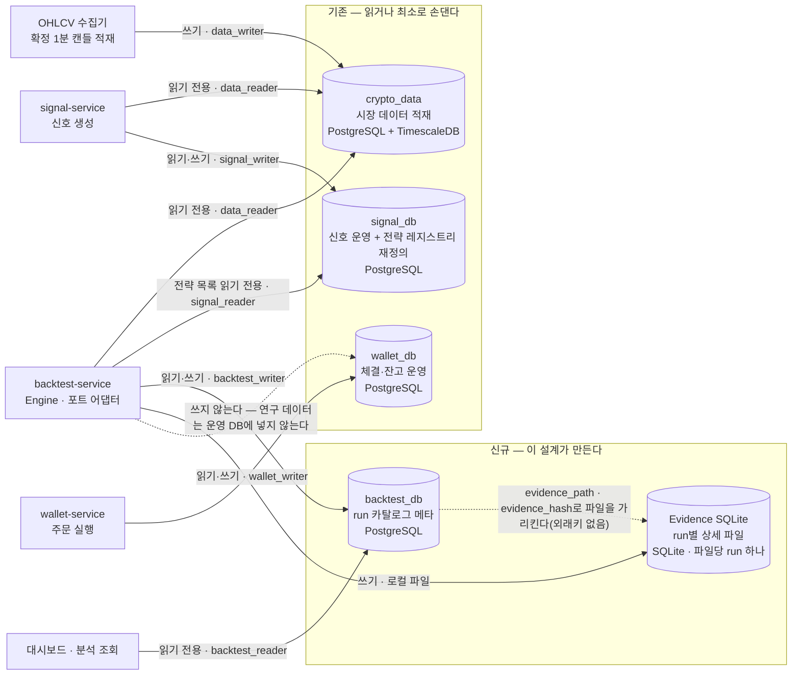
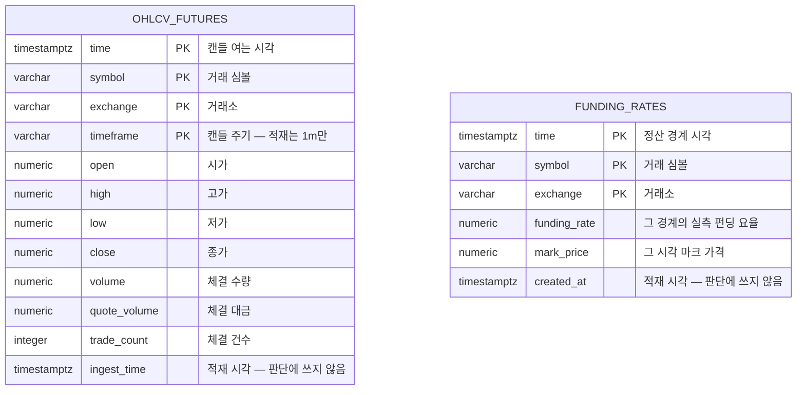
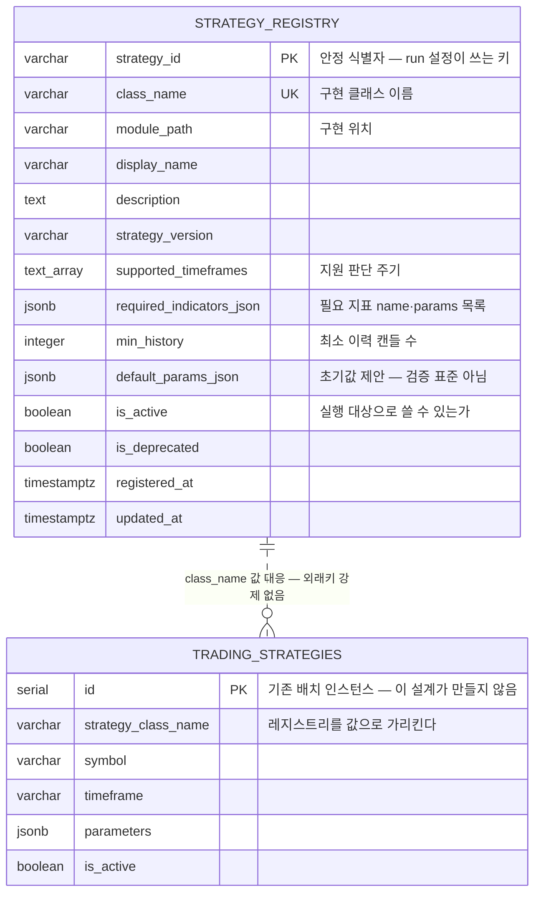
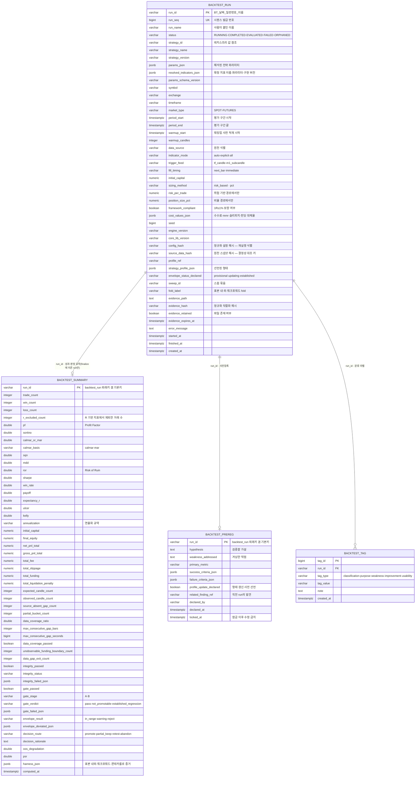
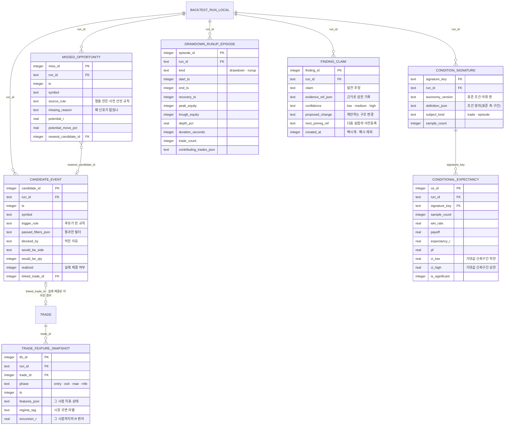

# 백테스트 v2 데이터베이스 설계서

암호화폐 무기한 선물·현물 전략의 백테스트·평가·개선 플랫폼이 쓰는 **모든 저장소의 스키마**를 확정한다. 어떤
데이터베이스가 있고 각각 무엇을 담으며 누가 읽고 쓰는지를 먼저 세운 다음, 데이터베이스별로 ER 다이어그램과 필드
정의서를 둔다. 데이터베이스는 실행 클래스와 성격이 달라 클래스 다이어그램이 아니라 ER 다이어그램으로 기술하며,
그래서 클래스 설계와 분리된 이 문서에 담는다.

이 문서 하나로 스키마를 만들 수 있게 자기완결로 쓴다. 테이블·컬럼·타입·제약·기본값·키·관계·인덱스와 스키마가
지켜야 할 불변식은 전부 이 문서 안에 적으며, 다른 문서를 열지 않아도 되게 한다. 짝이 되는 `백테스트 v2 상세
설계서`(서비스·코드 트리·컴포넌트·클래스)는 이 스키마에 **쓰는 쪽**의 정책을 담고 있어 함께 읽으면 맥락이 서지만,
스키마를 만드는 데 필요한 정보는 이 문서 안에서 끝난다.

---

# 제약사항·방향

## 목적과 범위

> **확정 정정(2026-07-26, 사용자 확정 — 자립 전제).** 이 문서는 초기에 v1의 `crypto_data`·`signal_db`를
> 읽기만 하고 `wallet_db`는 범위 밖으로 두는 전제로 쓰였으나, **v2는 v1과 독립적으로 자기 데이터베이스를
> 신규 구현·프로비저닝한다**(상세설계 상단 '운영 독립 불변식', [[v2-selfcontained-v1-reference-only]]).
> 따라서 v2가 `crypto_data`·`config_db`·`signal_db`·`wallet_db`를 모두 **직접 만든다**. §5.1.2의 crypto_data
> 스키마는 이제 '읽는 쪽 정책'이 아니라 **v2가 소유·프로비저닝하는 스키마**이며(init-scripts로 구현, PR #14),
> `config_db.symbols`(수집기가 읽는 활성 심볼)가 추가된다. `signal_db`·`wallet_db`의 운영 스키마는 각각
> signal-service·wallet-service를 구현할 때 v2가 만든다. 이 문서 곳곳의 'crypto_data는 만들지 않고 읽기만'·
> 'signal_db 기존 테이블 재정의'·'wallet_db 범위 밖·접근 안 함'·'기존' 표기는 모두 이 정정에 따라 **"v2가
> 신규 프로비저닝, v1은 참조만"**으로 읽는다. 단 **백테스트의 접근 규약(불변식)은 유효**하다 — 백테스트는
> `crypto_data`와 `signal_db` 레지스트리를 **읽기로만** 쓰고 `wallet_db`에 **쓰지 않는다**. 바뀐 것은 "누가
> 그 데이터베이스를 만드는가"(v1이 아니라 v2)뿐이다.

이 설계가 푸는 문제는 "백테스트가 내린 판단을 나중에 검산할 수 있는가"이다. 판단을 믿으려면 그 판단을 만든 시점별
근거가 전부 남아 있어야 하고, 동시에 그 무거운 근거가 실거래를 도는 운영 데이터베이스를 오염시키지 않아야 한다.
그래서 저장은 두 계층으로 갈린다. 무거운 시점별 상세는 run 하나마다 독립된 SQLite 파일 하나에 담아 파일만으로
자기완결이게 하고, 여러 run을 가로질러 검색·비교·집계할 가벼운 메타만 전용 PostgreSQL 데이터베이스에 둔다.

이 문서가 확정하는 것은 **저장소들의 스키마**다. 자립 전제(위 정정)대로 v2는 `crypto_data`·`config_db`·
`signal_db`·`wallet_db`·`backtest_db`와 run별 Evidence SQLite를 **모두 신규 프로비저닝**한다. 백테스트는 시장
데이터 `crypto_data`와 `signal_db` 레지스트리를 **읽기 전용**으로 쓰고(쓰기는 각각 수집기·신호 서비스 몫),
자기 결과만 `backtest_db`·Evidence에 쓰며 `wallet_db`에는 쓰지 않는다. `signal_db`의 전략(Adaptee) 레지스트리는
전용 테이블로 정의한다(§5.1.3).

범위 밖인 것도 분명히 해 둔다. 저장소에 쓰는 클래스(`BacktestEvidenceSink`·`BacktestCatalogStore`)의 책임·메서드는
클래스 설계가 소유하므로 여기서 다시 정의하지 않고, 이 문서는 그 클래스들이 **쓰는 스키마**만 확정한다. 데이터
정의문(DDL)의 실행, 마이그레이션 스크립트의 작성, 백업·복구 운영 절차도 구현 단계의 일이다. 전략이 무엇으로
진입·청산하는지는 각 전략이 소유하는 입력이라 어느 스키마에도 규칙으로 박히지 않는다.

## 스키마를 구속하는 불변식 (위반 불가)

아래 열 가지는 협상 대상이 아니다. 스키마가 **구조로** 강제하는 것과, 스키마가 **자리를 마련해** 코드가 강제하게
하는 것이 섞여 있으므로 어느 쪽인지 함께 적는다.

1. **연구 데이터와 운영 데이터베이스 분리.** 시점별 상세(지표 스냅샷·신호·체결·거래·자산곡선)는 run별 SQLite에만
   담는다. 운영 데이터베이스(`wallet_db`·`signal_db`)에는 어떤 백테스트 상세도 넣지 않으며, 전용 `backtest_db`에도
   run당 상수 개수의 가벼운 메타 행만 둔다. 무거운 연구 데이터가 운영 데이터베이스에 들어가면 실거래 서비스의
   성능·백업·장애 반경이 연구 활동에 묶이기 때문이다.
2. **확정 캔들만 적재한다.** 진행 중(미확정) 캔들은 어느 테이블에도 저장되지 않는다. 한 시계열 안에서 `open_time`은
   엄격히 증가하고(중복·역행 금지) `close_time = open_time + timeframe`이며, 결측 구간(gap)은 값을 채우지 않고
   비워 둔다. 이것이 미래 데이터 참조(look-ahead)를 데이터 층에서 막는 근거다 — 확정되지 않은 캔들이 저장되지
   않으므로 그것을 읽어 판단할 수도 없다.
3. **`run_id`는 한 곳에서만 발급한다.** `backtest_db`의 시퀀스가 유일한 발급처이며, 발급된 번호가 Evidence SQLite
   파일명에 들어간다. 파일명을 먼저 짓고 번호를 나중에 붙이는 순서는 금지다. 파라미터 스윕처럼 여러 run이 동시에
   도는 상황에서 번호 발급 경합과 파일명 충돌을 차단하기 위해서다.
4. **Evidence 해시는 정규화 직렬화로 낸다.** 결정성 검증에 쓰는 해시는 SQLite 파일의 바이트가 아니라 정렬된 행의
   정규화 직렬화로 산출한다. 정렬 기준은 (엔티티 종류, 논리 타임스탬프, 엔티티 내 시퀀스)이고, 제외 집합은
   벽시계 시각·SQLite 자동 증가 rowid·파일 경로다. 수치는 저장 정밀도의 소수 자릿수로 반올림한 표준형을
   직렬화한다(이하 이 문서에서 "정해진 소수 자릿수로 반올림"은 값을 그 컬럼의 소수 자릿수에 맞춰 **짝수 반올림**하는
   것을 뜻한다. 짝수 반올림은 버릴 자리가 정확히 5일 때만 특별해서 앞자리를 가장 가까운 짝수 쪽으로 맞추고, 그
   밖에는 보통의 반올림과 같다 — 파이썬 십진 타입의 기본 자릿수 맞춤 연산이 이 방식이다). 그래서
   스키마는 이 세 가지를 만족해야 한다 — 모든 엔티티가 논리 타임스탬프와 엔티티 내 시퀀스를 갖고, 벽시계 컬럼은
   해시에서 빠지도록 따로 표시되며, 수치 컬럼의 정밀도가 고정되어 있어야 한다.
5. **시점 순서를 사후 검증할 수 있어야 한다.** `feature_ts ≤ decision_ts < execution_ts`가 성립하는지를 무결성
   검사가 기록만 보고 확인할 수 있도록, Evidence는 지표 시각·판단 시각·체결 시각을 각각 별도 컬럼으로 남긴다. 세
   시각을 하나로 뭉치면 이 검증 자체가 불가능해진다.
6. **모든 손익은 비용 차감 후(net) 기준이며 비용은 한 번만 차감된다.** 거래·자산곡선의 손익 컬럼은 net이 표준값이고,
   비용 차감 전(gross) 금액과 수수료·슬리피지·펀딩·청산 손실을 각각 별도 컬럼으로 남겨 `net = gross − 수수료 −
   슬리피지 − 펀딩 − 청산손실`이 기록만으로 재계산되게 한다. 비용을 합계 하나로만 남기면 이중 차감을 검산할 수 없다.
7. **금액과 판단값의 수치 타입을 가른다.** 실제로 돈이 오가고 장부에 남는 값(체결가·수량·수수료·손익·잔고)은 오차
   없는 십진 고정소수점으로 저장하고, 지표·신뢰도처럼 판단 경로에만 쓰이는 값은 배정밀도 부동소수점으로 저장한다.
   끝자리 오차가 체결 여부와 잔고를 바꾸는 경로에만 십진 타입을 쓰는 것이며, 이 경계는 코드의 변환 관문과 같은
   자리에 그어져 있다.
8. **모든 시각은 UTC 기준이다.** 각 엔진의 적절한 타입을 쓴다 — PostgreSQL은 네이티브 `timestamptz`로, 날짜 타입이
   없는 STRICT SQLite는 **UTC 기준 epoch 밀리초 정수**로 저장한다(문자열보다 작고 비교·정렬·인덱스가 빠르며, epoch는
   시간대가 없어 지역 시간대 모호성이 원천적으로 없다). 지역 시간대 표기는 어느 컬럼에도 저장하지 않는다 — 펀딩 정산
   경계(UTC 0·8·16시)와 캔들 마감 판정이 시간대에 따라 흔들리면 재현성이 깨지기 때문이다.
9. **데이터베이스 사이의 참조는 값 ID로만 하고 외래키를 강제하지 않는다.** Evidence SQLite가 카탈로그의 run을
   가리킬 때, 카탈로그가 전략 레지스트리의 전략을 가리킬 때 모두 값으로만 참조한다. 서로 다른 데이터베이스·서비스에
   걸친 참조 무결성을 데이터베이스 제약으로 묶으면 배포·장애가 서로 전파되기 때문이다. 반대로 **이 설계가 소유하는
   테이블끼리 같은 데이터베이스 안에서 참조할 때는 외래키로 강제한다** — 같은 저장소 안의 고아 행은 막을 수 있고
   막아야 한다. 이 설계가 소유하지 않는 기존 운영 테이블의 제약은 건드리지 않는다.
10. **Evidence 파일은 그 자체로 검산 가능해야 한다.** run 신원(전략·심볼·기간·설정·엔진 버전)을 SQLite 안에도
    복제해 두어, 카탈로그 데이터베이스에 접속하지 못하는 상황에서도 파일 하나만으로 결과를 검산할 수 있게 한다.

## 설계 방향

**저장은 두 계층, 데이터베이스는 넷.** 상세와 메타를 가르는 기준은 "행 수가 run 길이에 비례하는가"이다. 캔들마다
늘어나는 기록은 전부 SQLite로 가고, run당 개수가 정해진 기록만 PostgreSQL로 간다. 이 기준이 있어야 run 수가 폭증하는
파라미터 스윕에서도 카탈로그 데이터베이스의 크기가 예측 가능하게 유지된다.

**v2가 자기 데이터베이스를 신규 프로비저닝한다.** 자립 전제(위 정정)대로 `crypto_data`(§5.1.2 스키마)·
`config_db`(symbols)·`signal_db`(레지스트리)·`wallet_db`·`backtest_db`를 v2가 직접 만든다(init-scripts,
PR #14). 백테스트는 그중 `crypto_data`와 `signal_db` 레지스트리를 **읽기만** 한다. `signal_db`에는 전략 목록을
담을 레지스트리 테이블을 정의한다. 전략 목록을 코드에서 데이터베이스로 옮기는 것은
백테스트와 실거래가 같은 전략 목록을 보게 하려는 것이며, 두 서비스가 각자 목록을 들고 있으면 검증한 전략과 실행하는
전략이 어긋난다.

**성격이 다른 저장소에는 다른 엔진을 쓴다.** 카탈로그는 여러 run을 가로질러 검색·집계하므로 동시 접근과 SQL
표현력이 필요해 PostgreSQL을 쓰고, Evidence는 run 하나에 종속된 대량 순차 기록이라 파일 하나로 옮기고 지울 수 있는
SQLite를 쓴다. 저장소를 하나로 합치면 둘 중 한쪽의 요구가 반드시 희생된다.

**보존 정책을 스키마에 반영한다.** 채택(`promote`)되었거나 형태가 확립된(`established`) run의 Evidence 파일은 영구
보존하고, 그 외 run의 파일은 기본 90일 뒤 삭제한다. 메타는 언제나 영구 보존이므로 파일이 지워진 뒤에도 비교·검색은
가능하다. 그래서 카탈로그에는 파일이 아직 있는지를 나타내는 상태 컬럼이 필요하다.

## 문서 구성 (읽기 지도)

큰 구성에서 개별 필드로 내려간다. 먼저 저장소 전체 지도를 그리고, 그다음 데이터베이스별로 ER 다이어그램과 필드
정의서를 둔다. 각 절에서 **ER 다이어그램이 본문**이다 — 엔티티의 필드 이름과 타입, 기본키·외래키, 관계와 대응
수(cardinality)는 전부 다이어그램 안에 있다. 이어지는 표는 다이어그램이 담을 수 없는 잔여만 적는다(제약·널 허용
여부·기본값·의미). 그래서 표는 다이어그램을 되풀이하지 않고, 다이어그램은 구조를 표에 숨기지 않는다.

| 절 | 제목 | 담는 내용 |
|---|---|---|
| §5.1 | 데이터베이스 전체 구성 + `crypto_data`·`signal_db` | 네 저장소의 역할·접근 권한·경계 지도, 백테스트가 읽는 시장 데이터 테이블, `signal_db`의 전략 레지스트리, 기존 운영 DB(`signal_db`·`wallet_db`)의 테이블 단위 추가·수정·삭제 요약 |
| §5.2 | `backtest_db` ERD + 테이블 정의서 | 카탈로그 메타 네 테이블의 전체 컬럼과 `run_id` 관계, 발급·해시·외래키 규약 |
| §5.3 | Evidence SQLite ERD + Entity 정의서 | run별 상세 저장소의 기본 14 엔티티 + 확장 7 엔티티 전체 컬럼과 관계, 저장·직렬화·자기완결·참조 규약 |
| Traceability | 요구 대응표 | 이 문서의 각 절이 충족하는 요구를 이름으로 적는다 |

---

# §5 데이터베이스 ERD + 정의서 (DB별)

## §5.1 데이터베이스 전체 구성 + `crypto_data`·`signal_db`

### §5.1.1 저장소 전체 구성

네 저장소가 각각 무엇을 담고 누가 어떤 권한으로 접근하는지를 한 장에 놓는다. 화살표의 라벨이 접근 방향·권한·접속
역할이고, 점선 상자가 이 설계가 **새로 만드는 경계**다.

읽는 법. 백테스트는 **읽기 위주**의 소비자다. 시장 데이터(`crypto_data`)와 전략 목록(`signal_db`)은 읽기만 하고,
자기가 만든 결과만 `backtest_db`와 Evidence 파일에 쓴다. 운영 데이터베이스 `wallet_db`에는 어떤 경로로도 쓰지
않는다 — 그림의 마지막 점선이 그 금지를 명시한다. 반대로 실거래 두 서비스는 `backtest_db`와 Evidence를 쓰지도
읽지도 않는다. 두 세계가 공유하는 것은 시장 데이터와 전략 목록뿐이며, 이 공유가 "백테스트가 검증한 전략과 실거래가
실행하는 전략이 같다"를 데이터 차원에서 보장한다.

카탈로그와 Evidence 파일의 연결은 점선이다. `backtest_db`의 run 행이 파일 경로와 해시를 값으로 들고 있을 뿐,
데이터베이스 제약으로 묶이지 않는다. 파일은 보존 정책에 따라 지워질 수 있고 메타는 영구 보존이므로, 외래키로 묶으면
정상적인 삭제가 제약 위반이 된다.

**저장소별 역할·경계.**

| 저장소             | 엔진                       | 이 설계에서의 처지                    | 담는 것                                  | 백테스트의 접근                     |
| --------------- | ------------------------ | ----------------------------- | ------------------------------------- | ---------------------------- |
| `crypto_data`   | PostgreSQL + TimescaleDB | **신규 · v2가 프로비저닝**(§5.1.2 스키마·2000일 retention·7일 압축) | 확정 1분 OHLCV, 펀딩 실측 요율·마크 가격           | 읽기 전용. 쓰기 없음(적재는 수집기 소관)  |
| `config_db`     | PostgreSQL               | **신규 · v2가 프로비저닝**            | 수집기가 읽는 활성 심볼(`symbols`)              | 접근 안 함(수집기 소관)             |
| `signal_db`     | PostgreSQL               | **신규 · v2가 프로비저닝**(레지스트리; 운영 스키마는 signal-service 때) | 전략(Adaptee) 레지스트리 + 신호 운영 데이터         | 레지스트리 읽기 전용. 등록·수정은 신호 서비스 몫 |
| `backtest_db`   | PostgreSQL               | 신규 · 이 설계가 만든다                | run 카탈로그 헤더·성과 요약·사전등록·태그             | 읽기·쓰기. 대시보드는 별도 읽기 전용 역할     |
| Evidence SQLite | SQLite                   | 신규 · run마다 파일 하나              | 시점별 상세 전부(지표 스냅샷·신호·판단·체결·거래·자산곡선·분석) | 쓰기(생성 서비스), 이후 분석은 읽기        |
| `wallet_db`     | PostgreSQL               | **신규 · v2가 프로비저닝**(운영 스키마는 wallet-service 때; 현재 빈 DB·역할) | 실거래 체결·잔고                             | 접근하지 않는다(쓰기 금지 불변식 유지)   |

**접속 역할과 권한.** `backtest_db`에는 역할 둘을 둔다. 쓰기 역할 `backtest_writer`는 이미 만들어져 있어 그대로
계승하고, 대시보드·분석 조회용 읽기 전용 역할 `backtest_reader`는 **새로 만든다**(현재 없다). `backtest_reader`에는
`GRANT SELECT`만 준다 — 조회 경로가 실수로 카탈로그를 고치는 일을 권한 층에서 막기 위해서다. 두 역할의 비밀번호는
커밋되는 파일에 넣지 않고 환경 파일로만 주입한다. 이미 커밋되어 있는 기존 `backtest_writer` 값은 그대로 두되(로컬
개발 데이터베이스라 실질 위험이 낮다), 새로 만드는 `backtest_reader`의 비밀번호는 처음부터 환경 파일 주입만 쓴다.

**데이터베이스·역할 생성 방식.** 기존 두 운영 서비스와 같은 방식을 따른다. 데이터베이스와 역할 생성은 초기화 스크립트
디렉터리 최상위의 **번호 접두 SQL**로 넣되, 번호는 문서에 적힌 값이 아니라 **작업 시점의 실제 최대 번호 다음 값**을
쓴다(최상위에 `01`·`02`·`03`만 있으면 `04`). 스키마 마이그레이션은 최상위가 아니라 서비스별 디렉터리
`init-scripts/backtest-service/`에 날짜 하위 디렉터리로 쌓는다(기존 `init-scripts/wallet-service/`와 같은 구조).
애플리케이션 측은 두 서비스와 동일하게 SQLAlchemy 2.x 비동기 모델 + `Base.metadata`를 쓰고, 개발 환경에서만
`AUTO_CREATE_TABLES=true`로 테이블을 자동 생성하며, 접속 문자열은 코드에서 조립하지 않고 완성된 URL을 환경 변수로
주입받는다. 컨테이너에서 호스트 PostgreSQL에 붙을 때는 `host.docker.internal`을 쓴다.

**기존 `backtest_db` 잔재 정리.** 이 데이터베이스는 이름과 쓰기 역할만 계승하고 **스키마는 계승하지 않는다**. 제거
대상 서비스가 실행 중에 만들어 둔 옛 테이블이 남아 있으므로, 새 스키마를 넣기 전에 목록을 확인해 드롭하거나 별도
스키마로 격리한다. 이름이 비슷한 **`wallet_db`의 `backtest_runs`는 전혀 다른 것**이다 — 그쪽은 실거래·페이퍼·백테스트를
한 테이블에서 보고하던 운영 리포팅 테이블이며, 여기서 만드는 `backtest_db.backtest_run`과 아무 관계가 없으므로 옮기거나
합치지 않는다.

### §5.1.2 `crypto_data` — 백테스트가 읽는 시장 데이터

백테스트가 이 저장소에서 읽는 것은 두 가지다. 판단과 집행에 쓰는 **확정 OHLCV 캔들**과, 비용 차감 후 손익 계산에
쓰는 **펀딩 실측 요율·마크 가격**이다. 자립 전제(상단 정정)대로 **v2가 `crypto_data`를 프로비저닝하므로 아래는
v2가 소유·생성하는 물리 스키마**이며(init-scripts로 구현, PR #14), 동시에 백테스트가 읽기로 의존하는 정책이다 —
이 컬럼들이 이 의미로 존재해야 백테스트가 성립한다.

두 테이블 사이에는 외래키가 없다. 같은 `symbol`·`exchange` 값으로 대응할 뿐이며, 펀딩 행이 없는 구간은 결측이지
0이 아니다.

**`ohlcv_futures` — 읽기 정책.**

| 컬럼 | 제약·정밀도 | 널 | 기본값 | 읽는 쪽의 의미 |
|---|---|---|---|---|
| `time` | 캔들 **여는 시각**. UTC. 마감 시각은 `time + timeframe`으로 유도한다 | 불가 | 없음 | 이 행이 확정 캔들이라는 사실 자체가 look-ahead 방지의 근거다 |
| `symbol` | 최대 30자 | 불가 | 없음 | 첫 검증 스코프는 `ETHUSDT` 단일 심볼 |
| `exchange` | 최대 20자 | 불가 | `binance` | 첫 검증 스코프는 `binance` 무기한 선물 |
| `timeframe` | 최대 10자. **적재되는 값은 `1m` 하나뿐** | 불가 | 없음 | 상위 주기는 이 컬럼의 다른 값이 아니라 아래 재집계 규약으로 만든다 |
| `open`·`high`·`low`·`close` | 십진 고정소수점, 정수부 12자리·소수부 8자리 | 불가 | 없음 | 모두 0보다 크고 `high ≥ max(open, close)`·`low ≤ min(open, close)`가 성립한다고 전제한다 |
| `volume`·`quote_volume` | 십진 고정소수점, 정수부 22자리·소수부 8자리 | 허용 | 없음 | 0 이상. `quote_volume`은 선택 입력이라 없을 수 있다 |
| `trade_count` | 32비트 정수 | 허용 | 없음 | 선택 입력 |
| `ingest_time` | 적재 시각 | 허용 | 현재 시각 | **판단·해시에 쓰지 않는다.** 벽시계 값이라 결정성 대상에서 제외한다 |

기본키는 `(time, symbol, exchange, timeframe)` 네 컬럼이고, 적재는 이 키를 충돌 대상으로 하는 upsert다. 같은 캔들이
두 번 적재돼도 행이 늘지 않는다는 뜻이며, 이것이 시계열 단조성(같은 시계열 안에서 여는 시각이 엄격히 증가)을
저장 층에서 받쳐 준다.

**전략 타임프레임 캔들을 만드는 방법 — 1분 원천만 읽고 재집계한다.** 이 저장소에는 5분~1일 상위 주기가
연속 집계 뷰로 함께 정의되어 있지만, **백테스트는 그 뷰를 읽지 않고 1분 원천 테이블만 읽어 전략 타임프레임으로
직접 재집계한다.** 세 가지 이유다. 첫째, 연속 집계 뷰의 자동 갱신 구간이 최근 1~30일로 좁아 과거 구간은 수동 갱신이
있어야 채워지므로, 뷰를 읽으면 **결과가 갱신 상태에 의존**해 같은 입력이 같은 결과를 낸다는 결정성이 깨진다. 둘째,
보존 기간 연장을 1분 원천 테이블 하나에만 걸면 되어 보존 대상이 단순해진다. 셋째, 미완성 마지막 버킷을 버리는
규칙을 재집계하는 한 곳에서 강제할 수 있다. 뷰 자체는 대시보드·실거래 조회용으로 남으며 폐지 대상이 아니다.

재집계 규칙은 이렇다. 전략 주기 한 칸은 그 구간에 속한 1분 행 전부로 만들고, **1분 행이 하나라도 비면 그 칸은
만들지 않고 결측으로 표시한다**(값을 채워 넣지 않는다). 시가는 구간 첫 행의 시가, 고가·저가는 구간 전체의 최대·최소,
종가는 구간 마지막 행의 종가, 거래량·거래대금은 합, 체결 건수는 합이다. 평가 구간 끝에 걸린 미완성 칸은 버린다.

**보존 기간.** 현재 보존 정책은 400일이라 그보다 오래된 행은 삭제된다. 백테스트는 그보다 긴 구간을 평가해야 하므로
**보존 기간을 2000일(약 5.5년)로 연장한다. 연장 대상은 두 테이블 — 1분 캔들 `ohlcv_futures`와 펀딩 `funding_rates`
— 이다.** 펀딩을 함께 늘리지 않으면 400일 이전 구간에는 실측 펀딩이 없어 장기 run이 전부 대체 요율로 떨어지고,
이 문서 자신의 규정에 따라 그런 run은 스트레스 시나리오로만 취급되므로 "비용 차감 후 손익이 표준"이라는 전제가
무너진다. 용량은 감당 가능하다 — 단일 심볼 1분 캔들 2000일은 약 288만 행이고 7일이 지난 구간은 압축되어 실제
용량이 수백 MB 수준이며, 펀딩은 8시간 간격이라 같은 기간이 6천 행 남짓이다. 보존 정책은 테이블마다 걸리므로
**연장 대상은 이 둘뿐**이고, 상위 집계 뷰와 다른 테이블(지표 사전계산 테이블 등)의 보존은 손대지 않는다. 확보되지
않은 과거 구간은 기존 backfill 서비스로 채우며, 실제 확보 하한은 각 테이블의 가장 이른 `time` 값으로 확인한다 —
특정 시작일을 전제하지 않는다.

**`funding_rates` — 읽기 정책.**

| 컬럼 | 제약·정밀도 | 널 | 기본값 | 읽는 쪽의 의미 |
|---|---|---|---|---|
| `time` | 펀딩 정산 경계 시각. UTC 0·8·16시 | 불가 | 없음 | 이 경계를 지나 보유한 포지션에만 펀딩이 부과된다 |
| `symbol`·`exchange` | 위 캔들 테이블과 같은 표기 | 불가 | 없음 | 값으로만 대응하며 외래키는 없다 |
| `funding_rate` | 십진 고정소수점, 소수부 10자리 | 불가 | 없음 | **원천 정밀도를 그대로 읽는다.** 수수료율 자릿수로도 비율 자릿수로도(둘 다 소수부 4자리) 반올림하지 않는다 |
| `mark_price` | 십진 고정소수점, 정수부 12자리·소수부 8자리 | 허용 | 없음 | 그 경계 시각의 실측 마크 가격. **강제청산 판정의 해석·대사에 쓰는 참조값**이며(발동 판정 자체는 실행 정책이 last-price 캔들 극값 대조로 소유), 펀딩 금액 산정에는 쓰지 않는다(펀딩 정산가는 경계를 포함하는 캔들의 시가를 쓴다). **정산 경계 시각에만 존재**한다(캔들별 참조값 대체 규칙은 Evidence 포지션 엔티티의 마크 가격 규약) |
| `created_at` | 적재 시각 | 허용 | 현재 시각 | 판단·해시에 쓰지 않는다 |

**펀딩 요율을 소수 자릿수로 반올림하지 않는 이유.** 금액 정밀도 규약에는 소수 4자리로 깎는 자릿수가 둘 있다 —
수수료율 자릿수와 비율 자릿수다. 실측 펀딩 요율은 그보다 잔 자리를 갖는다(예: 0.00008750). 4자리로 뭉개면 실측값이
바뀌어 비용 차감 후 손익이 틀어지므로, **요율은 두 자릿수 어느 쪽으로도 깎지 않고 원천 정밀도로 읽으며, 소수 자릿수
반올림은 펀딩 "금액"에만 적용한다**(금액 자릿수는 소수부 8자리). 수수료율 자릿수는 이름 그대로 거래 수수료율에만,
비율 자릿수는 위험 비율 같은 설정 비율에만 쓴다.

**펀딩 행이 없을 때.** 실측 행이 없는 경계는 결측이며 0으로 간주하지 않는다. 이때만 비용 모델이 들고 있는 대체
요율을 쓰고, **대체값을 썼다는 사실을 자유 서술이 아니라 구조화된 값으로** 그 run의 Evidence에 남긴다(원천 스냅샷
엔티티의 대체 사용 플래그와 사용 건수). 자유 서술로만 남기면 "대체값이 섞인 run"을 판정에서 걸러 낼 수 없기
때문이다. 실측 없이 낸 비용 차감 후 손익은 스트레스 시나리오로만 취급한다.

**마크 가격을 캔들마다 남기는 방법.** 이 테이블의 실측 마크 가격은 정산 경계 시각에만 있는데, 강제청산 판정의
해석·대사에 쓸 참조 마크는 캔들마다 필요하다(발동 판정 자체는 실행 정책이 last-price 캔들 극값 대조로 소유하며
마크는 판정 입력이 아니다). 그래서 **실측이 있는 시각에는 그 값을, 없는 시각에는 그 캔들의 종가를 참조 마크로 쓰고
어느 쪽인지를 Evidence에 출처로 남긴다**(시점별 포지션 엔티티의 마크 가격 출처 컬럼). 이 규약을 정하지 않으면
구현자마다 다른 값을 넣어 참조값이 갈리고, 출처가 없으면 청산이 결과를 좌우한 run에서 실측 마크와의 괴리를 복원해
해석할 수 없다.

> **키 유일성.** 이 테이블은 `(time, symbol, exchange)`를 기본키로 선언하고 있어 한 시각·한 심볼·한 거래소에 행이
> 하나뿐임이 보장된다. 읽는 쪽은 이 유일성에 기대어 정산 경계마다 요율을 하나로 확정한다.

### §5.1.3 `signal_db` — 전략(Adaptee) 레지스트리

**무엇을 더하는가.** 어떤 전략 구현(Adaptee)이 존재하는지를 코드가 아니라 데이터베이스가 갖게 한다. 지금은 서비스가
부팅할 때 코드에 나열된 전략 클래스들을 메모리 레지스트리에 등록하고, 그 목록은 그 프로세스 안에만 있다. 그래서
백테스트는 실거래가 무엇을 실행할 수 있는지 알 수 없고, 두 쪽이 각자 목록을 들면 **검증한 전략과 실행하는 전략이
어긋난다.** 이 목록을 데이터베이스로 올려 단일 출처로 삼는 것이 이 절이 하는 일이다.

**어디에 두는가.** `signal_db`에는 이미 성격이 다른 두 테이블이 있다. 하나는 전략 **클래스**의 카탈로그
(`strategy_registry`)이고 다른 하나는 그 클래스를 심볼에 배치한 **인스턴스**(`trading_strategies`)다. 배치 인스턴스
테이블은 실거래가 실제로 읽어 쓰는 살아 있는 테이블이지만, 클래스 카탈로그 테이블은 정의만 있고 어떤 코드도 읽거나
쓰지 않는 빈 자리다. 코드에서 승격시키려는 목록은 "어떤 전략 클래스가 구현되어 있는가"이므로 **그 빈 클래스 카탈로그
자리를 Adaptee 레지스트리로 채택**한다. 새 테이블을 하나 더 만들면 같은 개념이 세 곳에 흩어진다.

컬럼 구조는 현행 배치 테이블의 관례를 그대로 따른다 — 클래스명 문자열, 파라미터 JSON 문서, 활성 플래그, 버전
문자열, 시각 두 개. 다만 담는 **단위**가 배치 인스턴스가 아니라 구현 클래스이므로, 배치 속성인 심볼은 이 테이블에
두지 않는다(심볼은 클래스의 성질이 아니라 배치의 성질이라 배치 테이블이 갖는다).

배치 인스턴스 테이블은 이 설계가 만들지도 바꾸지도 않는다. 위 그림에 넣은 것은 두 테이블이 어떻게 대응하는지를
보이기 위해서이며, 컬럼도 그 대응에 필요한 것만 실었다.

| 컬럼 | 제약 | 널 | 기본값 | 의미 |
|---|---|---|---|---|
| `strategy_id` | 최대 80자, 기본키. 영문 소문자·숫자·하이픈 | 불가 | 없음 | run 설정과 카탈로그가 쓰는 안정 식별자(예: `vessel-vanguard`). 클래스 이름을 바꿔도 이 값은 유지한다 — 과거 run이 가리키는 대상이 사라지면 안 되기 때문이다 |
| `class_name` | 최대 255자, 유일 | 불가 | 없음 | 구현 클래스 이름 |
| `module_path` | 최대 500자 | 불가 | 없음 | 구현이 있는 모듈 경로. 생성 시 이 값으로 클래스를 찾는다 |
| `display_name` | 최대 100자 | 불가 | 없음 | 사람이 읽는 이름 |
| `description` | 가변 길이 문자열 | 허용 | 없음 | 설명 |
| `strategy_version` | 최대 20자 | 불가 | `1.0.0` | 판단 로직 버전. run 카탈로그가 실행 시점의 이 값을 사본으로 남긴다 |
| `supported_timeframes` | `TEXT[]`(문자열 배열), 비어 있지 않음 | 불가 | `{1h}` | 이 전략이 지원하는 판단 주기. run 설정의 주기가 이 안에 없으면 거부한다 |
| `required_indicators_json` | JSON 배열. 각 원소는 지표 이름과 파라미터를 가진 객체 | 불가 | `[]` | 이 전략이 필요로 하는 지표. 지표 계산 대상을 `auto`로 둔 run이 계산 집합을 정하는 근거다 |
| `min_history` | 32비트 정수, 1 이상 | 불가 | `100` | 판단에 필요한 최소 이력 캔들 수. 워밍업 사전 적재 길이를 정하는 두 입력 중 하나다(다른 하나는 지표의 최장 워밍업) |
| `default_params_json` | JSON 객체 | 불가 | `{}` | 파라미터 **초기값 제안**. 화면 표시와 스윕 시작점에만 쓰며 **검증·해석의 표준이 아니다** |
| `is_active` | 참·거짓 | 불가 | `false` | 이 Adaptee를 실행 대상으로 쓸 수 있는지. 기본이 거짓인 이유는 등록되었다는 사실만으로 실행 대상이 되면 안 되기 때문이다 |
| `is_deprecated` | 참·거짓 | 불가 | `false` | 더 쓰지 않기로 한 구현. 과거 run이 참조하므로 행을 지우지 않고 이 플래그로 표시한다 |
| `registered_at`·`updated_at` | 시간대 포함 시각(UTC) | 불가 | 현재 시각 | 등록·수정 시각 |

**파라미터 스키마를 이 테이블에 두지 않는 이유.** 전략 파라미터의 스키마(각 필드의 타입·기본값·범위와 잉여 키
금지)는 Adaptee가 코드로 선언하는 것이 표준이고, 그 해석·검증은 공유 라이브러리의 설정 해석기가 단독으로 한다.
같은 스키마를 데이터베이스에도 복제해 두면 코드가 바뀔 때 두 벌이 어긋나고, 어긋난 순간 "어느 쪽이 맞는가"라는
답 없는 질문이 생긴다. 그래서 스키마는 저장하지 않고, 화면이 필요로 할 때 코드에서 그 자리에 생성해 노출한다.
`default_params_json`을 남긴 것은 스윕의 시작점을 사람이 손볼 수 있게 하기 위한 편의값이며, 위 표에 적었듯 검증에
쓰이지 않는다.

**배치 인스턴스와의 관계.** 배치 테이블은 클래스 이름 문자열로 이 레지스트리를 가리킨다. 이 설계는 그 참조에
외래키를 걸지 않는다 — 배치 테이블은 실거래 서비스가 소유·운영하는 기존 테이블이고, 이 설계는 레지스트리(기존 빈 테이블)를 재정의할 뿐
기존 운영 테이블의 제약을 바꾸지 않기 때문이다. 대신 등록 경로가 검사한다. 레지스트리에 없거나 활성이 아닌 클래스는
배치할 수 없다.

**백테스트가 읽는 범위.** 백테스트는 이 레지스트리만 읽고 배치 인스턴스 테이블은 읽지 않는다. 백테스트의 심볼·주기·
파라미터는 배치가 아니라 run 설정이 주기 때문이다. 읽는 방식은 식별자 하나로 한 항목을 가져오는 조회와 전체 목록
조회 두 가지이며, **쓰기는 하지 않는다** — 등록·수정은 신호 서비스 몫이다. 접속 역할도 읽기 전용을 쓴다.

**인덱스.** 목록 조회가 주 용도이므로 활성·미폐기 행만 담는 부분 인덱스 하나(`is_active`가 참이고 `is_deprecated`가
거짓인 행)와 클래스 이름 유일 인덱스를 둔다. 전체 행 수가 수십 규모라 그 이상은 두지 않는다.

**현행 정의와 무엇이 달라지는가.** 이 자리에는 이미 테이블 정의가 있고 그 정의는 위 목표와 여러 곳에서 다르다.
행만 비우면 되는 것이 아니라 **테이블 정의 자체를 바꿔야 한다.** 아래가 현행에서 목표로 가는 전체 변경 목록이다.

| 현행 컬럼 | 처리 | 목표 컬럼 | 이유 |
|---|---|---|---|
| `id SERIAL` 기본키 | **삭제** | — | 안정 문자열 식별자를 기본키로 쓴다. 대리 정수 키는 run 카탈로그가 값으로 참조하기에 부적합하다(번호가 재생성마다 달라진다) |
| — | **추가** | `strategy_id` 기본키 | run 설정과 카탈로그가 쓰는 안정 식별자 |
| `class_name` 유일·널 불가 | 유지 | `class_name` | 그대로 |
| `module_path` 널 불가 | 유지 | `module_path` | 그대로 |
| `display_name` 널 불가 | 유지 | `display_name` | 그대로 |
| `description` | 유지 | `description` | 그대로 |
| `version` 널 불가·기본 `1.0.0` | **개명** | `strategy_version` | 무엇의 버전인지 이름에서 드러나게 한다 |
| `min_compatible_version` | **삭제** | — | 쓰는 곳이 없다. 지금 필요 없는 호환 정책을 스키마에 남기지 않는다 |
| `parameter_schema JSONB` 널 불가 + 객체 CHECK | **삭제**(제약 포함) | — | 파라미터 스키마의 단일 소유는 전략 구현 코드다. 널 불가라 남겨 두면 값을 억지로 채워야 하고, 채우는 순간 코드와 어긋난다 |
| `default_parameters JSONB` 널 불가 | **개명** | `default_params_json` | 이름을 목적(초기값 제안)에 맞춘다 |
| `supported_timeframes TEXT[]` | 유지 | `supported_timeframes` | 그대로 |
| `required_indicators TEXT[]` | **타입 변경** | `required_indicators_json JSONB` | 필요 지표는 이름만이 아니라 파라미터까지 있어야 계산 집합을 정할 수 있어, 문자열 배열로는 부족하다 |
| — | **추가** | `min_history` | 워밍업 사전 적재 길이를 정하는 입력. 지금은 코드에만 있다 |
| `is_available` 기본 참 | **개명·기본값 반전** | `is_active` 기본 거짓 | 등록되었다는 사실만으로 실행 대상이 되면 안 된다. 검증되지 않은 전략이 기본 활성으로 잡히는 것을 막는다 |
| `is_deprecated` 기본 거짓 | 유지 | `is_deprecated` | 그대로 |
| `registered_at`·`updated_at` | 유지 | 그대로 | 그대로 |

**교체 절차.** 컬럼이 이렇게 달라지므로 **기존 정의를 드롭하고 새로 만든다**(변경문을 쌓는 방식으로는 기본키 교체와
널 불가 컬럼 삭제가 지저분해진다). 절차에는 두 가지 주의가 붙는다. 첫째, 초기화 스크립트가 흔히 쓰는 "없으면 만든다"
형태의 생성문은 **테이블이 이미 있으면 조용히 아무 일도 하지 않는다** — 그대로 두면 옛 컬럼 구성이 남은 채 코드가
새 컬럼을 찾다가 실행 시점에 깨진다. 드롭을 명시적으로 앞에 두어야 한다. 둘째, 드롭이 안전한 이유는 **이 테이블을
읽거나 쓰는 코드가 하나도 없고 들어 있는 행도 예시 둘뿐**이기 때문이다. 그 전제가 유효한지를 교체 직전에 다시
확인하고, 유효하지 않으면 멈춘다.

집행 시점은 **채택 단계**다. 이 테이블은 신호 서비스가 소유하는 데이터베이스에 있고, 이 설계 단계는 실거래 쪽 스키마를
건드리지 않는다. 지금 확정하는 것은 목표 정의와 변경 목록이며, 실제 적용은 신호 서비스가 공유 라이브러리를 채택하는
단계에서 함께 이뤄진다. 배치 인스턴스 테이블은 이 교체에서 **손대지 않는다**.

**옮겨 담기.** 지금 코드에 나열되어 있는 전략 클래스들이 이 테이블의 초기 행이 된다. 각 행의 값은 클래스가 이미
선언하고 있는 메타데이터(표시 이름·설명·버전·지원 주기·필요 지표·최소 이력)에서 그대로 가져오므로 사람이 새로
지어내는 값은 식별자뿐이다. 활성 플래그는 기본이 거짓이므로, 옮겨 담은 뒤 실제로 돌릴 전략만 참으로 바꾼다.

### §5.1.4 기존 운영 데이터베이스 변경 요약 (`signal_db`·`wallet_db`)

이 설계가 두 기존 운영 데이터베이스의 **테이블에 무엇을 하는지**를 테이블 단위로 표시한다. 실제 적용은 신호 서비스가
공유 라이브러리를 채택하는 단계에서 이뤄지며, 이 절은 그때 무엇을 바꿀지를 미리 확정한다. `backtest_db`는 신규
데이터베이스라 여기 넣지 않고(§5.2), `crypto_data`는 v2가 §5.1.2 스키마로 신규 프로비저닝한다(2000일 retention·7일 압축 포함, §5.1.2).

**`signal_db`.**

| 테이블 | 처리 | 내용 |
|---|---|---|
| `strategy_registry` | **수정(재정의)** | 정의만 있고 어떤 코드도 읽지 않던 빈 클래스 카탈로그를 Adaptee 레지스트리로 재정의한다. 기본키 교체·컬럼 개명·타입 변경·필드 추가·필드 삭제의 현행→목표 대응표는 §5.1.3에 있다. 드롭 후 재생성이며, 드롭이 안전한 근거(읽는·쓰는 코드가 없고 행이 예시 둘뿐)도 §5.1.3에 적혀 있다 |
| `trading_strategies` | 불변 | 전략 배치 인스턴스 테이블(실거래가 운영). 백테스트는 이 테이블을 읽지 않고, 이 설계는 건드리지 않는다 |
| `wallet_strategy_assignments` | 불변 | 지갑↔전략 배치. 손대지 않는다 |
| `trading_signals` | 불변 | 생성된 신호. 손대지 않는다 |
| `heartbeats` | 불변 | 서비스 heartbeat. 손대지 않는다 |

- **추가(자립 전제)**: v2가 `signal_db`를 신규 프로비저닝하며 전략(Adaptee) 레지스트리를 전용 테이블로 만든다(§5.1.3). 위 표의 v1 참조 테이블 구조는 참고일 뿐이고, 그 밖의 운영 테이블은 signal-service 구현 시 v2가 정의한다.
- **삭제**: 없음. 폐기가 필요한 전략은 행을 지우지 않고 `is_deprecated` 플래그로 표시한다(과거 run이 참조하기 때문).

**`wallet_db`.**

- **추가·수정·삭제 모두 없음.** 백테스트는 `wallet_db`에 접근하지 않는다 — 시점별 상세는 run별 Evidence SQLite에,
  가벼운 메타는 전용 `backtest_db`에 쓰기 때문이다(연구 데이터와 운영 데이터베이스 분리).
- **혼동 주의(변경이 아님).** 이름이 비슷한 기존 `wallet_db.backtest_runs`는 실거래·페이퍼·백테스트를 한 테이블에서
  보고하던 **운영 리포팅 테이블**로, 이 설계가 만드는 `backtest_db.backtest_run`과 전혀 다른 것이다. 옮기지도 합치지도
  삭제하지도 않고 그대로 둔다.
- 공유 라이브러리 채택으로 실거래 wallet의 값 타입·정책이 바뀌면서 생길 수 있는 `wallet_db` 스키마 변경(예: 거래
  기록에 최초 위험 필드 추가)은 이 데이터 계층 설계의 범위 밖이며, 공유 라이브러리 채택 단계에서 다룬다.

## §5.2 `backtest_db` ERD + 테이블 정의서

run 하나를 열지 않고도 여러 run을 SQL로 검색·비교·집계하기 위한 카탈로그다. 네 테이블 모두 **run당 행 수가
상수**이며(요약 0~1행, 사전등록 0~1행, 태그 몇 행), 캔들 수에 비례해 늘어나는 기록은 하나도 두지 않는다. 그래서
파라미터 스윕으로 run이 수천 개가 되어도 이 데이터베이스의 크기는 run 수에만 비례한다.

### §5.2.1 ERD

### §5.2.2 `backtest_run` — run 인덱스

**용도**

- run 하나의 신원과 **재현에 필요한 입력 전부**를 담는 카탈로그 헤더다.
- 이 행만 보고 같은 run을 다시 돌릴 수 있어야 한다 — 그것이 컬럼 선정의 기준이다.
- 여러 run을 검색·비교하는 진입점이기도 하다.

**필드**

| 컬럼 | 제약 | 널 | 기본값 | 의미 |
|---|---|---|---|---|
| `run_id` | 최대 48자, 기본키. 형식 `BT_<UTC 날짜 8자리>_<일련번호 6자리 0채움>_<이름>` | 불가 | 없음 | 이 run의 정식 이름. **Evidence 파일명은 `<run_id>.sqlite`로 정확히 일치**시켜 파일과 메타를 이름만으로 대응시킨다 |
| `run_seq` | 64비트 정수, 유일. 데이터베이스 시퀀스가 발급 | 불가 | 시퀀스 | `run_id`의 일련번호 부분. **유일성의 실제 근거**이며 병렬 스윕의 발급 경합을 막는다. 백만 번째 run부터는 6자리를 넘으므로 0을 채우지 않고 자릿수를 그대로 늘려 적는다(그래도 `run_id`는 유일하다). 이름이 최대 24자일 때 48자 상한은 일련번호 11자리(약 1,000억 run)까지 수용하며, 그 이상은 현실적 run 수가 아니다 |
| `run_name` | 최대 24자. 영문 소문자·숫자·하이픈만 | 불가 | 없음 | 사람이 알아보는 이름. `run_id`에 그대로 들어가므로 파일명 안전 문자만 허용한다 |
| `status` | 최대 16자. `RUNNING`·`COMPLETED`·`EVALUATED`·`FAILED`·`ORPHANED` 중 하나 | 불가 | `RUNNING` | 아래 상태 전이 규약을 따른다 |
| `strategy_id` | 최대 80자 | 불가 | 없음 | 전략 레지스트리의 전략을 **값으로만** 가리킨다(외래키 없음 — 다른 데이터베이스다) |
| `strategy_name` | 최대 120자 | 불가 | 없음 | 발급 시점의 표시 이름 사본. 레지스트리에서 이름이 바뀌어도 과거 run의 기록은 변하지 않아야 한다 |
| `strategy_version` | 최대 40자 | 불가 | 없음 | 판단 로직의 버전. 이 값이 다르면 같은 파라미터라도 다른 run이다 |
| `params_json` | JSON 문서 | 불가 | `{}` | **해석·검증을 마친** 전략 파라미터. 원본 입력이 아니라 기본값 병합 후의 확정값을 넣어야 재현된다 |
| `resolved_indicators_json` | JSON 배열 | 불가 | `[]` | Engine이 `indicator_mode`를 해석해 확정한 지표의 이름·파라미터·구현 버전. 카탈로그 행만으로 `config_hash`를 재계산할 수 있도록 실행 전 확정값을 보존한다 |
| `params_schema_version` | 최대 40자 | 불가 | 없음 | 파라미터 스키마 버전. 스키마가 바뀐 뒤 과거 run을 해석할 때 필요하다 |
| `symbol` | 최대 30자 | 불가 | 없음 | 대상 심볼 |
| `exchange` | 최대 20자 | 불가 | 없음 | 대상 거래소 |
| `timeframe` | 최대 10자 | 불가 | 없음 | 전략이 선언한 판단 주기 |
| `market_type` | 최대 10자. `SPOT`·`FUTURES` 중 하나 | 불가 | `FUTURES` | 시장 종류 |
| `period_start`·`period_end` | 시간대 포함 시각(UTC) | 불가 | 없음 | 평가 구간. `period_start < period_end` |
| `warmup_start` | 시간대 포함 시각(UTC) | 허용 | 없음 | 워밍업 사전 적재를 시작한 실제 시각. 데이터 부족으로 늦춰졌으면 그 사실이 여기 남는다 |
| `warmup_candles` | 32비트 정수, 0 이상 | 불가 | `0` | 사전 적재에 쓴 캔들 수 |
| `data_source` | 최대 60자 | 불가 | 없음 | 원천 식별(예: `crypto_data.ohlcv_futures@1m→재집계`) |
| `indicator_mode` | 최대 10자. `auto`·`explicit`·`all` 중 하나 | 불가 | `auto` | 이 run이 계산한 지표 범위 |
| `trigger_feed` | 최대 16자. `tf_candle`·`m1_subcandle` 중 하나 | 불가 | `tf_candle` | 캔들 내 트리거 판정의 세밀도 |
| `fill_timing` | 최대 12자. `next_bar`·`immediate` 중 하나 | 불가 | `next_bar` | 체결 시점 규약. **백테스트가 저장하는 값은 `next_bar`뿐**이며(판단보다 체결이 나중이어야 한다), `immediate`는 같은 컬럼을 페이퍼·실거래 경로가 함께 쓰기 때문에 값 집합에 남겨 둔 것이다. 백테스트 run에 `immediate`가 들어 있으면 그 자체가 오류다 |
| `initial_capital` | 십진 고정소수점, 정수부 20자리·소수부 8자리. 0보다 크고 **절대값 922억 이하** | 불가 | 없음 | 시작 자본. 상한은 SQLite 스케일 정수의 상한과 같은 정의역이라, 파일에 담지 못할 금액이 카탈로그에만 들어가는 일을 막는다 |
| `sizing_method` | 최대 12자. `risk_based`·`pct` 중 하나 | 불가 | `risk_based` | 수량 산출 방식 |
| `risk_per_trade` | 십진 고정소수점, 정수부 1자리·소수부 4자리. 0 초과 0.01 이하. **`sizing_method`가 `risk_based`일 때만 필수** | 조건부 허용 | **없음**(기본값을 두지 않는다 — 두면 비율 경로에서 값을 생략했을 때 데이터베이스가 조용히 1%를 채워 "비율 경로에서는 비운다"는 규칙을 스스로 깬다) | 거래당 위험 비율. 위험 기반 경로에서 **0.01(1%) 초과를 저장 층에서 거부**한다. 비율 경로에서는 비운다 |
| `position_size_pct` | 십진 고정소수점, 정수부 1자리·소수부 4자리. 0 초과 1 이하. **`sizing_method`가 `pct`일 때만 필수** | 조건부 허용 | 없음 | 비율 사이징의 투입 비율. 위험 기반 경로에서는 비운다 |
| `framework_compliant` | 참·거짓 | 불가 | `true` | 이 run이 거래당 위험 1% 상한을 **보장하는 방식으로 돌았는지**. 비율 사이징은 손절 거리에 따라 실제 위험이 1%를 넘을 수 있어 보장하지 못하므로 거짓이다. **run을 열지 않고 판정하려면 이 플래그가 카탈로그에 있어야 한다** |
| `cost_values_json` | JSON 문서 | 불가 | `{}` | 이 run에 주입한 비용 값 묶음(수수료율·유지증거금률·슬리피지·펀딩 대체율) |
| `seed` | 64비트 정수 | 불가 | `0` | 난수 seed. 같은 입력·같은 seed가 같은 결과를 낸다는 결정성의 입력 절반이다 |
| `engine_version`·`core_lib_version` | 각 최대 40자 | 불가 | 없음 | 실행 코드 버전. 설치된 `backtest-service`와 `core-lib` 패키지 메타데이터에서 읽어 수동 버전 상수와의 어긋남을 막는다. 결정성 보증은 같은 플랫폼·고정 의존성 버전 조건부이므로 반드시 남긴다 |
| `config_hash` | 64자 고정 길이 16진 문자열 | 불가 | 없음 | 아래 **`config_hash` 입력 컬럼**을 그 순서 그대로, **Evidence 결정성 직렬화와 같은 형식 규칙**(값 표기·US 구분자·NUL 표기, JSON은 정규 형식, SHA-256)으로 이어 낸 해시. Engine이 run 등록 전에 산출한다. **같은 값이면 같은 설정의 재실행**이라 스윕에서 중복 실행을 찾는 데 쓴다. 유일 제약은 걸지 않는다(의도적 재실행이 정상이다) |
| `source_data_hash` | 64자 고정 길이 소문자 16진 문자열 | 허용 | 없음 | run의 모든 `SOURCE_DATA_SNAPSHOT`을 `source_kind`·`source_ref`·`symbol`·`exchange`·`timeframe`·`range_start`·`range_end`·`content_hash` 순서의 정규 JSON 객체로 만들고 정렬해 SHA-256으로 낸 원천 지문. 원천 스냅샷을 기록하기 전에는 비어 있고, finalize에서 `config_hash`와 짝지어 결정성 비교 대상을 고른다 |
| `profile_ref` | 최대 80자 | 허용 | 없음 | 대조에 쓴 전략 프로파일 식별자 |
| `strategy_profile_json` | JSON 문서 | 허용 | 없음 | 그 시점 프로파일 선언 사본(전략군·기대 승률/손익비 범위·꼬리 형태·보유 지평·주 지표·선호 위험조정 지표·보존할 수익 구조·허용오차) |
| `envelope_status_declared` | 최대 16자. `provisional`·`updating`·`established` 중 하나 | 허용 | 없음 | run 시점의 프로파일 성숙도. `established`인 전략만 형태 회귀로 탈락할 수 있으므로 판정 해석에 필요하다 |
| `sweep_id` | 최대 64자 | 허용 | 없음 | 한 스윕에서 나온 run들을 묶는 값. 단일 run이면 비어 있다 |
| `fold_label` | 최대 40자 | 허용 | 없음 | 표본 내·외 분할이나 워크포워드 fold 이름(예: `is`, `oos`, `wfa-03`) |
| `evidence_path` | 가변 길이 문자열 | 허용 | 없음 | Evidence 파일 경로. run 등록 직후 채워지고, 파일이 지워져도 지우지 않는다(어디 있었는지의 기록) |
| `evidence_hash` | 64자 고정 길이 16진 문자열 | 허용 | 없음 | 정규화 Evidence 해시. **finalize에 성공해야 채워지므로, 비어 있음이 곧 미확정**이다 |
| `evidence_retained` | 참·거짓 | 불가 | `true` | 파일이 아직 있는지. 보존 정책으로 삭제하면 거짓으로 바꾼다 |
| `evidence_expires_at` | 시간대 포함 시각(UTC) | 허용 | 없음 | 보존 만료 예정 시각. 영구 보존 대상이면 비운다 |
| `error_message` | 가변 길이 문자열 | 허용 | 없음 | 실패·크래시 잔여 진단 |
| `started_at`·`finished_at` | 시간대 포함 시각(UTC) | `started_at` 불가 / `finished_at` 허용 | `started_at`은 현재 시각 | 실행 시작·종료 벽시계 시각. **판정·해시에 쓰지 않는다**(성능 관측용) |
| `created_at` | 시간대 포함 시각(UTC) | 불가 | 현재 시각 | 행 생성 시각 |

**키·제약**

- 기본키 `run_id`, 유일 제약 `run_seq`.
- `config_hash`·`source_data_hash`·`evidence_hash`에는 유일 제약을 걸지 않는다 — 같은 설정과 원천의 의도적
  재실행이 정상이기 때문이다.
- 전략 레지스트리(다른 데이터베이스)는 `strategy_id` 값으로만 참조하고 외래키를 걸지 않는다.

**`config_hash` 입력 컬럼(이 순서 그대로).** 필드 표의 배열 순서가 물리적 CREATE 순서와 어긋나도 두 구현이 같은
해시를 내도록, 대상 컬럼과 순서를 못 박는다. `config_hash`는 **재현을 좌우하는 입력만** 담아, 같은 설정을 다시
돌린 run을 같은 값으로 묶는 것이 목적이다. 순서대로 `strategy_id` · `strategy_version` · `params_json` ·
`resolved_indicators_json` · `params_schema_version` · `symbol` · `exchange` · `timeframe` · `market_type` · `period_start` · `period_end` ·
`data_source` · `indicator_mode` · `trigger_feed` · `fill_timing` · `initial_capital` · `sizing_method` ·
`risk_per_trade` · `position_size_pct` · `cost_values_json` · `seed` · `engine_version` · `core_lib_version`
(스물셋). 다음은 **제외**한다 — `run_id`·`run_seq`·`run_name`·`status`·경로·해시 자신·프로파일/스윕/fold 등
분류·비교 메타·모든 벽시계 시각과 결과 컬럼(재현 입력이 아니다); `strategy_name`(표시 이름 사본이라, 이름만 바뀐
같은 설정을 다른 해시로 갈라서는 안 된다); `framework_compliant`(`sizing_method`에서 파생되는 값); `warmup_start`·
`warmup_candles`(데이터 가용성에 따라 달라지는 관측값이라, 넣으면 보존 창이 늘어난 뒤의 같은 설정 재실행이 중복으로
잡히지 않는다 — 워밍업을 정하는 실제 입력인 전략 `min_history`와 지표 워밍업은 위 전략·지표 관련 컬럼에 이미
반영된다). 시각 컬럼(`period_start`·`period_end`)은 UTC epoch 밀리초 정수로 환산해 정수 규칙으로 적고, JSON
컬럼은 위 정규 형식으로 적으며, 빈(널) 컬럼도 자리를 지켜 NUL로 표기해 빠진 것과 빈 것을 구분한다.

**인덱스**

- `(strategy_id, symbol, timeframe, period_start)` — "이 전략을 이 구간에서 돌린 run" 조회.
- `(status)` — 미완 run 훑기.
- `(sweep_id)` — 스윕 묶음 조회.
- `(config_hash)` — 같은 설정의 재실행 탐지.
- `(config_hash, source_data_hash)` — 같은 설정과 같은 원천을 쓴 결정성 비교 대상 탐색.
- `(created_at)` 내림차순 — 최근 run 목록.

**생성 시점**

- run 등록 때 한 행이 `RUNNING`으로 열린다(카탈로그 시퀀스가 `run_seq`를 발급하는 시점).

**규칙·비고**

- **상태 전이.** `run_id` 발급과 함께 `RUNNING`으로 열리고, finalize에서 정규화 해시가 확정되면 `COMPLETED`,
  판정 3단계까지 끝나면 `EVALUATED`가 된다. 실행 중 예외로 끝나면 `FAILED`(진단은 `error_message`에 남긴다),
  프로세스가 죽어 해시가 확정되지 못한 채 남으면 다음 기동에서 `ORPHANED`로 바꿔 근거 부족으로 공식 평가에서
  제외한다. 되돌아가는 전이는 없다.

### §5.2.3 `backtest_summary` — 성과·판정 요약

**용도**

- 그 run의 성과와 판정을 **run을 열지 않고** 순위·필터·집계에 쓰기 위한 요약이다.
- 값 자체는 Evidence 상세에서 산출한 것을 복제해 둔 것이며, 원본은 언제나 Evidence다.

**필드**

| 컬럼 | 제약 | 널 | 기본값 | 의미 |
|---|---|---|---|---|
| `run_id` | 최대 48자. 기본키이자 `backtest_run`을 가리키는 외래키(같은 데이터베이스이므로 **강제**, run 삭제 시 함께 삭제) | 불가 | 없음 | 1:1 대응 |
| `trade_count`·`win_count`·`loss_count` | 32비트 정수, 0 이상 | 불가 | `0` | 거래 수와 승·패 건수. `win_count + loss_count ≤ trade_count`(무손익 거래가 있을 수 있다) |
| `r_excluded_count` | 32비트 정수, 0 이상 | 불가 | `0` | **R 기반 지표에서 제외한 거래 수.** 최초 보호 스탑을 정의할 수 없어 R 배수를 낼 수 없는 거래는 R 기반 지표(기대값·SQN)에서 빼는데, 그 건수를 여기 남기지 않으면 Evidence를 열어야만 셀 수 있다. 이 값이 거래 수에 비해 크면 R 기반 지표 자체를 신뢰하지 않는다 |
| `pf` | 총수익 ÷ 총손실 | 허용 | 없음 | 통과선 1.3 미만이면 탈락, 3.0 이상이면 자동 채택 금지 경보 |
| `sortino` | 연율 기준. 분모는 **전체 관측 수**로 계산한 하방편차 | 허용 | 없음 | 통과선 1.0 |
| `calmar_or_mar` | CAGR ÷ 최대낙폭 절대값 | 허용 | 없음 | 통과선 0.8 |
| `calmar_basis` | 최대 8자. `calmar`·`mar` 중 하나 | 허용 | 없음 | 산정 기간 표시. 최근 36개월이면 `calmar`, 전체 기간이면 `mar`. **두 이름을 섞어 쓰지 않기 위해 반드시 남긴다** |
| `sqn` | `√min(N,100) × R 평균 ÷ R 표준편차` | 허용 | 없음 | 통과선 1.6. 거래 수 30 미만이면 무효라 비운다 |
| `mdd` | 0 이상 1 이하의 비율(0.30 = 30%) | 허용 | 없음 | 통과선 0.30 초과 탈락. 보유 중 캔들의 불리 극값을 포함해 계산한 값이다 |
| `ror` | 0 이상 1 이하의 비율 | 허용 | 없음 | 파산 확률. 0.001(0.1%) 이상이면 탈락 |
| `sharpe` | 연율 기준 | 허용 | 없음 | 참고값. **단독 탈락 기준으로 쓰지 않는다** |
| `win_rate` | 0 이상 1 이하 | 허용 | 없음 | 형태 대조용. 절대 통과선 없음 |
| `payoff` | 평균 수익 ÷ 평균 손실 | 허용 | 없음 | 형태 대조용. 절대 통과선 없음 |
| `expectancy_r` | R 기준 기대값 | 허용 | 없음 | 양수여야 1차 관문을 통과한다 |
| `ulcer`·`kelly` | 각각 궤양 지수와 Kelly 비율 | 허용 | 없음 | 통과선에 쓰지 않는 정보값(원인 분석·참고) |
| `annualization` | 최대 24자 | 불가 | `daily_resample_sqrt365` | 연율화 규약의 기록. **일간 재집계 후 √365**가 표준이며, 하위 주기 수익률에 √365를 직접 적용하거나 √252를 섞어 쓰면 판정이 뒤집히므로 무엇으로 환산했는지를 남긴다 |
| `initial_capital`·`final_equity` | 십진 고정소수점, 정수부 20자리·소수부 8자리 | 불가 / 허용 | 없음 | 시작 자본과 종료 자산 |
| `net_pnl_total` | 십진 고정소수점, 정수부 20자리·소수부 8자리 | 허용 | 없음 | **비용 차감 후** 총손익. 이 컬럼이 표준값이다 |
| `gross_pnl_total`·`total_fee`·`total_slippage`·`total_funding`·`total_liquidation_penalty` | 십진 고정소수점, 정수부 20자리·소수부 8자리. 절대값이 922억을 넘지 않는다(Evidence 파일의 저장 상한과 같은 값을 걸어 두 저장소의 정의역을 맞춘다). **부호 규약이 셋으로 갈린다** — 손익 두 컬럼(`gross_pnl_total`·위 행의 `net_pnl_total`)과 `total_funding`은 부호 허용(손실·펀딩 수취가 정상이다), 나머지 세 비용(`total_fee`·`total_slippage`·`total_liquidation_penalty`)만 0 이상 | 허용 | 없음 | 비용 차감 전 손익과 네 비용의 합계. `net_pnl_total = gross_pnl_total − total_fee − total_slippage − total_funding − total_liquidation_penalty`가 성립해야 하며, 이 등식이 카탈로그 층에서 비용 이중 차감을 잡아내는 장치다 |
| `expected_candle_count`·`observed_candle_count` | 32비트 정수, 0 이상. 관측 수는 기대 수 이하 | 불가 | `0` | 평가 구간의 산술 격자 칸 수와 실제 전략 주기 캔들 수. run을 열지 않고 결측을 제외한 실질 평가 표본을 확인한다 |
| `source_absent_gap_count`·`partial_bucket_count` | 32비트 정수, 0 이상 | 불가 | `0` | 1분 원천이 전부 없었던 정상 결측 칸과 일부 1분만 있어 완전한 상위 주기 캔들을 만들지 못한 부분 버킷 수. 두 값의 합은 기대 수와 관측 수의 차이와 같아야 한다 |
| `data_coverage_ratio` | 0 이상 1 이하의 배정밀도 비율 | 불가 | `0` | `observed_candle_count ÷ expected_candle_count`. `0.95` 미만이면 Hard Gate A가 `not_promotable`이고 최종 경로가 `retest`다 |
| `max_consecutive_gap_bars`·`max_consecutive_gap_seconds` | 각각 32비트·64비트 정수, 0 이상 | 불가 | `0` | 가장 긴 연속 결측의 전략 주기 칸 수와 초. 초 값이 `86,400`을 넘으면 커버리지 총비율과 무관하게 Hard Gate A가 실패한다 |
| `data_coverage_passed` | 참·거짓 | 불가 | `false` | 커버리지 `0.95` 이상과 최장 연속 결측 `86,400`초 이하를 모두 만족했는지. 실제 적용값은 Evidence의 해시 대상 `data_quality_criteria_json`에 남긴다 |
| `unobservable_funding_boundary_count` | 32비트 정수, 0 이상 | 불가 | `0` | 앞뒤 전략 주기 칸이 모두 결측이라 가격·포지션 정산에 도달할 수 없었던 펀딩 경계 수 |
| `data_gap_exit_count` | 32비트 정수, 0 이상 | 불가 | `0` | 미관측 구간을 보유 상태로 넘기지 않도록 결측 직전 마지막 확정 가격에서 `DATA_GAP` 청산한 횟수 |
| `integrity_passed` | 참·거짓 | 불가 | `false` | 무결성 검사 통과 여부 |
| `integrity_status` | 최대 24자. `passed`·`diagnostic_only` 중 하나 | 불가 | `diagnostic_only` | 실패면 판정을 진행하지 않는다. 근거 부족 run(크래시 잔여, `ORPHANED`)은 요약 행 자체가 생기지 않으므로 별도 값을 두지 않는다 |
| `integrity_failed_json` | JSON 배열 | 허용 | 없음 | 실패한 표준 검사 이름들(`accounting_identity`·`timestamp_order`·`cost_once`·`net_of_cost`·`deterministic`·`evidence_complete` 중. 1분 하위 캔들 트리거 run에서는 `trailing_parity`가 더해질 수 있다) |
| `gate_passed` | 참·거짓 | 허용 | 없음 | 통과선·형태 대조 관문 통과 여부 |
| `gate_stage` | 최대 2자. `A`·`B` 중 하나 | 허용 | 없음 | 어느 관문에서 갈렸는지. `A`는 형태 무관 통과선, `B`는 프로파일 기대 범위 |
| `gate_verdict` | 최대 24자. `pass`·`not_promotable`·`established_regression` 중 하나 | 허용 | 없음 | 미달·회귀는 **종료가 아니라 원인 분석으로 가는 경로**를 뜻한다 |
| `gate_failed_json` | JSON 배열 | 허용 | 없음 | 미달한 통과선 항목들 |
| `envelope_result` | 최대 16자. `in_range`·`warning`·`reject` 중 하나 | 허용 | 없음 | 프로파일 기대 범위 대조 결과. 이탈은 기본이 `warning`이고 `reject`는 성숙도가 `established`인 전략의 회귀에만 붙는다 |
| `envelope_deviated_json` | JSON 배열 | 허용 | 없음 | 이탈한 형태 지표 목록 |
| `decision_route` | 최대 16자. `promote`·`partial_keep`·`retest`·`abandon` 중 하나 | 허용 | 없음 | 최종 라우팅. `promote`만 실거래로 가고 `abandon`은 엣지를 구분할 수 없다고 확정될 때만 낸다 |
| `decision_rationale` | 가변 길이 문자열 | 허용 | 없음 | 판정 근거 |
| `oos_degradation` | 표본 외 성능 저하 비율 | 허용 | 없음 | 0.5(50%) 이상이면 과최적화 방어 실패 |
| `psr` | 0 이상 1 이하 | 허용 | 없음 | 다중검정 보정 후 확률적 샤프. 0.95 미만이면 실패 |
| `harness_json` | JSON 문서 | 허용 | 없음 | 워크포워드 fold별 결과, 몬테카를로 분위(5·95)와 파산 확률, 부트스트랩 신뢰구간 등 여러 run에 걸친 증거 묶음. **집합 증거는 묶음의 대표 run 한 곳에만 담는다**(아래 규칙) |
| `computed_at` | 시간대 포함 시각(UTC) | 불가 | 현재 시각 | 요약 산출 시각(벽시계, 판정에 쓰지 않음) |

**키·제약**

- 기본키 `run_id`, 동시에 `backtest_run`을 가리키는 외래키(같은 데이터베이스라 강제, run 삭제 시 함께 삭제).
- run과의 대응은 1:1이 아니라 0..1이다(생성 시점 참조).

**인덱스**

- `(decision_route)`, `(gate_passed, pf)`, `(sortino)` — 스윕 결과에서 "통과한 run을 성과순으로" 뽑는 질의가 이 인덱스만으로 끝난다.

**생성 시점**

- **finalize에서만** 한 행이 생긴다. 실행 중 예외로 끝났거나 크래시로 해시가 확정되지 못한 run은 성과를 낼 수 없어
  요약 행이 아예 없고, 그래서 run과의 대응이 0개 또는 1개다. 요약이 없는 run은 성과 비교에서 자동으로 빠진다. 빈
  행을 미리 만들지 않는 이유는 "성과가 0인 run"과 "성과를 낼 수 없었던 run"을 구분하기 위해서다.

**규칙·비고**

- **수치 타입.** 성과 지표는 통계량이라 배정밀도 부동소수점으로, 실제로 돈이 오간 금액은 십진 고정소수점(소수부
  8자리)으로 저장한다. 지표를 십진으로 담지 않는 이유는 장부 금액이 아니기 때문이고, 금액을 부동소수점으로 담지
  않는 이유는 회계 항등식 검산이 끝자리에서 깨지기 때문이다.
- **여러 run에 걸친 증거는 대표 run에만 담는다.** 표본 내외·워크포워드·몬테카를로·확률적 샤프는 run 묶음의
  산출물이다. 같은 묶음의 run 가운데 표본 외 구간을 평가한 run(fold 이름이 표본 외인 run, 없으면 묶음에서 가장
  먼저 발급된 run)이 대표가 되어 그 요약에만 담고, 나머지 run의 `harness_json`·`oos_degradation`·`psr`은 비운다.
  모든 run에 복제하면 묶음 하나가 여러 번 통과한 것처럼 집계된다.
- **성과 지표가 비어 있을 수 있다.** 거래가 없거나 표본이 통계량 성립 조건을 못 채우면(예: 거래 수 30 미만의
  `sqn`) 억지로 채우지 않고 비운다. 0으로 채우면 "성과가 0"과 "계산 불가"가 구분되지 않아 집계·순위가 왜곡된다.

### §5.2.4 `backtest_prereg` — 사전등록

**용도**

- run을 **돌리기 전에** 선언한 가설·주요 지표·성공/실패 기준이다.
- 결과를 본 뒤 기준을 바꾸는 사후 합리화를 막는 감사 기준이다.
- 최종 판정이 이 행을 대조 대상으로 삼는다.
- run 하나에 0개 또는 1개다.

**필드**

| 컬럼 | 제약 | 널 | 기본값 | 의미 |
|---|---|---|---|---|
| `run_id` | 최대 48자. 기본키이자 `backtest_run` 외래키(같은 데이터베이스이므로 **강제**, run 삭제 시 함께 삭제) | 불가 | 없음 | 0..1 대응 |
| `hypothesis` | 가변 길이 문자열 | 불가 | 없음 | 이 run으로 검증하려는 가설 |
| `weakness_addressed` | 가변 길이 문자열 | 허용 | 없음 | 이전 run에서 드러난 어떤 약점을 겨냥했는지 |
| `primary_metric` | 최대 40자 | 불가 | 없음 | 이 실험의 주 지표. 최종 판정이 이 지표를 우선으로 본다 |
| `success_criteria_json` | JSON 문서 | 불가 | 없음 | 성공으로 볼 조건(지표별 기준값·비교 방향) |
| `failure_criteria_json` | JSON 문서 | 허용 | 없음 | 실패로 볼 조건 |
| `profile_update_declared` | 참·거짓 | 불가 | `false` | 전략의 형태를 바꾸는 실험이면 기대 범위 갱신을 **미리** 선언했는지. 참이 아닌데 형태가 바뀌면 근거 없는 사후 확장이다 |
| `related_finding_ref` | 최대 80자 | 허용 | 없음 | 이 실험을 낳은 직전 분석 결과의 식별자 |
| `declared_by` | 최대 60자 | 불가 | 없음 | 선언 주체 |
| `declared_at` | 시간대 포함 시각(UTC) | 불가 | **기본값 없음(주입 필수)** | 사람이 가설·기준을 **선언한 시각**이며 이 행이 저장된 시각이 아니다. 저장 시각을 자동으로 채우면 "결과를 보기 전에 선언했다"는 사실을 전혀 담보하지 못하므로 기본값을 두지 않는다 |
| `locked_at` | 시간대 포함 시각(UTC) | 허용 | 없음 | 잠금 시각. 채워진 뒤에는 이 행의 어떤 컬럼도 수정하지 않는다. 수정이 필요하면 새 run을 연다 |

**키·제약**

- 기본키 `run_id`, 동시에 `backtest_run` 외래키(같은 데이터베이스라 강제, run 삭제 시 함께 삭제). run과 0..1 대응.

**인덱스**

- 해당사항 없음(기본키만으로 조회하며, run당 0~1행이라 별도 인덱스가 필요 없다).

**생성 시점**

- run을 시작하기 전, 첫 판단보다 먼저 한 행을 저장하고 `locked_at`을 채운다(아래 순서 규칙).

**규칙·비고**

- **사전등록이게 하는 것은 시각 비교가 아니라 순서 규칙이다.** run은 번호를 먼저 발급받아야 파일 이름을 지을 수
  있어 run 헤더가 사전등록보다 먼저 열린다. 그래서 "선언 시각이 run 시작 시각보다 이르다"를 제약으로 걸면 정상
  흐름에서 항상 어긋난다. 대신 두 규칙이 사후 합리화를 막는다 — 사전등록은 캔들 루프가 첫 신호를 내기 전(어떤 체결
  기록도 없는 시점)에 저장·잠기고, 잠긴 뒤에는 고치지 않는다(기준을 바꾸려면 새 run을 연다).
- `declared_at`은 사람이 선언한 시각의 기록이라 감사에 쓰이고, 위 두 규칙은 저장 순서로 강제된다.
- `locked_at`이 채워진 행은 갱신 트리거가 어떤 컬럼의 수정도 거부한다. Evidence의 `prereg_json`은 판정 근거를
  해석하기 위한 사본일 뿐 결정성 해시의 인증 대상이 아니므로, 사전등록 무결성은 이 카탈로그 행의 잠금 시각과
  불변 갱신 트리거가 단독으로 지킨다.

### §5.2.5 `backtest_tag` — 분류 라벨

**용도**

- run에 붙이는 분류·용도·약점·개선 방향·사용 가능 여부 라벨이다.
- 한 run에 여러 개가 붙는다.

**필드**

| 컬럼 | 제약 | 널 | 기본값 | 의미 |
|---|---|---|---|---|
| `tag_id` | 64비트 정수, 기본키. 데이터베이스가 자동으로 부여 | 불가 | 자동 증가 | 행 식별자. 의미를 담지 않는 대리 키다 |
| `run_id` | 최대 48자. `backtest_run` 외래키(같은 데이터베이스이므로 **강제**, run 삭제 시 함께 삭제) | 불가 | 없음 | 대상 run |
| `tag_type` | 최대 24자. `classification`·`purpose`·`weakness`·`improvement`·`usability` 중 하나 | 불가 | 없음 | 라벨의 종류. 종류를 고정해야 태그가 자유 문자열 늪이 되지 않는다 |
| `tag_value` | 최대 120자 | 불가 | 없음 | 라벨 값 |
| `note` | 가변 길이 문자열 | 허용 | 없음 | 부연 |
| `created_at` | 시간대 포함 시각(UTC) | 불가 | 현재 시각 | 부착 시각 |

**키·제약**

- 기본키 `tag_id`(대리 키), `run_id`는 `backtest_run` 외래키(같은 데이터베이스라 강제, run 삭제 시 함께 삭제).
- `(run_id, tag_type, tag_value)`에 유일 제약 — 같은 run에 같은 종류·같은 값의 라벨이 중복되지 않게 한다.

**인덱스**

- `(tag_type, tag_value)` — "이 약점을 가진 run 전부" 같은 질의를 받는다.

**생성 시점**

- run에 라벨을 붙일 때마다 한 행. 한 run에 여러 행이 생긴다.

**규칙·비고**

- 해당사항 없음.

### §5.2.6 이 데이터베이스가 지키는 규약

**`run_id`는 한 곳에서만 발급한다.** 번호는 이 데이터베이스의 시퀀스가 발급하는 `run_seq`가 유일한 근거이고,
`run_id` 문자열은 그 번호로 조립한다. Engine은 run을 열 때 가장 먼저 이 발급을 받고, 받은 이름으로 Evidence 파일을
만든다. 파일을 먼저 만들고 번호를 나중에 붙이는 순서는 금지다 — 파라미터 스윕에서 여러 run이 동시에 열릴 때 파일명이
겹치기 때문이다. 발급은 실패한 run에 대해서도 회수하지 않는다(번호에 구멍이 나는 것은 정상이며, 재사용이 훨씬
위험하다).

**결정성 해시는 파일 바이트가 아니다.** `evidence_hash`에 들어가는 값은 Evidence 파일을 그대로 해싱한 것이 아니라,
정렬된 행을 정규화 직렬화해서 낸 값이다. 정렬 기준은 엔티티 종류·논리 타임스탬프·엔티티 내 시퀀스이고, 벽시계
시각·인스턴스 식별자·파일 경로처럼 같은 논리 입력에서도 달라지는 컨텍스트는 직렬화에서 제외하며, 수치는 저장
규약의 표준형을 쓴다. 결정성 비교 대상은 완료·평가된 과거 run 중 `config_hash`와 `source_data_hash`가 모두 같은
가장 최근 run이다. 비교 결과의 통과 상태는 같은 설정의 선행 run이 없는 `no_prior_config_run`, 같은 설정은 있으나
원천 지문이 다른 `source_changed`, 같은 설정·원천의 Evidence 해시까지 같은 `matched`로 구분한다. 같은
설정·원천인데 `evidence_hash`가 다를 때만 `mismatched`로 기록하고 결정성 검사를 실패시킨다. 값이 비어 있으면 아직
확정되지 않은 것이고, 그 상태로 남은 run은 다음 기동에서 `ORPHANED`가 된다.

**데이터베이스를 건너는 참조에는 외래키를 걸지 않는다.** `strategy_id`가 가리키는 전략 레지스트리는 다른
데이터베이스에 있고, `evidence_path`가 가리키는 Evidence 파일은 데이터베이스 밖에 있다. 둘 다 값으로만 참조하며
제약으로 묶지 않는다. 서로 다른 서비스·저장소의 수명 주기를 데이터베이스 제약으로 묶으면 한쪽의 정상적인
삭제·배포가 다른 쪽의 제약 위반이 되기 때문이다. 반대로 **이 데이터베이스 안의 세 참조(`backtest_summary`·
`backtest_prereg`·`backtest_tag` → `backtest_run`)는 외래키로 강제**하고 run 삭제 시 함께 지운다. 같은 저장소 안의
고아 행은 막을 수 있고 막아야 한다.

**보존 컬럼을 누가 언제 바꾸는가.** `evidence_expires_at`은 finalize에서 최종 라우팅이 정해질 때 채운다 —
채택(`promote`)이거나 프로파일 성숙도가 확립(`established`)이면 영구 보존이므로 **비워 두고**, 그 외에는 그 시점부터
90일 뒤로 채운다. **finalize에 이르지 못한 run**(실패·크래시 잔여)은 성과를 낼 수 없으므로 보존할 이유도 없다 —
상태를 그렇게 전이시키는 그 자리에서 만료를 90일 뒤로 채운다. 이 경로를 빼놓으면 실패한 run의 파일이 영구히 남아
보존 정책이 무의미해진다. 나중에 판정이 바뀌어 채택으로 승격되면 그때 비운다. `evidence_retained`는 보존 정리 작업이 파일을
실제로 지운 직후에 거짓으로 바꾼다. 두 컬럼을 이렇게 나눠 둔 이유는 "지울 예정"과 "이미 지워짐"이 다른 사실이기
때문이다.

**보존.** 이 데이터베이스의 행은 **영구 보존**한다. Evidence 파일이 보존 정책으로 지워져도 메타는 남으므로,
`evidence_retained`를 거짓으로 바꾸는 것으로 충분하며 행을 지우지 않는다. 그래야 파일이 사라진 뒤에도 과거 실험의
비교·검색이 가능하다. 이 데이터베이스는 사전등록과 판정의 감사 추적이므로 기존 PostgreSQL 백업 체계에 포함한다.

## §5.3 Evidence SQLite ERD + Entity 정의서

run 하나의 **시점별 상세 전부**를 담는 파일 하나다. 판단을 나중에 재구성하고 검산할 수 있게 하는 것이 목적이며,
그래서 "무엇을 보고 무엇을 정해 무엇을 체결했는가"가 시각과 함께 남는다. 기본 구성 14개와 개선 실험용 확장 구성
7개, 모두 스물한 개 엔티티다.

**이 데이터가 서비스하는 세 판단.** 여기 남기는 모든 기록은 아래 세 판단을 위한 것이고, 세 판단에 필요한 데이터는
빠짐없이 기록되어야 한다. 각 엔티티는 이 중 하나 이상을 떠받친다.

- **적절한 파라미터를 찾는다.** 어떤 파라미터·설정으로 돌린 run인지와 그 성과를 남겨, 여러 run을 가로질러 비교해
  최적 파라미터를 고른다. run 사이 비교는 카탈로그(요약·스윕 묶음)가 맡고, run 내부 재현에 필요한 확정
  파라미터·설정 해시는 `BACKTEST_RUN_LOCAL`이 파일 안에 복제한다.
- **거래가 올바르게 이뤄졌는지 검산한다(계산 정확성).** 무엇을 보고 무엇을 정해 무엇을 체결했는지를 수치·시각·비용까지
  남겨, 회계 항등식·비용 1회 차감·시점 순서·비용 차감 후 손익·결정성을 **기록만으로 재계산해** 확인한다.
  `INDICATOR_DEFINITION`·`INDICATOR_SNAPSHOT`·`SIGNAL`·`DECISION`·`EXECUTION`·`FUNDING_SETTLEMENT`·`TRADE`·
  `POSITION`·`PORTFOLIO_PNL`이 근거를 남기고 `INTEGRITY_CHECK`가 여섯 검사 결과를 남긴다.
- **어느 구간에서 성공·실패했는지와 그 원인·해결책을 찾는다.** 이긴·진 거래를 결과 유형과 조건으로 분류하고, 그
  시점의 시장 상태·놓친 기회·손실 구간 에피소드를 남겨 원인을 규명하며, 발견을 다음 실험의 가설로 잇는다. 개선은 한
  전략을 고치는 것일 수도, **여러 전략을 조건별로 병합한 하이브리드**일 수도 있다. `OUTCOME_BUCKET`·
  `CANDIDATE_EVENT`·`TRADE_FEATURE_SNAPSHOT`·`CONDITION_SIGNATURE`·`CONDITIONAL_EXPECTANCY`·`MISSED_OPPORTUNITY`·
  `DRAWDOWN_RUNUP_EPISODE`·`FINDING_CLAIM`이 원인·해결을 떠받치고, `CHART_SUMMARY`가 구간별 성과를 훑어보게 한다.
  **단, 이 세 번째 판단(원인 규명·해결책 도출) 자체는 이 시스템이 아니라 별도 분석·개선 시스템의 책임이다.** 이
  시스템의 책임은 그 작업이 이 기록만으로 막힘없이 가능하도록 사실과 기계적 파생을 남기는 데까지이며, 해석의 산출을
  담는 자리는 `FINDING_CLAIM` 하나뿐이다(그 엔티티만 분석 시스템이 사후에 적는다 — §5.3.1 기록 주체 규약).

**하이브리드 병합이 요구하는 것 — 조건이 전략을 가로질러 비교 가능해야 한다.** 세 번째 판단의 하이브리드는 "이
조건에서는 전략 A가, 저 조건에서는 전략 B가 낫다"를 근거로 삼는다. 그러려면 서로 다른 전략의 run에서 나온 조건별
기대값을 **같은 조건 아래 맞대어** 볼 수 있어야 한다. 그래서 두 가지를 규약으로 둔다.

- **조건 서명은 표준 어휘로 만든다.** `CONDITION_SIGNATURE`의 조건 정의는 run마다 제각각인 임의 축이 아니라, 미리
  정한 **공유 조건 어휘**(추세·변동성·세션 등의 축과 구간)로 구성한다. 같은 조건이면 어느 전략의 run에서든 **같은
  서명 키**가 나오게 해, `CONDITIONAL_EXPECTANCY`를 (전략, 조건) 기준으로 맞대어 볼 수 있게 한다. 어휘가 나중에
  바뀔 수 있으므로 어느 판(version)으로 만든 서명인지를 함께 남긴다. `TRADE_FEATURE_SNAPSHOT`의 국면 라벨도 자유
  문자열이 아니라 이 표준 어휘에서 고른다.
    - **서명은 전략과 무관하게 도출되어야 한다(이 규약의 전제).** "어느 전략의 run에서든 같은 키"가 성립하려면,
      서명을 만드는 축이 **각 전략의 사적 지표가 아니라 모든 run이 공유하는 시장 데이터에서 계산한 표준 축**이어야
      하고, 서명·국면 도출을 **공유 라이브러리의 한 함수**가 맡아 같은 입력이면 전략과 무관하게 같은 키를 내야 한다.
      전략 사적 지표로 서명을 만들면 전략마다 키가 갈려 하이브리드 비교가 조용히 무의미해진다. 이 표준 조건
      어휘(축·구간·도출 함수)의 정의·소유처는 이 데이터베이스 문서가 정하지 않으며, **전략 개선 루프 설계에서 확정할
      대상**으로 남긴다 — 이 문서는 서명이 그 어휘로 만들어져 전략을 가로질러 안정적이어야 한다는 정책만 고정한다.
- **같은 데이터 위에서 비교한다.** 두 전략 run이 같은 구간·같은 원천을 봤는지는 `SOURCE_DATA_SNAPSHOT`의 내용
  해시로 확인한다. 한 run에는 원천 종류·주기마다 스냅샷 행이 여럿이므로(전략 주기 OHLCV·근거가 되는 1분
  OHLCV·선물 펀딩, 실제 집행에서 소비했다면 마크 가격),
  **비교에 관련된 스냅샷 집합의 해시가 모두 일치**해야 "같은 데이터"다 — 거래 기대값은 전략 주기 캔들뿐 아니라 손익·
  청산에 영향을 주는 펀딩·마크에도 의존하기 때문이다. 원천 하나만 같아도 같은 데이터로 오판하지 않는다. 어느 하나라도
  해시가 다르면 비교 전제가 깨진 것이라 하이브리드 판단에 쓰지 않는다.

> **기본 구성이 14개인 이유.** 표준이 용도만 정해 둔 기본 엔티티는 13개였고, 그 목록은 상세 설계에서 조정될 수
> 있다고 함께 적혀 있다. 여기서 하나를 **추가**한다 — 펀딩 정산 사건(`FUNDING_SETTLEMENT`)이다. 추가하는 이유는
> "각 비용은 한 번만 차감한다"가 위반 불가 불변식인데, 수수료와 슬리피지는 체결마다 행이 남아 합계와 대조되는 반면
> 펀딩만 누계 컬럼으로만 남아 **부과 횟수를 기록으로 셀 수 없었기** 때문이다. 8시간 경계마다 정확히 한 번
> 부과됐는지, 어떤 요율로 부과됐는지, 실측이 없어 대체 요율을 썼는지가 복원되지 않으면 그 불변식의 검사가 성립하지
> 않는다. 기존 13개 엔티티의 용도는 하나도 바꾸지 않았다.

### §5.3.1 저장 규약 (모든 엔티티 공통)

개별 엔티티 정의서가 되풀이하지 않도록, 파일 전체에 걸리는 규약을 먼저 못 박는다.

**수치를 어떤 타입으로 담는가.** SQLite에는 십진 고정소수점 타입이 없다. 그래서 값의 성격에 따라 셋으로 나눈다.

가르는 기준은 **그 값이 체결 관문을 지났는가**이다. 판단 경로(지표에서 전략, 전략에서 신호·사이징까지)의 값은 빠른
부동소수점으로 계산되고, 체결 진입점에서 오차 없는 십진으로 딱 한 번 변환된 뒤로는 체결·장부 값이 된다. 저장
타입도 그 경계를 그대로 따른다.

- **관문을 지난 값 — 금액·수량·가격·비용은 1억 배 정수(INTEGER).** 실제 값에 10⁸을 곱해 정수로 담는다(예:
  `1234.5` → `123450000000`). 소수부 8자리가 금액 정밀도 규약의 가격·수량 자릿수와 같으므로 표현 손실이 없다.
  이하 이 문서에서 **"스케일 정수"**라고 부른다. 체결·거래·포지션·자산곡선·펀딩 정산의 금액이 전부 여기 속한다.
- **관문 앞의 값 — 판단 경로의 가격·수량·비율·통계량·지표 값은 배정밀도 부동소수점(REAL).** 아직 십진으로
  변환되기 전이라 끝자리 오차가 결과를 뒤집지 않는다. 신호의 기준가·보호 수준, 판단이 의도한 수량·스탑·1R 금액,
  위험 비율·수익률·R 배수·낙폭 비율·지표 값이 여기 속한다.
- **참·거짓은 정수(INTEGER) 0 또는 1**로 저장한다. SQLite에 불리언 타입이 없기 때문이며, 다른 값은 넣지 않는다.

**Decimal 값을 스케일 정수로 바꾸는 방법.** **이미 십진으로 확정해 소수 자릿수를 맞춘 값에 10⁸을 곱해 정수로 만든다.**
부동소수점 값에 10⁸을 곱해 반올림하는 방식은 금지다 — 그렇게 하면 체결 관문 밖에 두 번째 변환 지점이 생겨,
관문을 하나로 둔 이유(이진 오차가 스탑 끝자리를 뒤집어 체결 여부와 해시를 흔드는 것)가 그대로 무너진다. 읽을 때도
정수를 부동소수점으로 나누지 않고 십진으로 되돌린다.

**저장 상한.** 64비트 정수는 이 스케일에서 약 922억까지 담는다. 이 상한은 **스케일 정수(금액·수량 계열)에만**
적용하며 카탈로그와 파일에 공통으로 걸어, 카탈로그에는 들어가는데 파일에는 못 들어가는 금액이 생기지 않게 한다.
넘는 값이 들어오면 그 자체가 오류로 다룬다. **epoch 밀리초 시각 정수·엔티티 내 시퀀스·건수 같은 다른 정수 컬럼에는
이 상한을 걸지 않는다** — 정상 시각(약 1.77조)이 이 상한을 넘으므로, 여기에 상한 CHECK를 걸면 정상 값이 거부된다.

**스케일 정수를 곱할 때.** 곱은 무엇을 곱하느냐에 따라 두 갈래다. **두 인자가 모두 스케일 정수인 곱**(체결의 명목가
`기준가 × 수량`, 슬리피지 `가격차 × 수량`, 포지션의 총 취득가 `단가 × 수량`, 펀딩 명목가 `정산가 × 수량`)은 결과가
10¹⁶ 배가 되어, **가격 3,000에 수량 10만 되어도 64비트를 넘는다.** SQLite는 정수 오버플로를 조용히 부동소수점으로
바꾸므로 그대로 두면 검사가 소리 없이 부정확해진다. **한 인자만 스케일 정수인 곱**(펀딩 부과액 `펀딩 명목가 × 요율`,
여기서 요율은 스케일되지 않은 실수)은 결과가 이미 10⁸ 배라 되돌림이 필요 없다. 그래서 규칙은 이렇다.

- **두 스케일 정수의 곱**은 10⁸으로 나눠 스케일을 되돌리고 소수부 8자리로 짝수 반올림한다(위에서 정의한 방식).
- **스케일 정수 하나에 실수를 곱한 값**(펀딩 부과액)은 이미 10⁸ 스케일이므로 되돌리지 않고 소수부 8자리로 짝수
  반올림만 한다. 되돌림을 잘못 적용하면 값이 10⁸배 작아진다.
- 반올림 방식은 금액 정밀도 규약과 같은 것을 쓴다.
- **검산은 데이터베이스의 64비트 정수 연산이 아니라 임의 정밀도 정수로 수행**한다(읽는 쪽에서 계산한다). 정렬·합계
  같은 덧셈 계열만 데이터베이스에서 그대로 한다 — 덧셈은 스케일이 유지되어 오버플로 위험이 없다.
- 등식 비교의 허용 오차는 **최하위 한 단위**(10⁻⁸)로 둔다. 반올림이 개입하는 곳에서 완전 일치를 요구하면 정상
  run이 검사에서 떨어진다.

> **십진 문자열을 쓰지 않는 이유(검토하고 기각한 대안).** 금액을 `"1234.50000000"` 같은 고정 자릿수 문자열로
> 담는 방법도 정확하기는 하다. 그러나 정수부를 채우지 않으므로 사전순 정렬이 수치 순서와 어긋나고
> (`"999.0…"`이 `"1234.5…"`보다 크게 정렬된다), 음수 부호가 붙는 순간(순손익·평가손익) 순서가 완전히 무너진다.
> 최고·최저 자산이나 최대 손실 거래를 찾는 질의가 **조용히 틀린 답**을 내므로 기각했다. 1억 배 정수는 정확성을
> 지키면서 정렬·비교·합계를 데이터베이스에서 그대로 할 수 있다. 사람이 읽을 때는 읽는 쪽이 10⁸으로 나눠 표시한다.

**시각.** 모든 시각 컬럼은 **UTC 기준 epoch 밀리초 정수(INTEGER)**로 저장한다. STRICT SQLite에는 날짜 타입이 없어
문자열이나 정수 중 하나인데, 정수 epoch를 쓰면 20바이트 ISO 문자열보다 작고(8바이트) 비교·정렬·인덱스가 빠르다 —
시각은 이 파일에서 가장 많이 인덱스·정렬되는 키다. epoch는 시간대가 애초에 없어 형식·시간대 모호성이 사라져 결정성
직렬화에도 더 깔끔하고, 정수 정렬이 곧 시간 정렬이라 문자열의 유일한 이점(정렬 가능성)도 그대로 지킨다. 사람이 볼
때는 읽는 쪽이 UTC 시각으로 환산한다(이 도메인에서 epoch 밀리초는 표준 표기다). 시각에는 두 종류가 있고 **성격이
다르다** — 시뮬레이션 안의 논리 시각(캔들 시각·판단 시각·체결 시각)은 결과의 일부라 해시에 들어가고, 파일을 만든
벽시계 시각은 결과가 아니라 관측이라 **해시에서 제외**한다. 아래 정의서에서 벽시계 시각임을 따로 밝힌 컬럼이 그것이다.

**모든 엔티티가 공통으로 갖는 것.** 어느 엔티티든 `run_id`(이 파일이 담은 run의 식별자, 널 불가)를 갖는다. 파일
하나에 run 하나라 사실상 상수지만, 여러 run의 Evidence를 한 곳에 모아 분석할 때 출처가 유지되어야 하므로 행마다
남긴다. **여러 run을 합쳐 분석할 때 행을 유일하게 지목하는 것은 `run_id`와 그 엔티티의 기본키를 묶은 복합 키**다 —
정수 기본키도 텍스트 기본키도 파일마다 독립이라 파일 하나 안에서만 유일하기 때문이다.

**제약을 무엇이 강제하는가.** 아래 정의서의 열거값("…중 하나")과 부호·범위 조건("0 초과", "0 이상")은 **데이터
정의문의 CHECK 제약으로 건다**. 코드 검증에만 맡기지 않는 이유는 Evidence가 판정의 근거라 잘못된 값이 들어오는
경로를 저장 층에서 막아야 하기 때문이다. 다만 SQLite는 두 가지를 기본으로 강제하지 않으므로 명시적으로 켠다.
**연결을 열 때마다 외래키 강제를 켜고**(그러지 않으면 외래키가 조용히 무시된다), **모든 테이블을 STRICT로
만든다**(그러지 않으면 선언 타입이 권고에 그쳐 정수 컬럼에 부동소수점이 들어가도 막히지 않는다). STRICT 테이블은
SQLite 3.37 이상이 필요하므로 그 버전을 최소 요구로 둔다.

**시점별 엔티티의 기록 주기.** 시계열로 쌓이는 세 엔티티는 **전략 주기 확정 캔들마다** 기록하되, 캔들 하나에
남기는 행 수는 엔티티마다 다르다.

| 엔티티 | 캔들 하나당 행 수 |
|---|---|
| 지표 값 | 그 run이 계산한 **지표 키마다 한 행**(지표 열 개면 캔들당 열 행) |
| 포지션 | **열린 포지션마다 한 행.** 무포지션 구간에도 수량 0인 행 하나를 남겨 시계열에 구멍을 내지 않는다 |
| 자산곡선 | 캔들당 정확히 한 행(계좌 전체의 상태이므로) |

포지션에 구멍이 있으면 회계 항등식 검사가 훑을 격자가 run마다 달라지고 낙폭 표본도 달라진다. 회계 검사가 "같은
시각의 포지션 행**들**"을 합산하는 것은 포지션이 여럿일 수 있기 때문이다. 1분 하위 캔들로 트리거를 판정하는 run이라도 이 세 엔티티는
전략 주기로만 남기고, 하위 캔들 정보는 체결 엔티티의 트리거 하위 캔들 시각으로만 남긴다. 그래서 파일 크기는 트리거
세밀도와 무관하게 전략 주기 캔들 수에 비례한다(1시간 전략 1년이면 캔들 8,760개 기준). 이 규칙이 세 가지를 동시에
정한다 — 무결성 검사가 훑을 행 집합, 낙폭을 재는 표본, 그리고 용량 예산의 계산 근거다.

**누가 언제 쓰는가(기록 주체·시점).** 스물한 엔티티의 기록 주체와 시점은 셋으로 갈린다. 이 구분이 "원인 규명·해결책
도출은 별도 분석·개선 시스템의 책임이고, 이 시스템은 그 분석이 가능하도록 기록한다"는 책임 경계를 스키마 수준에서
고정한다.

| 시점 | 주체 | 엔티티 | 성격 |
|---|---|---|---|
| 실행 중 | 백테스트 실행(엔진이 기록 어댑터로 적는다) | 로컬 사본·원천 스냅샷·지표 정의·지표 값·신호·판단·체결·펀딩 정산·거래·포지션·자산곡선·진입 후보·거래 시점 스냅샷·놓친 기회 | 시점별 **사실**. 일어난 그대로를 적는다(놓친 기회는 사전 선언 규칙이 있는 run에서만 생긴다) |
| finalize | 백테스트 실행(마무리 단계) | 차트 요약·손실/급등 구간·결과 유형 분류·조건 서명·조건별 기대값·무결성 점검 | 결정적 **파생**. 고정 규칙으로 원본 기록에서 다시 만들 수 있는 값만 적고 해석은 넣지 않는다. 분류·구간화·서명의 규칙과 경계값은 run 설정과 표준 조건 어휘 판에서 오므로 같은 입력이면 같은 파생이 나온다. 표준 어휘 판이 주어지지 않은 run에서는 조건 서명·조건별 기대값이 비어 있는 것이 정상이다 |
| finalize 이후 | 분석·개선 시스템(**외부**) | 발견과 주장(`FINDING_CLAIM`) **만** | 사후 **주석층**. 원인 규명·해결책 도출의 산출이며, 이 시스템은 스키마 자리만 제공한다. 그 밖의 어떤 엔티티도 finalize 이후에는 적히지 않는다 |

**결정성 해시의 산출 절차.** 아래 순서를 그대로 따른다. 두 구현이 같은 입력에서 같은 값을 내야 하므로 형식까지
고정한다.

1. **대상 선정.** 이 문서가 **컬럼으로 선언한** 모든 엔티티의 모든 행을 대상으로 하되, 아래는 **직렬화에서
   뺀다** — 벽시계 시각 컬럼(정의서에서 그렇게 밝힌 것들), 파일 경로, run 인스턴스 식별자
   (`run_id`·`backtest_run_id`·`run_seq`), 사람이 붙이는 표시 이름 `run_name`, 판정 기준의 선언 사본
   `prereg_json`, 외부 카탈로그의 이전 run에 의존하는 `INTEGRITY_CHECK`의 `deterministic` 행, 그리고 사후
   주석층인 발견과 주장 (`FINDING_CLAIM`) 엔티티 **전체**. `prereg_json`은 실행 결과를 결정하는 입력이 아니며,
   기준 변경이 판정에 실제로 미친 영향은 해시에 포함되는 `eval_decision_json`에 남는다. 앞의 나머지 항목들은
   같은 논리 입력으로 다시 돌려도 인스턴스·외부 상태에 따라 값이 달라질 수 있기 때문이고, 마지막은
   finalize 이후 외부 분석 시스템이 적는 유일한 엔티티라(위 기록 주체 규약) 해시에 넣으면 주석 한 줄이 결정성
   재검증을 깨뜨리기 때문이다. 선언하지 않은 암묵 컬럼과 인덱스는 애초에 대상이 아니다.
   `BACKTEST_RUN_LOCAL.data_quality_criteria_json`은 커버리지와 최장 연속 결측의 판정 입력이므로 이 제외 집합에
   들지 않으며 반드시 직렬화한다.
2. **정렬.** 엔티티 이름의 사전순으로 엔티티를 정렬하고, 각 엔티티 안에서는 아래 표의 정렬 키를 순서대로 적용한다.
   각 표의 마지막 키는 반드시 그 엔티티의 기본키라 **정렬은 언제나 전순서**가 된다(같은 순위의 행이 남지 않는다).

   > **엔티티 내 시퀀스는 직렬화에 포함한다.** 정수 기본키는 캔들 루프의 기록 순서대로 부여되고 그 순서가 고정이라
   > 같은 입력이면 같은 번호가 나온다. 즉 **번호 부여가 결정적**이므로 빼야 할 이유가 없고, 오히려 빼면 그 번호를 값으로
   > 담는 외래키 컬럼들(판단의 신호 번호, 체결의 판단 번호, 거래의 진입·청산 체결 번호, 포지션의 거래 번호 등)만
   > 남아 규칙이 자기모순이 된다. 결정성이 위반 불가 불변식이라 이 지점을 애매하게 두지 않는다.
3. **행 직렬화.** 컬럼은 **테이블 정의 순서**로 늘어놓고 각 값을 아래 표기로 바꾼 뒤 US(유닛 구분자, `0x1F`)로
   잇는다. 행과 행은 RS(레코드 구분자, `0x1E`)로, 엔티티와 엔티티는 GS(그룹 구분자, `0x1D`)로 잇는다. 구분자를
   보이지 않는 제어문자로 고른 이유는 어떤 문자열 값과도 충돌하지 않기 때문이다.
   - 정수·스케일 정수 — 부호 있는 십진수. 앞자리 0을 붙이지 않는다.
   - 실수(REAL) — **왕복 보장되는 최단 십진 표기**를 쓴다(그 문자열을 다시 배정밀도로 읽으면 원래 비트가 그대로
     복원되는 표기 중 가장 짧은 것). 지수 표기는 쓰지 않는다. 이 규칙이 없으면 같은 비트가 구현마다 다른 글자로
     적혀 해시가 갈린다.
   - 문자열 — UTF-8 바이트 그대로.
   - JSON 문서 컬럼(이름이 `_json`으로 끝나는 것) — 저장할 때 이미 **정규 형식**으로 직렬화해 담고, 그 바이트를
     그대로 해싱한다. 정규 형식은 객체 키를 사전순으로 정렬하고, 구분자는 공백 없는 고정 형(`,`와 `:`)을 쓰며,
     값 안의 실수는 위 REAL 규칙(왕복 최단 십진, 지수 표기 없음)을, 정수는 앞자리 0 없는 십진을 쓰며, 문자열
     값은 비-ASCII를 이스케이프 없이 UTF-8 원바이트로 담되 JSON 문법이 요구하는 문자(따옴표·역슬래시·제어문자)만
     최소로 이스케이프하고 슬래시(`/`)는 이스케이프하지 않는다. 이 정규화
     없이 "저장된 바이트 그대로"만 해싱하면 같은 논리값이 키 순서·공백·수치 표기에 따라 다른 바이트가 되어 해시가
     갈린다. 같은 규칙을 카탈로그의 `config_hash` 산출(입력 JSON을 이 정규 형식으로 만들어 이어 붙인다)에도
     똑같이 적용한다.
   - NULL — 빈 값이 아니라 NUL 바이트(`0x00`) 하나. 빈 문자열과 구분하기 위해서다.
4. **해시.** 위에서 만든 바이트열을 SHA-256으로 해시해 소문자 16진 64자로 적는다. 이 값이 카탈로그의
   `evidence_hash`에 들어간다.

**결정성 해시의 보증 범위.** 이 해시는 같은 실행 입력과 같은 원천 데이터가 같은 실행 사실·결정적 파생을
만들었다는 **실행 재현성**을 보증한다. 인스턴스 컨텍스트 또는 외부 상태에 기대 같은 입력에서도 달라지는 값은
보증 대상이 아니므로 벽시계 시각, 선언하지 않은 암묵 `rowid`, 파일 경로, `run_id`·`backtest_run_id`·`run_seq`·
`run_name`, 외부 카탈로그와 대조해 생기는 `deterministic` 검사 행, 사후 주석인 `FINDING_CLAIM` 전체를 제외한다.
`prereg_json`도 제외하므로 이 해시는 **사전등록 무결성을 보증하지 않는다**. 예를 들어 성공 기준을 `1.3`에서
`99.0`으로 바꾸더라도 실행 사실과 해시에 포함되는 최종 판정 입력·결과가 같다면 해시가 같을 수 있다. 사전등록의
선행 선언과 불변성은 카탈로그 `backtest_prereg`의 `locked_at` 사본과 잠금 후 수정을 거부하는 갱신 트리거가
단독으로 보증한다. Evidence의 사본은 당시 판정을 해석하고 재계산하기 위한 것이지 그 선언을 인증하는 수단이 아니다.

> **이 규약의 소유는 이 문서다.** 짝이 되는 상세 설계서는 해시가 "정렬된 행의 정규화 직렬화"라는 성질과 그것이
> 결정성 불변식이라는 사실을 선언하고, **컬럼 단위의 형식 규칙은 이 문서가 단독으로 소유**한다. 스키마를 바꾸면
> 직렬화도 함께 바뀌므로 두 곳에 나눠 두면 반드시 어긋나기 때문이다.

**엔티티별 정렬 키.** 모든 엔티티가 논리 시각을 갖지는 않으므로, 시각이 없는 엔티티에는 대체 키를 지정한다.

| 엔티티                      | 1차 정렬           | 2차 정렬                                    |
| ------------------------ | --------------- | ---------------------------------------- |
| `BACKTEST_RUN_LOCAL`     | `run_id`        | — (행이 하나뿐)                               |
| `SOURCE_DATA_SNAPSHOT`   | `source_kind`   | `symbol`, `timeframe`, `snapshot_id`     |
| `INDICATOR_DEFINITION`   | `indicator_key` | — (키가 유일)                                |
| `INDICATOR_SNAPSHOT`     | `feature_ts`    | `indicator_key`, `snapshot_seq`          |
| `SIGNAL`                 | `decision_ts`   | `signal_id`                              |
| `DECISION`               | `decision_ts`   | `decision_id`                            |
| `EXECUTION`              | `execution_ts`  | `execution_id`                           |
| `FUNDING_SETTLEMENT`     | `settled_at`    | `settlement_id`                          |
| `TRADE`                  | `entry_time`    | `trade_id`                               |
| `POSITION`               | `ts`            | `position_seq`                           |
| `PORTFOLIO_PNL`          | `ts`            | `equity_seq`                             |
| `OUTCOME_BUCKET`         | `subject_kind`  | `subject_id`, `bucket_name`, `bucket_id` |
| `INTEGRITY_CHECK`        | `check_name`    | `check_id`                               |
| `CHART_SUMMARY`          | `series_name`   | `bucket_ts`, `summary_seq`               |
| `CANDIDATE_EVENT`        | `ts`            | `candidate_id`                           |
| `TRADE_FEATURE_SNAPSHOT` | `trade_id`      | `phase`, `tfs_id`                        |
| `CONDITION_SIGNATURE`    | `signature_key` | — (키가 유일)                                |
| `CONDITIONAL_EXPECTANCY` | `signature_key` | `ce_id`                                  |
| `MISSED_OPPORTUNITY`     | `ts`            | `miss_id`                                |
| `DRAWDOWN_RUNUP_EPISODE` | `kind`          | `start_ts`, `episode_id`                 |
| `FINDING_CLAIM`          | —               | — (사후 주석층이라 직렬화 대상이 아니다, 위 대상 선정)   |

**참조.** 이 파일 안의 엔티티끼리는 외래키로 강제한다. 예외가 하나 있다 — 결과 유형 분류 엔티티는 분류 대상이
신호일 수도 거래일 수도 있는 다형 참조라 외래키를 걸 수 없고, 대신 대상이 실제로 존재하는지를 기록 완성도 검사가
확인한다. 파일 밖을 가리키는 참조(카탈로그의 run, 전략 레지스트리의 전략)는 값으로만 둔다.

**`TRADE`를 참조하는 자식 행의 삽입 순서.** 포지션과 펀딩 정산은 거래가 열려 있는 동안(각각 전략 주기 확정
캔들마다·정산 경계마다) 관측되지만, 그 둘이 채우는 `trade_id`가 가리키는 `TRADE` 행은 청산이 완결되어야 생긴다.
강제 외래키는 삽입 시점에 참조 대상이 이미 있기를 요구하므로, 실행 중 모은 포지션·펀딩 정산 사실은 메모리에
두었다가 **거래가 끝나 그 `TRADE` 행을 넣은 직후 한꺼번에 써넣는다**(부모 먼저, 자식 나중). 이렇게 하지 않고 서술한
기록 주기 그대로 실행 중에 자식 행을 물리적으로 넣으면, 참조 대상 `TRADE`가 아직 없어 강제 외래키가 삽입을
거부한다. 이때 엔티티 내 시퀀스 번호는 물리적 삽입 순서가 아니라 위 해시 절차가 요구하는 **캔들 루프의 논리적 기록
순서**로 매기므로, 이 기록 순서가 결정적 번호 부여를 바꾸지 않는다.

**인덱스.** 각 엔티티가 갖는 인덱스는 그 엔티티 정의서의 **인덱스** 항목에 적는다(없는 엔티티는 "해당사항 없음").
인덱스는 데이터가 아니므로 해시 대상이 아니며, 따라서 인덱스를 더하거나 빼도 결정성 해시는 변하지 않는다.

**파일 이름과 위치.** 파일명은 `<run_id>.sqlite`이며 run 등록에서 발급받은 이름을 그대로 쓴다. 별도의 이름 규칙을
두지 않는 이유는 파일과 카탈로그 행을 이름만으로 대응시키기 위해서다. 카탈로그에 적는 경로는 **저장 루트 기준
상대 경로**로 둔다 — 절대 경로로 적으면 보관 위치를 옮기는 순간 과거 run의 경로가 전부 무효가 된다.

### §5.3.2 기본 구성 14 엔티티 — ERD

```mermaid
erDiagram
    BACKTEST_RUN_LOCAL ||--o{ SOURCE_DATA_SNAPSHOT : "run_id"
    BACKTEST_RUN_LOCAL ||--o{ INDICATOR_DEFINITION : "run_id"
    INDICATOR_DEFINITION ||--o{ INDICATOR_SNAPSHOT : "indicator_key"
    BACKTEST_RUN_LOCAL ||--o{ SIGNAL : "run_id"
    SIGNAL |o--o| DECISION : "signal_id · 신호에서 온 판단"
    BACKTEST_RUN_LOCAL ||--o{ DECISION : "run_id · 신호 없는 트리거 판단 포함"
    DECISION |o--o{ EXECUTION : "decision_id"
    EXECUTION ||--o| TRADE : "entry_execution_id · 진입 체결(거래마다 반드시 하나)"
    EXECUTION |o--o| TRADE : "exit_execution_id · 청산 체결(미청산이면 없음)"
    TRADE |o--o{ POSITION : "trade_id · 무포지션 행은 거래 없음"
    TRADE ||--o{ FUNDING_SETTLEMENT : "trade_id"
    BACKTEST_RUN_LOCAL ||--o{ FUNDING_SETTLEMENT : "run_id"
    BACKTEST_RUN_LOCAL ||--o{ PORTFOLIO_PNL : "run_id"
    BACKTEST_RUN_LOCAL ||--o{ OUTCOME_BUCKET : "run_id"
    BACKTEST_RUN_LOCAL ||--o{ INTEGRITY_CHECK : "run_id"
    BACKTEST_RUN_LOCAL ||--o{ CHART_SUMMARY : "run_id"

    BACKTEST_RUN_LOCAL {
        text run_id PK "카탈로그가 발급한 이름"
        integer run_seq
        text run_name
        text strategy_id
        text strategy_name
        text strategy_version
        text params_json
        text resolved_indicators_json "확정 지표 이름·파라미터·구현 버전"
        text params_schema_version
        text symbol
        text exchange
        text timeframe
        text market_type
        integer period_start
        integer period_end
        integer warmup_start
        integer warmup_candles
        text indicator_mode
        text trigger_feed
        text fill_timing
        integer initial_capital
        text sizing_method "risk_based · pct"
        real risk_per_trade
        real position_size_pct
        integer framework_compliant "1R≤1% 보장 여부"
        text cost_values_json
        text data_quality_criteria_json "판정 입력 · 해시 대상"
        integer seed
        text engine_version
        text core_lib_version
        text config_hash
        text profile_ref
        text strategy_profile_json "형태 선언 사본"
        text envelope_status_declared
        text prereg_json "사전등록 사본"
        text eval_decision_json "판정 결과 사본 · 해시 대상"
        text evidence_schema_version
        integer created_at "벽시계 · 해시 제외"
    }
    SOURCE_DATA_SNAPSHOT {
        integer snapshot_id PK
        text run_id FK
        text source_kind "ohlcv · funding · mark_price"
        text source_ref "읽은 테이블 식별"
        text symbol
        text exchange
        text timeframe
        text resampled_from "재집계 원천 주기"
        integer range_start
        integer range_end
        integer row_count
        integer gap_count
        integer fallback_used "대체값 사용 여부"
        integer fallback_count "대체값 사용 건수"
        text content_hash
        text note
    }
    INDICATOR_DEFINITION {
        text indicator_key PK "이름+파라미터 정규화 키"
        text run_id FK
        text indicator_name
        text params_json
        text impl_version
        integer pinned_impl
        integer min_history
        text computation_mode "vectorized · incremental"
        text enabled_reason "auto · explicit · all"
    }
    INDICATOR_SNAPSHOT {
        integer snapshot_seq PK
        text run_id FK
        text indicator_key FK
        integer feature_ts "지표가 선 시각"
        integer candle_open_time
        integer candle_close_time
        real value
        text value_json "다중 출력 지표"
        integer is_warmup
    }
    SIGNAL {
        integer signal_id PK
        text run_id FK
        integer decision_ts "판단 시각 = 캔들 마감"
        integer feature_ts "판단에 쓴 지표 시각"
        integer candle_open_time
        integer candle_close_time
        text symbol
        real price "판단 기준가"
        real confidence
        real stop_loss
        real take_profit
        text market_type
        integer leverage
        text reason
        text metadata_json
        text derived_intent "enter · exit · reverse"
        text derived_side "LONG · SHORT"
        integer is_warmup
    }
    DECISION {
        integer decision_id PK
        text run_id FK
        integer signal_id FK
        integer decision_ts
        text action "enter · exit · reverse · skip"
        text skip_reason
        text intended_side
        real intended_qty
        real stop_price
        real take_profit_price
        real risk_amount "1R 금액 — 관문 앞 판단값"
        real stop_distance "진입가와 스탑 사이 거리"
        text sizing_method "risk_based · pct"
        integer framework_compliant
        integer planned_execution_ts "체결 예정 시각"
    }
    EXECUTION {
        integer execution_id PK
        text run_id FK
        integer decision_id FK
        text order_id
        integer execution_ts "체결 시각"
        integer trigger_subcandle_ts "트리거 발동 하위 캔들"
        text symbol
        text side "BUY · SELL"
        text position_side "LONG · SHORT · BOTH"
        text order_type
        integer reference_price "슬리피지 적용 전 기준가"
        integer price "실제 체결가"
        integer quantity
        integer notional
        integer fee
        integer slippage
        text liquidity "taker · maker"
        integer reduce_only
        text exit_reason
        integer gap_filled
        integer qty_truncated
    }
    FUNDING_SETTLEMENT {
        integer settlement_id PK
        text run_id FK
        integer trade_id FK
        integer settled_at "UTC 정산 경계 시각"
        text symbol
        text position_side
        real funding_rate "부과에 쓴 요율"
        text rate_source "measured · fallback"
        integer settle_price "정산가"
        text settle_price_source "boundary_open · prev_close"
        integer position_notional
        integer payment_amount "부호 있음 — 지급 음수·수취 양수"
        integer theoretical_payment_amount "한도 적용 전 이론 부과액"
    }
    TRADE {
        integer trade_id PK
        text run_id FK
        text backtest_run_id "카탈로그 run 값 참조"
        text source_type "backtest 고정"
        text symbol
        text side
        text market_type
        integer entry_execution_id FK
        integer exit_execution_id FK
        integer entry_price
        integer entry_quantity
        integer entry_time
        integer exit_price
        integer exit_quantity
        integer exit_time
        text exit_reason
        integer gross_pnl
        integer total_fee
        integer slippage
        integer liquidation_penalty
        integer funding_cost
        integer net_pnl
        real return_pct
        integer r0
        real r_multiple
        integer leverage
        integer liquidated
        text strategy_id
        text strategy_name
        integer hold_duration_seconds
        real signal_confidence
        text reason
    }
    POSITION {
        integer position_seq PK
        text run_id FK
        integer trade_id FK
        integer ts
        text symbol
        text side
        integer quantity
        integer average_price
        integer total_cost
        integer current_price
        integer mark_price
        text mark_price_source "measured · candle_close"
        integer unrealized_pnl
        integer leverage
        text margin_type
        integer margin
        integer entry_price
        integer liquidation_price
        integer funding_fee_total
    }
    PORTFOLIO_PNL {
        integer equity_seq PK
        text run_id FK
        integer ts
        integer cash_balance
        integer position_value
        integer total_equity
        integer intrabar_low_equity "보유 중 불리 극값"
        integer realized_pnl_cum
        integer unrealized_pnl
        integer fee_cum
        integer slippage_cum
        integer funding_cum
        integer peak_equity
        real drawdown_pct
        integer open_positions
    }
    OUTCOME_BUCKET {
        integer bucket_id PK
        text run_id FK
        text subject_kind "signal · trade · missed_opportunity"
        integer subject_id
        text bucket_name
        text bucket_value
        real r_multiple
        text note
    }
    INTEGRITY_CHECK {
        integer check_id PK
        text run_id FK
        text check_name "여섯 검사 중 하나"
        integer passed
        text detail_json
        text sample_ref "위반 사례 지목"
        integer checked_at "벽시계 · 해시 제외"
    }
    CHART_SUMMARY {
        integer summary_seq PK
        text run_id FK
        text series_name "equity · drawdown · trade_marker · monthly_return"
        integer bucket_ts
        real value
        text payload_json
    }
```

### §5.3.3 기본 구성 14 엔티티 — 정의서

#### `BACKTEST_RUN_LOCAL` — run 신원의 로컬 사본

**용도**

- run 신원을 파일 안에도 복제해 파일 하나로 자기완결이게 한다.
- 카탈로그 데이터베이스에 접속할 수 없어도 이 파일만으로 "무엇을 어떤 설정으로 돌린 결과인가"를 알 수 있어야 한다.
- 파일당 정확히 한 행이다.

**필드**

| 컬럼 | 제약 | 널 | 기본값 | 의미 |
|---|---|---|---|---|
| `run_id` | 기본키. 카탈로그가 발급한 이름과 **글자 그대로 같다** | 불가 | 없음 | 파일명(`<run_id>.sqlite`)과도 같다 |
| `run_seq` | 정수 | 불가 | 없음 | 발급 일련번호 사본 |
| `run_name` | 문자열 | 불가 | 없음 | 사람이 붙인 이름 사본 |
| `strategy_id`·`strategy_name`·`strategy_version` | 문자열 | 불가 | 없음 | 실행 시점의 전략 신원 사본. 레지스트리에서 나중에 바뀌어도 이 값은 변하지 않는다 |
| `params_json` | JSON 객체 문자열 | 불가 | `{}` | 해석·검증을 마친 확정 파라미터 |
| `resolved_indicators_json` | JSON 배열 문자열 | 불가 | `[]` | Engine이 확정한 지표 이름·파라미터·구현 버전. 로컬 파일만으로도 카탈로그와 같은 23개 입력의 `config_hash`를 재계산한다 |
| `params_schema_version` | 문자열 | 불가 | 없음 | 파라미터 스키마 버전 |
| `symbol`·`exchange`·`timeframe`·`market_type` | 문자열 | 불가 | 없음 | 대상 시장과 판단 주기 |
| `period_start`·`period_end` | 정수 (epoch ms, UTC) | 불가 | 없음 | 평가 구간 |
| `warmup_start` | 정수 (epoch ms, UTC) | 허용 | 없음 | 워밍업 사전 적재 시작 시각 |
| `warmup_candles` | 정수, 0 이상 | 불가 | `0` | 사전 적재 캔들 수 |
| `indicator_mode`·`trigger_feed`·`fill_timing` | 문자열. 각각 `auto·explicit·all` / `tf_candle·m1_subcandle` / `next_bar·immediate` 중 하나 | 불가 | `auto` / `tf_candle` / `next_bar` | 이 run의 계산·판정·체결 규약 |
| `initial_capital` | 스케일 정수, 0 초과 | 불가 | 없음 | 시작 자본 |
| `sizing_method` | `risk_based`·`pct` 중 하나 | 불가 | `risk_based` | 수량 산출 방식. 카탈로그와 같은 값이다 |
| `risk_per_trade` | 실수, 0 초과 0.01 이하. **위험 기반 경로에서만 필수** | 조건부 허용 | 없음 | 거래당 위험 비율. 1% 초과 값은 기록되지 않는다. 비율 경로에서는 비운다 |
| `position_size_pct` | 실수, 0 초과 1 이하. **비율 경로에서만 필수** | 조건부 허용 | 없음 | 비율 사이징의 투입 비율 |
| `framework_compliant` | 0 또는 1 | 불가 | `1` | 이 run이 거래당 위험 1% 상한을 보장하는 방식으로 돌았는지. **파일만으로 준수 여부를 판정하려면 사본이 필요하다** |
| `cost_values_json` | JSON 객체 문자열 | 불가 | `{}` | 주입된 비용 값 묶음 |
| `data_quality_criteria_json` | JSON 객체 문자열 | 불가 | 없음 | 적용한 데이터 품질 판정 입력. `min_coverage_ratio`는 `0.95`, `max_consecutive_gap_seconds`는 `86,400`이며 둘 다 반드시 기록한다. 이 컬럼은 결정성 해시 대상이라 기준 변경이 같은 Evidence로 위장되지 않는다 |
| `seed` | 정수 | 불가 | `0` | 난수 seed |
| `engine_version`·`core_lib_version` | 문자열 | 불가 | 없음 | 설치된 `backtest-service`와 `core-lib` 패키지 메타데이터에서 읽은 실행 코드 버전. 수동 기본 상수를 따로 두지 않으며, 결정성 보증이 조건부이므로 반드시 남긴다 |
| `config_hash` | 64자 16진 문자열 | 불가 | 없음 | 설정 정규화 해시. 카탈로그의 같은 이름 값과 일치해야 한다 |
| `profile_ref` | 문자열 | 허용 | 없음 | 대조에 쓴 전략 프로파일 식별자 사본 |
| `strategy_profile_json` | JSON 객체 문자열 | 허용 | 없음 | 그 시점 형태 선언 사본(전략군·기대 승률/손익비 범위·꼬리 형태·보유 지평·주 지표·보존할 수익 구조·허용오차). **파일만으로 형태 대조를 재검산하려면 이 사본이 있어야 한다** |
| `envelope_status_declared` | `provisional`·`updating`·`established` 중 하나 | 허용 | 없음 | run 시점의 프로파일 성숙도 사본 |
| `prereg_json` | JSON 객체 문자열 | 허용 | 없음 | 사전등록 사본(가설·주 지표·성공/실패 기준·선언 시각). 최종 라우팅의 대조값을 파일 안에서 확인하기 위한 사본이며 결정성 해시에서는 제외된다. 사전등록 무결성은 카탈로그의 잠긴 행이 보증한다. 데이터 품질 판정 입력은 해시 대상인 별도 컬럼에 둔다 |
| `eval_decision_json` | JSON 객체 문자열 | 허용 | 없음 | 판정 결과 사본(무결성·Hard Gate·Decision 3단계 판정의 결과와 최종 라우팅, 기준이 판정에 실제로 미친 영향). `prereg_json`과 달리 **결정성 해시에 포함된다** — 같은 입력이면 판정 결과도 같아야 하기 때문이다. finalize 시점에 적히므로 진행 중 run에서는 비어 있을 수 있다 |
| `evidence_schema_version` | 문자열 | 불가 | 없음 | 이 파일의 스키마 버전. 현재 `1.3.0`이며, 이 버전에서 필수 해시 대상 `data_quality_criteria_json`을 추가했다. 직전 `1.2.0`은 펀딩 이론 부과액 컬럼과 그 한도 제약을 추가한 버전이다. 나중에 엔티티가 늘어도 옛 파일을 읽을 수 있게 한다 |
| `created_at` | 정수 (epoch ms, UTC). **벽시계이며 해시에서 제외** | 불가 | 현재 시각 | 파일 생성 시각 |

**키·제약**

- 기본키 `run_id`(카탈로그가 발급한 이름과 글자 그대로 같다). 이 파일의 루트라 외래키가 없다.

**인덱스**

- 해당사항 없음(파일당 한 행이라 인덱스가 필요 없다).

**생성 시점**

- run 시작 때 한 행. 파일당 정확히 하나다.

**규칙·비고**

- 값은 카탈로그의 같은 이름 컬럼 사본이며, 프로파일·사전등록까지 복제해(`strategy_profile_json`·`prereg_json`)
  카탈로그 없이도 파일만으로 판정 두 갈래(형태 대조·사전등록 대조)를 재현할 수 있게 한다.

#### `SOURCE_DATA_SNAPSHOT` — 원천 데이터의 출처·범위

**용도**

- 이 run이 사용한 원천 데이터의 출처·범위·식별을 남겨 입력을 고정하고 재현할 수 있게 한다.
- 원천 종류와 주기마다 한 행씩 남긴다. 전략 주기가 1분이 아니면 트리거 세밀도와 무관하게 전략 주기 OHLCV와
  그 결측 분류의 근거가 되는 1분 OHLCV를 각각 정확히 한 행 남기며, 선물 run은 펀딩 원천도 정확히 한 행 남긴다.

**필드**

| 컬럼 | 제약 | 널 | 기본값 | 의미 |
|---|---|---|---|---|
| `snapshot_id` | 정수 기본키(엔티티 내 시퀀스) | 불가 | 자동 증가 | |
| `run_id` | `BACKTEST_RUN_LOCAL` 외래키 | 불가 | 없음 | |
| `source_kind` | `ohlcv`·`funding`·`mark_price` 중 하나 | 불가 | 없음 | 원천 종류. **캔들 원천은 주기가 다르면 다른 행**이므로 전략 주기가 1분이 아닌 run은 트리거 설정과 무관하게 전략 주기와 1분 `ohlcv` 행이 둘이다. 완성도 검사의 "원천마다 한 행"은 종류·심볼·주기의 조합마다 정확히 한 행을 뜻한다 |
| `source_ref` | 문자열 | 불가 | 없음 | 읽은 테이블·경로 식별(예: `crypto_data.ohlcv_futures`) |
| `symbol`·`exchange` | 문자열 | 불가 | 없음 | 대상 |
| `timeframe` | 문자열 | 허용 | 없음 | 이 원천이 공급한 주기. 펀딩·마크 가격이면 비운다 |
| `resampled_from` | 문자열 | 허용 | 없음 | 재집계로 만들었으면 그 원천 주기(`1m`). 원천 그대로면 비운다 |
| `range_start`·`range_end` | 정수 (epoch ms, UTC) | 불가 | 없음 | 실제로 읽어 쓴 구간. 워밍업 사전 적재를 포함하므로 평가 구간보다 앞설 수 있다 |
| `row_count` | 정수, 0 이상 | 불가 | 없음 | 읽은 행 수 |
| `gap_count` | 정수, 0 이상 | 불가 | `0` | **채우지 않고 표시만 한 결측 격자 칸 수.** OHLCV에서는 정상 원천 부재와 부분 버킷 수의 합이며, 두 분류의 범위는 `note` 정책에 따로 남긴다 |
| `fallback_used` | 0 또는 1 | 불가 | `0` | 실측이 없어 대체값을 쓴 적이 있으면 1. 펀딩 원천에서 주로 쓰인다 |
| `fallback_count` | 정수, 0 이상 | 불가 | `0` | 대체값을 쓴 건수. **자유 서술이 아니라 이 두 컬럼으로 남겨야** 대체값이 섞인 run을 판정에서 걸러 낼 수 있다 |
| `content_hash` | 64자 16진 문자열 | 불가 | 없음 | 읽어 들인 내용의 해시. 같은 구간을 다시 읽었을 때 원천이 바뀌지 않았음을 확인하는 값이다 |
| `note` | 문자열 | 허용 | 없음 | OHLCV이면 `ohlcv-gap-v2` 정규 JSON 정책을 담아 정상 원천 부재 범위·부분 버킷 범위·평가 격자 결측 범위·독립 1분 원천 대조 상태와 시각 해시를 기록한다. 펀딩이면 정산 경계 실측·fallback·마크 가격 조회 건수와 결측이 삼킨 도달 불가 경계 수를 기록한다 |

**키·제약**

- 기본키 `snapshot_id`(엔티티 내 시퀀스), `run_id`는 `BACKTEST_RUN_LOCAL` 외래키.

**인덱스**

- 해당사항 없음(행 수가 원천 종류 몇 개뿐이라 전체 훑기로 충분하다).

**생성 시점**

- run 시작 때 원천 종류·주기 조합마다 한 행을 만들고, 실제 조회 집계가 끝나면 그 내용을 확정한다. 상위 주기 run은
  전략 주기 OHLCV·1분 OHLCV를 각각 정확히 한 행, 선물 run은 펀딩을 정확히 한 행 갖는다.

**규칙·비고**

- 하이브리드 병합에서 두 전략 run이 같은 데이터 위인지는 이 엔티티의 `content_hash`가 비교에 관련된 원천 전부에서
  일치하는지로 확인한다(§5.3 서두 하이브리드 규약).
- OHLCV `note`의 정상 결측은 해당 상위 버킷의 1분 원천이 모두 없음을 뜻한다. 일부 1분만 있는 버킷은
  리샘플러가 버린 **부분 버킷**이며 정상 결측으로 세지 않는다. 1분 `content_hash`와 여는 시각 목록은 캔들 생성
  경로와 독립된 원천 질의 결과와 정확히 같아야 하므로, 우리 기록 누락을 정상 결측으로 선언할 수 없다.
- 펀딩 실측은 거래소 심볼을 대문자 영숫자 표준으로 정규화한 뒤 각 정산 경계의 양 끝을 포함한
  `[경계, 경계 + 1초]` 창에서 가장 이른 행을 읽는다. 찾지 못하면 fallback을 적용하고 `fallback_used`·
  `fallback_count`와 `note`의 집계로 미발견 사실을 드러낸다.

#### `INDICATOR_DEFINITION` — 계산한 지표의 정의

**용도**

- 이 run에서 계산한 지표가 무엇이며 어떤 파라미터·구현 버전이었는지를 고정한다.
- 지표 값 자체가 아니라 "무엇을 어떻게 계산했는가"의 선언이다.

**필드**

| 컬럼 | 제약 | 널 | 기본값 | 의미 |
|---|---|---|---|---|
| `indicator_key` | 기본키. 지표 이름과 파라미터를 정규화해 만든 문자열(예: `ema:period=200`) | 불가 | 없음 | 시점별 값이 이 키로 이 정의를 가리킨다 |
| `run_id` | `BACKTEST_RUN_LOCAL` 외래키 | 불가 | 없음 | |
| `indicator_name` | 문자열 | 불가 | 없음 | 등록된 지표 이름 |
| `params_json` | JSON 객체 문자열 | 불가 | `{}` | 파라미터 값 |
| `impl_version` | 문자열 | 불가 | 없음 | 구현 버전. 지표 구현이 바뀌면 과거 결과와 값이 달라질 수 있으므로 남긴다 |
| `pinned_impl` | 0 또는 1 | 불가 | `0` | 출처마다 정의가 갈리는 지표라 구현을 하나로 고정한 경우 1 |
| `min_history` | 정수, 1 이상 | 불가 | 없음 | 이 지표의 워밍업 길이. 사전 적재 길이를 정한 근거 |
| `computation_mode` | `vectorized`·`incremental` 중 하나 | 불가 | `vectorized` | 이 run이 쓴 계산 방식. 백테스트 Engine은 `incremental`을 명시적으로 기록하고 `vectorized`는 연구·일치 검증 경로에 남는다. 두 방식의 값이 같아야 한다는 요구의 관측 지점이다 |
| `enabled_reason` | `auto`·`explicit`·`all` 중 하나 | 불가 | 없음 | 이 지표가 계산 대상이 된 이유 |

**키·제약**

- 기본키 `indicator_key`(지표 이름·파라미터 정규화 문자열), `run_id`는 `BACKTEST_RUN_LOCAL` 외래키.

**인덱스**

- 해당사항 없음(행 수가 계산 대상 지표 수뿐이다).

**생성 시점**

- run이 계산한 지표마다 한 행.

**규칙·비고**

- 해당사항 없음.

#### `INDICATOR_SNAPSHOT` — 시점별 지표 값

**용도**

- 판단 근거를 재구성하기 위한 시점별 지표 값이다.
- 나중에 "그때 이 전략이 무엇을 보고 있었는가"를 그대로 복원한다.

**필드**

| 컬럼 | 제약 | 널 | 기본값 | 의미 |
|---|---|---|---|---|
| `snapshot_seq` | 정수 기본키(엔티티 내 시퀀스) | 불가 | 자동 증가 | |
| `run_id` | `BACKTEST_RUN_LOCAL` 외래키 | 불가 | 없음 | |
| `indicator_key` | `INDICATOR_DEFINITION` 외래키 | 불가 | 없음 | 어떤 지표의 값인지 |
| `feature_ts` | 정수 (epoch ms, UTC) | 불가 | 없음 | **이 지표 값이 선 시각.** 시점 순서 검증(`feature_ts ≤ decision_ts`)의 왼쪽 항이다 |
| `candle_open_time`·`candle_close_time` | 정수 (epoch ms, UTC) | 불가 | 없음 | 이 값을 만든 캔들의 여는·닫는 시각. **`candle_close_time ≤ feature_ts`가 성립해야 한다** — 마감이 확정된 캔들로만 지표를 갱신한다는 규칙의 기록이다 |
| `value` | 실수 | 허용 | 없음 | 단일 출력 지표의 값 |
| `value_json` | JSON 객체 문자열 | 허용 | 없음 | 출력이 여럿인 지표(밴드 상·중·하 등)의 값. `value`와 둘 중 하나만 채운다 |
| `is_warmup` | 0 또는 1 | 불가 | `0` | 워밍업 구간의 값이면 1. 이 구간의 신호는 성과에 반영하지 않는다 |

**키·제약**

- 기본키 `snapshot_seq`(엔티티 내 시퀀스), `run_id`는 `BACKTEST_RUN_LOCAL` 외래키, `indicator_key`는 `INDICATOR_DEFINITION` 외래키.
- `value`와 `value_json`은 정확히 하나만 채운다 — `CHECK ((value IS NULL) <> (value_json IS NULL))`로 저장 층에서 강제한다(단일 출력 지표는 `value`, 다중 출력 지표는 `value_json`). 둘 다 비면 이 CHECK가 거부하므로, 스냅샷은 지표가 값을 낸 뒤에만 기록한다(값이 아직 없는 워밍업 이전 구간은 애초에 기록하지 않는다).
- 한 행 안에서 성립하는 시점 부등식 `candle_close_time ≤ feature_ts`(마감 확정 캔들로만 지표를 세운다)를 행 단위 `CHECK`로도 건다. 행을 넘나드는 시점 순서(`feature_ts ≤ decision_ts`, `decision_ts < execution_ts`)는 한 행 CHECK로 표현할 수 없어 무결성 점검이 확인하며, 그 점검이 시점 순서의 정본 기전이다.

**인덱스**

- `(indicator_key, feature_ts)` — 판단 근거 재구성 조회.
- `(feature_ts)` — 시점 순서 검사의 조인.

**생성 시점**

- 전략 주기 확정 캔들마다, 그 run이 계산한 지표 키마다 한 행(지표 열 개면 캔들당 열 행). 이 파일에서 가장 큰 엔티티다.

**규칙·비고**

- 해당사항 없음.

#### `SIGNAL` — 전략이 낸 신호

**용도**

- 전략(Adaptee)이 낸 판단을 그대로 남긴다.
- 신호는 방향·수량을 갖지 않고 보호 수준만 제안한다.
- 엔진이 그 신호를 어떤 의도로 읽었는지도 함께 기록해 나중에 해석이 갈리지 않게 한다.

**필드**

| 컬럼 | 제약 | 널 | 기본값 | 의미 |
|---|---|---|---|---|
| `signal_id` | 정수 기본키(엔티티 내 시퀀스) | 불가 | 자동 증가 | |
| `run_id` | `BACKTEST_RUN_LOCAL` 외래키 | 불가 | 없음 | |
| `decision_ts` | 정수 (epoch ms, UTC) | 불가 | 없음 | **판단 시각 = 캔들이 닫히는 시각.** 시점 순서 검증의 가운데 항이다 |
| `feature_ts` | 정수 (epoch ms, UTC) | 불가 | 없음 | 판단에 쓴 지표의 시각. `feature_ts ≤ decision_ts`가 성립해야 한다 |
| `candle_open_time`·`candle_close_time` | 정수 (epoch ms, UTC) | 불가 | 없음 | 판단 캔들 |
| `symbol` | 문자열 | 불가 | 없음 | 대상 |
| `price` | 실수, 0 초과 | 불가 | 없음 | **판단 기준가(신호 캔들 종가)이며 체결가가 아니다.** 실제 체결가는 다음 캔들 시가에서 정해진다 |
| `confidence` | 실수, 0 이상 1 이하 | 불가 | 없음 | 신뢰도 |
| `stop_loss`·`take_profit` | 실수, 0 초과 | 허용 | 없음 | 전략이 제안한 보호 수준. **둘 다 비어 있으면 청산 의도**이고, 하나라도 있으면 진입 의도다 |
| `market_type` | 문자열 | 불가 | 없음 | 시장 종류 |
| `leverage` | 정수, 1 이상 | 허용 | 없음 | 전략이 제안한 레버리지 |
| `reason` | 문자열 | 불가 | 없음 | 전략이 밝힌 판단 근거 |
| `metadata_json` | JSON 객체 문자열 | 허용 | 없음 | 전략이 덧붙인 부가 정보 |
| `derived_intent` | `enter`·`exit`·`reverse` 중 하나 | 불가 | 없음 | 엔진이 위 규칙으로 읽어 낸 의도. 관망(HOLD)은 전략이 신호 대신 `None`을 반환한 경우라 **신호 행 자체가 없으므로** 값 집합에 넣지 않는다 |
| `derived_side` | `LONG`·`SHORT` 중 하나 | 허용 | 없음 | 보호 수준의 기하로 도출한 방향. 청산이면 비운다(관망은 신호 행이 없다) |
| `is_warmup` | 0 또는 1 | 불가 | `0` | 워밍업 구간의 신호면 1이며 거래로 이어지지 않는다 |

**키·제약**

- 기본키 `signal_id`(엔티티 내 시퀀스), `run_id`는 `BACKTEST_RUN_LOCAL` 외래키.

**인덱스**

- `(decision_ts)` — 시점 순서 검사, 구간 조회.

**생성 시점**

- 전략이 캔들 마감에 판단(진입·청산·리버설)을 낼 때마다 한 행. 관망(`None` 반환)은 신호 행을 남기지 않는다.

**규칙·비고**

- 신호는 방향·수량을 갖지 않으므로 엔진이 도출한 의도·방향을 `derived_intent`·`derived_side`에 함께 남긴다. 도출
  규칙(보호 수준의 유무·기하로 진입/청산/리버설을 가르는 것)은 필드 정의에 있다.

#### `DECISION` — 엔진이 내린 처리

**용도**

- 신호(또는 캔들 내 트리거)에 대해 엔진이 무엇을 하기로 했는지를 남긴다.
- 하지 않기로 했다면 그 이유도 남긴다 — "신호는 났는데 왜 거래가 없는가"에 답하는 자리다.

**필드**

| 컬럼 | 제약 | 널 | 기본값 | 의미 |
|---|---|---|---|---|
| `decision_id` | 정수 기본키(엔티티 내 시퀀스) | 불가 | 자동 증가 | |
| `run_id` | `BACKTEST_RUN_LOCAL` 외래키 | 불가 | 없음 | |
| `signal_id` | `SIGNAL` 외래키 | 허용 | 없음 | 신호에서 온 판단이면 채운다. **손절·익절·강제청산처럼 신호 없이 트리거로 일어난 판단은 비운다** |
| `decision_ts` | 정수 (epoch ms, UTC) | 불가 | 없음 | 판단 시각 |
| `action` | `enter`·`exit`·`reverse`·`skip` 중 하나 | 불가 | 없음 | 결정한 행동. 관망은 신호도 판단도 남기지 않으므로 값에 없다 — 신호가 왔으나 행동하지 않은 모든 경우는 사유를 가진 `skip`이다 |
| `skip_reason` | 문자열. `action`이 `skip`일 때만 채운다 | 허용 | 없음 | 건너뛴 이유(노출 한도 초과·마진 부족·워밍업 구간·보유 포지션 없음·같은 방향 보유 재확인(피라미딩 비활성) 등) |
| `intended_side` | `LONG`·`SHORT` 중 하나 | 허용 | 없음 | 의도한 방향 |
| `intended_qty` | 실수, 0 이상 | 허용 | 없음 | 사이징이 산출한 수량. **아직 체결 관문을 지나기 전의 판단값**이라 부동소수점이다 |
| `stop_price`·`take_profit_price` | 실수, 0 초과 | 허용 | 없음 | 배치할 보호 수준. 같은 이유로 부동소수점이다 |
| `risk_amount` | 실수, 0 이상 | 허용 | 없음 | 이 거래에 걸기로 한 위험 금액(1R). 계좌의 1% 이하여야 한다 |
| `stop_distance` | 실수, 0 초과 | 허용 | 없음 | 진입가와 최초 보호 스탑 사이의 **가격 거리**. 위험 금액과 혼동하지 않도록 이름을 달리했다 — R 배수의 분모는 거리가 아니라 **금액**이며 그것은 거래 엔티티의 최초 위험 컬럼이다 |
| `sizing_method` | `risk_based`·`pct` 중 하나 | 허용 | `risk_based` | 수량 산출 방식 |
| `framework_compliant` | 0 또는 1 | 불가 | `1` | 거래당 위험 1% 이하를 보장하지 못하는 방식(비율 사이징)이면 0. **판정이 이 값을 보고 준수 여부를 가른다** |
| `planned_execution_ts` | 정수 (epoch ms, UTC) | 허용 | 없음 | 체결 예정 시각(다음 캔들 시가). **`decision_ts < planned_execution_ts`가 성립해야 한다** |

**키·제약**

- 기본키 `decision_id`(엔티티 내 시퀀스), `run_id`는 `BACKTEST_RUN_LOCAL` 외래키, `signal_id`는 `SIGNAL` 외래키(신호 없는 트리거 판단이면 비운다).

**인덱스**

- `(decision_ts)` — 시점 순서 검사, 구간 조회.

**생성 시점**

- 신호에 대한 판단마다, 그리고 신호 없이 트리거(손절·익절·강제청산)로 일어난 판단마다 한 행.

**규칙·비고**

- 신호가 왔으나 행동하지 않은 모든 경우는 관망이 아니라 사유를 가진 `skip`이다(관망은 신호도 판단도 남기지 않는다).
- 수량·스탑·1R은 체결 관문을 지나기 전 판단값이라 실수로 담고, 위험 금액과 가격 거리를 이름으로 구분한다(`risk_amount` 대 `stop_distance`).

#### `EXECUTION` — 체결 사실

**용도**

- 실제로 체결된 사실을 가격·수량·비용과 함께 남긴다.
- 판단이 아니라 사실의 기록이므로, 여기 있는 수치가 장부와 손익의 근거가 된다.

**필드**

| 컬럼 | 제약 | 널 | 기본값 | 의미 |
|---|---|---|---|---|
| `execution_id` | 정수 기본키(엔티티 내 시퀀스) | 불가 | 자동 증가 | |
| `run_id` | `BACKTEST_RUN_LOCAL` 외래키 | 불가 | 없음 | |
| `decision_id` | `DECISION` 외래키 | 허용 | 없음 | 어느 판단에서 나온 체결인지. **구간 종료 정리(`END_OF_DATA`) 체결만 판단 없이 남아 비운다** — 그 밖의 모든 체결(신호·트리거)은 대응 판단을 가진다 |
| `order_id` | 문자열 | 불가 | 없음 | 주문 식별자 |
| `execution_ts` | 정수 (epoch ms, UTC) | 불가 | 없음 | **체결 시각.** 시점 순서 검증의 오른쪽 항이며, 대응하는 판단의 `decision_ts`보다 반드시 나중이다 |
| `trigger_subcandle_ts` | 정수 (epoch ms, UTC) | 허용 | 없음 | 캔들 내 트리거로 체결됐다면 발동한 1분 하위 캔들의 **여는 시각**(트리거 판단의 `decision_ts`와 같은 값). 신호 체결·TF 캔들 판정 모드면 비운다 |
| `symbol` | 문자열 | 불가 | 없음 | 대상 |
| `side` | `BUY`·`SELL` 중 하나 | 불가 | 없음 | 주문 방향 |
| `position_side` | `LONG`·`SHORT`·`BOTH` 중 하나 | 불가 | 없음 | 포지션 방향 |
| `order_type` | `MARKET`·`LIMIT`·`STOP_MARKET`·`TAKE_PROFIT_MARKET`·`TRAILING_STOP_MARKET` 중 하나 | 불가 | `MARKET` | 주문 유형 |
| `reference_price` | 스케일 정수, 0 초과 | 불가 | 없음 | **슬리피지를 얹기 전의 기준가.** 체결 종류에 따라 무엇이 기준가인지가 달라진다(아래 기준가 규약). 손익 계산의 기준이며, 이 컬럼이 있어야 슬리피지 이중 차감을 기록만으로 가려낼 수 있다 |
| `price` | 스케일 정수, 0 초과 | 불가 | 없음 | 실제 체결가. 기준가에 슬리피지를 얹어 소수부 8자리로 확정한 값이다(매수는 불리하게 더하고 매도는 불리하게 뺀다) |
| `quantity` | 스케일 정수, 0 초과 | 불가 | 없음 | 체결 수량 |
| `notional` | 스케일 정수, 0 초과 | 불가 | 없음 | 체결 금액. **기준가 기준**(기준가 × 수량)이다. 수수료는 체결가 기준이므로 **수수료를 이 값으로 나눈 것은 수수료율이 아니다** |
| `fee` | 스케일 정수, 0 이상 | 불가 | `0` | 이 체결에 부과된 수수료. **비용 1회 차감 검산의 단위**이므로 체결마다 남긴다. 실제 체결가 기준으로 부과한다 |
| `slippage` | 스케일 정수, 0 이상 | 불가 | `0` | 이 체결의 슬리피지 비용. **확정된 체결가와 기준가의 차이에 절대값을 취해 수량을 곱한 값**이며, 이 관계가 구성적으로 성립한다(아래 규약) |
| `liquidity` | `taker`·`maker` 중 하나 | 불가 | `taker` | 수수료율을 가른 유동성 구분. 보수적 기본은 taker다 |
| `reduce_only` | 0 또는 1 | 불가 | `0` | 포지션 축소 전용 주문이면 1 |
| `exit_reason` | `STOP_LOSS`·`TAKE_PROFIT`·`TRAILING_STOP`·`LIQUIDATION`·`SIGNAL_EXIT`·`REVERSAL`·`DATA_GAP`·`END_OF_DATA` 중 하나 | 허용 | 없음 | 청산 체결이면 그 사유. `DATA_GAP`은 열린 포지션이 미관측 구간을 건너지 않도록 마지막 확정 가격에서 닫았음을 뜻한다. 진입 체결이면 비운다 |
| `gap_filled` | 0 또는 1 | 불가 | `0` | 다음 캔들 시가가 보호 수준 너머로 열려(갭) 시가에 체결됐으면 1. 이때 슬리피지가 가중된다 |
| `qty_truncated` | 0 또는 1 | 불가 | `0` | 갭으로 마진이 부족해 수량을 깎아 체결했으면 1. **주문 거부가 아니라 절삭이라는 사실의 기록** |

**키·제약**

- 기본키 `execution_id`(엔티티 내 시퀀스), `run_id`는 `BACKTEST_RUN_LOCAL` 외래키, `decision_id`는 `DECISION` 외래키(구간 종료 정리 체결이면 비운다).

**인덱스**

- `(execution_ts)` — 시점 순서 검사.
- `(decision_id)` — 판단↔체결 조인.

**생성 시점**

- 체결이 일어날 때마다 한 행(신호 체결·트리거 체결·강제청산·구간 종료 정리).

**규칙·비고**

- **기준가 규약 — 체결 종류마다 무엇이 기준가인가.** 기준가는 "슬리피지가 없었다면 이 체결이 났을 가격"이며, 체결이
  어떻게 촉발됐느냐에 따라 출발점이 다르다. 이것을 한 가지로 뭉뚱그리면 트리거 체결에서 스탑과 시가의 차이가 전부
  슬리피지로 잡혀, 정상 run이 비용 검사에서 떨어진다.

| 체결 종류 | 기준가 |
|---|---|
| 신호 체결(다음 캔들 시가) | 그 캔들의 시가 |
| 갭 체결(시가가 보호 수준 너머로 열림) | 그 캔들의 시가. 갭만큼 불리한 것은 슬리피지가 아니라 시장이 그렇게 열린 것이므로 기준가에 이미 반영되어 있고, 갭 여부는 별도 플래그로 남긴다 |
| 트리거 체결(손절·익절·트레일링) | 보호 수준 가격과 발동한 하위 캔들 시가 중 **불리한 쪽**(롱 손절이면 더 낮은 쪽, 숏 손절이면 더 높은 쪽) |
| 강제청산 | 청산 가격 |
| 결측 직전 정리(`DATA_GAP`) | 결측 앞의 마지막 확정 캔들 종가. 미관측 구간의 가격을 만들지 않고 일반 청산의 수수료·슬리피지를 적용한다 |
| 구간 종료 정리(`END_OF_DATA`) | 마지막 확정 캔들의 **종가**. 수수료·슬리피지는 일반 청산 체결과 동일하게 부과한다("비용 0 가정" 금지의 보수적 적용) |

- **무엇이 1차값인가.** 슬리피지 모델은 금액을 내지만, 장부에 남는 슬리피지는 그 금액이 아니라 **확정된 체결가에서
  다시 계산한 값**이다. 순서는 이렇다 — 기준가에 모델이 낸 슬리피지를 얹어 체결가를 소수부 8자리로 확정하고, 그
  확정된 체결가와 기준가의 차이에 수량을 곱해 장부에 달 슬리피지를 낸다. 모델이 낸 금액을 그대로 장부에 달면 가격을
  소수 자릿수로 반올림하는 과정에서 끝자리가 어긋나 위 관계가 깨지고, 그러면 정상 run이 비용 1회 차감 검사에서
  떨어진다. 모델의 산출은 체결가를 만드는 입력으로만 쓴다.

#### `FUNDING_SETTLEMENT` — 펀딩 정산 사건

**용도**

- 정산 경계를 지나 보유한 포지션에 펀딩이 부과된 사건을 한 건씩 남긴다.
- 수수료와 슬리피지는 체결마다 행이 남아 합계와 대조되는데, 펀딩만 누계로 남으면 **"경계마다 한 번만 부과됐는가"를
  기록으로 셀 수 없어** 비용 1회 차감 검사가 성립하지 않는다.
- 이 엔티티가 그 구멍을 메운다.

**필드**

| 컬럼 | 제약 | 널 | 기본값 | 의미 |
|---|---|---|---|---|
| `settlement_id` | 정수 기본키(엔티티 내 시퀀스) | 불가 | 자동 증가(캔들 루프 논리 순서로 앱이 부여 — 청산 시 한꺼번에 써넣으므로, 삽입 순서가 매기는 자동 행 번호(rowid)가 아니다) | |
| `run_id` | `BACKTEST_RUN_LOCAL` 외래키 | 불가 | 없음 | |
| `trade_id` | `TRADE` 외래키 | 불가 | 없음 | 부과 대상 거래 |
| `settled_at` | 정수 (epoch ms, UTC). 정산 경계는 0·8·16시 | 불가 | 없음 | 정산 경계 시각 |
| `symbol`·`position_side` | 문자열 | 불가 | 없음 | 대상 |
| `funding_rate` | 실수 | 불가 | 없음 | 부과에 쓴 요율. **소수 4자리로 깎지 않고 배정밀도 한도까지 보존한다**(십진으로 완전히 정확해지는 것은 아니지만, 소수 4자리로 깎아 실측을 뭉개는 것과는 다르다) |
| `rate_source` | `measured`·`fallback` 중 하나 | 불가 | `measured` | 실측을 썼는지 대체값을 썼는지. **어느 거래가 대체값의 영향을 받았는지 여기서 가려진다** |
| `settle_price` | 스케일 정수, 0 초과 | 불가 | 없음 | **정산가.** 정산 경계를 포함하는 가장 작은 가용 주기 캔들의 **시가**를 쓰고, 그런 캔들이 없으면 직전 확정 캔들의 **종가**를 쓴다. 마크 가격이 아니다 — 마크 가격은 이 설계에서 청산 판정의 해석·대사용 참조값이며 실측은 정산 경계 시각에만 존재한다 |
| `settle_price_source` | `boundary_open`·`prev_close` 중 하나 | 불가 | `boundary_open` | 위 둘 중 어느 규칙으로 정산가를 정했는지 |
| `position_notional` | 스케일 정수, 0 초과 | 불가 | 없음 | 부과 대상 명목가(정산가 × 보유 수량) |
| `payment_amount` | 스케일 정수. **부호 있음** | 불가 | 없음 | 부과액. 지급이면 음수, 수취면 양수다. **펀딩 명목가(스케일 정수)에 요율(스케일되지 않은 실수)를 곱한** 값이라 결과가 이미 10⁸ 스케일이므로, 곱셈 규약 중 "되돌림 없이 8자리 짝수 반올림만" 갈래를 따른다(되돌림을 적용하면 10⁸배 작아진다). 부호는 포지션 방향과 요율 부호로 정한다 |
| `theoretical_payment_amount` | 스케일 정수. **부호 있음** | 불가 | 없음 | 격리 마진 한도를 적용하기 전 이론 부과액. 부호와 산식은 `payment_amount`와 같고, 실제 부과액의 절대값은 이 값의 절대값을 넘지 않는다 |

**키·제약**

- 기본키 `settlement_id`(엔티티 내 시퀀스), `run_id`는 `BACKTEST_RUN_LOCAL` 외래키, `trade_id`는 `TRADE` 외래키.
- `(trade_id, settled_at)`에 유일 제약 — 같은 거래에 같은 경계가 두 번 부과되지 않게 한다.

**인덱스**

- `(settled_at)`, `(trade_id)` — 비용 1회 차감 검사.

**생성 시점**

- 캔들 루프가 정산 경계를 지날 때마다 보유 포지션당 한 행. 기록 주기가 전략 주기 캔들이 아니라 **정산 경계**라는
  점에서 다른 시계열 엔티티와 다르다.

**규칙·비고**

- **경계를 세는 방법.** 부과 대상은 경계 직전까지 보유하던 포지션이다. 경계와 같은 시각에 새로 체결된 포지션은 그
  경계에서 물지 않고 다음 경계부터 물며, 청산이 경계와 같은 시각이면 그 경계까지는 보유한 것으로 보아 부과한다. 이
  규칙이 있어야 "보유 구간에 포함된 경계 수"가 한 가지로 세어진다.
- **비용 1회 차감 검사가 보는 두 규칙.** 위 방법으로 센 경계 수와 그 거래의 부과 행 수가 같아야 하고, 부과액 합의
  부호를 뒤집은 값이 그 거래의 펀딩 비용과 일치해야 한다(`−Σ payment_amount = funding_cost`).
- **격리 마진 한도와 청산.** 지급 방향의 `payment_amount` 절대값은
  `min(abs(theoretical_payment_amount), 정산 직전 남은 격리 마진)`이다. 수취는 이론액 전부를 포지션 마진에
  더한다. 실제액이 이론액보다 작으면 한도 적용으로 남은 격리 마진이 0임을 뜻하고, 이론액과 정확히 같더라도 적용
  뒤 마진이 0이면 소진이다. 두 경우 모두 해당 거래는 정산 경계의 1밀리초 뒤 `LIQUIDATION` 체결로 끝나야 한다.
  이 체결의 taker 수수료는 `TRADE.total_fee`에 정확히 한 번 포함하고
  `liquidation_penalty`는 0으로 두며, 펀딩 자체는 현금에서 직접 차감하지 않는다.
- **삽입 순서.** `trade_id`가 가리키는 `TRADE` 행은 청산 완결 시 생기므로, 정산 사건 행들은 그 거래의 `TRADE`를
  넣은 뒤에 함께 기록한다(공통 저장 규약의 `TRADE` 자식 행 삽입 순서 규칙). `settlement_id`는 물리적 삽입 순서가
  아니라 캔들 루프 논리 순서로 매긴다.

#### `TRADE` — 진입부터 청산까지 한 거래

**용도**

- 진입 체결과 청산 체결을 하나로 묶어 한 거래로 만든다.
- 그 거래의 손익·R 배수·보유 시간·청산 사유를 담는다.
- 성과 지표는 전부 이 엔티티에서 산출된다.

**필드**

| 컬럼 | 제약 | 널 | 기본값 | 의미 |
|---|---|---|---|---|
| `trade_id` | 정수 기본키(엔티티 내 시퀀스) | 불가 | 자동 증가 | |
| `run_id` | `BACKTEST_RUN_LOCAL` 외래키 | 불가 | 없음 | |
| `backtest_run_id` | 문자열 | 불가 | 없음 | 카탈로그의 run을 **값으로** 가리킨다(파일 밖 참조라 외래키 없음). `run_id`와 값은 같다. 두 컬럼을 함께 두는 이유는 이 엔티티가 실거래·페이퍼의 거래 로그와 **같은 형태**를 유지해야 하기 때문이다 — 그쪽 로그에는 파일 소속을 뜻하는 `run_id`가 없고 백테스트 run을 가리키는 이 이름만 있으므로, 세 실행 모드의 거래를 한 자리에 모아 볼 때 이 컬럼이 공통 축이 된다 |
| `source_type` | `backtest` 고정 | 불가 | `backtest` | 실거래·페이퍼 거래와 같은 형태로 다루기 위한 구분. 이 파일에는 `backtest`만 들어간다 |
| `symbol`·`side`·`market_type` | 문자열 | 불가 | 없음 | 대상과 방향 |
| `entry_execution_id` | `EXECUTION` 외래키 | 불가 | 없음 | 진입 체결 |
| `exit_execution_id` | `EXECUTION` 외래키 | 허용 | 없음 | 청산 체결. **정상 종료 run에서는 비지 않는다** — 평가 구간이 끝나면 엔진이 열린 포지션을 마지막 확정 캔들 종가로 강제 정리해 `END_OF_DATA` 청산 체결을 남기기 때문이다. 널 허용은 크래시로 finalize에 이르지 못한 잔여 파일을 위한 것이다 |
| `entry_price`·`entry_quantity` | 스케일 정수, 0 초과 | 불가 | 없음 | 진입 체결가와 수량. **체결 엔티티의 사본**이다(아래 사본 규칙) |
| `entry_time` | 정수 (epoch ms, UTC) | 불가 | 없음 | 진입 체결 시각 |
| `exit_price`·`exit_quantity` | 스케일 정수, 0 초과 | 허용 | 없음 | 청산 체결가와 수량 |
| `exit_time` | 정수 (epoch ms, UTC) | 허용 | 없음 | 청산 체결 시각. `entry_time < exit_time` |
| `exit_reason` | 위 체결의 사유 목록과 같은 값 | 허용 | 없음 | 청산 사유 |
| `gross_pnl` | 스케일 정수 | 허용 | 없음 | **비용 차감 전** 손익. 체결의 **기준가**(슬리피지 적용 전) 기준으로 계산한다 — `(청산 기준가 − 진입 기준가) × 수량`을 방향에 따라 적용한 값이다. 실제 체결가로 계산하면 슬리피지가 여기 이미 반영되어 아래 등식에서 두 번 차감된다 |
| `total_fee`·`slippage`·`liquidation_penalty` | 스케일 정수, 0 이상 | 불가 | `0` | 세 비용. 진입·청산 수수료는 `total_fee`에 합산한다. 이 셋은 언제나 지출이라 음수가 될 수 없다 |
| `funding_cost` | 스케일 정수. **부호 있음** | 불가 | `0` | 펀딩 순비용. **음수일 수 있다** — 방향과 요율 부호에 따라 펀딩을 받는 구간이 있고, 그때는 비용이 아니라 수입이다. 0 이상으로 묶으면 그런 run이 기록되지 못한다. 정산 사건 행들의 부과액 합에 부호를 뒤집은 값(`funding_cost = −Σ payment_amount`)과 일치해야 한다 |
| `net_pnl` | 스케일 정수 | 허용 | 없음 | **비용 차감 후 손익이며 이것이 표준값**이다. `net_pnl = gross_pnl − total_fee − slippage − funding_cost − liquidation_penalty`가 반드시 성립한다 |
| `return_pct` | 실수 | 허용 | 없음 | 투입 대비 수익률 |
| `r0` | 스케일 정수, 0 초과 | 허용 | 없음 | 이 거래의 최초 위험(1R). **금액이다** — 진입가와 최초 보호 스탑의 가격 차이에 진입 수량을 곱한 값이며, 가격 거리가 아니다(거리를 금액으로 잘못 쓰면 R 배수가 수량 배수만큼 어긋나 성과 판정 전체가 틀어진다). 최초 보호 스탑을 정의할 수 없는 거래는 비우고, 그 건수를 카탈로그 요약의 제외 건수에 센다 |
| `r_multiple` | 실수 | 허용 | 없음 | `net_pnl ÷ r0`(둘 다 금액). **상위 분석은 금액이 아니라 이 값으로 한다** |
| `leverage` | 정수, 1 이상 | 불가 | `1` | 레버리지 |
| `liquidated` | 0 또는 1 | 불가 | `0` | 강제청산으로 끝난 거래면 1 |
| `strategy_id`·`strategy_name` | 문자열 | 불가 | 없음 | 이 거래를 낸 전략 |
| `hold_duration_seconds` | 정수, 0 이상 | 허용 | 없음 | 보유 시간 |
| `signal_confidence` | 실수, 0 이상 1 이하 | 허용 | 없음 | 진입 신호의 신뢰도 사본. 신뢰도와 성과의 관계를 보기 위한 값이다 |
| `reason` | 문자열 | 허용 | 없음 | 진입 근거 사본 |

**키·제약**

- 기본키 `trade_id`(엔티티 내 시퀀스), `run_id`는 `BACKTEST_RUN_LOCAL` 외래키, `entry_execution_id`·`exit_execution_id`는 `EXECUTION` 외래키.
- `backtest_run_id`는 카탈로그 run을 값으로만 가리킨다(파일 밖 참조라 외래키 없음).

**인덱스**

- `(entry_time)` — 성과 산출.
- `(exit_reason)` — 결과 유형 집계.

**생성 시점**

- 한 거래가 진입부터 청산까지 완결될 때마다 한 행. 정상 종료 run은 구간 끝에 열린 포지션을 `END_OF_DATA`로 정리해 모든 거래가 청산 체결을 갖는다.

**규칙·비고**

- **사본 규칙.** 진입·청산의 가격·수량·시각·사유는 체결 엔티티 값의 사본이다. 집계 질의가 매번 조인하지 않게 두었을
  뿐이라 두 값이 어긋나면 언제나 체결 엔티티가 사실이며, 기록 완성도 검사가 이 일치를 확인한다.
- **부분 청산은 이 스코프 밖.** 거래가 청산 체결을 하나만 가리켜 나눠 빠지는 청산은 표현되지 않는다. 첫 검증
  스코프의 전략들이 전량 진입·전량 청산만 하기 때문이며, 부분 청산을 도입하려면 거래와 체결을 일대다로 바꿔야
  한다 — 그 지점이 여기다.

#### `POSITION` — 시점별 포지션 노출

**용도**

- 어느 시점에 어떤 노출을 얼마나 들고 있었는지를 남긴다.
- 자산곡선의 포지션 평가액과 강제청산 판정의 근거가 된다.

**필드**

| 컬럼 | 제약 | 널 | 기본값 | 의미 |
|---|---|---|---|---|
| `position_seq` | 정수 기본키(엔티티 내 시퀀스) | 불가 | 자동 증가(캔들 루프 논리 순서로 앱이 부여 — 거래에 연결된 행은 청산 시 한꺼번에 써넣으므로, 삽입 순서가 매기는 자동 행 번호(rowid)가 아니다) | |
| `run_id` | `BACKTEST_RUN_LOCAL` 외래키 | 불가 | 없음 | |
| `trade_id` | `TRADE` 외래키 | 허용 | 없음 | 이 노출을 만든 거래. 무포지션 시점 기록이면 비운다 |
| `ts` | 정수 (epoch ms, UTC) | 불가 | 없음 | 관측 시각 |
| `symbol`·`side` | 문자열 | 불가 | 없음 | 대상과 방향 |
| `quantity` | 스케일 정수, 0 이상 | 불가 | 없음 | 보유 수량. 0이면 무포지션 |
| `average_price`·`total_cost` | 스케일 정수, 0 이상 | 불가 | 없음 | 평균 단가와 총 취득가. `total_cost ≈ quantity × average_price` |
| `current_price` | 스케일 정수, 0 초과 | 불가 | 없음 | 평가에 쓴 가격(그 캔들 종가) |
| `mark_price` | 스케일 정수, 0 초과 | 불가 | 없음 | 강제청산 판정을 **해석·대사하기 위한 참조 마크 가격.** 발동 판정 자체는 실행 정책이 last-price 캔들 극값과 청산가의 대조로 소유하며(보수 방향 근사), 이 컬럼은 판정 입력이 아니다. 아래 마크 가격 규약이 정한 값이다 |
| `mark_price_source` | `measured`·`candle_close` 중 하나 | 불가 | `candle_close` | 그 마크 가격이 실측인지 캔들 종가로 대체한 값인지. **출처를 남기지 않으면 실측 마크와의 대조·해석이 불가능하다** |
| `unrealized_pnl` | 스케일 정수 | 불가 | `0` | 평가 손익 |
| `leverage` | 정수, 1 이상 | 불가 | `1` | 레버리지 |
| `margin_type` | `CROSS`·`ISOLATED` 중 하나 | 불가 | `ISOLATED` | 마진 방식. 격리가 우선이다 |
| `margin` | 스케일 정수, 0 이상 | 불가 | 없음 | 묶인 증거금 |
| `entry_price`·`liquidation_price` | 스케일 정수, 0 초과 | 허용 | 없음 | 진입가와 계산된 강제청산 가격 |
| `funding_fee_total` | 스케일 정수 | 불가 | `0` | 이 포지션이 지금까지 정산한 펀딩 누계 |

**키·제약**

- 기본키 `position_seq`(엔티티 내 시퀀스), `run_id`는 `BACKTEST_RUN_LOCAL` 외래키, `trade_id`는 `TRADE` 외래키(무포지션 시점 기록이면 비운다).

**인덱스**

- `(ts)` — 회계 항등식 검사의 시각 조인.

**생성 시점**

- 전략 주기 확정 캔들마다 열린 포지션당 한 행. 무포지션 구간에도 수량 0인 행을 남겨 시계열에 구멍을 내지 않는다(자산곡선과 같은 시각 격자).

**규칙·비고**

- **마크 가격 규약.** 시장 데이터에는 마크 가격이 펀딩 정산 경계 시각에만 실측으로 있다. 강제청산의 발동 판정 자체는
  마크가 아니라 last-price 캔들 극값을 청산가와 대조해 내린다(실행 정책이 소유한 보수 방향 근사이며, 실측 마크가
  캔들마다 없어 판정 입력으로 쓸 수도 없다). 이 컬럼은 그 판정을 나중에 해석·대사하기 위한 참조값이라 캔들마다
  채우되, 실측이 없는 시각에는 그 캔들의 종가를 쓰고 출처를 `candle_close`로, 경계 시각에 실측이 있으면 그 값을
  쓰고 `measured`로 남긴다. 출처가 없으면 청산이 결과를 좌우한 run에서 실측 마크와의 괴리를 복원해 해석할 수 없다.
- **같은 시각 격자.** 포지션과 자산곡선은 둘 다 전략 주기 확정 캔들마다 기록되어 시각으로 조인해 회계 항등식을
  검산할 수 있다. 격자가 어긋나면 검사 자체가 불가능해지므로 선택이 아니다.
- **삽입 순서.** `trade_id`가 채워진 포지션 행은 그 `trade_id`가 가리키는 `TRADE` 행이 청산 완결 시 생기므로,
  거래의 `TRADE`를 넣은 뒤에 함께 기록한다(공통 저장 규약의 `TRADE` 자식 행 삽입 순서 규칙). 시퀀스 번호는
  캔들 루프 논리 순서로 매긴다. 무포지션 시점 행(`trade_id`가 빈 행)은 참조가 없어 관측 시점에 그대로 넣는다.

#### `PORTFOLIO_PNL` — 자산곡선과 손익

**용도**

- 시점별 현금·포지션 평가액·총자산과 낙폭을 남긴다.
- 성과 지표(최대낙폭·연율 지표·궤양 지수)가 전부 이 시계열에서 나온다.
- 회계 항등식 검산의 대상이기도 하다.

**필드**

| 컬럼 | 제약 | 널 | 기본값 | 의미 |
|---|---|---|---|---|
| `equity_seq` | 정수 기본키(엔티티 내 시퀀스) | 불가 | 자동 증가 | |
| `run_id` | `BACKTEST_RUN_LOCAL` 외래키 | 불가 | 없음 | |
| `ts` | 정수 (epoch ms, UTC) | 불가 | 없음 | 관측 시각 |
| `cash_balance` | 스케일 정수, 0 이상 | 불가 | 없음 | **묶인 증거금을 뺀 가용 현금.** 포지션에 잡힌 증거금은 여기 포함되지 않는다 |
| `position_value` | 스케일 정수 | 불가 | 없음 | **열린 포지션의 증거금과 평가 손익의 합**(`Σ(POSITION.margin + POSITION.unrealized_pnl)`). 명목가(수량 × 가격)가 아니다 — 레버리지를 쓰면 명목가는 계좌 자산을 훌쩍 넘어 항등식이 성립하지 않는다 |
| `total_equity` | 스케일 정수 | 불가 | 없음 | **`cash_balance + position_value = total_equity`가 모든 행에서 성립해야 한다.** 이것이 회계 항등식 검사가 보는 자리이며, 같은 시각의 포지션 행들과 조인해 위 두 항을 다시 계산해 대조한다 |
| `intrabar_low_equity` | 스케일 정수 | 허용 | 없음 | 그 캔들 안에서 보유 포지션이 겪은 **불리 극값 기준 총자산**. 종가만으로 낙폭을 재면 장중 낙폭이 과소평가되어 위험 대비 수익 지표가 부풀고 통과선을 잘못 통과하므로, 최대낙폭은 이 값을 포함해 계산한다 |
| `realized_pnl_cum` | 스케일 정수 | 불가 | `0` | 실현 손익 누계(비용 차감 후) |
| `unrealized_pnl` | 스케일 정수 | 불가 | `0` | 평가 손익 |
| `fee_cum`·`slippage_cum` | 스케일 정수, 0 이상 | 불가 | `0` | 비용 누계. 각 비용이 한 번만 차감됐는지 검산하는 축이다 |
| `funding_cum` | 스케일 정수. **부호 있음** | 불가 | `0` | 펀딩 순비용 누계. 거래의 펀딩 컬럼과 같은 이유로 음수일 수 있다 |
| `peak_equity` | 스케일 정수 | 불가 | 없음 | 이 시점까지의 총자산 최고치 |
| `drawdown_pct` | 실수, 0 이하 | 불가 | `0.0` | 최고치 대비 현재 낙폭 비율(−0.12 = 12% 하락) |
| `open_positions` | 정수, 0 이상 | 불가 | `0` | 열린 포지션 수 |

**키·제약**

- 기본키 `equity_seq`(엔티티 내 시퀀스), `run_id`는 `BACKTEST_RUN_LOCAL` 외래키.

**인덱스**

- `(ts)` — 회계 항등식 검사의 시각 조인.

**생성 시점**

- 전략 주기 확정 캔들마다 한 행(계좌 전체의 상태이므로 캔들당 정확히 하나).

**규칙·비고**

- **회계 항등식.** `cash_balance`는 묶인 증거금을 뺀 가용 현금이고, `position_value`는 열린 포지션의 증거금과 평가
  손익의 합(`Σ(POSITION.margin + POSITION.unrealized_pnl)`)이다. 명목가가 아니다 — 레버리지를 쓰면 명목가는 계좌
  자산을 넘어 `cash_balance + position_value = total_equity`가 깨진다.
- **낙폭은 장중 극값을 포함한다.** 최대낙폭은 종가가 아니라 `intrabar_low_equity`(그 캔들 안 불리 극값 기준 총자산)를
  포함해 계산한다. 종가만 보면 장중 낙폭이 과소평가되어 위험 대비 수익 지표가 부풀고 통과선을 잘못 통과한다.

#### `OUTCOME_BUCKET` — 결과 유형 분류

**용도**

- 신호와 거래를 결과 유형으로 묶어, 어떤 부류가 벌고 어떤 부류가 잃는지를 집계할 수 있게 한다.
- 원인 분석의 가장 거친 첫 칸이다.

**필드**

| 컬럼 | 제약 | 널 | 기본값 | 의미 |
|---|---|---|---|---|
| `bucket_id` | 정수 기본키(엔티티 내 시퀀스) | 불가 | 자동 증가 | |
| `run_id` | `BACKTEST_RUN_LOCAL` 외래키 | 불가 | 없음 | |
| `subject_kind` | `signal`·`trade`·`missed_opportunity` 중 하나 | 불가 | 없음 | 무엇을 분류했는지. 놓친 기회가 표준 축의 값 하나를 차지하므로 분류 대상에도 포함되어야 한다 |
| `subject_id` | 정수 | 불가 | 없음 | 그 대상의 식별자. 종류에 따라 신호·거래·놓친 기회를 가리킨다 |
| `bucket_name` | 문자열 | 불가 | 없음 | 분류 축의 이름. **표준 축 `outcome_class`는 반드시 채우고**, 그 밖에 `exit_reason`·`holding_bucket`·`session` 같은 보조 축을 덧붙일 수 있다 |
| `bucket_value` | 문자열. 축이 `outcome_class`면 아래 여섯 값 중 하나 | 불가 | 없음 | 그 축에서의 값 |
| `r_multiple` | 실수 | 허용 | 없음 | 대상이 거래면 그 R 배수 사본. 집계를 이 엔티티만으로 끝낼 수 있게 한다 |
| `note` | 문자열 | 허용 | 없음 | 부연 |

**키·제약**

- 기본키 `bucket_id`(엔티티 내 시퀀스), `run_id`는 `BACKTEST_RUN_LOCAL` 외래키.
- `(subject_kind, subject_id, bucket_name)`에 유일 제약 — 같은 대상에 같은 분류 축이 두 번 붙지 않게 한다.

**인덱스**

- `(bucket_name, bucket_value)` — 결과 유형 집계.

**생성 시점**

- 분류 대상(신호·거래·놓친 기회)마다, 붙이는 분류 축마다 한 행.

**규칙·비고**

- **다형 참조.** `subject_id`는 대상이 신호·거래·놓친 기회 중 무엇이냐에 따라 가리키는 엔티티가 달라지는 다형
  참조라 외래키를 걸 수 없다 — 파일 안 참조는 전부 외래키라는 규칙의 유일한 예외다. 대신 대상 행이 실제로 존재하는지를
  기록 완성도 검사가 확인한다.
- **표준 분류 축 `outcome_class`의 여섯 값.** 원인 분석은 이 여섯 갈래를 축으로 삼는다. run마다 다른 이름을 붙이면
  run 사이 비교가 불가능하므로 이름과 뜻을 고정한다.

| 값 | 뜻 |
|---|---|
| `top_winner` | 수익의 큰 몫을 만든 소수의 거래. 이 갈래가 사라지면 전략이 무너지는지를 본다 |
| `normal_winner` | 평범하게 이긴 거래 |
| `small_loser` | 계획대로 작게 잃은 거래. 건강한 손실이다 |
| `tail_loser` | 계획을 벗어나 크게 잃은 거래. 위험 관리가 깨진 지점을 가리킨다 |
| `cost_churn` | 방향은 맞았거나 무의미했으나 비용이 손익을 먹은 거래. 진입 빈도·비용 가정을 다시 보게 한다 |
| `missed_opportunity` | 신호가 없어 잡지 못한 기회. 거래가 아니라 놓친 기회 엔티티를 대상으로 붙는다 |

#### `INTEGRITY_CHECK` — 무결성 점검 결과

**용도**

- 판정 전에 돌리는 여섯 가지 검사의 결과를 남긴다.
- 하나라도 실패하면 판정 파이프라인이 멈추고 데이터·기록을 고쳐 다시 돌려야 한다.
- 그래서 무엇이 왜 실패했는지가 여기 남아야 한다.

**필드**

| 컬럼 | 제약 | 널 | 기본값 | 의미 |
|---|---|---|---|---|
| `check_id` | 정수 기본키(엔티티 내 시퀀스) | 불가 | 자동 증가 | |
| `run_id` | `BACKTEST_RUN_LOCAL` 외래키 | 불가 | 없음 | |
| `check_name` | `accounting_identity`·`timestamp_order`·`cost_once`·`net_of_cost`·`deterministic`·`evidence_complete` 중 하나. 트리거 세밀도가 1분 하위 캔들인 run에서는 `trailing_parity`가 더해진다 | 불가 | 없음 | 아래 검사 규칙 표가 각 이름이 무엇을 보는지 정한다 |
| `passed` | 0 또는 1 | 불가 | 없음 | 통과 여부 |
| `detail_json` | JSON 객체 문자열 | 허용 | 없음 | 실패 상세(어긋난 값·건수). 파리티 검사에서는 거래별 편차의 분포(건수·최대·평균·허용 한계 초과 건수)를 여기 담는다 |
| `sample_ref` | 문자열 | 허용 | 없음 | 위반 사례를 지목하는 참조(엔티티 이름과 식별자) |
| `checked_at` | 정수 (epoch ms, UTC). **벽시계이며 해시에서 제외** | 불가 | 현재 시각 | 검사 시각 |

**키·제약**

- 기본키 `check_id`(엔티티 내 시퀀스), `run_id`는 `BACKTEST_RUN_LOCAL` 외래키.
- `(run_id, check_name)`에 유일 제약 — 검사마다 한 행이다.

**인덱스**

- 해당사항 없음(행이 여섯~일곱 개뿐이다).

**생성 시점**

- finalize에서 검사마다 한 행. 행 수는 **정확히 여섯**이고, 트리거 세밀도가 1분 하위 캔들이면서 트레일링을 소비하는
  전략이 활성인 run만 파리티가 더해져 **정확히 일곱**이다. 그보다 적으면 검사를 돌리지 않은 것이고 많으면 정의되지
  않은 검사가 섞인 것이라, 어느 쪽이든 기록 완성도 위반이다.

**규칙·비고**

**각 검사가 보는 것.** 검사가 "기록만 보고" 성립해야 하므로, 무엇을 무엇과 대조하는지를 여기서 확정한다.

| 검사 이름 | 무엇을 대조하는가 |
|---|---|
| `accounting_identity` | 자산곡선의 모든 행에서 `cash_balance + position_value = total_equity`가 성립하고, 같은 시각의 포지션 행들로 다시 계산한 증거금·평가 손익의 합이 `position_value`와 일치하는가 |
| `timestamp_order` | 신호마다 `feature_ts ≤ decision_ts`이고, 그 판단에서 나온 체결마다 `decision_ts < execution_ts`인가. 대응 판단이 있는 체결의 지연은 `BACKTEST_RUN_LOCAL.timeframe` 한 개를 넘지 않는가. 판단 없는 체결은 `END_OF_DATA`뿐인가. 신호에서 온 판단이면 `feature_ts`가 그 판단이 소비한 지표 스냅샷들의 시각 중 최댓값과 일치하는가. 지표 스냅샷마다 `candle_close_time ≤ feature_ts`인가. **신호 없이 트리거로 일어난 판단**에는 지표 시각 항이 없으므로 시각 부여 규약대로만 본다 — 판단 `decision_ts` = 발동 하위 캔들의 여는 시각(= `trigger_subcandle_ts`), 체결 `execution_ts` = 같은 하위 캔들의 닫는 시각이라 `decision_ts < execution_ts` 엄격 부등이 항상 성립하고, TF 캔들 판정 모드에서는 판단 = 그 TF 캔들의 여는 시각·체결 = 닫는 시각·하위 캔들 시각은 비운다(규약 소유는 실행 설계의 트리거 walk) |
| `cost_once` | 거래의 수수료·슬리피지 합이 그 거래에 속한 체결들의 같은 컬럼 합과 일치하고, 각 체결의 슬리피지가 체결가와 기준가의 차이의 절대값에 수량을 곱한 값과 일치하며, 펀딩 부과 행 수가 보유 구간의 도달 가능한 정산 경계 수와 같고 **부과액 합의 부호를 뒤집은 값**이 거래의 펀딩 비용과 일치하는가(`−Σ payment_amount = funding_cost`). 모든 펀딩 행에서 실제액의 절대값이 이론액 이하이고 부호가 일치하며, 두 값이 다르면 마진 소진 뒤 `boundary + 1ms`의 청산 체결·수수료 1회·청산 벌금 0 규칙이 성립하는가 |
| `net_of_cost` | 모든 거래에서 `net_pnl = gross_pnl − total_fee − slippage − funding_cost − liquidation_penalty`가 성립하고, `gross_pnl`이 기준가 기준으로 계산됐는가(체결가 기준이면 슬리피지가 이중 차감된다) |
| `deterministic` | 아래 판정 방법 참조 |
| `evidence_complete` | 아래 완성도 규칙 목록 참조 |
| `trailing_parity` | **라이브의 매분 폴링 경로와 백테스트의 1분 walk 사이의 거래별 출구 가격 편차**가 허용 한계 안인가. 한계는 거래별 상대 편차가 1틱과 5bp 중 큰 값 이내이고, 부호를 살린 평균 편차가 1bp 이내다. 초과분이 있으면 실패하고 편차 분포(건수·최대·평균·초과 건수)를 상세에 남긴다. **이 한 검사만은 기록 대조가 아니다** — 비교 대상이 이 파일 밖(라이브 경로)에 있어 실행 시점에 산출해 기록하는 값이며, 그래서 소비 전략이 없는 첫 검증 스코프에서는 행 자체가 생기지 않는다 |

**결정성 검사를 단일 run에서 무엇으로 판정하는가.** 이 검사는 원래 재실행이 필요한 성질이라, 한 run 안에서는 아래
순서로 판정한다. 먼저 finalize에서 **정규화 직렬화를 두 번 산출해 두 바이트열이 같은지** 본다(같지 않으면 직렬화
자체에 비결정적 요소가 있다는 뜻이라 즉시 실패다). 그다음 현재 파일의 모든 Source Data Snapshot 식별값과
`content_hash`를 정렬해 `source_data_hash`를 만들고, 카탈로그에서 **같은 `config_hash`와 같은
`source_data_hash`를 모두 가진 완료·평가된 이전 run**의 Evidence 해시와 비교한다. 설정이 같아도 원천 해시가
다르면 비교 대상이 아니며 비결정성 실패로 세지 않는다. 같은 설정의 선행 run 자체가 없으면 상세 상태를
`no_prior_config_run`, 같은 설정의 선행 run은 있으나 원천 지문이 다르면 `source_changed`로 남긴다. 같은 설정과
원천을 쓴 비교 대상의 Evidence 해시가 같으면 `matched`, 다르면 `mismatched`로 남기며 후자는 반드시 실패한다.
앞의 두 비교 대상 없음 상태는 검사를 통과로 남겨, 나중에 같은 설정과 원천이 다시 돌 때 대조할 수 있게 한다.

**기록 완성도가 보는 규칙 목록.** 무엇이 갖춰져야 완전한지를 열거해 둔다. 하나라도 어긋나면 실패다.

- 모든 거래에 진입 체결이 있다.
- `END_OF_DATA`를 제외한 모든 체결에 대응 판단(`decision_id`)이 있다 — 트리거 판단 기록을 통째로 빼먹은 구현을
  잡는 역방향 검사다(판단에서 체결 방향만 보면 그 누락이 통과된다).
- 진입·청산·리버설로 결정한 판단마다 체결이 있거나, 건너뛴 이유가 적혀 있다.
- 워밍업 구간 밖의 모든 신호에 대응하는 판단이 있다.
- 평가 구간의 산술 격자에서 명시적으로 검증된 정상 결측과 부분 버킷만 제외한 모든 전략 주기 칸마다 지표 값·
  포지션·자산곡선 행이 있다(무포지션 구간 포함). 결측은 값으로 채우지 않는다.
- 거래에 사본으로 담긴 진입·청산의 가격·수량·시각·사유가 체결 엔티티의 값과 일치한다.
- 결과 유형 분류의 대상 행이 실제로 존재한다(다형 참조라 외래키가 없는 자리를 여기서 확인한다).
- 전략 주기 OHLCV Source Data Snapshot이 정확히 한 행 있다. 전략 주기가 1분이 아니면 1분 OHLCV Source Data
  Snapshot도 정확히 한 행 있어야 하며, 선물 run이면 펀딩 Source Data Snapshot이 정확히 한 행 있어야 한다.
- 모든 OHLCV 행의 `note`가 유효한 `ohlcv-gap-v2` 정책이고 `row_count + gap_count`가 선언 범위의 격자 칸 수와
  같다. 1분 정책의 여는 시각과 행 수는 캔들 목록과 독립된 원천 질의에 의해 검증되어야 한다.
- 상위 주기에서 정상 결측으로 선언한 버킷은 대응 1분 원천이 모두 없어야 하고, 부분 버킷은 일부만 없어야 한다.
  1분이 전부 있는데 리샘플러가 버린 버킷, 1분 결측이 있는데 상위 주기 정책이 숨긴 버킷, 정상 결측과 부분 버킷을
  서로 바꾼 선언은 모두 실패한다.

#### `CHART_SUMMARY` — 훑어보기용 요약

**용도**

- 전체를 다시 계산하지 않고 결과를 훑어볼 수 있는 요약 계열이다.
- 화면이 자산곡선·낙폭·거래 표식·월별 수익을 그릴 때 원본 시계열 전체를 읽지 않아도 되게 한다.

**필드**

| 컬럼 | 제약 | 널 | 기본값 | 의미 |
|---|---|---|---|---|
| `summary_seq` | 정수 기본키(엔티티 내 시퀀스) | 불가 | 자동 증가 | |
| `run_id` | `BACKTEST_RUN_LOCAL` 외래키 | 불가 | 없음 | |
| `series_name` | `equity`·`drawdown`·`trade_marker`·`monthly_return` 중 하나 | 불가 | 없음 | 요약 계열 이름 |
| `bucket_ts` | 정수 (epoch ms, UTC) | 불가 | 없음 | 그 점의 시각(일·월 단위로 묶은 대표 시각) |
| `value` | 실수 | 허용 | 없음 | 그 점의 값 |
| `payload_json` | JSON 객체 문자열 | 허용 | 없음 | 점 하나로 표현되지 않는 부가 정보(거래 표식의 방향·손익 등) |

**키·제약**

- 기본키 `summary_seq`(엔티티 내 시퀀스), `run_id`는 `BACKTEST_RUN_LOCAL` 외래키.

**인덱스**

- 해당사항 없음(요약 계열이라 행 수가 적다).

**생성 시점**

- finalize에서, 요약 계열마다 그 점(일·월 단위 대표 시각)마다 한 행.

**규칙·비고**

- **원본이 아니라 파생이다.** 값이 원본 시계열과 어긋나면 언제나 원본이 옳으며, finalize에서 다시 만든다.

### §5.3.4 확장 구성 7 엔티티 — ERD

개선 실험용 엔티티다. 기본 14개가 "무슨 일이 있었는가"를 담는다면, 이 7개는 **"왜 벌고 왜 잃었는가"**를 담는다.
이 시스템의 주 목적인 전략 개선이 여기서 나온다. 아래 그림에서 `TRADE`와 `BACKTEST_RUN_LOCAL`은 앞 절에서 이미
정의한 엔티티이며, 연결을 보이기 위해 이름만 참조한다.

### §5.3.5 확장 구성 7 엔티티 — 정의서

#### `CANDIDATE_EVENT` — 진입 후보였던 시점

**용도**

- 진입 후보가 됐던 시점을 실제 체결 여부와 **무관하게** 남긴다.
- 체결된 거래만 보면 "걸러진 후보가 옳았는지"를 영원히 알 수 없어, 필터를 조이거나 푸는 판단의 근거가 사라진다.

**필드**

| 컬럼 | 제약 | 널 | 기본값 | 의미 |
|---|---|---|---|---|
| `candidate_id` | 정수 기본키(엔티티 내 시퀀스) | 불가 | 자동 증가 | |
| `run_id` | `BACKTEST_RUN_LOCAL` 외래키 | 불가 | 없음 | |
| `ts` | 정수 (epoch ms, UTC) | 불가 | 없음 | 후보가 된 시각 |
| `symbol` | 문자열 | 불가 | 없음 | 대상 |
| `trigger_rule` | 문자열 | 불가 | 없음 | 후보로 만든 규칙의 이름 |
| `passed_filters_json` | JSON 배열 문자열 | 불가 | `[]` | 통과한 필터 목록 |
| `blocked_by` | 문자열 | 허용 | 없음 | 진입까지 가지 못했다면 막은 필터·한도의 이름. 체결됐으면 비운다 |
| `would_be_side` | `LONG`·`SHORT` 중 하나 | 허용 | 없음 | 진입했다면 취했을 방향 |
| `would_be_qty` | 스케일 정수, 0 이상 | 허용 | 없음 | 진입했다면 취했을 수량 |
| `realized` | 0 또는 1 | 불가 | `0` | 실제 거래로 이어졌으면 1 |
| `linked_trade_id` | `TRADE` 외래키 | 허용 | 없음 | 이어진 거래. `realized`가 1이면 채운다 |

**키·제약**

- 기본키 `candidate_id`(엔티티 내 시퀀스), `run_id`는 `BACKTEST_RUN_LOCAL` 외래키, `linked_trade_id`는 `TRADE` 외래키(체결로 이어졌으면 채운다).

**인덱스**

- 해당사항 없음(후보가 캔들마다 생길 수 있으나 사후 분석용 조회라 전체 훑기로 충분하다).

**생성 시점**

- 진입 후보가 된 시점마다 한 행(실제 체결 여부와 무관).

**규칙·비고**

- 해당사항 없음.

#### `TRADE_FEATURE_SNAPSHOT` — 거래 시점의 지표·상태

**용도**

- 각 거래의 결정적 순간(진입·청산·최대 불리 편차·최대 유리 편차)에서 시장이 어떤 상태였는지를 묶어 남긴다.
- 조건별 기대값을 만들 재료가 된다.
- 어떤 국면에서 이 전략이 잘 되고 안 되는지를 가르는 축이 된다.

**필드**

| 컬럼 | 제약 | 널 | 기본값 | 의미 |
|---|---|---|---|---|
| `tfs_id` | 정수 기본키(엔티티 내 시퀀스) | 불가 | 자동 증가 | |
| `run_id` | `BACKTEST_RUN_LOCAL` 외래키 | 불가 | 없음 | |
| `trade_id` | `TRADE` 외래키 | 불가 | 없음 | 대상 거래 |
| `phase` | `entry`·`exit`·`mae`·`mfe` 중 하나 | 불가 | 없음 | 어느 순간의 스냅샷인지. `mae`는 최대 불리 편차 시점, `mfe`는 최대 유리 편차 시점이다 |
| `ts` | 정수 (epoch ms, UTC) | 불가 | 없음 | 그 순간의 시각 |
| `features_json` | JSON 객체 문자열 | 불가 | `{}` | 그 시점 지표 값과 상태의 묶음 |
| `regime_tag` | 문자열 | 허용 | 없음 | 시장 국면 라벨. 자유 문자열이 아니라 조건 서명과 **같은 표준 어휘**(추세·횡보·고변동 등)에서 고른다 — 그래야 전략을 가로질러 같은 국면을 맞대어 볼 수 있다. 이 엔티티에는 판(version) 컬럼이 없으므로, 라벨의 판은 **그 거래가 속한 run의 `CONDITION_SIGNATURE.taxonomy_version`으로 해석**한다(교차 비교 시 판 불일치 방지) |
| `excursion_r` | 실수 | 허용 | 없음 | 그 시점까지의 편차를 R 배수로 나타낸 값. 불리·유리 편차 분석의 축이다 |

**키·제약**

- 기본키 `tfs_id`(엔티티 내 시퀀스), `run_id`는 `BACKTEST_RUN_LOCAL` 외래키, `trade_id`는 `TRADE` 외래키.
- `(trade_id, phase)`에 유일 제약 — 같은 거래의 같은 순간이 중복 기록되지 않게 한다.

**인덱스**

- `(trade_id, phase)` — 거래별 스냅샷 조회(위 유일 제약이 곧 인덱스 역할).

**생성 시점**

- 각 거래의 결정적 순간(진입·청산·최대 불리 편차·최대 유리 편차)마다 한 행.

**규칙·비고**

- `regime_tag`는 조건 서명과 같은 표준 어휘에서 고르고, 그 판(version)은 같은 run의 `CONDITION_SIGNATURE.taxonomy_version`으로 해석한다(전략 간 비교 시 판 불일치 방지).

#### `CONDITION_SIGNATURE` — 조건 서명

**용도**

- 거래나 구간을 특징짓는 조건 묶음에 이름을 붙인다.
- "상승 추세 + 고변동 + 아시아 세션"처럼 여러 조건이 겹친 상태를 하나의 키로 다루기 위한 것이다.
- 이 키가 있어야 조건별 기대값을 집계하고, 전략을 가로질러 같은 조건을 맞대어 볼 수 있다.

**필드**

| 컬럼 | 제약 | 널 | 기본값 | 의미 |
|---|---|---|---|---|
| `signature_key` | 기본키. 표준 조건 어휘로 조건 묶음을 정규화해 만든 문자열 | 불가 | 없음 | 같은 조건 묶음은 **어느 전략의 run에서든 같은 키**가 되어야 한다(하이브리드 병합이 (전략, 조건)으로 비교하려면 이 안정성이 전제다). 그래서 서명은 전략 사적 지표가 아니라 **공유 시장 데이터에서 계산한 표준 축**으로, **공유 라이브러리 함수**가 도출한다(§5.3 서두 하이브리드 규약) |
| `run_id` | `BACKTEST_RUN_LOCAL` 외래키 | 불가 | 없음 | |
| `taxonomy_version` | 문자열 | 불가 | 없음 | 서명을 만든 표준 조건 어휘의 판. 어휘가 바뀌면 키도 바뀌므로, 다른 판으로 만든 서명끼리는 맞대지 않는다 |
| `definition_json` | JSON 객체 문자열 | 불가 | 없음 | 조건의 실제 정의 — **run마다 제각각인 임의 축이 아니라 표준 어휘의 축과 구간**이다. 나중에 같은 서명을 재현할 수 있어야 한다 |
| `subject_kind` | `trade`·`episode` 중 하나 | 불가 | `trade` | 이 서명이 무엇을 특징짓는지 |
| `sample_count` | 정수, 0 이상 | 불가 | `0` | 이 서명에 해당한 대상 수 |

**키·제약**

- 기본키 `signature_key`(표준 어휘로 만든 정규화 문자열), `run_id`는 `BACKTEST_RUN_LOCAL` 외래키.

**인덱스**

- 해당사항 없음(서명 종류가 소량이라 전체 훑기로 충분하다).

**생성 시점**

- 이 run에서 나타난 조건 서명마다 한 행.

**규칙·비고**

- **전략을 가로질러 안정적이어야 한다.** 서명은 전략 사적 지표가 아니라 공유 시장 데이터에서 계산한 표준 축으로,
  공유 라이브러리 함수가 도출한다. 같은 조건이면 어느 전략의 run에서든 같은 키가 나와야 하이브리드 병합이 (전략,
  조건)으로 비교할 수 있다. 표준 조건 어휘(축·구간·도출 함수)의 정의·소유처는 이 문서가 정하지 않고 전략 개선 루프
  설계에서 확정하며, 다른 판(version)으로 만든 서명끼리는 맞대지 않는다.

#### `CONDITIONAL_EXPECTANCY` — 조건별 기대값

**용도**

- 조건 서명별로 승률·손익비·기대값을 내어 "어떤 상황에서 잘 되고 어떤 상황에서 안 되는가"에 답한다.
- 개선 방향을 고르는 근거가 이 표에서 나온다.
- 서명이 전략을 가로질러 같은 키를 쓰므로, 여러 전략 run의 이 표를 (전략, 조건)으로 맞대면 하이브리드 병합의 근거가 된다(같은 데이터 위인지는 원천 스냅샷의 내용 해시로 확인한다).

**필드**

| 컬럼 | 제약 | 널 | 기본값 | 의미 |
|---|---|---|---|---|
| `ce_id` | 정수 기본키(엔티티 내 시퀀스) | 불가 | 자동 증가 | |
| `run_id` | `BACKTEST_RUN_LOCAL` 외래키 | 불가 | 없음 | |
| `signature_key` | `CONDITION_SIGNATURE` 외래키 | 불가 | 없음 | 대상 조건 |
| `sample_count` | 정수, 1 이상 | 불가 | 없음 | 표본 수 |
| `win_rate` | 실수, 0 이상 1 이하 | 허용 | 없음 | 그 조건에서의 승률 |
| `payoff` | 실수, 0 초과 | 허용 | 없음 | 그 조건에서의 손익비 |
| `expectancy_r` | 실수 | 허용 | 없음 | R 기준 기대값. 이 값의 부호가 조건의 가치를 가른다 |
| `pf` | 실수, 0 이상 | 허용 | 없음 | 그 조건에서의 총수익 대 총손실 비 |
| `ci_low`·`ci_high` | 실수 | 허용 | 없음 | 기대값의 신뢰구간. **구간이 0을 걸치면 그 조건은 아직 아무것도 말해 주지 않는다** |
| `is_significant` | 0 또는 1 | 불가 | `0` | 표본이 충분하고 신뢰구간이 0을 걸치지 않으면 1. 표본 몇 개짜리 조건으로 전략을 뜯어고치는 것을 막는 장치다 |

**키·제약**

- 기본키 `ce_id`(엔티티 내 시퀀스), `run_id`는 `BACKTEST_RUN_LOCAL` 외래키, `signature_key`는 `CONDITION_SIGNATURE` 외래키.

**인덱스**

- 해당사항 없음(서명당 한 행이라 전체 훑기로 충분하다).

**생성 시점**

- 조건 서명마다 한 행(서명당 하나).

**규칙·비고**

- `is_significant`가 0이거나 신뢰구간이 0을 걸치는 조건은 개선 근거로 쓰지 않는다 — 표본 몇 개짜리 조건으로 전략을 뜯어고치는 것을 막는다.

#### `MISSED_OPPORTUNITY` — 놓친 기회

**용도**

- **사전에 선언된 탐지 규칙**이 기회로 잡았는데 전략의 신호로는 이어지지 않은 경우를 남긴다.
- 전략의 사각지대가 어디인지를 보여 준다.

**필드**

| 컬럼 | 제약 | 널 | 기본값 | 의미 |
|---|---|---|---|---|
| `miss_id` | 정수 기본키(엔티티 내 시퀀스) | 불가 | 자동 증가 | |
| `run_id` | `BACKTEST_RUN_LOCAL` 외래키 | 불가 | 없음 | |
| `ts` | 정수 (epoch ms, UTC) | 불가 | 없음 | 움직임이 시작된 시각 |
| `symbol` | 문자열 | 불가 | 없음 | 대상 |
| `source_rule` | 문자열 | 불가 | 없음 | 이 행을 만든 **사전 선언 탐지 규칙**의 이름. 널을 허용하지 않는 것이 사후 스캔을 막는 장치다 |
| `missing_reason` | 문자열 | 불가 | 없음 | 신호가 나지 않은 이유(조건 미충족·지표 미활성·워밍업 등) |
| `potential_r` | 실수 | 허용 | 없음 | 잡았다면 얻었을 R 배수 추정 |
| `potential_move_pct` | 실수 | 허용 | 없음 | 그 구간의 가격 변화율 |
| `nearest_candidate_id` | `CANDIDATE_EVENT` 외래키 | 허용 | 없음 | 시간적으로 가장 가까운 후보 사건. 근처까지 갔다가 놓친 것인지 완전한 사각지대인지를 가른다 |

**키·제약**

- 기본키 `miss_id`(엔티티 내 시퀀스), `run_id`는 `BACKTEST_RUN_LOCAL` 외래키, `nearest_candidate_id`는 `CANDIDATE_EVENT` 외래키.

**인덱스**

- 해당사항 없음(사전 선언 규칙이 잡은 소량이라 전체 훑기로 충분하다).

**생성 시점**

- 사전 선언된 탐지 규칙이 기회로 잡은 시점마다 한 행. 규칙이 선언되지 않은 run에서는 비어 있는 것이 정상이다.

**규칙·비고**

- **사후에 가격을 훑어 만들지 않는다.** 결과를 다 본 뒤 시계열에서 큰 움직임을 골라 "놓쳤다"고 적으면 어떤 전략이든
  무한히 많은 놓친 기회를 갖게 되어 개선 방향이 사후편향으로 오염된다. 그래서 행은 run 전에 선언한 규칙에서만
  생성되고, 어느 규칙이 만들었는지를 `source_rule`(널 불가)로 남겨 이 제약을 기록으로 확인한다.

#### `DRAWDOWN_RUNUP_EPISODE` — 손실·급등 구간

**용도**

- 자산곡선의 하락 구간과 상승 구간을 에피소드 단위로 묶는다.
- 최대낙폭이 하나의 숫자로 뭉개 버리는 "언제, 얼마나 오래, 무엇 때문에"를 되살리기 위한 것이다.

**필드**

| 컬럼 | 제약 | 널 | 기본값 | 의미 |
|---|---|---|---|---|
| `episode_id` | 정수 기본키(엔티티 내 시퀀스) | 불가 | 자동 증가 | |
| `run_id` | `BACKTEST_RUN_LOCAL` 외래키 | 불가 | 없음 | |
| `kind` | `drawdown`·`runup` 중 하나 | 불가 | 없음 | 하락 구간인지 상승 구간인지 |
| `start_ts`·`end_ts` | 정수 (epoch ms, UTC) | 불가 | 없음 | 구간의 시작과 끝. `start_ts < end_ts` |
| `recovery_ts` | 정수 (epoch ms, UTC) | 허용 | 없음 | 직전 최고치를 회복한 시각. 끝까지 회복하지 못했으면 비운다 |
| `peak_equity`·`trough_equity` | 스케일 정수 | 불가 | 없음 | 구간의 최고·최저 총자산 |
| `depth_pct` | 실수 | 불가 | 없음 | 구간의 깊이 비율. 하락 구간이면 음수다 |
| `duration_seconds` | 정수, 0 이상 | 불가 | 없음 | 구간 길이. **깊이만큼이나 중요한 값이다** — 얕아도 오래 끄는 하락은 실제로 전략을 포기하게 만든다 |
| `trade_count` | 정수, 0 이상 | 불가 | `0` | 구간에 포함된 거래 수 |
| `contributing_trades_json` | JSON 배열 문자열 | 허용 | 없음 | 기여가 큰 거래 식별자 목록 |

**키·제약**

- 기본키 `episode_id`(엔티티 내 시퀀스), `run_id`는 `BACKTEST_RUN_LOCAL` 외래키.

**인덱스**

- 해당사항 없음(구간 에피소드가 소량이라 전체 훑기로 충분하다).

**생성 시점**

- 자산곡선의 하락·상승 구간 에피소드마다 한 행.

**규칙·비고**

- 깊이(`depth_pct`)만큼이나 길이(`duration_seconds`)가 중요하다 — 얕아도 오래 끄는 하락은 실제로 전략을 포기하게 만든다.

#### `FINDING_CLAIM` — 발견과 주장

**용도**

- 분석으로 도출한 발견과, 그로부터 제안하는 구조 변경을 남긴다.
- 이 엔티티가 개선 루프를 닫는다 — 여기 적힌 제안이 다음 run의 사전등록이 되고, 그 run이 제안을 검증한다.
- **이 파일에서 유일하게 finalize 이후에 적히는 엔티티다.** 쓰는 주체도 백테스트 실행이 아니라 분석·개선
  시스템(외부)이다.

**필드**

| 컬럼 | 제약 | 널 | 기본값 | 의미 |
|---|---|---|---|---|
| `finding_id` | 정수 기본키(엔티티 내 시퀀스) | 불가 | 자동 증가 | |
| `run_id` | `BACKTEST_RUN_LOCAL` 외래키 | 불가 | 없음 | |
| `claim` | 문자열 | 불가 | 없음 | 발견·주장 |
| `evidence_ref_json` | JSON 배열 문자열 | 불가 | `[]` | 근거로 삼은 기록의 참조(엔티티 이름과 식별자). **근거 없는 주장을 남기지 못하게 하는 자리**라 비워 둘 수 없다 |
| `confidence` | `low`·`medium`·`high` 중 하나 | 불가 | `low` | 이 주장을 얼마나 믿는지 |
| `proposed_change` | 문자열 | 허용 | 없음 | 제안하는 구조 변경 |
| `next_prereg_ref` | 문자열 | 허용 | 없음 | 이 제안을 검증하기로 한 다음 run의 사전등록 식별자. 널이면 아직 후속 실험으로 잇지 않은 것이며, **확신이 `high`인데 이 값이 빈 발견**은 미종결 루프라 분석 질의로 뽑아 낼 수 있게 남긴다(스키마 제약으로 강제하지는 않는다) |
| `created_at` | 정수 (epoch ms, UTC). **벽시계이며 해시에서 제외** | 불가 | 현재 시각 | 기록 시각 |

**키·제약**

- 기본키 `finding_id`(엔티티 내 시퀀스), `run_id`는 `BACKTEST_RUN_LOCAL` 외래키.

**인덱스**

- 해당사항 없음(발견이 소량이라 전체 훑기로 충분하다).

**생성 시점**

- 분석으로 발견을 도출할 때마다 한 행. **이 파일에서 유일하게 finalize 이후에**, 실행이 아니라 외부 분석·개선 시스템이 적는다. 그래서 엔티티 전체가 결정성 해시 대상에서 제외된다(§5.3.1 기록 주체 규약) — 실행의 결정성은 실행이 만든 기록으로만 판정하고, 사후 해석은 그 위에 얹히는 주석이다.

**규칙·비고**

- **근거 없는 주장을 남길 수 없다.** `evidence_ref_json`은 근거로 삼은 기록의 참조라 비워 둘 수 없다.
- **개선 루프를 닫는다.** `proposed_change` → `next_prereg_ref`가 다음 run의 사전등록이 되고 그 run이 제안을 검증한다. `next_prereg_ref`가 비었는데 확신이 `high`인 발견은 미종결 루프라 분석 질의로 뽑아 낼 수 있다.

### §5.3.6 이 저장소가 지키는 규약

**파일 하나로 자기완결이다.** 로컬 사본 엔티티에 run 신원뿐 아니라 **전략 프로파일 선언과 사전등록까지 복제**해
두었으므로, 카탈로그 데이터베이스가 없어도 이 파일만으로 세 가지를 모두 검산할 수 있다 — 성과를 다시 계산하는 것,
시점 순서와 회계를 검산하는 것, 그리고 판정 두 갈래(형태 기대 범위 대조와 사전등록 기준 대조)를 재현하는 것이다.
프로파일과 사전등록 사본이 없으면 마지막 하나가 불가능해 "판단이 옳았는가"를 파일만으로는 말할 수 없게 된다. 파일을
다른 사람에게 그대로 건네도 맥락이 따라간다는 뜻이며, 이것이 무거운 상세를 파일로 분리한 이유이기도 하다. 다만
`prereg_json`은 결정성 해시에서 빠진 해석용 사본이므로, 파일만으로 판정을 **재계산**할 수 있다는 말이 그 사본의
선행 선언이나 불변성을 **인증**한다는 뜻은 아니다. 그 보증은 카탈로그의 잠긴 사전등록 행이 맡는다.

**낙폭의 부호 규약.** 자산곡선의 낙폭 비율은 **음수**로 적고(−0.12가 12% 하락), 카탈로그 요약의 최대낙폭은
**양수 크기**로 적는다(0.30이 30% 하락). 요약값은 자산곡선 낙폭의 최솟값에 절대값을 취한 것이며, 두 저장소가 부호를
달리 쓰는 이유는 요약이 통과선 표(최대낙폭 0.30 초과 탈락)와 같은 표기를 쓰기 때문이다. 표기가 갈리는 자리라
오구현이 잦으므로 명시해 둔다.

**카탈로그 참조는 값으로만 한다.** 거래 엔티티의 `backtest_run_id`와 로컬 사본의 `run_id`는 카탈로그의 run을
가리키지만 외래키가 아니다. 파일과 데이터베이스는 서로 다른 저장소이고 수명 주기도 다르다 — 파일은 보존 정책으로
지워질 수 있고 카탈로그 행은 영구히 남는다. 값 참조라야 한쪽의 정상적인 삭제가 다른 쪽의 제약 위반이 되지 않는다.
반대로 **이 파일 안의 참조는 전부 외래키로 강제**한다(신호→판단→체결→거래, 지표 정의→지표 값, 거래→시점별 스냅샷).

**시점 순서가 기록으로 증명되어야 한다.** 지표 값에는 그 값이 선 시각과 그것을 만든 캔들의 마감 시각이, 신호에는
판단 시각이, 체결에는 체결 시각이 각각 남는다. 그래서 무결성 검사는 코드를 다시 돌리지 않고 기록만 훑어
`지표 시각 ≤ 판단 시각 < 체결 시각`을 확인할 수 있고, 마감이 확정되지 않은 캔들로 지표를 갱신하지 않았다는 것도
`캔들 마감 시각 ≤ 지표 시각`으로 확인한다. 세 시각을 하나로 합치면 이 확인 자체가 불가능해지므로 합치지 않는다.

**결정성 해시의 대상.** 위 규약대로 정렬(엔티티 종류 → 논리 타임스탬프 → 엔티티 내 시퀀스)한 뒤 정규화 직렬화한
결과를 해싱한다. 직렬화에서 빼는 것은 벽시계 시각 컬럼, 선언하지 않은 암묵 `rowid`, 파일 경로,
`run_id`·`backtest_run_id`·`run_seq`·`run_name`, `prereg_json`, 외부 카탈로그 대조에 의존하는
`deterministic` 검사 행, 그리고 사후 주석층인 `FINDING_CLAIM` 전체다(§5.3.1 기록 주체 규약·해시 산출 절차).
이 제외 집합은 인스턴스 컨텍스트 또는 외부 상태에 따라 같은 실행 입력에서도 달라질 수 있는 값을 실행 재현성
보증에서 분리한다. **선언된 그 밖의 정수 기본키(엔티티 내 시퀀스)는 번호 부여가 결정적이라 빼지 않고 값으로
넣는다.** 금액은 이미 소수부 8자리 스케일 정수로 저장되어 있으므로 직렬화가 표현을 바꾸지 않는다.

**보존.** 최종 판정이 채택(`promote`)이거나 전략 형태가 확립된(`established`) run의 파일은 영구 보존한다. 그 외
run의 파일은 기본 90일 뒤 삭제하고, 삭제 사실을 카탈로그의 보존 플래그에 반영한다. 파라미터 스윕은 run 수가 빠르게
늘어 이 정책 없이는 디스크가 유한 시간 안에 소진되며, 메타는 영구 보존이므로 파일을 지운 뒤에도 비교·검색은 계속
가능하다.

**용량·시간 예산.** 지표 계산 대상을 `auto`로 둔 1시간 캔들 1년 단일 run에서 이 파일은 **50MB 이내**, 그 run의
실행 시간은 **5분 이내**를 목표로 한다. 계산 근거는 이렇다 — 캔들이 8,760개이므로 자산곡선은 8,760행, 포지션도
대체로 그와 같은 규모이고, 지표 값은 계산 대상 지표 수를 곱한 만큼이라 지표 열 개면 87,600행이다. 지표 값이 이
파일의 대부분을 차지하며, 예산을 다시 볼 때 먼저 보는 것도 이 곱이다. 지표 전체를 계산하는 모드는 시점별 지표 값의 폭이 훨씬 넓으므로 별도
예산으로 다룬다. 1분 하위 캔들로 트리거를 판정하는 run은 **저장량은 늘지 않지만**(하위 캔들은 체결의 트리거 시각으로만
남는다) 판정 횟수가 하위 캔들 수만큼 늘어 실행 시간이 늘므로, 시간 예산만 다시 확인한다. 어느 예산이든 넘으면 설계를
다시 본다.

**크래시로 끝난 파일.** 해시가 확정되지 못한 채 남은 파일은 다음 기동에서 카탈로그가 크래시 잔여로 표시하고 공식
평가에서 제외한다. 파일 자체는 지우지 않는다 — 무엇이 어디까지 기록되고 멈췄는지가 진단의 재료이기 때문이다.

**해시를 언제의 상태로 내는가.** 입력에서 결정되는 무결성 검사 행은 해시 대상이지만, 외부 카탈로그의 이전 run과
대조하는 `deterministic` 행만은 §5.3.1의 인스턴스 컨텍스트 제외 원칙에 따라 대상에서 빠진다. finalize는
이 순서로 진행한다 — 먼저 시점별 상세와 차트 요약을 다 기록하고, 그다음 무결성 검사 여섯(조건부 일곱)을 돌려 그 결과
행을 기록하며(결정성 검사는 이때 직렬화를 두 번 산출해 자기 일치와 이전 run 해시를 비교한다), 마지막으로
`deterministic` 행을 제외한 **나머지 모든 검사 행까지 포함한 완결 상태**의 단일 해시를 낸다. 이 시점 이후로
**백테스트 실행이** 파일에 행을 더하는 일은 없다. 유일한 예외는 사후 주석층인
발견과 주장이며(분석·개선 시스템이 적는다, §5.3.1 기록 주체 규약), 그 엔티티는 해시 대상에서 통째로 빠져 있어
사후에 더해져도 저장된 해시와의 재검증이 깨지지 않는다.

### §5.3.7 쓰는 쪽 정책과의 정합

이 절의 스키마가 요구하는 값은 모두 쓰는 쪽 정책(값 타입과 기록 어댑터)에 대응 자리가 있다. 이 데이터베이스 설계가
새로 요구한 항목들은 클래스 설계에 다음과 같이 반영되어 있다.

| 요구 | 대응 |
|---|---|
| 체결의 기준가 | 체결 값 타입 `Fill`에 슬리피지 적용 전 기준가 필드가 있고, 매처가 체결 종류별로 세팅한다. 이 값이 있어야 슬리피지 검사가 체결가에서 구성적으로 성립해 이중 차감을 잡아낸다 |
| 거래의 청산 손실 | 거래 값 타입 `Trade`에 청산 손실 필드가 있어 비용 차감 후 손익 등식의 한 항을 채운다 |
| 펀딩 정산 사건의 기록 주체 | Evidence 기록 어댑터의 기록 대상에 펀딩 정산 사건이 포함되어, 정산 경계를 지날 때마다 보유 포지션당 한 건이 적힌다 |
| 펀딩의 이론액·실제액과 격리 마진 한도 | Position Book이 이론 펀딩 비용을 격리 마진에 적용하고 두 금액·소진 여부를 돌려준다. Evidence 기록 어댑터는 실제액과 `theoretical_payment_amount`를 함께 적고 한도와 소진 청산을 검산한다 |
| 체결의 갭·수량 절삭 플래그 | 체결 값 타입 `Fill`에 `gap_filled`·`qty_truncated` 필드가 있어 매처가 체결 시 세팅한다. 갭 체결·수량 절삭은 매처만 아는 사실이라 체결에 실려 Evidence까지 전달된다 |
| 정산가와 그 대체 규칙 | 펀딩 비용을 산출하는 쪽(비용 계층의 펀딩 정산)이 정산가를 낸다. 경계를 포함하는 최소 가용 주기 캔들의 시가를 쓰고, 그런 캔들이 없으면 직전 확정 캔들 종가를 쓰며(출처를 `settle_price_source`로 남김), 이 대체 규칙은 데이터 갭 경계 사례의 마무리이지 정산가 정책의 재결정이 아니다 |
| OHLCV 결측 정책과 원천 대조 | Data Feed는 불완전한 상위 주기 버킷을 버리되 1분 전부 부재와 일부 부재를 나누고, 별도의 `source_open_times` 질의가 1분 Evidence를 원천과 독립 대조한다. Evidence 기록 어댑터는 두 주기의 정책을 교차 검증한다 |
| 결측 경계의 주문·포지션 처리 | Engine은 결측 직전 판단을 `next_candle_gap`으로 건너뛰고 열린 포지션을 마지막 확정가의 `DATA_GAP` 체결로 닫으며, 무결성 검사는 한 주기를 넘는 체결 지연을 거부한다 |
| 결정성의 원천 대조 키 | Evidence 기록 어댑터가 Source Data Snapshot 집합의 `source_data_hash`를 만들고, Catalog Store는 `config_hash`와 이 해시가 모두 같은 완료·평가 run만 대조 대상으로 고른다 |

이 필드·대상은 값 타입과 기록 어댑터·비용 계층의 책임이라 그쪽에서 확정하고, 이 문서는 그 값이 어느 컬럼에 어떤
제약으로 저장되는지만 정한다.

---

# Traceability (설계 표준 요구 ↔ 이 문서의 절)

이 문서가 어떤 표준 요구를 충족하는지를 이름으로 적는다.

| 이 문서의 절 | 충족하는 표준 요구(이름) |
|---|---|
| 제약사항·방향 1, §5.1.1 저장소 구성·경계 | 연구 데이터와 운영 데이터베이스 분리(전용 메타 데이터베이스 + run별 파일, 운영 데이터베이스 무접촉, 읽기 전용 역할 분리) |
| 제약사항·방향 2, §5.1.2 확정 캔들·재집계 규칙 | look-ahead 구조적 배제의 데이터 층 근거(확정 캔들만 적재, 미완성 버킷 폐기, 결측은 채우지 않고 표시) |
| 제약사항·방향 3, §5.2.2 `run_id`·`run_seq`, §5.2.6 발급 규약 | run 식별자 단독 발급(시퀀스가 유일 발급처, 파일명과 일치, 병렬 스윕의 발급 경합·파일명 충돌 차단) |
| 제약사항·방향 4, §5.2.2 원천 해시, §5.3.1 저장 규약, §5.3.6 해시 대상 | 결정성(같은 설정·같은 원천만 대조, 정렬된 행의 정규화 직렬화 해시, 인스턴스 컨텍스트·외부 상태 제외) |
| 제약사항·방향 5, §5.3.3 지표 값·신호·판단·체결의 시각 컬럼 | 시점 순서 강제와 사후 검증(지표 시각 ≤ 판단 시각 < 체결 시각, 캔들 마감 확정 후에만 지표 갱신) |
| 제약사항·방향 6, §5.2.3 비용 합계 컬럼, §5.3.3 체결의 기준가·`FUNDING_SETTLEMENT`·거래·자산곡선의 비용 컬럼 | 모든 손익은 비용 차감 후(net) · 비용 1회 차감(차감 전 기준가와 네 비용을 분리 저장하고 펀딩은 정산 사건마다 한 행으로 남겨 기록만으로 재계산·검산) |
| §5.3.1 저장 규약(정수 스케일·REAL 표기·직렬화 형식·해시 함수·정렬 키 표) | 결정성(두 구현이 같은 입력에서 같은 해시를 내도록 표현까지 고정) |
| §5.3.1 제약 강제 수단(외래키 강제 켜기·STRICT 테이블) | 저장 층이 실제로 값을 거른다(선언만 하고 강제되지 않는 제약을 남기지 않는다) |
| §5.3.1 기록 주기·인덱스 | 검사 대상 격자·용량·시간 예산이 결정되고, 검사와 분석 질의가 전체 훑기가 되지 않는다 |
| §5.3.3 마크 가격 규약과 출처 컬럼 | 강제청산 판정의 해석·대사 참조가 기록으로 남는다(실측과 대체를 구분. 발동 판정 자체는 실행 정책의 last-price 극값 대조) |
| §5.3.3 결과 유형 표준 축 여섯 값 | 전략 개선의 원인 분석 분해(run 사이 비교가 가능한 고정 이름) |
| §5.3.3 무결성 검사 규칙 표·완성도 규칙 목록·결정성 판정 방법 | 여섯 검사가 이 파일의 기록만 보고 검산된다(조건부 일곱 번째인 트레일링 파리티만은 비교 대상이 파일 밖 라이브 경로라 실행 시점 산출물이며, 그 사실과 허용 한계를 명시했다) |
| §5.3.7 쓰는 쪽 정책 정합 | 설계 부채를 다음 단계로 조용히 넘기지 않는다(스키마가 요구한 세 항목이 값 타입·기록 어댑터에 대응 자리를 얻어 정합함을 확인) |
| §5.3.5 놓친 기회의 사전 선언 규칙 | 사후편향 방지(결과를 보고 놓친 기회를 지어내지 못하게 한다) |
| §5.2.2 사이징 방식·준수 플래그 | 생존 사이징의 비준수 경로를 카탈로그에 표시(run을 열지 않고 판정) |
| §5.2.4 사전등록 순서 규칙 | 사후 합리화 방지(첫 판단 전에 잠기고, 잠긴 뒤 고치지 않는다) |
| 제약사항·방향 7, §5.2.3 타입 구분, §5.3.1 수치 저장 규약 | 금액 경로와 판단 경로의 수치 분리(금액은 오차 없는 십진, 판단값은 부동소수점 — 끝자리 오차가 체결·잔고·해시를 바꾸지 않게) |
| 제약사항·방향 8, 전 절의 시각 컬럼 | 시각은 전부 UTC 기준(각 엔진의 적절한 타입 — PostgreSQL `timestamptz`, SQLite epoch 밀리초 정수; 펀딩 정산 경계와 캔들 마감 판정이 시간대에 흔들리지 않게) |
| 제약사항·방향 9, §5.2.6·§5.3.6 참조 규약 | 서비스·저장소 경계는 값 ID 참조(외래키 미강제), 소유 테이블 내부는 외래키 강제 |
| 제약사항·방향 10, §5.3.3 로컬 사본 엔티티, §5.3.6 자기완결 | run 파일 자기완결(파일 하나로 검산 가능) |
| §5.1.1 역할·권한, 생성 방식 | 전용 메타 데이터베이스 생성 방식 계승(기존 두 운영 서비스와 동일한 번호 접두 초기화·서비스별 마이그레이션 디렉터리·설정 주입·컨테이너 접속 규약), 읽기 전용 역할 신설, 옛 잔재 정리 |
| §5.1.1 크리덴셜 문단 | 비밀은 커밋 파일이 아니라 환경 파일로 주입(신규 비밀부터 적용) |
| §5.1.2 보존 기간 연장 | 백테스트 데이터 확보·보존(평가 구간이 기존 보존 기간을 넘어도 원천이 남아 있게, 대상 테이블 한정) |
| §5.1.2 펀딩 정밀도·결측 처리 | 펀딩은 과거 실측 주입이 표준(실측 없으면 대체값을 쓴 사실을 기록하고 스트레스로만 취급), 실측 정밀도 보존 |
| §5.1.3 레지스트리 | 실행할 전략(Adaptee) 목록을 데이터베이스로 관리(코드 상주 목록 승격, 단일 출처, 백테스트는 읽기 전용 접근) |
| §5.1.4 기존 DB 변경 요약 | 기존 운영 데이터베이스(`signal_db`·`wallet_db`)에 대한 테이블 단위 추가·수정·삭제를 명시(signal_db는 `strategy_registry` 재정의 하나, wallet_db는 무변경 + 이름 충돌 주의) |
| §5.1.3 파라미터 스키마 비저장 | 전략 파라미터 스키마의 단일 소유(선언은 전략 구현, 해석·검증은 공유 라이브러리 — 데이터베이스 복제로 인한 드리프트 금지) |
| §5.2.2 위험 비율 제약 | 생존 사이징(거래당 위험 1% 이하를 저장 층에서도 거부) |
| §5.2.2 버전·seed·설정 해시·원천 해시 컬럼 | 재현 가능성(같은 설정 입력·같은 원천 데이터·같은 seed·같은 코드 버전이면 같은 결과라는 보증의 조건을 전부 기록) |
| §5.2.3 통과선 컬럼과 판정 컬럼 | 판정 3단계(무결성 검사 → 통과선·형태 대조 → 최종 라우팅)와 그 결과의 카탈로그 보존, 미달은 종료가 아니라 원인 분석 경로 |
| §5.2.3 연율화 규약 컬럼 | 성과 수식 표준 하나와 연율화 규약(일간 재집계 후 √365)의 기록 |
| §5.2.4 사전등록 | 사후 합리화 방지(가설·기준을 결과보다 먼저 선언하고 잠근다) |
| §5.2.6 보존 | 판정·사전등록의 감사 추적 영구 보존, 파일 삭제 후에도 비교·검색 가능 |
| §5.3.2·§5.3.3 기본 14 엔티티 | 시점별 상세 전부의 기록(판단 근거 재구성, 전체 재계산 없이 검산) |
| §5.3.3 무결성 검사 엔티티 | 무결성 검사 여섯 항목이 파이프라인의 유일한 정지점이라는 규약과 그 결과의 보존 |
| §5.3.3 자산곡선의 회계 컬럼·장중 극값 | 회계 항등식(현금+포지션=자산)과 최대낙폭의 장중 극값 반영 |
| §5.3 세 판단 매핑, §5.3.4·§5.3.5 확장 7 엔티티 | 연구 데이터의 세 판단 — 적절한 파라미터 찾기 · 거래 계산 정확성 검산 · 구간별 성공·실패의 원인·해결책 찾기(원인 규명·조건별 기대값·놓친 기회·구간 에피소드·발견에서 다음 실험으로 닫히는 루프) |
| §5.3 하이브리드 규약, `CONDITION_SIGNATURE`·`TRADE_FEATURE_SNAPSHOT`·`CONDITIONAL_EXPECTANCY` | 여러 전략을 조건별로 병합하는 하이브리드 개선(표준 조건 어휘로 서명이 전략을 가로질러 비교 가능, 같은 데이터 위 비교는 내용 해시로 확인) |
| §5.3.6 용량 예산 | 운영 비기능 목표(단일 run 파일 크기 예산과 초과 시 설계 재검토) |
| 문서 구성(읽기 지도), 각 절의 ER 다이어그램 | 데이터베이스는 ER 다이어그램을 기준으로 클래스와 분리해 기술(구조는 다이어그램, 산문은 잔여만) |

> 이 문서는 네 저장소의 스키마를 확정했다. 카탈로그 메타의 필드와 Evidence 스물한 엔티티의 필드가 여기서 전부
> 정해졌고, 짝이 되는 상세 설계서의 저장 어댑터가 이 스키마에 쓴다.
