# 전략 플랫폼 as-built 상세 설계서

이 문서는 현재 저장소에 구현된 전략 계층, 전략이 사용하는 계산 능력 계층, 자금관리 계층, 그리고 이를 조합하는
백테스트 및 신호 생성 실행면을 코드 기준으로 기록한다. 이 문서는 목표 아키텍처를 제안하지 않으며, 코드에 없는
기능을 설계 완료 상태로 표현하지 않는다.

이 문서가 보여 주는 것은 구조와 현재 책임 배치다. 신규 전략 작성 규칙의 정본은
`docs/strategy-authoring-contract.md`이며, 이 문서는 그 규칙을 다시 정의하지 않는다.

---

# §1 문서 상태와 전체 구조

## §1.1 전체 클래스 관계

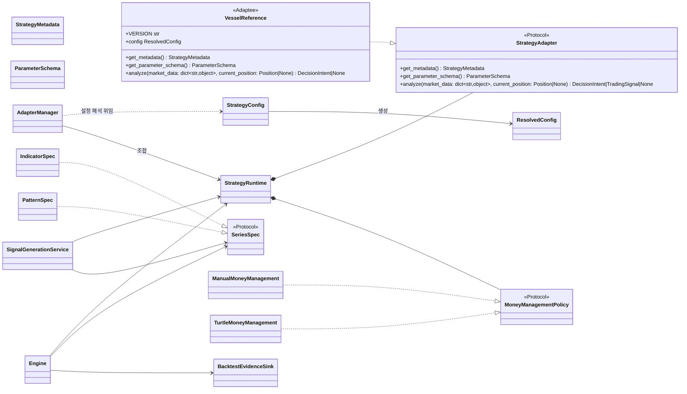
```mermaid
classDiagram
    direction LR
    class StrategyAdapter {
        <<Protocol>>
        +get_metadata() StrategyMetadata
        +get_parameter_schema() ParameterSchema
        +analyze(market_data: dict~str,object~, current_position: Position|None) DecisionIntent|TradingSignal|None
    }
    class VesselReference {
        <<Adaptee>>
        +VERSION str
        +config ResolvedConfig
        +get_metadata() StrategyMetadata
        +get_parameter_schema() ParameterSchema
        +analyze(market_data: dict~str,object~, current_position: Position|None) DecisionIntent|None
    }
    class StrategyMetadata
    class ParameterSchema
    class StrategyConfig
    class ResolvedConfig
    class AdapterManager
    class StrategyRuntime
    class SeriesSpec {
        <<Protocol>>
    }
    class IndicatorSpec
    class PatternSpec
    class MoneyManagementPolicy {
        <<Protocol>>
    }
    class ManualMoneyManagement
    class TurtleMoneyManagement
    class Engine
    class SignalGenerationService
    class BacktestEvidenceSink

    VesselReference ..|> StrategyAdapter
    AdapterManager ..> StrategyConfig : 설정 해석 위임
    StrategyConfig --> ResolvedConfig : 생성
    AdapterManager --> StrategyRuntime : 조합
    StrategyRuntime *-- StrategyAdapter
    StrategyRuntime *-- MoneyManagementPolicy
    IndicatorSpec ..|> SeriesSpec
    PatternSpec ..|> SeriesSpec
    ManualMoneyManagement ..|> MoneyManagementPolicy
    TurtleMoneyManagement ..|> MoneyManagementPolicy
    Engine --> StrategyRuntime
    Engine --> SeriesSpec
    Engine --> BacktestEvidenceSink
    SignalGenerationService --> StrategyRuntime
    SignalGenerationService --> SeriesSpec
```

현재 코드에는 `Adaptee`라는 이름의 기반 클래스가 없다. `VesselReference`와 같은 등록 클래스가 클래스 메서드와
`analyze`를 구현하여 `StrategyAdapter` 런타임 검사에 구조적으로 합격하면 Adaptee 역할을 맡는다. 현재 기본 실행
조립에서 실제로 등록되는 참조 Adaptee는 `VesselReference`다.

현재 구현은 계약 이행 중간 상태다. 목표 계약은 `DecisionIntent`와 `MoneyManagementPolicy`의 조합이지만,
`StrategyAdapter.analyze`는 다른 전략이 반환하는 legacy `TradingSignal`도 함께 받는다. `VesselReference`는 이미
`DecisionIntent`를 반환하고 백테스트 Engine이 자금관리 정책을 조합한다. `signal-service`도 같은 결정을 받지만
자금관리 정책 선택을 manual로 제한한다.

## §1.2 기존 상세 설계서와의 관계

`docs/fullspec/backtest_v2_detailed_design.md`의 §4.2는 `StrategyAdapter.analyze`가
`Optional[TradingSignal]`을 반환한다고 설명한다. 현재 Protocol의 반환형은
`DecisionIntent | TradingSignal | None`이므로 그 설명은 낡았다. 같은 절에서 첫 Adaptee가 ATR 기반 고정 손절과
익절을 전략 안에서 만든다고 설명한 부분도 현재 `VesselReference`에는 맞지 않는다. 현재 `VesselReference`는 EMA
진입 및 청산 판단만 만들고, manual 또는 turtle 정책이 보호가격과 포지션 계획을 만든다.

---

# §2 전략 계층

## §2.1 전략 계약과 설정 클래스

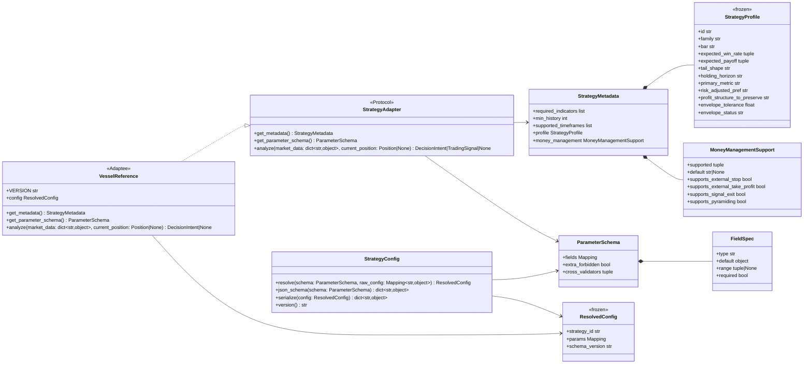
```mermaid
classDiagram
    direction LR
    class StrategyAdapter {
        <<Protocol>>
        +get_metadata() StrategyMetadata
        +get_parameter_schema() ParameterSchema
        +analyze(market_data: dict~str,object~, current_position: Position|None) DecisionIntent|TradingSignal|None
    }
    class VesselReference {
        <<Adaptee>>
        +VERSION str
        +config ResolvedConfig
        +get_metadata() StrategyMetadata
        +get_parameter_schema() ParameterSchema
        +analyze(market_data: dict~str,object~, current_position: Position|None) DecisionIntent|None
    }
    class StrategyMetadata {
        +required_indicators list
        +min_history int
        +supported_timeframes list
        +profile StrategyProfile
        +money_management MoneyManagementSupport
    }
    class MoneyManagementSupport {
        +supported tuple
        +default str|None
        +supports_external_stop bool
        +supports_external_take_profit bool
        +supports_signal_exit bool
        +supports_pyramiding bool
    }
    class FieldSpec {
        +type str
        +default object
        +range tuple|None
        +required bool
    }
    class ParameterSchema {
        +fields Mapping
        +extra_forbidden bool
        +cross_validators tuple
    }
    class StrategyConfig {
        +resolve(schema: ParameterSchema, raw_config: Mapping~str,object~) ResolvedConfig
        +json_schema(schema: ParameterSchema) dict~str,object~
        +serialize(config: ResolvedConfig) dict~str,object~
        +version() str
    }
    class ResolvedConfig {
        <<frozen>>
        +strategy_id str
        +params Mapping
        +schema_version str
    }
    class StrategyProfile {
        <<frozen>>
        +id str
        +family str
        +bar str
        +expected_win_rate tuple
        +expected_payoff tuple
        +tail_shape str
        +holding_horizon str
        +primary_metric str
        +risk_adjusted_pref str
        +profit_structure_to_preserve str
        +envelope_tolerance float
        +envelope_status str
    }

    VesselReference ..|> StrategyAdapter
    VesselReference --> ResolvedConfig
    StrategyAdapter --> StrategyMetadata
    StrategyAdapter --> ParameterSchema
    StrategyMetadata *-- StrategyProfile
    StrategyMetadata *-- MoneyManagementSupport
    ParameterSchema *-- FieldSpec
    StrategyConfig --> ParameterSchema
    StrategyConfig --> ResolvedConfig
```

`StrategyAdapter`는 `typing.Protocol`이며 상태나 공통 구현을 제공하지 않는다. `get_metadata`와
`get_parameter_schema`는 클래스 메서드다. `analyze`는 Engine이 만든 `market_data`와 현재 `Position`을 받고,
목표 결정, legacy 신호, 또는 관망을 뜻하는 `None`을 반환한다.

`StrategyMetadata`는 전략이 소비하는 계열 선언, 양의 `min_history`, 하나 이상의 지원 timeframe,
`StrategyProfile`, 그리고 `MoneyManagementSupport`를 담는다. `MoneyManagementSupport`는 허용 정책 식별자와
기본 정책 및 네 capability를 선언한다. 현재 `AdapterManager.create_runtime`은 정책 식별자가 `supported`에 있는지
검사하고, turtle을 선택했을 때 `supports_signal_exit`가 참인지 검사한다. 나머지 세 capability는 메타데이터에
존재하지만 현재 `create_runtime`이 별도로 거부 조건에 사용하지 않는다.

`ParameterSchema`는 필드별 `FieldSpec`, 잉여 키 거부 여부, 교차 검증 함수들을 보유한다. `StrategyConfig.resolve`는
`strategy_id`와 `params`만 있는 wrapper를 요구하고, 기본값 병합, 타입 검사, 포함 범위 검사, 잉여 키 검사,
교차 검증을 수행한다. 결과인 `ResolvedConfig`는 중첩 매핑과 컬렉션까지 읽기 전용 형태로 동결한다. 현재 전략 설정
스키마 판은 `1.0.0`이다.

`StrategyProfile`은 전략군, 기대 승률 및 payoff 범위, 꼬리 형태, 보유 지평, 평가 지표, 보존할 수익 구조 및
envelope 성숙도를 담는다. 현재 검증은 `id`, `family`, `bar`가 비어 있지 않은지, 승률 범위가 0과 1 사이에서
정렬되어 있는지, payoff 범위가 0 이상에서 정렬되어 있는지, `tail_shape`가 `right_fat`, `symmetric`,
`left_fat` 중 하나인지, `risk_adjusted_pref`가 `sortino`, `sharpe`, `calmar` 중 하나인지,
`envelope_status`가 `provisional`, `updating`, `established` 중 하나인지, tolerance가 음수가 아닌지를 본다.
`family`, `holding_horizon`, `primary_metric`, `profit_structure_to_preserve`에 별도의 닫힌 열거형을 강제하지 않는다.
이 값은 평가 계층에서 사용되지만 아래 §2.3의 등록 대조에는 포함되지 않는다.

현재 `VesselReference`의 전략 판은 `2.0.0`이다. 이 클래스는 EMA 9와 EMA 21의 상대 위치로 진입과 청산을
판단하고 `DecisionIntent`를 반환한다. 다만 저장된 과거 설정을 manual 정책으로 옮기는 호환 경로 때문에
`ParameterSchema`에는 `atr_stop_multiple`, `reward_risk`, `leverage`가 임시로 남아 있다. 이 세 값은 신규 전략이
소유할 파라미터의 선례가 아니라 legacy manual 호환 입력이다.

## §2.2 목표 결정과 legacy 신호

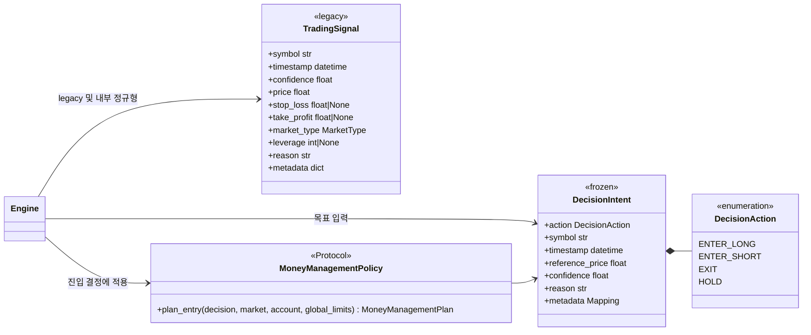
```mermaid
classDiagram
    direction LR
    class DecisionAction {
        <<enumeration>>
        ENTER_LONG
        ENTER_SHORT
        EXIT
        HOLD
    }
    class DecisionIntent {
        <<frozen>>
        +action DecisionAction
        +symbol str
        +timestamp datetime
        +reference_price float
        +confidence float
        +reason str
        +metadata Mapping
    }
    class TradingSignal {
        <<legacy>>
        +symbol str
        +timestamp datetime
        +confidence float
        +price float
        +stop_loss float|None
        +take_profit float|None
        +market_type MarketType
        +leverage int|None
        +reason str
        +metadata dict
    }
    class MoneyManagementPolicy {
        <<Protocol>>
        +plan_entry(decision, market, account, global_limits) MoneyManagementPlan
    }
    class Engine

    DecisionIntent *-- DecisionAction
    Engine --> DecisionIntent : 목표 입력
    Engine --> TradingSignal : legacy 및 내부 정규형
    Engine --> MoneyManagementPolicy : 진입 결정에 적용
    MoneyManagementPolicy --> DecisionIntent
```

`DecisionIntent`에는 진입 방향과 청산 및 관망이 `DecisionAction`으로 명시된다. 이 타입에는 `stop_loss`,
`take_profit`, `leverage`, `quantity`, `market_type`이 없다. 보호가격, 요청 수량 및 요청 leverage를 정하는 입력은
정책에 전달되며 전략 결정에는 들어가지 않는다.

legacy `TradingSignal`에는 `stop_loss`, `take_profit`, `leverage`와 `market_type`이 있다. 별도의 action 필드는
없으므로 두 보호가격이 모두 없으면 청산으로 해석하고, 보호가격이 있으면 보호가격과 `price`의 상대 위치로 방향을
유도한다. 백테스트 Engine과 `signal-service`는 이 legacy 해석을 계속 보유한다.

백테스트 Engine은 `DecisionIntent` 진입을 받으면 정책 계획을 적용한 뒤 내부 처리 형식인 `TradingSignal`로
구체화한다. `DecisionIntent` 청산은 정책 계산 없이 두 보호가격이 없는 `TradingSignal`로 구체화한다. 처음부터
`TradingSignal`을 반환한 legacy 전략은 정책 계획을 거치지 않고 그 신호의 보호가격과 leverage를 사용한다.

신규 전략의 반환 계약은 `DecisionIntent`다. 신규 전략이 legacy `TradingSignal`의 보호가격과 leverage 필드를
사용하면 목표 소유 경계를 우회하게 된다.

## §2.3 AdapterManager의 생성과 대조

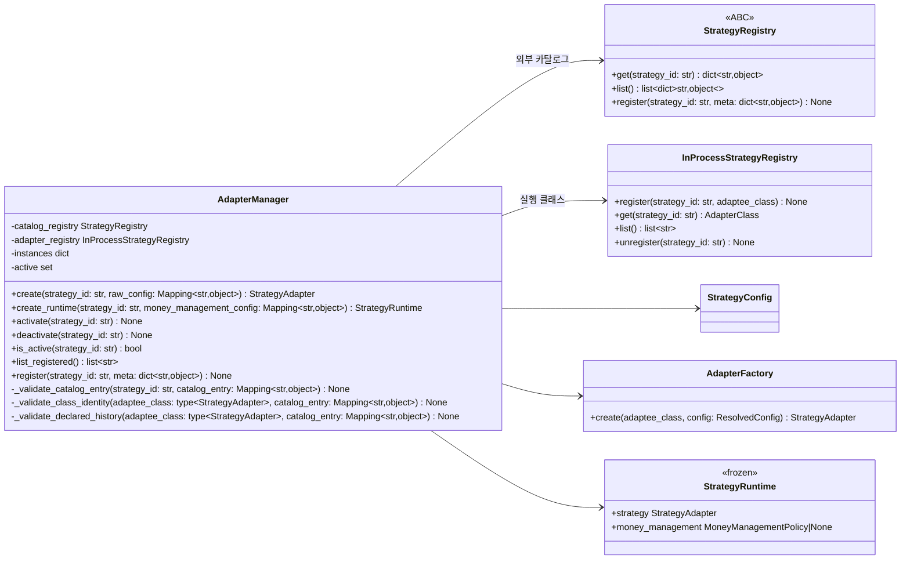
```mermaid
classDiagram
    direction LR
    class AdapterManager {
        -catalog_registry StrategyRegistry
        -adapter_registry InProcessStrategyRegistry
        -instances dict
        -active set
        +create(strategy_id: str, raw_config: Mapping~str,object~) StrategyAdapter
        +create_runtime(strategy_id: str, raw_config: Mapping~str,object~, money_management_config: Mapping~str,object~) StrategyRuntime
        +activate(strategy_id: str) None
        +deactivate(strategy_id: str) None
        +is_active(strategy_id: str) bool
        +list_registered() list~str~
        +register(strategy_id: str, meta: dict~str,object~) None
        -_validate_catalog_entry(strategy_id: str, catalog_entry: Mapping~str,object~) None
        -_validate_class_identity(adaptee_class: type~StrategyAdapter~, catalog_entry: Mapping~str,object~) None
        -_validate_declared_history(adaptee_class: type~StrategyAdapter~, catalog_entry: Mapping~str,object~) None
    }
    class StrategyRegistry {
        <<ABC>>
        +get(strategy_id: str) dict~str,object~
        +list() list~dict~str,object~~
        +register(strategy_id: str, meta: dict~str,object~) None
    }
    class InProcessStrategyRegistry {
        +register(strategy_id: str, adaptee_class) None
        +get(strategy_id: str) AdapterClass
        +list() list~str~
        +unregister(strategy_id: str) None
    }
    class AdapterFactory {
        +create(adaptee_class, config: ResolvedConfig) StrategyAdapter
    }
    class StrategyRuntime {
        <<frozen>>
        +strategy StrategyAdapter
        +money_management MoneyManagementPolicy|None
    }

    AdapterManager --> StrategyRegistry : 외부 카탈로그
    AdapterManager --> InProcessStrategyRegistry : 실행 클래스
    AdapterManager --> StrategyConfig
    AdapterManager --> AdapterFactory
    AdapterManager --> StrategyRuntime
```

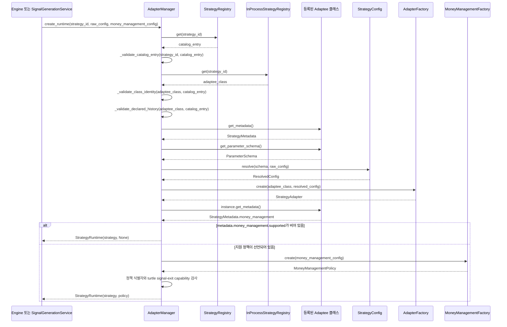
```mermaid
sequenceDiagram
    participant E as Engine 또는 SignalGenerationService
    participant AM as AdapterManager
    participant CR as StrategyRegistry
    participant IR as InProcessStrategyRegistry
    participant A as 등록된 Adaptee 클래스
    participant SC as StrategyConfig
    participant AF as AdapterFactory
    participant MF as MoneyManagementFactory

    E->>AM: create_runtime(strategy_id, raw_config, money_management_config)
    AM->>CR: get(strategy_id)
    CR-->>AM: catalog_entry
    AM->>AM: _validate_catalog_entry(strategy_id, catalog_entry)
    AM->>IR: get(strategy_id)
    IR-->>AM: adaptee_class
    AM->>AM: _validate_class_identity(adaptee_class, catalog_entry)
    AM->>AM: _validate_declared_history(adaptee_class, catalog_entry)
    AM->>A: get_metadata()
    A-->>AM: StrategyMetadata
    AM->>A: get_parameter_schema()
    A-->>AM: ParameterSchema
    AM->>SC: resolve(schema, raw_config)
    SC-->>AM: ResolvedConfig
    AM->>AF: create(adaptee_class, resolved_config)
    AF-->>AM: StrategyAdapter
    AM->>A: instance.get_metadata()
    A-->>AM: StrategyMetadata.money_management
    alt metadata.money_management.supported가 비어 있음
        AM-->>E: StrategyRuntime(strategy, None)
    else 지원 정책이 선언되어 있음
        AM->>MF: create(money_management_config)
        MF-->>AM: MoneyManagementPolicy
        AM->>AM: 정책 식별자와 turtle signal-exit capability 검사
        AM-->>E: StrategyRuntime(strategy, policy)
    end
```

외부 카탈로그 행은 `strategy_id`가 요청과 다르거나, `is_active`가 거짓이거나, `is_deprecated`가 참이면 거부된다.
외부 등록과 실행 클래스를 서로 대조할 때는 클래스 신원인 `class_name`과 `module_path`, 그리고 이력 선언 셋인
`min_history`, `supported_timeframes`, `required_indicators_json`만 본다. 지표 선언은 목록 순서와 descriptor 내부
키 순서를 무시하고 이름과 파라미터 조합으로 비교한다. 지원 timeframe 목록은 현재 목록 순서까지 같아야 한다.
각 대조 필드가 `None`이거나 행에 없으면 해당 비교는 건너뛴다.

이 대조는 외부 `strategy_version`과 클래스의 `VERSION`을 비교하지 않는다. 또한 `default_params_json`과
`ParameterSchema`의 필드 및 기본값, `StrategyProfile`, `MoneyManagementSupport`를 외부 등록과 비교하지 않는다.
따라서 AdapterManager의 대조가 전략 판, 파라미터 기본값, 프로파일 또는 정책 capability의 등록 동기화를
보장한다고 해석하면 안 된다.

`register`는 같은 식별자의 in-process 클래스가 존재하는지만 확인하고 외부 포트에 쓰기를 위임한다. 현재
`BacktestStrategyRegistry`와 `SignalStrategyRegistry` 구현은 모두 읽기 전용이므로 해당 실행면에서 등록을 시도하면
`PermissionError`가 발생한다.

---

# §3 능력 계층

## §3.1 공통 계열 계약과 두 레지스트리

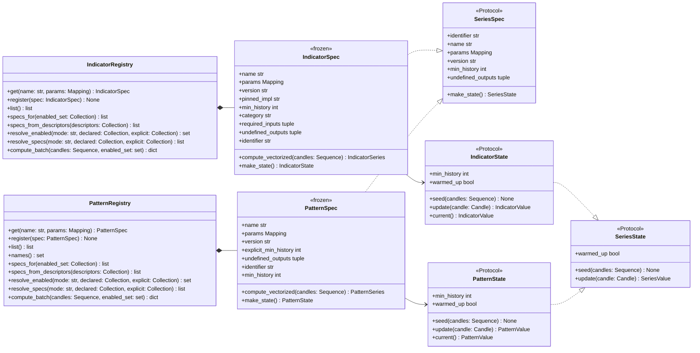
```mermaid
classDiagram
    direction LR
    class SeriesSpec {
        <<Protocol>>
        +identifier str
        +name str
        +params Mapping
        +version str
        +min_history int
        +undefined_outputs tuple
        +make_state() SeriesState
    }
    class SeriesState {
        <<Protocol>>
        +warmed_up bool
        +seed(candles: Sequence) None
        +update(candle: Candle) SeriesValue
    }
    class IndicatorSpec {
        <<frozen>>
        +name str
        +params Mapping
        +version str
        +pinned_impl str
        +min_history int
        +category str
        +required_inputs tuple
        +undefined_outputs tuple
        +identifier str
        +compute_vectorized(candles: Sequence) IndicatorSeries
        +make_state() IndicatorState
    }
    class IndicatorState {
        <<Protocol>>
        +min_history int
        +warmed_up bool
        +seed(candles: Sequence) None
        +update(candle: Candle) IndicatorValue
        +current() IndicatorValue
    }
    class IndicatorRegistry {
        +get(name: str, params: Mapping) IndicatorSpec
        +register(spec: IndicatorSpec) None
        +list() list
        +specs_for(enabled_set: Collection) list
        +specs_from_descriptors(descriptors: Collection) list
        +resolve_enabled(mode: str, declared: Collection, explicit: Collection) set
        +resolve_specs(mode: str, declared: Collection, explicit: Collection) list
        +compute_batch(candles: Sequence, enabled_set: set) dict
    }
    class PatternSpec {
        <<frozen>>
        +name str
        +params Mapping
        +version str
        +explicit_min_history int
        +undefined_outputs tuple
        +identifier str
        +min_history int
        +compute_vectorized(candles: Sequence) PatternSeries
        +make_state() PatternState
    }
    class PatternState {
        <<Protocol>>
        +min_history int
        +warmed_up bool
        +seed(candles: Sequence) None
        +update(candle: Candle) PatternValue
        +current() PatternValue
    }
    class PatternRegistry {
        +get(name: str, params: Mapping) PatternSpec
        +register(spec: PatternSpec) None
        +list() list
        +names() set
        +specs_for(enabled_set: Collection) list
        +specs_from_descriptors(descriptors: Collection) list
        +resolve_enabled(mode: str, declared: Collection, explicit: Collection) set
        +resolve_specs(mode: str, declared: Collection, explicit: Collection) list
        +compute_batch(candles: Sequence, enabled_set: set) dict
    }

    IndicatorSpec ..|> SeriesSpec
    PatternSpec ..|> SeriesSpec
    IndicatorState ..|> SeriesState
    PatternState ..|> SeriesState
    IndicatorSpec --> IndicatorState
    PatternSpec --> PatternState
    IndicatorRegistry *-- IndicatorSpec
    PatternRegistry *-- PatternSpec
```

`IndicatorSpec`와 `PatternSpec`는 서로 다른 계산 신원 타입이다. 두 타입은 상속으로 묶이지 않고 Engine과
`signal-service`가 실제로 소비하는 일곱 멤버를 `SeriesSpec` Protocol로 함께 만족한다. 두 실행면이 사용하는 증분
상태 계약은 `seed`, `update`, `warmed_up`인 `SeriesState`다. `compute_vectorized`와 `current`는 batch 검증과
증분 계산 parity 확인을 위한 각 레지스트리 고유 API이며 두 서비스의 실행 루프가 호출하지 않는다.

지표 레지스트리는 이름과 파라미터 조합을 계산 신원으로 등록한다. 동일 이름이라도 파라미터가 다르면 별도 조합이다.
패턴 레지스트리도 이름과 파라미터 조합을 신원으로 사용하지만 현재 TA-Lib 패턴 등록분의 파라미터는 비어 있다.
descriptor는 정확히 `name`과 `params` 두 키를 가져야 하며, 이름은 대소문자를 무시하고 파라미터는 등록값과 정확히
같아야 한다.

현재 기본 지표 레지스트리에는 91개 이름 및 파라미터 조합과 88개 고유 이름이 있다. 현재 기본 패턴 레지스트리에는
61개 패턴 조합과 61개 고유 이름이 있다. 이 수치는 현재 수집하여 등록한 목록의 크기이며, 앞으로도 이 개수를
유지해야 하는 계약은 아니다.

## §3.2 계열 선언, 해석 및 실행 열쇠

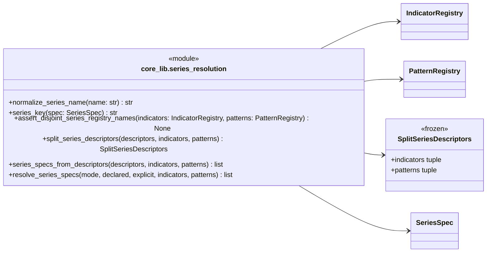
```mermaid
classDiagram
    direction LR
    class SeriesResolution["core_lib.series_resolution"] {
        <<module>>
        +normalize_series_name(name: str) str
        +series_key(spec: SeriesSpec) str
        +assert_disjoint_series_registry_names(indicators: IndicatorRegistry, patterns: PatternRegistry) None
        +split_series_descriptors(descriptors, indicators, patterns) SplitSeriesDescriptors
        +series_specs_from_descriptors(descriptors, indicators, patterns) list
        +resolve_series_specs(mode, declared, explicit, indicators, patterns) list
    }
    class SplitSeriesDescriptors {
        <<frozen>>
        +indicators tuple
        +patterns tuple
    }
    class IndicatorRegistry
    class PatternRegistry
    class SeriesSpec

    SeriesResolution --> IndicatorRegistry
    SeriesResolution --> PatternRegistry
    SeriesResolution --> SplitSeriesDescriptors
    SeriesResolution --> SeriesSpec
```

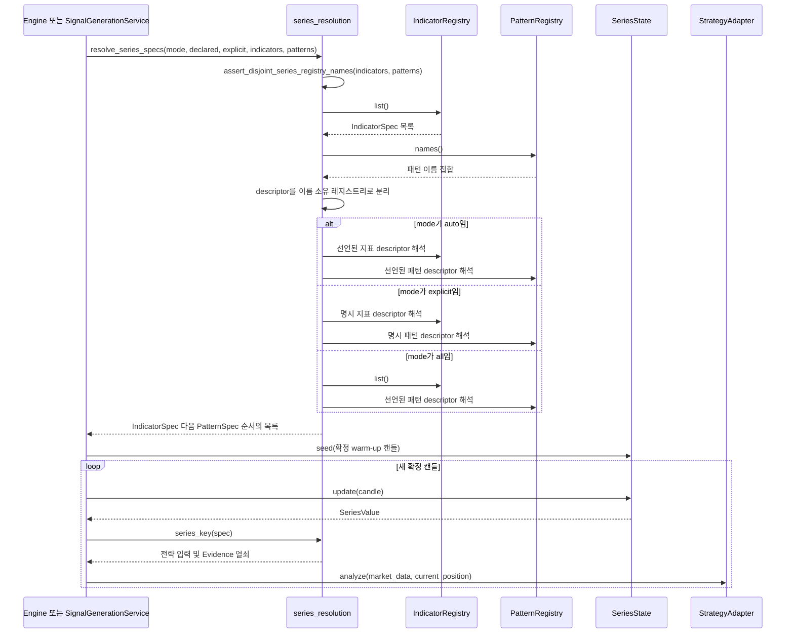
```mermaid
sequenceDiagram
    participant C as Engine 또는 SignalGenerationService
    participant R as series_resolution
    participant IR as IndicatorRegistry
    participant PR as PatternRegistry
    participant S as SeriesState
    participant A as StrategyAdapter

    C->>R: resolve_series_specs(mode, declared, explicit, indicators, patterns)
    R->>R: assert_disjoint_series_registry_names(indicators, patterns)
    R->>IR: list()
    IR-->>R: IndicatorSpec 목록
    R->>PR: names()
    PR-->>R: 패턴 이름 집합
    R->>R: descriptor를 이름 소유 레지스트리로 분리
    alt mode가 auto임
        R->>IR: 선언된 지표 descriptor 해석
        R->>PR: 선언된 패턴 descriptor 해석
    else mode가 explicit임
        R->>IR: 명시 지표 descriptor 해석
        R->>PR: 명시 패턴 descriptor 해석
    else mode가 all임
        R->>IR: list()
        R->>PR: 선언된 패턴 descriptor 해석
    end
    R-->>C: IndicatorSpec 다음 PatternSpec 순서의 목록
    C->>S: seed(확정 warm-up 캔들)
    loop 새 확정 캔들
        C->>S: update(candle)
        S-->>C: SeriesValue
        C->>R: series_key(spec)
        R-->>C: 전략 입력 및 Evidence 열쇠
        C->>A: analyze(market_data, current_position)
    end
```

두 레지스트리의 이름 집합은 서로소여야 한다. 검사는 원래 이름의 중복뿐 아니라 이름을 소문자로 바꾸고 영숫자가
아닌 연속 문자를 밑줄로 바꾼 실행 열쇠 접두부의 중복도 거부한다. 어느 레지스트리에도 없는 이름은 `KeyError`로
거부된다.

`series_key`는 지표 snapshot과 전략 입력에서 사용하는 실행 열쇠를 만든다. 이름을 위 방식으로 정규화한 뒤,
파라미터 이름을 정렬하여 `key=value` 형태로 붙인다. boolean 값은 소문자로 쓰고 정수값인 float는 소수점 없이
쓴다. 예를 들어 이름이 `EMA`이고 `period`가 9이면 실행 열쇠는 `ema:period=9`다. 이 열쇠는 대문자 이름과
`repr` 형태 파라미터를 쓰는 `IndicatorSpec.identifier`와 다른 용도의 신원이다.

세 해석 모드는 지표와 패턴에 대해 다음과 같이 동작한다.

| 모드 | 지표의 현재 의미 | 패턴의 현재 의미 |
|---|---|---|
| `auto` | 전략 선언과 전략 timeframe 정책 선언에 있는 지표 조합을 계산한다. | 같은 선언 목록에 있는 패턴 조합만 계산한다. |
| `explicit` | `explicit_indicators`에 적은 지표 조합만 먼저 해석하며, 백테스트 Engine은 그 결과에 모든 필수 조합이 포함되지 않으면 실행을 거부한다. | `explicit_indicators`에 적은 패턴 조합만 해석하며, 선언된 필수 패턴이 빠지면 같은 필수 조합 검사에서 실행을 거부한다. |
| `all` | 기본 지표 레지스트리에 등록된 모든 조합을 계산한다. | 패턴 전체를 켜지 않고 전략 선언에 있는 패턴 조합만 계산한다. |

`signal-service`는 현재 `auto`만 사용한다. `explicit`과 `all`은 백테스트 `RunConfig.indicator_mode`에만 노출된다.

## §3.3 패턴 출력과 워밍업

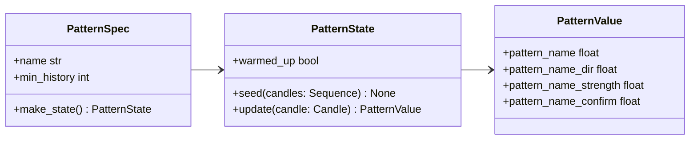
```mermaid
classDiagram
    direction LR
    class PatternValue {
        +pattern_name float
        +pattern_name_dir float
        +pattern_name_strength float
        +pattern_name_confirm float
    }
    class PatternSpec {
        +name str
        +min_history int
        +make_state() PatternState
    }
    class PatternState {
        +seed(candles: Sequence) None
        +update(candle: Candle) PatternValue
        +warmed_up bool
    }
    PatternSpec --> PatternState
    PatternState --> PatternValue
```

패턴 하나는 매 캔들마다 네 출력 키를 만든다. 기본 이름 키는 일치 여부를 담고, `_dir` 접미사 키는 방향을 담으며,
`_strength` 접미사 키는 강도를 담고, `_confirm` 접미사 키는 그 캔들에서 발생한 후속 확인을 담는다. 워밍업 전에는
네 값이 모두 NaN이며, 워밍업 후 판단을 수행한 비일치 값은 `0.0`이다. 확인은 미래 패턴 캔들에 소급해서 쓰지 않고
확인이 실제로 일어난 뒤의 캔들에 기록된다.

백테스트의 전략 timeframe 계열 warm-up 캔들 수는 `StrategyMetadata.min_history`와 해석된 모든
`SeriesSpec.min_history` 중 가장 큰 값이다. manual 정책의 ATR 14 요구는 strategy timeframe 요구로 전략 선언에
합쳐지므로 이 최댓값 계산에 들어간다. 상태들은 선택한 warm-up 캔들로 `seed`되며, 하나라도 `warmed_up`이 거짓이면
실행을 거부한다.

백테스트의 최초 제한 조회 달력 구간은 전략 timeframe의 위 warm-up 개수와 정책이 선언한 각 timeframe의
`max(period, min_history)`를 각각 시간으로 환산한 값 중 가장 큰 값에 현재 구현 상수 4를 곱해 잡는다. 이 배수는
결측을 흡수하기 위한 조회 최적화일 뿐 정확성 계약이 아니다. 전략 timeframe preload가 부족하면 하한 제한을 풀고
다시 읽는다.

turtle의 일봉 요구는 전략 timeframe `SeriesSpec` 목록에 들어가지 않는다. Engine은 별도 일봉을 읽어 `N` 계열을
계산하고 run 시작 시각 이전에 확정된 값이 없으면 제한을 풀어 다시 읽으며, 그래도 값이 없으면 실행을 거부한다.
`signal-service`는 warm-up 개수에 판단 대상 최신 캔들 한 개를 더한 이력이 있어야 시작하고, 앞부분으로 상태를
seed한 뒤 마지막 한 캔들만 판단한다.

## §3.4 전략에 실제로 전달되는 입력

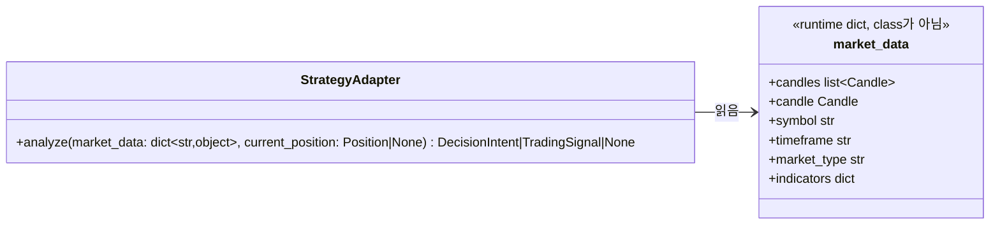
```mermaid
classDiagram
    direction LR
    class market_data {
        <<runtime dict, class가 아님>>
        +candles list~Candle~
        +candle Candle
        +symbol str
        +timeframe str
        +market_type str
        +indicators dict
    }
    class StrategyAdapter {
        +analyze(market_data: dict~str,object~, current_position: Position|None) DecisionIntent|TradingSignal|None
    }
    StrategyAdapter --> market_data : 읽음
```

Engine은 `candles`, `candle`, `symbol`, `timeframe`, `market_type`, `indicators` 여섯 키가 있는 dict를 전략에
전달한다. `candles`는 Engine이 보유한 확정 캔들 이력 전체의 복사본이며, 선택된 warm-up 꼬리에서 시작하여 현재까지
처리한 평가 캔들이 차례로 붙는다. `candle`은 이번에 막 확정된 캔들이다. `market_type`은 현재 문자열 값이며,
`indicators`는 `series_key`에서 각 증분 상태가 낸 float 또는 다중 출력 dict로 가는 매핑이다. 현재 `Position`은
dict가 아니라 `analyze`의 두 번째 인자로 별도 전달된다.

전략 입력에는 별도 일봉 목록, 임의의 다른 timeframe 캔들 맵, 가격 변환용 캔들, 계좌 equity, 가용 현금이 없다.
turtle 실행에서 읽은 일봉은 정책 입력용 `N` 계산에만 사용되며 전략의 `candles`나 `indicators`에 추가되지 않는다.

---

# §4 자금관리 계층

## §4.1 정책 클래스와 값 타입

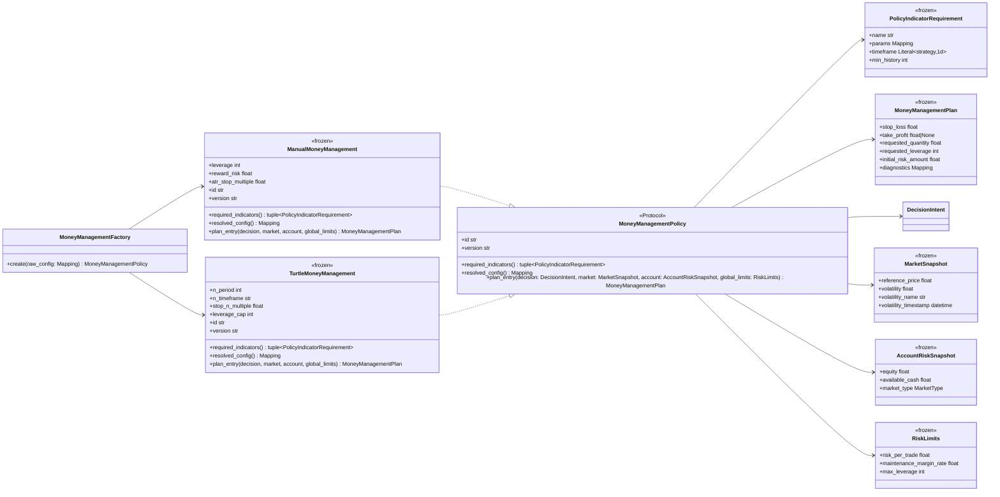
```mermaid
classDiagram
    direction LR
    class MoneyManagementPolicy {
        <<Protocol>>
        +id str
        +version str
        +required_indicators() tuple~PolicyIndicatorRequirement~
        +resolved_config() Mapping
        +plan_entry(decision: DecisionIntent, market: MarketSnapshot, account: AccountRiskSnapshot, global_limits: RiskLimits) MoneyManagementPlan
    }
    class ManualMoneyManagement {
        <<frozen>>
        +leverage int
        +reward_risk float
        +atr_stop_multiple float
        +id str
        +version str
        +required_indicators() tuple~PolicyIndicatorRequirement~
        +resolved_config() Mapping
        +plan_entry(decision, market, account, global_limits) MoneyManagementPlan
    }
    class TurtleMoneyManagement {
        <<frozen>>
        +n_period int
        +n_timeframe str
        +stop_n_multiple float
        +leverage_cap int
        +id str
        +version str
        +required_indicators() tuple~PolicyIndicatorRequirement~
        +resolved_config() Mapping
        +plan_entry(decision, market, account, global_limits) MoneyManagementPlan
    }
    class MoneyManagementFactory {
        +create(raw_config: Mapping) MoneyManagementPolicy
    }
    class PolicyIndicatorRequirement {
        <<frozen>>
        +name str
        +params Mapping
        +timeframe Literal~strategy,1d~
        +min_history int
    }
    class MoneyManagementPlan {
        <<frozen>>
        +stop_loss float
        +take_profit float|None
        +requested_quantity float
        +requested_leverage int
        +initial_risk_amount float
        +diagnostics Mapping
    }
    class RiskLimits {
        <<frozen>>
        +risk_per_trade float
        +maintenance_margin_rate float
        +max_leverage int
    }
    class AccountRiskSnapshot {
        <<frozen>>
        +equity float
        +available_cash float
        +market_type MarketType
    }
    class MarketSnapshot {
        <<frozen>>
        +reference_price float
        +volatility float
        +volatility_name str
        +volatility_timestamp datetime
    }
    class DecisionIntent

    ManualMoneyManagement ..|> MoneyManagementPolicy
    TurtleMoneyManagement ..|> MoneyManagementPolicy
    MoneyManagementFactory --> ManualMoneyManagement
    MoneyManagementFactory --> TurtleMoneyManagement
    MoneyManagementPolicy --> PolicyIndicatorRequirement
    MoneyManagementPolicy --> MoneyManagementPlan
    MoneyManagementPolicy --> DecisionIntent
    MoneyManagementPolicy --> MarketSnapshot
    MoneyManagementPolicy --> AccountRiskSnapshot
    MoneyManagementPolicy --> RiskLimits
```

`MoneyManagementPolicy`는 상태를 보유하지 않고 진입 `DecisionIntent`를 보호가격과 포지션 계획으로 바꾸는
Protocol이다. 현재 Protocol은 식별자와 판, 지표 요구사항, 정규화 설정, 진입 계획 메서드를 가진다. 청산 결정을
정책에 적용하는 메서드는 없다.

`PolicyIndicatorRequirement.timeframe`이 허용하는 값은 현재 `strategy`와 `1d`뿐이다. 임의 timeframe 문자열이나
복수 전략 입력 timeframe을 표현하는 타입은 없다. `strategy`는 실행 전략의 timeframe으로 치환되고, `1d`는 정책
전용 일봉 경로로 처리된다.

`MarketSnapshot`은 판단 가격과 정책이 쓸 변동성 값, 이름, 확정 시각을 담는다. `AccountRiskSnapshot`은 양의
equity와 가용 현금 및 시장 종류를 담는다. `RiskLimits`는 거래당 위험률, 유지증거금률 및 최대 leverage를 담으며,
거래당 위험률은 0보다 크고 1퍼센트 이하여야 한다. 기본 최대 leverage는 100이다.

`MoneyManagementPlan`은 하나의 최초 손절가격, 선택적인 하나의 목표가격, 요청 수량, 요청 leverage, 최초 위험액,
진단값을 담는다. 이 계획은 주문이 아니며, 백테스트 실행 계층은 체결 가격에 맞추어 손절을 재고정하고 위험예산과
가용 증거금에 맞추어 수량을 더 줄일 수 있다.

`MoneyManagementFactory.create`는 mode가 없으면 manual로 해석한다. mode별 허용 키 이외의 값은 거부한다. 현재
생성 가능한 정책은 판 `1.0.0`인 manual과 판 `1.0.0`인 turtle 두 개다.

## §4.2 ManualMoneyManagement

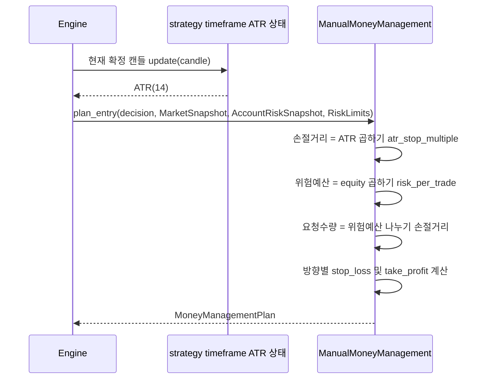
```mermaid
sequenceDiagram
    participant E as Engine
    participant ATR as strategy timeframe ATR 상태
    participant M as ManualMoneyManagement

    E->>ATR: 현재 확정 캔들 update(candle)
    ATR-->>E: ATR(14)
    E->>M: plan_entry(decision, MarketSnapshot, AccountRiskSnapshot, RiskLimits)
    M->>M: 손절거리 = ATR 곱하기 atr_stop_multiple
    M->>M: 위험예산 = equity 곱하기 risk_per_trade
    M->>M: 요청수량 = 위험예산 나누기 손절거리
    M->>M: 방향별 stop_loss 및 take_profit 계산
    M-->>E: MoneyManagementPlan
```

manual은 전략 timeframe의 ATR 14를 요구한다. 손절거리는 ATR과 `atr_stop_multiple`의 곱이며, 목표가격은 그
손절거리에 `reward_risk`를 적용하여 반대편에 둔다. 요청 수량은 equity와 전역 `risk_per_trade`로 만든 위험예산을
손절거리로 나눈 값이다. futures에서는 설정 leverage를 요청하고 spot에서는 1을 요청한다. 설정 leverage가 전역
최대값보다 크면 거부한다.

이 정책은 legacy Vessel의 ATR 손절, 고정 reward-risk 목표 및 leverage 결과를 보존하는 호환 정책이다. 백테스트
`RunConfig`에서 `money_management`가 없는 `vessel-reference` 설정은 과거 평면 파라미터를 manual 설정으로
정규화한다. `RunConfig.money_management`와 `VesselReference` 메타데이터의 기본값도 manual이다.

## §4.3 TurtleMoneyManagement와 별도 일봉

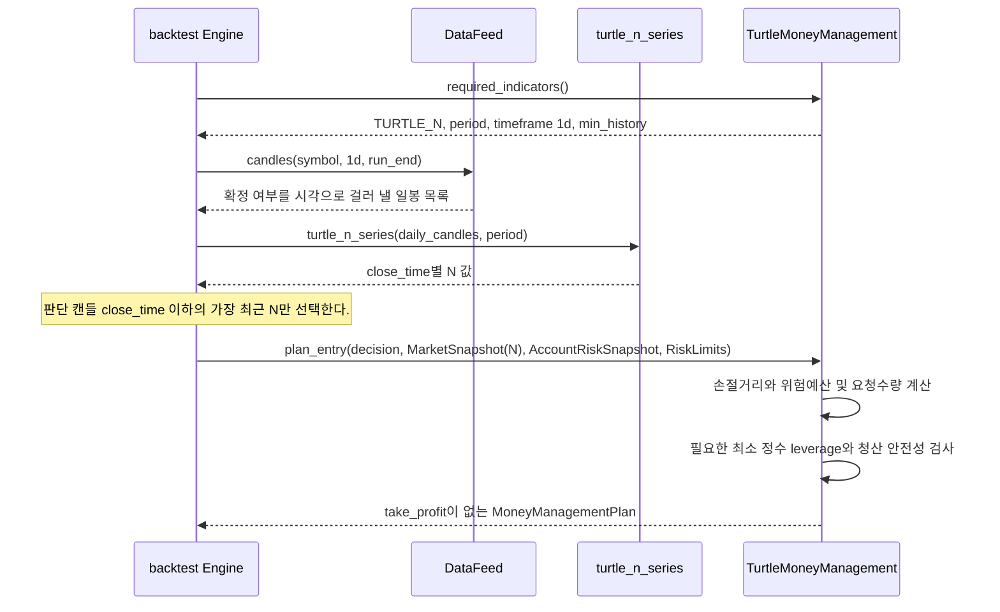
```mermaid
sequenceDiagram
    participant E as backtest Engine
    participant F as DataFeed
    participant N as turtle_n_series
    participant T as TurtleMoneyManagement

    E->>T: required_indicators()
    T-->>E: TURTLE_N, period, timeframe 1d, min_history
    E->>F: candles(symbol, 1d, run_end)
    F-->>E: 확정 여부를 시각으로 걸러 낼 일봉 목록
    E->>N: turtle_n_series(daily_candles, period)
    N-->>E: close_time별 N 값
    Note over E: 판단 캔들 close_time 이하의 가장 최근 N만 선택한다.
    E->>T: plan_entry(decision, MarketSnapshot(N), AccountRiskSnapshot, RiskLimits)
    T->>T: 손절거리와 위험예산 및 요청수량 계산
    T->>T: 필요한 최소 정수 leverage와 청산 안전성 검사
    T-->>E: take_profit이 없는 MoneyManagementPlan
```

turtle은 `TURTLE_N` 하나를 `1d`에서 요구한다. Engine은 전략 timeframe 이력을 재표본화하지 않고 같은 실행 안에서
`DataFeed.candles(symbol, "1d", end)`를 별도로 호출한다. `turtle_n_series`는 True Range를 만들고 첫 기간 평균 뒤
Wilder 방식으로 N을 갱신한다. 판단 시점에는 해당 시각 이하에 닫힌 가장 최근 일봉의 N만 선택한다.

turtle은 N과 `stop_n_multiple`로 손절거리를 만든다. 위험예산과 수량 계산은 manual과 같은 전역 1퍼센트 상한을
사용한다. 요청 leverage는 요청 notional을 가용 현금으로 나눈 값의 올림이며 최소 1이다. futures에서는 정책 cap과
전역 cap 중 작은 값보다 높으면 거부하고, spot에서는 leverage 1로 감당하지 못하면 거부한다. 예상 청산가격이
손절보다 먼저 닿으면 계획을 거부한다. 고정 take-profit은 만들지 않는다.

현재 turtle은 피라미딩 계획을 만들지 않으며 전체 역사적 Turtle 시스템을 구현하지 않는다. 전략 진입 및 청산 edge는
계속 전략 소유다.

## §4.4 소유 경계와 정책 지표 합성

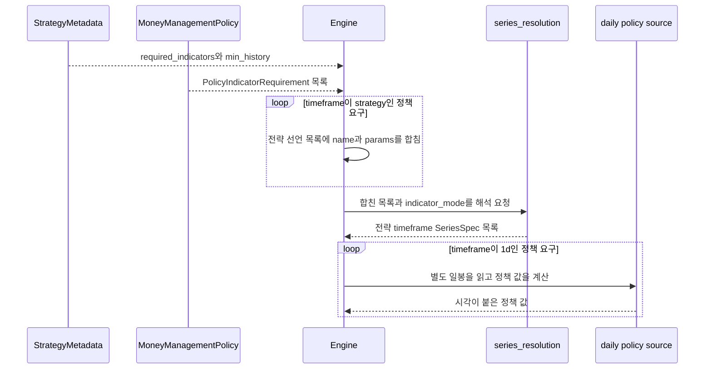
```mermaid
sequenceDiagram
    participant S as StrategyMetadata
    participant P as MoneyManagementPolicy
    participant E as Engine
    participant R as series_resolution
    participant D as daily policy source

    S-->>E: required_indicators와 min_history
    P-->>E: PolicyIndicatorRequirement 목록
    loop timeframe이 strategy인 정책 요구
        E->>E: 전략 선언 목록에 name과 params를 합침
    end
    E->>R: 합친 목록과 indicator_mode를 해석 요청
    R-->>E: 전략 timeframe SeriesSpec 목록
    loop timeframe이 1d인 정책 요구
        E->>D: 별도 일봉을 읽고 정책 값을 계산
        D-->>E: 시각이 붙은 정책 값
    end
```

보호가격, 요청 수량, 요청 leverage는 자금관리 정책이 소유하며 전략이 소유하지 않는다. 계좌 전체 제한과 체결 가격
및 가용 증거금에 따른 최종 수량 제한은 실행 경로가 적용한다. 전략은 진입 및 청산 판단, 전략 고유 파라미터,
필요 계열 선언만 소유한다.

정책 요구사항 중 timeframe이 `strategy`인 항목은 `StrategyMetadata.required_indicators`와 합쳐진 뒤 공통
`series_resolution`을 통과한다. manual의 ATR 14가 이 경로를 사용한다. timeframe이 `1d`인 항목은 공통 전략
입력 계열에 합치지 않고 별도 정책 원천 및 Evidence 선언으로 처리한다. turtle의 N이 이 경로를 사용한다.

---

# §5 실행면별 조합 차이

같은 `core_lib` 계약을 사용해도 두 서비스의 정책 선택과 결과 책임은 같지 않다. 아래 두 시퀀스가 각각 현재
실행면의 사실이며, 하나의 공통 동작으로 합쳐 읽으면 안 된다.

## §5.1 backtest-service

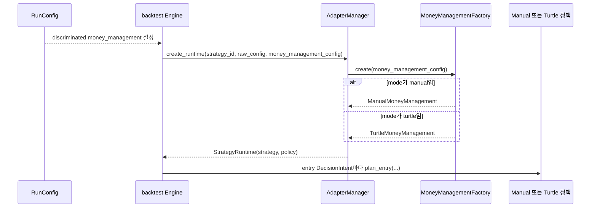
```mermaid
sequenceDiagram
    participant RC as RunConfig
    participant E as backtest Engine
    participant AM as AdapterManager
    participant F as MoneyManagementFactory
    participant P as Manual 또는 Turtle 정책

    RC-->>E: discriminated money_management 설정
    E->>AM: create_runtime(strategy_id, raw_config, money_management_config)
    AM->>F: create(money_management_config)
    alt mode가 manual임
        F-->>AM: ManualMoneyManagement
    else mode가 turtle임
        F-->>AM: TurtleMoneyManagement
    end
    AM-->>E: StrategyRuntime(strategy, policy)
    E->>P: entry DecisionIntent마다 plan_entry(...)
```

백테스트 `RunConfig`는 manual과 turtle을 mode로 구분하는 설정 union을 가진다. 설정이 없을 때 기본은 manual이다.
turtle은 `sizing_method`가 `risk_based`일 때만 허용된다. Engine은 선택한 정책을 `StrategyRuntime`으로 받고,
`DecisionIntent` 진입마다 실제 계좌 snapshot과 risk limit를 사용해 계획을 만든다. 정책이 거부하면 주문을 만들지
않고 막힌 후보 Evidence를 기록한다.

## §5.2 signal-service

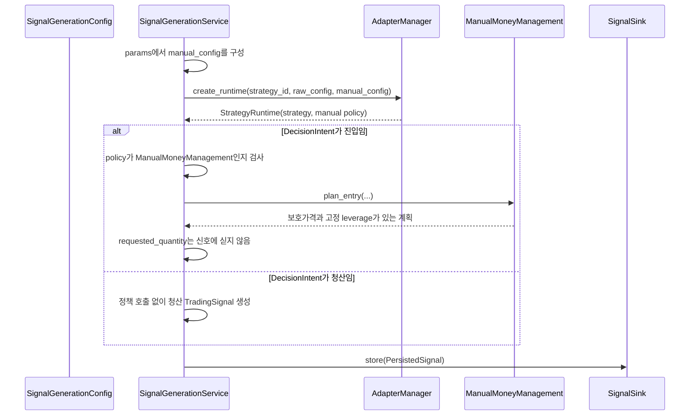
```mermaid
sequenceDiagram
    participant C as SignalGenerationConfig
    participant S as SignalGenerationService
    participant AM as AdapterManager
    participant P as ManualMoneyManagement
    participant Sink as SignalSink

    S->>S: params에서 manual_config를 구성
    S->>AM: create_runtime(strategy_id, raw_config, manual_config)
    AM-->>S: StrategyRuntime(strategy, manual policy)
    alt DecisionIntent가 진입임
        S->>S: policy가 ManualMoneyManagement인지 검사
        S->>P: plan_entry(...)
        P-->>S: 보호가격과 고정 leverage가 있는 계획
        S->>S: requested_quantity는 신호에 싣지 않음
    else DecisionIntent가 청산임
        S->>S: 정책 호출 없이 청산 TradingSignal 생성
    end
    S->>Sink: store(PersistedSignal)
```

`SignalGenerationConfig`에는 자금관리 mode 선택 필드가 없다. `SignalGenerationService.start`는 전략 params의 legacy
세 값을 읽어 manual 설정을 만들고 이를 `AdapterManager.create_runtime`에 고정하여 넘긴다. 진입
`DecisionIntent`를 구체화할 때 runtime 정책이 `ManualMoneyManagement`가 아니면
`ValueError("signal generation currently requires manual money management")`를 발생시킨다.

신호 생성 실행면에는 계좌 및 주문 권한이 없다. manual의 보호가격과 고정 leverage는 placeholder 계좌 입력에
의존하지 않으므로 이를 사용하지만, 정책이 계산한 `requested_quantity`는 운영 신호에 넣지 않는다. 생성 결과는
`SignalSink`에 `PersistedSignal`로 저장하고 선택적으로 queue에 발행한다. 이 실행면은 백테스트 Evidence SQLite를
만들지 않는다.

---

# §6 백테스트 실행과 저장

## §6.1 캔들 루프의 판단, 정책 및 주문 순서

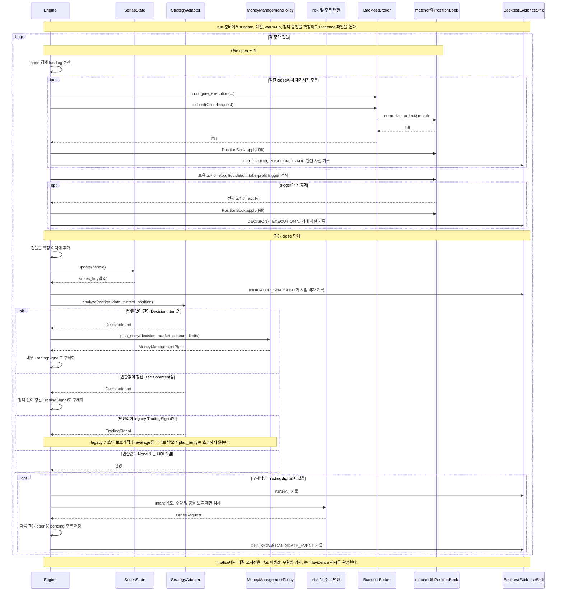
```mermaid
sequenceDiagram
    participant E as Engine
    participant S as SeriesState
    participant A as StrategyAdapter
    participant P as MoneyManagementPolicy
    participant X as risk 및 주문 변환
    participant B as BacktestBroker
    participant M as matcher와 PositionBook
    participant V as BacktestEvidenceSink

    Note over E,V: run 준비에서 runtime, 계열, warm-up, 정책 원천을 확정하고 Evidence 파일을 연다.
    loop 각 평가 캔들
        Note over E,M: 캔들 open 단계
        E->>E: open 경계 funding 정산
        loop 직전 close에서 대기시킨 주문
            E->>B: configure_execution(...)
            E->>B: submit(OrderRequest)
            B->>M: normalize_order와 match
            M-->>B: Fill
            B-->>E: Fill
            E->>M: PositionBook.apply(Fill)
            E->>V: EXECUTION, POSITION, TRADE 관련 사실 기록
        end
        E->>M: 보유 포지션 stop, liquidation, take-profit trigger 검사
        opt trigger가 발동함
            M-->>E: 전체 포지션 exit Fill
            E->>M: PositionBook.apply(Fill)
            E->>V: DECISION과 EXECUTION 및 거래 사실 기록
        end

        Note over E,V: 캔들 close 단계
        E->>E: 캔들을 확정 이력에 추가
        E->>S: update(candle)
        S-->>E: series_key별 값
        E->>V: INDICATOR_SNAPSHOT과 시점 격자 기록
        E->>A: analyze(market_data, current_position)
        alt 반환값이 진입 DecisionIntent임
            A-->>E: DecisionIntent
            E->>P: plan_entry(decision, market, account, limits)
            P-->>E: MoneyManagementPlan
            E->>E: 내부 TradingSignal로 구체화
        else 반환값이 청산 DecisionIntent임
            A-->>E: DecisionIntent
            E->>E: 정책 없이 청산 TradingSignal로 구체화
        else 반환값이 legacy TradingSignal임
            A-->>E: TradingSignal
            Note over E,P: legacy 신호의 보호가격과 leverage를 그대로 받으며 plan_entry는 호출하지 않는다.
        else 반환값이 None 또는 HOLD임
            A-->>E: 관망
        end
        opt 구체적인 TradingSignal이 있음
            E->>V: SIGNAL 기록
            E->>X: intent 유도, 수량 및 공통 노출 제한 검사
            X-->>E: OrderRequest
            E->>E: 다음 캔들 open용 pending 주문 저장
            E->>V: DECISION과 CANDIDATE_EVENT 기록
        end
    end
    Note over E,V: finalize에서 미결 포지션을 닫고 파생값, 무결성 검사, 논리 Evidence 해시를 확정한다.
```

전략 판단은 확정 캔들의 지표 갱신과 시점 격자 기록 뒤에 일어난다. 목표 계약의 진입 판단에서는 정책 적용이 전략
판단 다음이고 주문 요청 생성보다 앞이다. 생성한 주문은 같은 close에 체결하지 않고 다음 연속 캔들의 open 단계에
broker로 보낸다. broker는 float 주문 요청을 Decimal 주문으로 정규화하고, 체결 가격에서 위험 및 증거금 한도를 다시
적용한 뒤 Fill을 만든다.

포지션 보호 trigger는 현재 전략 timeframe 캔들의 고가와 저가로 검사한다. `trigger_feed`의
`m1_subcandle` 값은 열거되어 있지만 `RunConfig`와 Engine이 현재 `NotImplementedError`로 거부하므로 실행 가능한
경로는 `tf_candle`뿐이다.

## §6.2 Evidence 파일과 스키마 판

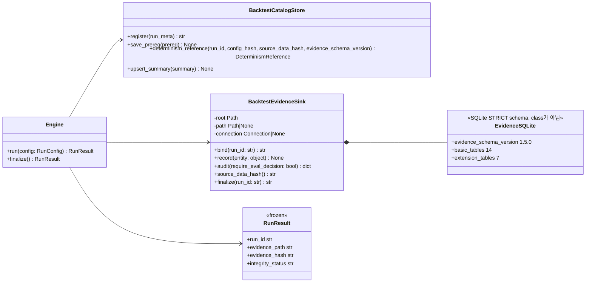
```mermaid
classDiagram
    direction LR
    class Engine {
        +run(config: RunConfig) RunResult
        +finalize() RunResult
    }
    class BacktestCatalogStore {
        +register(run_meta) str
        +save_prereg(prereg) None
        +determinism_reference(run_id, config_hash, source_data_hash, evidence_schema_version) DeterminismReference
        +upsert_summary(summary) None
    }
    class BacktestEvidenceSink {
        -root Path
        -path Path|None
        -connection Connection|None
        +bind(run_id: str) str
        +record(entity: object) None
        +audit(require_eval_decision: bool) dict
        +source_data_hash() str
        +finalize(run_id: str) str
    }
    class EvidenceSQLite {
        <<SQLite STRICT schema, class가 아님>>
        +evidence_schema_version 1.5.0
        +basic_tables 14
        +extension_tables 7
    }
    class RunResult {
        <<frozen>>
        +run_id str
        +evidence_path str
        +evidence_hash str
        +integrity_status str
    }

    Engine --> BacktestCatalogStore
    Engine --> BacktestEvidenceSink
    BacktestEvidenceSink *-- EvidenceSQLite
    Engine --> RunResult
```

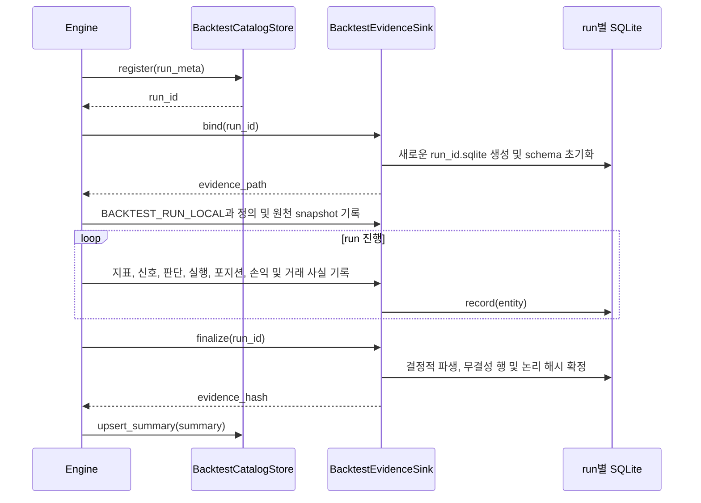
```mermaid
sequenceDiagram
    participant E as Engine
    participant C as BacktestCatalogStore
    participant V as BacktestEvidenceSink
    participant DB as run별 SQLite

    E->>C: register(run_meta)
    C-->>E: run_id
    E->>V: bind(run_id)
    V->>DB: 새로운 run_id.sqlite 생성 및 schema 초기화
    V-->>E: evidence_path
    E->>V: BACKTEST_RUN_LOCAL과 정의 및 원천 snapshot 기록
    loop run 진행
        E->>V: 지표, 신호, 판단, 실행, 포지션, 손익 및 거래 사실 기록
        V->>DB: record(entity)
    end
    E->>V: finalize(run_id)
    V->>DB: 결정적 파생, 무결성 행 및 논리 해시 확정
    V-->>E: evidence_hash
    E->>C: upsert_summary(summary)
```

백테스트 run 하나에는 정확히 하나의 신규 SQLite Evidence 파일이 생긴다. 파일명은 카탈로그가 발급한
`<run_id>.sqlite`이며 기존 파일을 덮어쓰지 않는다. 파일 안의 `BACKTEST_RUN_LOCAL`도 단일 행 trigger로 다른 run을
함께 넣지 못하게 한다.

현재 Evidence 스키마 판은 `1.5.0`이다. 스키마에는 14개 기본 테이블과 7개 확장 테이블이 있으며 총 21개다.
`BACKTEST_RUN_LOCAL`은 제출한 자금관리 축약형, 해석된 정책 설정, 합쳐진 지표 선언, 전략 및 core 판을 보관하고,
목표 계약의 진입에 정책을 적용한 거래 수준 계산값은 `SIGNAL.metadata_json.money_management`에 들어간다.
`submitted_money_management_json`은
동일한 해석 설정의 논리 해시가 제출 축약 형태 때문에 달라지지 않도록 Evidence 해시에서 제외된다.

## §6.3 현재 구현하지 않은 실행 능력

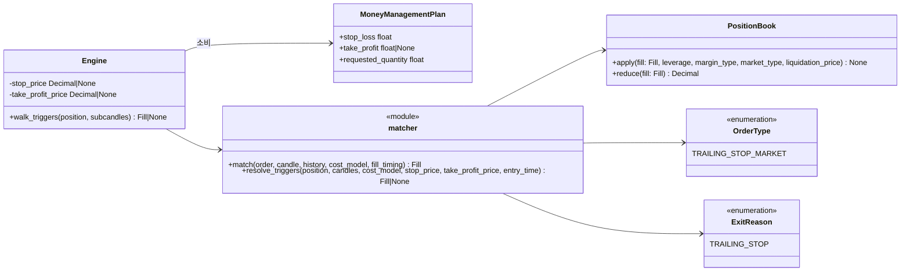
```mermaid
classDiagram
    direction LR
    class MoneyManagementPlan {
        +stop_loss float
        +take_profit float|None
        +requested_quantity float
    }
    class Engine {
        -stop_price Decimal|None
        -take_profit_price Decimal|None
        +walk_triggers(position, subcandles) Fill|None
    }
    class PositionBook {
        +apply(fill: Fill, leverage, margin_type, market_type, liquidation_price) None
        +reduce(fill: Fill) Decimal
    }
    class OrderType {
        <<enumeration>>
        TRAILING_STOP_MARKET
    }
    class ExitReason {
        <<enumeration>>
        TRAILING_STOP
    }
    class matcher {
        <<module>>
        +match(order, candle, history, cost_model, fill_timing) Fill
        +resolve_triggers(position, candles, cost_model, stop_price, take_profit_price, entry_time) Fill|None
    }

    Engine --> MoneyManagementPlan : 소비
    Engine --> matcher
    matcher --> PositionBook
    matcher --> OrderType
    matcher --> ExitReason
```

현재 `MoneyManagementPlan`과 Engine에는 목표가격 하나만 있으므로 단계별 부분 익절 계획이 없다. 보호 trigger가
목표가격에 닿으면 matcher가 전체 `position.quantity`의 합성 exit 주문을 만든다. 다만 `PositionBook.reduce`와
`Position.reduce_quantity`는 들어온 reduce-only Fill의 임의 양만큼 포지션을 줄일 수 있다. 이 저수준 회계 능력이
부분 익절 계획이나 그 계획을 만드는 정책이 존재한다는 뜻은 아니다.

`OrderType.TRAILING_STOP_MARKET`과 `ExitReason.TRAILING_STOP` 열거형은 존재한다. 그러나 주문 matcher의 trigger
해석은 trailing-stop 주문에 도달하면 `NotImplementedError("trailing-stop matching is reserved")`를 발생시키며,
Engine의 `resolve_triggers`에도 trailing 가격 인자가 없다. 따라서 실행 가능한 트레일링 기능은 없다.

현재 별도 가격 변환 캔들 타입이나 피드 조회, 포트폴리오 환산용 캔들 실행 경로는 없다. 전략은 현재 전략 timeframe의
캔들만 입력으로 받는다. turtle 정책의 별도 일봉 조회는 정책용 변동성 계산이며 전략 입력 멀티 timeframe 기능이
아니다.

---

# §7 신규 전략이 지켜야 하는 구조 경계

## §7.1 소유 범위

```mermaid
classDiagram
    direction LR
    class NewAdaptee {
        <<strategy role, class 이름이 아님>>
        +get_metadata() StrategyMetadata
        +get_parameter_schema() ParameterSchema
        +analyze(market_data: dict~str,object~, current_position: Position|None) DecisionIntent|None
    }
    class PlatformOwned {
        <<platform role, class 이름이 아님>>
        +series registries와 series_resolution
        +StrategyConfig와 AdapterManager
        +MoneyManagementPolicy 구현과 Factory
        +Engine, risk, execution, Evidence
    }
    class DecisionIntent {
        +action DecisionAction
        +reference_price float
        +confidence float
        +reason str
        +metadata Mapping
    }
    class MoneyManagementPlan {
        +stop_loss float
        +take_profit float|None
        +requested_quantity float
        +requested_leverage int
    }

    NewAdaptee --> DecisionIntent : 생성
    PlatformOwned --> MoneyManagementPlan : 생성 및 소비
    PlatformOwned --> NewAdaptee : 선언을 읽고 실행
```

신규 전략 작성자는 진입 및 청산 edge, 전략 고유 파라미터 스키마, 필요한 등록 계열 조합, 최소 이력, 지원
timeframe, 자금관리 지원 capability, `StrategyProfile`을 소유한다. 신규 전략의 판단 반환형은
`DecisionIntent`이며, 관망은 `None` 또는 `DecisionAction.HOLD`로 표현할 수 있다.

신규 전략은 보호가격, 목표 수량, leverage, 위험예산, 증거금, 계좌 상태를 소유하지 않는다. 새 계산이 필요하다고
전략 안에 지표 구현을 복제하거나 데이터베이스 및 파일 및 네트워크에서 다른 timeframe을 직접 읽어서는 안 된다.
필요한 지표 조합이 현재 레지스트리에 없다면 전략 edge 변경과 구분되는 능력 계층 변경으로 먼저 등록해야 한다.
정책 수식, Engine 순서, 주문 matcher, Evidence 저장을 전략 클래스 안에서 다시 구현해서도 안 된다.

등록 카탈로그의 클래스 신원과 이력 선언 셋은 코드 선언과 함께 갱신해야 한다. 다만 AdapterManager가 대조하지 않는
전략 판, 파라미터 기본값, 프로파일 및 정책 capability도 자동 동기화된다고 가정해서는 안 된다. 이 항목들의 변경은
각 소유 코드와 외부 등록 및 관련 Evidence에 미치는 영향을 별도로 확인해야 한다.

전략 작성과 리뷰의 규범, manual 호환 우선순위, 금지 파라미터, 테스트 행렬 및 완료 체크리스트는
`docs/strategy-authoring-contract.md`가 단독으로 소유한다. 이 문서는 현재 구조를 찾는 지도이며, 그 계약을
대체하거나 별도의 규칙 묶음을 만들지 않는다.

## §7.2 구현 위치

| 영역 | 현재 정본 구현 |
|---|---|
| 전략 Protocol과 메타데이터 | `services/core-lib/core_lib/strategy/base.py`가 정본이다. |
| 전략 설정과 프로파일 | `services/core-lib/core_lib/strategy/config.py`와 `services/core-lib/core_lib/strategy/profile.py`가 정본이다. |
| 생성 및 등록 대조 | `services/core-lib/core_lib/strategy/manager.py`, `factory.py`, `registry.py`가 정본이다. |
| 목표 및 legacy 결정 타입 | `services/core-lib/core_lib/types/decision.py`와 `types/signal.py`가 정본이다. |
| 지표, 패턴 및 공통 계열 해석 | `services/core-lib/core_lib/indicators/`, `patterns/`, `series/`, `series_resolution.py`가 정본이다. |
| 자금관리 값 타입과 정책 및 Factory | `services/core-lib/core_lib/money_management/`가 정본이다. |
| 백테스트 조합과 캔들 루프 | `services/backtest-service/backtest_service/config/run_config.py`와 `engine/engine.py`가 정본이다. |
| 신호 생성 조합 | `services/signal-service/signal_service/application/service.py`가 정본이다. |
| Evidence 스키마와 파일 저장 | `services/backtest-service/backtest_service/adapters/evidence_schema.py`와 `evidence_sink.py`가 정본이다. |
