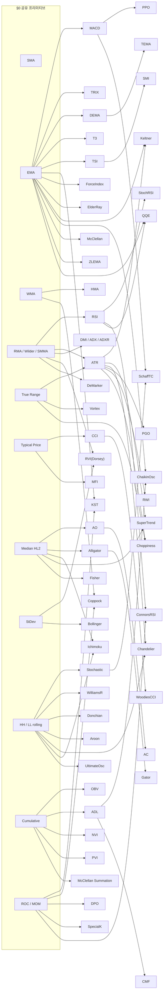

# 기술적 분석 지표 계산 명세서 (★4 이상)

> **범위**: 1차 마스터 목록에서 신뢰도 ★★★★ 이상으로 판정된 지표(원 저자 실명 + 문서화된 1차 출처)의 **계산 방법**을 플랫폼 독립적으로 기술한다.
> **중복 제거 원칙**: 여러 지표가 공유하는 기초 연산(EMA, SMA, WMA, Wilder 평활, True Range, Typical Price, 표준편차, rolling 최고/최저 등)은 **§0 공유 프리미티브**에 단 한 번만 정의하고, 각 지표는 이를 **참조**한다. 지표 본문에는 그 지표 고유의 계산만 기술한다.
> **표기 규약**: `C`=종가, `O`=시가, `H`=고가, `L`=저가, `V`=거래량, `P`=대상 시계열(문맥상 대개 종가), 아래첨자 `t`=현재 봉, `t-1`=직전 봉. `n`=기간(period).

---

## §0. 공유 계산 프리미티브 (Shared Primitives)

이 계층은 이후 모든 지표가 재사용한다. 지표 본문에서 `SMA(P,n)`, `EMA(P,n)`, `RMA(P,n)`, `TR_t`, `TP_t` 등으로 호출한다.

### 0.1 가격 파생 입력 (Price Inputs)

| 이름 | 기호 | 공식 |
|---|---|---|
| Median Price (중간가) | HL2 | `(H + L) / 2` |
| Typical Price (전형가) | HLC3, TP | `(H + L + C) / 3` |
| Weighted Close (가중종가) | HLCC4 | `(H + L + 2C) / 4` |
| OHLC 평균 | OHLC4 | `(O + H + L + C) / 4` |

### 0.2 SMA — Simple Moving Average

```
SMA(P, n)_t = (1/n) · Σ_{i=0}^{n-1} P_{t-i}
```
- warm-up: 처음 `n-1` 봉은 정의되지 않음(NaN).
- 시간복잡도: 슬라이딩 합 사용 시 O(1)/봉, 전체 O(N).

### 0.3 EMA — Exponential Moving Average
```
α = 2 / (n + 1)
EMA_t = α · P_t + (1 − α) · EMA_{t-1}
```
- **초기값(seed)**: 표준(TA-Lib, TradingView) 방식은 첫 EMA를 **처음 n개의 SMA**로 시딩한 뒤 t=n부터 재귀 적용. 일부 구현(pandas-ta `adjust=False` 기본, 단순 방식)은 첫 값 = 첫 데이터포인트로 시딩 → warm-up 초반 값이 다름.
- pandas-ta `adjust=True`는 유한 급수 가중합으로 계산해 초반 값이 재귀식과 미세하게 다름 → **플랫폼 간 초반 오차의 주원인**.

### 0.4 WMA — Weighted Moving Average (선형가중)
```
WMA(P, n)_t = Σ_{i=1}^{n} (i · P_{t-n+i}) / Σ_{i=1}^{n} i
           = [n·P_t + (n−1)·P_{t-1} + ... + 1·P_{t-n+1}] / [n(n+1)/2]
```
가장 최근 봉에 최대 가중치 `n`, 가장 오래된 봉에 `1`.

### 0.5 RMA / SMMA / Wilder's Smoothing (Wilder 평활)
Wilder(1978)가 RSI·ATR·ADX에 쓴 평활. TradingView `ta.rma`, pandas-ta `rma`, Welles Wilder Smoothing, SMMA와 **수학적으로 동일**.
```
α = 1 / n
RMA_t = α · P_t + (1 − α) · RMA_{t-1}
      = RMA_{t-1} + (P_t − RMA_{t-1}) / n
```
- **초기값(seed)**: 첫 RMA = 처음 n개의 SMA.
- EMA와의 관계: RMA(n) ≡ EMA with `α = 1/n` (즉 EMA의 "유효기간" ≈ `2n−1`). **RMA(14) ≠ EMA(14)** 이므로 혼동 주의.
- Wilder 원서의 "running total" 서술식 `Sum_t = Sum_{t-1} − Sum_{t-1}/n + P_t` 는 위 재귀식과 동치(스케일만 다름).

### 0.6 True Range (TR)
```
TR_t = max( H_t − L_t ,  |H_t − C_{t-1}| ,  |L_t − C_{t-1}| )
```
- 첫 봉(`C_{t-1}` 없음): `TR_0 = H_0 − L_0`.

### 0.7 표준편차 / 분산 (Standard Deviation / Variance)
Bollinger·CCI 등에서 **모표준편차(population, 분모 n)** 사용이 관례.
```
mean = SMA(P, n)_t
Var(P, n)_t = (1/n) · Σ_{i=0}^{n-1} (P_{t-i} − mean)^2
StDev(P, n)_t = sqrt( Var(P, n)_t )
```
- 주의: 일부 통계 라이브러리는 표본표준편차(분모 n−1). 지표용은 관례상 모표준편차.

### 0.8 rolling 최고/최저 (Highest / Lowest)
```
HH(n)_t = max( H_t, H_{t-1}, ..., H_{t-n+1} )
LL(n)_t = min( L_t, L_{t-1}, ..., L_{t-n+1} )
```
(대상 시계열이 종가면 `HH`는 `max(C...)`로 치환.)

### 0.9 누적합 / 누적 (Cumulative)
```
Cum_t = Cum_{t-1} + x_t   (초기 Cum_0 = x_0)
```
OBV·A/D Line·NVI·PVI·누적 델타 등이 사용.

### 0.10 ROC — Rate of Change (기초 모멘텀)
```
ROC(P, n)_t = 100 · (P_t − P_{t-n}) / P_{t-n}
```
(백분율 없는 원시형 `MOM(n) = P_t − P_{t-n}` 도 다수 지표의 부품.)

### 0.11 나눗셈/예외 처리 공통 규약
- **divide-by-zero**: 분모가 0이면 결과를 `0`, `100`(RSI류에서 손실=0), 또는 직전값으로 대체 — 구현체별 상이. 본 문서는 각 지표에서 해당 규약을 명시.
- **NaN 전파**: warm-up 구간은 NaN 유지 권장(0 대체 시 초기 신호 왜곡).
- **실시간(update) vs 배치**: 재귀형(EMA/RMA/SAR/누적)은 확정된 직전값만 사용해야 함 → **미확정(진행 중) 봉으로 상태 갱신 금지**(look-ahead/재계산 오염 방지). 프로젝트 규약 `close_time ≤ T` 준수.

---

## §1. Trend / Moving Average 계열 (★4↑)

> 아래 이동평균들은 모두 §0.2~0.5의 SMA/EMA/WMA/RMA를 부품으로 조합한다.

### 1.1 DEMA — Double EMA (Mulloy, 1994) ★★★★★
중복 제거: EMA(§0.3)만 사용.
```
EMA1 = EMA(P, n)
EMA2 = EMA(EMA1, n)
DEMA = 2·EMA1 − EMA2
```
목적: 이중 평활의 지연(lag) 감소.

### 1.2 TEMA — Triple EMA (Mulloy, 1994) ★★★★★
```
EMA1 = EMA(P, n);  EMA2 = EMA(EMA1, n);  EMA3 = EMA(EMA2, n)
TEMA = 3·EMA1 − 3·EMA2 + EMA3
```

### 1.3 T3 (Tim Tillson, 1998) ★★★★
GD(Generalized DEMA) 3중 적용. `v`=volume factor(기본 0.7).
```
GD(P) = EMA1·(1+v) − EMA2·v,  where EMA1=EMA(P,n), EMA2=EMA(EMA1,n)
T3 = GD( GD( GD(P) ) )
```
전개형 계수(6중 EMA e1..e6, a=v):
```
c1 = −a^3
c2 = 3a^2 + 3a^3
c3 = −6a^2 − 3a − 3a^3
c4 = 1 + 3a + a^3 + 3a^2
T3 = c1·e6 + c2·e5 + c3·e4 + c4·e3
```

### 1.4 HMA — Hull MA (Alan Hull, 2005) ★★★★
중복 제거: WMA(§0.4)만 사용.
```
HMA(n) = WMA( 2·WMA(P, n/2) − WMA(P, n),  round(sqrt(n)) )
```
(`n/2`는 정수화, `sqrt(n)`는 반올림.)

### 1.5 ZLEMA — Zero-Lag EMA (Ehlers & Way) ★★★★
```
lag = floor( (n − 1) / 2 )
P'_t = P_t + (P_t − P_{t-lag})        (지연 보정된 합성가격)
ZLEMA = EMA(P', n)
```

### 1.6 ALMA — Arnaud Legoux MA (2009) ★★★★
가우시안 가중, offset `s`(기본 0.85), sigma `σ`(기본 6), 윈도우 `n`.
```
m = s · (n − 1)
d = n / σ
w_i = exp( −(i − m)^2 / (2·d^2) ),   i = 0..n-1
ALMA_t = Σ_i ( w_i · P_{t-(n-1)+i} ) / Σ_i w_i
```

### 1.7 KAMA — Kaufman Adaptive MA (Perry Kaufman, 1995) ★★★★★
```
Change     = |P_t − P_{t-n}|
Volatility = Σ_{i=0}^{n-1} |P_{t-i} − P_{t-i-1}|
ER = Change / Volatility                          (분모 0 → ER=0)
fastSC = 2/(2+1) ;  slowSC = 2/(30+1)
SC = ( ER·(fastSC − slowSC) + slowSC )^2
KAMA_t = KAMA_{t-1} + SC·(P_t − KAMA_{t-1})
```

### 1.8 VIDYA — Variable Index Dynamic Average (Tushar Chande, 1992) ★★★★
```
k = |CMO(P, m)| / 100          (0~1, m=변동성 산정기간, 흔히 9)
α = 2/(n+1)
VIDYA_t = α·k·P_t + (1 − α·k)·VIDYA_{t-1}
```
- **구현체별 상이**: 원 Chande 버전은 표준편차 비율(단기σ/장기σ)을 k로 사용. TradingView/pandas-ta는 CMO 기반이 흔함 → 채택 구현 명시 필요.

### 1.9 McGinley Dynamic (John McGinley) ★★★★
```
MD_t = MD_{t-1} + (P_t − MD_{t-1}) / ( N · (P_t / MD_{t-1})^4 )
```

### 1.10 Guppy Multiple MA (GMMA, Daryl Guppy) ★★★★
단일 공식 없음 — EMA 집합의 배열.
```
단기군: EMA(3,5,8,10,12,15)
장기군: EMA(30,35,40,45,50,60)
```

## §2. Momentum / Oscillator 계열 (★4↑)

### 2.1 RSI — Relative Strength Index (Wilder, 1978) ★★★★★
```
Δ_t = C_t − C_{t-1}
Gain_t = max(Δ_t, 0) ;   Loss_t = max(−Δ_t, 0)
AvgGain = RMA(Gain, n) ;  AvgLoss = RMA(Loss, n)   (§0.5, n=14, seed=첫 n개 단순평균)
RS  = AvgGain / AvgLoss
RSI = 100 − 100/(1 + RS)
```
- divide-by-zero: `AvgLoss=0` → RSI=100. `AvgGain=0` → RSI=0.
- 변형: **Cutler's RSI** = RMA 대신 SMA 사용(재귀 없음, 값 다름).

### 2.2 Stochastic — %K/%D (George Lane) ★★★★★
```
%K_raw = 100 · (C_t − LL(n)_t) / (HH(n)_t − LL(n)_t)     (n=14)
Fast %K = %K_raw ;  Fast %D = SMA(%K_raw, 3)
Slow %K = SMA(%K_raw, 3) ;  Slow %D = SMA(Slow %K, 3)
```
- 분모 0(HH=LL) → 직전값 또는 50/100 대체(구현체별).

### 2.3 Stochastic RSI (Chande & Kroll, 1994) ★★★★★
중복 제거: RSI(§2.1) 위에 Stochastic(§2.2) 정규화.
```
StochRSI_t = ( RSI_t − min(RSI, n) ) / ( max(RSI, n) − min(RSI, n) )   (n=14)
%K = SMA(StochRSI·100, 3) ;  %D = SMA(%K, 3)
```

### 2.4 MACD (Gerald Appel) ★★★★★
중복 제거: EMA(§0.3)만 사용.
```
MACD_t   = EMA(C,12) − EMA(C,26)
Signal_t = EMA(MACD, 9)
Hist_t   = MACD_t − Signal_t          (Histogram = Aspray 추가분, ★★★★)
```

### 2.5 PPO — Percentage Price Oscillator ★★★★
MACD의 백분율판(스케일 독립 → 자산 간 비교 가능).
```
PPO_t    = 100 · (EMA(C,12) − EMA(C,26)) / EMA(C,26)
Signal_t = EMA(PPO, 9) ;  Hist = PPO − Signal
```

### 2.6 TRIX (Jack Hutson, 1980s) ★★★★★
중복 제거: EMA 3중.
```
E1 = EMA(C, n) ;  E2 = EMA(E1, n) ;  E3 = EMA(E2, n)     (n=15 흔함)
TRIX_t = 100 · (E3_t − E3_{t-1}) / E3_{t-1}             (1기간 ROC의 퍼센트. TA-Lib 기본=×100. 일부 구현은 ×10000)
```

### 2.7 TSI — True Strength Index (William Blau, 1991) ★★★★★
```
PC_t = C_t − C_{t-1}                          (모멘텀)
DS  = EMA( EMA(PC, r), s )                     (이중 평활, r=25, s=13)
DA  = EMA( EMA(|PC|, r), s )
TSI = 100 · DS / DA
```

### 2.8 CMO — Chande Momentum Oscillator (Chande, 1994) ★★★★★
```
SU = Σ_{i} max(Δ_i, 0) ;  SD = Σ_{i} max(−Δ_i, 0)   (n기간 합, Δ=C_t−C_{t-1})
CMO = 100 · (SU − SD) / (SU + SD)                    (범위 −100~+100)
```
RSI와 달리 평활 없이 원시 합 사용, 0 중심.

### 2.9 Williams %R (Larry Williams) ★★★★★
```
%R = −100 · (HH(n)_t − C_t) / (HH(n)_t − LL(n)_t)     (n=14, 범위 −100~0)
```
Stochastic %K를 상단 기준으로 뒤집은 형태.

### 2.10 CCI — Commodity Channel Index (Donald Lambert, 1980) ★★★★★
중복 제거: Typical Price(§0.1) + SMA(§0.2).
```
TP_t = (H+L+C)/3
SMA_TP = SMA(TP, n)                                   (n=20)
MeanDev = (1/n)·Σ_{i=0}^{n-1} |TP_{t-i} − SMA_TP_t|   (평균절대편차, ≠ 표준편차)
CCI = (TP_t − SMA_TP_t) / (0.015 · MeanDev)
```
- 상수 0.015: 약 70~80%가 ±100 내에 들도록 하는 Lambert 정규화 상수.

### 2.11 Ultimate Oscillator (Larry Williams, 1976) ★★★★★
```
BP_t = C_t − min(L_t, C_{t-1})                        (Buying Pressure)
TR_t = max(H_t, C_{t-1}) − min(L_t, C_{t-1})          (Wilder TR과 동치)
Avg_p = ΣBP(p) / ΣTR(p)  for p ∈ {7,14,28}
UO = 100 · (4·Avg7 + 2·Avg14 + 1·Avg28) / (4+2+1)
```

### 2.12 Awesome Oscillator (Bill Williams) ★★★★
중복 제거: Median Price(§0.1) + SMA.
```
AO = SMA(HL2, 5) − SMA(HL2, 34)
```

### 2.13 Accelerator Oscillator (Bill Williams) ★★★★
```
AC = AO − SMA(AO, 5)                                  (AO는 §2.12)
```

### 2.14 Fisher Transform (John Ehlers) ★★★★★
중간가를 −1~1로 정규화 후 역쌍곡 변환.
```
X_raw = 2·(HL2_t − LL(n)) / (HH(n) − LL(n)) − 1        (n=9~10)
X_t = 0.33·X_raw + 0.67·X_{t-1}                         (평활, |X|<1로 클램프)
Fisher_t = 0.5·ln((1 + X_t)/(1 − X_t)) + 0.5·Fisher_{t-1}
Signal = Fisher_{t-1}
```

### 2.15 Connors RSI (Larry Connors) ★★★★
중복 제거: RSI(§2.1) 2회 + PercentRank.
```
RSI_price  = RSI(C, 3)
streak = 연속 상승(+)/하락(−) 봉 수 (동일 방향 누적, 방향 바뀌면 리셋)
RSI_streak = RSI(streak, 2)
PctRank = ROC(C,1) 의 최근 100봉 내 백분위(%)
ConnorsRSI = (RSI_price + RSI_streak + PctRank) / 3
```

### 2.16 QStick (Tushar Chande) ★★★★
```
QStick = SMA( (C − O), n )                             (n=8~10, 캔들 몸통 평균)
```

### 2.17 Chande Forecast Oscillator (Chande) ★★★★
중복 제거: 선형회귀(§11) 예측값 사용.
```
CFO = 100 · (C_t − LinRegForecast(C, n)_t) / C_t
```
(`LinRegForecast` = n기간 최소자승 회귀선의 현재봉 추정값.)

### 2.18 DeMarker (Tom DeMark) ★★★★
```
DeMax_t = max(H_t − H_{t-1}, 0)
DeMin_t = max(L_{t-1} − L_t, 0)
DeMarker = SMA(DeMax, n) / ( SMA(DeMax, n) + SMA(DeMin, n) )   (n=14, 범위 0~1)
```

### 2.19 DPO — Detrended Price Oscillator ★★★★
```
shift = floor(n/2) + 1
DPO_t = C_{t-shift} − SMA(C, n)_t
```
추세 제거 → 순환주기 관찰용(선행지표 아님).

### 2.20 Schaff Trend Cycle (Doug Schaff, 1999) ★★★★
중복 제거: MACD(§2.4) → Stochastic(§2.2) 이중 적용.
```
M = MACD(C, 23, 50)                                    (기본 fast23/slow50)
%K1 = Stoch(M, len=10) ; D1 = EMA-smooth(%K1, factor 0.5)
%K2 = Stoch(D1, len=10) ; STC = EMA-smooth(%K2, factor 0.5)
```
- **구현체별 상이**: 내부 평활을 0.5 factor 지수평활로 하는 방식이 원저자 서술. 정확 상수·클램프는 구현 명시 필요.

### 2.21 Relative Vigor Index (RVI, John Ehlers) ★★★★
※ Dorsey의 "Relative Volatility Index"(§3.7)와 약어 충돌 주의.
```
Num = SWMA(C − O)         (SWMA = 대칭가중 4항: (x_t + 2x_{t-1} + 2x_{t-2} + x_{t-3})/6)
Den = SWMA(H − L)
RVI = SMA(Num, n) / SMA(Den, n)                        (n=10)
Signal = SWMA(RVI)
```

### 2.22 Laguerre RSI (John Ehlers) ★★★★
4단 Laguerre 필터(감마 γ, 기본 0.5~0.7)로 지연 제어 후 RSI화.
```
L0_t = (1−γ)·P_t + γ·L0_{t-1}
L1_t = −γ·L0_t + L0_{t-1} + γ·L1_{t-1}
L2_t = −γ·L1_t + L1_{t-1} + γ·L2_{t-1}
L3_t = −γ·L2_t + L2_{t-1} + γ·L3_{t-1}
CU = Σ up-차분 (L0>L1 이면 L0−L1, L1>L2 이면 L1−L2, L2>L3 이면 L2−L3)
CD = Σ down-차분 (반대 경우)
LaguerreRSI = CU / (CU + CD)                            (분모 0 → 0)
```

### 2.23 Pretty Good Oscillator (Mark Johnson) ★★★★
중복 제거: SMA + ATR(§3.1).
```
PGO = (C_t − SMA(C, n)) / ATR(n)                        (n=89 관례)
```

### 2.24 KST — Know Sure Thing (Martin Pring) ★★★★★
중복 제거: ROC(§0.10) 4개 + SMA 평활 가중합.
```
RCMA1 = SMA(ROC(10), 10) · 1
RCMA2 = SMA(ROC(15), 10) · 2
RCMA3 = SMA(ROC(20), 10) · 3
RCMA4 = SMA(ROC(30), 15) · 4
KST = RCMA1 + RCMA2 + RCMA3 + RCMA4
Signal = SMA(KST, 9)
```

### 2.25 Coppock Curve (Edwin Coppock, 1962) ★★★★★
```
Coppock = WMA( ROC(C, 14) + ROC(C, 11),  10 )
```

### 2.26 Special K (Martin Pring) ★★★★
KST 계열 확장 — 단·중·장기 ROC의 가중 평활합(다수 항). 구성 항이 많고 파라미터가 문서마다 상이 → **원 Pring 정의표 참조 필요**(항별 ROC기간·평활기간·가중치 지정 필요).

### 2.27 SMI — Stochastic Momentum Index (William Blau, 1993) ★★★★★
스토캐스틱을 중간가 기준 거리로 재정의 후 이중 평활. 중복 제거: HH/LL(§0.8) + EMA(§0.3).
```
M  = (HH(n) + LL(n)) / 2                                 (n기간 고저 중간점)
D  = C_t − M                                             (중간점으로부터의 거리)
HL = HH(n) − LL(n)                                       (고저 범위)
DS  = EMA( EMA(D,  r), s )                                (이중 평활, r/s = 예: 3/3 또는 25/13)
DHL = EMA( EMA(HL/2, r), s )
SMI = 100 · DS / DHL                                     (범위 −100~+100, 분모 0 → 0)
Signal = EMA(SMI, u)                                      (u=예: 3)
```
- 파라미터(n, r, s)는 문서/플랫폼별 상이(Blau 원안 vs TradingView) → 채택 값 명시 권장.

## §3. Volatility 계열 (★4↑)

### 3.1 ATR — Average True Range (Wilder, 1978) ★★★★★
중복 제거: TR(§0.6) + RMA(§0.5).
```
ATR = RMA(TR, n)                                       (n=14, seed=첫 n개 TR 단순평균)
```
- 변형: NATR = 100·ATR/C (정규화, 자산 간 비교).

### 3.2 Keltner Channel (Chester Keltner / Linda Raschke 현대판) ★★★★
중복 제거: EMA(§0.3) + ATR(§3.1).
```
Middle = EMA(C, n)                                     (n=20)
Upper  = Middle + mult·ATR(m)                          (mult=2, m=10 또는 20)
Lower  = Middle − mult·ATR(m)
```
- **구현체별 상이**: 원 Keltner는 SMA(Typical Price) ± SMA(H−L). 현대판(TradingView 기본)은 EMA ± ATR.

### 3.3 Donchian Channel (Richard Donchian) ★★★★
중복 제거: HH/LL(§0.8).
```
Upper = HH(n) ;  Lower = LL(n) ;  Middle = (Upper + Lower)/2   (n=20)
```

### 3.4 SuperTrend ★★★★
중복 제거: HL2(§0.1) + ATR(§3.1).
```
basicUpper = HL2 + mult·ATR(n)
basicLower = HL2 − mult·ATR(n)                          (mult=3, n=10 흔함)
finalUpper_t = (basicUpper_t < finalUpper_{t-1} 또는 C_{t-1} > finalUpper_{t-1})
                ? basicUpper_t : finalUpper_{t-1}
finalLower_t = (basicLower_t > finalLower_{t-1} 또는 C_{t-1} < finalLower_{t-1})
                ? basicLower_t : finalLower_{t-1}
추세: C가 finalUpper 상향돌파 → 상승(SuperTrend=finalLower), 하향돌파 → 하락(=finalUpper)
```

### 3.5 Chandelier Exit (Chuck LeBeau) ★★★★
```
Long  = HH(n) − mult·ATR(n)
Short = LL(n) + mult·ATR(n)                             (n=22, mult=3)
```

### 3.6 Ulcer Index (Peter Martin, 1987) ★★★★
```
maxC = HH(C, n)                                         (n기간 최고 종가)
Drawdown%_t = 100 · (C_t − maxC_t) / maxC_t             (≤0)
UlcerIndex = sqrt( (1/n)·Σ_{i=0}^{n-1} Drawdown%_{t-i}^2 )
```
하락 깊이·지속의 RMS → 하방 위험 특화(변동성 대칭 가정 없음).

### 3.7 Relative Volatility Index (RVI, Donald Dorsey, 1993) ★★★★
※ Ehlers "Relative Vigor Index"(§2.21)와 약어 충돌. RSI 구조를 가격변화 대신 **표준편차**에 적용.
```
σ_t = StDev(C, m)                                       (m=10)
Δ_t = C_t − C_{t-1}
Uσ = σ_t if Δ_t>0 else 0 ;  Dσ = σ_t if Δ_t<0 else 0
RVI = 100 · RMA(Uσ, n) / ( RMA(Uσ, n) + RMA(Dσ, n) )    (n=14)
```

### 3.8 Chaikin Volatility (Marc Chaikin) ★★★★
```
HL_EMA = EMA( (H − L), n )                              (n=10)
ChaikinVol = 100 · ( HL_EMA_t − HL_EMA_{t-n} ) / HL_EMA_{t-n}
```

### 3.9 Mass Index (Donald Dorsey, 1992) ★★★★
```
E1 = EMA(H − L, 9) ;  E2 = EMA(E1, 9)
Ratio = E1 / E2
MassIndex = Σ_{i=0}^{24} Ratio_{t-i}                    (25봉 합)
```
"reversal bulge"(27 상향 후 26.5 하향) 신호. 방향 아님·전환 임박만 시사.

### 3.10 Bollinger Bands / %B / BandWidth (John Bollinger, 1980s) ★★★★★
중복 제거: SMA(§0.2) + StDev(§0.7, 모표준편차).
```
Middle = SMA(C, n)                                       (n=20)
σ      = StDev(C, n)                                     (모표준편차, 분모 n)
Upper  = Middle + k·σ                                    (k=2)
Lower  = Middle − k·σ
%B        = (C − Lower) / (Upper − Lower)                (밴드 내 상대위치, 분모 0 → 미정의)
BandWidth = (Upper − Lower) / Middle                     (밴드 폭 정규화, squeeze 탐지)
```
- 주의: σ는 관례상 **모표준편차(분모 n)**. 표본표준편차(n−1) 사용 시 밴드가 약간 넓어짐 → 플랫폼 간 미세 차이 원인.
- %B > 1: 상단 돌파, %B < 0: 하단 돌파. BandWidth 국소 최저 = Bollinger Squeeze.

## §4. Volume 계열 (★4↑)

### 4.1 OBV — On-Balance Volume (Joseph Granville, 1963) ★★★★★
중복 제거: 누적(§0.9).
```
OBV_t = OBV_{t-1} + { +V_t (C_t>C_{t-1}), −V_t (C_t<C_{t-1}), 0 (동일) }
```

### 4.2 A/D Line — Accumulation/Distribution (Marc Chaikin) ★★★★
```
MFM = ((C − L) − (H − C)) / (H − L)                     (Money Flow Multiplier, H=L → 0)
MFV = MFM · V                                            (Money Flow Volume)
ADL_t = ADL_{t-1} + MFV_t                                (누적)
```

### 4.3 Chaikin Oscillator (Marc Chaikin) ★★★★
중복 제거: ADL(§4.2) + EMA.
```
ChaikinOsc = EMA(ADL, 3) − EMA(ADL, 10)
```

### 4.4 CMF — Chaikin Money Flow (Marc Chaikin) ★★★★
중복 제거: MFV(§4.2).
```
CMF = Σ_{i=0}^{n-1} MFV_{t-i} / Σ_{i=0}^{n-1} V_{t-i}    (n=20)
```

### 4.5 MFI — Money Flow Index (Quong & Soudack) ★★★★
중복 제거: Typical Price(§0.1) — "거래량 가중 RSI".
```
TP_t = (H+L+C)/3 ;  RMF_t = TP_t · V_t                   (Raw Money Flow)
PMF = Σ RMF where TP_t>TP_{t-1} ;  NMF = Σ RMF where TP_t<TP_{t-1}   (n=14)
MFR = PMF / NMF
MFI = 100 − 100/(1 + MFR)
```

### 4.6 Force Index (Alexander Elder) ★★★★★
```
RawFI_t = (C_t − C_{t-1}) · V_t
ForceIndex = EMA(RawFI, n)                               (n=13 흔함)
```

### 4.7 EMV — Ease of Movement (Richard Arms) ★★★★
```
DistanceMoved = HL2_t − HL2_{t-1}
BoxRatio = (V / scale) / (H − L)                          (scale=예: 100000000)
EMV_raw = DistanceMoved / BoxRatio
EMV = SMA(EMV_raw, n)                                     (n=14)
```

### 4.8 Klinger Volume Oscillator (Stephen Klinger) ★★★★
```
dm = H − L
trend_t = +1 if (H+L+C)_t > (H+L+C)_{t-1} else −1
cm_t = (trend_t == trend_{t-1}) ? cm_{t-1} + dm_t : dm_{t-1} + dm_t
VF_t = V_t · |2·(dm_t/cm_t) − 1| · trend_t · 100          (Volume Force)
KVO = EMA(VF, 34) − EMA(VF, 55) ;  Signal = EMA(KVO, 13)
```
- **구현체별 상이**: cm 초기화·VF 절댓값 처리에 이설 있음 → 채택 구현 명시 필요.

### 4.9 NVI — Negative Volume Index (Paul Dysart / Fosback) ★★★★
```
NVI_t = { NVI_{t-1} · (1 + (C_t−C_{t-1})/C_{t-1})   if V_t < V_{t-1}
        { NVI_{t-1}                                  otherwise      (seed=1000)
```

### 4.10 PVI — Positive Volume Index ★★★★
```
PVI_t = { PVI_{t-1} · (1 + (C_t−C_{t-1})/C_{t-1})   if V_t > V_{t-1}
        { PVI_{t-1}                                  otherwise      (seed=1000)
```

## §5. Trend Strength / 방향성 (★4↑)

### 5.1 DMI / ADX 시스템 (Wilder, 1978) ★★★★★
+DI / −DI / ADX / ADXR. 중복 제거: TR(§0.6) + Wilder 평활(§0.5).
```
upMove   = H_t − H_{t-1}
downMove = L_{t-1} − L_t
+DM_t = (upMove > downMove and upMove > 0) ? upMove : 0
−DM_t = (downMove > upMove and downMove > 0) ? downMove : 0

ATR14  = RMA(TR, 14)
+DI = 100 · RMA(+DM, 14) / ATR14
−DI = 100 · RMA(−DM, 14) / ATR14

DX  = 100 · |+DI − −DI| / (+DI + −DI)                    (분모 0 → 0)
ADX = RMA(DX, 14)                                        (seed=첫 14 DX 평균)
ADXR_t = (ADX_t + ADX_{t-n}) / 2                          (n=14)
```
> 카운트 주의: 본 시스템을 구성요소별(+DI, −DI, ADX, ADXR)로 세면 4행, 시스템 1개로 묶으면 1행.

### 5.2 Vortex Indicator (Botes & Siepman, 2010) ★★★★
중복 제거: TR(§0.6).
```
VM+_t = |H_t − L_{t-1}| ;  VM−_t = |L_t − H_{t-1}|
VI+ = Σ_{i=0}^{n-1} VM+_{t-i} / Σ TR_{t-i}                (n=14)
VI− = Σ_{i=0}^{n-1} VM−_{t-i} / Σ TR_{t-i}
```

### 5.3 Aroon (Tushar Chande, 1995) ★★★★★
```
AroonUp   = 100 · (n − (n봉 내 최고고가까지의 경과봉수)) / n
AroonDown = 100 · (n − (n봉 내 최저저가까지의 경과봉수)) / n     (n=25)
AroonOsc  = AroonUp − AroonDown
```

### 5.4 Choppiness Index (E.W. Dreiss) ★★★★
중복 제거: ATR(§3.1, 합) + HH/LL(§0.8).
```
CHOP = 100 · log10( Σ_{i=0}^{n-1} TR_{t-i} / (HH(n) − LL(n)) ) / log10(n)   (n=14)
```
100 근접=횡보(choppy), 0 근접=추세.

### 5.5 QQE — Quantitative Qualitative Estimation (Igor Livshin) ★★★★
중복 제거: RSI(§2.1) + ATR-of-RSI.
```
RsiMa = EMA(RSI(14), 5)                                   (평활 RSI)
AtrRsi_t = |RsiMa_t − RsiMa_{t-1}|
MaAtrRsi = RMA(AtrRsi, 2·14−1=27) ;  dar = RMA(MaAtrRsi, 27) · QQE_factor  (factor=4.236)
→ RsiMa 주위로 ±dar 트레일링 밴드(Fast/Slow TL) 형성, 밴드 교차로 신호
```
- **구현체별 상이**: 트레일링 로직 상세(밴드 락 규칙)는 원 코드 참조 필요.

### 5.6 Random Walk Index (E. Michael Poulos, 1991) ★★★★
중복 제거: ATR(§3.1).
```
RWI_high = ( H_t − L_{t-n} ) / ( ATR(n) · sqrt(n) )
RWI_low  = ( H_{t-n} − L_t ) / ( ATR(n) · sqrt(n) )
```
(여러 lookback n에 대해 최댓값을 취하는 변형 존재.)

## §6. Bill Williams 계열 (★4↑)

### 6.1 Alligator (Bill Williams) ★★★★
중복 제거: SMMA=RMA(§0.5) + Median Price(§0.1). 미래 시프트(offset) 사용.
```
Jaw   = SMMA(HL2, 13), shift +8
Teeth = SMMA(HL2, 8),  shift +5
Lips  = SMMA(HL2, 5),  shift +3
```
> shift는 표시상 미래 이동 — 실거래 계산 시 look-ahead 유의(현재봉 값은 과거 SMMA).

### 6.2 Fractals (Bill Williams) ★★★★
공식 아닌 패턴 규칙(5봉).
```
Up Fractal   : H_{t-2} 가 H_{t-4},H_{t-3},H_{t-1},H_t 보다 모두 높음
Down Fractal : L_{t-2} 가 주변 4봉 저가보다 모두 낮음
```
확정에 중앙봉 기준 +2봉 지연(look-ahead 아님, 지연 신호).

### 6.3 Gator Oscillator (Bill Williams) ★★★★
```
Upper = |Jaw − Teeth| ;  Lower = −|Teeth − Lips|          (Alligator §6.1 기반 히스토그램)
```

### 6.4 Market Facilitation Index (Bill Williams) ★★★★
```
BW MFI = (H − L) / V
```
MFI(§4.5)와 완전히 다른 지표(약어 충돌 주의).

## §7. Market Breadth (주식, ★4↑)

> 개별 종목이 아닌 **시장 전체 등락 종목수·거래량** 집계 입력. 암호화폐 단일 심볼에는 부적용.

### 7.1 McClellan Oscillator (Sherman & Marian McClellan) ★★★★★
```
Net = Advances − Declines                                 (또는 비율조정판)
McClellanOsc = EMA(Net, 19) − EMA(Net, 39)
```

### 7.2 McClellan Summation Index ★★★★
```
Summation_t = Summation_{t-1} + McClellanOsc_t             (누적, §0.9)
```

### 7.3 TRIN / Arms Index (Richard Arms, 1967) ★★★★
```
TRIN = (Advancing Issues / Declining Issues) / (Advancing Volume / Declining Volume)
```
1 미만=매수 우위, 1 초과=매도 우위(역방향 해석).

## §8. Cycle / Ehlers 계열 (★4↑)

> Ehlers 계열은 DSP 필터 기반이라 구현체별 계수·초기화가 갈린다. 아래는 원저자 서술의 표준형이며, 상수 미확신 부분은 명시한다.

### 8.1 MAMA / FAMA — MESA Adaptive MA (John Ehlers, 2001) ★★★★★
Hilbert 변환으로 지배 주기(dominant cycle)의 위상을 추정, 위상 변화속도로 α를 적응.
```
개요:
1) 가격 평활 후 Hilbert Transform으로 In-Phase(I)/Quadrature(Q) 성분 추출
2) 위상각 Phase = atan(Q / I), 델타위상 ΔPhase = Phase_{t-1} − Phase_t (하한 클램프)
3) α = FastLimit / ΔPhase, 단 α ∈ [SlowLimit, FastLimit]   (FastLimit=0.5, SlowLimit=0.05)
4) MAMA_t = α·P_t + (1−α)·MAMA_{t-1}
5) FAMA_t = 0.5·α·MAMA_t + (1−0.5·α)·FAMA_{t-1}
```
- **검증 필요**: Hilbert 6-tap 계수·주기 평활 상수는 Ehlers 원 코드(*Rocket Science for Traders*, 2001) 그대로 사용해야 함. 여기 상수 재현은 원문 대조 전 "미확정" 취급.

### 8.2 Center of Gravity Oscillator (John Ehlers, 2002) ★★★★
```
Num = Σ_{i=0}^{n-1} (1 + i) · P_{t-i}
Den = Σ_{i=0}^{n-1} P_{t-i}
CG = − Num / Den + (n + 1)/2                              (n=10)
```

### 8.3 Roofing Filter (John Ehlers) ★★★★
High-Pass 필터(저주파 추세 제거) + Super Smoother(2-pole 고주파 잡음 제거).
- **검증 필요**: HP cutoff(예 48봉)와 SuperSmoother 계수(a1,b1,c1..)는 Ehlers 원문(*Cycle Analytics for Traders*, 2013)의 정확한 수치가 있어야 하며, 상수 재현은 원문 대조 전 "미확정".

### 8.4 Sinewave / Instantaneous Trendline (John Ehlers) ★★★★
지배 주기 위상에서 Sine = sin(Phase), LeadSine = sin(Phase+45°). Instantaneous Trendline은 주기 길이만큼의 평활 추세선.
- **검증 필요**: 위상·주기 산출 파이프라인 전체가 §8.1과 연동되며 상수 원문 대조 필요.

## §9. 기타 주요 시스템 (★4↑)

### 9.1 Parabolic SAR (Wilder, 1978) ★★★★★
```
초기: 추세 방향 가정, EP=해당 방향 극값, AF=0.02
SAR_{t+1} = SAR_t + AF · (EP − SAR_t)
- 새 EP 갱신 시(상승추세서 신고가 등) AF += 0.02, 상한 AFmax=0.20
- SAR가 직전 2봉 가격범위를 침범하면 해당 봉 극값으로 클램프
- 가격이 SAR를 관통하면 추세 반전: SAR=직전 EP, AF 리셋(0.02), EP=새 극값
```

### 9.2 Ichimoku Kinko Hyo (Goichi Hosoda, 1969 공표) ★★★★★
중복 제거: HH/LL(§0.8).
```
Tenkan-sen  = (HH(9)  + LL(9))  / 2
Kijun-sen   = (HH(26) + LL(26)) / 2
Senkou A    = (Tenkan + Kijun)/2,  미래 +26 시프트
Senkou B    = (HH(52) + LL(52))/2, 미래 +26 시프트         (구름 = A~B)
Chikou Span = C, 과거 −26 시프트
```
> Senkou 미래 시프트/Chikou 과거 시프트는 **표시 규약**. 실거래 신호 계산 시 확정봉 기준으로 정렬해야 look-ahead 방지.

### 9.3 Elder Ray (Alexander Elder) ★★★★★
중복 제거: EMA(§0.3).
```
BullPower = H − EMA(C, 13)
BearPower = L − EMA(C, 13)
```

### 9.4 Elder Impulse System (Alexander Elder) ★★★★
공식 아닌 색상 규칙(EMA 기울기 + MACD 히스토그램 기울기 조합).
```
EMA13 상승 AND MACD-Hist 상승 → 녹색(강세 임펄스)
EMA13 하락 AND MACD-Hist 하락 → 적색(약세 임펄스)
그 외 → 청색(중립)
```

### 9.5 TD Sequential (Tom DeMark) ★★★★
공식 아닌 카운트 규칙 시스템.
```
Setup: 연속 9봉, 각 C_t 가 C_{t-4} 대비 일관 방향(매수셋업=하락, 매도셋업=상승)
Countdown: Setup 완료 후 13 카운트 (C_t vs C_{t-2} 조건 충족 봉 누적)
9-13 완성 지점을 반전 후보로 사용
```
> 규칙 세부(완전성 조건, TDST 지지/저항)는 DeMark 원저서 정의를 그대로 코딩해야 함.

### 9.6 Woodies CCI (Ken Wood) ★★★★
중복 제거: CCI(§2.10). 공식 아닌 CCI 기반 패턴 시스템.
```
CCI(14) + CCI Turbo(6) 병행 표시 + ±100/±200 존 + zero-line 패턴(ZLR, TLB, GB100 등)
```
단일 계산식 아님 — 판정 규칙 집합.

## §10. 중복 제거 의존성 맵 (Dependency Map)

각 지표가 어떤 공유 프리미티브를 재사용하는지 — 계산 로직 중복을 프리미티브 계층으로 흡수한 결과.



## §11. 커버리지 집계 (본 명세서 수록 지표 수)

| 카테고리 | 수록 지표 | 개수 |
|---|---|---|
| §1 Trend / MA | DEMA, TEMA, T3, HMA, ZLEMA, ALMA, KAMA, VIDYA, McGinley, Guppy | 10 |
| §2 Momentum / Oscillator | RSI, Stochastic, StochRSI, MACD(+Hist), PPO, TRIX, TSI, SMI, CMO, Williams %R, CCI, Ultimate Osc, AO, AC, Fisher, ConnorsRSI, QStick, Chande Forecast, DeMarker, DPO, Schaff TC, RVI(Ehlers), Laguerre RSI, PGO, KST, Coppock, Special K | 27 |
| §3 Volatility | ATR, Bollinger Bands, %B, BandWidth, Keltner, Donchian, SuperTrend, Chandelier, Ulcer, RVI(Dorsey), Chaikin Vol, Mass Index | 12 |
| §4 Volume | OBV, A/D Line, Chaikin Osc, CMF, MFI, Force Index, EMV, Klinger, NVI, PVI | 10 |
| §5 Trend Strength | DMI/ADX 시스템, Vortex, Aroon, Choppiness, QQE, RWI | 6 |
| §6 Bill Williams | Alligator, Fractals, Gator, Market Facilitation Index | 4 |
| §7 Market Breadth | McClellan Osc, McClellan Summation, TRIN | 3 |
| §8 Cycle / Ehlers | MAMA/FAMA, Center of Gravity, Roofing Filter, Sinewave/ITrend | 4 |
| §9 기타 시스템 | Parabolic SAR, Ichimoku, Elder Ray, Elder Impulse, TD Sequential, Woodies CCI | 6 |
| **합계** | | **82** |

> 세는 규칙 명시: 위 표는 "시스템/지표 단위"로 **82개**(10+27+12+10+6+4+3+4+6=82)를 수록한다.
> - DMI/ADX를 구성요소(+DI, −DI, ADX, ADXR) 4개로 펼치면 +3 → 85
> - Bollinger를 밴드 1개로 묶고 %B·BandWidth를 파생으로 빼면 −2 → 80
> - MACD와 MACD Histogram을 분리하면 +1
>
> **crypto 미수록(의도적 제외)**: Wilder의 Swing Index / ASI / CSI / Volatility Stop은 ★5이나 암호화폐 적용성이 낮아 제외했다. Swing Index·ASI는 "limit move" 파라미터가 무기한 시장에 정의되지 않고, Volatility Stop은 §3.5 Chandelier Exit(ATR 스톱)로 사실상 대체된다. 필요 시 별도 추가 가능.

## §12. 검증 필요 / 미확정 항목 (원문 대조 대상)

아래 항목은 계산의 **뼈대(알고리즘)는 확정**했으나, 상수·초기화·평활 규칙이 구현체별로 갈려 원저자 1차 출처 대조가 필요하다. 이 부분은 추측하지 않고 명시적으로 남긴다.

| 지표 | 미확정 부분 | 대조할 1차 출처 |
|---|---|---|
| VIDYA | k 정의(CMO vs σ비율) | Chande, *Technical Analysis of Stocks & Commodities* (1992) |
| Schaff Trend Cycle | 내부 이중 스토캐스틱 평활 상수/클램프 | Doug Schaff 원자료 |
| Klinger VO | cm 초기화·VF 절댓값 처리 | Klinger 원자료 |
| QQE | 트레일링 밴드 락 규칙 | Igor Livshin 원 코드 |
| MAMA/FAMA | Hilbert 6-tap 계수·주기 평활 | Ehlers, *Rocket Science for Traders* (2001) |
| Roofing Filter | HP cutoff·SuperSmoother 계수 | Ehlers, *Cycle Analytics for Traders* (2013) |
| Sinewave/ITrend | 위상·주기 산출 파이프라인 상수 | Ehlers 상동 |
| Special K | 항별 ROC기간·평활·가중치표 | Pring 원자료 |
| Keltner | 원형(SMA+range) vs 현대형(EMA+ATR) | Keltner(1960) / Raschke |

## §13. 참고 문헌 (1차 출처)

1. J. Welles Wilder Jr., *New Concepts in Technical Trading Systems*, 1978. — RSI, ATR, ADX/DMI, Parabolic SAR, Wilder 평활
2. Gerald Appel, *Technical Analysis: Power Tools for Active Investors*, 2005. — MACD
3. John Bollinger, *Bollinger on Bollinger Bands*, 2001. — Bollinger Bands, %B, BandWidth
4. Tushar Chande & Stanley Kroll, *The New Technical Trader*, 1994. — CMO, StochRSI, VIDYA, Aroon
5. Perry Kaufman, *Trading Systems and Methods*. — KAMA(Adaptive MA)
6. John F. Ehlers, *Rocket Science for Traders*, 2001 / *Cybernetic Analysis for Stocks and Futures*, 2004 / *Cycle Analytics for Traders*, 2013. — Fisher, MAMA/FAMA, Laguerre RSI, RVI, CG, Roofing/Sinewave
7. William Blau, *Momentum, Direction, and Divergence*, 1995. — TSI, SMI
8. Martin Pring, *Technical Analysis Explained*. — KST, Special K
9. Alexander Elder, *Trading for a Living*, 1993. — Elder Ray, Force Index, Elder Impulse
10. Bill Williams, *Trading Chaos*, 1995. — AO, AC, Alligator, Fractals, Gator, MFI
11. Patrick Mulloy, "Smoothing Data with Faster Moving Averages", *TASC*, 1994. — DEMA, TEMA
12. Tim Tillson, "Better Moving Averages", *TASC*, 1998. — T3
13. Alan Hull, 2005. — Hull MA
14. Arnaud Legoux & Dimitrios Kouzis-Loukas, 2009. — ALMA
15. Etienne Botes & Douglas Siepman, "The Vortex Indicator", *TASC*, 2010. — Vortex
16. Donald Dorsey, "The Mass Index" / "The Relative Volatility Index", *TASC*, 1992–1993.
17. Donald Lambert, "Commodity Channel Index", *Commodities*, 1980. — CCI
18. Sherman & Marian McClellan. — McClellan Oscillator/Summation
19. Richard W. Arms Jr., 1967. — TRIN(Arms Index)
20. Tom DeMark, *The New Science of Technical Analysis*, 1994. — TD Sequential, DeMarker
21. Goichi Hosoda(一目山人), 1969. — Ichimoku Kinko Hyo
22. **라이브러리 교차대조**: TA-Lib(ta-lib.org), pandas-ta(github.com/twopirllc/pandas-ta), Tulip Indicators(tulipindicators.org), TradingView Pine 내장 함수 문서.

## §14. 부록 A — 추가 참조 프리미티브

일부 지표(§2.17 Chande Forecast Osc 등)가 참조하는 **선형회귀(Linear Regression)** 프리미티브:
```
n기간 최소자승 회귀: y = a + b·x  (x=0..n−1, y=P)
b = [ n·Σ(x·y) − Σx·Σy ] / [ n·Σ(x^2) − (Σx)^2 ]
a = ( Σy − b·Σx ) / n
LinRegForecast(P,n)_t = a + b·(n−1)          (현재봉 위치 추정값)
LinRegSlope = b ;  LinRegIntercept = a
```

---

*본 명세서는 1차 마스터 목록의 ★4 이상 지표에 대한 계산 계층이다. 계산의 뼈대는 원저자 1차 출처 기준으로 확정했으며, 구현체별로 갈리는 상수는 §12에 "검증 필요"로 명시하여 추측을 배제했다. 각 지표의 의사코드(반복문 포함)·시간복잡도·NaN/오버플로 처리·플랫폼별 수치 검증은 후속 상세 문서 단계에서 지표별로 확장한다.*
