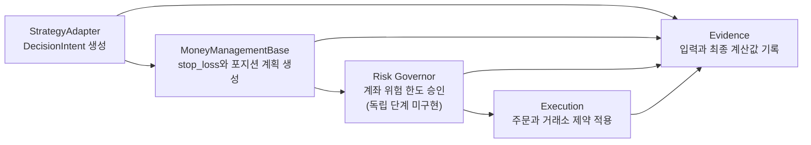

# 전략 작성 및 자금관리 정책 개발 규범

## 1. 문서 목적

이 문서는 `trading-system-v2`의 신규 전략 작성, 기존 전략 리팩터링, 자금관리
정책 개발 및 관련 코드 리뷰에 적용하는 규범 문서다. 전략 작성자는 이 문서를
따라야 하며, 플랫폼 구현자는 등록·설정 해석·실행·Evidence 단계에서 전략이
규범을 준수하는지 검증해야 한다.

이 규범은 지금의 `trading-system-v2`에 맞는 상태를 정의한다. 최종 목표는
TradingView에서 전략을 작성하는 것과 같은 수준까지 넓히는 것이며, 그 확장은
`trading-system-v2`의 발전과 함께 진행한다.

이 문서의 규칙 가운데 코드가 아직 강제하지 않는 것이 있다. 규칙이 적혀 있다는
사실만으로 동작이 보장된다고 가정하지 않으며, 강제되지 않는 규칙은 검사로 직접
확인한다. §9의 필수 테스트가 그 확인의 자리다.

이 문서는 전략을 어떻게 쓰고 무엇을 지켜야 하는지의 규칙을 소유한다. 지표와
캔들 패턴의 계산은 `docs/references/technical_indicators_calc_spec.md`와
`docs/references/candlestick_pattern_calc_spec.md`가 소유하고, 코드의 구조와
클래스 관계와 실행 순서는 `docs/fullspec/backtest_v2_detailed_design.md`가
보인다.

**이 문서만 읽고 전략을 쓸 수 있어야 한다.** 설계서는 플랫폼 자체를 고칠 때 보는
문서이며, 전략 작성자가 그것을 열지 않는다고 가정한다. 그러므로 **전략을 쓰는 데
필요한 것은 설계서와 겹치더라도 여기 적는다.** 전략이 받는 값의 모양, 전략이
반환하는 값이 지켜야 하는 것, parameter를 선언하고 읽는 법이 그런 것이다.

**겹쳐 적지 않는 것은 둘이다.** 하나는 계산식이고 위 두 표준 문서가 소유한다.
다른 하나는 플랫폼 내부의 구조로, 어느 클래스가 무엇을 호출하고 어느 열에 무엇이
기록되는지가 여기 해당한다. **전략을 쓰는 데 그것을 알 필요가 없고, 적어 두면
코드가 바뀔 때마다 낡는데 낡아도 드러나지 않는다.**

### 1.1 전략이 쓰는 재료는 series다

**series는 `core_lib`의 지표와 캔들 패턴이 봉마다 내놓는 값이다.** 그 둘뿐이며
다른 것은 series가 아니다. 지표는 `core_lib.indicators`에, 캔들 패턴은
`core_lib.patterns`에 구현되어 있다.

21봉 EMA를 예로 들면, 봉이 하나 마감될 때마다 그 시점의 EMA 값이 하나 정해진다.
그렇게 봉마다 하나씩 이어진 값들이 `ema:period=21`이라는 series다.

**값은 마감된 봉에서만 나온다.** 진행 중인 봉으로는 계산하지 않으므로 어떤 봉의
값은 그 봉이 닫힌 뒤에 정해지고, 한 번 정해지면 바뀌지 않는다. 전략이 판단하는
시점에 손에 쥐는 것은 **지금 봉까지의 값**이며 다음 봉의 값은 아직 없다.

**전략은 series를 직접 계산하지 않는다.** 무엇이 필요한지 선언만 하고, 계산은
registry에 등록된 구현이 맡아 값을 만들어 넘겨준다.

**둘은 등록 단위가 다르다.** 지표는 **이름과 parameter 조합** 단위로 등록되므로
21봉 EMA와 55봉 EMA는 서로 다른 series다. 캔들 패턴은 **이름** 단위로 등록되고
parameter가 없다.

**그래도 전략은 둘을 구분해 적지 않고 한 목록에 함께 선언한다.** 두 registry의
이름이 겹치지 않아 이름만으로 어느 쪽인지 갈리기 때문이다.

**캔들은 series가 아니다.** 캔들은 series를 계산해 내는 입력이며, 뒤에서 보듯
선언 없이도 전략에 들어온다.

**코드에는 `series`라는 이름이 나오지 않는다.** 선언하는 자리는
`required_indicators`이고 값이 들어오는 자리는 `market_data["indicators"]`이며,
둘 다 이름이 지표만 가리킨다. 지표밖에 없던 시절의 이름이 그대로 남은 것이고
**지금은 캔들 패턴도 같은 자리에 함께 들어온다.** 이 문서가 series라고 부르는
것은 그 두 자리에 담기는 것 전부다.

#### 무엇을 선언하면 무엇이 오는가

아래 전략을 예로 삼아 따라간다.

> 5분봉으로 판단한다. 21봉 EMA 위에서 장악형 캔들이 나오면 진입하되, 직전 10봉의
> 고가를 넘지 못했으면 들어가지 않는다.

**선언하는 series는 둘이다.** 21봉 EMA와 장악형 패턴이며, 지표와 패턴을 구분하지
않고 한 목록에 적는다.

```python
required_indicators=[
    {"name": "EMA", "params": {"period": 21}},
    {"name": "pat_engulfing", "params": {}},
]
```

**선언한 결과로 매 봉 `indicators`에 값이 들어온다.** 꺼낼 때 쓰는 key는 선언한
이름이 아니라 execution key다.

```python
market_data["indicators"] == {
    "ema:period=21": 142.02,
    "pat_engulfing": {
        "pat_engulfing": 1.0,          # 성립
        "pat_engulfing_dir": 1.0,      # 방향
        "pat_engulfing_strength": 1.0, # 강도
        "pat_engulfing_confirm": 0.0,  # 뒤 봉에서의 확인
    },
}
```

**직전 10봉은 선언하지 않는다.** 캔들은 series가 아니므로 적을 자리도 없고 적을
필요도 없다. `candles`에 **지금 봉까지의 확정 캔들이 전부** 들어오기 때문이다.
10봉이 필요하면 그중 뒤쪽 10개를 쓴다.

```python
recent = market_data["candles"][-10:]
highest = max(candle.high for candle in recent)
```

**대신 그 10봉이 실제로 있다는 것은 선언으로 보장한다.** 그 자리는
`required_indicators`가 아니라 `min_history`이며, **전략 자신의 판단 로직이
필요로 하는 봉 수**를 적는다. 위 전략은 10이다.

**Engine은 선언한 것을 모두 보고 미리 채울 봉 수를 정한다.** 21봉 EMA는 21봉,
장악형은 3봉, 전략 자신은 10봉을 요구하므로 그중 가장 큰 21봉을 채운 뒤 첫
판단을 시작한다. 그래서 **첫 판단 봉에서도 `candles`에는 이미 21봉이 넘게 들어
있고, 선언한 두 series는 모두 값을 갖고 있다.**

**series 하나는 자기 이름과 parameter, 계산 version, 그리고 첫 값이 나오기까지
필요한 봉 수를 들고 있다.** 마지막 것을 warm-up이라 부르며, 그만큼의 봉이 쌓이기
전에는 값이 없다. 21봉 EMA의 warm-up은 21이다. **전략이 적는 것은 이름과
parameter뿐이고 나머지는 registry에서 온다.**

**한 봉의 값은 `SeriesValue`이며 `float` 하나이거나 `dict[str, float]`이다.**
출력이 여럿인 series가 뒤쪽이고, 그때 안쪽 `dict`의 key가 출력 이름이다. 캔들
패턴은 언제나 뒤쪽이다.

아래는 지금 등록되어 있는 series 셋이다. 값을 꺼낼 때 쓰는 key는 선언한 이름이
아니라 **execution key**이며 만드는 규칙은 §4.4에 있다.


| 선언                                                                                       | execution key                                        | 종류  | 한 봉의 값                                      |
| ---------------------------------------------------------------------------------------- | ---------------------------------------------------- | --- | ------------------------------------------- |
| `{"name": "EMA", "params": {"period": 21}}`                                              | `ema:period=21`                                      | 지표  | `float` 하나                                  |
| `{"name": "MACD", "params": {"fast_period": 12, "slow_period": 26, "signal_period": 9}}` | `macd:fast_period=12,signal_period=9,slow_period=26` | 지표  | `macd`·`signal`·`histogram` 세 출력을 담은 `dict` |
| `{"name": "pat_engulfing", "params": {}}`                                                | `pat_engulfing`                                      | 패턴  | 성립·방향·강도·확인 네 출력을 담은 `dict`                 |


등록된 것은 지표 91 조합과 캔들 패턴 61종이다. 이 수는 늘어나며, 어느 시점의
수가 규칙을 바꾸지는 않는다.

## 2. 전략이 반드시 지켜야 하는 것

아래를 지키지 않으면 전략이 구현되지 않는다. 여기서 "구현되지 않는다"는 성능이
나쁘다는 뜻이 아니라 **만들어지지 않거나 실행되지 않는다**는 뜻이다.

- `StrategyBase`를 상속했다면 `get_metadata`·`get_parameter_schema`·`analyze`를
모두 구현한다. 하나라도 비우면 전략 인스턴스가 만들어지지 않는다.
- registry에 등록된 series만 선언한다. 등록된 지표 조합과 캔들 패턴 밖을
선언하면 series 해석이 거부한다.
- `ParameterSchema`를 지킨다. 모르는 이름도, 빠뜨린 필수 항목도, type이
맞지 않는 값도 `StrategyConfig.resolve`가 거부한다.
- 쓸 자금관리 정책을 `StrategyMetadata`에 선언한다. 선언하지 않은 정책으로는
실행할 수 없고, 청산 신호를 내지 못하는 전략은 Turtle 정책을 쓸 수 없다.
- 코드의 선언과 `signal_db.strategy_registry` 등록을 같게 유지한다. 클래스
이름과 모듈 경로와 warm-up과 지원 timeframe과 series 선언을 대조하며, 어긋나면
실행이 거부된다. 비활성이거나 폐기 표시된 전략도 실행할 수 없다.

**위 다섯은 어기는 즉시 드러나므로 따로 확인하지 않아도 된다.** 규칙을 기억해서
지키는 것과 어기면 멈추는 것은 다르며, 위 다섯은 뒤쪽이다.

### 2.1 지켜야 하지만 어겨도 드러나지 않는 것

아래도 반드시 지켜야 한다. 다만 어겨도 **아무 일 없이 통과하므로 직접 확인해야
한다.** §9의 필수 테스트가 그 확인의 자리이며, 확인하지 않으면 잘못된 전략이
그대로 실행된다.

- §9.1이 요구하는 여섯 성질. 결정성, 자금관리 정책을 바꿔도 판단이 같을 것,
확정되지 않은 캔들과 미래 지표를 쓰지 않을 것, 금지된 의존이 없을 것, 선언한
series와 실제로 읽는 series가 일치할 것, 진입을 내면 유효한 청산도 낼 것이다.
- 세 메서드의 시그니처를 맞춘다. 이름만 같으면 통과하므로 인자나 return type이
어긋나도 실행 도중에야 드러난다.
- 전략 version과 parameter 기본값과 `StrategyProfile`을 등록과 맞춘다. 등록
대조가 이 셋은 보지 않는다.

**이 목록은 줄어드는 것이 정상이다.** 공통 검사가 들어오면 여섯 성질이 §2로
옮겨 간다. 옮겨 갈 때 이 절을 함께 고친다.

## 3. 핵심 원칙

전략은 무엇을 언제 거래할지 결정한다. 자금관리 정책은 한 거래에서 얼마나
위험을 부담할지 결정한다. 공통 리스크 가드는 계좌 전체의 허용 범위를 강제하고,
실행 계층은 주문과 거래소 제약을 처리한다.

다음 책임 경계는 필수다.


| 계층         | 소유하는 책임                                                                       | 소유하면 안 되는 책임                                  |
| ---------- | ----------------------------------------------------------------------------- | --------------------------------------------- |
| 전략 Adaptee | 진입·청산 판단, 판단에 필요한 지표와 timeframe, 전략 고유 parameter                              | quantity, 계좌 위험 금액, 증거금, 최종 leverage, 거래소 반올림 |
| 자금관리 정책    | 최초 `stop_loss`, 선택적 `take_profit`, 거래당 위험에 따른 requested quantity, leverage 요청 | 진입 edge, 계좌 전체 노출 승인, 주문 전송                   |
| 공통 리스크 가드  | 계좌 전체의 위험 상한과 거래 승인                                                           | 전략 신호 생성, `take_profit` 선택                    |
| 실행 계층      | 주문 변환, quantity·가격 단위 반올림, 수수료·증거금·청산 안전성, 체결                                 | 전략 판단, risk budget 확대                         |
| Engine     | 위 계층의 결정적 순서와 Evidence 기록                                                     | 전략별 수식 복제                                     |




### 3.1 공통 리스크 가드는 아직 독립 계층이 아니다

위 표와 흐름도의 공통 리스크 가드는 **목표 상태다.** 지금은 그 이름의 계층이
없고, 계좌 전체를 보고 거래를 승인하거나 거절하는 단계도 실행 순서에 없다.

지금 있는 것은 `RiskLimits` 하나이며 `risk_per_trade`와
`maintenance_margin_rate`와 `max_leverage` 셋을 담는다. 자금관리 정책이 계획을
세울 때 그 값을 인자로 받아 스스로 지키며, 정책 밖에서 다시 검사하지 않는다.

**종목별·방향별·상관군별 상한은 아무 데도 없다.** 여러 종목을 함께 보고 판단하는
자리 자체가 없으므로, 같은 방향으로 여러 종목에 동시에 들어가는 것을 막지 못한다.

**전략 작성자는 이 보호가 있다고 가정하면 안 된다.** 계좌 전체를 지켜 주는 것은
지금 `risk_per_trade`와 `max_leverage`뿐이다.

## 4. 전략 작성 규칙

### 4.1 전략은 판단 전용이어야 한다

전략은 Engine이 전달한 입력만 사용해야 한다. 전략은 stateless이고 같은 입력과
설정에서 같은 판단을 반환해야 한다.

Engine은 아래의 여섯 가지 항목을 `Mapping` type을 통해서 전략 구현체에 전달한다.
전략은 이 밖의 값을 구해 오면 안 된다.


| Key           | Type                        | Value                                                |
| ------------- | --------------------------- | ---------------------------------------------------- |
| `candles`     | `list[Candle]`              | 지금 봉까지의 확정 캔들 전체. 진행 중이거나 미래인 봉은 들어 있지 않다            |
| `candle`      | `Candle`                    | 지금 판단하는 확정 봉                                         |
| `symbol`      | `str`                       | 실행 종목                                                |
| `timeframe`   | `str`                       | 실행 timeframe                                         |
| `market_type` | `str`                       | `"spot"` 또는 `"futures"`. `MarketType(value)`로 변환해 쓴다 |
| `indicators`  | `Mapping[str, SeriesValue]` | 선언한 series의 이번 봉 값. key 규칙은 §4.4에 있다                 |


`SeriesValue`는 `float` 또는 `dict[str, float]`이다(§1.1).

`Candle`에서 읽을 수 있는 것은 아래 열둘이다. 가격과 거래량은 `float`이고
`quote_volume`과 `trade_count`는 없을 수 있어 `None`이 올 수 있다.


| 필드                                        | 담는 것                                      |
| ----------------------------------------- | ----------------------------------------- |
| `symbol` · `exchange` · `timeframe`       | 이 봉이 어느 종목·거래소·timeframe의 것인지             |
| `open_time` · `close_time`                | 봉의 시작과 마감 시각. 둘 다 timezone을 가진 `datetime` |
| `open` · `high` · `low` · `close`         | 시가·고가·저가·종가                               |
| `volume` · `quote_volume` · `trade_count` | 거래량과 거래대금과 체결 건수                          |


`current_position`이 `None`이 아니면 보유 중이고, `Position`에서 읽을 수 있는
것은 아래와 같다. **한 종목에 한 방향만 들 수 있으므로 방향은 언제나 하나다.**


| 필드                                                           | 담는 것                                        |
| ------------------------------------------------------------ | ------------------------------------------- |
| `side`                                                       | `PositionSide.LONG` 또는 `PositionSide.SHORT` |
| `quantity` · `average_price` · `entry_price`                 | 보유 수량과 평균 단가와 진입가                           |
| `current_price` · `mark_price` · `unrealized_pnl`            | 현재가와 표시가격과 평가손익                             |
| `leverage` · `margin` · `margin_type` · `liquidation_price`  | 자금관리와 실행이 정한 값                              |
| `market_type` · `symbol` · `wallet_id` · `funding_fee_total` | 시장 종류와 식별자와 누적 funding                      |


**뒤의 두 줄은 읽을 수는 있지만 판단에 쓰지 않는다.** leverage와 증거금과
청산가는 자금관리 정책과 실행 계층이 정한 결과이며, 전략이 그것을 보고 판단을
바꾸면 §3의 책임 경계가 무너진다. 전략이 정상적으로 쓰는 것은 `side`와 진입가,
그리고 현재가다.

전략 코드에서는 다음 작업을 금지한다.

- 데이터베이스, 파일, HTTP API 또는 거래소를 직접 읽거나 쓴다.
- wall clock이나 전역 mutable state를 사용한다.
- 아직 닫히지 않은 캔들 또는 미래 캔들을 참조한다.
- 주문 quantity, 계좌 자산 기반 위험 금액, 증거금 또는 최종 leverage를 계산한다.
- 주문을 만들거나 Broker 또는 서비스 구현을 호출한다.
- `backtest_service`, `web_api` 또는 다른 서비스 패키지를 import한다.
- 강제청산을 판정하거나 흉내 낸다.

**강제청산은 전략 밖에서 일어난다.** 경로가 둘인데 둘 다 Engine과 실행 계층의
몫이다. 하나는 봉의 불리한 극값이 `Position.liquidation_price`에 닿는 경우이고,
다른 하나는 funding 정산이 격리 증거금을 소진하는 경우다. 전략에는 이것을
요청할 `DecisionAction` 값도, 판정에 필요한 quantity와 leverage도 오지 않는다.

**다만 결과는 알아야 한다.** 손절이 청산가 너머에 놓이면 두 조건이 같은 봉에서
함께 성립할 때 **청산이 이긴다.** 손절을 아무리 멀리 두어도 그만큼 손실이
줄어들지는 않는다는 뜻이며, 이것이 §3의 자금관리 정책이 `stop_loss`를 소유하는
이유다.

전략은 진입과 청산 판단을 명시적인 `DecisionIntent`로 반환하는 목표 방식을
따른다. 방향을 `stop_loss`의 상대 위치로 추론하게 만들지 않는다.

`StrategyAdapter` Protocol이 규범 정책이며 `StrategyBase`는 그 정책을 만족하도록
제공하는 선택적 편의 base class다.

```python
class DecisionAction(StrEnum):
    ENTER_LONG = "ENTER_LONG"
    ENTER_SHORT = "ENTER_SHORT"
    EXIT = "EXIT"
    HOLD = "HOLD"


@dataclass(frozen=True, slots=True)
class DecisionIntent:
    action: DecisionAction
    symbol: str
    timestamp: datetime
    reference_price: float
    confidence: float
    reason: str
    metadata: Mapping[str, object]
```

**각 필드가 지켜야 하는 것이 있고, 어기면 `DecisionIntent` 생성 자체가
실패한다.** 값을 만들어 넣는 자리가 아니라 판단의 근거를 남기는 자리다.


| 필드                | 지켜야 하는 것                                                                 |
| ----------------- | ------------------------------------------------------------------------ |
| `action`          | 위 넷 중 하나                                                                 |
| `symbol`          | 비어 있지 않은 문자열. 판단한 봉의 종목을 넣는다                                             |
| `timestamp`       | timezone을 가진 시각이며 **판단한 봉의 `close_time`보다 늦을 수 없다.** 늦으면 Engine이 실행을 멈춘다 |
| `reference_price` | 유한한 양수 `float`. 판단의 근거가 된 가격이며 보통 그 봉의 종가다                               |
| `confidence`      | 0 이상 1 이하의 유한한 `float`                                                   |
| `reason`          | 비어 있지 않은 문자열. 왜 이 판단인지를 나중에 세어 볼 수 있는 이름으로 적는다                           |
| `metadata`        | 그 밖에 남길 것. 읽기 전용으로 굳혀 보관된다                                               |


**아무것도 하지 않는 봉에서도 무엇을 왜 하지 않았는지 남긴다.** 두 반환값이
서로 다른 뜻을 가지며, 어느 것을 쓸지는 전략이 판단할 수 있었는지로 갈린다.

`DecisionAction.HOLD`는 **판단했고 이번 봉에는 하지 않는다**는 뜻이다. 무포지션
에서 진입 조건이 서지 않은 경우와, 보유 중에 청산 조건이 서지 않은 경우가 모두
여기 해당한다. 전략은 `analyze`의 두 번째 인자인 `current_position`으로 두
상황을 구분할 수 있으므로, 어느 쪽인지 알아볼 수 있는 `reason`을 담는다.

`None`은 **판단 자체를 할 수 없었다**는 뜻이며 좁은 경우에만 쓴다. 선언한 series
가운데 표준이 값을 정의하지 않는 출력이 있고 그 봉에서 실제로 정의되지 않아
조건을 평가할 수 없을 때다. Engine은 실행 구간에 들어가기 전에 warm-up을 끝내고
끝나지 않으면 실행을 거부하므로, **선언한 series가 아직 값을 못 낸다는 이유로
`None`을 반환할 일은 없다.**

**미실행 봉의 `reason`은 전략 개선의 재료다.** 어느 조건에서 몇 번 걸렀는지가
성적 뒤에 있는 이유이며, `None`은 그것을 담을 자리가 없다. `DecisionIntent`가
빈 `reason`을 거부하는 것도 같은 이유다.

**이 구분은 Evidence에 그대로 남는다.** `HOLD`를 받으면 Engine이 `DECISION`에
행 하나를 `action='skip'`으로 쓰고 `skip_reason`에 전략이 담은 `reason`을
남긴다. 앞선 신호가 없으므로 그 행에는 `signal_id`가 없다. **`None`은 아무것도
남기지 않으며, 그것이 두 값을 가르는 실제 차이다.**

거래가 만들어지지 않으므로 손익과 지표 값은 달라지지 않는다. **미실행 봉의
사유를 세어 무엇이 진입을 가장 많이 걸렀는지 보는 것이 이 기록의 쓰임이다.**

신규 전략은 `DecisionIntent`에 `quantity`, `stop_loss`, `take_profit`,
`leverage` 또는 계좌 상태를 넣지 않는다. 목표 방식이 구현되기 전까지 기존
`TradingSignal`을 사용해야 하는 변경은 legacy 경계임을 코드와 테스트에
명시하고, 새로운 자금관리 수식을 전략에 추가하지 않는다.

**선언한 이름을 그대로 읽지 않는다.** `indicators`의 key는 이름을 소문자로
바꾸고 parameter를 붙인 execution key이며,
`{"name": "EMA", "params": {"period": 21}}`은 `ema:period=21`이 된다.
규칙 전체는 §4.4에 있다.

아래는 이 규범을 모두 지키는 최소 전략이다. 추세는 두 EMA의 위치로 보고 진입은
장악형 캔들로 확정하며, `stop_loss`와 quantity는 전혀 다루지 않는다.

**series가 코드의 어디에 나타나는지를 `[series 1]`부터 `[series 3]`까지 주석으로
표시했다.** 차례로 **선언하는 자리**, 그 선언을 **execution key로 옮긴 자리**,
그리고 **값이 들어오는 자리**다. 세 자리의 이름이 서로 달라 이어 보기 어려우므로
표시해 둔다.

```python
from collections.abc import Mapping

from core_lib.strategy import (
    FieldSpec,
    MoneyManagementSupport,
    ParameterSchema,
    ResolvedConfig,
    StrategyBase,
    StrategyMetadata,
    StrategyProfile,
)
from core_lib.types import Candle, DecisionAction, DecisionIntent, Position, PositionSide

STRATEGY_ID = "ema-engulfing-example"

# [series 2] 아래 get_metadata가 선언한 series 셋을 execution key로 옮긴 것이다.
# 이 문자열이 market_data["indicators"]에서 값을 꺼낼 때 쓰는 key가 된다.
_FAST = "ema:period=21"     # <- {"name": "EMA", "params": {"period": 21}}
_SLOW = "ema:period=55"     # <- {"name": "EMA", "params": {"period": 55}}
_PATTERN = "pat_engulfing"  # <- {"name": "pat_engulfing", "params": {}}


class EmaEngulfingExample(StrategyBase):
    """추세 방향으로 장악형이 나올 때만 진입하고 추세가 꺾이면 청산한다."""

    VERSION = "1.0.0"

    def __init__(self, config: ResolvedConfig) -> None:
        self.config = config

    @classmethod
    def get_metadata(cls) -> StrategyMetadata:
        return StrategyMetadata(
            # [series 1] 이 목록이 series 선언이다. 필드 이름은 indicator지만
            # 지표와 캔들 패턴을 구분하지 않고 함께 적는다(§1.1).
            required_indicators=[
                {"name": "EMA", "params": {"period": 21}},      # 지표
                {"name": "EMA", "params": {"period": 55}},      # 지표
                {"name": "pat_engulfing", "params": {}},        # 캔들 패턴
            ],
            min_history=1,  # series가 아니다. 이 전략 자신이 필요로 하는 봉 수다
            supported_timeframes=["1h"],
            profile=StrategyProfile(
                id="ema-engulfing-example-v1",
                family="trend",
                bar="1h",
                expected_win_rate=(0.30, 0.55),
                expected_payoff=(1.2, 3.0),
                tail_shape="right_fat",
                holding_horizon="multi_day",
                primary_metric="calmar",
                risk_adjusted_pref="sortino",
                profit_structure_to_preserve="trend-capture-with-pattern-entry",
                envelope_tolerance=0.20,
                envelope_status="provisional",
            ),
            money_management=MoneyManagementSupport(
                supported=("manual",),
                default="manual",
                supports_external_stop=True,
                supports_external_take_profit=True,
                supports_signal_exit=True,
                supports_pyramiding=False,
            ),
        )

    @classmethod
    def get_parameter_schema(cls) -> ParameterSchema:
        # 진입 판단을 바꾸는 값만 둔다. 자금관리 소유 이름은 §4.2에서 금지한다.
        return ParameterSchema(
            fields={
                "min_strength": FieldSpec(type="number", default=1.0, range=(0.5, 1.0)),
            }
        )

    def analyze(
        self,
        market_data: dict[str, object],
        current_position: Position | None,
    ) -> DecisionIntent | None:
        candle = market_data["candle"]

        # [series 3] 선언한 series의 이번 봉 값이 여기 들어 있다. 위에서 선언한
        # 셋이 그대로 오고, 선언하지 않은 것은 오지 않는다.
        series = market_data["indicators"]
        assert isinstance(candle, Candle) and isinstance(series, Mapping)

        # 출력이 하나인 series는 값이 float이다.
        fast = float(series[_FAST])
        slow = float(series[_SLOW])

        if current_position is not None:
            trend_broke = (current_position.side is PositionSide.LONG and fast <= slow) or (
                current_position.side is PositionSide.SHORT and fast >= slow
            )
            if not trend_broke:
                return self._intent(candle, DecisionAction.HOLD, "trend-intact")
            return self._intent(candle, DecisionAction.EXIT, "trend-broke")

        # 출력이 여럿인 series는 값이 dict다. 캔들 패턴은 언제나 넷을 낸다(§1.1).
        pattern = series[_PATTERN]
        assert isinstance(pattern, Mapping)

        # 미실행 사유를 하나로 뭉치지 않는다. 나중에 무엇이 몇 번 걸렀는지 세려면
        # 사유가 갈려 있어야 한다.
        if pattern[_PATTERN] != 1.0:
            return self._intent(candle, DecisionAction.HOLD, "no-engulfing")
        if pattern[f"{_PATTERN}_strength"] < float(self.config.params["min_strength"]):
            return self._intent(candle, DecisionAction.HOLD, "engulfing-too-weak")

        # 장악형은 패턴 표준이 부호를 이번 봉의 색으로 정의하므로 양수가 bullish다.
        # 다른 패턴에 같은 가정을 옮기지 않는다(§4.4).
        bullish = pattern[f"{_PATTERN}_dir"] > 0
        if fast > slow and bullish:
            return self._intent(candle, DecisionAction.ENTER_LONG, "uptrend-engulfing")
        if fast < slow and not bullish:
            return self._intent(candle, DecisionAction.ENTER_SHORT, "downtrend-engulfing")
        return self._intent(candle, DecisionAction.HOLD, "engulfing-against-trend")

    @staticmethod
    def _intent(candle: Candle, action: DecisionAction, reason: str) -> DecisionIntent:
        return DecisionIntent(
            action=action,
            symbol=candle.symbol,
            timestamp=candle.close_time,
            reference_price=float(candle.close),
            confidence=1.0,
            reason=reason,
            metadata={"adaptee": STRATEGY_ID},
        )
```

**`min_history`는 series의 warm-up을 모아 적는 자리가 아니다.** 각 series가 값을
내기까지 필요한 봉 수는 **그 series가 저마다 들고 있고 registry가 소유한다.** 위
예시에서 `ema:period=55`는 55봉, `ema:period=21`은 21봉, `pat_engulfing`은
3봉이며, 이 숫자를 전략이 다시 적지 않는다.

전략이 적는 `min_history`는 **series를 빼고 전략 자신의 판단 로직이 필요로 하는
봉 수**다. 위 예시는 이번 봉의 값만 보므로 1이다. 20봉 전 고가와 비교하는
전략이라면 20이 된다.

Engine은 둘을 합쳐 확보할 구간을 정한다. 산정 규칙은 §4.5에 있다.

```text
required warm-up = max(min_history, 선언한 각 series의 warm-up)
```

200봉 EMA를 쓰면서 직전 10봉의 고가를 함께 보는 전략이면 이렇게 된다.

```text
ema:period=200 의 warm-up = 200   <- registry가 소유한다. 전략이 적지 않는다
min_history               =  10   <- 전략이 적는다. 캔들을 10봉 거슬러 읽으므로
확보 구간                  = 200   <- Engine이 둘 중 큰 값을 취한다
```

**여기에 200을 적는 것이 아니다.** EMA가 200봉을 필요로 한다는 사실은 registry가
이미 알고 있다. 전략이 그 숫자를 옮겨 적으면 같은 사실이 두 곳에 생기고, **EMA의
기간을 바꿀 때 한쪽만 고쳐져 어긋난다.**

**"시작하려면 최소 몇 봉이 있어야 하는가"에 답하는 것은 확보 구간이지
`min_history`가 아니다.** `min_history`는 그 계산에 들어가는 두 입력 중
하나이며, 위 예시에서는 EMA 쪽이 더 커서 결과에 영향을 주지 않는다. 첫 판단
봉에서 `candles`에는 미리 채운 200봉에 이번 봉을 더해 201봉이 들어 있다.

**적게 적어도 대개는 잘 돈다. 그래서 위험하다.** Engine이 둘 중 큰 값을 쓰므로
`min_history`를 1로 두어도 21봉 EMA를 선언했다면 첫 판단 봉에 이미 21봉이 넘게
들어 있다. 직전 20봉을 읽는 코드가 **선언과 무관하게 우연히 맞아떨어진다.**

그 상태에서 누군가 EMA를 21봉에서 5봉으로 바꾸면 확보 구간이 5봉으로 줄어든다.
`market_data["candles"][-20:]`은 모자라도 예외를 내지 않고 있는 만큼만
돌려주므로, **20봉이 아니라 5봉의 최고가를 보면서 아무 오류 없이 다른 판단을
낸다.** 그래서
실제로 읽는 봉 수를 그대로 적어야 하며, 이것은 §2.1이 말한 "어겨도 드러나지 않는
것"에 해당한다.

**`min_history`가 실제로 결과를 바꾸는 것은 그 값이 선언한 모든 series의 warm-up
보다 클 때뿐이다.** 20봉 EMA만 선언한 전략이 직전 50봉에서 최고가를 찾는다면 EMA
쪽은 20봉이므로 `min_history`를 50으로 적어야 확보 구간이 50이 된다. 적지
않으면 20봉만 확보되어 **50봉이 아니라 20봉의 최고가를 보게 된다.**

**registry에 없는 계산을 전략이 캔들에서 직접 하는 경우가 특히 그렇다.** 등록된
series로 풀리는 계산은 그 series의 warm-up이 함께 따라오지만, 전략이 스스로 하는
계산은 registry가 알 길이 없으므로 `min_history`가 그것을 알릴 유일한 통로다.

**series를 하나도 선언하지 않아도 된다.** 캔들만 보고 판단하는 전략은 선언할
것이 없으므로 빈 목록을 둔다. 그때는 **`min_history`만으로 확보 구간이
정해진다.**

**쓰지 않을 series를 형식 때문에 선언하지 않는다.** §2.1은 선언한 series와
실제로 읽는 series가 일치할 것을 요구하므로, 자리를 채우려고 하나를 적으면 그
규칙을 어기게 된다.

**series마다 warm-up을 골라 적는 것은 아직 안 된다.** 선언은 `name`과 `params`
둘만 받고 그 밖의 key가 있으면 거부한다. 그러므로 어떤 series를 registry
기본값보다 길게 데우고 싶어도 지금은 방법이 없고, 전략의 `min_history`를 그만큼
올려 **모든 series를 함께 늘리는 것**이 유일한 우회다. series별로 고르는 자리를
여는 것은 남은 일이다.

`StrategyProfile`은 전략의 성격과 기대 성적 범위를 담는 필수 항목이며 열두
필드를 모두 채워야 한다. 값이 정해진 것은 셋뿐이다. `tail_shape`은
`right_fat`·`symmetric`·`left_fat`, `risk_adjusted_pref`는
`sortino`·`sharpe`·`calmar`, `envelope_status`는
`provisional`·`updating`·`established` 가운데 하나여야 하고, 벗어나면
`StrategyProfile` 생성이 실패한다. `expected_win_rate`와 `expected_payoff`는
`(하한, 상한)` 순서여야 하며 승률의 상한은 1을 넘을 수 없다.

**나머지 일곱은 무엇을 적어야 하는지 이 규범이 아직 정하지 않았다.** 위 예시의
값은 형식이 맞는 예일 뿐 기준이 아니다. 새 전략은 검증되지 않은 상태이므로
`envelope_status`를 `provisional`로 두고 시작하며, 기대 범위를 무엇으로 정할지
정하는 것은 남은 일이다.

**저장소의 `VesselReference`도 이 예시와 같은 소유권 경계를 따른다.** 그 전략은
진입·청산 edge를 바꾸는 parameter가 없으므로 빈 `ParameterSchema`를 선언하고,
과거 설정의 자금관리 이름 셋은 호환 변환기가 manual 정책 설정으로 옮긴다.

### 4.2 전략 parameter와 자금관리 parameter를 분리한다

전략 parameter에는 진입·청산 edge를 바꾸는 값만 둔다. 다음 이름은
자금관리 정책 소유이므로 신규 전략의 `ParameterSchema`에서 금지한다.

- `leverage`
- `reward_risk`
- `atr_stop_multiple`
- `risk_per_trade`
- `position_size_pct`
- `margin`
- `quantity`

과거 전략의 동일 이름은 마이그레이션 기간에만 허용한다. 호환 normalizer가
이를 `manual` 정책 설정으로 옮긴 뒤, 정규화된 설정을 Evidence에 기록해야 한다.

**`VesselReference`의 과거 설정은 호환 변환 대상이지만 코드 선언은 예외가 아니다.**
그 parameter 스키마에는 이 절이 금지한 이름이 없으며, 옛 평면 값은 전략에 넘기기
전에 manual 정책 설정으로 옮겨지고 전략 `params`에서는 빠진다.

#### 4.2.1 parameter를 선언하는 법과 읽는 법

parameter 하나는 `FieldSpec`으로 선언하며 네 자리를 가진다.


| 자리         | 뜻                                                                                                                       |
| ---------- | ----------------------------------------------------------------------------------------------------------------------- |
| `type`     | 값의 종류. `number`·`integer`·`boolean`·`string`·`array`·`object` 여섯이며 `float`·`int`·`bool`·`str`·`list`·`dict`로 적어도 같게 읽힌다 |
| `default`  | 사용자가 주지 않았을 때 쓸 값. 생략하면 기본값이 없다                                                                                         |
| `range`    | 숫자에 한해 `(하한, 상한)`. 양끝을 포함하며 한쪽만 두려면 다른 쪽에 `None`을 넣는다                                                                   |
| `required` | `True`면 사용자가 반드시 주어야 하고, 없으면 실행이 거부된다                                                                                   |


**선언하지 않은 이름은 거부된다.** `ParameterSchema`의 `extra_forbidden`이
기본으로 `True`이기 때문이다. 값 하나로 판정할 수 없는 규칙, 예를 들어 두
parameter의 대소 관계 같은 것은 `cross_validators`에 함수로 넣는다.

**전략이 받는 것은 원본 설정이 아니라 `ResolvedConfig`다.** 기본값이 채워지고
type과 범위가 확인된 뒤이며, 값은 읽기 전용으로 굳어 있어 전략이 바꿀 수 없다.
`strategy_id`와 `params`와 `schema_version` 셋을 가지며, 판단에 쓰는 것은
`params`다.

```python
def __init__(self, config: ResolvedConfig) -> None:
    self.config = config
    ...

min_strength = float(self.config.params["min_strength"])
```

**`default`도 `required`도 없는 parameter는 사용자가 주지 않으면 `params`에
아예 들어오지 않는다.** 그 이름을 그냥 꺼내면 `KeyError`가 나므로, 둘 중 하나는
반드시 정한다.

**값이 굳혀져 들어오므로 선언한 type과 받는 type이 다를 수 있다.** `array`로
선언한 값은 `list`가 아니라 `tuple`로, `object`로 선언한 값은 `dict`가 아니라
읽기 전용 매핑으로 온다. `append`나 항목 대입은 실패한다. **전략이 stateless여야
하므로 설정을 바꿀 수 없게 막아 둔 것이며**, 목록을 손봐야 하면 그 자리에서 새로
만들어 쓴다.

### 4.3 지원 자금관리 정책을 선언한다

`StrategyMetadata`는 사용할 수 있는 정책과 필요한 capability를 선언해야 한다.

```python
MoneyManagementSupport(
    supported=("manual", "turtle"),
    default="manual",
    supports_external_stop=True,
    supports_external_take_profit=True,
    supports_signal_exit=True,
    supports_pyramiding=False,
)
```

여섯 자리의 뜻은 아래와 같다. `supported`에 같은 이름을 두 번 적거나 `default`를
`supported` 밖의 값으로 두면 생성 자체가 실패한다.


| 자리                              | 뜻                                          |
| ------------------------------- | ------------------------------------------ |
| `supported`                     | 이 전략으로 쓸 수 있는 정책 이름. 여기 없는 정책으로는 실행할 수 없다  |
| `default`                       | 사용자가 고르지 않았을 때 쓸 정책. `supported` 안에 있어야 한다 |
| `supports_external_stop`        | `stop_loss`를 정책이 정해 주어도 되는가                       |
| `supports_external_take_profit` | `take_profit`을 정책이 정해 주어도 되는가                       |
| `supports_signal_exit`          | 전략이 청산 판단을 스스로 낼 수 있는가                     |
| `supports_pyramiding`           | 이미 가진 포지션에 더 얹는 것을 지원하는가                   |


정책이 요구하는 capability를 전략이 제공하지 않으면 Adapter Manager가 전략
생성 단계에서 실패해야 한다. 실행 도중 임의의 fallback으로 바꾸면 안 된다.

Turtle 정책은 고정 take-profit을 사용하지 않고 전략의 청산 신호를 사용한다.
따라서 `supports_signal_exit`가 `False`인 전략에는 Turtle 정책을 선택할 수
없다. 피라미딩을 지원하지 않는 실행 경로에서는 피라미딩을 조용히 흉내 내지
않고, 지원하지 않는 capability로 명시한다.

### 4.4 series 요구사항은 조합한다

전략이 선언할 수 있는 것은 지표만이 아니다. **지표 조합과 캔들 패턴을 같은
`required_indicators` 목록에 함께 적는다.** 두 registry의 이름이 서로 겹치지
않으므로 이름만으로 어느 쪽인지 갈린다. 필드 이름이 지표만 가리키는 것은 역사적
사정이며, 실제로는 series 전반을 담는다. `RunConfig`의 `indicator_mode`와
`explicit_indicators`도 마찬가지다.

`indicators`에서 값을 꺼낼 때 쓰는 key는 선언한 이름이 아니라 **execution
key**다. 지표는 이름 뒤에 parameter가 붙고 패턴은 이름 그대로이며, **둘 다 뒤에
어느 timeframe에서 계산했는지가 붙어** `ema:period=21@1h`와 `pat_engulfing@1h`가
된다. 붙는 규칙은 4.4.1 절에 있다.

**패턴은 언제나 출력 넷을 담은 `dict`를 낸다.** `indicators["pat_engulfing@1h"]`이
그 `dict`이고, 안쪽 key는 `occurred`가 성립 여부, `direction`이 방향, `strength`가
강도, `confirmed`가 뒤 봉에서의 확인이다. 강도는 경계 성립이면 0.5이고 온전한
성립이면 1.0이다.

**네 이름이 `indicators`에 나란히 들어오지 않는다.** `indicators`에 있는 key는
`pat_engulfing` 하나뿐이며, 나머지 셋은 그 `dict` 안에 있다.

**방향 값을 매매 방향으로 그대로 쓰지 않는다.** 그 부호는 원본 구현이 내는
값이며 모든 패턴에서 매수와 매도로 일반화되지 않는다. 어떤 뜻인지는 패턴 계산
표준을 보고 판단한다.

전략과 자금관리 정책은 각자 필요한 series를 선언한다. Engine은 두 목록을
합치고 identifier 기준으로 중복을 제거한 뒤 가장 긴 warm-up을 적용한다.

```text
required indicators = strategy indicators ∪ money-management indicators
required warm-up = max(strategy history, every indicator history)
```

#### 4.4.1 전략은 여러 timeframe의 series를 쓸 수 있다

**전략은 실행 timeframe 하나에 묶이지 않는다.** 1시간봉에서 판단하면서 4시간봉
추세를 함께 보는 것은 정상적인 요구이며, 그러려면 series를 선언할 때 어느
timeframe의 것인지 함께 적을 수 있어야 한다.

**상위 timeframe 값에는 정렬 규칙이 따라붙는다.** 어떤 봉에서든 **그 시각까지
완전히 마감된 상위 봉의 값만** 쓴다. 진행 중인 상위 봉의 고가·저가·종가를
참조하면 아직 오지 않은 정보를 보는 것이 되며, 이것은 §4.1이 금지한 미래 참조와
같은 위반이다. 백테스트에서는 성적이 좋아지고 실거래에서는 재현되지 않는다.

**execution key는 어느 timeframe에서 계산한 것인지를 담아야 한다.** 지금
`ema:period=21`을 보고는 5분봉인지 4시간봉인지 알 수 없다. 실행 timeframe이
하나뿐일 때는 실행 설정을 보면 알 수 있었지만, 여러 timeframe을 함께 쓰면
**같은 key 둘이 서로 다른 것을 가리키게 되어 뒤에 계산된 것이 앞의 것을
덮는다.**

**그러므로 key 뒤에 timeframe을 붙인다.**

```text
<registry 이름과 parameter>@<timeframe>

ema:period=21@5m
ema:period=21@4h
pat_engulfing@5m
```

**앞부분은 registry의 신원이고, 뒷부분은 그것을 어느 캔들 흐름 위에서
굴렸는지다.** registry는 계산을 등록할 뿐 어느 timeframe에서 쓸지는 모르므로,
timeframe을 parameter로 넣어 등록을 timeframe 수만큼 늘리지 않는다. **같은
등록을 다른 흐름 위에서 굴린 결과라는 관계가 key 모양에 그대로 드러나야 한다.**

**생략형은 두지 않는다.** 실행 timeframe일 때만 `@`를 빼는 방식이 값싸 보이지만,
그러면 절반은 timeframe이 붙고 절반은 붙지 않아 **붙지 않은 key를 볼 때마다
빠진 것인지 실행 timeframe인지 되짚어야 한다.**

**캔들 패턴도 지표와 같다.** 패턴은 registry에 이름만 등록되므로 앞부분이 이름
그대로일 뿐이고, 뒤에 붙는 것은 다르지 않다. 5분봉 장악형은
`pat_engulfing@5m`이고 4시간봉 장악형은 `pat_engulfing@4h`이며, 둘은 서로 다른
series다.

**다만 패턴 안쪽의 출력 이름 넷에는 붙이지 않는다.** 그 넷은 series 하나가 내는
값 안에서 출력을 가르는 이름이고, 어느 timeframe인지는 이미 바깥 key가 말하고
있다. 안쪽까지 붙이면 같은 말을 두 번 하게 된다.

```python
market_data["indicators"]["pat_engulfing@4h"] == {
    "occurred": 1.0,
    "direction": 1.0,
    "strength": 1.0,
    "confirmed": 0.0,
}
```

**안쪽 이름은 출력이 무엇인지만 말한다.** 성립 여부는 `occurred`, 방향은
`direction`, 강도는 `strength`, 뒤 봉에서의 확인은 `confirmed`다. 이 넷은 패턴
계산 표준(`docs/references/candlestick_pattern_calc_spec.md`의 5.1 절)이 소유한다.

전에는 안쪽 이름이 `pat_engulfing`처럼 series 이름을 되풀이했고, 증거 차트가
**바깥 key 문자열을 가져다 안쪽 이름을 만들어** 조회했다. 그래서 바깥에 `@`가
붙는 순간 안쪽에서 아무것도 찾지 못했다. **바깥 key 형식을 바꾸면서 함께
바꾸었다**(2026-08-08 결정대로). 값은 하나도 바뀌지 않았고 이름만 바뀌었다.

**실행 timeframe을 선언에 글자로 적지 않는다.** 전략은 `supported_timeframes`로
여러 timeframe을 지원한다고 밝힐 수 있으므로 선언에 `1h`라고 적어 두면 같은
전략을 4시간봉으로 돌릴 수 없다. **실행 timeframe을 가리키는 말은 `strategy`
하나뿐이며**, 구체 timeframe이 그 실행의 timeframe과 같으면 거부한다. 이 규칙
덕분에 **구체 timeframe은 실행 timeframe과 절대 같아질 수 없고, 서로 다른 두
선언이 같은 execution key로 겹치는 일이 생기지 않는다.**

**어디까지 구현되었나.** 선언의 `timeframe` 자리와 위의 key 형식, 그리고 패턴
안쪽 이름은 구현되어 있다. **아직 캔들 흐름은 하나뿐이다.** 그래서 실행
timeframe이 아닌 값을 선언하면 아직 지원하지 않는다는 사유로 거부되며,
`market_data`의 `candles`와 `timeframe`도 실행 timeframe 하나를 가리킨다.
**여러 흐름을 읽고 위의 정렬 규칙을 지키는 것은 아직 남아 있다.**

**key를 만드는 곳은 하나로 모여 있어야 한다.** 값을 쓸 때와 기록에서 읽어 되만들
때가 서로 다른 규칙을 쓰면 같은 series를 찾지 못한다. 그래서 서버 쪽은 한 함수가
key를 만들고, **그 함수는 timeframe을 반드시 받는다** — 받지 않고 만들 수 있는
길을 두면 붙지 않은 key가 조용히 섞인다. 붙는 timeframe은 언제나 해석된 값이며
`strategy`라는 말은 key에 들어갈 수 없다.

**화면은 같은 규칙을 한 번 더 갖고 있다.** 실행 비교 화면이 기록된 선언에서 key를
다시 만들어 견주므로, 서버 쪽만 고치면 화면이 만든 key가 기록된 key와 어긋나
**같은 series의 서로 다른 두 timeframe이 하나로 겹쳐 보인다.** 두 곳을 함께
맞춘다.

**Evidence의 `INDICATOR_DEFINITION`과 `INDICATOR_SNAPSHOT`이 이 key를 그대로
담는다.** 그래서 key 모양을 바꾸면 새 판의 실행부터 기록된 값이 달라지고, 판을
올리고 새 고정을 더해야 한다.

**자금관리 정책 쪽에는 좁은 경로가 하나 있다.** `PolicyIndicatorRequirement`는
요구마다 `timeframe`을 가지며 값은 `strategy`와 `1d` 둘뿐이다. `1d`로 적은
요구는 Engine이 일봉을 따로 조회해 계산하고 **그 값을 정책에만 넘긴다.**
전략의 `indicators`에는 들어가지 않는다. 지금 이 경로를 실제로 쓰는 것은
Turtle 정책의 일간 `N` 하나뿐이다.

**그 경로는 위의 정렬 규칙을 이미 지킨다.** 판단 시각보다 늦게 마감된 일봉의
값은 후보에서 빼고 마지막으로 마감된 것을 쓴다. 전략 쪽 multi-timeframe을
구현할 때 따를 본보기가 여기 있다.

단순히 1시간 ATR을 쓰면서 역사적 Turtle 규칙과 동일하다고 표시하면 안 된다.

### 4.5 선언이 곧 확보할 과거 데이터의 양이다

실행이 읽어 오는 과거 데이터의 범위는 위 선언에서 계산한다. 선언이 부족하면
지표가 값을 내지 못하거나 정책이 요구한 series가 비어 실행이 실패한다. 선언이
과하면 매 실행이 필요 없는 이력을 읽는다.

계산은 두 축을 모두 본다. 하나는 개수이고 다른 하나는 그 개수가 걸치는
달력 구간이다. 20일 `N`은 20이라는 개수만으로는 부족하고, 1시간봉 전략에서
20일에 해당하는 구간을 읽어야 한다. 그래서 각 요구의 개수를 그 요구가 선언한
timeframe으로 환산하고 그중 가장 넓은 구간을 취한다.

```text
확보 구간 = max(
    strategy timeframe × required warm-up,
    각 지표 요구에 대해  그 요구의 timeframe × 그 요구의 기간
)
```

이 계산은 최적화이며 정확성의 근거가 아니다. 계산한 구간으로 읽었는데 선언한
warm-up을 채우지 못하면 구현은 구간 제한을 풀고 다시 읽어야 한다. 결측이 있는
구간에서는 같은 개수를 얻는 데 더 넓은 달력 구간이 필요하기 때문이다.

**위 식의 둘째 항은 지금 자금관리 정책을 통해서만 닿는다.** 요구마다
timeframe을 가질 수 있는 것은 `PolicyIndicatorRequirement`뿐이고, 전략이 선언한
series는 모두 실행 timeframe으로 계산된다(§4.4.1). 전략 쪽 multi-timeframe이
열리면 이 식은 그대로 쓰인다.

### 4.6 등록은 Adaptee와 일치해야 한다

전략은 코드의 선언과 별개로 `signal_db.strategy_registry`에 등록한다. 등록에는
`min_history`, `required_indicators_json`, `supported_timeframes`가 들어간다.
운영자와 콘솔이 코드를 읽지 않고도 그 전략이 무엇을 요구하는지 알 수 있게 하기
위해서다.

두 곳에 같은 사실이 있으므로 **Adaptee의 선언이 표준이고 등록은 그 사본이다.**
`AdapterManager`는 catalog 조회 직후 등록 값과 Adaptee의 `StrategyMetadata`를
대조하고, 어긋나면 실행을 거부한다. 어느 쪽이 낡았는지 구현이 판단할 수 없으므로
조용히 한쪽을 택하지 않는다.

**대조가 보는 것은 다섯이다.** 클래스 이름과 모듈 경로와 `min_history`와
`supported_timeframes`와 `required_indicators_json`이다. **보지 않는 것도
알아 두어야 한다.** 전략 version과 parameter 기본값과 `StrategyProfile`은 대조
대상이 아니므로 그 셋이 어긋나도 실행이 막히지 않는다. §2.1이 그것을 스스로
지켜야 할 것으로 적어 둔 이유다.

series 목록은 순서와 key 순서를 무시하고 이름과 parameter로만 비교한다. 등록의
표현 방식이 달라도 같은 요구면 통과한다.

전략을 바꿀 때는 코드와 등록을 같은 변경으로 함께 옮긴다. 자금관리 정책으로
책임이 옮겨 간 지표는 전략 등록에서 빼야 한다. 예를 들어 ATR 손절이 `manual`
정책 소유가 되었다면 전략의 `required_indicators`에서 ATR이 사라지고, 등록도
그에 맞춰 갱신되어야 한다.

### 4.7 등록된 series만 선언할 수 있다

지표는 이름과 parameter의 조합 단위로, 캔들 패턴은 이름 단위로 registry에
등록되어 있다. 등록되지 않은 것은 선언할 수 없고 series 해석 시점에 거부된다.

**무엇이 등록되어 있는지는 registry에 직접 물어본다.** 목록을 보여 주는 화면이나
API는 없으므로, 아래처럼 이름과 warm-up을 함께 뽑아 확인한다. 등록된 조합만
선언할 수 있으므로 **선언하기 전에 이름과 parameter가 그대로 있는지 봐야 한다.**

```python
from core_lib.indicators.registry import build_default_registry
from core_lib.patterns.specs import build_talib_pattern_registry
from core_lib.series import series_key

for spec in sorted(build_default_registry().list(), key=series_key):
    print(series_key(spec), spec.min_history)

print(sorted(build_talib_pattern_registry().names()))
```

새 지표 조합이나 새 패턴이 필요하면 **전략 작업과 같은 변경에서 registry에
먼저 추가한다.** 계산이 아직 구현되어 있지 않다면 그것은 전략 작업이 아니라
계산 표준과 구현을 먼저 갖추는 일이므로, 전략을 우회 구현으로 흉내 내지 않는다.

전략 안에서 지표나 패턴을 다시 계산하지 않는다. 같은 계산이 두 곳에 생기면
값이 갈리고, 어느 쪽이 맞는지 판정할 근거가 없어진다.

## 5. 자금관리 정책

### 5.1 공통 base class

`MoneyManagementBase`는 `core_lib`에 두는 stateless base class이며 **정책이 상속해야 하는
유일한 계약이다.** 정책 구현은 서비스, 데이터베이스 또는 Broker를 직접 참조하지 않는다.

```python
class MoneyManagementBase(ABC):
    id: ClassVar[str]
    version: ClassVar[str]
    requires_signal_exit: ClassVar[bool]
    protection_and_leverage_ignore_account_state: ClassVar[bool]

    @abstractmethod
    def required_indicators(self) -> tuple[PolicyIndicatorRequirement, ...]: ...

    @abstractmethod
    def resolved_config(self) -> Mapping[str, object]: ...

    @abstractmethod
    def plan_entry(
        self,
        decision: DecisionIntent,
        market: MarketSnapshot,
        account: AccountRiskSnapshot,
        global_limits: RiskLimits,
    ) -> MoneyManagementPlan: ...
```

**`id`와 `version`은 `ClassVar`다.** 인스턴스마다 달라지는 값이 아니라 정책
구현 자체를 가리키는 이름이며, Evidence에 그대로 기록된다.

**`requires_signal_exit`도 계약의 멤버다.** 목표가를 두지 않는 정책은 전략이
청산을 내주어야만 자리를 닫을 수 있으므로, 그 사실을 정책이 스스로 밝힌다. base class의
기본값 거짓이 선언을 대신하며, 이때 거짓은 "빠뜨렸다"가 아니라 "이 정책은 스스로
청산한다"는 뜻이다.

**`protection_and_leverage_ignore_account_state`도 정책이 밝히는 성질이다.** 이것은 계획
전체가 계좌와 무관하다는 뜻이 아니다. `requested_quantity`와 `initial_risk_amount`는 여전히
자기자본에서 정할 수 있다. 참이 뜻하는 것은 **정책이 내놓는 `stop_loss`, `take_profit`,
`requested_leverage`가 자기자본과 가용 현금에 의존하지 않는다**는 것뿐이다. base class의
기본값은 거짓이라, 새 정책이 이 성질을 밝히지 않고 조용히 통과하지 않는다.

**계약은 이 base class 하나다.** 예전에는 같은 것을 구조만 보는 Protocol로도 두었는데,
**구조만 보면 이름만 맞아도 통과한다.** `plan_entry`가 인자를 하나도 받지 않고
`required_indicators`가 튜플 대신 문자열을 돌려주어도 검사는 참이고 실행하다가 터진다.
실제로 선언을 빠뜨린 정책이 그렇게 통과한 적이 있다. 상속 하나로 두면 **셋 중 하나라도
비었을 때 인스턴스 생성 자체가 거부되고**, 무엇을 상속해야 하는지도 흐리지 않다.

기반 클래스는 공용 계산 둘도 함께 제공한다. `entry_side`는 진입 방향을 정하고
진입이 아닌 판단을 거부하며, `risk_inputs`는 **위험예산과 수량을 구한다.**
뒤엣것이 중요한데, 위험예산이 `RiskLimits`에서만 오도록 한곳에 두어 **정책이
자기 설정으로 위험 비율을 다시 계산해 상한을 넘기는 일을 막는다.**

**`resolved_config()`는 정규화된 설정을 돌려준다.** 사용자가 준 원본이 아니라
기본값이 채워지고 검증이 끝난 값이며, 비밀을 담지 않는다. 이것도 Evidence에
기록되어 실행을 재현할 때 쓰인다.

#### 5.1.1 정책이 선언하는 것

`required_indicators()`가 돌려주는 것은 series 선언이 아니라
`PolicyIndicatorRequirement`이며, **전략의 선언과 달리 요구마다 timeframe과
warm-up을 함께 들고 있다.**

```python
@dataclass(frozen=True, slots=True)
class PolicyIndicatorRequirement:
    name: str
    params: Mapping[str, object]
    timeframe: Literal["strategy", "1d"]
    min_history: int
```

**`timeframe`이 `strategy`인 요구만 전략의 `indicators`에 합류한다.** `1d`로
적은 요구는 Engine이 일봉을 따로 조회해 계산하고 **그 값을 정책에만 넘긴다.**
지금 이 경로를 쓰는 것은 Turtle 정책의 일간 `N` 하나뿐이며, 전략 쪽
multi-timeframe과의 관계는 §4.4.1에 있다.

#### 5.1.2 정책이 받는 것

Engine이 판단 시점의 불변 값으로 셋을 만들어 넘긴다. **정책은 계좌나
데이터베이스를 조회하지 않고 이 셋만 본다.**

```python
@dataclass(frozen=True, slots=True)
class MarketSnapshot:
    reference_price: float        # 유한한 양수
    volatility: float             # 유한한 양수. ATR 또는 일간 N
    volatility_name: str          # 그 값이 무엇인지. "ATR(14)" 또는 "TURTLE_N"
    volatility_timestamp: datetime  # 그 값이 확정된 시각. timezone 필수


@dataclass(frozen=True, slots=True)
class AccountRiskSnapshot:
    equity: float                 # 유한한 양수
    available_cash: float         # 유한한 양수
    market_type: MarketType       # SPOT 또는 FUTURES


@dataclass(frozen=True, slots=True)
class RiskLimits:
    risk_per_trade: float         # (0, 0.01]
    maintenance_margin_rate: float  # [0, 1)
    max_leverage: int = 100       # 양의 정수
```

**`risk_per_trade`의 상한이 0.01이라는 것은 규칙이 아니라 강제다.** 1%를 넘는
값으로는 `RiskLimits` 생성 자체가 실패하므로, **거래당 위험을 그보다 크게 잡는
정책은 만들 수 없다.**

`volatility_timestamp`가 따로 있는 이유는 그 값이 판단 봉에서 나오지 않을 수
있기 때문이다. Turtle의 일간 `N`은 마지막으로 마감된 일봉의 것이므로 판단
시각보다 이르다.

#### 5.1.3 정책이 돌려주는 것

```python
@dataclass(frozen=True, slots=True)
class MoneyManagementPlan:
    stop_loss: float
    take_profit: float | None
    requested_quantity: float
    requested_leverage: int
    initial_risk_amount: float
    diagnostics: Mapping[str, object]
```

| 필드 | 지켜야 하는 것 |
| --- | --- |
| `stop_loss` | 유한한 양수 |
| `take_profit` | 유한한 양수이거나 `None`. 고정 목표를 쓰지 않는 정책이 `None`을 낸다 |
| `requested_quantity` | 유한한 양수 |
| `requested_leverage` | 양의 정수. 현물이면 1 |
| `initial_risk_amount` | 유한한 양수. 손절에 닿았을 때 잃을 금액이다 |
| `diagnostics` | 어떻게 그 값이 나왔는지. 읽기 전용으로 굳혀 보관된다 |

**`requested`라는 이름이 붙은 것은 요청일 뿐이기 때문이다.** 실행 계층이 거래소
단위로 반올림하고 증거금과 청산 안전성을 적용한 뒤의 최종값은 따로 기록된다.

#### 5.1.4 계획을 세울 수 없으면 거부한다

**값을 짜맞추지 않고 `MoneyManagementError`를 올린다.** Engine이 그것을 받아
**거래를 만들지 않고** `CANDIDATE_EVENT`에 `money_management_rejected`로
기록하므로, 거부는 조용히 사라지지 않고 증거에 남는다.

지금 정책들이 실제로 거부하는 경우는 아래와 같다.

- 진입이 아닌 판단이 들어온 경우
- 손절거리나 수량이 유한한 양수가 되지 않는 경우
- `stop_loss`가 0 이하로 내려가는 경우
- 요청 leverage가 `max_leverage`나 정책의 `leverage_cap`을 넘는 경우
- 현물인데 필요한 현금이 `available_cash`를 넘는 경우
- **예상 청산가에 손절보다 먼저 닿는 경우**

**마지막은 거부해야 하는 이유가 다르다.** 나머지는 계산이 성립하지 않는
경우이지만, 이것은 계산이 성립하는데도 **그 계획대로 가면 손절이 지켜지지
않기 때문**이다(§4.1).

#### 5.1.5 공통 리스크 가드는 아직 없다

**목표 상태로는** 공통 리스크 가드가 이 계획을 승인하거나 축소하거나 거부하며,
정책이 계산한 값은 전역 위험 상한을 확대할 수 없다. **그러나 그 계층은 아직
없다(§3.1).** 지금은 정책이 `RiskLimits`를 인자로 받아 스스로 지키며, 정책
밖에서 다시 검사하지 않는다.

### 5.2 정책 선택과 의존성 주입

**정책을 만드는 것은 `MoneyManagementFactory` 하나다.** 호출자가 발견된 정책 mapping을
반드시 넘기고, Factory는 `mode`로 그 mapping을 조회해 설정을 검증하고 정책을 생성한다.
지금 배포 패키지에서 발견되는 것은 `manual`과 `turtle` 둘이다. **별도의 registry 클래스나
손으로 적은 기본 제공 목록은 없다.**

**mode마다 받는 이름이 정해져 있고 그 밖의 이름은 거부된다.** 값의 범위도 생성
시점에 확인하므로, 설정이 잘못되면 실행 도중이 아니라 그 자리에서 실패한다.
mode별로 무엇을 받는지는 §5.4에 있다.

Adapter Manager는 전략과 정책을 하나의 runtime으로 조합한다. 의존성 주입 대상은
전략의 판단 클래스 자체가 아니라 runtime 조합이다. 이렇게 해야 전략이 계좌
상태를 알지 못하면서도 동일한 전략 판단에 서로 다른 정책을 적용할 수 있다.

```python
@dataclass(frozen=True, slots=True)
class StrategyRuntime:
    strategy: StrategyAdapter
    money_management: MoneyManagementBase
```

**전략은 자기가 어느 방식으로 판단을 돌려주는지 선언한다.** 목표 방식인 `DecisionIntent`와
이행기 방식인 `TradingSignal` 둘이며, 밝히지 않으면 이행기 방식이다. 정책을 쓰는 것은 목표
방식뿐이다 — 이행기 값은 전략이 이미 손절과 레버리지를 담아 보낸 것이라 정책이 손댈 것이
없다.

**이행기 방식이라 선언한 전략에는 정책을 붙이지 않는다.** 붙이려 하면 거부한다. 붙으면 그
정책은 한 번도 쓰이지 않으면서 **Evidence에는 그 정책을 썼다고 적혀** 계산한 주체를 잘못
말한다. 검사하는 자리는 정책을 붙이는 자리다. 선언을 만드는 자리에 두면 만든 뒤에 지원
목록을 채워 우회할 수 있다.

**목표 방식이라 선언해 놓고 이행기 값을 돌려주면 실행을 실패시킨다.** 선언끼리는 모순이
없어도 그 정책이 쓰이지 않으므로 같은 거짓이 기록된다. 검사하는 자리는 **전략이 돌려준 값을
손에 쥔 직후, 그 값을 쓰기 전이다.** 값도 형도 아닌 것을 돌려주는 경우도 같이 거부한다.

**목표 방식인데 정책 목록이 빈 것은 선언 단계에서 막지 않는다.** 그런 전략은 진입하려는
순간 실행이 실패하고, 진입하지 않는 동안은 아무것도 잘못되지 않는다. 막으면 HOLD만 내는
정상 전략을 새로 막는다.

manual과 Turtle 모드에서 동일한 시장 입력을 사용하면 전략이 만든
`DecisionIntent`는 동일해야 한다. 정책이 만든 `stop_loss`, quantity 및
leverage만 달라질 수 있다.

### 5.3 새 정책을 쓸 때 지켜야 하는 것

정책은 전략과 같은 방식으로 stateless이고 결정적이어야 한다. 같은 네 입력에서
같은 계획을 돌려주며, 호출 사이에 아무것도 기억하지 않는다.

**정책 코드에서 다음을 금지한다.**

- 데이터베이스, 파일, HTTP API 또는 거래소를 직접 읽거나 쓴다.
- wall clock이나 전역 mutable state를 사용한다.
- 받은 네 입력을 변경한다.
- 전략의 진입·청산 판단을 바꾸거나, 진입 여부를 정책 쪽 조건으로 되돌린다.
- 주문을 만들거나 Broker 또는 서비스 구현을 호출한다.

**위험예산은 직접 계산하지 않고 `risk_inputs`를 부른다.** 기반 클래스가 주는 그
계산이 `equity × risk_per_trade`를 쓰므로, 부르는 한 전역 상한을 넘을 수 없다.
직접 다시 쓰면 정책 설정에 위험 비율이 생겨 두 곳이 같은 것을 소유하게 되고
한쪽이 다른 쪽을 넘어설 수 있다.

**현물에서는 leverage가 1이다.** `market_type`이 `SPOT`이면 정책 설정이 무엇이든
1을 요청한다.

**상한을 넘으면 조용히 줄이지 않고 거부한다.** 요청 leverage가 `max_leverage`를
넘거나 현금이 모자라면 값을 깎아 통과시키는 대신 `MoneyManagementError`를
올린다. 깎아서 통과시키면 **사용자가 지정한 설정과 다른 것이 실행되는데도 아무
표시가 남지 않는다.**

**`diagnostics`에 어떻게 그 값이 나왔는지를 남긴다.** 지금 두 정책은 정책 id와
version, 쓴 변동성의 이름과 값과 확정 시각, 손절거리, 위험예산을 공통으로
담는다. 이 값들이 Evidence로 흘러가 나중에 손익을 되짚는 근거가 되므로,
**계산에 쓴 중간값은 결과만 남기지 말고 함께 적는다.**

**새 정책은 §4.3의 capability와 짝이 맞아야 한다.** 고정 목표가를 만들지 않는
정책은 전략의 청산 신호에 기대므로 `supports_signal_exit`가 참인 전략에서만 쓸
수 있고, `stop_loss`를 정책이 정하면 전략의 `supports_external_stop`이
참이어야 한다.

#### 5.3.1 위 규칙을 모두 지키는 최소 정책

ATR 배수로 손절만 두고 목표가는 두지 않아 청산을 전략에 맡기는 정책이다.

```python
import math
from collections.abc import Mapping
from dataclasses import dataclass
from typing import ClassVar

from core_lib.money_management import (
    AccountRiskSnapshot,
    MarketSnapshot,
    MoneyManagementBase,
    MoneyManagementError,
    MoneyManagementPlan,
    PolicyIndicatorRequirement,
    RiskLimits,
)
from core_lib.types import DecisionIntent, MarketType


@dataclass(frozen=True, slots=True)
class SignalExitAtrPolicy(MoneyManagementBase):
    """ATR 배수로 손절만 두고, 목표가는 두지 않아 전략의 청산 신호에 맡긴다."""

    atr_period: int = 14
    atr_stop_multiple: float = 2.5
    leverage_cap: int = 5

    id: ClassVar[str] = "signal_exit_atr"
    version: ClassVar[str] = "1.0.0"

    def __post_init__(self) -> None:
        # 설정 범위는 생성 시점에 막는다. 실행 도중에 드러나면 늦다.
        if not 2 <= self.atr_period <= 200:
            raise ValueError("atr_period must be an integer in [2, 200]")
        if not 0.1 <= float(self.atr_stop_multiple) <= 10.0:
            raise ValueError("atr_stop_multiple must be finite and in [0.1, 10]")
        if not 1 <= self.leverage_cap <= 100:
            raise ValueError("leverage_cap must be an integer in [1, 100]")

    def required_indicators(self) -> tuple[PolicyIndicatorRequirement, ...]:
        # 실행 timeframe의 ATR을 요구하므로 전략의 indicators에 함께 합류한다.
        return (
            PolicyIndicatorRequirement(
                name="ATR",
                params={"period": self.atr_period},
                timeframe="strategy",
                min_history=self.atr_period,
            ),
        )

    def resolved_config(self) -> Mapping[str, object]:
        return {
            "mode": self.id,
            "atr_period": self.atr_period,
            "atr_stop_multiple": float(self.atr_stop_multiple),
            "leverage_cap": self.leverage_cap,
        }

    def plan_entry(
        self,
        decision: DecisionIntent,
        market: MarketSnapshot,
        account: AccountRiskSnapshot,
        global_limits: RiskLimits,
    ) -> MoneyManagementPlan:
        # 진입 방향 판정과 위험예산 산출은 기반 클래스가 준다. 다시 쓰지 않는다.
        side = self.entry_side(decision)
        stop_distance = market.volatility * float(self.atr_stop_multiple)
        risk_budget, quantity = self.risk_inputs(
            market, account, global_limits, stop_distance
        )

        stop_loss = market.reference_price - side * stop_distance
        if stop_loss <= 0.0:
            raise MoneyManagementError("stop price must remain positive")

        if account.market_type is MarketType.SPOT:
            leverage = 1
            if market.reference_price * quantity > account.available_cash:
                raise MoneyManagementError("spot plan exceeds available cash")
        else:
            notional = market.reference_price * quantity
            needed = max(1, math.ceil(notional / account.available_cash))
            if needed > min(self.leverage_cap, global_limits.max_leverage):
                # 줄여서 통과시키지 않는다. 설정과 다른 것이 조용히 실행된다.
                raise MoneyManagementError("plan requires leverage above the cap")
            leverage = needed

        return MoneyManagementPlan(
            stop_loss=stop_loss,
            take_profit=None,  # 목표가를 두지 않는다. 청산은 전략이 낸다.
            requested_quantity=quantity,
            requested_leverage=leverage,
            initial_risk_amount=risk_budget,
            diagnostics={
                "policy_id": self.id,
                "policy_version": self.version,
                "volatility_name": market.volatility_name,
                "volatility": market.volatility,
                "volatility_timestamp": market.volatility_timestamp.isoformat(),
                "stop_distance": stop_distance,
                "risk_budget": risk_budget,
            },
        )
```

**`take_profit`이 `None`이므로 이 정책은 `supports_signal_exit`가 참인
전략에서만 쓸 수 있다.** 청산을 낼 수 없는 전략과 짝지으면 진입한 자리를
빠져나올 방법이 없어진다.

#### 5.3.2 지금은 새 정책을 실제로 굴릴 수 없다

**Engine은 더 이상 정책 id를 보지 않는다.** 정책이 `required_indicators()`로
선언한 요구에서 execution key를 만들어 값을 찾으므로, **실행 timeframe의 값을
쓰는 정책은 Engine을 고치지 않아도 값을 받는다.** 정책이 넘겨받는
`MarketSnapshot.volatility_name`도 같은 key다.

**설정에서 만들어지는 것도 이제 된다.** `MoneyManagementFactory`는 mode로 정책을
찾아 **그 클래스가 선언한 필드를 설정 이름으로 삼는다.** 분기를 더할 필요가 없다.

**그래서 정책은 `dataclass`여야 한다.** 받는 이름과 기본값이 필드 하나에 모여
있어야 Factory가 그것을 읽을 수 있고, 값 검증은 `__post_init__`이 맡는다.
`dataclass`가 아니면 **배포 시점에 거부되어 등록되지 않는다.** `id`와 `version`은
정책을 가리키는 이름이지 설정이 아니므로 받는 이름에 들어가지 않는다.

**목표가를 두지 않는 정책은 `requires_signal_exit`를 참으로 선언한다.** 그러면
청산을 내지 못하는 전략과는 조합되지 않는다. 선언하지 않으면 **진입한 뒤 고정
목표가도 전략 청산도 없는 조합**이 만들어질 수 있다.

**신호 생성에서 보호가격과 leverage를 쓸 수 있는 정책은
`protection_and_leverage_ignore_account_state`를 참으로 선언한다.** signal-service에는
계좌도 주문 권한도 없어서 자기자본과 가용 현금에 자리표시자 값을 넣어 정책을 부르고, 그
결과에서 보호가격과 leverage만 신호에 싣는다. 수량과 위험 금액은 싣지 않는다. 그러므로
signal-service는 이 선언이 참인 정책만 받아들이며, 정책의 구체 클래스나 mode 이름으로 이
성질을 추측하지 않는다.

**이미 다른 배포 파일이 주장한 mode를 다시 가져갈 수는 없다.** 발견 순서에서 먼저
읽힌 파일만 남고 뒤의 파일은 기록과 함께 빠진다. 바꿔 치우면 그 mode를 쓰는 모든
실행이 달라지고도 흔적이 남지 않기 때문이다.

**요구를 둘 이상 선언하는 정책도 아직 안 된다.** Engine이 변동성 하나를 넘기는
모양이라 요구가 정확히 하나여야 하고, 아니면 그 자리에서 거부한다.

### 5.4 갖춰진 정책 둘과 그 설정

실행 설정의 `money_management`는 느슨한 dictionary가 아니라 `mode`로 구분되는
discriminated union이며, mode마다 받는 이름이 정해져 있고 그 밖의 이름은
거부된다(§5.2).

**기본 정책을 바꾸는 것은 별도의 결과 비교와 승인을 거친다.** 어떤 정책을
기본값으로 둘지는 아무것도 지정하지 않은 실행 전부의 결과를 바꾸므로, 정책
하나를 더하는 일과 같은 무게로 다루지 않는다.

#### 5.4.1 manual

기존 Vessel의 동작을 그대로 재현하는 정책이다. ATR 배수로 손절을 두고,
`reward_risk` 배수로 고정 목표가를 두며, 설정한 leverage를 그대로 요청한다.
**바꿀 때의 통과 조건은 기존 golden 테스트와 결과가 같은 것이다.**

```json
{
  "money_management": {
    "mode": "manual",
    "leverage": 3,
    "reward_risk": 2.0,
    "atr_stop_multiple": 1.5
  }
}
```

`leverage`는 `[1, 100]`, `reward_risk`와 `atr_stop_multiple`은 `[0.1, 10]`이며
벗어나면 설정 검증이 거부한다. 현물에서는 설정과 무관하게 leverage가 1이다.

#### 5.4.2 turtle

Turtle에서 유래한 변동성 정규화 정책이며, **플랫폼의 거래당 최대 손실 1%
규율을 우선한다.** 역사적 Turtle 시스템 전체와 같다고 주장하지 않는다.
breakout entry, channel exit 및 피라미딩까지 구현한 전략은 별도 strategy
capability와 version으로 선언해야 한다.

```json
{
  "money_management": {
    "mode": "turtle",
    "n_period": 20,
    "n_timeframe": "1d",
    "stop_n_multiple": 2.0,
    "leverage_cap": 10
  }
}
```

`n_period`는 `[2, 200]`, `stop_n_multiple`은 `[0.1, 10]`, `leverage_cap`은
`[1, 100]`이고 `n_timeframe`은 `"1d"`만 받는다.

**`sizing_method`가 `risk_based`가 아니면 이 정책을 쓸 수 없다.** 설정 검증이
`turtle money management requires risk_based sizing`으로 거부한다. 수량이
위험예산에서 나오는 정책이므로 비율 기반 수량 산정과 함께 쓸 수 없다.

계산 순서는 아래와 같다.

1. 확정된 1일 캔들만 사용해 `N`을 계산한다. True Range는
   `max(high - low, abs(high - previous_close), abs(low - previous_close))`다.
   최초 `N`은 첫 20개 True Range의 평균이고, 이후 값은
   `(19 × previous_N + current_true_range) ÷ 20`이다.
2. 최초 stop distance를 `stop_n_multiple × N`으로 계산한다.
3. risk budget을 현재 equity와 전역 `risk_per_trade` 상한으로 계산한다.
4. requested quantity를 `risk budget ÷ stop distance`로 계산한다.
5. requested quantity에 필요한 최소 정수 leverage를 계산하되 `leverage_cap`을
   넘지 않는다.
6. 예상 청산가가 보호 손절보다 먼저 도달하면 계획을 거부한다.
7. 고정 take-profit은 만들지 않고 전략의 청산 신호를 사용한다.

`risk_per_trade`는 실행 설정의 전역 hard limit이다. 정책별 설정이 이 값을
중복 소유하거나 확대하면 안 된다.

**일간 `N`에는 §4.4.1의 정렬 규칙이 그대로 적용된다.** 1시간 전략이 시각 `t`에
판단할 때는 `t` 이전에 완전히 닫힌 가장 최근 1일 캔들의 `N`만 쓸 수 있다. 진행
중인 일봉의 high, low 또는 close를 참조하면 look-ahead 위반이다.

역사적 Turtle 규칙에서는 1N 움직임을 equity의 1% 단위로 보았지만, 이 플랫폼의
`turtle` v1은 손절 도달 시 손실을 전역 1% 상한 안에 둔다. 따라서 정책 id와
version을 Evidence에 기록하고 역사적 Turtle 전체 시스템과 동일한 성과를
주장하지 않는다.

### 5.5 하위 호환성

**`money_management`가 없는 설정은 `manual`로 해석한다.** 이때 기본값은
`leverage` 1, `reward_risk` 2.0, `atr_stop_multiple` 2.0이다.

**과거 값을 옮겨 담는 것은 `vessel-reference` 전략 하나에만 적용된다.** 그
전략의 설정에 `money_management`가 없으면 `params` 안의 `leverage`,
`reward_risk`, `atr_stop_multiple`을 같은 값의 manual 설정으로 옮긴다. **다른
전략에는 이 변환이 걸리지 않으므로**, 새 전략이 그 이름들을 parameter에 두면
자금관리로 옮겨지지 않고 §4.2를 어기는 것으로 남는다.

**원본 설정과 정규화 설정은 둘 다 기록된다.** run 수준 Evidence의
`submitted_money_management_json`이 **사용자가 실제로 지정한 필드만** 담고,
`money_management_json`이 정책 id와 version과 정규화된 설정을 담는다.

**다만 옮겨 담긴 경우에는 그 둘이 같아진다.** `vessel-reference`의 과거 설정은
해석 전에 `params`에서 자금관리 설정으로 옮겨지므로, `submitted`에 남는 것은
사용자가 적은 평면 값이 아니라 옮긴 결과다. **옮겨진 세 값은
`submitted_money_management_json`에 그대로 남으므로** 되짚을 수 있다.

**해석 방식에는 판이 붙어 있다.** `config_schema_version`은 설정을 해석하는
`MoneyManagementFactory`가 소유하며 Evidence에 기록된다. **받는 이름이나
기본값이나 범위가 바뀌면 이 version을 올린다.**

**현재 판은 `1.1.0`이다.** Factory 안쪽에서 `mode`를 생략하면 `manual`로 읽던 기본을
없애고, 이미 어떤 정책 설정인지 정한 호출자가 `mode`와 발견된 정책 mapping을 반드시
넘기게 한 변경에서 올랐다. `money_management` 자체가 없는 실행 설정을 manual로
정규화하는 위 호환 규칙은 실행 설정 층에 그대로 남는다.

**판이 필요한 이유는 같은 설정 재실행 때문이다.** 저장되는 것은 사용자가 적은
원본이고 기본값은 해석할 때 채워진다. 그래서 기본값이 바뀌면 **같은 원본이 다른
정책이 되는데**, 화면은 "같은 설정 재실행인데 결과가 다르다"고만 말한다. 두
실행의
version이 다르면 **결과 차이가 코드에서 왔는지 설정을 다르게 읽은 데서 왔는지
갈린다.**

**해석은 두 층이 나눠 한다.** 실행 설정의 자금관리 모델이 기본값과 범위를 먼저
적용하고, 정규화된 결과가 `MoneyManagementFactory`에 간다. **어느 한 층만
바뀌어도
해석이 달라지므로 version은 두 층을 함께 가리킨다.** 한쪽만 고치고 version을
두면 검사가
막는다.

**지난 version으로 읽는 구현은 아직 없다.** `MoneyManagementFactory`는 최신 규칙
하나만 갖고 있고 version을 인자로 받지 않는다. 그러므로 지금은 **두 실행의
version이 다르다는 것을 알 수 있을 뿐, 지난 version으로 다시 읽지는 못한다.**

**version을 두 번째로 올리는 변경은 지난 해석기를 함께 보존해야 한다.**
version마다 해석기를 두고 기록된 version으로 골라 쓰지 않으면, 예전에 유효했던
설정이 오늘의 해석기에서 거부되어 **같은 설정 재실행 자체가 불가능해진다.**

## 6. 전략과 정책을 시스템에 들이는 방법

### 6.1 코드를 고치지 않고 더한다

**새 지표나 새 캔들 패턴이 필요한 경우가 아니면 기존 코드를 고치지 않는다.**
전략을 하나 더하는 일은 아래 셋으로 끝나야 하며, **사람이 쓰든 Agent가 쓰든
같다.**

1. 전략 클래스와 자금관리 정책 클래스를 정해진 자리에 파일로 둔다.
2. 데이터베이스에 등록 행을 넣는다.
3. 필요하면 시스템을 다시 띄운다.

**지표나 캔들 패턴이 없어서 막히는 것은 다른 일이다.** 그때는 계산 표준을 먼저
갖추고 registry에 더해야 하며(§4.7), 그것은 전략 작업이 아니라 플랫폼 작업이다.

**전략도 정책도 이렇게 된다.** 정책 쪽이 어떤 자리를 어떻게 풀었는지는 §6.5에
있다.

### 6.2 두는 자리

새 전략과 새 정책은 **`core_lib` 밖**의 아래 자리에 둔다.

```text
services/trading-plugins/trading_plugins/
    strategies/          <- 전략 Adaptee
    money_management/    <- 자금관리 정책
```

**`core_lib` 밖에 두는 이유는 배포 판 때문이다.** 실거래 서비스는 `core_lib`의
판을 고정해 쓰는데, 전략을 더할 때마다 그 판이 움직이면 **전략 하나를 더하는
일이 실거래 서비스의 재배포를 부른다.** 전략은 자주 늘어나고 `core_lib`은 그렇지
않아야 하므로 둘을 갈라 둔다.

**`VesselReference`도 이 배포 자리를 따른다.** 처음에는 기본 제공 전략을 옮겨 얻는 것이
정리뿐이라고 보아 `core_lib`에 두었지만, 그러면 저장소의 유일한 전략이 이 절이 정한 배포
경로를 따르지 않고 전략을 더할 때마다 `core_lib`의 판을 움직인다. 이미 세 소비 서비스가
`trading-plugins`를 의존하고 같은 발견 조립을 쓰므로 전략 판단과 Evidence를 바꾸지 않고
옮겼다.

**`ManualMoneyManagement`와 `TurtleMoneyManagement`도 이 배포 자리를 따른다.** 정책마다
파일 하나를 두고 발견 결과를 Factory와 runtime 조립에 주입한다. 등록 행은 구현을 불러오는
데 쓰지 않고, 발견 결과와 견주어 정책을 고르고 실행할 수 있는지를 정한다.

### 6.3 어떻게 찾는가

**정해진 패키지 하나를 훑어 import하고, `StrategyBase` 또는
`MoneyManagementBase`를 상속한 클래스를 모은다.** 코드가 아는 자리는 그 패키지
하나뿐이며 그 경로는 코드에 있다.

**데이터베이스에 적힌 경로를 import하지 않는다.** 등록 행이 임의의 모듈 경로를
가리킬 수 있게 하면 **그 표에 쓸 수 있는 사람이 프로세스 안에서 임의의 코드를
실행시킬 수 있다.** 등록 행은 **무엇을 켤지만 정하고, 어디서 불러올지는 정하지
않는다.**

그래서 등록 행의 `class_name`과 `module_path`는 **적재에 쓰이지 않고 대조에만
쓰인다.** 발견한 것과 등록된 것이 어긋나면 실행을 거부한다(§4.6).

### 6.4 등록 행

**전략은 `signal_db.strategy_registry`에 넣는다.** 이 표는 이미 있으며 담는
것은 §4.6에 있다. `is_active`가 거짓이거나 `is_deprecated`가 참이면 실행할 수
없으므로, **켜고 끄는 것은 코드가 아니라 이 두 열이 맡는다.**

**정책은 `signal_db.money_management_registry`에 넣는다.** mode와 클래스 이름과 모듈
경로와 설정 이름, 표시 정보, 활성 여부와 폐기 여부를 담는다. 발견된 정책과 등록 행의 신원과
설정 이름이 맞고 활성 상태여야 고르고 실행할 수 있다. 정책 판은 알아야 할 사실이지만 대조로
실행을 막는 값은 아니다.

**표가 아직 없으면 발견된 정책을 모두 쓸 수 있다.** 표가 생긴 뒤에는 등록이 스위치이므로 행이
없거나 어긋나거나 꺼진 정책은 실행할 수 없다. 배포됐지만 등록되지 않은 정책도 목록에는 남고
사유를 내므로 운영자가 배포 상태를 볼 수 있다. 실행 설정의 자금관리 union은 계속 발견 결과로
정하며 데이터베이스 상태에 따라 OpenAPI 형식을 바꾸지 않는다.

**운영자는 배포 전에
`init-scripts/signal-service/20260810/01-create-money-management-registry.sql`을 적용한다.**
이 스크립트는 한 트랜잭션에서 표를 만들고 `manual`과 `turtle` 행을 함께 넣으므로 표만 있고 두
정책이 모두 멈춘 순간을 만들지 않는다. 서비스는 이 표에 쓰지 않으며, 새 정책의 등록과 활성
여부 변경도 운영 절차로 적용한다.

### 6.5 목표에 이르려면 고쳐야 하는 것

**전략 쪽은 끝났다.** `trading_plugins`가 §6.2의 전략 패키지를 훑어 발견한 클래스만
새 레지스트리에 등록하며, backtest-service와 signal-service와 web-api가 그 레지스트리를
쓴다. 전략의 손으로 적은 목록이나 `core_lib`의 기본 제공 전략은 없다.

**전략 클래스는 `STRATEGY_ID`를 자기 자리에 선언해야 한다.** 부모에게서 물려받은
것은 선언으로 치지 않는다. 파일이 스스로 주장하지 않은 이름으로 배포되지 않게
하기 위해서다. 같은 id를 둘이 주장하면 뒤에 발견된 것은 등록되지 않는다. **조용히
덮어쓰면 결과가 바뀌고도 흔적이 남지 않는다.**

**잘못된 파일 하나가 나머지를 막지 않는다.** 불러올 수 없는 파일은 그것만 빠지고
기록에 남으며, 나머지 발견된 전략은 그대로 쓸 수 있다. 빠진 전략을
실제로 요청하면 **이름을 대며 거부되므로** 조용히 사라지지는 않는다.

**여기에는 파일이 import 도중 `sys.exit`를 부르는 경우도 든다.** 보통의 예외만
막으면 그 파일 하나가 서비스를 그대로 내린다. 다만 막는 것은 **보통의 예외와 `sys.exit`
둘뿐이다.** 사용자가 끊는 것과 프로세스를 즉시 끝내는 호출과 네이티브 수준의 중단은 막지
못한다. 다만 **멈춰 버리는
파일은 막지 못한다** — import는 부르는 쪽 thread에서 도므로 밖에서 끊을 수 없고,
최상위에서 막히는 파일은 그것을 읽는 서비스도 함께 막는다.

**정책은 배포 시점에 선언 둘을 확인한다.** 설정 표면을 읽을 수 있는지와
`requires_signal_exit`를 선언했는지다. 실행에서 그 mode를 부를 때까지 미루면
**잘못 배포한 것이 첫 요청 때에야 드러난다.**

**파일을 바꾸면 반드시 다시 띄워야 한다.** 이미 불러온 모듈은 같은 프로세스에서
다시 읽히지 않으므로, **새 파일은 보이지만 고친 파일은 예전 내용이 계속 쓰인다.**

**정책 쪽의 발견·생성·등록 가르기는 닫혔다.** Factory는 발견된 정책 mapping을 받아 클래스가
선언한 설정으로 생성하며, 화면 선택과 제출 검증과 runtime 조립은 등록 행과 발견 결과를 견준
같은 판정을 쓴다. 실행 설정의 자금관리 union은 등록 mode를 손으로 적은 상수가 아니라 발견된
정책에서 만들어지므로 데이터베이스 상태에 흔들리지 않는다. 남은 결합은 Engine이 정책에
넘길 변동성을 정책 id로 갈라 고르는 자리다(§5.3.2).

**넷째는 실행 timeframe을 쓰는 정책에 한해 지금 풀 수 있다.** 정책이
`required_indicators()`로 이미 선언하므로 그 선언에서 execution key를 만들어
조회하면 분기가 사라진다. **다른 timeframe의 값을 쓰는 정책은 그렇게 풀리지
않는다** — Turtle의 일간 `N`은 지표 registry에 등록된 것이 아니라 Engine이 따로
계산하는 값이며, 이 문제는 §4.4.1의 multi-timeframe 작업과 같은 것이다.

**실행 설정 union은 가장 조심스러웠다.** 자금관리 설정을 두 형으로 정적으로 묶어 두면 mode를
늘릴 때마다 그 파일을 고쳐야 한다. **union은 발견된 정책에서 만들어 낸다.** 발견이
파일 기준이므로 목록이 **배포 시점에 정해지고 실행 중에 바뀌지 않으며**, 그래서
API 스키마가 데이터베이스 상태에 따라 흔들리지 않는다. 기존 두 설정 모델은
그대로 두고 그 union의 두 구성원이 된다.

**설정을 매핑으로 받아 정책이 스스로 검증하게 하는 방식은 택하지 않는다.** 더
간단하지만 API가 mode별 필드를 더 이상 알리지 못하게 되어 §7이 요구하는 것을
잃는다.

**기존 둘의 설정 모델은 손으로 쓴 그대로 둔다.** 배포된 정책만 그 클래스의
필드에서 모델을 만들어 union에 더한다. 그래야 클라이언트가 이미 보는 스키마와
오류 문구가 움직이지 않는다.

**범위 검사는 정책의 `__post_init__`이 계속 소유한다.** 생성되는 모델이 가져가는
것은 이름과 기본값과 type뿐이다. 값이 무엇일 수 있는지를 두 곳이 나눠 가지면
어느 쪽이 맞는지 판정할 근거가 없어진다.

**기본값은 `default_factory`로 준 것도 기본값이다.** 그것을 못 보면 생략해도 되는
설정이 필수가 되어, 정책은 받아들이는 설정을 실행 설정과 API 스키마가 거부한다.

**type은 문자열이 아니라 해석된 값으로 읽는다.** `from __future__ import
annotations`를 쓴 파일은 type을 문자열로 담으므로, 그대로 넘기면 모델이 미완성인
채로 남아 있다가 **한참 뒤 스키마를 뽑을 때에야 터진다.**

**설정 모델을 만들지 못하는 정책은 그것만 빠진다.** 여기서 예외가 올라가면 실행
설정 모듈의 import 자체가 실패하고, 그러면 **기존 두 정책의 검증과 OpenAPI
생성까지 함께 죽는다.** 빠진 정책은 기록에 남고 실행에서 고를 수 없다.

**설정 모델은 만든 자리에서 스키마까지 뽑고 union에 세워도 본다.** 둘 다 미뤄지는
일이라, 확인하지 않으면 표현할 수 없는 type이나 union이 받지 않는 모양이 **격리
바깥인 실행 설정 조립 시점에** 드러난다. 거기서 터지면 정책 하나가 기존
정책의 검증과 OpenAPI 문서까지 함께 죽인다.

**세워 보는 union은 최종 union이어야 한다.** 정책 하나를 기존 모델 하나와만 묶어
보면, 서로에 대해서만 어긋나는 정책 둘이 각자 통과한 뒤 실제 union에서 부딪힌다.
그래서 정책은 **기존 둘과 앞서 받아들인 전부가 든 union**이 여전히 서고 여전히
자기를 설명할 때에만 받아들인다.

**스키마는 모든 모델을 이름으로 가리킨다.** 두 정책이 같은 이름을 만들면 — 갈래
자체든, 설정이 쓰는 형이든 — 정의 하나로 합쳐져 **한쪽을 다른 쪽의 필드로
설명한다.** 이때 아무것도 터지지 않으므로 이름이 겹치는지를 따로 견준다.

**정책은 `mode`라는 이름의 설정을 둘 수 없다.** 그것이 union이 갈리는 이름이므로
설정이 그 자리를 덮으면 union 자체가 서지 않는다.

**annotation을 해석하는 것도 배포된 파일이 쓴 코드를 도는 일이다.** 그래서 여기의
격리도 import 때와 같이 프로세스를 끝내는 경우까지 든다.

**어디서 실패했는지에 따라 결과가 다르다.** 설정 모델을 만들지 못하거나 최종 union에
서지 못한 정책은 고를 수 있는 mode 목록에서 빠진다. 기본값을 구하다 실패한 정책은 목록에
남고 기본값만 빈다.

**설정 모델을 만들지 못한 정책은 고를 수 있는 mode 목록에서도 빠진다.** 그 목록이
선택지를 내놓는 모든 곳의 근거이며, 그러지 않으면 화면에 보이는 mode를 제출하는
순간 거부된다.

**목록과 기본값은 함께 만든다.** 목록만 거르면 기본값이 이미 빠진 mode를 가리킨
채로 남고, 기본값에서 시작한 클라이언트가 거부되는 mode를 보낸다. 남는 것이
하나도 없으면 목록도 기본값도 비운다 — **고를 것이 없다는 사실 자체가 답이다.**

**전략이 밝힌 기본값만 빠진 경우에는 다른 mode를 기본값으로 삼지 않는다.** 남은
것 중 첫째를 조용히 골라 주면 전략이 선언한 기본값을 시스템이 바꾼 것이 된다.
목록은 그대로 내고 기본값만 비워 **고르는 일을 사람에게 남긴다.**

**기본값도 최종 union으로 검증한 것만 내보낸다.** 정책이 돌려준 설정이 요청한 mode와
다른 mode를 담거나 스키마 밖 필드를 담을 수 있으므로, 그대로 내보내면 목록과
기본값이 어긋나지 않는다는 약속이 다시 깨진다.

**형 검사기가 보는 형은 실행 시점보다 좁으면 안 된다.** union이 import 시점에
조립되어 검사기에는 보이지 않으므로, 검사기 쪽에는 배포 정책을 대신하는 자리를
하나 둔다. 그 자리가 없으면 검사기가 `mode`가 manual이 아니라는 것만으로 Turtle로
좁혀 **배포 정책에 없는 속성 접근을 승인한다.**

**그 자리의 `mode`는 어떤 이름도 될 수 있어야 한다.** 좁은 자리표시로 두면 배포된
mode의 이름과 견주는 코드가 형 검사에서 막힌다. 넓히려다 정상 접근을 막는 것과
좁히려다 정당한 비교를 막는 것은 같은 종류의 잘못이다.

**대신 기존 두 정책의 설정은 `mode` 값이 아니라 형으로 갈라 읽는다.** `mode`가
어떤 이름도 될 수 있으면 그 값만으로는 갈래가 정해지지 않으므로, 기존 두 형에
속하는지를 확인한 뒤 그 설정을 읽는다. 이렇게 하면 셋을 모두 얻는다 — 배포 mode의
이름과 견줄 수 있고, 기존 정책의 설정을 읽을 수 있으며, **배포 정책에 없는
설정을 조건 없이 읽는 것은 여전히 막힌다.**

**정책 하나를 만들다 실패해도 나머지가 함께 죽지 않아야 한다.** 실패는 그 mode 하나에
가둬 기록하고, 그 mode는 기본값 없이 목록에만 남는다.

**mode마다의 기본 설정은 전략 목록 요청 때가 아니라 그것을 쓰는 모듈을 읽을 때 한 번 구해
얼린다.**
전략 목록을 만드는 요청을 처리하는 동안 배포된 정책의 생성자도 `__post_init__`도
`resolved_config()`도 `default_factory`도 설정 형에 붙은 validator도 돌지 않아야 한다.
예외는 가둘 수 있지만 **멈추는 코드는 가둘 수 없으므로**, 요청마다 그것을 도는 한 정책
하나가 요청을 멈춘다.

**얼리는 순서를 못박는다.** 설정 모델을 받아들여 목록에 넣는 일을 기본값과 무관하게 먼저
끝내고, 모든 모델이 모여 최종 union이 완성된 뒤에, 고를 수 있는 mode마다 각각 따로
기본값을 구한다. 기존 둘도 같은 자리를 지난다. "받아들이는 자리에서"라고만 쓰면
기본값 계산이 실패했을 때 **그 mode가 목록에서까지 사라지는 구현**이 허용된다.

**구할 때는 정책을 실제로 만든다.** 선언된 필드 기본값만 읽으면 `default_factory`가
그대로 실려 오고 정책 자신의 범위 검사는 빠져, **정책이 스스로 거부하는 기본값을 정상인
것처럼 내보낸다.**

**얼린 값은 JSON으로 왕복시킨 뒤 다시 검증한 것이어야 한다.** 검증만 하고 그대로 두면
배포된 형이 값 안에 남아 응답을 만들 때 터진다. JSON으로 내려 **유한하지 않은 수를
거부하는 엄격한 방식으로** 글자를 만들고, 다시 읽어 최종 union으로 한 번 더 검증한다.
엄격해야 하는 이유는 기본 직렬화가 유한하지 않은 수를 조용히 `null`로 바꾸기 때문이다 —
설정이 값 없음을 받는 형이면 재검증마저 통과해 **화면과 실행이 다른 값을 쓰게 된다.**

얼린 값에 남을 수 있는 것은 문자열과 유한한 수와 참거짓과 `null`과 목록과 사전이다. 한
요청이 그것을 바꿔도 다음 요청이 받는 값이 달라지지 않아야 하며, **바깥 사전만 새로
만드는 것으로는 부족하다.**

**이 값은 그것을 쓰는 서비스가 소유한다.** 공용 실행 설정 모듈에 두면 화면 기본값을 전혀
쓰지 않는 서비스까지 모든 정책의 비용과 멈춤 위험을 떠안는다. "한 번"은 배포 전체가
아니라 **파이썬 프로세스마다 한 번**이다.

**잘못 만들어진 것을 걸러 내는 일은 실행기가 아니라 들이기 전 관문의 몫이다.** 실행기는
자기가 쓰는 값이 규범에 맞는지만 보고, 맞지 않으면 그 자리에서 오류를 낸다. **실행 경로에
잘못된 배포를 미리 막는 방어를 더 쌓지 않으며, 들이는 시점의 검사도 지금 있는 것에서 더
늘리지 않는다.**
지금 그 관문은 사람의 검토다. 전략과 정책을 중간 언어로 쓰고 변환·점검 단계를 거쳐 들이게
되면 그 단계가 관문이 된다. 실행기가 같은 방어를 겹쳐 두면 책임이 두 곳으로 갈리고, 관문이
생긴 뒤에도 걷어내지 못한다.

**멈추는 코드도 같다. 실행기가 막지 않는다.** 한 정책이
나머지를 죽이지 않는다는 이 문서의 약속은 **오류에 대한 것이지 멈춤에 대한 것이 아니다.**
파이썬은 시작된 코드를 밖에서 끊지 못하므로, 실행 중에 멈춤을 막으려면 프로세스 경계를
세우고 정책이 쓸 수 있는 형을 좁혀야 한다. **그 일은 배포 전 관문의 몫이다.** 지금 그
관문은 사람의 검토이며, 전략과 정책을 중간 언어로 쓰고 변환·점검 단계를 거쳐 들이게 되면
그 단계가 관문이 된다. 실행기가 같은 방어를 겹쳐 두면 책임이 두 곳으로 갈리고, 관문이
생긴 뒤에도 걷어내지 못한다.

**그래서 남는 것을 분명히 적는다.** 멈추는 정책은 그 모듈을 읽는 서비스의 기동을 끝나지
못하게 한다.
배포된 파일을 읽는 동안 최상위에서 멈추는 코드도 그대로다(6.3 절). 실행 설정을 검증하거나
제출하는 요청은 배포된 `default_factory`와 validator를 여전히 돈다. **이 규칙은 전략
목록을 만드는 요청 하나에 대한 것이다.**

**얼린 값과 실행 시점의 값은 다른 것이다.** 화면의 출발값은 얼린 것이고, Evidence에 남는
것은 그 실행의 설정으로 만든 정책이 실행 시점에 낸 값이다.

## 7. UI와 API 규칙

UI는 `StrategyMetadata`가 허용한 정책만 보여준다.

**선택지는 전략이 지원한다고 밝힌 목록에서 그대로 만든다.** 화면에 mode 이름을
적어 두지 않는다. 적어 두면 배포된 정책이 응답에는 있는데 화면에는 없어 고를 수
없게 된다. 같은 이유로 전략 목록 응답의 `supported_money_management`도 닫힌
목록이 아니다.

- `Turtle 자동 관리`를 선택하면 leverage, reward risk 및 ATR 배수 입력을
숨긴다.
- `직접 설정`을 선택하면 기존 세 입력을 표시한다.
- 기존 두 정책이 아닌 정책을 선택하면 그 정책의 설정을 JSON으로 적는 입력을
보인다. 화면은 배포된 정책의 필드 이름을 알 수 없으므로 전용 입력을 만들 수
없고, 적힌 값은 서버가 그 정책의 정의로 검증한다. 비우면 정책의 기본값이 쓰인다.
- 처음 값은 전략이 그 mode에 대해 밝힌 기본값에서 채우되 **처음 한 번만** 채운다.
다른 mode의 기본값은 필드 이름부터 다르므로 가져오지 않고, 이미 적어 둔 값을 다시
덮지도 않는다.
- 적어 둔 설정은 **mode마다 따로 남는다.** 하나에 모아 두면 mode를 옮길 때 앞
정책의 이름들이 다음 정책으로 실려 간다.
- 전략을 고르면 그 전략이 밝힌 기본 mode로 연다. 앞 전략에서 고른 값을 그대로
두면 배포 정책을 기본으로 삼은 전략이 그 정책으로 열리지 않는다.
- 스윕 축으로 자금관리 설정을 제시하는 것은 기존 두 정책에 한한다. 배포된 정책의
설정 이름은 화면이 알지 못한다.
- 축으로 쓸 값이 하나도 없으면 **축을 쓰는 스윕만** 막는다. 목록만 비우면 앞 정책의
축 입력이 그대로 남아 **없는 파라미터를 제출한다.** 축을 받지 않는 walk-forward와
IS/OOS 재검증은 그대로 할 수 있어야 한다 — 그것까지 막으면 파라미터가 없는 전략을
검증할 방법이 사라진다.
- 전략 목록을 다시 받는 것은 전략을 바꾼 것이 아니다. 다시 받을 때마다 화면을
전략 기본값으로 되돌리면 **고른 mode와 적어 둔 설정이 지워진다.** 다만 다시 받은
계약에서 지금 고른 값이 더는 유효하지 않으면 그 사실을 말해야 한다. 조용히
보존하는 것과 조용히 되돌리는 것은 둘 다 틀렸다.
- 숨긴 값 대신 선택한 정책 id, version 및 핵심 resolved 설정을 요약한다.
- 실행 전에 계산할 수 없는 ATR, quantity 및 leverage를 예상 확정값처럼 표시하지
않는다.
- 실행 후에는 각 거래 Evidence의 실제 `N`, risk budget, quantity, requested
leverage 및 final leverage를 보여준다.

**제출도 mode마다 갈라야 한다.** 기존 두 정책이 아닌 것을 전부 Turtle 설정으로
만들어 보내면, 화면이 고른 정책과 서버가 받는 정책이 어긋난다.

**mode를 정하는 것은 선택기이지 설정 입력이 아니다.** 설정에 `mode`를 적어도 고른
값을 덮지 못하게 해야, 화면이 보여 준 정책과 보내는 정책이 같다.

OpenAPI는 discriminated union을 그대로 노출해야 하며 프런트가 mode별 타입을
수동으로 재정의하면 안 된다. **정책이 늘어도 이 규칙은 그대로다.** §6.5가 정한
대로 union을 발견된 정책에서 만들어 내므로, 새 정책이 들어오면 스키마도 함께
늘어난다.

**생성된 클라이언트 타입은 그 시점의 배포 현황을 찍은 것이다.** 스키마를 뽑을 때
배포되어 있던 mode만 담기므로, 화면은 고를 수 있는 mode를 그 타입이 아니라 전략
목록 응답에서 읽는다.

**화면은 실행할 수 없는 것을 고르지 못하게 한다.** 실행할 수 있는지를 한 곳에서 정하고
제출 처리와 두 실행 함수와 버튼과 요약과 선택기가 모두 그 하나를 본다. **버튼만 막으면
폼을 제출하는 경로가 지나간다.**

**실행 설정의 `profile_ref`도 전략이 선언한 이름을 그대로 쓴다.** 화면이 전략 id에 무언가를
붙여 만들면 클래스가 선언한 `StrategyProfile`의 id와 달라지고, Evidence에 **서로 어긋난 두 이름이**
남는다. 응답이 그 이름을 함께 내리고 화면은 그것을 그대로 제출한다. 없으면 실행할 수 없다.

**화면은 값을 지어내지 않는다.** 서버가 정책 목록을 비워 보내거나 전략을 아직 못 받았을 때
`manual`을 만들어 넣지 않고, 처음 폼도 전략과 정책을 미리 넣지 않는다. **폼은 "아직 고르지
않았다"를 표현할 수 있어야 한다.**

**정책 목록이 빈 전략은 자금 관리를 담지 않고 제출한다.** 지금 응답에는 그 전략이 정책을
쓰는지 담은 칸이 없으므로 **화면은 빈 목록을 한 가지 뜻으로만 다룬다.** 잘못된 배포로 목록이
비는 경우는 실행을 만드는 자리에서 거부되므로 조용히 넘어가지 않는다.

**전략 목록은 전략마다 실행할 수 있는지와 없다면 그 사유를 함께 내린다.** 화면이 실행할 수
없는 전략을 고르게 두지 않기 위한 것이다. `runnable`은 참거짓이고 `unrunnable_reason`은 일곱
값 가운데 하나이거나 비어 있으며, **둘은 양방향으로 묶인다** — 실행 가능하면 사유가 비고,
사유가 있으면 실행할 수 없다.

일곱은 등록 행만 있음, 파일만 있음, 신원 불일치, 선언 불일치, 선언 읽기 실패, 폐기,
비활성이다. 여럿이 걸리면 **있는지 → 같은 것인지 → 선언이 맞는지 → 수명주기** 순서로 하나만
싣는다.

**목록이 쓰는 선언 대조는 실행 시점이 쓰는 것과 같은 구현이어야 한다.** 두 곳이 각자
비교하면 목록은 실행 가능하다고 하고 실행은 거부하는 일이 생긴다.

**선언은 전략마다 한 번만 읽는다.** 응답의 다른 칸도 같은 선언에서 채워지므로, 판정하려고
또 읽으면 채운 값과 판정이 서로 다른 것을 볼 수 있다.

## 8. Evidence와 재현성

run 수준 Evidence에는 다음 값을 기록한다.

- strategy id와 version
- money-management policy id와 version
- 원본 policy 설정
- 정규화된 policy 설정
- strategy와 policy를 합친 indicator 목록 및 warm-up
- global risk limits

entry 후보와 실제 거래 수준 Evidence에는 다음 값을 기록한다.

- 판단 시점의 reference price와 사용한 지표 timestamp
- 실제 `N` 또는 ATR과 stop distance
- equity, available cash 및 risk budget
- requested quantity와 최종 quantity
- requested leverage와 최종 leverage
- liquidation safety 검사 결과

**공통 리스크 가드의 승인·축소·거부 사유는 목표 상태다.** 그 계층이 아직
없으므로(§3.1) 지금은 기록될 값도 없다. 계층이 생기면 위 목록에 더한다.

**자금관리 정책이 계획을 거부한 봉도 남는다.** 거래가 만들어지지 않는 대신
`CANDIDATE_EVENT`에 `money_management_rejected`로 기록되므로(§5.1.4), 거부가
조용히 사라지지 않는다.

비밀, 전체 DSN 또는 API key는 Evidence와 오류에 포함하지 않는다.

## 9. 필수 테스트

### 9.1 전략 규범 테스트

- 같은 입력과 설정에서 같은 `DecisionIntent`를 반환한다.
- manual과 Turtle 정책을 바꿔도 전략 판단이 달라지지 않는다.
- 확정되지 않은 캔들과 미래 지표를 사용할 수 없다.
- 데이터베이스, 네트워크, 파일, 서비스 패키지 import가 없다.
- metadata, parameter schema 및 실제 indicator 접근이 일치한다.
- 진입을 만들 수 있는 전략은 유효한 청산 판단도 제공한다.

### 9.2 정책 단위 테스트

- Manual 정책이 기존 Vessel의 stop, target 및 leverage와 정확히 같다.
- Turtle 정책이 `N`, stop distance, risk budget, quantity 및 최소 leverage를
경계값에서 올바르게 계산한다.
- quantity 반올림 후에도 최대 손실이 전역 상한을 넘지 않는다.
- leverage cap, 현금 부족 및 청산 안전성 실패를 명시적으로 거부한다.
- NaN, 0 또는 음수인 가격·ATR·equity 입력을 거부한다.
- 정책은 입력 객체를 변경하지 않는다.

### 9.3 조합 및 회귀 테스트

- Adapter Manager가 전략과 허용된 정책만 조합한다.
- 전략과 정책의 indicator 요구사항을 합치고 warm-up을 올바르게 계산한다.
- legacy 설정이 manual 정책으로 정규화되고 기존 golden 결과를 유지한다.
- 동일한 resolved 설정이 동일한 config hash를 만든다.
- Evidence가 policy version과 실제 계산값을 빠짐없이 포함한다.
- API와 생성된 프런트 타입이 mode별 필드를 정확히 제한한다.

실거래, 거래소 네트워크 및 운영 데이터 쓰기는 테스트에서 금지한다.

## 10. 전략 개발 완료 체크리스트

새 전략 또는 전략 변경은 아래 항목을 모두 만족해야 완료된다.

**판단과 책임 경계**

- [ ] 전략이 진입·청산 edge만 소유한다.
- [ ] 전략 parameter와 자금관리 parameter가 분리되어 있다(§4.2).
- [ ] 강제청산을 판정하거나 흉내 내지 않는다(§4.1).
- [ ] 미실행 봉에서 `None`이 아니라 사유를 담은 `HOLD`를 낸다(§4.1).
- [ ] 같은 판단 입력에서 정책 mode와 무관하게 같은 판단을 만든다.
- [ ] look-ahead와 same-bar 체결 누수가 없다.

**선언**

- [ ] 지원 정책과 capability를 `StrategyMetadata`에 선언했다(§4.3).
- [ ] 필요한 series와 지원 timeframe을 정확히 선언했다.
- [ ] 선언한 series가 registry에 등록되어 있다(§4.7).
- [ ] `min_history`를 **전략이 실제로 거슬러 읽는 봉 수**로 적었다(§4.1).
- [ ] `StrategyProfile`의 열두 필드를 모두 채웠다(§4.1).
- [ ] 선언한 요구를 가장 넓은 timeframe 기준으로 환산해도 확보 구간이 충분하다.

**배치와 등록**

- [ ] 전략과 정책 클래스를 §6.2가 정한 자리에 두었다.
- [ ] `signal_db.strategy_registry` 등록이 Adaptee 선언과 일치한다(§4.6).
      정책으로 책임이 옮겨 간 지표는 전략 등록에서 제거했다.
- [ ] 등록을 넣으면서 기존 코드를 고치지 않았다(§6.1).

**검증과 기록**

- [ ] manual 호환성과 선택한 정책의 경계값 테스트가 있다.
- [ ] quantity와 leverage가 정책이 받은 `RiskLimits`를 넘지 않고 청산 안전성을
      통과한다. **계좌 전체를 보는 공통 리스크 가드는 아직 없다(§3.1).**
- [ ] policy id, version, resolved 설정과 실제 계산값이 Evidence에 남는다.
- [ ] 백테스트, paper 및 live가 같은 core policy 구현을 사용한다.
- [ ] 관련 pytest, ruff 및 mypy 검사가 통과한다.
