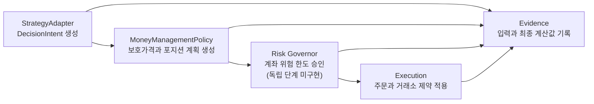

# 전략 작성 및 자금관리 정책 개발 규범

## 1. 문서 목적

이 문서는 `trading-system-v2`의 신규 전략 작성, 기존 전략 리팩터링, 자금관리
정책 개발 및 관련 코드 리뷰에 적용하는 규범 문서다. 전략 작성자는 이 문서를
따라야 하며, 플랫폼 구현자는 등록·설정 해석·실행·Evidence 단계에서 전략이
규범을 준수하는지 검증해야 한다.

이 규범은 지금의 `trading-system-v2`에 맞는 상태를 정의한다. 최종 목표는
TradingView에서 전략을 작성하는 것과 같은 수준까지 넓히는 것이며, 그 확장은
`trading-system-v2`의 발전과 함께 진행한다.

이 문서의 규칙 가운데 코드가 아직 강제하지 않는 것이 있다. 규칙이 적혀 있다는
사실만으로 동작이 보장된다고 가정하지 않으며, 강제되지 않는 규칙은 검사로 직접
확인한다. §9의 필수 테스트가 그 확인의 자리다.

이 문서는 전략을 어떻게 쓰고 무엇을 지켜야 하는지의 규칙을 소유한다. 지표와
캔들 패턴의 계산은 `docs/references/technical_indicators_calc_spec.md`와
`docs/references/candlestick_pattern_calc_spec.md`가 소유하고, 코드의 구조와
클래스 관계와 실행 순서는 `docs/fullspec/backtest_v2_detailed_design.md`가
보인다. 같은 사실을 두 곳에 적지 않는다.

**전략을 쓰는 데 설계서를 읽을 필요는 없다.** 설계서는 플랫폼 자체를 고칠 때
보는 문서다. 전략 작성자에게 필요한 것은 이 문서와, 기반 클래스가 요구하는
자리와, 레지스트리에 등록된 계열 목록뿐이다.

**구현 현황은 이 문서에 담지 않는다.** 어느 클래스가 무엇을 반환하는지, 어느
열에 무엇이 기록되는지는 구조이며 설계서가 소유한다. 현황을 규범에 적으면 코드가
바뀔 때마다 낡고, 낡아도 드러나지 않는다.

## 2. 전략이 반드시 지켜야 하는 것

아래를 지키지 않으면 전략이 구현되지 않는다. 여기서 "구현되지 않는다"는 성능이
나쁘다는 뜻이 아니라 **만들어지지 않거나 실행되지 않는다**는 뜻이다.

- 기반 클래스를 상속했다면 `get_metadata`·`get_parameter_schema`·`analyze`를
  모두 구현한다. 하나라도 비우면 전략 인스턴스가 만들어지지 않는다.
- 레지스트리에 등록된 계열만 선언한다. 등록된 지표 조합과 캔들 패턴 밖을
  선언하면 계열 해석이 거부한다.
- 파라미터 스키마를 지킨다. 모르는 이름도, 빠뜨린 필수 항목도, 형이 맞지 않는
  값도 설정 해석이 거부한다.
- 쓸 자금관리 정책을 메타데이터에 선언한다. 선언하지 않은 정책으로는 실행할 수
  없고, 청산 신호를 내지 못하는 전략은 Turtle 정책을 쓸 수 없다.
- 코드의 선언과 `signal_db.strategy_registry` 등록을 같게 유지한다. 클래스
  이름과 모듈 경로와 warm-up과 지원 timeframe과 계열 선언을 대조하며, 어긋나면
  실행이 거부된다. 비활성이거나 폐기 표시된 전략도 실행할 수 없다.

**위 다섯은 어기는 즉시 드러나므로 따로 확인하지 않아도 된다.** 규칙을 기억해서
지키는 것과 어기면 멈추는 것은 다르며, 위 다섯은 뒤쪽이다.

### 2.1 지켜야 하지만 어겨도 드러나지 않는 것

아래도 반드시 지켜야 한다. 다만 어겨도 **아무 일 없이 통과하므로 직접 확인해야
한다.** §9의 필수 테스트가 그 확인의 자리이며, 확인하지 않으면 잘못된 전략이
그대로 실행된다.

- §9.1이 요구하는 여섯 성질. 결정성, 자금관리 정책을 바꿔도 판단이 같을 것,
  확정되지 않은 캔들과 미래 지표를 쓰지 않을 것, 금지된 의존이 없을 것, 선언한
  계열과 실제로 읽는 계열이 일치할 것, 진입을 내면 유효한 청산도 낼 것이다.
- 세 메서드의 시그니처를 맞춘다. 이름만 같으면 통과하므로 인자나 반환형이
  어긋나도 실행 도중에야 드러난다.
- 전략 판과 파라미터 기본값과 프로파일을 등록과 맞춘다. 등록 대조가 이 셋은
  보지 않는다.

**이 목록은 줄어드는 것이 정상이다.** 공통 검사가 들어오면 여섯 성질이 §2로
옮겨 간다. 옮겨 갈 때 이 절을 함께 고친다.

## 3. 핵심 원칙

전략은 무엇을 언제 거래할지 결정한다. 자금관리 정책은 한 거래에서 얼마나
위험을 부담할지 결정한다. 공통 리스크 가드는 계좌 전체의 허용 범위를 강제하고,
실행 계층은 주문과 거래소 제약을 처리한다.

다음 책임 경계는 필수다.

| 계층         | 소유하는 책임                                          | 소유하면 안 되는 책임                            |
| ---------- | ------------------------------------------------ | --------------------------------------- |
| 전략 Adaptee | 진입·청산 판단, 판단에 필요한 지표와 timeframe, 전략 고유 파라미터      | 수량, 계좌 위험 금액, 증거금, 최종 leverage, 거래소 반올림 |
| 자금관리 정책    | 최초 보호가격, 선택적 목표가격, 거래당 위험에 따른 목표 수량, leverage 요청 | 진입 edge, 계좌 전체 노출 승인, 주문 전송             |
| 공통 리스크 가드  | 계좌 전체의 위험 상한과 거래 승인                              | 전략 신호 생성, 목표가 선택                        |
| 실행 계층      | 주문 변환, 수량·가격 단위 반올림, 수수료·증거금·청산 안전성, 체결          | 전략 판단, 위험예산 확대                          |
| Engine     | 위 계층의 결정적 순서와 Evidence 기록                        | 전략별 수식 복제                               |



### 3.1 공통 리스크 가드는 아직 독립 계층이 아니다

위 표와 흐름도의 공통 리스크 가드는 **목표 상태다.** 지금은 그 이름의 계층이
없고, 계좌 전체를 보고 거래를 승인하거나 거절하는 단계도 실행 순서에 없다.

지금 있는 것은 `RiskLimits` 하나이며 거래당 위험 비율과 유지증거금률과 최대
leverage 셋을 담는다. 자금관리 정책이 계획을 세울 때 그 값을 인자로 받아 스스로
지키며, 정책 밖에서 다시 검사하지 않는다.

**종목별·방향별·상관군별 상한은 아무 데도 없다.** 여러 종목을 함께 보고 판단하는
자리 자체가 없으므로, 같은 방향으로 여러 종목에 동시에 들어가는 것을 막지 못한다.

**전략 작성자는 이 보호가 있다고 가정하면 안 된다.** 계좌 전체를 지켜 주는 것은
지금 거래당 위험 비율과 최대 leverage뿐이다.

## 4. 전략 작성 규칙

### 4.1 전략은 판단 전용이어야 한다

전략은 확정된 캔들과 Engine이 전달한 사전 계산 지표만 사용해야 한다. 전략은
stateless이고 같은 입력과 설정에서 같은 판단을 반환해야 한다.

전략 코드에서는 다음 작업을 금지한다.

- 데이터베이스, 파일, HTTP API 또는 거래소를 직접 읽거나 쓴다.
- wall clock이나 전역 mutable state를 사용한다.
- 아직 닫히지 않은 캔들 또는 미래 캔들을 참조한다.
- 주문 수량, 계좌 자산 기반 위험 금액, 증거금 또는 최종 leverage를 계산한다.
- 주문을 만들거나 Broker 또는 서비스 구현을 호출한다.
- `backtest_service`, `web_api` 또는 다른 서비스 패키지를 import한다.

전략은 진입과 청산 판단을 명시적인 `DecisionIntent`로 반환하는 목표 방식을
따른다. 방향을 보호가격의 상대 위치로 추론하게 만들지 않는다.

`StrategyAdapter` Protocol이 규범 정책이며 `StrategyBase`는 그 정책을 만족하도록
제공하는 선택적 편의 기반 클래스다.

```python
@dataclass(frozen=True, slots=True)
class DecisionIntent:
    action: Literal["ENTER_LONG", "ENTER_SHORT", "EXIT", "HOLD"]
    symbol: str
    timestamp: datetime
    reference_price: float
    confidence: float
    reason: str
    metadata: Mapping[str, object]
```

신규 전략은 `DecisionIntent`에 `quantity`, `stop_loss`, `take_profit`,
`leverage` 또는 계좌 상태를 넣지 않는다. 목표 방식이 구현되기 전까지 기존
`TradingSignal`을 사용해야 하는 변경은 legacy 경계임을 코드와 테스트에
명시하고, 새로운 자금관리 수식을 전략에 추가하지 않는다.

### 4.2 전략 파라미터와 자금관리 파라미터를 분리한다

전략 파라미터에는 진입·청산 edge를 바꾸는 값만 둔다. 다음 이름은
자금관리 정책 소유이므로 신규 전략의 `ParameterSchema`에서 금지한다.

- `leverage`
- `reward_risk`
- `atr_stop_multiple`
- `risk_per_trade`
- `position_size_pct`
- `margin`
- `quantity`

과거 전략의 동일 이름은 마이그레이션 기간에만 허용한다. 호환 normalizer가
이를 `manual` 정책 설정으로 옮긴 뒤, 정규화된 설정을 Evidence에 기록해야 한다.

### 4.3 지원 자금관리 정책을 선언한다

전략 메타데이터는 사용할 수 있는 정책과 필요한 capability를 선언해야 한다.

```python
MoneyManagementSupport(
    supported=("manual", "turtle"),
    default="manual",
    supports_external_stop=True,
    supports_external_take_profit=True,
    supports_signal_exit=True,
    supports_pyramiding=False,
)
```

정책이 요구하는 capability를 전략이 제공하지 않으면 Adapter Manager가 전략
생성 단계에서 실패해야 한다. 실행 도중 임의의 fallback으로 바꾸면 안 된다.

Turtle 정책은 고정 take-profit을 사용하지 않고 전략의 청산 신호를 사용한다.
따라서 `supports_signal_exit`가 `False`인 전략에는 Turtle 정책을 선택할 수
없다. 피라미딩을 지원하지 않는 실행 경로에서는 피라미딩을 조용히 흉내 내지
않고, 지원하지 않는 capability로 명시한다.

### 4.4 지표 요구사항은 조합한다

전략과 자금관리 정책은 각자 필요한 지표를 선언한다. Engine은 두 목록을
합치고 identifier 기준으로 중복을 제거한 뒤 가장 긴 warm-up을 적용한다.

```text
required indicators = strategy indicators ∪ money-management indicators
required warm-up = max(strategy history, every indicator history)
```

정책이 1일 timeframe의 `N`을 요구하고 전략이 1시간 timeframe에서 실행되는
경우에는 명시적인 multi-timeframe 입력 정책이 필요하다. 단순히 1시간 ATR을
사용하면서 역사적 Turtle 규칙과 동일하다고 표시하면 안 된다.

### 4.5 선언이 곧 확보할 과거 데이터의 양이다

실행이 읽어 오는 과거 데이터의 범위는 위 선언에서 계산한다. 선언이 부족하면
지표가 값을 내지 못하거나 정책이 요구한 계열이 비어 실행이 실패한다. 선언이
과하면 매 실행이 필요 없는 이력을 읽는다.

계산은 두 축을 모두 본다. 하나는 개수이고 다른 하나는 그 개수가 걸치는
달력 구간이다. 20일 `N`은 20이라는 개수만으로는 부족하고, 1시간봉 전략에서
20일에 해당하는 구간을 읽어야 한다. 그래서 각 요구의 개수를 그 요구가 선언한
timeframe으로 환산하고 그중 가장 넓은 구간을 취한다.

```text
확보 구간 = max(
    strategy timeframe × required warm-up,
    각 지표 요구에 대해  그 요구의 timeframe × 그 요구의 기간
)
```

이 계산은 최적화이며 정확성의 근거가 아니다. 계산한 구간으로 읽었는데 선언한
warm-up을 채우지 못하면 구현은 구간 제한을 풀고 다시 읽어야 한다. 결측이 있는
구간에서는 같은 개수를 얻는 데 더 넓은 달력 구간이 필요하기 때문이다.

### 4.6 등록은 Adaptee와 일치해야 한다

전략은 코드의 선언과 별개로 `signal_db.strategy_registry`에 등록한다. 등록에는
`min_history`, `required_indicators_json`, `supported_timeframes`가 들어간다.
운영자와 콘솔이 코드를 읽지 않고도 그 전략이 무엇을 요구하는지 알 수 있게 하기
위해서다.

두 곳에 같은 사실이 있으므로 **Adaptee의 선언이 정본이고 등록은 그 사본이다.**
`AdapterManager`는 카탈로그 조회 직후 등록 값과 Adaptee의 메타데이터를 대조하고,
어긋나면 실행을 거부한다. 어느 쪽이 낡았는지 구현이 판단할 수 없으므로 조용히
한쪽을 택하지 않는다.

지표 목록은 순서와 키 순서를 무시하고 이름과 파라미터로만 비교한다. 등록의
표현 방식이 달라도 같은 요구면 통과한다.

전략을 바꿀 때는 코드와 등록을 같은 변경으로 함께 옮긴다. 자금관리 정책으로
책임이 옮겨 간 지표는 전략 등록에서 빼야 한다. 예를 들어 ATR 손절이 `manual`
정책 소유가 되었다면 전략의 `required_indicators`에서 ATR이 사라지고, 등록도
그에 맞춰 갱신되어야 한다.

### 4.7 지표는 등록된 조합만 선언할 수 있다

지표는 이름과 파라미터의 조합 단위로 레지스트리에 등록되어 있다. 등록되지 않은
조합은 선언할 수 없고 조회 시점에 거부된다. 새 조합이 필요하면 전략 작업과
같은 변경에서 지표 레지스트리에 먼저 추가한다.

## 5. 자금관리 정책

### 5.1 공통 Protocol

`MoneyManagementPolicy`는 `core_lib`에 두는 stateless Protocol이다. 정책
구현은 서비스, 데이터베이스 또는 Broker를 직접 참조하지 않는다.

```python
class MoneyManagementPolicy(Protocol):
    id: str
    version: str

    def required_indicators(self) -> tuple[IndicatorSpec, ...]: ...

    def plan_entry(
        self,
        decision: DecisionIntent,
        market: MarketSnapshot,
        account: AccountRiskSnapshot,
        global_limits: RiskLimits,
    ) -> MoneyManagementPlan: ...
```

`AccountRiskSnapshot`은 Engine이 한 시점의 불변 값으로 제공한다. 정책은
계좌를 조회하거나 변경하지 않는다.

```python
@dataclass(frozen=True, slots=True)
class MoneyManagementPlan:
    stop_loss: float
    take_profit: float | None
    requested_quantity: float
    requested_leverage: int
    initial_risk_amount: float
    diagnostics: Mapping[str, object]
```

공통 리스크 가드는 이 계획을 승인하거나 축소하거나 거부할 수 있다. 정책이
계산한 값은 전역 위험 상한을 확대할 수 없다. 실행 계층은 거래소 단위와
증거금·청산 제약을 적용한 최종값을 별도로 기록한다.

### 5.2 정책 선택과 의존성 주입

정책은 `MoneyManagementRegistry`가 `mode`로 조회하고
`MoneyManagementFactory`가 검증된 설정으로 생성한다. Adapter Manager는
전략과 정책을 하나의 runtime으로 조합한다.

의존성 주입 대상은 전략의 판단 클래스 자체가 아니라 runtime 조합이다. 이렇게
해야 전략이 계좌 상태를 알지 못하면서도 동일한 전략 판단에 서로 다른 정책을
적용할 수 있다.

```python
@dataclass(frozen=True, slots=True)
class StrategyRuntime:
    strategy: StrategyAdapter
    money_management: MoneyManagementPolicy
```

manual과 Turtle 모드에서 동일한 시장 입력을 사용하면 전략이 만든
`DecisionIntent`는 동일해야 한다. 정책이 만든 보호가격, 수량 및 leverage만
달라질 수 있다.

## 6. 설정 정책

`money_management`는 느슨한 dictionary가 아니라 `mode`로 구분되는
discriminated union으로 검증한다.

### 6.1 Manual 정책

```json
{
  "money_management": {
    "mode": "manual",
    "leverage": 3,
    "reward_risk": 2.0,
    "atr_stop_multiple": 1.5
  }
}
```

Manual 정책은 현재 Vessel 동작과 동일한 보호가격과 leverage를 만들어야 한다.
첫 구현의 통과 조건은 기존 golden 테스트와 결과가 동일한 것이다.

### 6.2 Turtle 정책

```json
{
  "money_management": {
    "mode": "turtle",
    "n_period": 20,
    "n_timeframe": "1d",
    "stop_n_multiple": 2.0,
    "leverage_cap": 10
  }
}
```

플랫폼의 `turtle` 모드는 Turtle에서 유래한 변동성 정규화 자금관리 정책이며,
플랫폼의 거래당 최대 손실 1% 규율을 우선한다. 역사적 Turtle 시스템 전체와
같다고 주장하지 않는다. breakout entry, channel exit 및 피라미딩까지 구현한
전략은 별도 strategy capability와 version으로 선언해야 한다.

Turtle 정책은 다음 순서로 계산한다.

1. 확정된 1일 캔들만 사용해 `N`을 계산한다. True Range는
 `max(high - low, abs(high - previous_close), abs(low - previous_close))`다.
 최초 `N`은 첫 20개 True Range의 평균이고, 이후 값은
 `(19 × previous_N + current_true_range) ÷ 20`이다.
2. 최초 손절거리를 `stop_n_multiple × N`으로 계산한다.
3. 위험예산을 현재 equity와 전역 `risk_per_trade` 상한으로 계산한다.
4. 목표 수량을 `위험예산 ÷ 손절거리`로 계산한다.
5. 목표 수량에 필요한 최소 정수 leverage를 계산하되 `leverage_cap`을 넘지
 않는다.
6. 예상 청산가가 보호 손절보다 먼저 도달하면 계획을 거부한다.
7. 고정 take-profit은 만들지 않고 전략의 청산 신호를 사용한다.

`risk_per_trade`는 RunConfig의 전역 hard limit이다. 정책별 설정이 이 값을
중복 소유하거나 확대하면 안 된다.

1시간 전략이 시각 `t`에 판단할 때는 `t` 이전에 완전히 닫힌 가장 최근 1일
캔들의 `N`만 사용할 수 있다. 현재 진행 중인 일봉의 high, low 또는 close를
참조하면 look-ahead 위반이다.

역사적 Turtle 규칙에서는 1N 움직임을 equity의 1% 단위로 보았지만, 이
플랫폼의 `turtle` v1은 손절 도달 시 손실을 전역 1% 상한 안에 둔다. 따라서
정책 id와 version을 Evidence에 기록하고 역사적 Turtle 전체 시스템과 동일한
성과를 주장하지 않는다.

### 6.3 하위 호환성

`money_management`가 없는 기존 설정은 `manual`로 해석한다. 과거의 평면
`leverage`, `reward_risk`, `atr_stop_multiple` 값은 동일 값의 manual 설정으로
정규화한다.

호환 해석에는 명시적인 schema version이 있어야 한다. Evidence에는 사용자가
제출한 원본 설정과 실행에 사용된 정규화 설정을 모두 기록한다. 과거 실행을
재생할 때는 당시 schema version을 사용해야 하며 최신 기본값으로 조용히
재해석하면 안 된다.

## 7. UI와 API 규칙

UI는 전략 메타데이터가 허용한 정책만 보여준다.

- `Turtle 자동 관리`를 선택하면 leverage, reward risk 및 ATR 배수 입력을
숨긴다.
- `직접 설정`을 선택하면 기존 세 입력을 표시한다.
- 숨긴 값 대신 선택한 정책 id, version 및 핵심 resolved 설정을 요약한다.
- 실행 전에 계산할 수 없는 ATR, 수량 및 leverage를 예상 확정값처럼 표시하지
않는다.
- 실행 후에는 각 거래 Evidence의 실제 `N`, 위험예산, 수량, requested
leverage 및 final leverage를 보여준다.

OpenAPI는 discriminated union을 그대로 노출해야 하며 프런트가 mode별 타입을
수동으로 재정의하면 안 된다.

## 8. Evidence와 재현성

run 수준 Evidence에는 다음 값을 기록한다.

- strategy id와 version
- money-management policy id와 version
- 원본 policy 설정
- 정규화된 policy 설정
- strategy와 policy를 합친 indicator 목록 및 warm-up
- global risk limits

entry 후보와 실제 거래 수준 Evidence에는 다음 값을 기록한다.

- 판단 시점의 reference price와 사용한 지표 timestamp
- 실제 `N` 또는 ATR과 stop distance
- equity, available cash 및 risk budget
- requested quantity와 최종 quantity
- requested leverage와 최종 leverage
- liquidation safety 검사 결과
- 공통 리스크 가드의 승인, 축소 또는 거부 사유

비밀, 전체 DSN 또는 API key는 Evidence와 오류에 포함하지 않는다.

## 9. 필수 테스트

### 9.1 전략 규범 테스트

- 같은 입력과 설정에서 같은 `DecisionIntent`를 반환한다.
- manual과 Turtle 정책을 바꿔도 전략 판단이 달라지지 않는다.
- 확정되지 않은 캔들과 미래 지표를 사용할 수 없다.
- 데이터베이스, 네트워크, 파일, 서비스 패키지 import가 없다.
- metadata, parameter schema 및 실제 indicator 접근이 일치한다.
- 진입을 만들 수 있는 전략은 유효한 청산 판단도 제공한다.

### 9.2 정책 단위 테스트

- Manual 정책이 기존 Vessel의 stop, target 및 leverage와 정확히 같다.
- Turtle 정책이 `N`, stop distance, risk budget, quantity 및 최소 leverage를
경계값에서 올바르게 계산한다.
- 수량 반올림 후에도 최대 손실이 전역 상한을 넘지 않는다.
- leverage cap, 현금 부족 및 청산 안전성 실패를 명시적으로 거부한다.
- NaN, 0 또는 음수인 가격·ATR·equity 입력을 거부한다.
- 정책은 입력 객체를 변경하지 않는다.

### 9.3 조합 및 회귀 테스트

- Adapter Manager가 전략과 허용된 정책만 조합한다.
- 전략과 정책의 indicator 요구사항을 합치고 warm-up을 올바르게 계산한다.
- legacy 설정이 manual 정책으로 정규화되고 기존 golden 결과를 유지한다.
- 동일한 resolved 설정이 동일한 config hash를 만든다.
- Evidence가 policy version과 실제 계산값을 빠짐없이 포함한다.
- API와 생성된 프런트 타입이 mode별 필드를 정확히 제한한다.

실거래, 거래소 네트워크 및 운영 데이터 쓰기는 테스트에서 금지한다.

## 10. 전략 개발 완료 체크리스트

새 전략 또는 전략 변경은 아래 항목을 모두 만족해야 완료된다.

- [ ] 전략이 진입·청산 edge만 소유한다.
- [ ] 전략 파라미터와 자금관리 파라미터가 분리되어 있다.
- [ ] 지원 정책과 capability를 metadata에 선언했다.
- [ ] 필요한 지표, timeframe 및 warm-up을 정확히 선언했다.
- [ ] 선언한 지표 조합이 지표 레지스트리에 등록되어 있다.
- [ ] `signal_db.strategy_registry` 등록이 Adaptee 선언과 일치한다. 정책으로

  책임이 옮겨 간 지표는 전략 등록에서 제거했다.
- [ ] 선언한 요구를 가장 넓은 timeframe 기준으로 환산해도 확보 구간이 충분하다.
- [ ] 같은 판단 입력에서 정책 mode와 무관하게 같은 판단을 만든다.
- [ ] look-ahead와 same-bar 체결 누수가 없다.
- [ ] manual 호환성과 선택한 정책의 경계값 테스트가 있다.
- [ ] 수량과 leverage가 공통 리스크 상한 및 청산 안전성을 통과한다.
- [ ] policy id, version, resolved 설정과 실제 계산값이 Evidence에 남는다.
- [ ] 백테스트, paper 및 live가 같은 core policy 구현을 사용한다.
- [ ] 관련 pytest, ruff 및 mypy 검사가 통과한다.

## 11. 구현 순서

정책 변경은 아래 순서를 지킨다.

1. `DecisionIntent`, policy Protocol, policy 설정 union 및 capability metadata를
 테스트와 함께 추가한다.
2. 현재 결과와 동일한 `ManualMoneyManagement`와 legacy normalizer를 추가한다.
3. Engine이 strategy runtime과 공통 리스크 가드를 조합하도록 변경한다.
4. Manual mode golden 결과가 기존과 동일함을 확인한다.
5. Turtle 정책과 multi-timeframe `N` 입력을 추가한다.
6. API와 UI에 정책 선택 및 Evidence 표시를 추가한다.
7. 기존 전략에서 legacy 자금관리 필드를 제거하되 호환 reader는 정한 지원
 기간까지 유지한다.

Manual 결과 parity가 확인되기 전에 Turtle 정책 또는 UI 기본값을 활성화하면
안 된다. 새 정책을 기본값으로 바꾸는 작업은 별도의 결과 비교와 승인 대상이다.