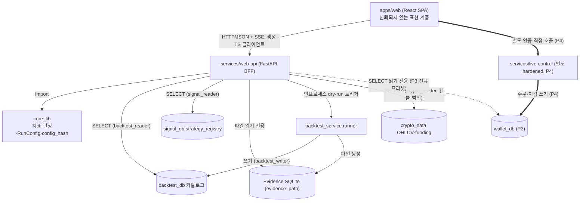

# WebUI 백엔드 API 설계 (`services/web-api`)

이 문서는 WebUI에 붙일 백엔드 API 정책을 개발 착수 전에 확정한다. 방향은 `docs/webui-direction.md`,
화면 설계는 `docs/webui-ux-design.md`, 교차 정합과 보완은 `docs/webui-predev-plan.md`에 있다. 설계는
실제 데이터 모델(카탈로그 `backtest_db`, 21개 엔티티 Evidence, `RunConfig`, `strategy_registry`,
`core_lib.eval`, `runner.run_backtest`)에 근거한다.

직렬화 규약을 셋으로 못 박는다. 첫째, 실제로 돈이 오간 금액은 Decimal이며 JSON에서 문자열로 낸다
(카탈로그 `NUMERIC`과 Evidence의 1e8 스케일 정수 양쪽). 둘째, 성과 지표(수익 인수·소르티노 등)는
통계량이라 JSON 숫자로 낸다. 셋째, Evidence의 시각은 epoch 밀리초 정수로 저장되므로 API 경계에서
ISO-8601 UTC 문자열로 변환해 낸다.

## 1. 노드·의존·순환·결합

새 HTTP API 계층(`services/web-api`)과 새 데이터 흐름을 도입하므로 위상을 먼저 드러낸다.

읽기 중심 연구·백테스트 세계는 방향성 비순환이다. 시장 데이터에서 `core_lib`을 거쳐 카탈로그·Evidence로
가고, 그 저장물을 `web-api`가 읽어 SPA에 표시하는 방향으로만 흐른다. 백테스트 트리거조차 카탈로그·
Evidence에 새 run을 덧붙이는 전방향 동작일 뿐 데이터·피처·신호로 되돌아가지 않는다. 유일한 순환은
사람이 낀 라이브 제어 루프 하나뿐이다. 결정적 위상 규칙은 연구 API가 이 순환에 들어가는 엣지를 아예
갖지 못하게 하는 것이다. `web-api`는 `live-control`을 import·호출하지 않으며, SPA가 제어 명령을 낼
때는 `web-api`를 거치지 않고 별도 인증으로 `live-control`을 직접 호출한다.

결합은 넷이다. `web-api`와 `core_lib`의 강결합은 의도된 것(진실 재사용, 단일 표준)이며 보존 대상이다.
`web-api`와 Evidence 스키마의 결합은 복원·직렬화를 Evidence 헬퍼(`restore_decimal`)로만 수행하고
스키마 버전(`EVIDENCE_SCHEMA_VERSION`)을 응답 메타로 노출해 완화한다. 응답 모델과 카탈로그 DDL의
결합은 pydantic 모델이 컬럼을 거울처럼 반영하고 그 모델에서 OpenAPI·TypeScript를 자동 생성해 한
커밋으로 세 계층이 함께 움직이게 해 완화한다(모노레포 근거). 트리거 경로의 동시성 결합은 실행을
백그라운드 작업으로 넘겨 상태를 SSE로 스트리밍하고, 스윕·워크포워드는 개별 `run_backtest`가 아니라
`build_harness`의 단일 `Harness`로 실행해 완화한다.

재확인한 현행 사실: `backtest_summary`는 finalize에서만 생기므로 `RUNNING`·`FAILED`·`ORPHANED` run에는
요약이 없다(대응 0..1). `evidence_hash`가 비면 finalize 미완이다. run 상태 전이는 되돌아가지 않는다.
`RunConfig`는 `market_type`을 소문자로 받고 카탈로그는 대문자로 저장한다. `fill_timing`은 `next_bar`만,
`trigger_feed`는 `tf_candle`만 백테스트에서 유효하다.

## 2. 리소스 모델

API 명사는 저장소 세 종류에 대응한다. 카탈로그 행(run을 열지 않는 목록·필터·판정), run별 Evidence
SQLite(상세 근거), `run_backtest`/`Harness` 호출(새 run 생성). 전략 목록만은 `signal_db` 레지스트리다.

| 리소스 | 저장 대응 | 읽기/쓰기 |
|---|---|---|
| `runs`(목록·헤더) | `backtest_run` | 읽기 |
| `runs/{id}/summary` | `backtest_summary`(0..1) | 읽기 |
| `runs/{id}/prereg` | `backtest_prereg` | 읽기(+P2 쓰기) |
| `runs/{id}/tags` | `backtest_tag` | 읽기(+P2 쓰기) |
| `runs/{id}/trades` `.../executions` `.../funding-settlements` | Evidence `TRADE`·`EXECUTION`·`FUNDING_SETTLEMENT` | 읽기 |
| `runs/{id}/equity` `.../positions` `.../chart-summaries` | Evidence `PORTFOLIO_PNL`·`POSITION`·`CHART_SUMMARY` | 읽기 |
| `runs/{id}/signals` `.../decisions` `.../indicator-snapshots` | Evidence `SIGNAL`·`DECISION`·`INDICATOR_*` | 읽기 |
| `runs/{id}/integrity-checks` `.../outcome-buckets` | Evidence `INTEGRITY_CHECK`·`OUTCOME_BUCKET` | 읽기 |
| `runs/{id}/candles` | `crypto_data` OHLCV(run 범위) | 읽기 |
| `runs/{id}/findings` `.../missed-opportunities` `.../drawdown-episodes` `.../candidate-events` `.../trade-features` `.../conditional-expectancy` | Evidence 확장 7 엔티티 | 읽기 |
| `strategies` | `signal_db.strategy_registry` | 읽기 |
| `run-config:validate` | `RunConfig.model_validate` | 계산 |
| `runs`(POST) `sweeps` | `run_backtest`·`build_harness` | 쓰기(dry-run) |
| `runs/{id}/metrics:recompute` | `core_lib.eval` | 계산 |
| `data-sources/{ds}/coverage` `tags/facets` | `crypto_data`·`backtest_tag` | 읽기 |
| `live/*`(P3) `live-control/*`(P4) | `wallet_db` 읽기·별도 서비스 | 게이트 |

## 3. 횡단 정책

**URL·봉투.** 모든 엔드포인트는 `/api/v1` 아래. 목록 응답은 `data`(항목 배열)와 `page`(`limit`·
`offset`·`total`·`has_more`) 봉투로 감싸고, 단일 리소스는 봉투 없이 DTO를 그대로 낸다.

**페이지·필터·정렬.** 페이지네이션은 오프셋(`limit` 기본 50·최대 200, `offset`)을 기본으로, 큰
목록은 커서(`created_at`+`run_seq`)를, Evidence 시계열은 `after_seq` 커서를 우선한다. 필터는 컬럼
화이트리스트로만 받는다(run 목록은 `strategy_id`·`symbol`·`timeframe`·`exchange`·`market_type`·
`status`·`decision_route`·`gate_passed`·`sweep_id`·`config_hash`·기간·`created_at` 구간 — 모두
카탈로그 실제 인덱스와 정렬). 정렬은 `sort` 화이트리스트(`created_at`·`pf`·`sortino`·`net_pnl_total`
등)에 접두 `-`로 내림차순.

**오류 모델.** 본문은 `error` 객체(`code`·`message`·`details`). 잘못된 쿼리는 400, `RunConfig` 위반은
422(`details`에 pydantic `loc`·`msg`), 없는 run은 404, Evidence 파일이 카탈로그엔 있으나 물리적으로
없거나 손상되면 `evidence_unavailable`(409/410 계열)로 404와 구분. 요약이 없는 run은 404가 아니라
200에 `summary: null`과 `summary_status`로 "성과 없는 run"과 "없는 run"을 구분한다.

**타입 파이프라인·버전.** pydantic 응답 모델 → FastAPI OpenAPI 자동 생성 → `openapi-typescript`/`orval`로
TypeScript 클라이언트 생성 → `apps/web`은 생성 타입만 소비. Decimal 필드는 pydantic에서 `str`로 노출하고
OpenAPI `format: decimal`을 붙여 프런트가 산술하지 못하게 막는다. 필드 추가는 비파괴(재생성만),
필드 제거·이름/타입 변경은 파괴(새 접두사 또는 `deprecated: true` 한 릴리스 유예).

**SSE.** 두 곳. dry-run 실행 상태 스트림(`run_id`·`status`·`updated_at`, finalize 후 `evidence_hash`·
`decision_route` 덧붙임)과 라이브 모니터링 스트림(P3, `wallet_db` 읽기 전용). 진짜 양방향이 필요할
때만 websocket. Engine이 세밀한 진행률을 내보내지 않으므로 초기엔 카탈로그 상태 전이 수준의 굵은
통지로 시작한다.

**DB 역할·Evidence 접근.** 조회는 `backtest_reader`(SELECT)·`signal_reader`(SELECT)·캔들은
`crypto_reader`(SELECT). dry-run 트리거만 `backtest_writer`(카탈로그 등록). 조회용 읽기 전용 풀과
트리거용 쓰기 연결(작업 워커 내에서만)을 물리적으로 분리한다. Evidence는 `evidence_path`의 파일을
읽기 전용(`?mode=ro`, `PRAGMA query_only=ON`)으로 연다. 파일 물리 접근 배치는 열린 결정
(`webui-predev-plan.md` 3절).

**인증 경계.** 내부·개인용이라 읽기·dry-run은 최소 인증(단일 사용자 토큰). 라이브 제어 명령은 하드
게이트 뒤이며 결정적으로 `web-api`에 살지 않는다 — 별도 프로세스·별도 자격증명의 `services/live-control`.
라이브 모니터링(P3)조차 `wallet_db` 읽기를 요구하므로 별도 프리셋·자격증명 결정이 선행된다.

## 4. 단일 표준 준수

API는 지표·판정을 `core_lib` 밖에서 재유도하지 않는다. 저장된 값(요약 지표·`gate_verdict`·
`decision_route` 등)은 `backtest_summary`를 읽어 낼 뿐 재계산하지 않고, 화면용 시계열은 Engine이
finalize에서 사전 집계한 `CHART_SUMMARY`를 우선 읽는다. 저장 요약으로 답할 수 없는 새 산출(거래
부분집합 지표 등)은 반드시 `core_lib.eval.metrics.compute`·`trade_r_multiples`·`daily_returns`·
`risk_of_ruin`, `thresholds.is_pass`, `decision.decide`를 호출한다. 파산확률 고정 시드 부트스트랩과
`config_hash` 23필드 해싱처럼 재현이 어려운 계산은 특히 `core_lib`에서만 나오게 한다. 클라이언트는
순수 표현 계층이며 Decimal 문자열 규약이 이를 타입 수준에서 강제한다.

## 5. 단계별 엔드포인트 명세

### P0 — 카탈로그 브라우즈

- **GET `/api/v1/runs`** — run 목록을 필터·정렬·페이지로 조회. `backtest_run`에 `backtest_summary`를
  `run_id`로 왼쪽 외부 조인(요약 없으면 지표 null). 항목 DTO는 목록용 얇은 필드(`run_id`·`run_name`·
  `status`·`strategy_id`·`strategy_name`·`symbol`·`exchange`·`timeframe`·`market_type`·`period_start`·
  `period_end`·`created_at`·`sweep_id`·`config_hash`)와 요약 파생(`trade_count`·`pf`·`sortino`·
  `calmar_or_mar`·`sqn`·`mdd`·`ror`·`win_rate` 숫자, `net_pnl_total` 문자열, `gate_verdict`·
  `decision_route`·`integrity_status`·`data_coverage_ratio`)에 `summary_present`.
- **GET `/api/v1/runs/{run_id}`** — run 헤더(재현 입력 전부)를 조회. `backtest_run` 한 행을 거의 그대로
  반영(신원·전략·대상·구간·실행 규약·자본/사이징·결정성 해시·프로파일·묶음·Evidence 연결·진단·시각).
- **GET `/api/v1/runs/{run_id}/summary`** — 성과·판정 요약. `backtest_summary`(0..1). 없으면 200에
  `summary: null`과 `summary_status`. 있으면 표본·지표(숫자)·금액(문자열)·데이터 품질·무결성·판정·
  과최적화 방어(`oos_degradation`·`psr`·`harness_json`) 전 컬럼. 저장값만 읽고 재계산 없음.
- **GET `/api/v1/strategies`**·**`/strategies/{id}`** — `signal_db.strategy_registry` 조회(기본
  `is_active AND NOT is_deprecated`). `display_name`·`supported_timeframes`·`required_indicators_json`·
  `min_history`·`default_params_json` 등.
- **GET `/api/v1/health`** — 카탈로그·레지스트리 연결과 `core_lib`·Evidence 스키마 버전.

### P1 — Evidence 분석

모든 상세는 `evidence_path`로 파일을 읽기 전용으로 열고 1e8 정수를 `restore_decimal`로 복원해 문자열로,
REAL은 숫자로, epoch를 ISO-8601로 낸다. 파일 부재·미완결은 `evidence_unavailable`.

- **`/runs/{id}/trades`**(`TRADE`, 필터 `exit_reason`·`side`·`liquidated`·시각) — 진입·청산·손익·
  R-멀티플·레버리지·청산 여부. 미청산은 청산·손익 필드 null.
- **`/runs/{id}/executions`**(`EXECUTION`) — 체결(참조가·체결가·수량·수수료·슬리피지·유동성·reduce_only·
  gap_filled·qty_truncated).
- **`/runs/{id}/funding-settlements`**(`FUNDING_SETTLEMENT`) — 펀딩 정산(요율·요율 원천·정산가·이론/실제
  지급액). 부호는 저장 규약 반영.
- **`/runs/{id}/equity`**(`PORTFOLIO_PNL`, `after_seq` 커서·선택 `resolution` 다운샘플) — 자본곡선·
  드로다운(현금·포지션가치·총자본·intrabar 저점·누적 손익·비용 누계·peak·drawdown_pct).
- **`/runs/{id}/chart-summaries`**(`CHART_SUMMARY`, `series_name` 필터) — 사전 집계 시리즈
  (equity·drawdown·trade_marker·monthly_return). 화면은 원시 재계산 대신 이를 우선 소비.
- **`/runs/{id}/positions`**(`POSITION`) — 포지션 시계열(평단·마크가·미실현·레버리지·마진·청산가·펀딩 누계).
- **`/runs/{id}/signals`**·**`/decisions`**(`SIGNAL`·`DECISION`) — 신호(신뢰도·손절/익절·is_warmup)와
  판단(action·skip_reason·의도 방향/수량·위험액·계획 체결 시각). 시점 순서 검증의 진단 표면.
- **`/runs/{id}/indicator-snapshots`**(`INDICATOR_DEFINITION`·`INDICATOR_SNAPSHOT`) — 지표 정의와
  확정 캔들 스냅샷(feature_ts·value·is_warmup).
- **`/runs/{id}/integrity-checks`**(`INTEGRITY_CHECK`) — 6종(선택 7종) 검사(passed·detail_json·sample_ref).
- **`/runs/{id}/outcome-buckets`**(`OUTCOME_BUCKET`) — 결과 분류(subject_kind·bucket_name·bucket_value·r).
- **`/runs/{id}/candles`**(`crypto_data` OHLCV, `crypto_reader`, 창 파라미터) — 차트용 원천 캔들.
  (정합 보완, `webui-predev-plan.md` 2절.)
- **확장 7**: `/findings`·`/missed-opportunities`·`/drawdown-episodes`·`/candidate-events`·
  `/trade-features`·`/conditional-expectancy`. `FINDING_CLAIM`은 결정성 해시 제외 사후 주석층임을 메타에 명시.
- **GET `/api/v1/runs:compare`**(다건 `run_ids` 또는 `sweep_id`) — 여러 run 요약 지표를 나란히.
  재계산 없음.
- **POST `/api/v1/runs/{id}/metrics:recompute`** — 거래 부분집합 선택자를 받아 Evidence에서 복원 후
  `core_lib.eval`로 `MetricSet` 산출. 공식 복제 없음.

### P2 — dry-run 실행 관리

쓰기는 카탈로그(`backtest_writer`)·Evidence 파일 생성에만.

- **POST `/api/v1/run-config:validate`** — 폼 입력을 `RunConfig.model_validate`로 검증(실행 없음).
  통과 시 정규화된 반향, 위반 시 422. 최종 `config_hash`는 Engine이 지표 해석 후 산출하므로 미리보기
  포함 여부는 열린 결정.
- **POST `/api/v1/runs`** — dry-run 트리거. 검증된 `RunConfig`와 `prereg`(hypothesis·primary_metric·
  success/failure_criteria·higher_is_better·declared_by)를 받아 백그라운드 작업으로 넘기고 202와
  추적용 `job_id`·상태 스트림 URL을 반환한다. 워커가 `runner.run_backtest`를 호출하며 카탈로그
  `run_id`는 완료 시점에 성공 이벤트로 전달된다. 결과는 저장 요약으로 조회.
- **GET `/api/v1/jobs/{job_id}/events`**(SSE)·**GET `/api/v1/jobs/{job_id}/status`** — 카탈로그
  `run_id`가 생기기 전부터 `job_id`로 상태 전이 스트림·경량 폴링을 제공한다. 성공 상태는 `run_id`와
  Evidence 해시를 포함한다.
- **GET·POST `/api/v1/runs/{id}/prereg`** — 사전등록 조회·기록. 잠긴 행(`locked_at`)은 409.
- **GET·POST·DELETE `/api/v1/runs/{id}/tags`** — 분류 라벨. `(run_id, tag_type, tag_value)` 유일 제약 반영.
- **POST `/api/v1/sweeps`**·**GET `/api/v1/sweeps/{id}`** — 스윕·워크포워드·표본내외 묶음을
  `build_harness`의 단일 `Harness`로 실행. 집합 증거(`oos_degradation`·`psr`·`harness_json`)는 대표
  run(표본외 fold, 없으면 최초 발급 run) 요약에만 담기는 규약 유지.
- **GET `/api/v1/data-sources/{ds}/coverage`**·**GET `/api/v1/tags/facets`** — 트리거 폼 범위 경고·
  카탈로그 태그 필터용(정합 보완).

### P3·P4 — 라이브(개념)

P3 라이브 모니터링은 `wallet_db` 읽기 전용 역할로 포지션·주문·잔고·손익을 조회(`GET /api/v1/live/*`,
`/live/stream` SSE)하며 제어는 없다. 현재 프리셋 밖의 능력(지갑 접근)을 요구하므로 별도 하네스
프리셋·자격증명 결정이 선행되고, 지갑 스키마 컬럼은 그때 확정한다. P4 라이브 제어 엔드포인트는
`web-api`에 살지 않고 별도 hardened `services/live-control`에 격리한다(거래소 키·지갑 쓰기 자격증명은
그 서비스만 보유). SPA는 `web-api`를 우회해 `live-control`을 직접 호출한다. 제어는 최소 실제 인증·
확인·서버측 idempotency 키·자체 가드레일(최대 주문 크기·심볼 허용 목록·rate limit·kill switch)·
append-only 감사 로그 뒤에 두며 가장 마지막에 만든다.

## 6. P0 build-ready 최소 세트

`GET /api/v1/runs`(요약 왼쪽 조인)·`GET /api/v1/runs/{run_id}`(헤더)·`GET /api/v1/runs/{run_id}/summary`
(0..1)·`GET /api/v1/health`·`GET /openapi.json`(TS 생성원) 다섯이 P0 착수의 전부다. 전략 목록은 유용하나
첫 골격엔 선택. 이 세 조회 모델이 확정되면 `apps/web` 첫 화면(브라우저에서 run·지표 보기)이 생성 타입으로
즉시 붙는다.

## 7. 남은 결정

Evidence 파일 물리 접근 배치, dry-run 진행률 세밀도, `config_hash` 미리보기 포함 여부, 라이브 단계 착수
조건(별도 프리셋), 인증 강도 — 통합 목록과 단계별 gating은 `docs/webui-predev-plan.md` 3절에 있다.
